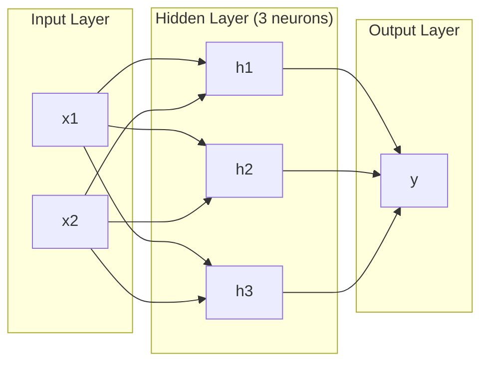
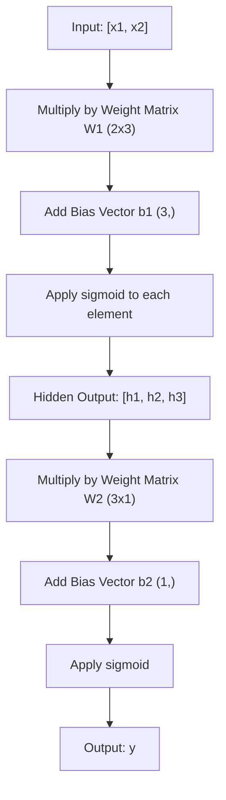
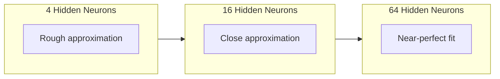

# Réseaux multicouches et passe à l'avant

> Un neurone dessine une ligne, les empiler, et vous pouvez dessiner n'importe quoi.

**Type:** Build
**Languages:** Python
**Prerequisites:** Phase 01 (Math Foundations), Lesson 03.01 (The Perceptron)
**Time:** ~90 minutes

## Objectifs d'apprentissage

- Construire un réseau multicouche à partir de zéro avec des classes de couche et de réseau qui effectuent un passage complet vers l'avant
- Tracer les dimensions de la matrice à travers chaque couche d'un réseau et identifier les désaccords de forme
- Expliquez comment l'empilage des activations non linéaires permet à un réseau d'apprendre les limites de décision courbes
- Résoudre le problème XOR en utilisant une architecture 2-2-1 avec des poids sigmoïdes réglés à la main

## Le problème

Un seul neurone est un tiroir de lignes. C'est tout. Une ligne droite à travers vos données. Tout vrai problème dans l'IA - reconnaissance d'images, compréhension du langage, jeu de Go - nécessite des courbes.

En 1969, Minsky et Papert ont prouvé que cette limitation était fatale: un réseau à couche unique ne peut pas apprendre XOR. Pas " luttes pour apprendre " - mathématiquement ne peut pas. La table de vérité XOR place [0,1] et [1,0] d'un côté, [0,0] et [1,1] de l'autre. Aucune seule ligne ne les sépare.

Cela a détruit le financement des réseaux neuronaux pendant plus d'une décennie. La solution était évidente en arrière-plan: cesser d'utiliser une couche. Empiler les neurones en couches. Laissez la première couche tailler l'espace d'entrée en nouvelles fonctionnalités, et la deuxième couche combiner ces fonctionnalités en décisions qu'aucune seule ligne ne pourrait prendre.

Cette pile est le réseau multicouche. C'est la base de tous les modèles d'apprentissage profond en production aujourd'hui. Le passage à l'avant - les données qui circulent de l'entrée à la sortie à travers les couches cachées - est la première chose que vous devez construire avant que tout autre fonctionne.

## Le concept

### Couches: entrée, cachée, sortie

Un réseau multicouche a trois types de couches:

**Input layer**Deux fonctionnalités signifient deux nœuds d'entrée.

**Hidden layers**- où le travail se produit. Chaque neurone prend chaque sortie de la couche précédente, applique des poids et un biais, puis passe le résultat par une fonction d'activation. "Caché" parce que vous ne voyez jamais ces valeurs directement dans les données de formation.

**Output layer**Pour la classification binaire, un neurone avec sigmoïde. Pour la classe multi, un neurone par classe.



C'est un réseau 2-3-1. Deux entrées, trois neurones cachés, une sortie. Chaque connexion porte un poids. Chaque neurone (sauf l'entrée) porte un biais.

Chaque couche produit un vecteur de nombres appelé état caché. Pour le texte, les états cachés augmentent la dimensionnalité - encodant un mot comme 768 nombres pour capturer une signification sémantique. Pour les images, ils réduisent la dimensionnalité - comprimant des millions de pixels dans une représentation gérable.

### Les neurones et les activations

Chaque neurone fait trois choses:

1. Multipliez chaque entrée par son poids correspondant
2. Résumez tous les produits et ajoutez un biais
3. Transférer la somme à travers une fonction d'activation

Pour l'instant, l'activation est sigmoïde:

```
sigmoid(z) = 1 / (1 + e^(-z))
```

Sigmoid écraser n'importe quel nombre dans la plage (0, 1). Les grandes entrées positives poussent vers 1. Les grandes entrées négatives poussent vers 0.

### Pass avant: Comment les données circulent

Le passage avant pousse les données d'entrée à travers le réseau, couche par couche, jusqu'à ce qu'il atteigne la sortie. Aucun apprentissage ne se produit pendant le passage avant. C'est un calcul pur: multiplier, ajouter, activer, répéter.



À chaque couche, trois opérations se produisent en séquence:

```
z = W * input + b       (linear transformation)
a = sigmoid(z)           (activation)
```

La sortie d'une couche devient l'entrée de la suivante.

### Dimensions de la matrice

Les dimensions de suivi sont la compétence de débogage la plus importante dans l'apprentissage profond.

| Step | Operation | Dimensions | Result Shape |
|------|-----------|------------|-------------|
| Input | x | -- | (2,) |
| Hidden linear | W1 * x + b1 | W1: (3, 2), b1: (3,) | (3,) |
| Hidden activation | sigmoid(z1) | -- | (3,) |
| Output linear | W2 * h + b2 | W2: (1, 3), b2: (1,) | (1,) |
| Output activation | sigmoid(z2) | -- | (1,) |

La règle: la matrice de poids W à la couche k a une forme (neurones_in_layer_k, neurons_in_layer_k_minus_1). Les lignes correspondent à la couche actuelle. Les colonnes correspondent à la couche précédente. Si les formes ne se alignent pas, vous avez un bug.

### Théorème de l'approximation universelle

En 1989, George Cybenko a prouvé quelque chose de remarquable: un réseau neural avec une seule couche cachée et suffisamment de neurones peut approximer toute fonction continue à toute précision souhaitée.

Cela ne signifie pas qu'une couche cachée est toujours la meilleure. Cela signifie que l'architecture est théoriquement capable.

L'intuition: chaque neurone dans la couche cachée apprend un "boum" ou une caractéristique. suffisamment de bosses placées dans les bons endroits peuvent approcher n'importe quelle courbe lisse. Plus de neurones, plus de bosses, meilleure approximation.



### Composibilité

Les réseaux neuronaux sont composables. Vous pouvez les empiler, les encadrer, les exécuter en parallèle. Un modèle Whisper utilise un réseau d'encodeur pour traiter l'audio et un réseau de décodeur séparé pour générer du texte. Les LLM modernes ne sont que décodeurs. BERT est que décodeur. T5 est encodeur-décodeur. Le choix d'architecture définit ce que le modèle peut faire.

```figure
mlp-forward
```

## Faites-le

Toutes les opérations de la matrice sont écrites à partir de zéro.

### Étape 1: Activation du sigmoïde

```python
import math

def sigmoid(x):
    x = max(-500.0, min(500.0, x))
    return 1.0 / (1.0 + math.exp(-x))
```

La serrure à [500, 500] empêche le débordement. `math.exp(500)`est grand mais fini. `math.exp(1000)`est l'infini.

### Étape 2: classe de couches

La plus importante opération de l'apprentissage profond est la multiplication de matrice. Chaque couche, chaque tête d'attention, chaque passage vers l'avant - c'est des matmuls tout le chemin vers le bas. Une couche linéaire prend un vecteur d'entrée, le multiplie par une matrice de poids, et ajoute un vecteur de biais: y = Wx + b. Cette équation unique représente 90% du calcul dans un réseau neuronal.

Une couche contient une matrice de poids et un vecteur de biais.

```python
class Layer:
    def __init__(self, n_inputs, n_neurons, weights=None, biases=None):
        if weights is not None:
            self.weights = weights
        else:
            import random
            self.weights = [
                [random.uniform(-1, 1) for _ in range(n_inputs)]
                for _ in range(n_neurons)
            ]
        if biases is not None:
            self.biases = biases
        else:
            self.biases = [0.0] * n_neurons

    def forward(self, inputs):
        self.last_input = inputs
        self.last_output = []
        for neuron_idx in range(len(self.weights)):
            z = sum(
                w * x for w, x in zip(self.weights[neuron_idx], inputs)
            )
            z += self.biases[neuron_idx]
            self.last_output.append(sigmoid(z))
        return self.last_output
```

La matrice de poids a une forme (n_neurons, n_inputs). Chaque rangée est le poids d'un neurone sur toutes les entrées. La méthode avancée se déplace à travers les neurones, calcule la somme pondérée plus le biais, applique sigmoïde, et recueille les résultats.

### Étape 3: Classement de réseau

Un réseau est une liste de couches. Le passage avant les enchaîne: la sortie de la couche k alimente la couche k + 1.

```python
class Network:
    def __init__(self, layers):
        self.layers = layers

    def forward(self, inputs):
        current = inputs
        for layer in self.layers:
            current = layer.forward(current)
        return current
```

C'est l'ensemble du passage vers l'avant. Quatre lignes de logique. Les données entrent, circulent à travers chaque couche, sortent de l'autre côté.

### Étape 4: XOR avec des poids réglés à la main

Dans la leçon 01, nous avons résolu XOR en combinant les percepteurs OR, NAND et AND. Maintenant, faites la même chose avec nos classes Layer et Network. L'architecture 2-2-1: deux entrées, deux neurones cachés, une sortie.

```python
hidden = Layer(
    n_inputs=2,
    n_neurons=2,
    weights=[[20.0, 20.0], [-20.0, -20.0]],
    biases=[-10.0, 30.0],
)

output = Layer(
    n_inputs=2,
    n_neurons=1,
    weights=[[20.0, 20.0]],
    biases=[-30.0],
)

xor_net = Network([hidden, output])

xor_data = [
    ([0, 0], 0),
    ([0, 1], 1),
    ([1, 0], 1),
    ([1, 1], 0),
]

for inputs, expected in xor_data:
    result = xor_net.forward(inputs)
    predicted = 1 if result[0] >= 0.5 else 0
    print(f"  {inputs} -> {result[0]:.6f} (rounded: {predicted}, expected: {expected})")
```

Les grands poids (20, -20) font agir le sigmoïde comme une fonction de pas. Le premier neurone caché approximate OR. Le second approximate NAND. Le neurone de sortie les combine en AND, qui est XOR.

### Étape 5: Classification des cercles

Un problème plus difficile: classer les points 2D comme à l'intérieur ou à l'extérieur d'un cercle de rayon 0,5 centré sur l'origine. Cela nécessite une limite de décision courbe - impossible pour un seul perceptron.

```python
import random
import math

random.seed(42)

data = []
for _ in range(200):
    x = random.uniform(-1, 1)
    y = random.uniform(-1, 1)
    label = 1 if (x * x + y * y) < 0.25 else 0
    data.append(([x, y], label))

circle_net = Network([
    Layer(n_inputs=2, n_neurons=8),
    Layer(n_inputs=8, n_neurons=1),
])
```

Avec les poids aléatoires, le réseau ne se classera pas bien. Mais le passage avant fonctionne toujours. C'est le point - le passage avant est juste calcul. Apprendre les bons poids est la répartition arrière, venant dans la leçon 03.

```python
correct = 0
for inputs, expected in data:
    result = circle_net.forward(inputs)
    predicted = 1 if result[0] >= 0.5 else 0
    if predicted == expected:
        correct += 1

print(f"Accuracy with random weights: {correct}/{len(data)} ({100*correct/len(data):.1f}%)")
```

Les poids aléatoires donnent une mauvaise précision -- souvent pire que de deviner la classe majoritaire. Après l'entraînement (leçon 03), cette même architecture avec 8 neurones cachés dessinera une frontière courbe qui sépare l'intérieur de l'extérieur.

## Utilisez-le

PyTorch fait tout ce qui est ci-dessus en quatre lignes:

```python
import torch
import torch.nn as nn

model = nn.Sequential(
    nn.Linear(2, 8),
    nn.Sigmoid(),
    nn.Linear(8, 1),
    nn.Sigmoid(),
)

x = torch.tensor([[0.0, 0.0], [0.0, 1.0], [1.0, 0.0], [1.0, 1.0]])
output = model(x)
print(output)
```

`nn.Linear(2, 8)`est votre classe de couche: matrice de poids de forme (8, 2), vecteur de biais de forme (8,). `nn.Sigmoid()`est votre fonction sigmoïde appliquée par élément. `nn.Sequential`est votre classe réseau: couches de chaîne dans l'ordre.

La différence est la vitesse et l'échelle. PyTorch fonctionne sur des GPU, traite des lots de millions d'échantillons, et calcule automatiquement les gradients pour la propagation arrière. Mais la logique de passage avant est identique à ce que vous venez de construire à partir de zéro.

## La faire partir

Cette leçon produit une demande réutilisable pour concevoir des architectures réseau:

- `outputs/prompt-network-architect.md`

Utilisez-le quand vous devez décider combien de couches, combien de neurones par couche, et quelles fonctions d'activation utiliser pour un problème donné.

## Exercices

1. Construisez un réseau 2-4-2-1 (deux couches cachées) et exécutez le passage avant sur les données XOR avec des poids aléatoires. Imprimez les sorties de couche cachée intermédiaire pour voir comment la représentation se transforme à chaque couche.

2. La taille de la couche cachée dans le classifiateur de cercle passe de 8 à 2, puis à 32.

3. La mise en œuvre d'une `count_parameters`Le test de la méthode de la classe réseau qui renvoie le nombre total de poids et de biais entraînables.

4. Construisez un passe avant pour un réseau 3-4-4-2.

5. Remplacez le sigmoid par une fonction "passe fuite": renvoyez 0,01 * z si z < 0, sinon 1,0. Exécutez le passage avant sur XOR avec les mêmes poids ajustés à la main de l'étape 4. Fonctionne-t-il toujours? Pourquoi le sigmoid lisse est préféré aux coupes dures?

## Les termes clés

| Term | What people say | What it actually means |
|------|----------------|----------------------|
| Forward pass | "Running the model" | Pushing input through every layer -- multiply by weights, add bias, activate -- to produce an output |
| Hidden layer | "The middle part" | Any layer between input and output whose values are not directly observed in the data |
| Multi-layer network | "A deep neural network" | Layers of neurons stacked sequentially, where each layer's output feeds the next layer's input |
| Activation function | "The nonlinearity" | A function applied after the linear transformation that introduces curves into the decision boundary |
| Sigmoid | "The S-curve" | sigma(z) = 1/(1+e^(-z)), squashes any real number to (0,1), smooth and differentiable everywhere |
| Weight matrix | "The parameters" | A matrix W of shape (current_layer_neurons, previous_layer_neurons) containing learnable connection strengths |
| Bias vector | "The offset" | A vector added after the matrix multiply that lets neurons activate even when all inputs are zero |
| Universal approximation | "Neural nets can learn anything" | A single hidden layer with enough neurons can approximate any continuous function -- but "enough" can mean billions |
| Linear transformation | "The matrix multiply step" | z = W * x + b, the computation before activation, which maps inputs to a new space |
| Decision boundary | "Where the classifier switches" | The surface in input space where the network output crosses the classification threshold |

## Pour en savoir plus

- Michael Nielsen, "Réseaux neuronaux et apprentissage profond", chapitre 1-2 (http://neuralnetworksanddeeplearning.com/) -- l'explication libre la plus claire des passages avant et de la structure du réseau, avec des visualisations interactives
- Cybenko, "Approximation par superposition d'une fonction sigmoïdale" (1989) - le premier document sur le théorème de l'approximation universelle, étonnamment lisible
- 3Blue1Brown, "Mais qu'est-ce qu'un réseau neural?"https://www.youtube.com/watch?v=aircAruvnKk) -- 20 minutes de marche visuelle à travers les couches, les poids et les passages avant qui construit le bon modèle mental
- Bienfaiteur, Bengio, Courville, "Apprentissage en profondeur", chapitre 6 (https://www.deeplearningbook.org/) -- la référence standard pour les réseaux multicouches, en ligne gratuite
