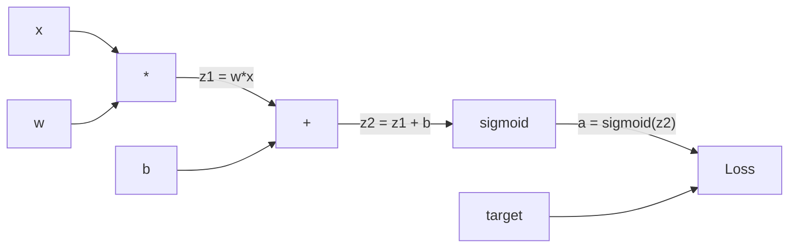
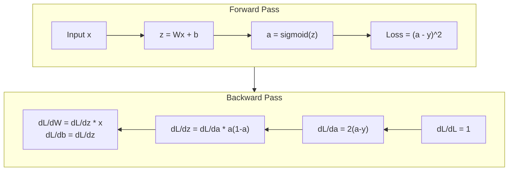
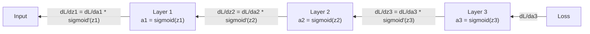

# Propagation en arrière depuis le début

> La répartition est l'algorithme qui rend possible l'apprentissage. Sans elle, les réseaux neuraux sont juste des générateurs de nombres aléatoires coûteux.

**Type:** Build
**Languages:** Python
**Prerequisites:** Lesson 03.02 (Multi-Layer Networks)
**Time:** ~120 minutes

## Objectifs d'apprentissage

- Implémenter un moteur autograd basé sur la valeur qui construit un graphique de calcul et compute les gradients par tri topologique
- Dériver le passage arrière pour l'addition, la multiplication et le sigmoïde en utilisant la règle de la chaîne
- Formez un réseau multicouche sur XOR et la classification de cercle en utilisant uniquement votre moteur de répartition à partir de zéro
- Identifier le problème de la disparition des gradients dans les réseaux sigmoïdes profonds et expliquer pourquoi les gradients se rétrécissent de manière exponentielle

## Le problème

Votre réseau a une seule couche cachée avec 768 entrées et 3072 sorties. C'est 2 359 296 poids. Il a fait une mauvaise prédiction. Quels poids ont causé l'erreur? Tester chaque poids individuellement signifie 2,3 millions de passes en avant. La propagation arrière compute les 2,3 millions de gradients dans un seul pass en arrière. Ce n'est pas une optimisation. C'est la différence entre entraîné et impossible.

L'approche naïve: prendre un poids, le pousser par une petite quantité, faire le passage vers l'avant à nouveau, mesurer si la perte est montée ou descendue. Cela vous donne le gradient de ce poids. Maintenant faites-le pour chaque poids du réseau. Multipliez par des milliers de pas d'entraînement et des millions de points de données. Vous auriez besoin de temps géologique pour entraîner quelque chose d'utile.

La propagation en arrière résout ceci. Un passage vers l'avant, un passage vers l'arrière, tous les gradients calculés. Le truc est la règle de chaîne du calcul, appliquée systématiquement à un graphique informatique. C'est l'algorithme qui a rendu l'apprentissage en profondeur pratique. Sans elle, nous serions toujours coincés sur des problèmes de jouets.

## Le concept

### La règle de la chaîne, appliquée aux réseaux

Vous avez vu la règle de la chaîne dans la phase 01, leçon 05. Rapide résumé: si y = f(g(x)), alors dy/dx = f'(g(x)) * g'(x. Vous multipliez les dérivés le long de la chaîne.

Dans un réseau neuronal, la "chaîne" est la séquence d'opérations de l'entrée à la perte. Chaque couche applique des poids, ajoute des biais, passe par une activation. La fonction de perte compare la sortie finale à la cible. La répartition arrière suit cette chaîne vers l'arrière, calculant comment chaque opération a contribué à l'erreur.

### Graphiques de calcul

Chaque passage vers l'avant construit un graphique. Chaque nœud est une opération (multiplication, addition, sigmoid). Chaque bord porte une valeur vers l'avant et un gradient vers l'arrière.



Passage vers l'avant: les valeurs circulent de gauche à droite. x et w produisent z1 = w*x. Ajoutez b pour obtenir z2. Sigmoid donne l'activation a. Comparer a à cible y en utilisant la fonction de perte.

Passage à l'envers: les gradients circulent de droite à gauche. Commencez par dL/da (comme la perte change avec l'activation). Multipliez par da/dz2 (dérivé sigmoïde). Cela donne dL/dz2. Divisez en dL/db (qui est égal à dL/dz2, puisque z2 = z1 + b) et dL/dz1.

Chaque nœud du graphique a une tâche pendant le passage en arrière: prendre le gradient venant d'en haut, multiplier par sa dérivée locale, et le transmettre vers le bas.

### En avant et en arrière



Le pass avant stocke toutes les valeurs intermédiaires: z, a, les entrées de chaque couche. Le pass arrière a besoin de ces valeurs stockées pour calculer les gradients. C'est le compromis mémoire-computation au cœur du backprop. Vous échangez la mémoire (activations de stockage) pour la vitesse (un pass au lieu de millions).

### Un flux graduel à travers un réseau

Pour un réseau à trois couches, la chaîne de gradients à travers chaque couche:



À chaque couche, le gradient est multiplié par le dérivé sigmoïde. Le dérivé sigmoïde est un * (1 - a), qui se dégage à 0,25 (lorsque a = 0,5).

### Des gradients qui disparaissent

C'est le problème du gradient qui disparaît. Sigmoid écraser sa sortie entre 0 et 1. Son dérivé est toujours inférieur à 0,25.

```
sigmoid(z):     Output range [0, 1]
sigmoid'(z):    Max value 0.25 (at z = 0)

After 5 layers:   gradient * 0.25^5 = 0.001x original
After 10 layers:  gradient * 0.25^10 = 0.000001x original
```

C'est pourquoi les réseaux sigmoïdes profonds sont presque impossibles à entraîner. La solution - ReLU et ses variantes - est l'objet de la leçon 04. Pour l'instant, comprenez que le backprop fonctionne parfaitement. Le problème est ce qu'il fonctionne.

### Dériver les gradients pour un réseau à deux couches

Mathématiques concrètes pour un réseau avec une entrée x, une couche cachée avec un sigmoïde, une couche de sortie avec un sigmoïde et une perte MSE.

Pass avant:
```
z1 = W1 * x + b1
a1 = sigmoid(z1)
z2 = W2 * a1 + b2
a2 = sigmoid(z2)
L = (a2 - y)^2
```

Pass en arrière (application étape par étape de la règle de la chaîne):
```
dL/da2 = 2(a2 - y)
da2/dz2 = a2 * (1 - a2)
dL/dz2 = dL/da2 * da2/dz2 = 2(a2 - y) * a2 * (1 - a2)

dL/dW2 = dL/dz2 * a1
dL/db2 = dL/dz2

dL/da1 = dL/dz2 * W2
da1/dz1 = a1 * (1 - a1)
dL/dz1 = dL/da1 * da1/dz1

dL/dW1 = dL/dz1 * x
dL/db1 = dL/dz1
```

Chaque gradient est le produit des dérivés locaux tracés à partir de la perte.

```figure
backprop-vanishing
```

## Faites-le

### Étape 1: Le nœud de valeur

Chaque nombre dans notre calcul devient une valeur. Il stocke ses données, son gradient, et comment il a été créé (il sait donc calculer les gradients en arrière).

```python
class Value:
    def __init__(self, data, children=(), op=''):
        self.data = data
        self.grad = 0.0
        self._backward = lambda: None
        self._children = set(children)
        self._op = op

    def __repr__(self):
        return f"Value(data={self.data:.4f}, grad={self.grad:.4f})"
```

Aucune fonction arrière (no-op)`_children`Suivre les valeurs qui ont produit celui-ci, donc nous pouvons topologiquement trier le graphique plus tard.

### Étape 2: Opérations avec des fonctions rétroactives

Chaque opération crée une nouvelle valeur et définit comment les gradients se déroulent en arrière à travers elle.

```python
def __add__(self, other):
    other = other if isinstance(other, Value) else Value(other)
    out = Value(self.data + other.data, (self, other), '+')

    def _backward():
        self.grad += out.grad
        other.grad += out.grad

    out._backward = _backward
    return out

def __mul__(self, other):
    other = other if isinstance(other, Value) else Value(other)
    out = Value(self.data * other.data, (self, other), '*')

    def _backward():
        self.grad += other.data * out.grad
        other.grad += self.data * out.grad

    out._backward = _backward
    return out
```

Pour l'addition: d(a+b)/da = 1, d(a+b)/db = 1. Ainsi, les deux entrées obtiennent directement le gradient de la sortie.

Pour la multiplication: d(a*b)/da = b, d(a*b)/db = a. Chaque entrée obtient la valeur de l'autre fois le gradient de sortie.

Le `+=`Une valeur peut être utilisée dans plusieurs opérations. son gradient est la somme des gradients de tous les chemins.

### Étape 3: Sigmoïde et perte

```python
import math

def sigmoid(self):
    x = self.data
    x = max(-500, min(500, x))
    s = 1.0 / (1.0 + math.exp(-x))
    out = Value(s, (self,), 'sigmoid')

    def _backward():
        self.grad += (s * (1 - s)) * out.grad

    out._backward = _backward
    return out
```

Le dérivé sigmoïde: sigmoïde ((x) * (1 - sigmoïde ((x)). Nous avons calculé sigmoïde ((x) = s pendant le passage vers l'avant.

```python
def mse_loss(predicted, target):
    diff = predicted + Value(-target)
    return diff * diff
```

MSE pour une seule sortie: (prévisible - cible) ^ 2. Nous exprimons la soustraction en addition avec une valeur négative.

### Étape 4: Passage en arrière

Le tri topologique nous permet de traiter les nœuds dans le bon ordre - le gradient d'un nœud est complètement accumulé avant de nous propager à travers lui.

```python
def backward(self):
    topo = []
    visited = set()

    def build_topo(v):
        if v not in visited:
            visited.add(v)
            for child in v._children:
                build_topo(child)
            topo.append(v)

    build_topo(self)
    self.grad = 1.0
    for v in reversed(topo):
        v._backward()
```

Commencez par la perte (gradient = 1.0, puisque dL/dL = 1).`_backward`Elle pousse les gradients à ses enfants.

### Étape 5: Couche et réseau

```python
import random

class Neuron:
    def __init__(self, n_inputs):
        scale = (2.0 / n_inputs) ** 0.5
        self.weights = [Value(random.uniform(-scale, scale)) for _ in range(n_inputs)]
        self.bias = Value(0.0)

    def __call__(self, x):
        act = sum((wi * xi for wi, xi in zip(self.weights, x)), self.bias)
        return act.sigmoid()

    def parameters(self):
        return self.weights + [self.bias]


class Layer:
    def __init__(self, n_inputs, n_outputs):
        self.neurons = [Neuron(n_inputs) for _ in range(n_outputs)]

    def __call__(self, x):
        out = [n(x) for n in self.neurons]
        return out[0] if len(out) == 1 else out

    def parameters(self):
        params = []
        for n in self.neurons:
            params.extend(n.parameters())
        return params


class Network:
    def __init__(self, sizes):
        self.layers = []
        for i in range(len(sizes) - 1):
            self.layers.append(Layer(sizes[i], sizes[i + 1]))

    def __call__(self, x):
        for layer in self.layers:
            x = layer(x)
            if not isinstance(x, list):
                x = [x]
        return x[0] if len(x) == 1 else x

    def parameters(self):
        params = []
        for layer in self.layers:
            params.extend(layer.parameters())
        return params

    def zero_grad(self):
        for p in self.parameters():
            p.grad = 0.0
```

Un neurone prend les entrées, calcule la somme pondérée + le biais et applique le sigmoïde.`parameters()`La méthode recueille toutes les valeurs appréciables afin que nous puissions les mettre à jour.

### Étape 6: Train sur XOR

```python
random.seed(42)
net = Network([2, 4, 1])

xor_data = [
    ([0.0, 0.0], 0.0),
    ([0.0, 1.0], 1.0),
    ([1.0, 0.0], 1.0),
    ([1.0, 1.0], 0.0),
]

learning_rate = 1.0

for epoch in range(1000):
    total_loss = Value(0.0)
    for inputs, target in xor_data:
        x = [Value(i) for i in inputs]
        pred = net(x)
        loss = mse_loss(pred, target)
        total_loss = total_loss + loss

    net.zero_grad()
    total_loss.backward()

    for p in net.parameters():
        p.data -= learning_rate * p.grad

    if epoch % 100 == 0:
        print(f"Epoch {epoch:4d} | Loss: {total_loss.data:.6f}")

print("\nXOR Results:")
for inputs, target in xor_data:
    x = [Value(i) for i in inputs]
    pred = net(x)
    print(f"  {inputs} -> {pred.data:.4f} (expected {target})")
```

De prédictions aléatoires à des sorties XOR correctes, entièrement guidées par des gradients de calcul de rétroviseur et des poids poussés dans la bonne direction.

### Étape 7: Classification des cercles

Dans la leçon 02, vous avez réglé les poids à la main pour la classification des cercles.

```python
random.seed(7)

def generate_circle_data(n=100):
    data = []
    for _ in range(n):
        x1 = random.uniform(-1.5, 1.5)
        x2 = random.uniform(-1.5, 1.5)
        label = 1.0 if x1 * x1 + x2 * x2 < 1.0 else 0.0
        data.append(([x1, x2], label))
    return data

circle_data = generate_circle_data(80)

circle_net = Network([2, 8, 1])
learning_rate = 0.5

for epoch in range(2000):
    random.shuffle(circle_data)
    total_loss_val = 0.0
    for inputs, target in circle_data:
        x = [Value(i) for i in inputs]
        pred = circle_net(x)
        loss = mse_loss(pred, target)
        circle_net.zero_grad()
        loss.backward()
        for p in circle_net.parameters():
            p.data -= learning_rate * p.grad
        total_loss_val += loss.data

    if epoch % 200 == 0:
        correct = 0
        for inputs, target in circle_data:
            x = [Value(i) for i in inputs]
            pred = circle_net(x)
            predicted_class = 1.0 if pred.data > 0.5 else 0.0
            if predicted_class == target:
                correct += 1
        accuracy = correct / len(circle_data) * 100
        print(f"Epoch {epoch:4d} | Loss: {total_loss_val:.4f} | Accuracy: {accuracy:.1f}%")
```

Nous utilisons SGD en ligne ici - mettre à jour les poids après chaque échantillon au lieu d'accumuler le lot complet. Cela rompt la symétrie plus rapidement et évite la saturation sigmoïde sur le paysage de perte complète.

Aucun réglage manuel. Le réseau découvre la limite de décision circulaire par lui-même. C'est la puissance de la répartition: vous définissez l'architecture, la fonction de perte et les données. L'algorithme détermine les poids.

## Utilisez-le

PyTorch fait tout ce qui est ci-dessus en quelques lignes. L'idée de base est identique - autograd construit un graphique de calcul pendant le passage vers l'avant et le trace vers l'arrière pour calculer les gradients.

```python
import torch
import torch.nn as nn

model = nn.Sequential(
    nn.Linear(2, 4),
    nn.Sigmoid(),
    nn.Linear(4, 1),
    nn.Sigmoid(),
)
optimizer = torch.optim.SGD(model.parameters(), lr=1.0)
criterion = nn.MSELoss()

X = torch.tensor([[0,0],[0,1],[1,0],[1,1]], dtype=torch.float32)
y = torch.tensor([[0],[1],[1],[0]], dtype=torch.float32)

for epoch in range(1000):
    pred = model(X)
    loss = criterion(pred, y)
    optimizer.zero_grad()
    loss.backward()
    optimizer.step()

print("PyTorch XOR Results:")
with torch.no_grad():
    for i in range(4):
        pred = model(X[i])
        print(f"  {X[i].tolist()} -> {pred.item():.4f} (expected {y[i].item()})")
```

`loss.backward()`est votre `total_loss.backward()`- Je suis là .`optimizer.step()`C' est votre manuel .`p.data -= lr * p.grad`- Je suis là .`optimizer.zero_grad()`est votre `net.zero_grad()`PyTorch gère l'accélération de la GPU, la précision mixte, le contrôle des gradients et des centaines de types de couches.

L'entraînement fait le pass avant, puis le pass arrière, puis les peses actualisées. L'inference ne passe que par la passe avant. Pas de dégradations, pas de mises à jour. Cette distinction est importante car l'inférence est ce qui se passe dans la production. Quand vous appelez une API comme Claude ou GPT, vous faites une inférence -- votre prompt passe à travers le réseau, et les jetons sortent de l'autre bout. Aucun changement de poids. Comprendre le backprop est important parce qu'il a façonné chaque poids de ce réseau.

## La faire partir

Cette leçon donne:
- `outputs/prompt-gradient-debugger.md`-- une requête réutilisable pour diagnostiquer des problèmes de gradient (disparition, explosion, NaN) dans n'importe quel réseau neuronal

## Exercices

1. Ajouter un `__sub__`La méthode de la classe de valeur (a - b = a + (-1 * b)).`__neg__`La méthode de calcul de la valeur de la valeur de la valeur de la valeur de la valeur de la valeur de la valeur de la valeur de la valeur de la valeur de la valeur de la valeur de la valeur de la valeur de la valeur de la valeur de la valeur de la valeur de la valeur de la valeur de la valeur de la valeur de la valeur de la valeur de la valeur de la valeur de la valeur de la valeur de la valeur de la valeur de la valeur de la valeur de la valeur de la valeur de la valeur de la valeur de la valeur de la valeur de la valeur de la valeur de la valeur de la valeur de la valeur de la valeur de la valeur de la valeur de la valeur de la valeur de la valeur de la valeur de la valeur de la valeur de la valeur de la valeur de la valeur de la valeur de la valeur de la valeur de la valeur de la valeur de la valeur de la valeur de la valeur de la valeur de la valeur de la valeur de la valeur de la valeur de la valeur de la valeur de la valeur de la valeur de la valeur de la valeur de la valeur de la valeur de la valeur de la valeur est est est est la valeur de la valeur de la valeur de la valeur de la valeur de la valeur de la valeur de la valeur de la valeur de la valeur de la valeur de la valeur de la valeur de la valeur de la valeur de la valeur de la valeur de la valeur de la valeur de la valeur de la valeur de la valeur de la valeur de la valeur de la valeur de la valeur de la valeur de la valeur de la valeur de la valeur de la valeur de la valeur de la valeur de la valeur de la valeur de la valeur de la valeur de la valeur de la valeur de la valeur de la valeur de la valeur de la valeur de la valeur de la valeur de la valeur de la valeur est est est est est est est est est est est de la valeur de la valeur de la valeur de la valeur de la valeur de la valeur de la valeur de la valeur de la valeur de la valeur de la valeur est est est est est est est est est est est est est est est est est est est de la valeur de la valeur de la valeur de la valeur de la valeur de la valeur de la valeur de la valeur de la valeur de la valeur de la valeur de la valeur de la valeur de la valeur de la valeur de la valeur de la valeur de la valeur de la valeur de la valeur de la valeur de

2. Ajouter un `relu`La méthode de la valeur (exécution max ((0, x), dérivé est 1 si x > 0, alors 0).

3. La mise en œuvre d'une `__pow__`La méthode de la valeur pour les puissances entières.`mse_loss`avec un bon`(predicted - target) ** 2`Expression. Vérifiez que les gradients correspondent à l'implémentation originale.

4. Ajouter des coups de gradient à la boucle d' entraînement: après appel `backward()`Traînez un réseau plus profond (4+ couches avec sigmoïde) et comparez les courbes de perte avec et sans coupe. C'est votre première défense contre les gradients explosants.

5. Construisez une visualisation: après avoir suivi une formation sur XOR, imprimez le gradient de chaque paramètre du réseau. Identifiez la couche qui a les plus petits gradients. Cela démontre le problème de gradient qui disparaît dont vous avez lu dans la section Concept.

## Les termes clés

| Term | What people say | What it actually means |
|------|----------------|----------------------|
| Backpropagation | "The network learns" | An algorithm that computes dL/dw for every weight by applying the chain rule backward through the computational graph |
| Computational graph | "The network structure" | A directed acyclic graph where nodes are operations and edges carry values (forward) and gradients (backward) |
| Chain rule | "Multiply the derivatives" | If y = f(g(x)), then dy/dx = f'(g(x)) * g'(x) -- the mathematical foundation of backpropagation |
| Gradient | "The direction of steepest ascent" | The partial derivative of the loss with respect to a parameter -- tells you how to change that parameter to reduce the loss |
| Vanishing gradient | "Deep networks don't learn" | Gradients shrink exponentially as they propagate through layers with saturating activations like sigmoid |
| Forward pass | "Running the network" | Computing the output from inputs by sequentially applying each layer's operations and storing intermediate values |
| Backward pass | "Computing gradients" | Traversing the computational graph in reverse, accumulating gradients at each node using the chain rule |
| Learning rate | "How fast it learns" | A scalar that controls the step size when updating weights: w_new = w_old - lr * gradient |
| Topological sort | "The right order" | An ordering of graph nodes where each node appears after all nodes it depends on -- ensures gradients are fully accumulated before propagation |
| Autograd | "Automatic differentiation" | A system that builds computational graphs during forward computation and automatically computes gradients -- what PyTorch's engine does |

## Pour en savoir plus

- Rumelhart, Hinton & Williams, "Apprendre les représentations par erreurs de propagation en arrière" (1986) - le document qui a fait de la propagation en arrière un cours de formation en réseau multi-couches
- 3Blue1Brown, série "Réseaux neuronaux" (https://www.youtube.com/playlist?list=PLZHQObOWTQDNU6R1_67000Dx_ZCJB-3pi) -- la meilleure explication visuelle de la propagation en arrière et du débit de gradients à travers les réseaux
