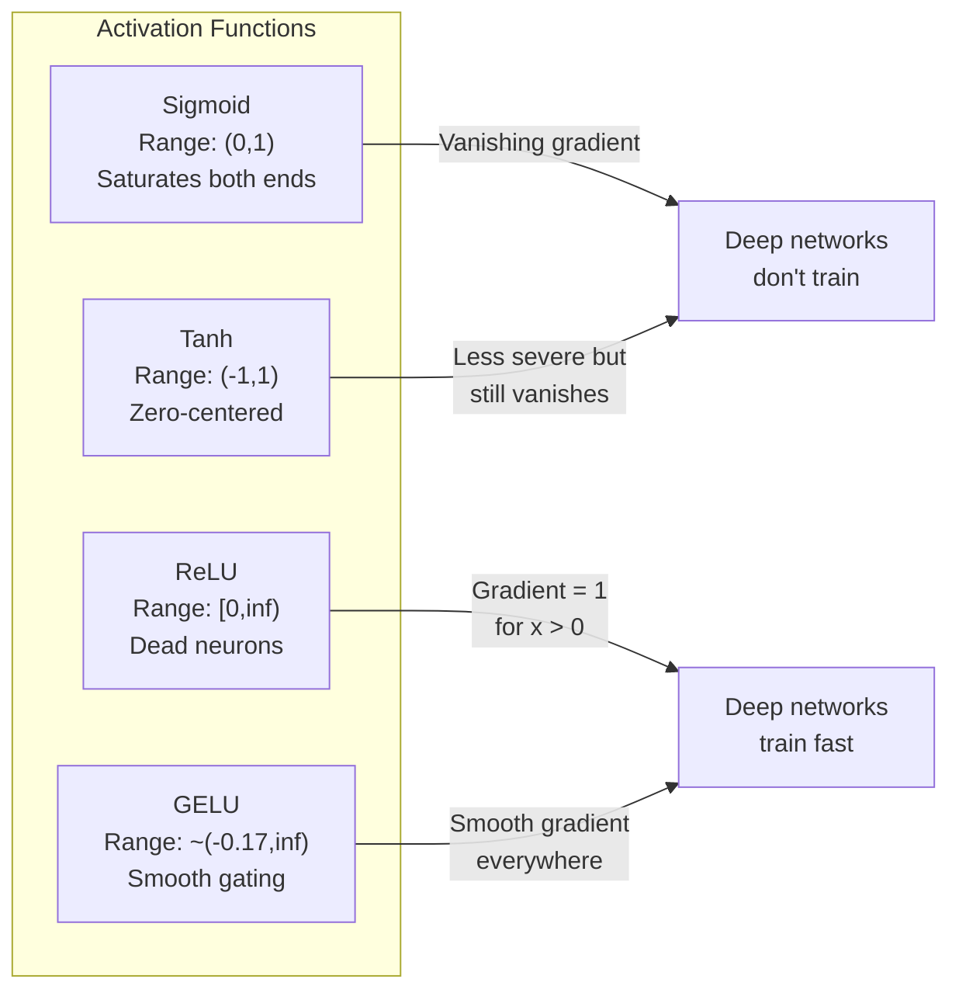
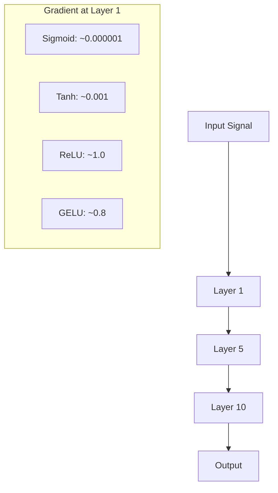
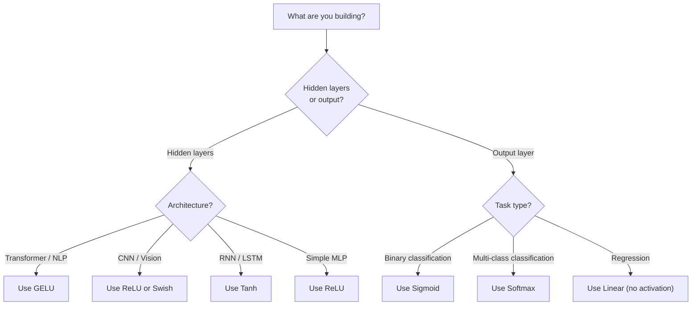

# Fonctions d'activation

> Sans non-linéarité, votre réseau de 100 couches est un matrice de multiplication fantaisiste.

**Type:** Build
**Languages:** Python
**Prerequisites:** Lesson 03.03 (Backpropagation)
**Time:** ~75 minutes

## Objectifs d'apprentissage

- Implémenter sigmoid, tanh, ReLU, Leaky ReLU, GELU, Swish et softmax avec leurs dérivés à partir de zéro
- Diagnosticer le problème de gradient de disparition en mesurant les magnitudes d'activation à travers 10 couches avec différentes activations
- Détecter les neurones morts dans un réseau ReLU et expliquer pourquoi GELU évitera ce mode de défaillance
- Sélectionnez la fonction d'activation correcte pour une architecture donnée (transformateur, CNN, RNN, couche de sortie)

## Le problème

L'étape de deux transformations linéaires: y = W2 ((W1x + b1) + b2. Élargir: y = W2W1x + W2b1 + b2. C'est juste y = Ax + c - une transformation linéaire unique. Peu importe le nombre de couches linéaires que vous empilerez, le résultat s'effondre à une matrice multipliée. Votre réseau de 100 couches a la même puissance de représentation qu'une seule couche.

Ce n'est pas une curiosité théorique. Cela signifie qu'un réseau linéaire profond ne peut littéralement pas apprendre XOR, ne peut pas classer un ensemble de données spirale, ne peut pas reconnaître un visage. Sans fonctions d'activation, la profondeur est une illusion.

Les fonctions d'activation brisent la linéarité. Ils déforment la sortie de chaque couche à travers une fonction non linéaire, donnant au réseau la capacité de plier les limites de décision, approximer les fonctions arbitraires et d'apprendre réellement. Mais choisissez la mauvaise activation et vos gradients disparaissent à zéro (sigmoïdes dans les réseaux profonds), explosent à l'infini (activations illimitées sans initialisation minutieuse), ou vos neurones meurent définitivement (ReLU avec de grands biais négatifs). Le choix de la fonction d'activation détermine directement si votre réseau apprend du tout.

## Le concept

### Pourquoi la non-linéarité est nécessaire

La multiplication de matrice est composable. Multiplier un vecteur par la matrice A puis la matrice B est identique à la multiplication par AB. Cela signifie que l'empilage de dix couches linéaires est mathématiquement équivalent à une couche linéaire avec une grande matrice. Tous ces paramètres, toute cette profondeur - gaspillé. Vous avez besoin de quelque chose pour briser la chaîne. C'est ce que font les fonctions d'activation.

Voici la preuve. Une couche linéaire compute f ((x) = Wx + b.

```
Layer 1: h = W1 * x + b1
Layer 2: y = W2 * h + b2
```

Le substitut:

```
y = W2 * (W1 * x + b1) + b2
y = (W2 * W1) * x + (W2 * b1 + b2)
y = A * x + c
```

Une couche. Insérer une activation non linéaire g() entre les couches:

```
h = g(W1 * x + b1)
y = W2 * h + b2
```

Le réseau peut représenter des fonctions non linéaires. Chaque couche supplémentaire avec une activation ajoute une capacité de représentation.

### Sigmoïde

La fonction d'activation originale pour les réseaux neuronaux.

```
sigmoid(x) = 1 / (1 + e^(-x))
```

Range de sortie: (0, 1). Légide, différenciable, correspondant à un nombre réel à une valeur semblable à la probabilité.

Le dérivé:

```
sigmoid'(x) = sigmoid(x) * (1 - sigmoid(x))
```

La valeur maximale de cette dérivée est de 0,25, se produisant à x = 0. En rétroviseur, les gradients se multiplient à travers les couches.

```
0.25^10 = 0.000000953674
```

Moins d'un millionième du signal original. C'est le problème de la dégradation qui disparaît. Les gradients dans les premières couches deviennent si petits que les poids se mettent à peine à jour. Le réseau semble apprendre - la perte diminue dans les couches ultérieures - mais les premières couches sont gelées. Les réseaux sigmoïdes profonds ne s'entraînent tout simplement pas.

Problème supplémentaire: les sorties sigmoïdes sont toujours positives (0 à 1), ce qui signifie que les gradients sur les poids sont toujours le même signe.

### Tanh

La version centrée du sigmoïde.

```
tanh(x) = (e^x - e^(-x)) / (e^x + e^(-x))
```

Range de sortie: (-1, 1). Centré sur zéro, ce qui élimine le problème du zigzag.

Le dérivé:

```
tanh'(x) = 1 - tanh(x)^2
```

La dérivée maximale est de 1,0 à x = 0 - quatre fois mieux que le sigmoïde. Mais le problème du gradient de disparition existe toujours. Pour les grandes entrées positives ou négatives, la dérivée approche de zéro. Dix couches écrasent encore le gradient, seulement moins agressivement.

### La révolution

L'unité linéaire rectifiée. Popularisée pour l'apprentissage en profondeur par Nair et Hinton en 2010 (la fonction elle-même remonte à l'œuvre de Fukushima de 1969), elle a tout changé.

```
relu(x) = max(0, x)
```

La dérivée est trivialement simple:

```
relu'(x) = 1  if x > 0
            0  if x <= 0
```

Aucun gradient de disparition pour les entrées positives. Le gradient est exactement 1, passé directement. C'est pourquoi les réseaux profonds sont devenus entraînables - ReLU préserve la magnitude du gradient à travers les couches.

Mais il y a un mode d'échec: le problème des neurones morts. Si l'entrée pondérée d'un neurone est toujours négative (en raison d'un grand biais négatif ou d'une initialization malheureuse du poids), sa sortie est toujours zéro, son gradient est toujours zéro et il ne se met jamais à jour. Il est définitivement mort.

### Lecture de la réaction

Le remède le plus simple pour les neurones morts.

```
leaky_relu(x) = x        if x > 0
                alpha * x if x <= 0
```

Là où l'alpha est une petite constante, généralement 0,01. Le côté négatif a une petite pente au lieu de zéro, de sorte que les neurones morts reçoivent toujours un signal de gradient et peuvent se remettre.

### GELU: Le défaut moderne

Unité linéaire d'erreur Gaussian. Introducé par Hendrycks et Gimpel en 2016.

```
gelu(x) = x * Phi(x)
```

où Phi ((x) est la fonction de distribution cumulée de la distribution normale standard.

```
gelu(x) ~= 0.5 * x * (1 + tanh(sqrt(2/pi) * (x + 0.044715 * x^3)))
```

GELU est lisse partout, permet de petites valeurs négatives (contrairement à ReLU qui clipe dur à zéro), et a une interprétation probabiliste: il pèse chaque entrée par la probabilité qu'elle soit positive sous une distribution gaussienne. Ce gateage lisse surpasse ReLU dans les architectures de transformateurs car il fournit un meilleur débit de gradient et évite le problème des neurones morts entièrement.

### Suisse / SiLU

L'activation auto-arrêtée découverte par Ramachandran et coll. en 2017 par la recherche automatisée.

```
swish(x) = x * sigmoid(x)
```

Swish est formellement x * sigmoid (x). Google l'a découvert par la recherche automatisée sur l'espace des fonctions d'activation -- un réseau neural qui conçoit des parties de réseaux neuraux.

Comme GELU, il est lisse, non monotonique et permet de petites valeurs négatives. La différence est subtile: Swish utilise sigmoid pour le gateage tandis que GELU utilise le CDF gaussien.

### Softmax: activation de sortie

Non utilisé dans les couches cachées. Softmax convertit un vecteur de scores bruts (logits) en une distribution de probabilité.

```
softmax(x_i) = e^(x_i) / sum(e^(x_j) for all j)
```

Chaque sortie est comprise entre 0 et 1. Toutes les sorties s'ajoutent à 1. Cela en fait l'activation finale standard pour la classification multi-classe. La logite la plus grande obtient la plus grande probabilité, mais contrairement à argmax, softmax est différenciable et préserve des informations sur la confiance relative.

### Comparaison des formes



### Comparaison des flux graduels



### Quelle activation



```figure
softmax-temperature
```

## Faites-le

### Étape 1: Implémenter toutes les fonctions d'activation avec des dérivés

Chaque fonction prend une seule flotte et renvoie une flotte. Chaque fonction dérivée prend la même entrée et renvoie le gradient.

```python
import math

def sigmoid(x):
    x = max(-500, min(500, x))
    return 1.0 / (1.0 + math.exp(-x))

def sigmoid_derivative(x):
    s = sigmoid(x)
    return s * (1 - s)

def tanh_act(x):
    return math.tanh(x)

def tanh_derivative(x):
    t = math.tanh(x)
    return 1 - t * t

def relu(x):
    return max(0.0, x)

def relu_derivative(x):
    return 1.0 if x > 0 else 0.0

def leaky_relu(x, alpha=0.01):
    return x if x > 0 else alpha * x

def leaky_relu_derivative(x, alpha=0.01):
    return 1.0 if x > 0 else alpha

def gelu(x):
    return 0.5 * x * (1 + math.tanh(math.sqrt(2 / math.pi) * (x + 0.044715 * x ** 3)))

def gelu_derivative(x):
    phi = 0.5 * (1 + math.erf(x / math.sqrt(2)))
    pdf = math.exp(-0.5 * x * x) / math.sqrt(2 * math.pi)
    return phi + x * pdf

def swish(x):
    return x * sigmoid(x)

def swish_derivative(x):
    s = sigmoid(x)
    return s + x * s * (1 - s)

def softmax(xs):
    max_x = max(xs)
    exps = [math.exp(x - max_x) for x in xs]
    total = sum(exps)
    return [e / total for e in exps]
```

### Étape 2: Imaginez où les gradients meurent

Computez le gradient à 100 points uniformément espacés de -5 à 5. Imprimez un histogramme de texte montrant où le gradient de chaque activation est proche de zéro.

```python
def gradient_scan(name, derivative_fn, start=-5, end=5, n=100):
    step = (end - start) / n
    near_zero = 0
    healthy = 0
    for i in range(n):
        x = start + i * step
        g = derivative_fn(x)
        if abs(g) < 0.01:
            near_zero += 1
        else:
            healthy += 1
    pct_dead = near_zero / n * 100
    print(f"{name:15s}: {healthy:3d} healthy, {near_zero:3d} near-zero ({pct_dead:.0f}% dead zone)")

gradient_scan("Sigmoid", sigmoid_derivative)
gradient_scan("Tanh", tanh_derivative)
gradient_scan("ReLU", relu_derivative)
gradient_scan("Leaky ReLU", leaky_relu_derivative)
gradient_scan("GELU", gelu_derivative)
gradient_scan("Swish", swish_derivative)
```

### Étape 3: Expérimentation graduelle qui disparaît

Passer un signal à travers N couches en utilisant sigmoid vs ReLU. Mesurer comment la magnitude d'activation change.

```python
import random

def vanishing_gradient_experiment(activation_fn, name, n_layers=10, n_inputs=5):
    random.seed(42)
    values = [random.gauss(0, 1) for _ in range(n_inputs)]

    print(f"\n{name} through {n_layers} layers:")
    for layer in range(n_layers):
        weights = [random.gauss(0, 1) for _ in range(n_inputs)]
        z = sum(w * v for w, v in zip(weights, values))
        activated = activation_fn(z)
        magnitude = abs(activated)
        bar = "#" * int(magnitude * 20)
        print(f"  Layer {layer+1:2d}: magnitude = {magnitude:.6f} {bar}")
        values = [activated] * n_inputs

vanishing_gradient_experiment(sigmoid, "Sigmoid")
vanishing_gradient_experiment(relu, "ReLU")
vanishing_gradient_experiment(gelu, "GELU")
```

### Étape 4: Détecteur de neurones morts

Créez un réseau ReLU, passez des entrées aléatoires à travers, comptez combien de neurones ne tirent jamais.

```python
def dead_neuron_detector(n_inputs=5, hidden_size=20, n_samples=1000):
    random.seed(0)
    weights = [[random.gauss(0, 1) for _ in range(n_inputs)] for _ in range(hidden_size)]
    biases = [random.gauss(0, 1) for _ in range(hidden_size)]

    fire_counts = [0] * hidden_size

    for _ in range(n_samples):
        inputs = [random.gauss(0, 1) for _ in range(n_inputs)]
        for neuron_idx in range(hidden_size):
            z = sum(w * x for w, x in zip(weights[neuron_idx], inputs)) + biases[neuron_idx]
            if relu(z) > 0:
                fire_counts[neuron_idx] += 1

    dead = sum(1 for c in fire_counts if c == 0)
    rarely_fire = sum(1 for c in fire_counts if 0 < c < n_samples * 0.05)
    healthy = hidden_size - dead - rarely_fire

    print(f"\nDead Neuron Report ({hidden_size} neurons, {n_samples} samples):")
    print(f"  Dead (never fired):     {dead}")
    print(f"  Barely alive (<5%):     {rarely_fire}")
    print(f"  Healthy:                {healthy}")
    print(f"  Dead neuron rate:       {dead/hidden_size*100:.1f}%")

    for i, c in enumerate(fire_counts):
        status = "DEAD" if c == 0 else "WEAK" if c < n_samples * 0.05 else "OK"
        bar = "#" * (c * 40 // n_samples)
        print(f"  Neuron {i:2d}: {c:4d}/{n_samples} fires [{status:4s}] {bar}")

dead_neuron_detector()
```

### Étape 5: Comparison de formation - Sigmoide vs ReLU vs GELU

Exercer le même réseau à deux couches sur le jeu de données de cercle (points à l'intérieur d'un cercle = classe 1, à l'extérieur = classe 0) avec trois activations différentes.

```python
def make_circle_data(n=200, seed=42):
    random.seed(seed)
    data = []
    for _ in range(n):
        x = random.uniform(-2, 2)
        y = random.uniform(-2, 2)
        label = 1.0 if x * x + y * y < 1.5 else 0.0
        data.append(([x, y], label))
    return data


class ActivationNetwork:
    def __init__(self, activation_fn, activation_deriv, hidden_size=8, lr=0.1):
        random.seed(0)
        self.act = activation_fn
        self.act_d = activation_deriv
        self.lr = lr
        self.hidden_size = hidden_size

        self.w1 = [[random.gauss(0, 0.5) for _ in range(2)] for _ in range(hidden_size)]
        self.b1 = [0.0] * hidden_size
        self.w2 = [random.gauss(0, 0.5) for _ in range(hidden_size)]
        self.b2 = 0.0

    def forward(self, x):
        self.x = x
        self.z1 = []
        self.h = []
        for i in range(self.hidden_size):
            z = self.w1[i][0] * x[0] + self.w1[i][1] * x[1] + self.b1[i]
            self.z1.append(z)
            self.h.append(self.act(z))

        self.z2 = sum(self.w2[i] * self.h[i] for i in range(self.hidden_size)) + self.b2
        self.out = sigmoid(self.z2)
        return self.out

    def backward(self, target):
        error = self.out - target
        d_out = error * self.out * (1 - self.out)

        for i in range(self.hidden_size):
            d_h = d_out * self.w2[i] * self.act_d(self.z1[i])
            self.w2[i] -= self.lr * d_out * self.h[i]
            for j in range(2):
                self.w1[i][j] -= self.lr * d_h * self.x[j]
            self.b1[i] -= self.lr * d_h
        self.b2 -= self.lr * d_out

    def train(self, data, epochs=200):
        losses = []
        for epoch in range(epochs):
            total_loss = 0
            correct = 0
            for x, y in data:
                pred = self.forward(x)
                self.backward(y)
                total_loss += (pred - y) ** 2
                if (pred >= 0.5) == (y >= 0.5):
                    correct += 1
            avg_loss = total_loss / len(data)
            accuracy = correct / len(data) * 100
            losses.append(avg_loss)
            if epoch % 50 == 0 or epoch == epochs - 1:
                print(f"    Epoch {epoch:3d}: loss={avg_loss:.4f}, accuracy={accuracy:.1f}%")
        return losses


data = make_circle_data()

configs = [
    ("Sigmoid", sigmoid, sigmoid_derivative),
    ("ReLU", relu, relu_derivative),
    ("GELU", gelu, gelu_derivative),
]

results = {}
for name, act_fn, act_d_fn in configs:
    print(f"\n=== Training with {name} ===")
    net = ActivationNetwork(act_fn, act_d_fn, hidden_size=8, lr=0.1)
    losses = net.train(data, epochs=200)
    results[name] = losses

print("\n=== Final Loss Comparison ===")
for name, losses in results.items():
    print(f"  {name:10s}: start={losses[0]:.4f} -> end={losses[-1]:.4f} (improvement: {(1 - losses[-1]/losses[0])*100:.1f}%)")
```

## Utilisez-le

PyTorch fournit toutes ces formes à la fois fonctionnelles et modulaires:

```python
import torch
import torch.nn as nn
import torch.nn.functional as F

x = torch.randn(4, 10)

relu_out = F.relu(x)
gelu_out = F.gelu(x)
sigmoid_out = torch.sigmoid(x)
swish_out = F.silu(x)

logits = torch.randn(4, 5)
probs = F.softmax(logits, dim=1)

model = nn.Sequential(
    nn.Linear(10, 64),
    nn.GELU(),
    nn.Linear(64, 32),
    nn.GELU(),
    nn.Linear(32, 5),
)
```

Couches cachées dans un transformateur: GELU. Couches cachées dans une CNN: ReLU. Couche de sortie pour la classification: softmax. Couche de sortie pour la régression: nul (linéaire). Couche de sortie pour les probabilités: sigmoid. C'est tout. Commencez par ces défauts. Ne les modifiez que lorsque vous avez des preuves.

Les RNN et les LSTM utilisent le tanh pour l'état caché et le sigmoïde pour les portes, mais si vous construisez à partir de zéro aujourd'hui, vous n'utilisez probablement pas les RNN. Si les neurones meurent dans votre réseau ReLU, passez à GELU. Ne touchez pas à Leaky ReLU à moins que vous n'ayez une raison spécifique - GELU résout le problème des neurones morts et donne un meilleur débit de gradient.

## La faire partir

Cette leçon donne:
- `outputs/prompt-activation-selector.md`-- une requête réutilisable qui vous aide à choisir la bonne fonction d'activation pour toute architecture

## Exercices

1. Implémenter le paramétrage paramétrique (PReLU) où la pente négative alpha est un paramètre apprenable.

2. Exécutez l'expérience de gradient de disparition avec 50 couches au lieu de 10. Tracer la magnitude à chaque couche pour sigmoïde, tanh, ReLU et GELU. À quelle couche le signal de chaque activation atteint effectivement zéro?

3. Implémenter l'ELU (Unité linéaire exponentielle): elu(x) = x si x > 0, alpha * (e^x - 1) si x <= 0. Comparer son taux de neurones morts à ReLU sur le même réseau.

4. Construisez un "moniteur de santé de gradient" qui fonctionne pendant l'entraînement: à chaque époque, calculez la magnitude moyenne du gradient de chaque couche.

5. Modifiez la comparaison d'entraînement pour utiliser le jeu de données XOR de la leçon 01 au lieu de cercles. Quelle activation converge le plus rapidement sur XOR? Pourquoi cela diffère-t-il des résultats du cercle?

## Les termes clés

| Term | What people say | What it actually means |
|------|----------------|----------------------|
| Activation function | "The nonlinear part" | A function applied to each neuron's output that breaks linearity, enabling the network to learn nonlinear mappings |
| Vanishing gradient | "Gradients disappear in deep networks" | Gradients shrink exponentially through layers when the activation's derivative is less than 1, making early layers untrainable |
| Exploding gradient | "Gradients blow up" | Gradients grow exponentially through layers when the effective multiplier exceeds 1, causing unstable training |
| Dead neuron | "A neuron that stopped learning" | A ReLU neuron whose input is permanently negative, producing zero output and zero gradient |
| Sigmoid | "Squishes values to 0-1" | The logistic function 1/(1+e^-x), historically important but causes vanishing gradients in deep networks |
| ReLU | "Clips negatives to zero" | max(0, x) -- the activation that made deep learning practical by preserving gradient magnitude |
| GELU | "The transformer activation" | Gaussian Error Linear Unit, a smooth activation that weights inputs by their probability of being positive |
| Swish/SiLU | "Self-gated ReLU" | x * sigmoid(x), discovered through automated search, used in EfficientNet |
| Softmax | "Turns scores into probabilities" | Normalizes a vector of logits into a probability distribution where all values are in (0,1) and sum to 1 |
| Leaky ReLU | "ReLU that doesn't die" | max(alpha*x, x) where alpha is small (0.01), preventing dead neurons by allowing small negative gradients |
| Saturation | "The flat part of sigmoid" | Regions where an activation's derivative approaches zero, blocking gradient flow |
| Logit | "The raw score before softmax" | The unnormalized output of the final layer before applying softmax or sigmoid |

## Pour en savoir plus

- Nair & Hinton, "Unités linéaires rectifiées améliorent les machines Boltzmann restreintes" (2010) -- le document qui a introduit la ReLU et a permis la formation de réseaux profonds
- Hendrycks & Gimpel, " Gaussian Error Linear Units (GELUs) " (2016) -- introduit la fonction d'activation qui est devenue la fonction par défaut pour les transformateurs
- Ramachandran et coll., " Recherche de fonctions d'activation " (2017) -- utilisé la recherche automatisée pour découvrir Swish, montrant que la conception d'activation peut être automatisée
- Glorot & Bengio, "Comprendre la difficulté de former des réseaux neuronaux en flux profond" (2010) -- le document qui a diagnostiqué des gradients disparus/explosifs et proposé l'initialisation Xavier
- Bienvenu, Bengio, Courville, "Apprentissage en profondeur" Chapitre 6.3 (https://www.deeplearningbook.org/) -- traitement rigoureux des unités cachées et des fonctions d'activation
