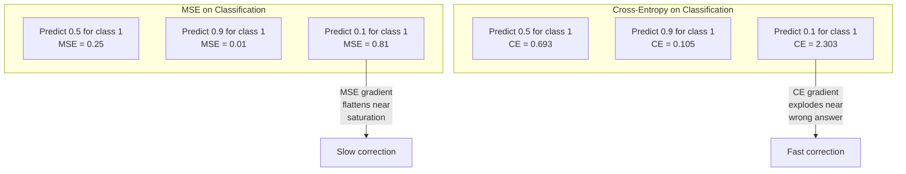
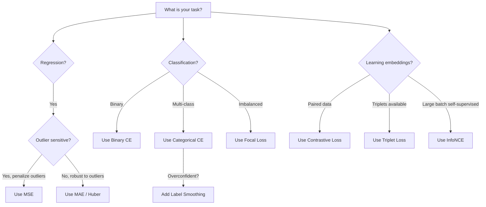
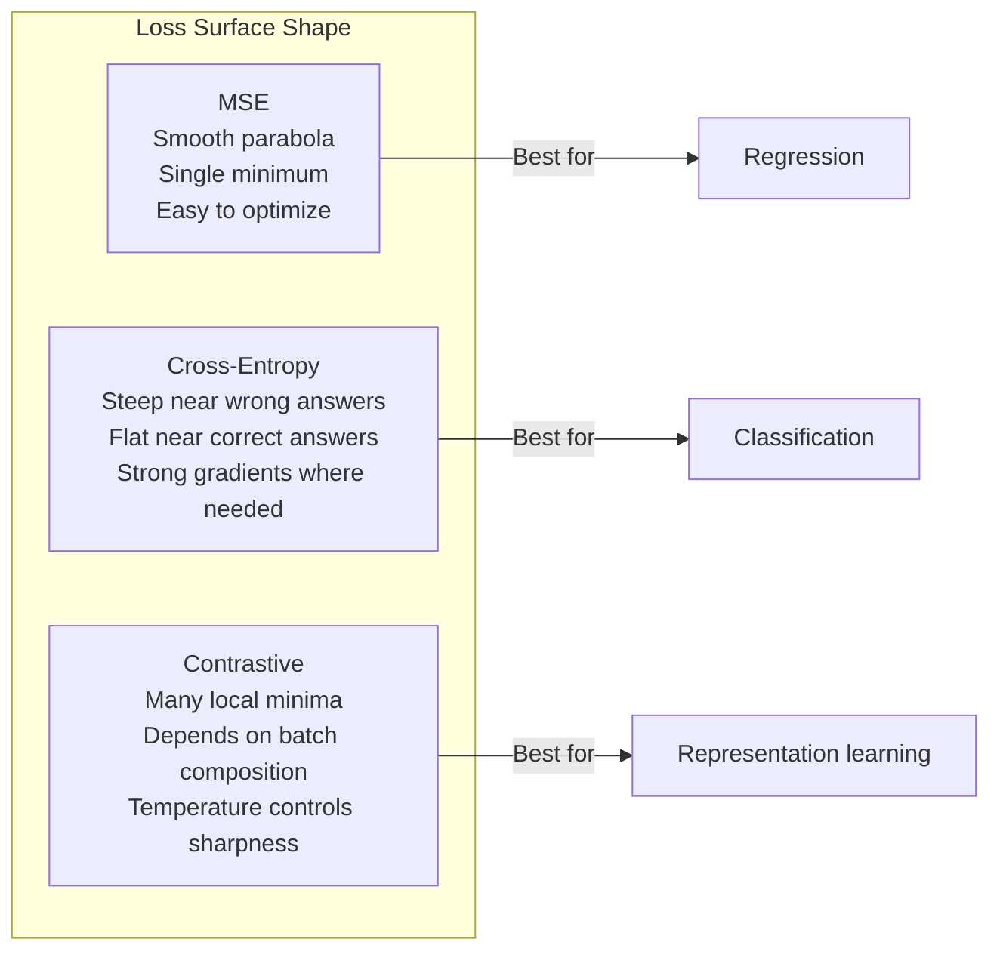

# Perte de fonction

> Votre réseau fait une prédiction. La vérité de base dit le contraire. Combien est-ce mal? Ce nombre est la perte. Choisissez la fonction de perte incorrecte et votre modèle optimise pour la mauvaise chose entièrement.

**Type:** Build
**Languages:** Python
**Prerequisites:** Lesson 03.04 (Activation Functions)
**Time:** ~75 minutes

## Objectifs d'apprentissage

- Implementer à partir de zéro les MSE, l'entropie croisée binaire, l'entropie croisée catégorique et la perte de contraste (InfoNCE) avec leurs gradients
- Expliquer pourquoi MSE ne réussit pas à être classé en démontrant le mode de défaillance "prévision 0.5 pour tout"
- Appliquer un éclairage de lissage à l'entropie croisée et décrire comment il empêche les prédictions trop confiantes
- Choisissez la bonne fonction de perte pour la régression, la classification binaire, la classification multi-classes et l'intégration des tâches d'apprentissage

## Le problème

Un modèle qui réduit le MSE sur un problème de classification prédit avec confiance 0,5 pour tout.

La fonction de perte est la seule chose que votre modèle optimise réellement. Pas de précision. Pas le score de F1. Pas quelle que soit la métrique que vous rapportez à votre manager. L'optimisateur prend le gradient de la fonction de perte et ajuste les poids pour rendre ce nombre plus petit. Si la fonction de perte ne capture pas ce que vous aimez, le modèle trouvera le moyen mathématiquement le moins cher de la satisfaire, et cette façon n'est presque jamais ce que vous vouliez.

Voici un exemple concret. Vous avez une tâche de classification binaire. Deux classes, 50/50 partagées. Vous utilisez l'ESM comme votre perte. Le modèle prédit 0,5 pour chaque entrée. Le taux moyen d'épilepsie est de 0,25, ce qui est le minimum possible sans vraiment apprendre quoi que ce soit. Le modèle a une capacité discriminatoire zéro mais il a techniquement minimisé votre fonction de perte. Passez à l'entropie croisée et le même modèle est forcé de pousser les prédictions vers 0 ou 1, parce que -log(0.5) = 0.693 est une perte terrible, tandis que -log(0.99) = 0.01 récompense les prédictions correctes en toute confiance. Le choix de la fonction de perte est la différence entre un modèle qui apprend et un modèle qui joue la métrique.

Cela devient pire. Dans l'apprentissage autosuffisant, vous n'avez même pas d'étiquettes. La perte de contraste définit entièrement le signal d'apprentissage: ce qui compte comme similaire, ce qui compte comme différent, et à quel point le modèle devrait les séparer. Faites-vous tort par la perte de contraste et vos intégrations s'effondrent à un seul point - chaque entrée correspond au même vecteur. Techniquement, perte zéro. Totalement inutile.

## Le concept

### Échec moyen carré (MSE)

Le paramètre de régression. Comptez la différence carrée entre la prédiction et la cible, moyenne sur tous les échantillons.

```
MSE = (1/n) * sum((y_pred - y_true)^2)
```

Pourquoi le quadratage est important: il pénalise les erreurs importantes quadratiquement. Une erreur de 2 coûte 4 fois plus qu'une erreur de 1. Une erreur de 10 coûte 100 fois. Cela rend MSE sensible aux valeurs anormales - une seule prédiction très erronée domine la perte.

Numéros réels: si votre modèle prédit les prix des logements et est déduit par $10,000 on most houses but off by $200 000 sur un manoir, MSE va tenter de réparer ce manoir, ce qui pourrait nuire à la performance des 99 autres maisons.

Le gradient de l'ESM par rapport à une prédiction est le suivant:

```
dMSE/dy_pred = (2/n) * (y_pred - y_true)
```

L'erreur est linéaire. Les erreurs plus importantes ont des gradients plus grands. C'est une fonctionnalité de régression (les grandes erreurs nécessitent de grandes corrections) et un bug pour la classification (vous voulez pénaliser les réponses incorrectes en toute confiance de manière exponentielle, pas linéaire).

### Perte de l'entropie croisée

La fonction de perte pour la classification. Enracinée dans la théorie de l'information, elle mesure la divergence entre la distribution de probabilité prévue et la distribution réelle.

**Binary Cross-Entropy (BCE):**

```
BCE = -(y * log(p) + (1 - y) * log(1 - p))
```

Là où y est l'étiquette vraie (0 ou 1) et p est la probabilité prévue.

Pourquoi -log(p) fonctionne: lorsque le vrai label est 1 et que vous prédisez p = 0,99, la perte est -log(0,99) = 0,01. Lorsque vous prédisez p = 0,01, la perte est -log(0,01) = 4,6. Cette différence de 460x est la raison pour laquelle l'entropie croisée fonctionne.

Le gradient raconte la même histoire:

```
dBCE/dp = -(y/p) + (1-y)/(1-p)
```

Lorsque y = 1 et p est proche de zéro, le gradient est -1/p qui approche l'infini négatif. Le modèle reçoit un signal énorme pour corriger son erreur.

**Categorical Cross-Entropy:**

Pour la classification multi-classe avec des cibles codées uniques.

```
CCE = -sum(y_i * log(p_i))
```

Seule la classe vraie contribue à la perte (parce que toutes les autres y_i sont zéro). Si il y a 10 classes et que la classe correcte obtient la probabilité de 0,1 (d'une devinette aléatoire), la perte est -log(0.1) = 2.3.

### Pourquoi l'ESM ne peut pas être classé



Les gradients de MSE s'appliquent lorsque les prédictions sont proches de 0 ou 1 (en raison de la saturation du sigmoïde).

### Légalisation des étiquettes

Les étiquettes standard de l'étiquette "c'est 100% classe 3 et 0% tout le reste" sont très fortes.

```
smooth_label = (1 - alpha) * one_hot + alpha / num_classes
```

Avec alpha = 0,1 et 10 classes: au lieu de [0, 0, 1, 0, ...], la cible devient [0, 01, 0, 01, 0, 91, 0, 01, ...].

Pourquoi cela fonctionne: un modèle qui tente de produire exactement 1,0 à travers un softmax doit pousser les logits à l'infini. Cela provoque une trop grande confiance, nuit à la généralisation et rend le modèle fragile pour le changement de distribution.

### Perte de contraste

Pas d'étiquettes, pas de classes, juste des paires d'entrées et la question: sont-elles similaires ou différentes ?

**SimCLR-style contrastive loss (NT-Xent / InfoNCE):**

Prenez une image. Créez deux vues augmentées de celle-ci (croûte, rotation, vibration de couleur). Ce sont les "pares positives" - elles devraient avoir des embrasements similaires. Chaque autre image du lot forme une "parée négative" - elles devraient avoir des embrasements différents.

```
L = -log(exp(sim(z_i, z_j) / tau) / sum(exp(sim(z_i, z_k) / tau)))
```

Là où sim() est la similitude cosine, z_i et z_j sont la paire positive, la somme est au-dessus de tous les négatifs, et tau (température) contrôle la façon dont la distribution est nette.

Les nombres réels: la taille du lot 256 signifie 255 négatifs par paire positive. La température tau = 0,07 (SimCLR par défaut). La perte ressemble à un softmax sur les similitudes - il veut que la similitude de la paire positive soit la plus élevée parmi toutes les 256 options.

**Triplet Loss:**

Prend trois entrées: ancrage, positif (même classe), négatif (classe différente).

```
L = max(0, d(anchor, positive) - d(anchor, negative) + margin)
```

La marge (typiquement 0,2-1.0) impose un écart minimum entre les distances positives et négatives. Si le négatif est déjà assez loin, la perte est nulle - pas de gradient, pas de mise à jour. Cela rend l'entraînement efficace mais nécessite une extraction minutieuse des triplets (choisir des négatifs durs qui sont proches de l'ancre).

### Perte de la vue

Pour les ensembles de données déséquilibrés. L'entropie croisée standard traite tous les exemples correctement classés de manière égale.

```
FL = -alpha * (1 - p_t)^gamma * log(p_t)
```

Lorsque p_t est la probabilité prédite de la classe vraie et que la gamma contrôle la mise au point. Avec gamma = 0, c'est une entropie croisée standard. Avec gamma = 2 (la valeur par défaut):

- Exemple simple (p_t = 0,9): poids = (0,1) ^2 = 0,01.
- Exemple dur (p_t = 0,1): poids = (0,9) ^2 = 0,81.

La perte de focale a été introduite par Lin et coll. pour la détection d'objets, où 99% des régions candidates sont de fond (négatifs faciles).

### Arbre de décision de perte de fonction



### Des pertes de paysage



```figure
cross-entropy-loss
```

## Faites-le

### Étape 1: MSE et son degré

```python
def mse(predictions, targets):
    n = len(predictions)
    total = 0.0
    for p, t in zip(predictions, targets):
        total += (p - t) ** 2
    return total / n

def mse_gradient(predictions, targets):
    n = len(predictions)
    grads = []
    for p, t in zip(predictions, targets):
        grads.append(2.0 * (p - t) / n)
    return grads
```

### Étape 2: Entropie croisée binaire

Le problème log(0) est réel. Si le modèle prédit exactement 0 pour un exemple positif, log(0) = infini négatif.

```python
import math

def binary_cross_entropy(predictions, targets, eps=1e-15):
    n = len(predictions)
    total = 0.0
    for p, t in zip(predictions, targets):
        p_clipped = max(eps, min(1 - eps, p))
        total += -(t * math.log(p_clipped) + (1 - t) * math.log(1 - p_clipped))
    return total / n

def bce_gradient(predictions, targets, eps=1e-15):
    grads = []
    for p, t in zip(predictions, targets):
        p_clipped = max(eps, min(1 - eps, p))
        grads.append(-(t / p_clipped) + (1 - t) / (1 - p_clipped))
    return grads
```

### Étape 3: Entropie croisée catégorique avec Softmax

Softmax convertit les logits en probabilités, puis calculons l'entropie croisée contre des cibles uniques.

```python
def softmax(logits):
    max_val = max(logits)
    exps = [math.exp(x - max_val) for x in logits]
    total = sum(exps)
    return [e / total for e in exps]

def categorical_cross_entropy(logits, target_index, eps=1e-15):
    probs = softmax(logits)
    p = max(eps, probs[target_index])
    return -math.log(p)

def cce_gradient(logits, target_index):
    probs = softmax(logits)
    grads = list(probs)
    grads[target_index] -= 1.0
    return grads
```

Le gradient de softmax + entropie croisée simplifie magnifiquement: il est juste (probabilité prévue - 1) pour la classe réelle, et (probabilité prévue) pour toutes les autres classes. Cette élégante simplification n'est pas une coïncidence - c'est pourquoi softmax et entropie croisée sont couplés.

### Étape 4: Légalisation de l'étiquette

```python
def label_smoothed_cce(logits, target_index, num_classes, alpha=0.1, eps=1e-15):
    probs = softmax(logits)
    loss = 0.0
    for i in range(num_classes):
        if i == target_index:
            smooth_target = 1.0 - alpha + alpha / num_classes
        else:
            smooth_target = alpha / num_classes
        p = max(eps, probs[i])
        loss += -smooth_target * math.log(p)
    return loss
```

### Étape 5: Perte de contraste (InfoNCE simplifié)

```python
def cosine_similarity(a, b):
    dot = sum(x * y for x, y in zip(a, b))
    norm_a = math.sqrt(sum(x * x for x in a))
    norm_b = math.sqrt(sum(x * x for x in b))
    if norm_a < 1e-10 or norm_b < 1e-10:
        return 0.0
    return dot / (norm_a * norm_b)

def contrastive_loss(anchor, positive, negatives, temperature=0.07):
    sim_pos = cosine_similarity(anchor, positive) / temperature
    sim_negs = [cosine_similarity(anchor, neg) / temperature for neg in negatives]

    max_sim = max(sim_pos, max(sim_negs)) if sim_negs else sim_pos
    exp_pos = math.exp(sim_pos - max_sim)
    exp_negs = [math.exp(s - max_sim) for s in sim_negs]
    total_exp = exp_pos + sum(exp_negs)

    return -math.log(max(1e-15, exp_pos / total_exp))
```

### Étape 6: MSE et entropie croisée sur la classification

Exercer le même réseau à partir de la leçon 04 (ensemble de données de cercle) avec les deux fonctions de perte.

```python
import random

def sigmoid(x):
    x = max(-500, min(500, x))
    return 1.0 / (1.0 + math.exp(-x))

def make_circle_data(n=200, seed=42):
    random.seed(seed)
    data = []
    for _ in range(n):
        x = random.uniform(-2, 2)
        y = random.uniform(-2, 2)
        label = 1.0 if x * x + y * y < 1.5 else 0.0
        data.append(([x, y], label))
    return data


class LossComparisonNetwork:
    def __init__(self, loss_type="bce", hidden_size=8, lr=0.1):
        random.seed(0)
        self.loss_type = loss_type
        self.lr = lr
        self.hidden_size = hidden_size

        self.w1 = [[random.gauss(0, 0.5) for _ in range(2)] for _ in range(hidden_size)]
        self.b1 = [0.0] * hidden_size
        self.w2 = [random.gauss(0, 0.5) for _ in range(hidden_size)]
        self.b2 = 0.0

    def forward(self, x):
        self.x = x
        self.z1 = []
        self.h = []
        for i in range(self.hidden_size):
            z = self.w1[i][0] * x[0] + self.w1[i][1] * x[1] + self.b1[i]
            self.z1.append(z)
            self.h.append(max(0.0, z))

        self.z2 = sum(self.w2[i] * self.h[i] for i in range(self.hidden_size)) + self.b2
        self.out = sigmoid(self.z2)
        return self.out

    def backward(self, target):
        if self.loss_type == "mse":
            d_loss = 2.0 * (self.out - target)
        else:
            eps = 1e-15
            p = max(eps, min(1 - eps, self.out))
            d_loss = -(target / p) + (1 - target) / (1 - p)

        d_sigmoid = self.out * (1 - self.out)
        d_out = d_loss * d_sigmoid

        for i in range(self.hidden_size):
            d_relu = 1.0 if self.z1[i] > 0 else 0.0
            d_h = d_out * self.w2[i] * d_relu
            self.w2[i] -= self.lr * d_out * self.h[i]
            for j in range(2):
                self.w1[i][j] -= self.lr * d_h * self.x[j]
            self.b1[i] -= self.lr * d_h
        self.b2 -= self.lr * d_out

    def compute_loss(self, pred, target):
        if self.loss_type == "mse":
            return (pred - target) ** 2
        else:
            eps = 1e-15
            p = max(eps, min(1 - eps, pred))
            return -(target * math.log(p) + (1 - target) * math.log(1 - p))

    def train(self, data, epochs=200):
        losses = []
        for epoch in range(epochs):
            total_loss = 0.0
            correct = 0
            for x, y in data:
                pred = self.forward(x)
                self.backward(y)
                total_loss += self.compute_loss(pred, y)
                if (pred >= 0.5) == (y >= 0.5):
                    correct += 1
            avg_loss = total_loss / len(data)
            accuracy = correct / len(data) * 100
            losses.append((avg_loss, accuracy))
            if epoch % 50 == 0 or epoch == epochs - 1:
                print(f"    Epoch {epoch:3d}: loss={avg_loss:.4f}, accuracy={accuracy:.1f}%")
        return losses
```

## Utilisez-le

PyTorch fournit toutes les fonctions de perte standard avec une stabilité numérique intégrée dans:

```python
import torch
import torch.nn as nn
import torch.nn.functional as F

predictions = torch.tensor([0.9, 0.1, 0.7], requires_grad=True)
targets = torch.tensor([1.0, 0.0, 1.0])

mse_loss = F.mse_loss(predictions, targets)
bce_loss = F.binary_cross_entropy(predictions, targets)

logits = torch.randn(4, 10)
labels = torch.tensor([3, 7, 1, 9])
ce_loss = F.cross_entropy(logits, labels)
ce_smooth = F.cross_entropy(logits, labels, label_smoothing=0.1)
```

Utilisation `F.cross_entropy`(non)`F.nll_loss`Il combine log-softmax et probabilité log négative dans une opération stable numériquement. Appliquer softmax séparément puis prendre le log est moins stable - vous perdez la précision dans la soustraction de grands exponentiels.

Pour l'apprentissage contrasté, la plupart des équipes utilisent des implémentations personnalisées ou des bibliothèques comme `lightly`ou `pytorch-metric-learning`. La boucle de base est toujours la même: calculer des similitudes par paires, créer le softmax sur les positifs et les négatifs, rétrécir.

## La faire partir

Cette leçon donne:
- `outputs/prompt-loss-function-selector.md`-- une requête réutilisable pour choisir la bonne fonction de perte
- `outputs/prompt-loss-debugger.md`- une demande de diagnostic pour quand votre courbe de perte semble mal

## Exercices

1. Implémenter la perte de Huber (perte L1 lisse), qui est MSE pour les petites erreurs et MAE pour les grandes erreurs.

2. Ajouter la perte de focus à la boucle d'entraînement de classification binaire. Créer un ensemble de données déséquilibré (90% classe 0, 10% classe 1). Comparer la perte de focus standard BCE vs. (gamma=2) sur le rappel de classe minoritaire après 200 époques.

3. Implémenter la perte de triplets avec l'exploitation négative semi-dure. Générer des données d'intégration 2D pour 5 classes. Pour chaque ancrage, trouver le négatif le plus dur qui est encore plus loin que le positif (semi-dure). Comparer la convergence à la sélection aléatoire de triplets.

4. Exécutez la comparaison MSE vs entropie croisée, mais suivez les magnitudes de gradient à chaque couche pendant l'entraînement.

5. Mettre en œuvre la perte de divergence KL et vérifier que la réduction de la KL ((true des choses prédites) donne les mêmes gradients que l'entropie croisée lorsque la réelle distribution est un-chaud.

## Les termes clés

| Term | What people say | What it actually means |
|------|----------------|----------------------|
| Loss function | "How wrong the model is" | A differentiable function mapping predictions and targets to a scalar that the optimizer minimizes |
| MSE | "Average squared error" | Mean of squared differences between predictions and targets; penalizes large errors quadratically |
| Cross-entropy | "The classification loss" | Measures divergence between predicted probability distribution and true distribution using -log(p) |
| Binary cross-entropy | "BCE" | Cross-entropy for two classes: -(y*log(p) + (1-y)*log(1-p)) |
| Label smoothing | "Softening the targets" | Replacing hard 0/1 targets with soft values (e.g., 0.1/0.9) to prevent overconfidence and improve generalization |
| Contrastive loss | "Pull together, push apart" | A loss that learns representations by making similar pairs close and dissimilar pairs far in embedding space |
| InfoNCE | "The CLIP/SimCLR loss" | Normalized temperature-scaled cross-entropy over similarity scores; treats contrastive learning as classification |
| Focal loss | "The imbalanced data fix" | Cross-entropy weighted by (1-p_t)^gamma to down-weight easy examples and focus on hard ones |
| Triplet loss | "Anchor-positive-negative" | Pushes anchor closer to positive than negative by at least a margin in embedding space |
| Temperature | "Sharpness knob" | A scalar divisor on logits/similarities that controls how peaked the resulting distribution is; lower = sharper |

## Pour en savoir plus

- Lin et coll., " Perte de focus pour la détection d'objets denses " (2017) -- introduit la perte de focus pour la gestion d'un déséquilibre de classe extrême dans la détection d'objets (RetinaNet)
- Chen et coll., "Un cadre simple pour l'apprentissage contrasté des représentations visuelles" (SimCLR, 2020) -- définit le pipeline d'apprentissage contrasté moderne avec perte NT-Xent
- Szegedy et al., "Rethinking the Inception Architecture" (2016) -- introduit le lissage d'étiquettes comme technique de régularisation, maintenant standard dans la plupart des grands modèles
- Hinton et coll., "Distiller les connaissances dans un réseau neuronal" (2015) -- distillation des connaissances à l'aide de cibles douces et de la divergence KL, fondamental pour la compression des modèles
