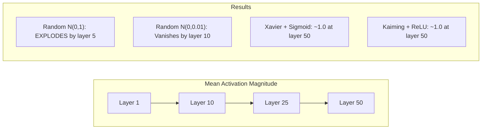
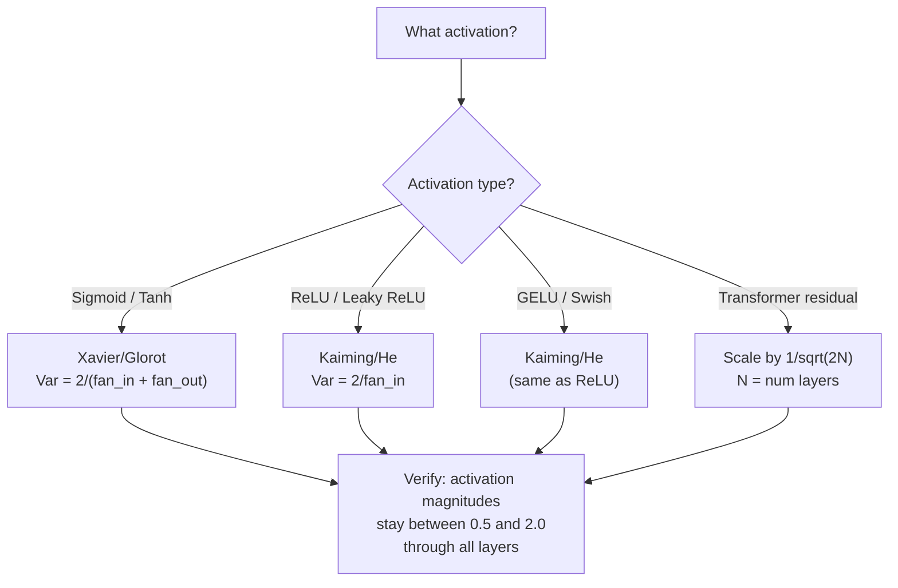

# Initialisation du poids et stabilité de l'entraînement

> Initialement mal et l'entraînement ne commence jamais.

**Type:** Build
**Languages:** Python
**Prerequisites:** Lesson 03.04 (Activation Functions), Lesson 03.07 (Regularization)
**Time:** ~90 minutes

## Objectifs d'apprentissage

- Implémenter des stratégies d'initialisation zéro, aléatoire, Xavier/Glorot et Kaiming/He et mesurer leur effet sur les magnitudes d'activation à travers 50 couches
- Déduire pourquoi Xavier init utilise Var(w) = 2/(fan_in + fan_out) et Kaiming utilise Var(w) = 2/fan_in
- Démontre le problème de symétrie avec initialisation zéro et explique pourquoi l'échelle aléatoire seule est insuffisante
- Correspondre la bonne stratégie d'initialisation à la fonction d'activation: Xavier pour sigmoid/tanh, Kaiming pour ReLU/GELU

## Le problème

Toutes les valeurs sont initiales à zéro. Rien n'apprend. Chaque neurone calcule la même fonction, reçoit le même gradient et se met à jour de manière identique. Après 10 000 époques, votre couche cachée de 512 neurones est toujours 512 copies du même neurone. Vous avez payé pour 512 paramètres et obtenu 1.

Les activations explosent à travers le réseau. À la couche 10, les valeurs atteignent 1e15. à la couche 20, elles débordent à l'infini.

Les initialiser au hasard à partir d'une distribution normale standard. Fonctionne pour 3 couches. À 50 couches, le signal s'effondre à zéro ou détonne à l'infini selon que l'échelle aléatoire était légèrement trop petite ou légèrement trop grande. La frontière entre "fonctionne" et "foute" est mince comme une rasoir.

L'initialisation du poids est la décision la plus sous-estimée dans l'apprentissage profond. L'architecture obtient des documents. Les optimistes obtiennent des articles de blog. L'initialisation obtient une note de bas de page. Mais faites-le mal et rien d'autre n'a d'importance - votre réseau est mort avant que la formation commence.

## Le concept

### Le problème de la symétrie

Chaque neurone dans une couche a la même structure: multipliez les entrées par les poids, ajoutez un biais, appliquez l'activation. Si tous les poids commencent à la même valeur (zéro est le cas extrême), chaque neurone calcule la même sortie. Pendant la répartition, chaque neurone reçoit le même gradient. Pendant la phase de mise à jour, chaque neurone change de la même quantité.

Vous êtes coincé. Le réseau a des centaines de paramètres, mais ils se déplacent tous en bloc. Cela s'appelle symétrie, et l'initialisation aléatoire est la façon brute-force de le casser. Chaque neurone commence à un point différent dans l'espace de poids, donc chacun apprend une caractéristique différente.

Mais le "champ" n'est pas suffisant. L'échelle de la chance détermine si le réseau fonctionne.

### Diffusion des variations par des couches

Considérez une seule couche avec des entrées fan_in:

```
z = w1*x1 + w2*x2 + ... + w_n*x_n
```

Si chaque poids wi est tiré d'une distribution avec variance Var(w) et chaque entrée xi a variance Var(x), la variance de sortie est:

```
Var(z) = fan_in * Var(w) * Var(x)
```

Si Var(w) = 1 et fan_in = 512, la variance de sortie est 512x la variance d'entrée. Après 10 couches: 512 ^ 10 = 1,2e27. Votre signal a explosé.

Si Var ((w) = 0,001, la variance de sortie se réduit de 0,001 * 512 = 0,512 par couche. Après 10 couches: 0,512^10 = 0,00013. Votre signal a disparu.

L'objectif: choisir Var(w) afin que Var(z) = Var(x). La magnitude du signal reste constante à travers les couches.

### L'initialisation Xavier/Glorot

Glorot et Bengio (2010) ont dérivé la solution pour les activations sigmoïdes et tanh.

```
Var(w) = 2 / (fan_in + fan_out)
```

Dans la pratique, les poids sont tirés de:

```
w ~ Uniform(-limit, limit)  where limit = sqrt(6 / (fan_in + fan_out))
```

ou

```
w ~ Normal(0, sqrt(2 / (fan_in + fan_out)))
```

Cela fonctionne parce que le sigmoïde et le tanh sont à peu près linéaires près de zéro, où vivent des activations correctement initiales.

### Initialité Kaiming/He

La réLU tue la moitié des sorties (tout ce qui est négatif devient zéro). Le fan_in effectif est réduit de moitié parce que en moyenne la moitié des entrées sont zéro. Xavier init ne tient pas compte de cela - il sous-estime la variance nécessaire.

He et al. (2015) ont ajusté la formule:

```
Var(w) = 2 / fan_in
```

Les poids sont tirés de:

```
w ~ Normal(0, sqrt(2 / fan_in))
```

Le facteur 2 compense le fait que ReLU réduise à zéro la moitié des activations. Sans lui, le signal se réduit de ~ 0,5 fois par couche. Avec 50 couches: 0,5^50 = 8,8e-16.

### Initialisation du transformateur

GPT-2 introduit un modèle différent. Les connexions résiduelles ajoutent la sortie de chaque sous-couche à son entrée:

```
x = x + sublayer(x)
```

Chaque addition augmente la variance. Avec N couches résiduelles, la variance augmente proportionnellement à N. GPT-2 élève le poids des couches résiduelles par 1/sqrt(2N), où N est le nombre de couches. Cela maintient la magnitude du signal accumulé stable.

Llama 3 (405B paramètres, 126 couches) utilise un schéma similaire. Sans cette mise à l'échelle, le flux résiduel augmenterait sans limites à travers 126 couches d'attention et de blocs de flux.

```mermaid
flowchart TD
    subgraph "Zero Init"
        Z1["Layer 1<br/>All weights = 0"] --> Z2["Layer 2<br/>All neurons identical"]
        Z2 --> Z3["Layer 3<br/>Still identical"]
        Z3 --> ZR["Result: 1 effective neuron<br/>regardless of width"]
    end

    subgraph "Xavier Init"
        X1["Layer 1<br/>Var = 2/(fan_in+fan_out)"] --> X2["Layer 2<br/>Signal stable"]
        X2 --> X3["Layer 50<br/>Signal stable"]
        X3 --> XR["Result: Trains with<br/>sigmoid/tanh"]
    end

    subgraph "Kaiming Init"
        K1["Layer 1<br/>Var = 2/fan_in"] --> K2["Layer 2<br/>Signal stable"]
        K2 --> K3["Layer 50<br/>Signal stable"]
        K3 --> KR["Result: Trains with<br/>ReLU/GELU"]
    end
```



### Magnitude d'activation à travers 50 couches



### Choisir le bon cœur



```figure
weight-init-variance
```

## Faites-le

### Étape 1: Stratégies d'initialisation

Quatre façons d'initialiser une matrice de poids. Chacun renvoie une liste de listes (une matrice 2D) avec des colonnes fan_in et des lignes fan_out.

```python
import math
import random


def zero_init(fan_in, fan_out):
    return [[0.0 for _ in range(fan_in)] for _ in range(fan_out)]


def random_init(fan_in, fan_out, scale=1.0):
    return [[random.gauss(0, scale) for _ in range(fan_in)] for _ in range(fan_out)]


def xavier_init(fan_in, fan_out):
    std = math.sqrt(2.0 / (fan_in + fan_out))
    return [[random.gauss(0, std) for _ in range(fan_in)] for _ in range(fan_out)]


def kaiming_init(fan_in, fan_out):
    std = math.sqrt(2.0 / fan_in)
    return [[random.gauss(0, std) for _ in range(fan_in)] for _ in range(fan_out)]
```

### Étape 2: Fonctions d'activation

Nous avons besoin de sigmoid, tanh et ReLU pour tester chaque stratégie init avec son activation prévue.

```python
def sigmoid(x):
    x = max(-500, min(500, x))
    return 1.0 / (1.0 + math.exp(-x))


def tanh_act(x):
    return math.tanh(x)


def relu(x):
    return max(0.0, x)
```

### Étape 3: Passez à travers 50 couches

Passer des données aléatoires à travers un réseau profond et mesurer la taille moyenne de l'activation à chaque couche.

```python
def forward_deep(init_fn, activation_fn, n_layers=50, width=64, n_samples=100):
    random.seed(42)
    layer_magnitudes = []

    inputs = [[random.gauss(0, 1) for _ in range(width)] for _ in range(n_samples)]

    for layer_idx in range(n_layers):
        weights = init_fn(width, width)
        biases = [0.0] * width

        new_inputs = []
        for sample in inputs:
            output = []
            for neuron_idx in range(width):
                z = sum(weights[neuron_idx][j] * sample[j] for j in range(width)) + biases[neuron_idx]
                output.append(activation_fn(z))
            new_inputs.append(output)
        inputs = new_inputs

        magnitudes = []
        for sample in inputs:
            magnitudes.append(sum(abs(v) for v in sample) / width)
        mean_mag = sum(magnitudes) / len(magnitudes)
        layer_magnitudes.append(mean_mag)

    return layer_magnitudes
```

### Étape 4: L'expérience

Exécutez toutes les combinaisons: init zéro, N(0,1), N(0,0.01 aléatoire), Xavier avec sigmoïde, Xavier avec tanh, Kaiming avec ReLU. Imprimez la magnitude à couches clés.

```python
def run_experiment():
    configs = [
        ("Zero init + Sigmoid", lambda fi, fo: zero_init(fi, fo), sigmoid),
        ("Random N(0,1) + ReLU", lambda fi, fo: random_init(fi, fo, 1.0), relu),
        ("Random N(0,0.01) + ReLU", lambda fi, fo: random_init(fi, fo, 0.01), relu),
        ("Xavier + Sigmoid", xavier_init, sigmoid),
        ("Xavier + Tanh", xavier_init, tanh_act),
        ("Kaiming + ReLU", kaiming_init, relu),
    ]

    print(f"{'Strategy':<30} {'L1':>10} {'L5':>10} {'L10':>10} {'L25':>10} {'L50':>10}")
    print("-" * 80)

    for name, init_fn, act_fn in configs:
        mags = forward_deep(init_fn, act_fn)
        row = f"{name:<30}"
        for idx in [0, 4, 9, 24, 49]:
            val = mags[idx]
            if val > 1e6:
                row += f" {'EXPLODED':>10}"
            elif val < 1e-6:
                row += f" {'VANISHED':>10}"
            else:
                row += f" {val:>10.4f}"
        print(row)
```

### Étape 5: démonstration de la symétrie

Montrez que l'initial zéro produit des neurones identiques.

```python
def symmetry_demo():
    random.seed(42)
    weights = zero_init(2, 4)
    biases = [0.0] * 4

    inputs = [0.5, -0.3]
    outputs = []
    for neuron_idx in range(4):
        z = sum(weights[neuron_idx][j] * inputs[j] for j in range(2)) + biases[neuron_idx]
        outputs.append(sigmoid(z))

    print("\nSymmetry Demo (4 neurons, zero init):")
    for i, out in enumerate(outputs):
        print(f"  Neuron {i}: output = {out:.6f}")
    all_same = all(abs(outputs[i] - outputs[0]) < 1e-10 for i in range(len(outputs)))
    print(f"  All identical: {all_same}")
    print(f"  Effective parameters: 1 (not {len(weights) * len(weights[0])})")
```

### Étape 6: Rapport de la taille de la couche par couche

Imprimez un graphique visuel de la grandeur de l'activation à travers 50 couches.

```python
def magnitude_report(name, magnitudes):
    print(f"\n{name}:")
    for i, mag in enumerate(magnitudes):
        if i % 5 == 0 or i == len(magnitudes) - 1:
            if mag > 1e6:
                bar = "X" * 50 + " EXPLODED"
            elif mag < 1e-6:
                bar = "." + " VANISHED"
            else:
                bar_len = min(50, max(1, int(mag * 10)))
                bar = "#" * bar_len
            print(f"  Layer {i+1:3d}: {bar} ({mag:.6f})")
```

## Utilisez-le

PyTorch fournit ces fonctions intégrées:

```python
import torch
import torch.nn as nn

layer = nn.Linear(512, 256)

nn.init.xavier_uniform_(layer.weight)
nn.init.xavier_normal_(layer.weight)

nn.init.kaiming_uniform_(layer.weight, nonlinearity='relu')
nn.init.kaiming_normal_(layer.weight, nonlinearity='relu')

nn.init.zeros_(layer.bias)
```

Quand vous appelez`nn.Linear(512, 256)`C'est pourquoi la plupart des réseaux simples " fonctionnent " - PyTorch a déjà fait le bon choix. Mais quand vous construisez des architectures personnalisées ou allez plus profondément que 20 couches, vous devez comprendre ce qui se passe et potentiellement annuler la défaillance.

Pour les transformateurs, les modèles HuggingFace gèrent généralement l'initialisation dans leur`_init_weights`La mise en œuvre de GPT-2 étalonne les projections résiduelles par 1/sqrt ((N). Si vous construisez un transformateur à partir de zéro, vous devez ajouter cela vous-même.

## La faire partir

Cette leçon donne:
- `outputs/prompt-init-strategy.md`-- un prompt qui diagnostique les problèmes d'initialisation du poids et recommande la bonne stratégie

## Exercices

1. Ajouter l'initialisation LeCun (Var = 1/fan_in, conçu pour l'activation SELU). Exécuter l'expérience de 50 couches avec LeCun init + tanh et comparer à Xavier + tanh.

2. Mettre en œuvre l'échelle résiduelle GPT-2: multipliez la sortie de chaque couche par 1/sqrt ((2*N) avant d'ajouter au flux résiduel.

3. Créer une fonction "initial health check" qui prend les dimensions de couche d'un réseau et le type d'activation, puis recommande la bonne initialisation et met en garde si l'initial actuel va causer des problèmes.

4. Exécutez l'expérience avec fan_in = 16 vs fan_in = 1024. Xavier et Kaiming s'adaptent à fan_in, mais l'initial aléatoire ne le fait pas. Montrez comment l'écart entre "fonctionne" et "sort" s'élargit avec les couches plus grandes.

5. Implémenter une initialisation orthogonale (générer une matrice aléatoire, calculer son SVD, utiliser la matrice orthogonale U).

## Les termes clés

| Term | What people say | What it actually means |
|------|----------------|----------------------|
| Weight initialization | "Set starting weights randomly" | The strategy for choosing initial weight values that determines whether a network can train at all |
| Symmetry breaking | "Make neurons different" | Using random initialization to ensure neurons learn distinct features instead of computing identical functions |
| Fan-in | "Number of inputs to a neuron" | The number of incoming connections, which determines how input variance accumulates in the weighted sum |
| Fan-out | "Number of outputs from a neuron" | The number of outgoing connections, relevant for maintaining gradient variance during backpropagation |
| Xavier/Glorot init | "The sigmoid initialization" | Var(w) = 2/(fan_in + fan_out), designed to preserve variance through sigmoid and tanh activations |
| Kaiming/He init | "The ReLU initialization" | Var(w) = 2/fan_in, accounts for ReLU zeroing half the activations |
| Variance propagation | "How signals grow or shrink through layers" | The mathematical analysis of how activation variance changes layer by layer based on weight scale |
| Residual scaling | "GPT-2's init trick" | Scaling residual connection weights by 1/sqrt(2N) to prevent variance growth through N transformer layers |
| Dead network | "Nothing trains" | A network where poor initialization causes all gradients to be zero or all activations to saturate |
| Exploding activations | "Values go to infinity" | When weight variance is too high, causing activation magnitudes to grow exponentially through layers |

## Pour en savoir plus

- Glorot & Bengio, "Comprendre la difficulté de former des réseaux neuronaux en flux profond" (2010) -- le document d'initialisation original Xavier avec analyse de variance
- He et al., "Profondir profondément dans les correcteurs" (2015) -- introduit l'initialisation de Kaiming pour les réseaux ReLU
- Radford et coll., "Les modèles de langage sont des apprenants multitâches non supervisés" (2019) -- papier GPT-2 avec initialisation de mise à l'échelle résiduelle
- Mishkin et Matas, "All You Need is a Good Init" (2016) -- initialisation de l'unité-variance de couche séquentielle, une alternative empirique aux formules analytiques
