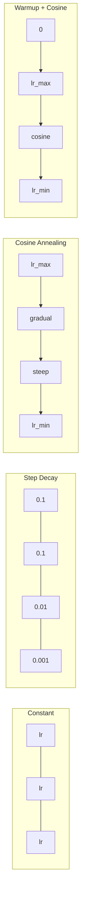
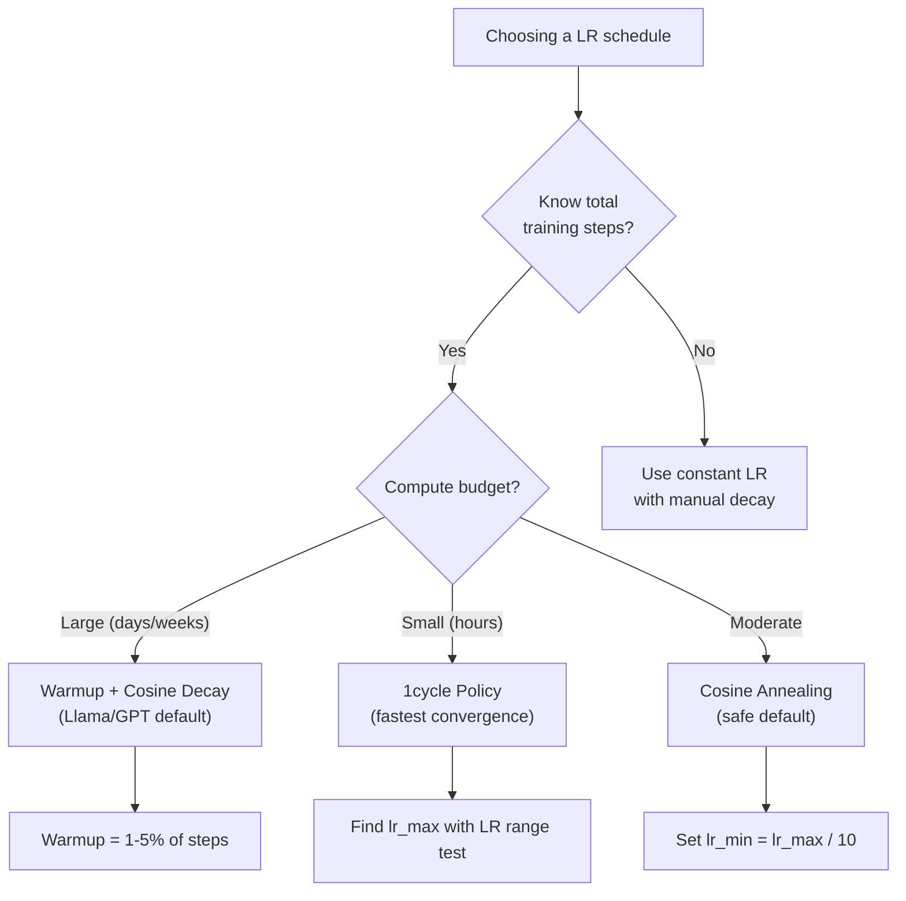
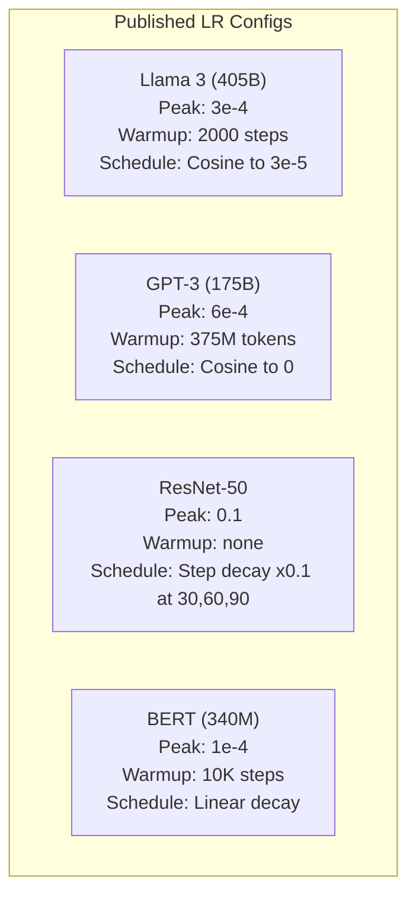

# Les horaires d'apprentissage et le réchauffement

> Le taux d'apprentissage est le seul hyperparamètre le plus important. pas l'architecture, pas la taille du jeu de données, pas la fonction d'activation, pas le taux d'apprentissage. Si vous ne réglez rien d'autre, réglez ceci.

**Type:** Build
**Languages:** Python
**Prerequisites:** Lesson 03.06 (Optimizers), Lesson 03.08 (Weight Initialization)
**Time:** ~90 minutes

## Objectifs d'apprentissage

- Implementer des calendriers constants, de décomposition en étapes, d'anneillage cosine, de réchauffement + cosine et de taux d'apprentissage de 1 cycle à partir de zéro
- Démontre les trois modes d'échec de la sélection du taux d'apprentissage: divergence (trop élevée), blocage (trop bas) et oscillation (pas de déclin)
- Expliquez pourquoi la préparation est nécessaire pour les optimistes d'Adam et comment elle stabilise la formation précoce.
- Comparer la vitesse de convergence dans les cinq programmes sur la même tâche et sélectionner celui qui convient à un budget de formation donné

## Le problème

Définir le taux d'apprentissage à 0,1. La formation diverge - la perte saute à l'infini en 3 étapes. Définir à 0,0001. La formation se balade - après 100 époques, le modèle a à peine déménagé du hasard. Définir à 0,01. La formation fonctionne pendant 50 époques, puis la perte oscille autour d'un minimum qu'elle ne peut jamais atteindre parce que les étapes sont trop grandes.

Le taux d'apprentissage optimal n'est pas constant. Il change pendant la formation. Au début, vous voulez que de grands pas couvrent le sol rapidement. En fin de formation, vous voulez que de petits pas s'installent dans un minimum net. La différence entre un modèle 90% précis et un modèle 95% précis est souvent juste le calendrier.

Chaque modèle majeur publié au cours des trois dernières années utilise un calendrier de taux d'apprentissage. Llama 3 a utilisé lr = 3e-4 avec 2000 étapes de réchauffement et la décomposition cosine à 3e-5. GPT-3 a utilisé lr = 6e-4 avec réchauffement de plus de 375 millions de jetons. Ce ne sont pas des choix arbitraires.

Vous devez comprendre les horaires car les paramètres par défaut ne fonctionneront pas pour votre problème. Lorsque vous ajustez un modèle prétrainé, le bon horaire est différent de l'entraînement à partir de zéro. Lorsque vous augmentez la taille du lot, la période de réchauffement doit changer. Lorsque l'entraînement se termine à l'étape 10,000, vous devez savoir si c'est un problème de calendrier ou autre.

## Le concept

### Taux d'apprentissage constant

Le plus simple, choisissez un numéro, utilisez-le pour chaque étape.

```
lr(t) = lr_0
```

Il est très peu optimal. Il est soit trop élevé pour la fin de l'entraînement (oscillation autour du minimum) ou trop bas pour le début (computation gaspillée sur de minuscules pas). Fonctionne bien pour les petits modèles et le débogage. Un choix terrible pour tout ce qui entraîne plus d'une heure.

### Décomposition des étapes

L'approche de la vieille école de l'ère ResNet: réduire le taux d'apprentissage d'un facteur (généralement 10 fois) à des époques fixes.

```
lr(t) = lr_0 * gamma^(floor(epoch / step_size))
```

Là où gamma = 0,1 et step_size = 30, lr diminue de 10 fois toutes les 30 époques. ResNet-50 a utilisé ceci -- lr = 0,1, diminue de 10 fois aux époques 30, 60 et 90.

Le problème: les points de déclin optimaux dépendent de l'ensemble de données et de l'architecture. Passez à un autre problème et vous devez réajuster le moment de la chute. Les transitions sont brusques - la perte peut augmenter lorsque le taux change soudainement.

### Le cosine annealing

Décomposition douce du taux d'apprentissage maximum au minimum, suivant une courbe cosine:

```
lr(t) = lr_min + 0.5 * (lr_max - lr_min) * (1 + cos(pi * t / T))
```

Où t est l'étape actuelle et T est le nombre total d'étapes.

À t=0, le terme cossin est 1, donc lr = lr_max. À t=T, le terme cossin est -1, donc lr = lr_min. La décomposition est douce au début, s'accélère au milieu, et devient douce à nouveau près de la fin.

C'est la norme par défaut pour la plupart des séances d'entraînement modernes. Aucun hyperparamètre à régler au-delà de lr_max et lr_min. La forme cosine correspond à l'observation empirique que la plupart de l'apprentissage se produit au milieu de l'entraînement - vous voulez des tailles raisonnables de pas pendant cette période critique.

### Pourquoi commencer petit

Adam et d'autres optimisateurs adaptatifs maintiennent des estimations en cours de moyenne de gradient et de variance. À l'étape 0, ces estimations sont initiales à zéro. Les premières mises à jour de gradient sont basées sur des statistiques de déchets. Si votre taux d'apprentissage est élevé pendant cette période, le modèle prend des mesures énormes et mal dirigées.

Warmup corrige cela. Commencez par un petit taux d'apprentissage (souvent lr_max / warmup_steps ou même zéro) et rampez linéairement à lr_max au cours des premières étapes N. Au moment où vous atteignez le taux d'apprentissage complet, les statistiques d'Adam se sont stabilisées.

```
lr(t) = lr_max * (t / warmup_steps)     for t < warmup_steps
```

Le réchauffement typique: 1 à 5% des étapes d'entraînement totales. Llama 3 entraîné pour environ 1,8 billions de jetons et réchauffé pour 2000 étapes. GPT-3 réchauffé plus de 375 millions de jetons.

### Réchauffement linéaire + décomposition cosine

Le modèle par défaut moderne, rampez linéairement, puis décomposez-vous avec le cosine:

```
if t < warmup_steps:
    lr(t) = lr_max * (t / warmup_steps)
else:
    progress = (t - warmup_steps) / (total_steps - warmup_steps)
    lr(t) = lr_min + 0.5 * (lr_max - lr_min) * (1 + cos(pi * progress))
```

C'est ce que Llama, GPT, PaLM et la plupart des transformateurs modernes utilisent. Le réchauffement empêche l'instabilité précoce.

### Politique du cycle

Découverte de Leslie Smith (2018): augmenter le taux d'apprentissage d'une valeur faible à une valeur élevée au premier semestre de formation, puis le ramper à nouveau à la deuxième moitié. Contra-intuitif - pourquoi augmenter le taux d'apprentissage à mi-chemin ?

La théorie: un taux d'apprentissage élevé agit comme une régularisation en ajoutant du bruit à la trajectoire d'optimisation. Le modèle explore plus du paysage de perte pendant la phase de rampe-up, en trouvant de meilleurs bassins.

```
Phase 1 (0 to T/2):    lr ramps from lr_max/25 to lr_max
Phase 2 (T/2 to T):    lr ramps from lr_max to lr_max/10000
```

Le cycle 1 entraîne souvent plus rapidement que le cousin annealing pour un budget calculé fixe.

### Les formes de l'horaire



### Tableau de débit des décisions



### Numéros réels tirés des modèles publiés



```figure
lr-schedule
```

## Faites-le

### Étape 1: Établissez des horaires

Chaque fonction prend la étape actuelle et renvoie le taux d'apprentissage à cette étape.

```python
import math


def constant_schedule(step, lr=0.01, **kwargs):
    return lr


def step_decay_schedule(step, lr=0.1, step_size=100, gamma=0.1, **kwargs):
    return lr * (gamma ** (step // step_size))


def cosine_schedule(step, lr=0.01, total_steps=1000, lr_min=1e-5, **kwargs):
    if step >= total_steps:
        return lr_min
    return lr_min + 0.5 * (lr - lr_min) * (1 + math.cos(math.pi * step / total_steps))


def warmup_cosine_schedule(step, lr=0.01, total_steps=1000, warmup_steps=100, lr_min=1e-5, **kwargs):
    if total_steps <= warmup_steps:
        return lr * (step / max(warmup_steps, 1))
    if step < warmup_steps:
        return lr * step / warmup_steps
    progress = (step - warmup_steps) / (total_steps - warmup_steps)
    return lr_min + 0.5 * (lr - lr_min) * (1 + math.cos(math.pi * progress))


def one_cycle_schedule(step, lr=0.01, total_steps=1000, **kwargs):
    mid = max(total_steps // 2, 1)
    if step < mid:
        return (lr / 25) + (lr - lr / 25) * step / mid
    else:
        progress = (step - mid) / max(total_steps - mid, 1)
        return lr * (1 - progress) + (lr / 10000) * progress
```

### Étape 2: visualisez tous les horaires

Imprimez un graphique basé sur du texte montrant comment chaque horaire évolue au cours de la formation.

```python
def visualize_schedule(name, schedule_fn, total_steps=500, **kwargs):
    steps = list(range(0, total_steps, total_steps // 20))
    if total_steps - 1 not in steps:
        steps.append(total_steps - 1)

    lrs = [schedule_fn(s, total_steps=total_steps, **kwargs) for s in steps]
    max_lr = max(lrs) if max(lrs) > 0 else 1.0

    print(f"\n{name}:")
    for s, lr_val in zip(steps, lrs):
        bar_len = int(lr_val / max_lr * 40)
        bar = "#" * bar_len
        print(f"  Step {s:4d}: lr={lr_val:.6f} {bar}")
```

### Étape 3: Réseau de formation

Un réseau simple à deux couches sur le jeu de données de cercle, comme les leçons précédentes, mais maintenant nous varions le calendrier.

```python
import random


def sigmoid(x):
    x = max(-500, min(500, x))
    return 1.0 / (1.0 + math.exp(-x))


def relu(x):
    return max(0.0, x)


def relu_deriv(x):
    return 1.0 if x > 0 else 0.0


def make_circle_data(n=200, seed=42):
    random.seed(seed)
    data = []
    for _ in range(n):
        x = random.uniform(-2, 2)
        y = random.uniform(-2, 2)
        label = 1.0 if x * x + y * y < 1.5 else 0.0
        data.append(([x, y], label))
    return data


def train_with_schedule(schedule_fn, schedule_name, data, epochs=300, base_lr=0.05, **kwargs):
    random.seed(0)
    hidden_size = 8
    total_steps = epochs * len(data)

    std = math.sqrt(2.0 / 2)
    w1 = [[random.gauss(0, std) for _ in range(2)] for _ in range(hidden_size)]
    b1 = [0.0] * hidden_size
    w2 = [random.gauss(0, std) for _ in range(hidden_size)]
    b2 = 0.0

    step = 0
    epoch_losses = []

    for epoch in range(epochs):
        total_loss = 0
        correct = 0

        for x, target in data:
            lr = schedule_fn(step, lr=base_lr, total_steps=total_steps, **kwargs)

            z1 = []
            h = []
            for i in range(hidden_size):
                z = w1[i][0] * x[0] + w1[i][1] * x[1] + b1[i]
                z1.append(z)
                h.append(relu(z))

            z2 = sum(w2[i] * h[i] for i in range(hidden_size)) + b2
            out = sigmoid(z2)

            error = out - target
            d_out = error * out * (1 - out)

            for i in range(hidden_size):
                d_h = d_out * w2[i] * relu_deriv(z1[i])
                w2[i] -= lr * d_out * h[i]
                for j in range(2):
                    w1[i][j] -= lr * d_h * x[j]
                b1[i] -= lr * d_h
            b2 -= lr * d_out

            total_loss += (out - target) ** 2
            if (out >= 0.5) == (target >= 0.5):
                correct += 1
            step += 1

        avg_loss = total_loss / len(data)
        accuracy = correct / len(data) * 100
        epoch_losses.append(avg_loss)

    return epoch_losses
```

### Étape 4: Comparer tous les horaires

Exercez le même réseau avec chaque horaire et comparez le comportement final de perte et de convergence.

```python
def compare_schedules(data):
    configs = [
        ("Constant", constant_schedule, {}),
        ("Step Decay", step_decay_schedule, {"step_size": 15000, "gamma": 0.1}),
        ("Cosine", cosine_schedule, {"lr_min": 1e-5}),
        ("Warmup+Cosine", warmup_cosine_schedule, {"warmup_steps": 3000, "lr_min": 1e-5}),
        ("1cycle", one_cycle_schedule, {}),
    ]

    print(f"\n{'Schedule':<20} {'Start Loss':>12} {'Mid Loss':>12} {'End Loss':>12} {'Best Loss':>12}")
    print("-" * 70)

    for name, schedule_fn, extra_kwargs in configs:
        losses = train_with_schedule(schedule_fn, name, data, epochs=300, base_lr=0.05, **extra_kwargs)
        mid_idx = len(losses) // 2
        best = min(losses)
        print(f"{name:<20} {losses[0]:>12.6f} {losses[mid_idx]:>12.6f} {losses[-1]:>12.6f} {best:>12.6f}")
```

### Étape 5: LR trop élevé contre trop bas

Démontre les trois modes de défaillance: trop élevé (divergence), trop bas (répulsion) et juste droit.

```python
def lr_sensitivity(data):
    learning_rates = [1.0, 0.1, 0.01, 0.001, 0.0001]

    print("\nLR Sensitivity (constant schedule, 100 epochs):")
    print(f"  {'LR':>10} {'Start Loss':>12} {'End Loss':>12} {'Status':>15}")
    print("  " + "-" * 52)

    for lr in learning_rates:
        losses = train_with_schedule(constant_schedule, f"lr={lr}", data, epochs=100, base_lr=lr)
        start = losses[0]
        end = losses[-1]

        if end > start or math.isnan(end) or end > 1.0:
            status = "DIVERGED"
        elif end > start * 0.9:
            status = "BARELY MOVED"
        elif end < 0.15:
            status = "CONVERGED"
        else:
            status = "LEARNING"

        end_str = f"{end:.6f}" if not math.isnan(end) else "NaN"
        print(f"  {lr:>10.4f} {start:>12.6f} {end_str:>12} {status:>15}")
```

## Utilisez-le

PyTorch fournit des planificateurs en `torch.optim.lr_scheduler`- Le numéro de la liste:

```python
import torch
import torch.optim as optim
from torch.optim.lr_scheduler import CosineAnnealingLR, OneCycleLR, StepLR

model = nn.Sequential(nn.Linear(10, 64), nn.ReLU(), nn.Linear(64, 1))
optimizer = optim.Adam(model.parameters(), lr=3e-4)

scheduler = CosineAnnealingLR(optimizer, T_max=1000, eta_min=1e-5)

for step in range(1000):
    loss = train_step(model, optimizer)
    scheduler.step()
```

Pour le réchauffement + cosine, utilisez un calendrier lambda ou le `get_cosine_schedule_with_warmup`de HuggingFace:

```python
from transformers import get_cosine_schedule_with_warmup

scheduler = get_cosine_schedule_with_warmup(
    optimizer,
    num_warmup_steps=2000,
    num_training_steps=100000,
)
```

La fonction HuggingFace est celle que la plupart des scripts de réglage fin Llama et GPT utilisent. Lorsque vous avez des doutes, utilisez chauffage + cosine avec chauffage = 3-5% des étapes totales.

## La faire partir

Cette leçon donne:
- `outputs/prompt-lr-schedule-advisor.md`-- une demande qui recommande le bon horaire de rythme d'apprentissage et les hyperparametres pour votre configuration de formation

## Exercices

1. Implémentation de décomposition exponentielle: lr(t) = lr_0 * gamma^t où gamma = 0,999.

2. Mettre en œuvre le test de la plage de fréquence d'apprentissage (Leslie Smith): entraîner pour quelques centaines de pas tout en augmentant exponentiellement la LR de 1e-7 à 1.

3. Travailler avec chauffage + cosine mais varier la durée de chauffage: 0%, 1%, 5%, 10%, 20% des étapes totales.

4. Appliquer l'anneillage cosine avec redémarrage chaud (RGCS): réinitialiser le taux d'apprentissage à lr_max à chaque étape T et recommencer à se décomposer.

5. Construire un "chirurgien de calendrier" qui surveille la perte d'entraînement et passe automatiquement de la réchauffement au cosine lorsque la perte se stabilise, et réduit l'irr si la perte se développe trop longtemps.

## Les termes clés

| Term | What people say | What it actually means |
|------|----------------|----------------------|
| Learning rate | "How fast the model learns" | The scalar that multiplies the gradient to determine the parameter update size |
| Schedule | "Change the LR over time" | A function that maps training step to learning rate, designed to optimize convergence |
| Warmup | "Start with a small LR" | Linearly ramping the LR from near-zero to the target value over the first N steps to stabilize optimizer statistics |
| Cosine annealing | "Smooth LR decay" | Decreasing the LR following a cosine curve from lr_max to lr_min over training |
| Step decay | "Drop LR at milestones" | Multiplying the LR by a factor (usually 0.1) at fixed epoch intervals |
| 1cycle policy | "Up then down" | Leslie Smith's method of ramping LR up then down in a single cycle for faster convergence |
| LR range test | "Find the best learning rate" | Training briefly while increasing LR to find the value where loss starts diverging |
| Cosine with warm restarts | "Reset and repeat" | Periodically resetting the LR to lr_max and decaying again (SGDR) |
| Eta min | "The floor for the LR" | The minimum learning rate that the schedule decays to |
| Peak learning rate | "The maximum LR" | The highest LR reached during training, typically after warmup |

## Pour en savoir plus

- Loshchilov & Hutter, "SGDR: Descente du gradient stochastique avec des redémarrages chauds" (2017) -- introduit l'anneillage cosine et les redémarrages chauds
- Smith, "Super-Convergence: formation très rapide des réseaux neuronaux utilisant des taux d'apprentissage élevés" (2018) -- le document de politique du 1er cycle
- Touvron et coll., "Llama 2: Fondation ouverte et modèles de chat bien ajustés" (2023) -- documentant le calendrier de réchauffement + cosine utilisé à l'échelle
- Goyal et coll., "GD minibatch précis et de grande taille: formation ImageNet en 1 heure" (2017) -- règle d'échelle linéaire et réchauffement pour l'entraînement de grands lots
