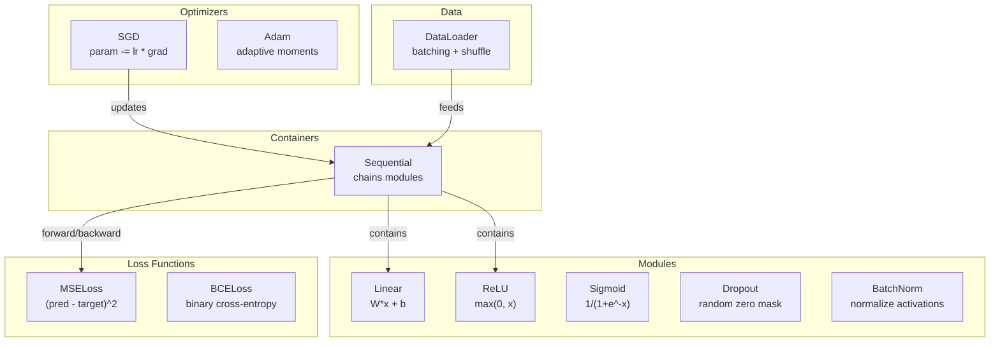
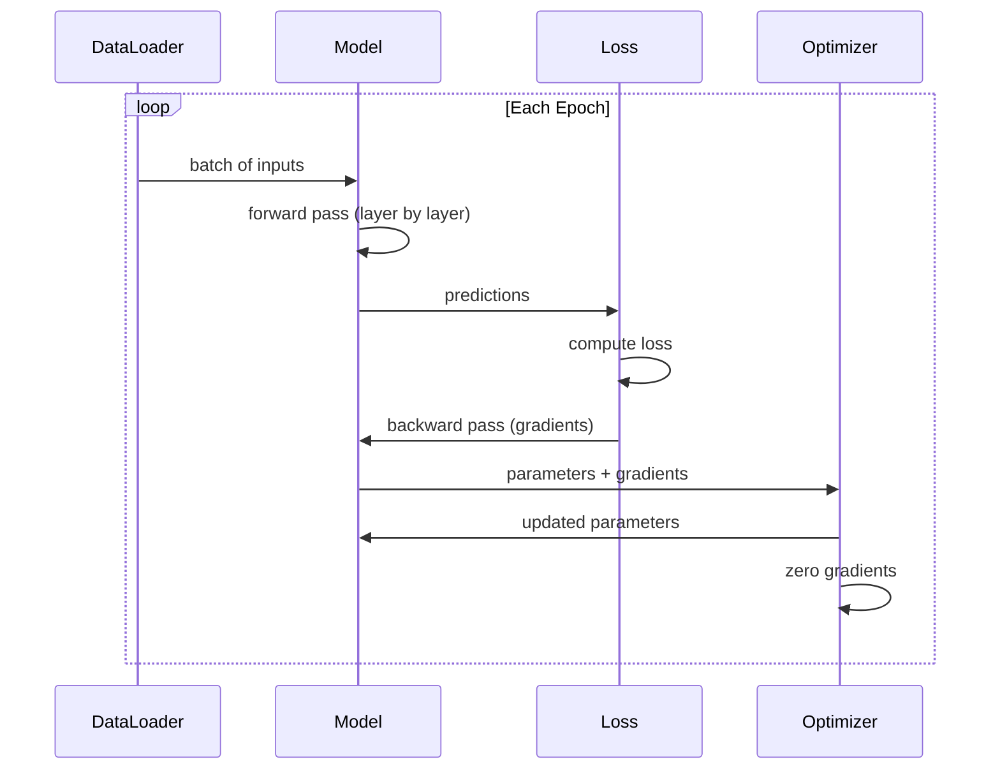
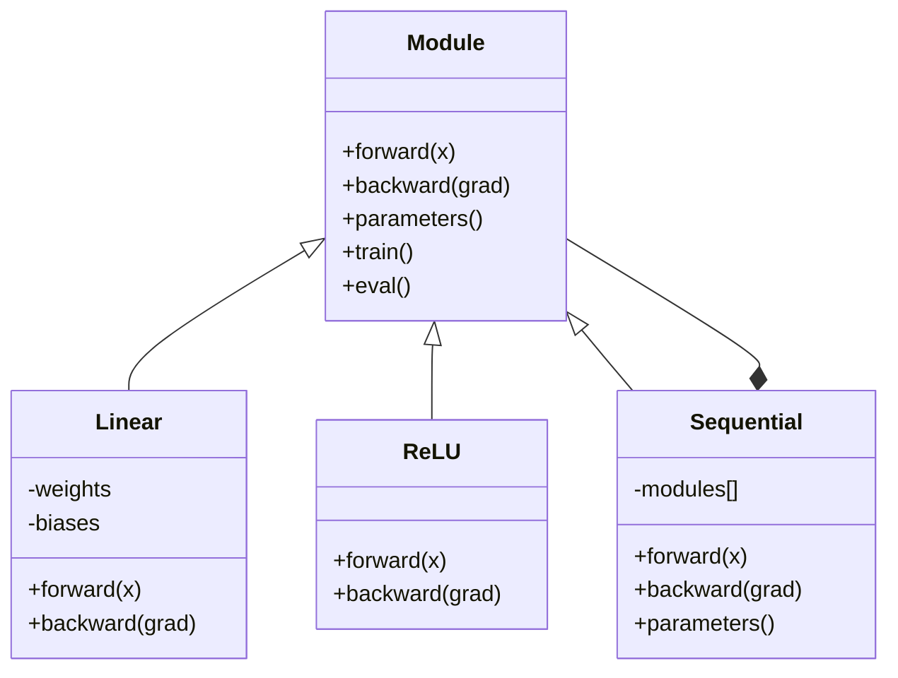

# Construisez votre propre mini-cadre

> Vous avez construit des neurones, des couches, des réseaux, des backprops, des activations, des fonctions de perte, des optimisateurs, des régularisations, des initialités et des calendriers LR. Tout comme des pièces distinctes.

**Type:** Build
**Languages:** Python
**Prerequisites:** All of Phase 03 (Lessons 01-09)
**Time:** ~120 minutes

## Objectifs d'apprentissage

- Construire un cadre complet d'apprentissage profond (~ 500 lignes) avec Module, Linear, ReLU, Sigmoid, Dropout, BatchNorm, Sequential, fonctions de perte, optimisateurs et DataLoader
- Expliquer l'abstraction du module (avant, arrière, paramètres) et pourquoi le changement de mode train/éval est nécessaire
- Le câblage de tous les composants dans une boucle de formation de travail qui entraîne un réseau de 4 couches sur la classification de cercle
- Mapez chaque composant de votre framework à son équivalent PyTorch (nn.Module, nn.Sequential, optim.Adam, DataLoader)

## Le problème

Vous avez dix leçons de blocs de construction dispersés sur des fichiers séparés.`Value`Une classe ici, une boucle d'entraînement là, une initialisation du poids dans un autre fichier, des horaires de taux d'apprentissage dans un autre.

C'est ce que résolvent les frameworks.`nn.Module`- Je suis là .`nn.Sequential`- Je suis là .`optim.Adam`- Je suis là .`DataLoader`, et un schéma de boucle d'entraînement qui les lie ensemble.`keras.Layer`- Je suis là .`keras.Sequential`- Je suis là .`keras.optimizers.Adam`Ce ne sont pas des choses magiques, mais des modèles organisationnels qui permettent de définir, d'entraîner et d'évaluer les réseaux sans réinventer les plomberie à chaque fois.

Vous allez construire la même chose dans environ 500 lignes de Python. Pas de numpy. Pas de dépendances externes. Un cadre qui peut définir n'importe quel réseau de flux, l'entraîner avec SGD ou Adam, batch les données, appliquer la normalisation de dérapagement et de batch, utiliser n'importe quelle activation, et planifier le taux d'apprentissage.

Quand vous aurez terminé, vous comprendrez exactement ce qui se passe quand vous écrivez.`model = nn.Sequential(...)`Vous comprendrez pourquoi.`model.train()`et `model.eval()`Vous comprendrez pourquoi.`optimizer.zero_grad()`Vous allez tout comprendre, parce que vous l'avez construit.

## Le concept

### L'abstraction du module

Chaque couche de PyTorch hérite de `nn.Module`Un module a trois responsabilités:

1. **forward()**-- calculer la sortie des entrées données
2. **parameters()**- retourner tous les poids entraînés
3. **backward()**-- gradients de calcul (traités par autograd en PyTorch, explicite dans la nôtre)

Une couche linéaire est un module. Une activation ReLU est un module. Une couche de dérapagement est un module. Une couche de normalisation de lot est un module. Ils ont tous la même interface.

### Contenant séquentiel

`nn.Sequential`Les modules de chaîne. Passage vers l'avant: données de flux à travers le module 1, puis le module 2, puis le module 3. Passage vers l'arrière: inverser la chaîne. Le conteneur lui-même est un module - il a des paramètres devant(), et vers l'arrière().

### Formation par rapport à mode d'évaluation

La normalisation des lots utilise des statistiques de lots pendant l'entraînement mais des moyennes de course pendant l'évaluation.`train()`et `eval()`Les méthodes de commutation de ce comportement.`training`Le drapeau.

### Optimisateur

L'optimisateur met à jour les paramètres en utilisant leurs gradients.`param -= lr * grad`Adam: maintient des estimations de dynamique et de variance, puis les mises à jour. L'optimisateur ne connaît pas l'architecture du réseau - il ne voit qu'une liste plane de paramètres et leurs gradients.

### Le chargeur de données

Le batch est important pour deux raisons: d'abord, vous ne pouvez pas installer l'ensemble des données dans la mémoire pour de grands problèmes. Deuxièmement, la baisse du gradient mini-batch fournit un bruit qui aide à échapper aux minima locaux. Le DataLoader divise les données en lots et mélange optionnellement entre les époques.

### Architecture de cadre



### Le cycle d'entraînement



### Hiérarchie des modules



```figure
gradient-clipping
```

## Faites-le

### Étape 1: Classe de base du module

L'interface abstraite que chaque couche implemente.

```python
class Module:
    def __init__(self):
        self.training = True

    def forward(self, x):
        raise NotImplementedError

    def backward(self, grad):
        raise NotImplementedError

    def parameters(self):
        return []

    def train(self):
        self.training = True

    def eval(self):
        self.training = False
```

### Étape 2: Couche linéaire

Le bloc de construction fondamental. stocke les poids et les biais, calcule Wx + b vers l'avant et les gradients de poids / entrée vers l'arrière.

```python
import math
import random


class Linear(Module):
    def __init__(self, fan_in, fan_out):
        super().__init__()
        std = math.sqrt(2.0 / fan_in)
        self.weights = [[random.gauss(0, std) for _ in range(fan_in)] for _ in range(fan_out)]
        self.biases = [0.0] * fan_out
        self.weight_grads = [[0.0] * fan_in for _ in range(fan_out)]
        self.bias_grads = [0.0] * fan_out
        self.fan_in = fan_in
        self.fan_out = fan_out
        self.input = None

    def forward(self, x):
        self.input = x
        output = []
        for i in range(self.fan_out):
            val = self.biases[i]
            for j in range(self.fan_in):
                val += self.weights[i][j] * x[j]
            output.append(val)
        return output

    def backward(self, grad):
        input_grad = [0.0] * self.fan_in
        for i in range(self.fan_out):
            self.bias_grads[i] += grad[i]
            for j in range(self.fan_in):
                self.weight_grads[i][j] += grad[i] * self.input[j]
                input_grad[j] += grad[i] * self.weights[i][j]
        return input_grad

    def parameters(self):
        params = []
        for i in range(self.fan_out):
            for j in range(self.fan_in):
                params.append((self.weights, i, j, self.weight_grads))
            params.append((self.biases, i, None, self.bias_grads))
        return params
```

### Étape 3: Modules d'activation

ReLU, Sigmoid et Tanh en tant que modules, chacun cache ce dont il a besoin pour le passage arrière.

```python
class ReLU(Module):
    def __init__(self):
        super().__init__()
        self.mask = None

    def forward(self, x):
        self.mask = [1.0 if v > 0 else 0.0 for v in x]
        return [max(0.0, v) for v in x]

    def backward(self, grad):
        return [g * m for g, m in zip(grad, self.mask)]


class Sigmoid(Module):
    def __init__(self):
        super().__init__()
        self.output = None

    def forward(self, x):
        self.output = []
        for v in x:
            v = max(-500, min(500, v))
            self.output.append(1.0 / (1.0 + math.exp(-v)))
        return self.output

    def backward(self, grad):
        return [g * o * (1 - o) for g, o in zip(grad, self.output)]


class Tanh(Module):
    def __init__(self):
        super().__init__()
        self.output = None

    def forward(self, x):
        self.output = [math.tanh(v) for v in x]
        return self.output

    def backward(self, grad):
        return [g * (1 - o * o) for g, o in zip(grad, self.output)]
```

### Étape 4: Module de démission

Il est possible de faire des étalons de 1 à 1 p. Les valeurs attendues restent les mêmes.

```python
class Dropout(Module):
    def __init__(self, p=0.5):
        super().__init__()
        self.p = p
        self.mask = None

    def forward(self, x):
        if not self.training:
            return x
        self.mask = [0.0 if random.random() < self.p else 1.0 / (1 - self.p) for _ in x]
        return [v * m for v, m in zip(x, self.mask)]

    def backward(self, grad):
        if self.mask is None:
            return grad
        return [g * m for g, m in zip(grad, self.mask)]
```

### Étape 5: Module de série

Normalise les activations à zéro moyenne et variance unitaire par fonctionnalité sur le lot. Maintient des statistiques en cours d'exécution pour le mode d'évaluation.

```python
class BatchNorm(Module):
    def __init__(self, size, momentum=0.1, eps=1e-5):
        super().__init__()
        self.size = size
        self.gamma = [1.0] * size
        self.beta = [0.0] * size
        self.gamma_grads = [0.0] * size
        self.beta_grads = [0.0] * size
        self.running_mean = [0.0] * size
        self.running_var = [1.0] * size
        self.momentum = momentum
        self.eps = eps
        self.x_norm = None
        self.std_inv = None
        self.batch_input = None

    def forward_batch(self, batch):
        batch_size = len(batch)
        output_batch = []

        if self.training:
            mean = [0.0] * self.size
            for sample in batch:
                for j in range(self.size):
                    mean[j] += sample[j]
            mean = [m / batch_size for m in mean]

            var = [0.0] * self.size
            for sample in batch:
                for j in range(self.size):
                    var[j] += (sample[j] - mean[j]) ** 2
            var = [v / batch_size for v in var]

            self.std_inv = [1.0 / math.sqrt(v + self.eps) for v in var]

            self.x_norm = []
            self.batch_input = batch
            for sample in batch:
                normed = [(sample[j] - mean[j]) * self.std_inv[j] for j in range(self.size)]
                self.x_norm.append(normed)
                output = [self.gamma[j] * normed[j] + self.beta[j] for j in range(self.size)]
                output_batch.append(output)

            for j in range(self.size):
                self.running_mean[j] = (1 - self.momentum) * self.running_mean[j] + self.momentum * mean[j]
                self.running_var[j] = (1 - self.momentum) * self.running_var[j] + self.momentum * var[j]
        else:
            std_inv = [1.0 / math.sqrt(v + self.eps) for v in self.running_var]
            for sample in batch:
                normed = [(sample[j] - self.running_mean[j]) * std_inv[j] for j in range(self.size)]
                output = [self.gamma[j] * normed[j] + self.beta[j] for j in range(self.size)]
                output_batch.append(output)

        return output_batch

    def forward(self, x):
        result = self.forward_batch([x])
        return result[0]

    def backward(self, grad):
        if self.x_norm is None:
            return grad
        for j in range(self.size):
            self.gamma_grads[j] += self.x_norm[0][j] * grad[j]
            self.beta_grads[j] += grad[j]
        return [grad[j] * self.gamma[j] * self.std_inv[j] for j in range(self.size)]

    def parameters(self):
        params = []
        for j in range(self.size):
            params.append((self.gamma, j, None, self.gamma_grads))
            params.append((self.beta, j, None, self.beta_grads))
        return params
```

### Étape 6: Contenant séquentiel

Les chaînes sont des modules, avant va de gauche à droite, arrière va de droite à gauche.

```python
class Sequential(Module):
    def __init__(self, *modules):
        super().__init__()
        self.modules = list(modules)

    def forward(self, x):
        for module in self.modules:
            x = module.forward(x)
        return x

    def backward(self, grad):
        for module in reversed(self.modules):
            grad = module.backward(grad)
        return grad

    def parameters(self):
        params = []
        for module in self.modules:
            params.extend(module.parameters())
        return params

    def train(self):
        self.training = True
        for module in self.modules:
            module.train()

    def eval(self):
        self.training = False
        for module in self.modules:
            module.eval()
```

### Étape 7: Perte de fonction

MSE et entropies croisées binaires. Chacun renvoie la valeur de perte et fournit un arrière qui renvoie le gradient.

```python
class MSELoss:
    def __call__(self, predicted, target):
        self.predicted = predicted
        self.target = target
        n = len(predicted)
        self.loss = sum((p - t) ** 2 for p, t in zip(predicted, target)) / n
        return self.loss

    def backward(self):
        n = len(self.predicted)
        return [2 * (p - t) / n for p, t in zip(self.predicted, self.target)]


class BCELoss:
    def __call__(self, predicted, target):
        self.predicted = predicted
        self.target = target
        eps = 1e-7
        n = len(predicted)
        self.loss = 0
        for p, t in zip(predicted, target):
            p = max(eps, min(1 - eps, p))
            self.loss += -(t * math.log(p) + (1 - t) * math.log(1 - p))
        self.loss /= n
        return self.loss

    def backward(self):
        eps = 1e-7
        n = len(self.predicted)
        grads = []
        for p, t in zip(self.predicted, self.target):
            p = max(eps, min(1 - eps, p))
            grads.append((-t / p + (1 - t) / (1 - p)) / n)
        return grads
```

### Étape 8: SGD et Adam Optimisers

Les deux prennent une liste de paramètres et mettent à jour les poids en utilisant des gradients.

```python
class SGD:
    def __init__(self, parameters, lr=0.01):
        self.params = parameters
        self.lr = lr

    def step(self):
        for container, i, j, grad_container in self.params:
            if j is not None:
                container[i][j] -= self.lr * grad_container[i][j]
            else:
                container[i] -= self.lr * grad_container[i]

    def zero_grad(self):
        for container, i, j, grad_container in self.params:
            if j is not None:
                grad_container[i][j] = 0.0
            else:
                grad_container[i] = 0.0


class Adam:
    def __init__(self, parameters, lr=0.001, beta1=0.9, beta2=0.999, eps=1e-8):
        self.params = parameters
        self.lr = lr
        self.beta1 = beta1
        self.beta2 = beta2
        self.eps = eps
        self.t = 0
        self.m = [0.0] * len(parameters)
        self.v = [0.0] * len(parameters)

    def step(self):
        self.t += 1
        for idx, (container, i, j, grad_container) in enumerate(self.params):
            if j is not None:
                g = grad_container[i][j]
            else:
                g = grad_container[i]

            self.m[idx] = self.beta1 * self.m[idx] + (1 - self.beta1) * g
            self.v[idx] = self.beta2 * self.v[idx] + (1 - self.beta2) * g * g

            m_hat = self.m[idx] / (1 - self.beta1 ** self.t)
            v_hat = self.v[idx] / (1 - self.beta2 ** self.t)

            update = self.lr * m_hat / (math.sqrt(v_hat) + self.eps)

            if j is not None:
                container[i][j] -= update
            else:
                container[i] -= update

    def zero_grad(self):
        for container, i, j, grad_container in self.params:
            if j is not None:
                grad_container[i][j] = 0.0
            else:
                grad_container[i] = 0.0
```

### Étape 9: DataLoader

Divise les données en lots, mélange optionnellement chaque époque.

```python
class DataLoader:
    def __init__(self, data, batch_size=32, shuffle=True):
        self.data = data
        self.batch_size = batch_size
        self.shuffle = shuffle

    def __iter__(self):
        indices = list(range(len(self.data)))
        if self.shuffle:
            random.shuffle(indices)
        for start in range(0, len(indices), self.batch_size):
            batch_indices = indices[start:start + self.batch_size]
            batch = [self.data[i] for i in batch_indices]
            inputs = [item[0] for item in batch]
            targets = [item[1] for item in batch]
            yield inputs, targets

    def __len__(self):
        return (len(self.data) + self.batch_size - 1) // self.batch_size
```

### Étape 10: Formation d'un réseau à 4 couches sur la classification en cercle

Définir un modèle, choisir une perte, choisir un optimisateur, faire le cycle d'entraînement.

```python
def make_circle_data(n=500, seed=42):
    random.seed(seed)
    data = []
    for _ in range(n):
        x = random.uniform(-2, 2)
        y = random.uniform(-2, 2)
        label = 1.0 if x * x + y * y < 1.5 else 0.0
        data.append(([x, y], [label]))
    return data


def train():
    random.seed(42)

    model = Sequential(
        Linear(2, 16),
        ReLU(),
        Linear(16, 16),
        ReLU(),
        Linear(16, 8),
        ReLU(),
        Linear(8, 1),
        Sigmoid(),
    )

    criterion = BCELoss()
    optimizer = Adam(model.parameters(), lr=0.01)

    data = make_circle_data(500)
    split = int(len(data) * 0.8)
    train_data = data[:split]
    test_data = data[split:]

    loader = DataLoader(train_data, batch_size=16, shuffle=True)

    model.train()

    for epoch in range(100):
        total_loss = 0
        total_correct = 0
        total_samples = 0

        for batch_inputs, batch_targets in loader:
            batch_loss = 0
            for x, t in zip(batch_inputs, batch_targets):
                pred = model.forward(x)
                loss = criterion(pred, t)
                batch_loss += loss

                optimizer.zero_grad()
                grad = criterion.backward()
                model.backward(grad)
                optimizer.step()

                predicted_class = 1.0 if pred[0] >= 0.5 else 0.0
                if predicted_class == t[0]:
                    total_correct += 1
                total_samples += 1

            total_loss += batch_loss

        avg_loss = total_loss / total_samples
        accuracy = total_correct / total_samples * 100

        if epoch % 10 == 0 or epoch == 99:
            print(f"Epoch {epoch:3d} | Loss: {avg_loss:.6f} | Train Accuracy: {accuracy:.1f}%")

    model.eval()
    correct = 0
    for x, t in test_data:
        pred = model.forward(x)
        predicted_class = 1.0 if pred[0] >= 0.5 else 0.0
        if predicted_class == t[0]:
            correct += 1
    test_accuracy = correct / len(test_data) * 100
    print(f"\nTest Accuracy: {test_accuracy:.1f}% ({correct}/{len(test_data)})")

    return model, test_accuracy
```

## Utilisez-le

Voici l'équivalent PyTorch de ce que vous venez de construire:

```python
import torch
import torch.nn as nn
from torch.utils.data import DataLoader, TensorDataset

model = nn.Sequential(
    nn.Linear(2, 16),
    nn.ReLU(),
    nn.Linear(16, 16),
    nn.ReLU(),
    nn.Linear(16, 8),
    nn.ReLU(),
    nn.Linear(8, 1),
    nn.Sigmoid(),
)

criterion = nn.BCELoss()
optimizer = torch.optim.Adam(model.parameters(), lr=0.01)

for epoch in range(100):
    model.train()
    for inputs, targets in dataloader:
        optimizer.zero_grad()
        predictions = model(inputs)
        loss = criterion(predictions, targets)
        loss.backward()
        optimizer.step()

    model.eval()
    with torch.no_grad():
        test_predictions = model(test_inputs)
```

La structure est identique.`Sequential`- Je suis là .`Linear`- Je suis là .`ReLU`- Je suis là .`Sigmoid`- Je suis là .`BCELoss`- Je suis là .`Adam`- Je suis là .`zero_grad`- Je suis là .`backward`- Je suis là .`step`- Je suis là .`train`- Je suis là .`eval`Chaque concept est cartographié un à un. La différence est que PyTorch gère automatiquement l'autograd (pas besoin d'implémenter à l'envers) dans chaque module, fonctionne sur GPU et a été optimisé pendant des années.

Maintenant, quand vous voyez le code PyTorch, vous savez exactement ce qui se passe à chaque ligne.

## La faire partir

Cette leçon donne:
- `outputs/prompt-framework-architect.md`-- une commande pour concevoir des architectures de réseaux neuronaux à l'aide d'abstractions de cadres

## Exercices

1. Ajouter un `SoftmaxCrossEntropyLoss`Softmax les prédictions, calculer la perte d'entropie croisée, et gérer le passage arrière combiné.

2. Implémenter la planification du taux d'apprentissage dans l'optimisateur: ajouter un `set_lr()`Le système de calcul de la fréquence de l'échantillon de l'échantillon de l'échantillon de l'échantillon de l'échantillon de l'échantillon de l'échantillon de l'échantillon de l'échantillon de l'échantillon de l'échantillon de l'échantillon de l'échantillon de l'échantillon de l'échantillon de l'échantillon de l'échantillon de l'échantillon de l'échantillon de l'échantillon de l'échantillon de l'échantillon de l'échantillon de l'échantillon de l'échantillon de l'échantillon de l'échantillon de l'échantillon de l'échantillon de l'échantillon de l'échantillon de l'échantillon de l'échantillon de l'échantillon de l'échantillon de l'échantillon de l'échantillon de l'échantillon de l'échantillon de l'échantillon de l'échantillon de l'échantillon de l'échantillon de l'échantillon de l'échantillon de l'échantillon de l'échantillon de l'échantillon de l'échantillon de l'échantillon de l'échantillon de l'échantillon de l'échantillon de l'échantillon de l'échantillon de l'échantillon de l'échantillon de l'échon de l'échantillon de l'échon de l'échon de l'échon de l'échon de l'échon de l'échon de l'échon de l'échon de l'échon de l'échon de l'échon de l'échon de l'échon de l'échon de l'échon de l'échon de l'échon de l'échon de l'échon de l'échon de l'échon de l'échon de l'échon de l'échon de l'échon de l'échon de l'échon de l'échon de l'échon de l'éch

3. Ajouter un `save()`et `load()`La méthode de séquence qui sérialise tous les poids dans un fichier JSON et les charge à nouveau.

4. Appliquer une régulation de la perte de poids (L2) dans l'optimisateur Adam.`weight_decay`Paramètre qui réduit les poids vers zéro à chaque étape.

5. Remplacez la boucle d'entraînement par échantillon par une accumulation appropriée de gradients mini-partie: accumulez des gradients sur tous les échantillons d'un lot, puis divisez-les par la taille du lot et faites une étape d'optimisation. Mesurez si cela change la vitesse de convergence.

## Les termes clés

| Term | What people say | What it actually means |
|------|----------------|----------------------|
| Module | "A layer" | The base abstraction in a framework -- anything with forward(), backward(), and parameters() |
| Sequential | "Stack layers in order" | A container that chains modules, applying them in sequence for forward and reverse for backward |
| Forward pass | "Run the network" | Computing the output by passing input through each module in order |
| Backward pass | "Compute gradients" | Propagating the loss gradient through each module in reverse to compute parameter gradients |
| Parameters | "The trainable weights" | All values in the network that the optimizer can update -- weights and biases |
| Optimizer | "The thing that updates weights" | An algorithm that uses gradients to update parameters, implementing SGD, Adam, or other rules |
| DataLoader | "The thing that feeds data" | An iterator that splits a dataset into batches, optionally shuffling between epochs |
| Training mode | "model.train()" | A flag that enables stochastic behavior like dropout and batch normalization with batch stats |
| Evaluation mode | "model.eval()" | A flag that disables dropout and uses running statistics for batch normalization |
| Zero grad | "Clear the gradients" | Resetting all parameter gradients to zero before computing the next batch's gradients |

## Pour en savoir plus

- Paszke et coll., "PyTorch: un style impératif, haute performance de la bibliothèque d'apprentissage profond" (2019) -- le document décrivant les décisions de conception de PyTorch
- Chollet, "Deep Learning with Python, Second Edition" (2021) -- Chapitre 3 couvre les internes de Keras avec la même abstraction de module/couche
- Johnson, "Tiny-DNN" (https://github.com/tiny-dnn/tiny-dnn) -- un cadre d'apprentissage en profondeur C++ uniquement en en-tête pour comprendre les internes du cadre
