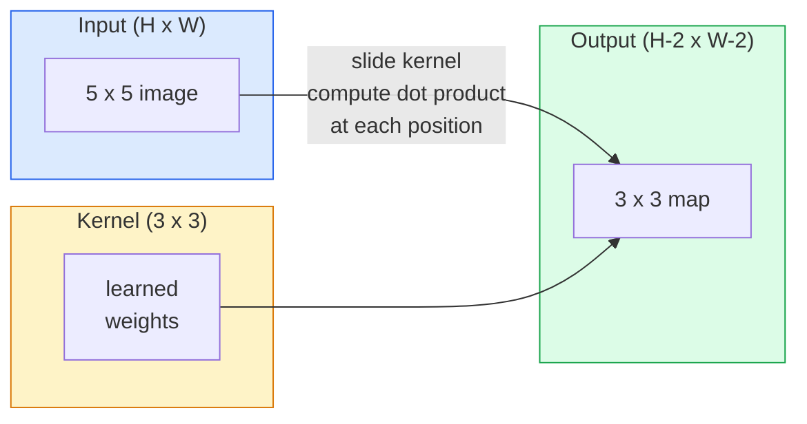
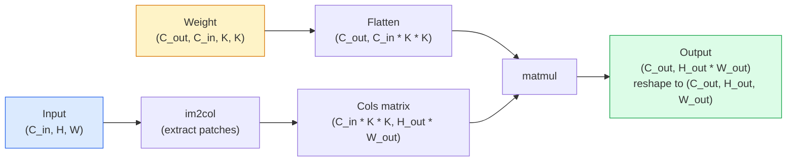

# Les conversions à partir de zéro

> Une convolutions est une petite couche dense que vous glissez sur une image, partageant les mêmes poids à chaque emplacement.

**Type:** Build
**Languages:** Python
**Prerequisites:** Phase 3 (Deep Learning Core), Phase 4 Lesson 01 (Image Fundamentals)
**Time:** ~75 minutes

## Objectifs d'apprentissage

- Implementer la convolutions 2D à partir de zéro en utilisant uniquement NumPy, y compris la version en boucle nichée et une vectorisation `im2col`version
- Comptez la taille spatiale de sortie pour toute combinaison de taille d'entrée, de taille du noyau, de rembourrage et de marche, et justifiez la `(H - K + 2P) / S + 1`formule
- Des noyaux de conception manuelle (extrémité, flou, affûte, Sobel) et expliquer pourquoi chacun produit le modèle d'activations qu'il fait
- Les convolutions de pile dans un extracteur de caractéristiques et la connexion de la profondeur de pile à la taille du champ réceptif

## Le problème

Une couche entièrement connectée sur une image RGB 224x224 aurait besoin de 224 * 224 * 3 = 150,528 poids d'entrée par neurone. Une seule couche cachée avec 1000 unités est déjà 150 millions de paramètres  avant que vous ayez appris quelque chose d'utile. Pire encore, cette couche n'a aucune idée qu'un chien en haut à gauche et un chien en bas à droite sont le même motif. Il traite chaque position de pixel comme indépendante, ce qui est tout à fait faux pour les images: traduire un chat par trois pixels ne devrait pas forcer le réseau à relever le concept.

Les deux propriétés dont un modèle d'image a besoin sont **translation equivariance**(les émissions changent lorsque les émissions changent) et **parameter sharing**Les couches denses ne vous donnent rien, la convolutions vous donnent les deux gratuitement.

La convulsion n'a pas été inventée pour l'apprentissage en profondeur. C'est la même opération qui alimente la compression JPEG, la flouge gaussienne dans Photoshop, la détection des bords dans la vision industrielle et tous les filtres audio jamais expédiés. La raison pour laquelle les CNN ont dominé ImageNet de 2012 à 2020 est que la convulsion est le préalable correct pour les données où les valeurs proches sont liées et le même motif peut apparaître n'importe où.

## Le concept

### Un noyau, glissant

Une convolutions 2D prend une petite matrice de poids appelée noyau (ou filtre), le déplace sur l'entrée et, à chaque emplacement, calcule la somme des produits intelligents. Cette somme devient un pixel de sortie.



Un exemple concret 3x3 sur une entrée 5x5 (pas de rembourrage, étape 1):

```
Input X (5 x 5):                Kernel W (3 x 3):

  1  2  0  1  2                   1  0 -1
  0  1  3  1  0                   2  0 -2
  2  1  0  2  1                   1  0 -1
  1  0  2  1  3
  2  1  1  0  1

The kernel slides across every valid 3 x 3 window. Output Y is 3 x 3:

 Y[0,0] = sum( W * X[0:3, 0:3] )
 Y[0,1] = sum( W * X[0:3, 1:4] )
 Y[0,2] = sum( W * X[0:3, 2:5] )
 Y[1,0] = sum( W * X[1:4, 0:3] )
 ... and so on
```

Cette formule.**shared weights, locality, sliding window**Tout le reste est la comptabilité.

### Formule de taille de sortie

Compte tenu de la taille de l' espace d' entrée `H`, taille du noyau `K`, rembourrage`P`- Je suis en train de faire un pas .`S`- Le numéro de la liste:

```
H_out = floor( (H - K + 2P) / S ) + 1
```

Vous le calculerez des dizaines de fois par architecture.

| Scenario | H | K | P | S | H_out |
|----------|---|---|---|---|-------|
| Valid conv, no padding | 32 | 3 | 0 | 1 | 30 |
| Same conv (preserves size) | 32 | 3 | 1 | 1 | 32 |
| Downsample by 2 | 32 | 3 | 1 | 2 | 16 |
| Pool 2x2 | 32 | 2 | 0 | 2 | 16 |
| Large receptive field | 32 | 7 | 3 | 2 | 16 |

"Same padding" signifie choisir P de sorte que H_out == H quand S == 1. Pour K impar, c'est P = (K - 1) / 2. C'est pourquoi les noyaux 3x3 dominent  ils sont le plus petit noyau impar qui a encore un centre.

### Padding

Sans rembourrage, chaque convolutions réduit la carte de fonctionnalités. En piles 20, votre image 224x224 devient 184x184, ce qui gaspille le calcul sur la frontière et complique les connexions résiduelles qui nécessitent des formes correspondantes.

```
Zero padding (P = 1) on a 5 x 5 input:

  0  0  0  0  0  0  0
  0  1  2  0  1  2  0
  0  0  1  3  1  0  0
  0  2  1  0  2  1  0       Now the kernel can centre on pixel
  0  1  0  2  1  3  0       (0, 0) and still have three rows and
  0  2  1  1  0  1  0       three columns of values to multiply.
  0  0  0  0  0  0  0
```

Les modes que vous rencontrez en pratique: `zero`(le plus courant), `reflect`(reflecter le bord, éviter les limites dures dans les modèles génératifs), `replicate`(copie le bord), `circular`(enveloppé, utilisé pour les problèmes toroïdaux).

### Passe à pas

La taille de l'étape est la taille de la diapositive. `stride=1`est le défaut. `stride=2`Il est la façon classique de réduire les échantillons à l'intérieur d'une CNN sans couche de pooling séparée.

```
Stride 1 on a 5 x 5 input, 3 x 3 kernel:

  starts: (0,0) (0,1) (0,2)        -> output row 0
          (1,0) (1,1) (1,2)        -> output row 1
          (2,0) (2,1) (2,2)        -> output row 2

  Output: 3 x 3

Stride 2 on the same input:

  starts: (0,0) (0,2)              -> output row 0
          (2,0) (2,2)              -> output row 1

  Output: 2 x 2
```

### Chaque entrée est effectuée par un canal de communication.

Les images réelles ont trois canaux. Une convulsion 3x3 sur une entrée RGB est en fait un volume 3x3x3: une tranche 3x3 par canal d'entrée. À chaque position spatiale, vous multipliez et additionnez sur les trois tranches et ajoutez un biais.

```
Input:   (C_in,  H,  W)        3 x 5 x 5
Kernel:  (C_in,  K,  K)        3 x 3 x 3 (one kernel)
Output:  (1,     H', W')       2D map

For a layer that produces C_out output channels, you stack C_out kernels:

Weight:  (C_out, C_in, K, K)   e.g. 64 x 3 x 3 x 3
Output:  (C_out, H', W')       64 x 3 x 3

Parameter count: C_out * C_in * K * K + C_out   (the + C_out is biases)
```

Cette dernière ligne est celle que vous calculerez lors de la planification d'un modèle.`64 * 3 * 3 * 3 + 64 = 1,792`Des paramètres, pas cher.

### Le truc de l'im2col

Les boucles nichées sont faciles à lire mais lentes. Les GPU veulent des multiples de matrice de grande taille. Le truc: aplanir chaque fenêtre de champ réceptif de l'entrée dans une colonne d'une grande matrice, aplanir le noyau dans une rangée, et toute la convolutions devient une seule matmul.



Chaque mise en œuvre de production conv est une variante de cette plus cache-tiling astuces (direct conv, Winograd, FFT conv pour les grands noyaux).

### champ récepteur

Un seul 3x3 conve regarde 9 pixels d'entrée.

```
RF after L stacked K x K convs (stride 1) = 1 + L * (K - 1)

With strides:   RF grows multiplicatively with stride along each layer.
```

La raison pour laquelle "3x3 tout le chemin vers le bas" fonctionne (VGG, ResNet, ConvNeXt) est que deux conv 3x3 voient la même zone d'entrée qu'un conv 5x5 mais avec moins de paramètres et une non-linéarité supplémentaire entre les deux.

```figure
convolution-kernel
```

## Faites-le

### Étape 1: Pâcher un tableau

Commencez par le plus petit primitif: une fonction qui se coupe avec des zéros autour d'un tableau H x W.

```python
import numpy as np

def pad2d(x, p):
    if p == 0:
        return x
    h, w = x.shape[-2:]
    out = np.zeros(x.shape[:-2] + (h + 2 * p, w + 2 * p), dtype=x.dtype)
    out[..., p:p + h, p:p + w] = x
    return out

x = np.arange(9).reshape(3, 3)
print(x)
print()
print(pad2d(x, 1))
```

Le truc des traîneaux .`x.shape[:-2]`signifie que la même fonction fonctionne sur `(H, W)`- Je suis là .`(C, H, W)`ou `(N, C, H, W)`sans modification.

### Étape 2: Convolutions 2D avec boucles nichées

La mise en œuvre de référence est lente mais sans ambiguïté.`torch.nn.functional.conv2d`Il en est ainsi en principe.

```python
def conv2d_naive(x, w, b=None, stride=1, padding=0):
    c_in, h, w_in = x.shape
    c_out, c_in_w, kh, kw = w.shape
    assert c_in == c_in_w

    x_pad = pad2d(x, padding)
    h_out = (h + 2 * padding - kh) // stride + 1
    w_out = (w_in + 2 * padding - kw) // stride + 1

    out = np.zeros((c_out, h_out, w_out), dtype=np.float32)
    for oc in range(c_out):
        for i in range(h_out):
            for j in range(w_out):
                hs = i * stride
                ws = j * stride
                patch = x_pad[:, hs:hs + kh, ws:ws + kw]
                out[oc, i, j] = np.sum(patch * w[oc])
        if b is not None:
            out[oc] += b[oc]
    return out
```

Quatre boucles nichées (channel de sortie, ligne, colonne, plus la somme implicite sur C_in, kh, kw). C'est la vérité au sol que vous allez vérifier contre chaque mise en œuvre plus rapide.

### Étape 3: Vérifiez avec un noyau conçu à la main

Construisez un noyau vertical de Sobel, appliquez-le sur une image de pas synthétique, et regardez le bord vertical s'éclairer.

```python
def synthetic_step_image():
    img = np.zeros((1, 16, 16), dtype=np.float32)
    img[:, :, 8:] = 1.0
    return img

sobel_x = np.array([
    [[-1, 0, 1],
     [-2, 0, 2],
     [-1, 0, 1]]
], dtype=np.float32)[None]

x = synthetic_step_image()
y = conv2d_naive(x, sobel_x, padding=1)
print(y[0].round(1))
```

Attendez-vous à de grandes valeurs positives sur la colonne 7 (augmentation de la luminosité de gauche à droite) et des zéros partout ailleurs. Cette seule empreinte est votre vérification de la santé mentale que les mathématiques sont correctes.

### Étape 4: im2col

Convertir chaque fenêtre de taille de noyau dans l'entrée en une colonne d'une matrice.`C_in=3, K=3`, chaque colonne est de 27 chiffres.

```python
def im2col(x, kh, kw, stride=1, padding=0):
    c_in, h, w = x.shape
    x_pad = pad2d(x, padding)
    h_out = (h + 2 * padding - kh) // stride + 1
    w_out = (w + 2 * padding - kw) // stride + 1

    cols = np.zeros((c_in * kh * kw, h_out * w_out), dtype=x.dtype)
    col = 0
    for i in range(h_out):
        for j in range(w_out):
            hs = i * stride
            ws = j * stride
            patch = x_pad[:, hs:hs + kh, ws:ws + kw]
            cols[:, col] = patch.reshape(-1)
            col += 1
    return cols, h_out, w_out
```

C'est toujours une boucle Python, mais maintenant le lourd soulage sera un matmul vectorié unique.

### Étape 5: Conv rapidement via im2col + matmul

Remplacez la boucle quadruple par une multiplication de matrice.

```python
def conv2d_im2col(x, w, b=None, stride=1, padding=0):
    c_out, c_in, kh, kw = w.shape
    cols, h_out, w_out = im2col(x, kh, kw, stride, padding)
    w_flat = w.reshape(c_out, -1)
    out = w_flat @ cols
    if b is not None:
        out += b[:, None]
    return out.reshape(c_out, h_out, w_out)
```

Vérifie la précision: exécutez les deux implémentations et comparez.

```python
rng = np.random.default_rng(0)
x = rng.normal(0, 1, (3, 16, 16)).astype(np.float32)
w = rng.normal(0, 1, (8, 3, 3, 3)).astype(np.float32)
b = rng.normal(0, 1, (8,)).astype(np.float32)

y_naive = conv2d_naive(x, w, b, padding=1)
y_im2col = conv2d_im2col(x, w, b, padding=1)

print(f"max abs diff: {np.max(np.abs(y_naive - y_im2col)):.2e}")
```

`max abs diff`Il devrait être là .`1e-5` la différence est l'ordre d'accumulation des points flottants, pas un bug.

### Étape 6: Une banque de noyaux conçus à la main

Cinq filtres qui montrent ce qu'une seule couche de conve peut exprimer avant toute formation.

```python
KERNELS = {
    "identity": np.array([[0, 0, 0], [0, 1, 0], [0, 0, 0]], dtype=np.float32),
    "blur_3x3": np.ones((3, 3), dtype=np.float32) / 9.0,
    "sharpen": np.array([[0, -1, 0], [-1, 5, -1], [0, -1, 0]], dtype=np.float32),
    "sobel_x": np.array([[-1, 0, 1], [-2, 0, 2], [-1, 0, 1]], dtype=np.float32),
    "sobel_y": np.array([[-1, -2, -1], [0, 0, 0], [1, 2, 1]], dtype=np.float32),
}

def apply_kernel(img2d, kernel):
    x = img2d[None].astype(np.float32)
    w = kernel[None, None]
    return conv2d_im2col(x, w, padding=1)[0]
```

Appliqué à n'importe quelle image à l'échelle de gris, la brouille se douce, l'aiguille se croise les bords, Sobel-x éclaire les bords verticaux, Sobel-y éclaire les bords horizontaux. Ce sont exactement les modèles que la première couche de conve entraînée dans AlexNet et VGG a fini par apprendre  parce qu'un bon modèle d'image a besoin de détecteurs de bords et de taches quelle que soit la tâche qui se présente plus tard.

## Utilisez-le

Le PyTorch's `nn.Conv2d`Il est utilisé pour l'optimisation de la forme, de la sémantique de la forme, de la forme, de la forme, de la forme, de la forme, de la forme, de la forme, de la forme, de la forme, de la forme, de la forme, de la forme, de la forme, de la forme, de la forme, de la forme, de la forme, de la forme, de la forme, de la forme, de la forme, de la forme, de la forme, de la forme, de la forme, de la forme, de la forme, de la forme, de la forme, de la forme, de la forme, de la forme, de la forme, de la forme, de la forme, de la forme, de la forme, de la forme, de la forme, de la forme, de la forme, de la forme, de la forme, de la forme, de la forme, de la forme, de la forme, de la forme, de la forme, de la forme, de la forme, de la forme, de la forme, et de la forme, de la forme, et de la forme, de la forme, de la forme, et de la forme, de la forme, de la forme, de la forme, de la forme, de la forme, de la forme, de la forme, de la forme, de la forme, de la forme, de la forme, de la forme, de la forme, de, de, de, de, de, de, de, de, de, de, de, de, de, de, de, de, de, de, de, de, de, de, de, de, de, de, de, de, de, de, de, de, de, de, de, de, de, de, de, de, de, de, de, de, de, de, de, de, de, de, de, de, de, de, de, de, de, de, de, de, de, de, de, de, de, de, de, de, de, de, de, de, de, de, de, de, de, de, de, de, de, de, de, de, de, de, de, de, de, de, de, de, de, de, de, de, de, de, de, de, de

```python
import torch
import torch.nn as nn

conv = nn.Conv2d(in_channels=3, out_channels=64, kernel_size=3, stride=1, padding=1)
print(conv)
print(f"weight shape: {tuple(conv.weight.shape)}   # (C_out, C_in, K, K)")
print(f"bias shape:   {tuple(conv.bias.shape)}")
print(f"param count:  {sum(p.numel() for p in conv.parameters())}")

x = torch.randn(8, 3, 224, 224)
y = conv(x)
print(f"\ninput  shape: {tuple(x.shape)}")
print(f"output shape: {tuple(y.shape)}")
```

Échange `padding=1`pour `padding=0`et la sortie diminue à 222x222.`stride=1`pour `stride=2`et il tombe à 112x112. la même formule que vous avez mémorisée ci-dessus.

## La faire partir

Cette leçon donne:

- `outputs/prompt-cnn-architect.md` une requête qui, compte tenu de la taille de l'entrée, du budget des paramètres et du champ réceptif cible, conçoit une pile de `Conv2d`couches avec le K/S/P droit à chaque étape.
- `outputs/skill-conv-shape-calculator.md` une compétence qui parcourt une couche de spécifications réseau par couche et renvoie la forme de sortie, le champ réceptif et le nombre de paramètres pour chaque bloc.

## Exercices

1. **(Easy)**Compte tenu d' une entrée de 128x128 grayscale et d' une pile de `[Conv3x3(s=1,p=1), Conv3x3(s=2,p=1), Conv3x3(s=1,p=1), Conv3x3(s=2,p=1)]`, calculer à la main la taille de l'espace de sortie et le champ réceptif à chaque couche.`nn.Sequential`de faux convois.
2. **(Medium)**Extension `conv2d_naive`et `conv2d_im2col`d' accepter une`groups`Je veux que tu me montres ça.`groups=C_in=C_out`reproduit une convolutions en profondeur et que son nombre de paramètres est `C * K * K`Au lieu de `C * C * K * K`- Je suis désolé .
3. **(Hard)**Implémenter le passage en arrière de `conv2d_im2col`à la main: compte tenu du gradient de sortie, calculer le gradient de `x`et `w`- Vérifiez contre`torch.autograd.grad`Le truc: le gradient de l'im2col est`col2im`, et il doit accumuler des fenêtres qui se chevauchent.

## Les termes clés

| Term | What people say | What it actually means |
|------|----------------|----------------------|
| Convolution | "Sliding a filter" | A learnable dot product applied at every spatial location with shared weights; mathematically a cross-correlation, but everyone calls it convolution |
| Kernel / filter | "The feature detector" | A small weight tensor of shape (C_in, K, K) whose dot product with a window of input produces one output pixel |
| Stride | "How far you jump" | The step size between consecutive kernel placements; stride 2 halves each spatial dimension |
| Padding | "Zeros on the edges" | Extra values added around the input so the kernel can centre on border pixels; `same` padding keeps output size equal to input size |
| Receptive field | "How much the neuron sees" | The patch of original input that a given output activation depends on, growing with depth and stride |
| im2col | "The GEMM trick" | Rearranging every receptive window into columns so convolution becomes one big matrix multiply — the core of every fast conv kernel |
| Depthwise conv | "One kernel per channel" | A conv with `groups == C_in`, computing each output channel from only its matching input channel; the backbone of MobileNet and ConvNeXt |
| Translation equivariance | "Shift in, shift out" | Property that shifting the input by k pixels shifts the output by k pixels; comes for free with shared weights |

## Pour en savoir plus

- [A guide to convolution arithmetic for deep learning (Dumoulin & Visin, 2016)](https://arxiv.org/abs/1603.07285) les diagrammes définitifs de rembourrage/de décalage/de dilatation que chaque cours copie silencieusement
- [CS231n: Convolutional Neural Networks for Visual Recognition](https://cs231n.github.io/convolutional-networks/) les notes de conférence canoniques, y compris l'explication originale
- [The Annotated ConvNet (fast.ai)](https://nbviewer.org/github/fastai/fastbook/blob/master/13_convolutions.ipynb) un carnet qui passe de la convolutions manuelles à un classificateur numérique formé
- [Receptive Field Arithmetic for CNNs (Dang Ha The Hien)](https://distill.pub/2019/computing-receptive-fields/) l'explicateur interactif de calculs de champs réceptifs de qualité papier
