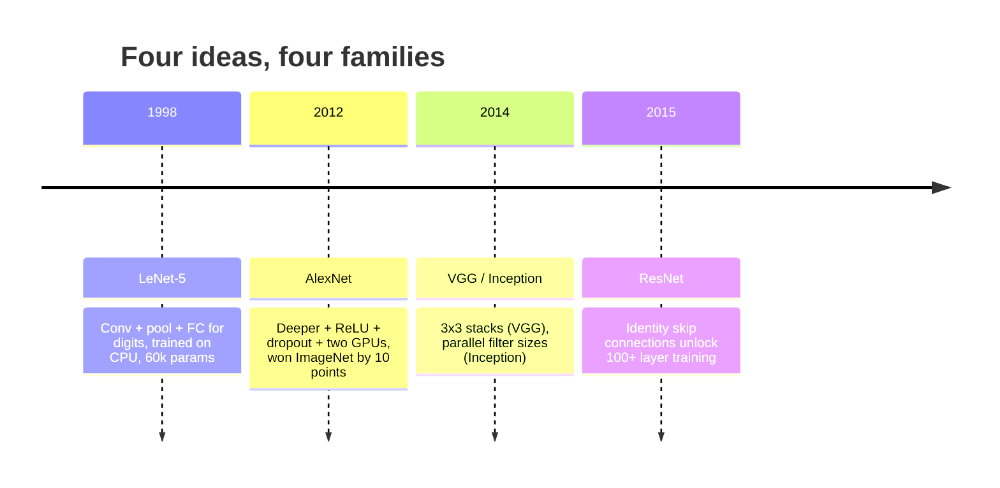
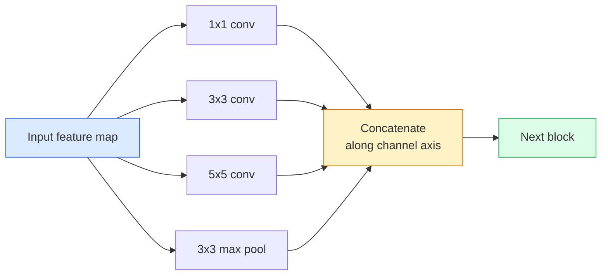
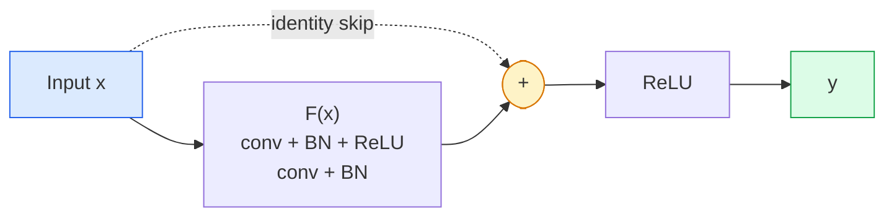

# Les CNN  LeNet à ResNet

> Chaque grande CNN de ces trente dernières années est la même recette de nonlinearité avec une nouvelle idée.

**Type:** Learn + Build
**Languages:** Python
**Prerequisites:** Phase 3 Lesson 11 (PyTorch), Phase 4 Lesson 01 (Image Fundamentals), Phase 4 Lesson 02 (Convolutions from Scratch)
**Time:** ~75 minutes

## Objectifs d'apprentissage

- Suivez la lignée architecturale LeNet-5 -> AlexNet -> VGG -> Inception -> ResNet et indiquez la seule nouvelle idée que chaque famille a contribuée
- Implémenter LeNet-5, un bloc de style VGG, et un ResNet BasicBlock en PyTorch, chacun sous 40 lignes
- Expliquez pourquoi les connexions résiduelles transforment un réseau de 1000 couches d'intrainable en un réseau de pointe.
- Lisez une colonne vertébrale moderne (ResNet-18, ResNet-50) et prédisez sa forme de sortie, son champ réceptif et le nombre de paramètres avant de regarder la source

## Le problème

En 2011, le meilleur classifiateur ImageNet a obtenu une précision de 74% dans le top-5. En 2012, AlexNet a obtenu 85%. En 2015, ResNet a obtenu un score de 96%. Aucune nouvelle donnée. Pas de nouvelle génération de GPU. Les gains ont été obtenus grâce aux idées d'architecture. Un ingénieur de vision travailleur doit savoir quelle idée est venue de quel papier parce que chaque colonne vertébrale de production que vous expédez en 2026 est une recombinaison de ces mêmes pièces  et parce que les idées continuent de se transférer: les convois regroupés sont passés des CNN à des transformateurs, les connexions résiduelles sont passées de ResNet à chaque LLM existant, la normalisation de lot vit dans les modèles de diffusion.

L'étude de ces réseaux vous protège également contre une erreur commune: trouver le plus grand modèle disponible lorsqu'un réseau de la taille de LeNet résoudrait le problème.

## Le concept

### Les quatre idées qui ont changé la vision



Rien d'autre dans la vision classique n'était aussi important que ces quatre sauts.

### LeNet-5 (1998)

Le reconnaisseur de chiffres de Yann LeCun. 60.000 paramètres. Deux blocs de pool de convection, deux couches entièrement connectées, activations tanh. Il définit le modèle que chaque CNN hérite:

```
input (1, 32, 32)
  conv 5x5 -> (6, 28, 28)
  avg pool 2x2 -> (6, 14, 14)
  conv 5x5 -> (16, 10, 10)
  avg pool 2x2 -> (16, 5, 5)
  flatten -> 400
  dense -> 120
  dense -> 84
  dense -> 10
```

Tout ce que le monde moderne appelle une CNN  des convulsions alternatives et des échantillons de réduction alimentant une petite tête de classifiateur  est LeNet avec plus de couches, de plus de canaux et de meilleures activations.

### Le réseau électronique

Trois changements qui ont brisé ImageNet:

1. **ReLU**Les gradants cessent de disparaître, l'entraînement s'accélère de six fois.
2. **Dropout**La régulation devient une couche, pas un truc.
3. **Depth and width**Cinq couches de convection, trois couches denses, paramètres 60M, entraînés sur deux GPU avec le modèle divisé à travers eux.

La figure 2 du document montre encore la GPU divisée en deux courants parallèles. Ce parallélisme était une solution matérielle, pas une idée architecturale  mais les trois idées ci-dessus sont toujours dans chaque modèle que vous utilisez.

### VGG (2014)

VGG a demandé: que se passe-t-il si vous utilisez seulement des convolutions 3x3 et que vous allez profondément ?

```
stack:   conv 3x3 -> conv 3x3 -> pool 2x2
repeat:  16 or 19 conv layers
```

Deux conv 3x3 voient la même surface d'entrée 5x5 qu'un conv 5x5 mais avec moins de paramètres (2 * 9 * C^2 = 18C^2 vs 25 * C^2) et une ReLU supplémentaire entre les deux. VGG a transformé cette observation en une architecture entière.

Coût: 138 millions de paramètres, lent à l'entraînement, coûteux à l'inférence.

### Commencement (2014, même année)

La réponse de Google à " quelle taille de noyau devrais-je utiliser ? " était: tous en parallèle.



Chaque branche se spécialise en 1x1 pour le mélange de canaux, 3x3 pour la texture locale, 5x5 pour les motifs plus grands, en regroupant pour les caractéristiques invariables de changement et le concat permet à la couche suivante de choisir la branche qui est utile.

### Le problème de la dégradation

En 2015, VGG-19 a fonctionné et VGG-32 n'a pas. La profondeur était censée aider, mais après ~ 20 couches, la formation et la perte de test sont devenues plus graves.

```
Plain deep network:
  y = f_L( f_{L-1}( ... f_1(x) ... ) )

Gradient wrt early layer:
  dL/dW_1 = dL/dy * df_L/df_{L-1} * ... * df_2/df_1 * df_1/dW_1

Each multiplicative term has magnitude roughly (weight magnitude) * (activation gain).
Stack 100 of them with gains < 1 and the gradient is effectively zero.
```

La VGG fonctionnait à 19 couches parce que la norme de lot (publiée simultanément) gardait les activations bien étalées.

### Réserve de données

Lui, Zhang, Ren, Sun ont proposé un changement qui a tout corrigé:

```
standard block:   y = F(x)
residual block:   y = F(x) + x
```

Le `+ x`Cela signifie que la couche peut toujours choisir de ne rien faire en conduisant `F(x)`Un réseau ResNet de 1000 couches est maintenant au maximum aussi mauvais qu'un réseau de 1 couche, parce que chaque bloc supplémentaire a une échappe triviale. Avec cette garantie, l'optimisateur est prêt à rendre chaque bloc * légèrement * utile  et légèrement utile, empilé 100 fois, est de pointe.



Deux variantes du bloc apparaissent partout:

- **BasicBlock**Deux convois 3x3, sautez autour des deux.
- **Bottleneck**1x1 en bas, 3x3 au milieu, 1x1 en haut, sautez autour du trio.

Lorsque le saut doit traverser un échantillon descendant (étape =2), le chemin d'identité est remplacé par un 1x1 étape = 2 conv pour correspondre aux formes.

### Pourquoi les résidus sont importants au-delà de la vision

L'idée n'était pas vraiment de la classification d'images. Il s'agissait de transformer les réseaux profonds de "cross-your-fingers et espérer que les gradients survivent" en un outil d'ingénierie fiable et évolutif. Chaque transformateur que vous lirez sur la prochaine phase a exactement la même connexion de saut dans chaque bloc. Sans ResNet, il n'y a pas de GPT.

```figure
pooling
```

## Faites-le

### Étape 1: LeNet-5

Un LeNet fidèle, un minimum, des activations Tanh, un pooling moyen.`nn.CrossEntropyLoss`en aval au lieu des connexions gaussiennes originales.

```python
import torch
import torch.nn as nn
import torch.nn.functional as F

class LeNet5(nn.Module):
    def __init__(self, num_classes=10):
        super().__init__()
        self.conv1 = nn.Conv2d(1, 6, kernel_size=5)
        self.conv2 = nn.Conv2d(6, 16, kernel_size=5)
        self.pool = nn.AvgPool2d(2)
        self.fc1 = nn.Linear(16 * 5 * 5, 120)
        self.fc2 = nn.Linear(120, 84)
        self.fc3 = nn.Linear(84, num_classes)

    def forward(self, x):
        x = self.pool(torch.tanh(self.conv1(x)))
        x = self.pool(torch.tanh(self.conv2(x)))
        x = torch.flatten(x, 1)
        x = torch.tanh(self.fc1(x))
        x = torch.tanh(self.fc2(x))
        return self.fc3(x)

net = LeNet5()
x = torch.randn(1, 1, 32, 32)
print(f"output: {net(x).shape}")
print(f"params: {sum(p.numel() for p in net.parameters()):,}")
```

Résultats attendus: `output: torch.Size([1, 10])`- Je suis là .`params: 61,706`C'est le classifiateur de chiffres qui a donné naissance à la vision moderne.

### Étape 2: blocage de la VGG

Un bloc réutilisable: deux convecteurs 3x3, ReLU, norme de lot, maximum de pool.

```python
class VGGBlock(nn.Module):
    def __init__(self, in_c, out_c):
        super().__init__()
        self.conv1 = nn.Conv2d(in_c, out_c, kernel_size=3, padding=1)
        self.bn1 = nn.BatchNorm2d(out_c)
        self.conv2 = nn.Conv2d(out_c, out_c, kernel_size=3, padding=1)
        self.bn2 = nn.BatchNorm2d(out_c)
        self.pool = nn.MaxPool2d(2)

    def forward(self, x):
        x = F.relu(self.bn1(self.conv1(x)))
        x = F.relu(self.bn2(self.conv2(x)))
        return self.pool(x)

class MiniVGG(nn.Module):
    def __init__(self, num_classes=10):
        super().__init__()
        self.stack = nn.Sequential(
            VGGBlock(3, 32),
            VGGBlock(32, 64),
            VGGBlock(64, 128),
        )
        self.head = nn.Sequential(
            nn.AdaptiveAvgPool2d(1),
            nn.Flatten(),
            nn.Linear(128, num_classes),
        )

    def forward(self, x):
        return self.head(self.stack(x))

net = MiniVGG()
x = torch.randn(1, 3, 32, 32)
print(f"output: {net(x).shape}")
print(f"params: {sum(p.numel() for p in net.parameters()):,}")
```

Trois blocs VGG sur une entrée de taille CIFAR, un bassin adaptatif, une couche linéaire. ~290k paramètres.

### Étape 3: Un bloc de base de ResNet

Le bloc de base de ResNet-18 et ResNet-34.

```python
class BasicBlock(nn.Module):
    def __init__(self, in_c, out_c, stride=1):
        super().__init__()
        self.conv1 = nn.Conv2d(in_c, out_c, kernel_size=3, stride=stride, padding=1, bias=False)
        self.bn1 = nn.BatchNorm2d(out_c)
        self.conv2 = nn.Conv2d(out_c, out_c, kernel_size=3, stride=1, padding=1, bias=False)
        self.bn2 = nn.BatchNorm2d(out_c)
        if stride != 1 or in_c != out_c:
            self.shortcut = nn.Sequential(
                nn.Conv2d(in_c, out_c, kernel_size=1, stride=stride, bias=False),
                nn.BatchNorm2d(out_c),
            )
        else:
            self.shortcut = nn.Identity()

    def forward(self, x):
        out = F.relu(self.bn1(self.conv1(x)))
        out = self.bn2(self.conv2(out))
        out = out + self.shortcut(x)
        return F.relu(out)
```

`bias=False`Le paramètre bêta de BN gère déjà le biais, donc le transport du biais de conv est également un gaspillage.`shortcut`Il n'est nécessaire d'avoir un véritable conve que lorsque le nombre de pas ou de canaux change; sinon, il s'agit d'une identité sans opération.

### Étape 4: Un petit réseau résidentiel

L'accumulation de quatre groupes de BasicBlocks pour obtenir un ResNet fonctionnel pour les entrées de taille CIFAR.

```python
class TinyResNet(nn.Module):
    def __init__(self, num_classes=10):
        super().__init__()
        self.stem = nn.Sequential(
            nn.Conv2d(3, 32, kernel_size=3, stride=1, padding=1, bias=False),
            nn.BatchNorm2d(32),
            nn.ReLU(inplace=True),
        )
        self.layer1 = self._make_group(32, 32, num_blocks=2, stride=1)
        self.layer2 = self._make_group(32, 64, num_blocks=2, stride=2)
        self.layer3 = self._make_group(64, 128, num_blocks=2, stride=2)
        self.layer4 = self._make_group(128, 256, num_blocks=2, stride=2)
        self.head = nn.Sequential(
            nn.AdaptiveAvgPool2d(1),
            nn.Flatten(),
            nn.Linear(256, num_classes),
        )

    def _make_group(self, in_c, out_c, num_blocks, stride):
        blocks = [BasicBlock(in_c, out_c, stride=stride)]
        for _ in range(num_blocks - 1):
            blocks.append(BasicBlock(out_c, out_c, stride=1))
        return nn.Sequential(*blocks)

    def forward(self, x):
        x = self.stem(x)
        x = self.layer1(x)
        x = self.layer2(x)
        x = self.layer3(x)
        x = self.layer4(x)
        return self.head(x)

net = TinyResNet()
x = torch.randn(1, 3, 32, 32)
print(f"output: {net(x).shape}")
print(f"params: {sum(p.numel() for p in net.parameters()):,}")
```

Quatre groupes de deux blocs chacun. étape 2 au début des groupes 2, 3, 4. le nombre de canaux double à chaque échantillon. Parametres approximatifs 2,8M. C'est la recette standard qui équivaut nettement à ResNet-152.

### Étape 5: Comparer l'efficacité par paramètre à caractéristique

Exécutez la même entrée à travers les trois réseaux et comparez les nombres de paramètres.

```python
def summary(name, net, x):
    y = net(x)
    params = sum(p.numel() for p in net.parameters())
    print(f"{name:12s}  input {tuple(x.shape)} -> output {tuple(y.shape)}  params {params:>10,}")

x = torch.randn(1, 3, 32, 32)
summary("LeNet5",     LeNet5(),       torch.randn(1, 1, 32, 32))
summary("MiniVGG",    MiniVGG(),      x)
summary("TinyResNet", TinyResNet(),   x)
```

Pour une précision CIFAR-10, vous avez besoin d'environ: LeNet 60%, MiniVGG 89%, TinyResNet 93% après quelques périodes de formation.

## Utilisez-le

`torchvision.models`La signature d'appel est identique dans toutes les familles, ce qui est exactement le point de l'abstraction de la colonne vertébrale.

```python
from torchvision.models import resnet18, ResNet18_Weights, vgg16, VGG16_Weights

r18 = resnet18(weights=ResNet18_Weights.IMAGENET1K_V1)
r18.eval()

print(f"ResNet-18 params: {sum(p.numel() for p in r18.parameters()):,}")
print(r18.layer1[0])
print()

v16 = vgg16(weights=VGG16_Weights.IMAGENET1K_V1)
v16.eval()
print(f"VGG-16   params: {sum(p.numel() for p in v16.parameters()):,}")
```

ResNet-18 a 11,7 millions de paramètres. VGG-16 a 138 millions. Une précision similaire à celle de ImageNet top-1 (69,8% contre 71,6%). Les connexions résiduelles vous procurent un gain d'efficacité de paramètre de 12 fois. C'est pourquoi les variantes ResNet ont dominé de 2016 jusqu'à l'arrivée de ViT en 2021  et dominent toujours les déploiements dans le monde réel où le calcul est la contrainte.

Pour l'apprentissage de transfert, la recette est toujours la même: charge préentrainée, congélation de la colonne vertébrale, remplacement de la tête de classification.

```python
for p in r18.parameters():
    p.requires_grad = False
r18.fc = nn.Linear(r18.fc.in_features, 10)
```

Vous avez maintenant un classifiateur CIFAR de 10 classes qui hérite des représentations payées par ImageNet.

## La faire partir

Cette leçon donne:

- `outputs/prompt-backbone-selector.md` une requête qui choisit la bonne famille de CNN (LeNet/VGG/ResNet/MobileNet/ConvNeXt) pour une tâche, une taille de l'ensemble de données et un budget de calcul.
- `outputs/skill-residual-block-reviewer.md` une compétence qui lit un module PyTorch et détecte les erreurs de saut de connexion (manque de raccourci sur le changement de pas, ordre d'activation du raccourci, placement BN par rapport à l'addition).

## Exercices

1. **(Easy)**Comptez les paramètres à la main pour `TinyResNet`La différence entre les couches`sum(p.numel() for p in net.parameters())`. Où se trouve la majorité du budget des paramètres  convs, BN ou la tête de classification ?
2. **(Medium)**Implémenter le bloc de boîte à outils (en 1x1 -> 3x3 -> 1x1 avec saut) et l'utiliser pour construire un réseau de style ResNet-50 pour CIFAR.`TinyResNet`- Je suis désolé .
3. **(Hard)**Retirez la connexion skip de `BasicBlock`Le réseau de formation de 34 blocs et le réseau de résistance de 34 blocs sur CIFAR-10 pendant 10 époques chacune.

## Les termes clés

| Term | What people say | What it actually means |
|------|----------------|----------------------|
| Backbone | "The model" | The stack of convolutional blocks that produces the feature map fed to the task head |
| Residual connection | "Skip connection" | `y = F(x) + x`; lets the optimiser learn identity by setting F to zero, which makes arbitrary depth trainable |
| BasicBlock | "Two 3x3 convs with a skip" | The ResNet-18/34 building block: conv-BN-ReLU-conv-BN-add-ReLU |
| Bottleneck | "1x1 down, 3x3, 1x1 up" | The ResNet-50/101/152 block; cheap at high channel counts because the 3x3 runs on a reduced width |
| Degradation problem | "Deeper is worse" | Past ~20 plain conv layers, both training and test error increase; solved by residual connections, not by more data |
| Stem | "The first layer" | The initial conv that converts 3-channel input into the base feature width; usually 7x7 stride 2 for ImageNet, 3x3 stride 1 for CIFAR |
| Head | "The classifier" | The layers after the final backbone block: adaptive pool, flatten, linear(s) |
| Transfer learning | "Pretrained weights" | Loading a backbone trained on ImageNet and fine-tuning only the head on your task |

## Pour en savoir plus

- [Deep Residual Learning for Image Recognition (He et al., 2015)](https://arxiv.org/abs/1512.03385) le document ResNet; chaque chiffre vaut la peine d'être étudié
- [Very Deep Convolutional Networks (Simonyan & Zisserman, 2014)](https://arxiv.org/abs/1409.1556) le papier VGG; toujours la meilleure référence pour "pourquoi 3x3"
- [ImageNet Classification with Deep CNNs (Krizhevsky et al., 2012)](https://papers.nips.cc/paper_files/paper/2012/hash/c399862d3b9d6b76c8436e924a68c45b-Abstract.html) AlexNet; le papier qui a mis fin à l'ère des fonctionnalités faites à la main
- [Going Deeper with Convolutions (Szegedy et al., 2014)](https://arxiv.org/abs/1409.4842) Inception v1; l'idée du filtre parallèle qui apparaît encore dans les transformateurs de vision
