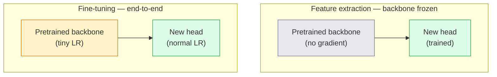

# Le transfert de l'apprentissage et l'ajustement

> Quelqu'un d'autre a passé un million d'heures de GPU à enseigner à un réseau à quoi ressemblent les bords, les textures et les pièces d'objet.

**Type:** Build
**Languages:** Python
**Prerequisites:** Phase 4 Lesson 03 (CNNs), Phase 4 Lesson 04 (Image Classification)
**Time:** ~75 minutes

## Objectifs d'apprentissage

- Distinguer l'extraction de fonctionnalités de l'ajustement fin et choisir la bonne en fonction de la taille du jeu de données, la distance de domaine et le budget de calcul
- Charger une colonne vertébrale prétrainée, remplacer sa tête de classifiant et entraîner uniquement la tête vers une ligne de base de travail en moins de 20 lignes
- Défriger progressivement les couches avec des taux d'apprentissage discriminatoires afin que les caractéristiques génériques précoces obtiennent des mises à jour plus petites que celles spécifiques à des tâches tardives
- Diagnostication des trois défaillances courantes: dérive des caractéristiques de LR trop élevé sur les blocs non gelés, effondrement des statistiques BN sur les petits ensembles de données et oubli catastrophique

## Le problème

La formation d'un ResNet-50 sur ImageNet coûte environ 2 000 heures de GPU. Très peu d'équipes ont ce budget pour chaque tâche qu'elles envoient. Ce que presque toutes les équipes envoient en fait est une colonne vertébrale prétrainée avec une nouvelle tête formée sur quelques centaines ou quelques milliers d'images spécifiques à la tâche.

Ce n'est pas un raccourci. Le premier bloc de convection de toute CNN formée par ImageNet apprend les bords et les filtres similaires à Gabor. Les prochains blocs apprennent des textures et des motifs simples. Les blocs du milieu apprennent les parties de l'objet. Les derniers blocs apprennent des combinaisons qui commencent à ressembler aux 1000 catégories d'ImageNet. Les 90% de cette hiérarchie sont transférés presque inchangés à l'imagerie médicale, à l'inspection industrielle, aux données satellites et à toutes les autres tâches de vision  parce que la nature a un vocabulaire limité de bords et de textures. Les 10% restants sont ce que vous entraînez.

Pour obtenir le transfert correct, vous avez trois erreurs: détruire des fonctionnalités prétrainées avec un taux d'apprentissage trop élevé, affamer le modèle d'information en congelant trop, et laisser les statistiques en cours de fonctionnement de BatchNorm dériver vers un ensemble de données minuscules dont le reste du réseau n'a jamais appris. Cette leçon marche à chaque d'entre eux délibérément.

## Le concept

### Extrusion des caractéristiques par rapport à l'ajustement fin

Deux régimes, choisis en fonction de la confiance que vous avez dans les fonctionnalités prétrainées et de la quantité de données que vous avez.



Règles générales:

| Dataset size | Domain distance | Recipe |
|--------------|-----------------|--------|
| < 1k images | close to ImageNet | Freeze backbone, train head only |
| 1k-10k | close | Freeze first 2-3 stages, fine-tune the rest |
| 10k-100k | any | Fine-tune end-to-end with discriminative LR |
| 100k+ | far | Fine-tune everything; consider training from scratch if domain is far enough |

"Closer à ImageNet" signifie à peu près des photos RGB naturelles avec un contenu semblable à un objet.

### Pourquoi le gel fonctionne-t-il ?

L'imageNet présente une CNN apprend ne sont pas spécialisés dans les 1000 catégories. Ils sont spécialisés dans les statistiques des images naturelles: bordures à des orientations spécifiques, textures, contrastes, formes primitives. Ces statistiques sont stables dans presque tous les domaines visuels qu'un humain peut nommer. C'est pourquoi un modèle formé sur ImageNet et évalué à zéro tir sur CIFAR-10 avec seulement une nouvelle tête linéaire (pas de réglage fin de la colonne vertébrale) atteint une précision de 80%+. La tête apprend quelles caractéristiques déjà apprises sont nécessaires pour cette tâche.

### Taux d'apprentissage discriminatoire

Lorsque vous défrichez, les premières couches devraient s'entraîner plus lentement que les dernières couches.

```
Typical recipe:

  stage 0 (stem + first group): lr = base_lr / 100    (mostly fixed)
  stage 1:                       lr = base_lr / 10
  stage 2:                       lr = base_lr / 3
  stage 3 (last backbone group): lr = base_lr
  head:                          lr = base_lr  (or slightly higher)
```

Dans PyTorch, il s'agit simplement d'une liste de groupes de paramètres transmis à l'optimisateur.

### Le problème de la norme de série

Les couches BN tiennent`running_mean`et `running_var`Si votre tâche a une distribution de pixels différente  un éclairage différent, un capteur différent, un espace de couleur différent  ces tampons sont erronés.

1. **Fine-tune with BN in train mode.**Laissez BN mettre à jour ses statistiques de fonctionnement avec tout le reste.
2. **Freeze BN in eval mode.**Gardez les statistiques de l'ImageNet et ne faites que les poids.
3. **Replace BN with GroupNorm.**Il élimine complètement le problème de la moyenne mobile. Utilisé dans les dossiers de détection et de segmentation où la taille du lot par GPU est minuscule.

Faire ça en silence réduit la précision de 5 à 15%.

### Conception de la tête

La tête de classification est de 1 à 3 couches linéaires plus une dérapagement optionnel.

```
backbone.fc = nn.Linear(backbone.fc.in_features, num_classes)          # ResNet
backbone.classifier[1] = nn.Linear(..., num_classes)                    # EfficientNet, MobileNet
backbone.heads.head = nn.Linear(..., num_classes)                       # torchvision ViT
```

Pour les petits ensembles de données, une seule couche linéaire est généralement suffisante.

### L'éclatement de la LR par couche

Une version plus lisse de LR discriminatoire utilisée dans les réglages modernes (BEiT, DINOv2, ViT-B). Au lieu de regrouper les couches en étapes, donnez à chaque couche une LR légèrement plus petite que celle qui est au-dessus:

```
lr_layer_k = base_lr * decay^(L - k)
```

Avec des blocs de transformateurs de décomposition = 0,75 et L = 12, les premiers blocs de trains à`0.75^11 ≈ 0.04x`Il est plus important pour les transformateurs de musique fine que pour les CNN, où les LR regroupés en scène sont généralement suffisants.

### Ce qu'il faut évaluer

Les courses de transfert-apprentissage ont besoin de deux nombres que vous ne suivriez pas sur une course de grattage:

- **Pretrained-only accuracy**La tête est précise, la colonne vertébrale est gelée.
- **Fine-tuned accuracy**Le même modèle après une formation complète.

Si le niveau d'apprentissage est inférieur à celui de la formation préalable, vous avez un taux d'apprentissage ou un bug BN.

```figure
transfer-learning
```

## Faites-le

### Étape 1: Charger une colonne vertébrale prétrainée et l'inspecter

```python
import torch
import torch.nn as nn
from torchvision.models import resnet18, ResNet18_Weights

backbone = resnet18(weights=ResNet18_Weights.IMAGENET1K_V1)
print(backbone)
print()
print("classifier head:", backbone.fc)
print("feature dim:", backbone.fc.in_features)
```

`ResNet18`a quatre étapes (`layer1..layer4`) plus une tige et une `fc`Chaque colonne vertébrale de la classification de la vision de la torche a une structure analogue.

### Étape 2: Extraction de la fonctionnalité  geler tout, remplacer la tête

```python
def make_feature_extractor(num_classes=10):
    model = resnet18(weights=ResNet18_Weights.IMAGENET1K_V1)
    for p in model.parameters():
        p.requires_grad = False
    model.fc = nn.Linear(model.fc.in_features, num_classes)
    return model

model = make_feature_extractor(num_classes=10)
trainable = sum(p.numel() for p in model.parameters() if p.requires_grad)
frozen = sum(p.numel() for p in model.parameters() if not p.requires_grad)
print(f"trainable: {trainable:>10,}")
print(f"frozen:    {frozen:>10,}")
```

- Je ne sais pas .`model.fc`L'épine dorsale est un extracteur de caractéristiques gelées.

### Étape 3: ajustement de la discrimination

Une application qui construit des groupes de paramètres avec des taux d'apprentissage spécifiques à l'étape.

```python
def discriminative_param_groups(model, base_lr=1e-3, decay=0.3):
    stages = [
        ["conv1", "bn1"],
        ["layer1"],
        ["layer2"],
        ["layer3"],
        ["layer4"],
        ["fc"],
    ]
    groups = []
    for i, names in enumerate(stages):
        lr = base_lr * (decay ** (len(stages) - 1 - i))
        params = [p for n, p in model.named_parameters()
                  if any(n.startswith(k) for k in names)]
        if params:
            groups.append({"params": params, "lr": lr, "name": "_".join(names)})
    return groups

model = resnet18(weights=ResNet18_Weights.IMAGENET1K_V1)
model.fc = nn.Linear(model.fc.in_features, 10)
for p in model.parameters():
    p.requires_grad = True

groups = discriminative_param_groups(model)
for g in groups:
    print(f"{g['name']:>10s}  lr={g['lr']:.2e}  params={sum(p.numel() for p in g['params']):>8,}")
```

`decay=0.3`Les trains à chaque étape sont chargés de 30% du rythme de la prochaine. `fc`Il est en train de se faire`base_lr`- Je suis là .`layer4`Il est en train de se faire`0.3 * base_lr`- Je suis là .`conv1`Il est en train de se faire`0.3^5 * base_lr ≈ 0.00243 * base_lr`- Son extrême, empirieusement, ça marche.

### Étape 4: Traitement de lotNorm

Aide à geler les statistiques de BN sans geler ses poids.

```python
def freeze_bn_stats(model):
    for m in model.modules():
        if isinstance(m, (nn.BatchNorm1d, nn.BatchNorm2d, nn.BatchNorm3d)):
            m.eval()
            for p in m.parameters():
                p.requires_grad = False
    return model
```

Appelle-le après avoir posé .`model.train()`Au début de chaque époque.`model.train()`Le système de formation est en mode de reversation, ce qui ne le fait que pour les couches BN.

### Étape 5: Une boucle de réglage fin de bout en bout minimale

```python
from torch.optim import SGD
from torch.utils.data import DataLoader
from torch.optim.lr_scheduler import CosineAnnealingLR
import torch.nn.functional as F

def fine_tune(model, train_loader, val_loader, device, epochs=5, base_lr=1e-3, freeze_bn=False):
    model = model.to(device)
    groups = discriminative_param_groups(model, base_lr=base_lr)
    optimizer = SGD(groups, momentum=0.9, weight_decay=1e-4, nesterov=True)
    scheduler = CosineAnnealingLR(optimizer, T_max=epochs)

    for epoch in range(epochs):
        model.train()
        if freeze_bn:
            freeze_bn_stats(model)
        tr_loss, tr_correct, tr_total = 0.0, 0, 0
        for x, y in train_loader:
            x, y = x.to(device), y.to(device)
            logits = model(x)
            loss = F.cross_entropy(logits, y, label_smoothing=0.1)
            optimizer.zero_grad()
            loss.backward()
            optimizer.step()
            tr_loss += loss.item() * x.size(0)
            tr_total += x.size(0)
            tr_correct += (logits.argmax(-1) == y).sum().item()
        scheduler.step()

        model.eval()
        va_total, va_correct = 0, 0
        with torch.no_grad():
            for x, y in val_loader:
                x, y = x.to(device), y.to(device)
                pred = model(x).argmax(-1)
                va_total += x.size(0)
                va_correct += (pred == y).sum().item()
        print(f"epoch {epoch}  train {tr_loss/tr_total:.3f}/{tr_correct/tr_total:.3f}  "
              f"val {va_correct/va_total:.3f}")
    return model
```

Cinq époques avec la recette ci-dessus sur CIFAR-10 prend `ResNet18-IMAGENET1K_V1`La tête seule se platerait à 86% sans jamais toucher la colonne vertébrale.

### Étape 6: Défrilage progressif

Un calendrier qui défriche une étape par époque de la fin au début.

```python
def progressive_unfreeze_schedule(model):
    stages = ["layer4", "layer3", "layer2", "layer1"]
    yielded = set()

    def start():
        for p in model.parameters():
            p.requires_grad = False
        for p in model.fc.parameters():
            p.requires_grad = True

    def unfreeze(epoch):
        if epoch < len(stages):
            name = stages[epoch]
            yielded.add(name)
            for n, p in model.named_parameters():
                if n.startswith(name):
                    p.requires_grad = True
            return name
        return None

    return start, unfreeze
```

Appel`start()`Une fois avant la première époque.`unfreeze(epoch)`Réinitialisez l'optimisateur chaque fois que l'ensemble des paramètres entraînables change, sinon les paramètres congelés conservent toujours des moments cachés qui le confondent.

## Utilisez-le

Pour la plupart des tâches réelles,`torchvision.models`Le matériel le plus lourd au-dessus compte quand on rencontre des problèmes que les défauts de bibliothèque ne peuvent pas résoudre.

```python
from torchvision.models import resnet50, ResNet50_Weights

model = resnet50(weights=ResNet50_Weights.IMAGENET1K_V2)
model.fc = nn.Linear(model.fc.in_features, num_classes)
optimizer = torch.optim.AdamW(model.parameters(), lr=1e-4, weight_decay=1e-4)
```

Deux autres défauts de production:

- `timm`Les navires ont environ 800 os de vision prétrainés avec une API cohérente (`timm.create_model("resnet50", pretrained=True, num_classes=10)`Pour toute harmonie fine au-delà du zoo, c'est la norme.
- Pour les transformateurs, `transformers.AutoModelForImageClassification.from_pretrained(name, num_labels=N)`vous donne ViT / BEiT / DeiT avec la même sémantique de chargement que les modèles de texte.

## La faire partir

Cette leçon donne:

- `outputs/prompt-fine-tune-planner.md` une requête qui choisit l'extraction de fonctionnalités par rapport à l'ajustement progressif par rapport à l'ajustement fin de bout en bout en fonction de la taille du jeu de données, de la distance de domaine et du budget de calcul.
- `outputs/skill-freeze-inspector.md` une compétence qui, compte tenu d'un modèle PyTorch, rapporte quels paramètres sont entraînables, quelles couches BatchNorm sont en mode d'évaluation et si l'optimisateur est réellement alimenté par les paramètres entraînables.

## Exercices

1. **(Easy)**- Le train a`ResNet18`En tant que sonde linéaire (rétrécissement de la colonne vertébrale) et en tant que réglage complet sur le même ensemble de données CIFAR synthétique.
2. **(Medium)**Introduire un bug à dessein: set `base_lr = 1e-1`La première étape consiste à faire une projection de la perte d'entraînement en explose, puis à récupérer en appliquant la`discriminative_param_groups`enregistrer la LR à laquelle chaque étape commence à diverger.
3. **(Hard)**Prenez un ensemble de données d'imagerie médicale (par exemple CheXpert-small, PatchCamelyon ou HAM10000) et comparez trois régimes: a) L'épine dorsale gelée + tête linéaire prétrainée par ImageNet; b) L'entraînement fin fin fin finé de l'extrémité à l'extrémité; c) l'entraînement à gratter. Rapportez la précision et le coût de calcul pour chacun.

## Les termes clés

| Term | What people say | What it actually means |
|------|----------------|----------------------|
| Feature extraction | "Freeze and train head" | Backbone parameters frozen, only the new classifier head receives gradient |
| Fine-tuning | "Retrain end-to-end" | All parameters trainable, usually with much smaller LR than scratch training |
| Discriminative LR | "Smaller LR for early layers" | Optimizer parameter groups where early-stage LR is a fraction of late-stage LR |
| Layer-wise LR decay | "Smooth LR gradient" | Per-layer LR multiplied by decay^(L - k); common in transformer fine-tunes |
| Catastrophic forgetting | "The model lost ImageNet" | A too-high LR overwrites pretrained features before the new task signal is learnt |
| BN statistics drift | "Running mean is wrong" | BatchNorm running_mean/var computed on a different distribution than the current task, silently hurting accuracy |
| Linear probe | "Frozen backbone + linear head" | Evaluation of pretrained features — accuracy of the best linear classifier on top of the frozen representation |
| Catastrophic collapse | "Everything predicts one class" | Happens when fine-tuning with an LR high enough to destroy features before gradients from the head can stabilise |

## Pour en savoir plus

- [How transferable are features in deep neural networks? (Yosinski et al., 2014)](https://arxiv.org/abs/1411.1792) le papier qui a quantifié la transférabilité des caractéristiques entre couches
- [Universal Language Model Fine-tuning (ULMFiT, Howard & Ruder, 2018)](https://arxiv.org/abs/1801.06146) la recette de défrichage discriminatoire LR / progressive originale; les idées se transforment directement dans la vision
- [timm documentation](https://huggingface.co/docs/timm) la référence pour les récepteurs de vision modernes et les défauts précis de réglage fin avec lesquels ils ont été formés
- [A Simple Framework for Linear-Probe Evaluation (Kornblith et al., 2019)](https://arxiv.org/abs/1805.08974) pourquoi la précision de la sonde linéaire est importante et comment la signaler correctement
