# Détection d' objets  YOLO depuis le début

> La détection est la classification plus la régression, exécutée à chaque position dans une carte de caractéristiques, puis nettoyée avec suppression non maximale.

**Type:** Build
**Languages:** Python
**Prerequisites:** Phase 4 Lesson 03 (CNNs), Phase 4 Lesson 04 (Image Classification), Phase 4 Lesson 05 (Transfer Learning)
**Time:** ~75 minutes

## Objectifs d'apprentissage

- Expliquez la conception de la grille et de l'ancre qui transforme la détection en un problème de prédiction dense et indiquez ce que chaque nombre dans le tensor de sortie signifie
- Comptez l'intersection entre les boîtes et mettez en œuvre la suppression non maximale à partir de zéro
- Construire une tête de style YOLO minimal sur une colonne vertébrale prétrainée, y compris la classification, l'objets et les pertes de régression de boîte
- Lisez une rangée de mesures de détection (precision@0.5, rappel, mAP@0.5, mAP@0.5:0.95) et choisissez le bouton à tourner ensuite

## Le problème

La classification dit "cette image est un chien". La détection dit "il y a un chien à des pixels (112, 40, 280, 210), il y a un chat à (400, 180, 560, 310), et rien d'autre dans le cadre. " Ce changement structurel  prédisant un nombre variable de boîtes étiquetées au lieu d'une étiquette par image  est ce que tous les systèmes autonomes, chaque produit de surveillance, chaque analyseur de la mise en page de documents et chaque ligne de vision d'usine dépendent.

La détection est aussi l'endroit où chaque compromis technique dans la vision apparaît à la fois. Vous voulez des boîtes précises (tête de régression), vous voulez la bonne classe pour chaque boîte (tête de classification), vous voulez que le modèle sache quand il n'y a rien à détecter (score d'objets), et vous voulez exactement une prédiction par objet réel (suppression non maximale). Si vous manquez l'un de ces objets, le pipeline ouvre les yeux, rapporte des boîtes hallucinées ou prédit le même objet quinze fois dans des positions légèrement différentes.

YOLO (You Only Look Once, Redmon et al. 2016) est la conception qui a fait tout cela en temps réel en le faisant avec un seul passage vers l'avant d'un réseau de convection, et les mêmes décisions structurelles sont toujours l'épine dorsale des détecteurs modernes (YOLOv8, YOLOv9, YOLO-NAS, RT-DETR).

## Le concept

### Détection comme prédiction dense

Un classifiateur donne des numéros C par image.`(S x S x (5 + C))`les nombres par image, où S est la taille de la grille spatiale.

```mermaid
flowchart LR
    IMG["Input 416x416 RGB"] --> BB["Backbone<br/>(ResNet, DarkNet, ...)"]
    BB --> FM["Feature map<br/>(C_feat, 13, 13)"]
    FM --> HEAD["Detection head<br/>(1x1 convs)"]
    HEAD --> OUT["Output tensor<br/>(13, 13, B * (5 + C))"]
    OUT --> DEC["Decode<br/>(grid + sigmoid + exp)"]
    DEC --> NMS["Non-max suppression"]
    NMS --> RESULT["Final boxes"]

    style IMG fill:#dbeafe,stroke:#2563eb
    style HEAD fill:#fef3c7,stroke:#d97706
    style NMS fill:#fecaca,stroke:#dc2626
    style RESULT fill:#dcfce7,stroke:#16a34a
```



Chacun des `S * S`Les cellules de grille prédisent `B`Pour chaque boîte:

- 4 chiffres décrivent la géométrie: `tx, ty, tw, th`- Je suis désolé .
- Le nombre 1 est le score d'objets: "y a-t-il un objet centré dans cette cellule?"
- Les nombres C sont des probabilités de classe.

Total par cellule: `B * (5 + C)`. pour le VOC avec `S=13, B=2, C=20`, c'est 50 chiffres par cellule.

### Pourquoi les grilles et les ancres

Une régression simple prédirait`(x, y, w, h)`Pour chaque objet comme une coordonnée absolue. C'est difficile pour un réseau conv parce que la traduction de l'image ne devrait pas traduire toutes les prédictions par le même montant  chaque objet est ancré spatialement. La grille répond à cela en attribuant chaque boîte de vérité de base à la cellule de grille dans laquelle son centre tombe; seule cette cellule est responsable de cet objet.

Les ancres résolvent un deuxième problème. Un convecteur 3x3 ne peut pas facilement régresser une boîte de 500 pixels de large à partir d'une cellule de champ réceptif de 16 pixels.`B`Les modèles de l'ancrage apprennent à choisir la bonne ancrage et à la pousser plutôt que de régresser de nulle part.

```
Anchor box priors (example for 416x416 input):

  small:   (30,  60)
  medium:  (75,  170)
  large:   (200, 380)

At each grid cell, every anchor emits (tx, ty, tw, th, obj, c_1, ..., c_C).
```

Les détecteurs modernes utilisent souvent des FPN avec différents ensembles d'ancrage par résolution  petites ancrages sur des cartes à haute résolution peu profondes, grandes ancrages sur des cartes à haute résolution profonde.

### Prédictions de décoding

Le brut`tx, ty, tw, th`ne sont pas des coordonnées de boîte; elles sont des cibles de régression à transformer avant la traçage:

```
centre x  = (sigmoid(tx) + cell_x) * stride
centre y  = (sigmoid(ty) + cell_y) * stride
width     = anchor_w * exp(tw)
height    = anchor_h * exp(th)
```

`sigmoid`conserve les détournements de centre à l'intérieur de la cellule. `exp`La largeur de l'ancrage est libre sans détour.`stride`Cette étape de décode est la même dans toutes les versions de YOLO depuis v2.

### Le secteur de l'énergie

La métrique de similitude universelle de détection entre deux boîtes:

```
IoU(A, B) = area(A intersect B) / area(A union B)
```

IoU = 1 signifie identique; IoU = 0 signifie aucun chevauchement. IoU entre la prédiction et la boîte de vérité de base est ce qui décide si une prédiction compte comme un vrai positif (habituellement IoU >= 0,5).

### Suppression non maximale

Un réseau de convection formé sur des ancres adjacentes prédit souvent des boîtes qui se chevauchent pour le même objet.

```
NMS(boxes, scores, iou_threshold):
    sort boxes by score descending
    keep = []
    while boxes not empty:
        pick the top-scoring box, add to keep
        remove every box with IoU > iou_threshold to the picked box
    return keep
```

Un seuil typique: 0,45 pour la détection d'objets.`soft-NMS`- Je suis là .`DIoU-NMS`, ou apprendre la suppression directement (RT-DETR) mais le but structurel est le même.

### La perte

La perte de YOLO est trois pertes ajoutées avec les poids:

```
L = lambda_coord * L_box(pred, target, where obj=1)
  + lambda_obj   * L_obj(pred, 1,     where obj=1)
  + lambda_noobj * L_obj(pred, 0,     where obj=0)
  + lambda_cls   * L_cls(pred, target, where obj=1)
```

Seules les cellules qui contiennent un objet contribuent à la régression des boîtes et aux pertes de classification.`lambda_noobj`est généralement petite (~0,5) car la grande majorité des cellules sont vides et domineraient autrement la perte totale.

Les variantes modernes échangent la perte de boîte MSE contre la perte de boîte CIoU / DIoU (qui optimise directement la perte de focale pour le déséquilibre de classe) et équilibrent l'objet avec la perte de focale de qualité.

### Mesures de détection

La précision ne passe pas à la détection.

- **Precision@IoU=0.5** des prédictions comptées comme positives, combien sont réellement correctes.
- **Recall@IoU=0.5** des vrais objets, combien avons-nous trouvé.
- **AP@0.5** surface de courbe de recul de précision au seuil de l'UIO 0,5; un nombre par classe.
- **mAP@0.5:0.95** moyenne de l'AP sur les seuils de l'UIO 0,5, 0,55, ..., 0,95.

Rapporte les quatre. Un détecteur qui est fort sur mAP@0.5 mais faible sur mAP@0.5:0.95 localise approximativement mais pas étroitement; fixe avec une meilleure perte de régression de boîte. Un détecteur avec une grande précision et un rappel faible est trop conservateur; abaisse le seuil de confiance ou augmente le poids de l'objet.

```figure
object-detection-nms
```

## Faites-le

### Étape 1:

Le cheval de travail de toute la leçon.`(x1, y1, x2, y2)`le format.

```python
import numpy as np

def box_iou(boxes_a, boxes_b):
    ax1, ay1, ax2, ay2 = boxes_a[:, 0], boxes_a[:, 1], boxes_a[:, 2], boxes_a[:, 3]
    bx1, by1, bx2, by2 = boxes_b[:, 0], boxes_b[:, 1], boxes_b[:, 2], boxes_b[:, 3]

    inter_x1 = np.maximum(ax1[:, None], bx1[None, :])
    inter_y1 = np.maximum(ay1[:, None], by1[None, :])
    inter_x2 = np.minimum(ax2[:, None], bx2[None, :])
    inter_y2 = np.minimum(ay2[:, None], by2[None, :])

    inter_w = np.clip(inter_x2 - inter_x1, 0, None)
    inter_h = np.clip(inter_y2 - inter_y1, 0, None)
    inter = inter_w * inter_h

    area_a = (ax2 - ax1) * (ay2 - ay1)
    area_b = (bx2 - bx1) * (by2 - by1)
    union = area_a[:, None] + area_b[None, :] - inter
    return inter / np.clip(union, 1e-8, None)
```

Retourne une `(N_a, N_b)`Utilisez-le contre une seule boîte de vérité de base en faisant une des matrices de forme`(1, 4)`- Je suis désolé .

### Étape 2: Suppression non maximale

```python
def nms(boxes, scores, iou_threshold=0.45):
    order = np.argsort(-scores)
    keep = []
    while len(order) > 0:
        i = order[0]
        keep.append(i)
        if len(order) == 1:
            break
        rest = order[1:]
        ious = box_iou(boxes[[i]], boxes[rest])[0]
        order = rest[ious <= iou_threshold]
    return np.array(keep, dtype=np.int64)
```

Déterministe,`O(N log N)`Il est également possible de faire des observations sur les comportements de la personne.`torchvision.ops.nms`sur des entrées identiques.

### Étape 3: Codage et décoding de boîte

Convertir entre les coordonnées de pixel et le `(tx, ty, tw, th)`Les cibles que le réseau réagit réellement.

```python
def encode(box_xyxy, cell_x, cell_y, stride, anchor_wh):
    x1, y1, x2, y2 = box_xyxy
    cx = 0.5 * (x1 + x2)
    cy = 0.5 * (y1 + y2)
    w = x2 - x1
    h = y2 - y1
    tx = cx / stride - cell_x
    ty = cy / stride - cell_y
    tw = np.log(w / anchor_wh[0] + 1e-8)
    th = np.log(h / anchor_wh[1] + 1e-8)
    return np.array([tx, ty, tw, th])


def decode(tx_ty_tw_th, cell_x, cell_y, stride, anchor_wh):
    tx, ty, tw, th = tx_ty_tw_th
    cx = (sigmoid(tx) + cell_x) * stride
    cy = (sigmoid(ty) + cell_y) * stride
    w = anchor_wh[0] * np.exp(tw)
    h = anchor_wh[1] * np.exp(th)
    return np.array([cx - w / 2, cy - h / 2, cx + w / 2, cy + h / 2])


def sigmoid(x):
    return 1.0 / (1.0 + np.exp(-x))
```

Test: encodez une boîte puis décodez  vous devriez obtenir quelque chose de très proche de l'original (jusqu'à ce que l'inverse sigmoïde ne soit pas parfaitement inversible lorsque `tx`n' est pas dans la plage post-sigmoïde).

### Étape 4: Une tête YOLO minimale

Un convex 1x1 sur une carte de fonctionnalités, remodelant en `(B, S, S, num_anchors, 5 + C)`- Je suis désolé .

```python
import torch
import torch.nn as nn

class YOLOHead(nn.Module):
    def __init__(self, in_c, num_anchors, num_classes):
        super().__init__()
        self.num_anchors = num_anchors
        self.num_classes = num_classes
        self.conv = nn.Conv2d(in_c, num_anchors * (5 + num_classes), kernel_size=1)

    def forward(self, x):
        n, _, h, w = x.shape
        y = self.conv(x)
        y = y.view(n, self.num_anchors, 5 + self.num_classes, h, w)
        y = y.permute(0, 3, 4, 1, 2).contiguous()
        return y
```

Forme de sortie: `(N, H, W, num_anchors, 5 + C)`La dernière dimension est valable .`[tx, ty, tw, th, obj, cls_0, ..., cls_{C-1}]`- Je suis désolé .

### Étape 5: La mission de la vérité fondamentale

Pour chaque boîte de vérité, décidez laquelle.`(cell, anchor)`est responsable.

```python
def assign_targets(boxes_xyxy, classes, anchors, stride, grid_size, num_classes):
    num_anchors = len(anchors)
    target = np.zeros((grid_size, grid_size, num_anchors, 5 + num_classes), dtype=np.float32)
    has_obj = np.zeros((grid_size, grid_size, num_anchors), dtype=bool)

    for box, cls in zip(boxes_xyxy, classes):
        x1, y1, x2, y2 = box
        cx, cy = 0.5 * (x1 + x2), 0.5 * (y1 + y2)
        gx, gy = int(cx / stride), int(cy / stride)
        bw, bh = x2 - x1, y2 - y1

        ious = np.array([
            (min(bw, aw) * min(bh, ah)) / (bw * bh + aw * ah - min(bw, aw) * min(bh, ah))
            for aw, ah in anchors
        ])
        best = int(np.argmax(ious))
        aw, ah = anchors[best]

        target[gy, gx, best, 0] = cx / stride - gx
        target[gy, gx, best, 1] = cy / stride - gy
        target[gy, gx, best, 2] = np.log(bw / aw + 1e-8)
        target[gy, gx, best, 3] = np.log(bh / ah + 1e-8)
        target[gy, gx, best, 4] = 1.0
        target[gy, gx, best, 5 + cls] = 1.0
        has_obj[gy, gx, best] = True
    return target, has_obj
```

La sélection d'ancrage est " meilleure forme IoU avec la vérité de la terre "  un proxy bon marché qui correspond à l'affectation YOLOv2/v3. v5 et plus tard utiliser des stratégies plus sophistiquées (matching aligné sur les tâches, dynamique k) qui affinent la même idée.

### Étape 6: Les trois pertes

```python
def yolo_loss(pred, target, has_obj, lambda_coord=5.0, lambda_obj=1.0, lambda_noobj=0.5, lambda_cls=1.0):
    has_obj_t = torch.from_numpy(has_obj).bool()
    target_t = torch.from_numpy(target).float()

    # box-regression loss: only on cells with objects
    box_pred = pred[..., :4][has_obj_t]
    box_true = target_t[..., :4][has_obj_t]
    loss_box = torch.nn.functional.mse_loss(box_pred, box_true, reduction="sum")

    # objectness loss
    obj_pred = pred[..., 4]
    obj_true = target_t[..., 4]
    loss_obj_pos = torch.nn.functional.binary_cross_entropy_with_logits(
        obj_pred[has_obj_t], obj_true[has_obj_t], reduction="sum")
    loss_obj_neg = torch.nn.functional.binary_cross_entropy_with_logits(
        obj_pred[~has_obj_t], obj_true[~has_obj_t], reduction="sum")

    # classification loss on cells with objects
    cls_pred = pred[..., 5:][has_obj_t]
    cls_true = target_t[..., 5:][has_obj_t]
    loss_cls = torch.nn.functional.binary_cross_entropy_with_logits(
        cls_pred, cls_true, reduction="sum")

    total = (lambda_coord * loss_box
             + lambda_obj * loss_obj_pos
             + lambda_noobj * loss_obj_neg
             + lambda_cls * loss_cls)
    return total, {"box": loss_box.item(), "obj_pos": loss_obj_pos.item(),
                   "obj_neg": loss_obj_neg.item(), "cls": loss_cls.item()}
```

Cinq hyper-paramètres que chaque tutoriel YOLO code ou balaie.`lambda_coord=5, lambda_noobj=0.5`Il reflète le papier original YOLOv1 et fonctionne toujours comme un défaut raisonnable.

### Étape 7: L'oléoduc d'inférence

Décoder la sortie brute de la tête, appliquer sigmoid/exp, seuil sur l'objet et NMS.

```python
def postprocess(pred_tensor, anchors, stride, img_size, conf_threshold=0.25, iou_threshold=0.45):
    pred = pred_tensor.detach().cpu().numpy()
    grid_h, grid_w = pred.shape[1], pred.shape[2]
    num_anchors = len(anchors)

    boxes, scores, classes = [], [], []
    for gy in range(grid_h):
        for gx in range(grid_w):
            for a in range(num_anchors):
                tx, ty, tw, th, obj, *cls = pred[0, gy, gx, a]
                score = sigmoid(obj) * sigmoid(np.array(cls)).max()
                if score < conf_threshold:
                    continue
                cls_idx = int(np.argmax(cls))
                cx = (sigmoid(tx) + gx) * stride
                cy = (sigmoid(ty) + gy) * stride
                w = anchors[a][0] * np.exp(tw)
                h = anchors[a][1] * np.exp(th)
                boxes.append([cx - w / 2, cy - h / 2, cx + w / 2, cy + h / 2])
                scores.append(float(score))
                classes.append(cls_idx)

    if not boxes:
        return np.zeros((0, 4)), np.zeros((0,)), np.zeros((0,), dtype=int)
    boxes = np.array(boxes)
    scores = np.array(scores)
    classes = np.array(classes)
    keep = nms(boxes, scores, iou_threshold)
    return boxes[keep], scores[keep], classes[keep]
```

C'est le chemin complet d'évaluation: tête -> décode -> seuil -> NMS.

## Utilisez-le

`torchvision.models.detection`Les détecteurs de production de navires ont la même structure conceptuelle.

```python
import torch
from torchvision.models.detection import fasterrcnn_resnet50_fpn_v2

model = fasterrcnn_resnet50_fpn_v2(weights="DEFAULT")
model.eval()
with torch.no_grad():
    predictions = model([torch.randn(3, 400, 600)])
print(predictions[0].keys())
print(f"boxes:  {predictions[0]['boxes'].shape}")
print(f"scores: {predictions[0]['scores'].shape}")
print(f"labels: {predictions[0]['labels'].shape}")
```

Pour les pipelines d'inférence en temps réel, `ultralytics`(YOLOv8/v9) est la norme: `from ultralytics import YOLO; model = YOLO('yolov8n.pt'); model(img)`. Le modèle gère le décoding et le NMS en interne et renvoie le même `boxes / scores / labels`triple que vous avez construit au-dessus.

## La faire partir

Cette leçon donne:

- `outputs/prompt-detection-metric-reader.md` une invitation qui tourne un `precision, recall, AP, mAP@0.5:0.95`En une seule ligne de diagnostic et l'expérience suivante la plus utile.
- `outputs/skill-anchor-designer.md` une compétence qui, compte tenu d'un ensemble de données de boîtes de vérité fondamentale, fonctionne sur k-means `(w, h)`et renvoie les ensembles d'ancrage par niveau FPN plus les statistiques de couverture dont vous avez besoin pour choisir le bon nombre d'ancrages.

## Exercices

1. **(Easy)**Mise en œuvre `box_iou`et le faire contre .`torchvision.ops.box_iou`Vérifiez que la différence absolue maximale est inférieure.`1e-6`- Je suis désolé .
2. **(Medium)**Port `yolo_loss`à une version qui utilise `CIoU`La valeur de la valeur de la valeur de l'analyse de l'analyse de la valeur de l'analyse de l'analyse de la valeur de l'analyse de la valeur de l'analyse de la valeur de l'analyse de la valeur de l'analyse de la valeur de l'analyse de la valeur de l'analyse de la valeur de l'analyse de la valeur de l'analyse de la valeur de l'analyse de la valeur de l'analyse de la valeur de l'analyse de la valeur de la valeur de l'analyse de la valeur de la valeur de l'analyse de la valeur de la valeur de l'analyse de la valeur de l'analyse de la valeur de la valeur de l'analyse de la valeur de la valeur de l'analyse de la valeur de l'analyse de la valeur de l'analyse de la valeur de l'analyse de la valeur de l'analyse de la valeur de l'analyse de la valeur de l'analyse de la valeur de l'analyse de la valeur de l'analyse de la valeur de l'analyse de la valeur de la valeur de l'analyse de la valeur de la valeur de l'analyse de la valeur de la valeur de la valeur de l'analyse de la valeur de la valeur de l'analyse de la valeur de la valeur de la valeur de la valeur de la valeur de l'analyse de la valeur de l'analyse de l'analyse de l'analyse de l'analyse de la valeur de l'analyse de la valeur de l'analyse de la valeur de l'analyse de l'analyse de la valeur de l'analyse de la valeur de la valeur de l'analyse de l'analyse de la valeur de la valeur de la valeur de l'analyse de la valeur de l'analyse de la valeur de l'analyse de la valeur de l'analyse de la valeur de la valeur de l'analyse de la valeur de l'analyse de la valeur de l'analyse de la valeur de l'analyse de la valeur de la valeur de la valeur de la valeur de la valeur de la valeur de la valeur de la valeur de la valeur de la valeur de la valeur de la valeur de la valeur de la valeur de la valeur de la valeur de la valeur de la valeur de la valeur de la valeur de la valeur de la valeur de la valeur de la valeur de la valeur de la valeur de la valeur de la valeur de la valeur de la valeur de la valeur de
3. **(Hard)**Implémenter l'inférence à plusieurs échelles: alimenter la même image à trois résolutions à travers le modèle, unifier les prédictions de boîte et exécuter un seul NMS à la fin. Mesurer l'inférence à l'échelle unique par rapport à l'élévation de l'AP sur un ensemble de contenu.

## Les termes clés

| Term | What people say | What it actually means |
|------|----------------|----------------------|
| Anchor | "Box prior" | A pre-defined box shape at each grid cell from which the network predicts deltas instead of absolute coordinates |
| IoU | "Overlap" | Intersection-over-union of two boxes; the universal similarity measure in detection |
| NMS | "Deduplicate" | Greedy algorithm that keeps highest-score predictions and removes overlapping ones above a threshold |
| Objectness | "Is there something here" | Per-anchor, per-cell scalar predicting whether an object is centred in that cell |
| Grid stride | "Downsample factor" | Pixels per grid cell; a 416-px input with a 13-grid head has stride 32 |
| mAP | "Mean average precision" | Average of the area under the precision-recall curve, averaged over classes and (for COCO) IoU thresholds |
| AP@0.5 | "PASCAL VOC AP" | Average precision with IoU threshold 0.5; the lenient version of the metric |
| mAP@0.5:0.95 | "COCO AP" | Average over IoU thresholds 0.5..0.95 step 0.05; the strict version and current community standard |

## Pour en savoir plus

- [YOLOv1: You Only Look Once (Redmon et al., 2016)](https://arxiv.org/abs/1506.02640) le papier fondateur; chaque YOLO depuis est un raffinement de cette structure
- [YOLOv3 (Redmon & Farhadi, 2018)](https://arxiv.org/abs/1804.02767) le papier qui a introduit des têtes de style FPN à plusieurs échelles; encore le diagramme le plus clair
- [Ultralytics YOLOv8 docs](https://docs.ultralytics.com) la référence de production actuelle; couvre les formats des ensembles de données, les augmentations, les recettes de formation
- [The Illustrated Guide to Object Detection (Jonathan Hui)](https://jonathan-hui.medium.com/object-detection-series-24d03a12f904) la meilleure visite en anglais simple du zoo à détecteur complet; inestimable pour comprendre comment DETR, RetinaNet, FCOS et YOLO se rapportent
