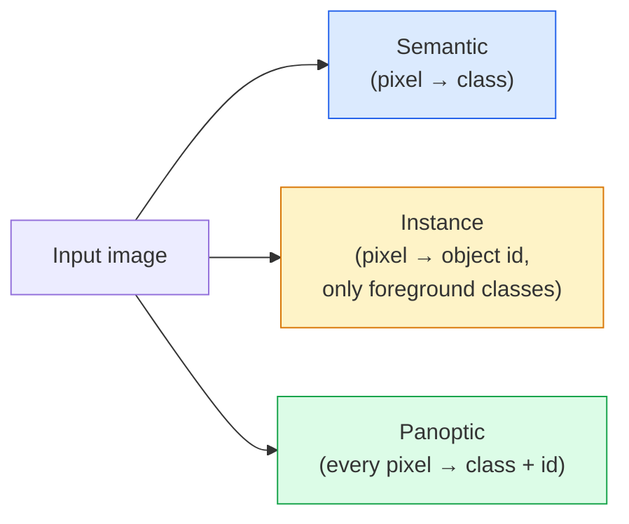
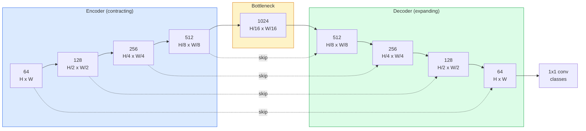

# Segmentation sémantique  U-Net

> La segmentation est une classification à chaque pixel. U-Net le fait en associant un encodeur de downsampling à un décodeur de upsampling et en câblant les connexions entre eux.

**Type:** Build
**Languages:** Python
**Prerequisites:** Phase 4 Lesson 03 (CNNs), Phase 4 Lesson 04 (Image Classification)
**Time:** ~75 minutes

## Objectifs d'apprentissage

- Distinguer la segmentation sémantique, instantanée et panoptique et choisir la bonne tâche pour un problème donné
- Construisez un U-Net à partir de zéro dans PyTorch avec des blocs d'encodeur, un goulet d'étranglement, un décodeur avec des convolutions transposées, et sautez les connexions
- Implémenter pixel-wise cross-entropie, perte de Dice, et la perte combinée qui est la défaillance actuelle pour la segmentation médicale et industrielle
- Lisez les mesures de l'IoU et du Dice par classe et diagnostiquez si un mauvais score provient du rappel de petits objets, de l'exactitude des limites ou du déséquilibre de la classe

## Le problème

La classification donne une étiquette par image. La détection donne une poignée de cases par image. La segmentation donne une étiquette par pixel. Pour une entrée de taille `H x W`, la sortie est un tensor de forme `H x W`(sémantique) ou `H x W x N_instances`C'est des millions de prédictions par image, pas une seule.

La structure de la segmentation est la raison pour laquelle elle alimente presque tous les produits de vision de prédiction dense: imagerie médicale (masques tumoraux), conduite autonome (route, voie, obstacle), satellite (empreintes de bâtiments, limites de cultures), analyse de documents (zones de mise en page), robotique (régions touchées). Aucune de ces tâches ne peut être résolue en plaçant une boîte autour de l'objet; elles ont besoin de la silhouette exacte.

Le problème architectural est simple à dire et pas simple à résoudre: vous avez besoin du réseau pour voir le contexte global d'une image (quel genre de scène est-ce) et le détail pixel local (quel pixel est exactement route vs pavement) simultanément. Une CNN standard comprime spatialement pour obtenir le contexte, ce qui jette le détail. U-Net était le design qui a obtenu les deux.

## Le concept

### Sémantique vs exemple vs panoptique



- **Semantic**"Ce pixel est la route, ce pixel est la voiture". Deux voitures côte à côte s'effondrent en une seule tache.
- **Instance**dit " ce pixel est la voiture n°3, ce pixel est la voiture n°5. " Ignore les choses de fond (" choses " = ciel, route, gazon).
- **Panoptic**Unifie les deux: chaque pixel obtient une étiquette de classe, chaque instance obtient un identifiant unique, les choses et les choses sont à la fois segmentées.

Cette leçon couvre la sémantique.

### La forme du réseau U-Net



Le décodeur double la résolution spatiale à quatre reprises et double les canaux. Le décodeur inverse: double la résolution spatiale à quatre reprises et réduit les canaux. Les connexions de saut concatenent des fonctionnalités d'encodeur correspondant avec des fonctionnalités de décodeur à chaque résolution. Les cartes finales 1x1 conv `64 -> num_classes`à pleine résolution.

Pourquoi les connexions de saut sont nécessaires: le décodeur n'a vu que de petites cartes de fonctionnalités au moment où il tente de produire des prédictions au niveau de pixels. Sans les sauts, il ne peut pas localiser les bords avec précision parce que ces informations ont été compressées dans l'encodeur.

### Transposé vers l'échantillon ascendant bilinéaire

Le décodeur doit élargir les dimensions spatiales.

- **Transposed convolution**(le secteur de l'énergie)`nn.ConvTranspose2d` échantillon d'apprentissage. U-Net historique par défaut. Peut produire des objets de tableau d'échecs si la taille de la marche et du noyau ne se divisent pas uniformément.
- **Bilinear upsample + 3x3 conv** l'échantillon supérieur lisse suivi d'un conv. Moins d'artéfacts, moins de paramètres, maintenant le modèle par défaut moderne.

Pour une première U-Net, le bilinéaire est plus sûr.

### Entropie croisée sur une grille de pixels

Pour la segmentation sémantique avec les classes C, la sortie du modèle est `(N, C, H, W)`La cible est`(N, H, W)`L'entropie croisée est identique à la classification, appliquée à chaque position spatiale:

```
Loss = mean over (n, h, w) of -log( softmax(logits[n, :, h, w])[target[n, h, w]] )
```

`F.cross_entropy`PyTorch traite cette forme de manière native.

### Perte de dés et pourquoi vous en avez besoin

L'entropie croisée traite tous les pixels de la même manière. C'est faux quand une classe domine le cadre (imagerie médicale: 99% de fond, 1% de tumeur). Le réseau peut obtenir 99% de précision en prédisant le fond partout et être toujours inutile.

La perte de dés résout cela en optimisant directement le chevauchement entre le masque prédit et le masque vrai:

```
Dice(p, y) = 2 * sum(p * y) / (sum(p) + sum(y) + epsilon)
Dice_loss = 1 - Dice
```

où `p`est la carte de probabilité sigmoïde/softmax pour une classe et `y`La perte est nulle seulement lorsque la superposition est parfaite. Parce qu'elle est basée sur le ratio, le déséquilibre de classe est irréel.

Dans la pratique, utilisez **combined loss**- Le numéro de la liste:

```
L = L_cross_entropy + lambda * L_dice       (lambda ~ 1)
```

La croisée entropie donne des gradients stables au début de l'entraînement; Dice met l'accent sur la taille du masque.

### Mesures d'évaluation

- **Pixel accuracy**Le pourcentage de pixels correctement prédits. Cheap. Broken sur des données déséquilibrées pour la même raison que l'exactitude dans la classification.
- **IoU per class** intersection sur union pour chaque classe de masque; moyenne entre les classes = mIoU.
- **Dice (F1 on pixels)** similaire à IoU; `Dice = 2 * IoU / (1 + IoU)`L'imagerie médicale préfère les dice, la communauté de conduite préfère l'IUI; elles sont monotonnellement liées.
- **Boundary F1** mesure la proximité des limites prévues aux limites de la vérité au sol, pénalisant même les petits changements.

Les taux de participation sont de 15% pour une classe, alors que les autres neuf sont de 85%.

### Compromise de résolution des entrées

Le codeur d'U-Net réduit de moitié la résolution de quatre fois, de sorte que l'entrée doit être divisible par 16.`H * W * C_max`, et à 1024x1024 avec 1024 canaux à goulot d'étranglement, le passage avant utilise déjà des gigaoctets de VRAM.

Deux solutions standard:
1. Tissage des tuiles d'entrée  processus 256x256 avec chevauchement et couture.
2. Remplacez le goulot d'étranglement par des convolutions dilatées qui maintiennent une résolution spatiale plus élevée mais élargissent le champ réceptif (la famille DeepLab).

Pour un premier modèle, une entrée 256x256 avec un U-Net de base de 64 canaux se connecte confortablement à 8 Go de RAM VR.

```figure
segmentation-flood
```

## Faites-le

### Étape 1: Bloc de l'encodeur

Deux conv 3x3 avec norme de lot et ReLU.

```python
import torch
import torch.nn as nn
import torch.nn.functional as F

class DoubleConv(nn.Module):
    def __init__(self, in_c, out_c):
        super().__init__()
        self.net = nn.Sequential(
            nn.Conv2d(in_c, out_c, kernel_size=3, padding=1, bias=False),
            nn.BatchNorm2d(out_c),
            nn.ReLU(inplace=True),
            nn.Conv2d(out_c, out_c, kernel_size=3, padding=1, bias=False),
            nn.BatchNorm2d(out_c),
            nn.ReLU(inplace=True),
        )

    def forward(self, x):
        return self.net(x)
```

Ce bloc est réutilisé partout. `bias=False`Parce que la bêta de BN gère le biais.

### Étape 2: Blocs en bas et en haut

```python
class Down(nn.Module):
    def __init__(self, in_c, out_c):
        super().__init__()
        self.net = nn.Sequential(
            nn.MaxPool2d(2),
            DoubleConv(in_c, out_c),
        )

    def forward(self, x):
        return self.net(x)


class Up(nn.Module):
    def __init__(self, in_c, out_c):
        super().__init__()
        self.up = nn.Upsample(scale_factor=2, mode="bilinear", align_corners=False)
        self.conv = DoubleConv(in_c, out_c)

    def forward(self, x, skip):
        x = self.up(x)
        if x.shape[-2:] != skip.shape[-2:]:
            x = F.interpolate(x, size=skip.shape[-2:], mode="bilinear", align_corners=False)
        x = torch.cat([skip, x], dim=1)
        return self.conv(x)
```

La vérification de la forme uniquement spatiale (`shape[-2:]`) gère des entrées dont les dimensions ne sont pas divisible par 16; un coffre-fort`F.interpolate`La comparaison de la forme complète entraînerait également des différences de nombre de canaux, ce qui devrait être une erreur bruyante, pas un interpolat silencieux.

### Étape 3: Le réseau

```python
class UNet(nn.Module):
    def __init__(self, in_channels=3, num_classes=2, base=64):
        super().__init__()
        self.inc = DoubleConv(in_channels, base)
        self.d1 = Down(base, base * 2)
        self.d2 = Down(base * 2, base * 4)
        self.d3 = Down(base * 4, base * 8)
        self.d4 = Down(base * 8, base * 16)
        self.u1 = Up(base * 16 + base * 8, base * 8)
        self.u2 = Up(base * 8 + base * 4, base * 4)
        self.u3 = Up(base * 4 + base * 2, base * 2)
        self.u4 = Up(base * 2 + base, base)
        self.outc = nn.Conv2d(base, num_classes, kernel_size=1)

    def forward(self, x):
        x1 = self.inc(x)
        x2 = self.d1(x1)
        x3 = self.d2(x2)
        x4 = self.d3(x3)
        x5 = self.d4(x4)
        x = self.u1(x5, x4)
        x = self.u2(x, x3)
        x = self.u3(x, x2)
        x = self.u4(x, x1)
        return self.outc(x)

net = UNet(in_channels=3, num_classes=2, base=32)
x = torch.randn(1, 3, 256, 256)
print(f"output: {net(x).shape}")
print(f"params: {sum(p.numel() for p in net.parameters()):,}")
```

Forme de sortie `(1, 2, 256, 256)` la même taille spatiale que l'entrée, `num_classes`Les canaux sont à environ 7,7 M.`base=32`- Je suis désolé .

### Étape 4: Perte

```python
def dice_loss(logits, targets, num_classes, eps=1e-6):
    probs = F.softmax(logits, dim=1)
    targets_one_hot = F.one_hot(targets, num_classes).permute(0, 3, 1, 2).float()
    dims = (0, 2, 3)
    intersection = (probs * targets_one_hot).sum(dim=dims)
    denom = probs.sum(dim=dims) + targets_one_hot.sum(dim=dims)
    dice = (2 * intersection + eps) / (denom + eps)
    return 1 - dice.mean()


def combined_loss(logits, targets, num_classes, lam=1.0):
    ce = F.cross_entropy(logits, targets)
    dc = dice_loss(logits, targets, num_classes)
    return ce + lam * dc, {"ce": ce.item(), "dice": dc.item()}
```

Les dés sont calculés par classe puis mesurés (macro-doses).`eps`empêche la division par zéro sur les classes absentes du lot.

### Étape 5: métrique de l'UIO

```python
@torch.no_grad()
def iou_per_class(logits, targets, num_classes):
    preds = logits.argmax(dim=1)
    ious = torch.zeros(num_classes)
    for c in range(num_classes):
        pred_c = (preds == c)
        true_c = (targets == c)
        inter = (pred_c & true_c).sum().float()
        union = (pred_c | true_c).sum().float()
        ious[c] = (inter / union) if union > 0 else torch.tensor(float("nan"))
    return ious
```

Retourne un vecteur de longueur C. `nan`Les classes absentes du lot  ne sont pas moyennes par rapport à celles qui sont calculées lors de l'analyse de l'encours.

### Étape 6: Ensemble de données synthétiques pour la vérification de bout en bout

Générer des formes sur des arrière-plans colorés afin que le réseau apprenne la forme, pas la couleur des pixels.

```python
import numpy as np
from torch.utils.data import Dataset, DataLoader

def synthetic_segmentation(num_samples=200, size=64, seed=0):
    rng = np.random.default_rng(seed)
    images = np.zeros((num_samples, size, size, 3), dtype=np.float32)
    masks = np.zeros((num_samples, size, size), dtype=np.int64)
    for i in range(num_samples):
        bg = rng.uniform(0, 1, (3,))
        images[i] = bg
        masks[i] = 0
        num_shapes = rng.integers(1, 4)
        for _ in range(num_shapes):
            cls = int(rng.integers(1, 3))
            color = rng.uniform(0, 1, (3,))
            cx, cy = rng.integers(10, size - 10, size=2)
            r = int(rng.integers(4, 12))
            yy, xx = np.meshgrid(np.arange(size), np.arange(size), indexing="ij")
            if cls == 1:
                mask = (xx - cx) ** 2 + (yy - cy) ** 2 < r ** 2
            else:
                mask = (np.abs(xx - cx) < r) & (np.abs(yy - cy) < r)
            images[i][mask] = color
            masks[i][mask] = cls
        images[i] += rng.normal(0, 0.02, images[i].shape)
        images[i] = np.clip(images[i], 0, 1)
    return images, masks


class SegDataset(Dataset):
    def __init__(self, images, masks):
        self.images = images
        self.masks = masks

    def __len__(self):
        return len(self.images)

    def __getitem__(self, i):
        img = torch.from_numpy(self.images[i]).permute(2, 0, 1).float()
        mask = torch.from_numpy(self.masks[i]).long()
        return img, mask
```

Trois classes: arrière-plan (0), cercles (1), carrés (2). Le réseau doit apprendre à distinguer la forme.

### Étape 7: boucle d'entraînement

```python
def train_one_epoch(model, loader, optimizer, device, num_classes):
    model.train()
    loss_sum, total = 0.0, 0
    iou_sum = torch.zeros(num_classes)
    for x, y in loader:
        x, y = x.to(device), y.to(device)
        logits = model(x)
        loss, _ = combined_loss(logits, y, num_classes)
        optimizer.zero_grad()
        loss.backward()
        optimizer.step()
        loss_sum += loss.item() * x.size(0)
        total += x.size(0)
        iou_sum += iou_per_class(logits, y, num_classes).nan_to_num(0)
    return loss_sum / total, iou_sum / len(loader)
```

Exécutez cette méthode pendant 10 à 30 périodes sur l'ensemble de données synthétiques et observez la montée de l'IoU au-delà de 0,9 pour les classes de forme.`nan_to_num(0)`traite les classes absentes d'un lot comme zéro; pour une UIO précise par classe, masque par présence et utilisation `torch.nanmean`Les résultats de l'évaluation sont basés sur les données de l'évaluation.

## Utilisez-le

Pour la production, `segmentation_models_pytorch`("smp") enveloppe chaque architecture de segmentation standard avec une vision de torche ou une colonne vertébrale de timm.

```python
import segmentation_models_pytorch as smp

model = smp.Unet(
    encoder_name="resnet34",
    encoder_weights="imagenet",
    in_channels=3,
    classes=3,
)
```

Ça vaut la peine de savoir pour le vrai travail:
- **DeepLabV3+**remplace le prélèvement basé sur la base de la base maximale par des convois dilatés afin que le goulet d'étranglement maintienne la résolution; des limites plus rapides sur les données satellites et de conduite.
- **SegFormer**change le codeur de convection pour un transformateur hiérarchique; SOTA actuel sur de nombreuses valeurs de référence.
- **Mask2Former**- Je suis là .**OneFormer**unifier la segmentation sémantique, instantanée et panoptique dans une seule architecture.

Les trois sont des remplaçants .`smp`ou `transformers`avec le même chargement de données.

## La faire partir

Cette leçon donne:

- `outputs/prompt-segmentation-task-picker.md` un prompt qui choisit entre la segmentation sémantique, instantanée et panoptique et nomme l'architecture pour une tâche donnée.
- `outputs/skill-segmentation-mask-inspector.md` une compétence qui rapporte la répartition des classes, les statistiques de masques prévisibles et les classes sous-prévisées ou confuses.

## Exercices

1. **(Easy)**Mise en œuvre `bce_dice_loss`Pour une tâche de segmentation binaire (avant-plan et arrière-plan). Vérifiez sur un ensemble de données de deux classes synthétiques que la perte combinée converge plus rapidement que BCE seule lorsque le premier plan est de 5% de pixels.
2. **(Medium)**Remplacez le `nn.Upsample + conv`bloc supérieur avec un `nn.ConvTranspose2d`- le bloc de mise en place. - Trainer les deux sur l'ensemble de données synthétiques et comparer les mIoU.
3. **(Hard)**Prenez un ensemble de données de segmentation réel (Pets d'Oxford-IIIT, Cityscapes mini split, ou un sous-ensemble médical) et entraînez le U-Net à moins de 2 points de l'UU de la ligne de communication.`smp.Unet`Rapportez l'Uo par classe et identifiez les classes qui bénéficient le plus de l'ajout de Dice à la perte.

## Les termes clés

| Term | What people say | What it actually means |
|------|----------------|----------------------|
| Semantic segmentation | "Label every pixel" | Per-pixel classification into C classes; instances of the same class merge |
| Instance segmentation | "Label every object" | Separates distinct instances of the same class; foreground-only |
| Panoptic segmentation | "Semantic + instance" | Every pixel gets a class; every thing instance also gets a unique id |
| Skip connection | "U-Net bridge" | Concatenation of encoder features into matching-resolution decoder features; preserves high-frequency detail |
| Transposed conv | "Deconvolution" | Learnable upsampling; can produce checkerboard artifacts |
| Dice loss | "Overlap loss" | 1 - 2|A ∩ B| / (|A| + |B|); optimises mask overlap directly and is robust to class imbalance |
| mIoU | "Mean intersection over union" | Average IoU across classes; the community-standard metric for segmentation |
| Boundary F1 | "Boundary accuracy" | F1 score computed on boundary pixels only; matters for precision-critical tasks |

## Pour en savoir plus

- [U-Net: Convolutional Networks for Biomedical Image Segmentation (Ronneberger et al., 2015)](https://arxiv.org/abs/1505.04597) le papier original; le chiffre que chacun copie est à la page 2
- [Fully Convolutional Networks (Long et al., 2015)](https://arxiv.org/abs/1411.4038) le document qui a fait de la segmentation un problème de convection de bout en bout
- [segmentation_models_pytorch](https://github.com/qubvel/segmentation_models.pytorch) la référence pour la segmentation de la production; chaque architecture standard plus chaque perte standard
- [Lessons learned from training SOTA segmentation (kaggle.com competitions)](https://www.kaggle.com/code/iafoss/carvana-unet-pytorch) une explication de la raison pour laquelle le TTA, le pseudo-étiquetage et les poids de classe sont importants sur les données réelles
