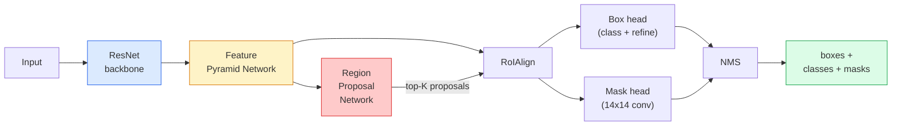

# Segmentation d'instance  Masque R-CNN

> Ajouter une branche de masque à un détecteur R-CNN plus rapide et vous avez une segmentation d'instance.

**Type:** Build + Learn
**Languages:** Python
**Prerequisites:** Phase 4 Lesson 06 (YOLO), Phase 4 Lesson 07 (U-Net)
**Time:** ~75 minutes

## Objectifs d'apprentissage

- Tracer l'architecture de fin à fin de la masque R-CNN: colonne vertébrale, FPN, RPN, RoIAlign, tête de boîte, tête de masque
- Implementer RoIAlign à partir de zéro et expliquer pourquoi RoIPool n'est plus utilisé
- Utilisez la visibilité de la torche `maskrcnn_resnet50_fpn_v2`modèle prétrainé pour les masques d'instance de qualité de production et lire correctement son format de sortie
- R-CNN à régler sur un petit ensemble de données personnalisé en remplaçant la boîte et les têtes de masque et en gardant le dos gelé

## Le problème

La segmentation sémantique vous donne un masque par classe. La segmentation par instances vous donne un masque par objet, même lorsque deux objets partagent une classe. Le comptage des individus, le suivi des cadres et la mesure des choses (la boîte de délimitation de chaque brique dans un mur, chaque cellule dans une image au microscope) nécessitent tous une segmentation par instances.

Mask R-CNN (He et al., 2017) a résolu cette question en reformulant la segmentation d'instance en tant que détection plus-un masque. La conception était si propre que pendant les cinq années suivantes, presque tous les documents de segmentation d'instance étaient une variante de Mask R-CNN, et la mise en œuvre de la torchvision est toujours la norme par défaut de production pour les petits et moyens ensembles de données.

Le problème difficile de l'ingénierie est le prélèvement d'échantillons: comment extraire une région de fonctionnalités de taille fixe d'une boîte de proposition dont les coins ne sont pas alignés sur les limites des pixels?

## Le concept

### L'architecture



Cinq pièces à comprendre:

1. **Backbone** ResNet-50 ou ResNet-101 formé sur ImageNet. Produit une hiérarchie de cartes de fonctionnalités aux étapes 4, 8, 16, 32.
2. **FPN (Feature Pyramid Network)** connexions latérales supérieures et inférieures qui donnent à chaque niveau C des canaux riches en fonctionnalités sémantiques.
3. **RPN (Region Proposal Network)** une petite tête de convection qui, à chaque position d'ancrage, prédit "y a-t-il un objet ici?" et "comment affiner la boîte ?" Produit ~ 1000 propositions par image.
4. **RoIAlign** échantillonnage d'un patch de taille fixe (par exemple 7x7) provenant de n'importe quelle boîte sur n'importe quel niveau FPN.
5. **Heads** tête de boîte à deux couches qui raffinent la boîte et choisit une classe, plus une petite tête de boîte qui donne une sortie `28x28`masque binaire pour chaque proposition.

### Pourquoi RoIAlign et non RoIPool

Le R-CNN Fast a utilisé RoIPool, qui divise une boîte de proposition en une grille, prend la fonctionnalité maximale dans chaque cellule et arrondit toutes les coordonnées en nombres entiers.

```
RoIPool:
  box (34.7, 51.3, 98.2, 142.9)
  round -> (34, 51, 98, 142)
  split grid -> round each cell boundary
  misalignment accumulates at every step

RoIAlign:
  box (34.7, 51.3, 98.2, 142.9)
  sample at exact float coordinates using bilinear interpolation
  no rounding anywhere
```

RoIAlign relève le masque AP de 3 à 4 points sur COCO gratuitement.

### Le RPN en un seul paragraphe

À chaque position d'une carte de caractéristiques, placez des boîtes d'ancrage K de différentes tailles et formes. Prédire un score d'objets pour chaque ancre et un décalage de régression pour transformer l'ancre en une boîte plus adaptée. Gardez les 1000 boîtes de dessus par score, appliquez NMS à l'UIO 0.7, et remettez les survivants aux têtes. Le RPN est formé avec sa propre mini-perte  la même structure que la perte YOLO de la leçon 6, seulement avec deux classes (objet / aucun objet).

### La tête du masque

Pour chaque proposition (après RoIAlign), la tête de masque est une minuscule FCN: quatre conv 3x3, une deconv 2x, une conv finale 1x1 qui produit `num_classes`les canaux de sortie à `28x28`La résolution. Seul le canal correspondant à la classe prévue est conservé; les autres sont ignorés.

Prenez le masque 28x28 à la taille de pixel originale de la proposition pour produire le masque binaire final.

### Les pertes

Mask R-CNN a quatre pertes ajoutées:

```
L = L_rpn_cls + L_rpn_box + L_box_cls + L_box_reg + L_mask
```

- `L_rpn_cls`- Je suis là .`L_rpn_box` objet + régression des boîtes pour les propositions RPN.
- `L_box_cls` entropies croisées sur les classes (C+1) (y compris les arrière-plans) du classeur de la tête.
- `L_box_reg` L1 lisse sur le raffinement de la boîte de la tête.
- `L_mask` entropies binaires croisées par pixel sur la sortie de masque 28x28.

Chaque perte a son propre poids par défaut; la mise en œuvre de la torche les expose comme des arguments de constructeur.

### Format de sortie

`torchvision.models.detection.maskrcnn_resnet50_fpn_v2`renvoie une liste de dicts, un par image:

```
{
    "boxes":  (N, 4) in (x1, y1, x2, y2) pixel coordinates,
    "labels": (N,) class IDs, 0 = background so indices are 1-based,
    "scores": (N,) confidence scores,
    "masks":  (N, 1, H, W) float masks in [0, 1] — threshold at 0.5 for binary,
}
```

Le masque est déjà en pleine résolution, la tête de sortie 28x28 a été échantillonnée à l'intérieur.

```figure
cv3-roialign-sampling
```

## Faites-le

### Étape 1: aligner le système royaux à partir de zéro

C'est le seul composant de Mask R-CNN qui est plus simple à comprendre en code que en prose.

```python
import torch
import torch.nn.functional as F

def roi_align_single(feature, box, output_size=7, spatial_scale=1 / 16.0):
    """
    feature: (C, H, W) single-image feature map
    box: (x1, y1, x2, y2) in original image pixel coordinates
    output_size: side of the output grid (7 for box head, 14 for mask head)
    spatial_scale: reciprocal of the feature map stride
    """
    C, H, W = feature.shape
    x1, y1, x2, y2 = [c * spatial_scale - 0.5 for c in box]
    bin_w = (x2 - x1) / output_size
    bin_h = (y2 - y1) / output_size

    grid_y = torch.linspace(y1 + bin_h / 2, y2 - bin_h / 2, output_size)
    grid_x = torch.linspace(x1 + bin_w / 2, x2 - bin_w / 2, output_size)
    yy, xx = torch.meshgrid(grid_y, grid_x, indexing="ij")

    gx = 2 * (xx + 0.5) / W - 1
    gy = 2 * (yy + 0.5) / H - 1
    grid = torch.stack([gx, gy], dim=-1).unsqueeze(0)
    sampled = F.grid_sample(feature.unsqueeze(0), grid, mode="bilinear",
                            align_corners=False)
    return sampled.squeeze(0)
```

Chaque nombre est dans une position bilinéaire sans arrondissement, sans quantification, sans dégradation.

### Étape 2: Comparer avec le RoIAlign de torchvision

```python
from torchvision.ops import roi_align

feature = torch.randn(1, 16, 50, 50)
boxes = torch.tensor([[0, 10, 20, 100, 90]], dtype=torch.float32)  # (batch_idx, x1, y1, x2, y2)

ours = roi_align_single(feature[0], boxes[0, 1:].tolist(), output_size=7, spatial_scale=1/4)
theirs = roi_align(feature, boxes, output_size=(7, 7), spatial_scale=1/4, sampling_ratio=1, aligned=True)[0]

print(f"shape ours:   {tuple(ours.shape)}")
print(f"shape theirs: {tuple(theirs.shape)}")
print(f"max|diff|:    {(ours - theirs).abs().max().item():.3e}")
```

Avec `sampling_ratio=1`et `aligned=True`, les deux correspondent à l' intérieur `1e-5`- Je suis désolé .

### Étape 3: Charger un masque R-CNN prétrainé

```python
import torch
from torchvision.models.detection import maskrcnn_resnet50_fpn_v2, MaskRCNN_ResNet50_FPN_V2_Weights

model = maskrcnn_resnet50_fpn_v2(weights=MaskRCNN_ResNet50_FPN_V2_Weights.DEFAULT)
model.eval()
print(f"params: {sum(p.numel() for p in model.parameters()):,}")
print(f"classes (including background): {len(model.roi_heads.box_predictor.cls_score.out_features * [0])}")
```

Les paramètres 46M, 91 classes (COCO). La première classe (id 0) est l'arrière-plan; tout ce que le modèle détecte réellement commence à id 1.

### Étape 4: Exécuter une inférence

```python
with torch.no_grad():
    x = torch.randn(3, 400, 600)
    predictions = model([x])
p = predictions[0]
print(f"boxes:  {tuple(p['boxes'].shape)}")
print(f"labels: {tuple(p['labels'].shape)}")
print(f"scores: {tuple(p['scores'].shape)}")
print(f"masks:  {tuple(p['masks'].shape)}")
```

Le tensor du masque est de forme .`(N, 1, H, W)`- Le seuil de 0,5 pour obtenir un masque binaire par objet:

```python
binary_masks = (p['masks'] > 0.5).squeeze(1)  # (N, H, W) boolean
```

### Étape 5: Échangez les têtes pour un compte de classe personnalisé

La recette commune de réglage fin: réutiliser la colonne vertébrale, FPN et RPN; remplacer les deux têtes de classification.

```python
from torchvision.models.detection.faster_rcnn import FastRCNNPredictor
from torchvision.models.detection.mask_rcnn import MaskRCNNPredictor

def build_custom_maskrcnn(num_classes):
    model = maskrcnn_resnet50_fpn_v2(weights=MaskRCNN_ResNet50_FPN_V2_Weights.DEFAULT)
    in_features = model.roi_heads.box_predictor.cls_score.in_features
    model.roi_heads.box_predictor = FastRCNNPredictor(in_features, num_classes)
    in_features_mask = model.roi_heads.mask_predictor.conv5_mask.in_channels
    hidden_layer = 256
    model.roi_heads.mask_predictor = MaskRCNNPredictor(in_features_mask, hidden_layer, num_classes)
    return model

custom = build_custom_maskrcnn(num_classes=5)
print(f"custom cls_score.out_features: {custom.roi_heads.box_predictor.cls_score.out_features}")
```

`num_classes`doit inclure la classe de fond, de sorte qu'un ensemble de données avec 4 classes d'objets utilise `num_classes=5`- Je suis désolé .

### Étape 6: congeler ce qui n'a pas besoin d'être formé

Sur de petits ensembles de données, congeler la colonne vertébrale et le FPN.

```python
def freeze_backbone_and_fpn(model):
    # torchvision Mask R-CNN packs the FPN inside `model.backbone` (as
    # `model.backbone.fpn`), so iterating `model.backbone.parameters()` covers
    # both the ResNet feature layers and the FPN lateral/output convs.
    for p in model.backbone.parameters():
        p.requires_grad = False
    return model

custom = freeze_backbone_and_fpn(custom)
trainable = sum(p.numel() for p in custom.parameters() if p.requires_grad)
print(f"trainable after freeze: {trainable:,}")
```

Sur les ensembles de données de 500 images, c'est la différence entre convergence et suradaptation.

## Utilisez-le

La boucle d'entraînement complète pour Mask R-CNN dans torchvision est de 40 lignes et ne change pas significativement entre les tâches  swap datasets et go.

```python
def train_step(model, images, targets, optimizer):
    model.train()
    loss_dict = model(images, targets)
    losses = sum(loss for loss in loss_dict.values())
    optimizer.zero_grad()
    losses.backward()
    optimizer.step()
    return {k: v.item() for k, v in loss_dict.items()}
```

Le `targets`La liste doit contenir des dicts par image avec `boxes`- Je suis là .`labels`, et `masks`(comme `(num_instances, H, W)`Le modèle renvoie un dict de quatre pertes pendant l'entraînement et une liste de prédictions pendant l'évaluation, en fonction de la tactique `model.training`- Je suis désolé .

Le `pycocotools`l'évaluateur produit mAP@IoU=0.5:0.95 pour les boîtes et les masques; vous avez besoin des deux numéros pour savoir si la tête de boîte ou la tête de masque est le col de bouteille.

## La faire partir

Cette leçon donne:

- `outputs/prompt-instance-vs-semantic-router.md` une requête qui pose trois questions et choisit l'instance vs sémantique vs panoptique plus le modèle exact pour commencer.
- `outputs/skill-mask-rcnn-head-swapper.md` une compétence qui génère les 10 lignes de code pour échanger les têtes sur n'importe quel modèle de détection de torchvision, étant donné le nouveau `num_classes`- Je suis désolé .

## Exercices

1. **(Easy)**Vérifiez votre alignement de royauté contre `torchvision.ops.roi_align`En plus de cela, il est possible de faire une analyse de la différence absolue maximale.
2. **(Medium)**- Je suis bien .`maskrcnn_resnet50_fpn_v2`sur un ensemble de données personnalisé de 50 images (deux classes: ballons, poissons, poussières, logos).
3. **(Hard)**Remplacez la tête de masque de Mask R-CNN par une tête qui prédit à 56x56 au lieu de 28x28. Mesurez mAP@IoU = 0,75 avant et après. Expliquez pourquoi le gain (ou l'absence de celui-ci) correspond à l'échange de précision limite / mémoire attendu.

## Les termes clés

| Term | What people say | What it actually means |
|------|----------------|----------------------|
| Mask R-CNN | "Detection plus masks" | Faster R-CNN + a small FCN head that predicts a 28x28 mask per proposal per class |
| FPN | "Feature pyramid" | Top-down + lateral connections that give every stride level C channels of semantic-rich features |
| RPN | "Region proposer" | A small conv head that produces ~1000 object/no-object proposals per image |
| RoIAlign | "No-rounding crop" | Bilinearly samples a fixed-size feature grid from any float-coordinate box |
| RoIPool | "Pre-2017 crop" | Same purpose as RoIAlign but rounds box coordinates; obsolete |
| Mask AP | "Instance mAP" | Average precision computed with mask IoU instead of box IoU; the COCO instance segmentation metric |
| Binary mask head | "Per-class mask" | Predicts one binary mask per class for each proposal; only the predicted class's channel is kept |
| Background class | "Class 0" | The catch-all "no object" class; indices for real classes start at 1 |

## Pour en savoir plus

- [Mask R-CNN (He et al., 2017)](https://arxiv.org/abs/1703.06870) l'article; la section 3 sur le RoIAlign est la lecture critique
- [FPN: Feature Pyramid Networks (Lin et al., 2017)](https://arxiv.org/abs/1612.03144) le papier FPN; chaque détecteur moderne l'utilise
- [torchvision Mask R-CNN tutorial](https://pytorch.org/tutorials/intermediate/torchvision_tutorial.html) la référence pour la boucle d'ajustement fin
- [Detectron2 model zoo](https://github.com/facebookresearch/detectron2/blob/main/MODEL_ZOO.md) Implémentations de production avec poids formés pour presque toutes les variantes de détection et de segmentation
