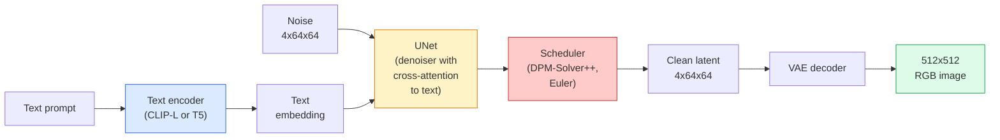

# Diffusion stable  Architecture et réglage

> La diffusion stable est un DDPM qui fonctionne dans l'espace latent d'un VAE prétrainé, conditionné sur le texte via l'attention croisée, échantillonné avec un déterminateur ODE déterministe rapide, et dirigé par une orientation sans classifiateur.

**Type:** Learn + Use
**Languages:** Python
**Prerequisites:** Phase 4 Lesson 10 (Diffusion), Phase 7 Lesson 02 (Self-Attention)
**Time:** ~75 minutes

## Objectifs d'apprentissage

- Tracer les cinq éléments d'un pipeline de diffusion stable: VAE, encodeur de texte, U-Net, planificateur, vérificateur de sécurité  et ce que chacun d'eux fait réellement
- Expliquer la diffusion latente et expliquer pourquoi l'entraînement dans un espace latente 4x64x64 (au lieu d'une image 3x512x512) réduit le calcul de 48 fois sans perte de qualité
- Utilisation `diffusers`générer des images, exécuter image-à-image, imprimer et générer des images guidées par ControlNet
- Diffusion stable avec LoRA sur un petit ensemble de données personnalisé et chargement de l'adaptateur LoRA à l' inférence

## Le problème

La formation d'un DDPM directement sur des images RGB 512x512 est coûteuse. Chaque étape de formation se repose à travers un U-Net qui voit 3x512x512 = 786,432 valeurs d'entrée, et le prélèvement d'échantillons prend 50+ passes à travers le même U-Net. Au niveau de qualité de Stable Diffusion 1.5 (développé en 2022), la diffusion de l'espace des pixels nécessiterait environ 256 mois de formation en GPU et 10-30 secondes par image sur un GPU de consommation.

Le truc qui a rendu le texte à image ouvert pratique était**latent diffusion**(Rombach et coll., CVPR 2022). Exercer une VAE qui cartographient une image 3x512x512 à un tensor latent 4x64x64 et retour, puis faire la diffusion dans cet espace latent.`(3*512*512)/(4*64*64) = 48x`Le prélèvement passe de dix secondes à moins de deux secondes sur le même GPU.

Presque tous les modèles modernes de génération d'images  SDXL, SD3, FLUX, HunyuanDiT, Wan-Video  sont un modèle de diffusion latent avec des variations sur l'autoencodeur, le dénoiseur (U-Net ou DiT) et le conditionnement du texte.

## Le concept

### Le pipeline



- **VAE**Le décodeur convertit les images en images latences (utilisées pour l'img2img et l'entraînement).
- **Text encoder** Codificateur de texte CLIP (SD 1.x/2.x), CLIP-L + CLIP-G (SDXL) ou T5-XXL (SD3/FLUX). Produit une séquence d'embedding de jetons.
- **U-Net**Le désignateur possède des couches d'attention croisées qui vont des latences au texte intégré à tous les niveaux de résolution.
- **Scheduler**L'algorithme de prélèvement d'échantillons (DDIM, Euler, DPM-Solver++) choisit sigmas, mélange le bruit prévu dans le latent.
- **Safety checker** filtre NSFW / contenu illégal optionnel sur l'image de sortie.

### Les orientations sans classifiant (CFG)

Le conditionnement du texte simple apprend `epsilon_theta(x_t, t, c)`pour chaque demande `c`. La CFG traîne le même réseau avec `c`Il a été réalisé à 10% des cas (replacé par une intégration vide), ce qui a donné un modèle unique qui prédit à la fois le bruit conditionnel et l'inconditionnel.

```
eps = eps_uncond + w * (eps_cond - eps_uncond)
```

`w`est l'échelle de direction. `w=0`est inconditionnelle,`w=1`est clairement conditionnelle, `w>1`Le système de gestion de la décharge est un système de gestion de la décharge de la décharge de la décharge de la décharge de la décharge de la décharge de la décharge de la décharge de la décharge de la décharge de la décharge de la décharge de la décharge de la décharge de la décharge de la décharge de la décharge de la décharge de la décharge de la décharge de la décharge de la décharge de la décharge de la décharge de la décharge de la décharge de la décharge de la décharge de la décharge de la décharge de la décharge de la décharge de la décharge de la décharge de la décharge de la décharge de la décharge de la décharge de la décharge de la décharge de la décharge de la décharge de la décharge de la décharge de la décharge de la décharge de la décharge de décharge de la décharge de décharge de la décharge de décharge de décharge de décharge de décharge de décharge de décharge de décharge de décharge de décharge de décharge de décharge de décharge de décharge de décharge de décharge de décharge de décharge de décharge de décharge de décharge de décharge de décharge de décharge de décharge de décharge de décharge de décharge de décharge de décharge de décharge de décharge de décharge de décharge de décharge de décharge de décharge de décharge de décharge de décharge de décharge de décharge de décharge de décharge de décharge de décharge de décharge de décharge de décharge de décharge de décharge de décharge de décharge de décharge de décharge de décharge de décharge de décharge de décharge de décharge de décharge de décharge de décharge de décharge de décharge de décharge de décharge de décharge de décharge de décharge de décharge de décharge de décharge de décharge de décharge de décharge de décharge de décharge de décharge de décharge de décharge de décharge de décharge de décharge de décharge de décharge de décharge de décharge de décharge de décharge de décharge de décharge de décharge de décharge de décharge de décharge de décharge de décharge de décharge de`w=7.5`- Je suis désolé .

La CFG est la raison pour laquelle le texte à l'image fonctionne à la qualité de production. Sans elle, les instructions fausses la sortie faible; avec elle, les instructions dominent.

### Géométrie de l'espace latent

Le four-channel latent du VAE n'est pas seulement une image comprimée. Il s'agit d'un manifold où l'arithmétique correspond approximativement aux modifications sémantiques (l'ingénierie rapide + l'interpolation vivent toutes les deux ici), et où la diffusion U-Net a été formée pour dépenser tout son budget de modélisation. Le décoding d'une latente aléatoire 4x64x64 ne produit pas une image aléatoire  il produit des ordures, car seulement un sous-multiple spécifique de latentes décode des images valides.

Deux conséquences:

1. **Img2img**= encoder une image en latente, ajouter un bruit partiel, exécuter le dénonciateur, décoder. La structure de l'image survit parce que le codage est presque inversible; le contenu change en fonction de l'invite.
2. **Inpainting**= identique à img2img mais le dénonciateur ne met à jour que les régions masquées; les régions non masquées sont conservées au latente codé.

### L'architecture U-Net

Le SD U-Net est une grande version du TinyUNet de la leçon 10 avec trois ajouts:

- **Transformer blocks**à chaque résolution spatiale, contenant une attention personnelle + une attention croisée au texte intégré.
- **Time embedding**par MLP sur le codage sinusoïdale.
- **Skip connections**entre le codeur et le décodeur à résolutions correspondantes.

Paramètres totaux dans SD 1.5: ~860M. SDXL: ~2.6B. FLUX: ~12B. Le saut dans les paramètres est principalement dans les couches d'attention.

### L'ajustement fin de la LORA

L'adaptateur LoRA pour SD est généralement de 10 à 50 Mo, fonctionne en 10 à 60 minutes sur un seul GPU de consommation et se charge au moment de l'inférence comme une modification de décomposition.

```
Original: W_q : (d_in, d_out)   frozen
LoRA:     W_q + alpha * (A @ B)   where A : (d_in, r), B : (r, d_out)

r is typically 4-32.
```

La LoRA est la façon dont presque toutes les communautés sont distribuées.

### Les horaires que vous verrez

- **DDIM** déterministe, ~50 étapes, simple.
- **Euler ancestral** stochastique, 30 à 50 étapes, échantillons légèrement plus créatifs.
- **DPM-Solver++ 2M Karras** déterministe, 20 à 30 étapes, production par défaut.
- **LCM / TCD / Turbo** modèles de consistance et variantes distillées; 1 à 4 étapes au coût d'une certaine qualité.

L' échange de calendriers est un changement à une seule ligne dans `diffusers`et parfois répare les problèmes d'échantillonnage sans recyclage.

```figure
cv3-latent-compression
```

## Faites-le

Cette leçon utilise `diffusers`Les pièces que vous auriez besoin de reconstruire (VAE, encodeur de texte, U-Net, planificateur) sont des sujets de leurs propres leçons; ici, l'objectif est la fluidité avec l'API de production.

### Étape 1: Textes à images

```python
import torch
from diffusers import StableDiffusionPipeline

pipe = StableDiffusionPipeline.from_pretrained(
    "runwayml/stable-diffusion-v1-5",
    torch_dtype=torch.float16,
).to("cuda")

image = pipe(
    prompt="a dog riding a skateboard in tokyo, studio ghibli style",
    guidance_scale=7.5,
    num_inference_steps=25,
    generator=torch.Generator("cuda").manual_seed(42),
).images[0]
image.save("dog.png")
```

`float16`réduit de moitié la RAM sans perte de qualité visible. `num_inference_steps=25`avec les correspondances par défaut DPM-Solver++ `num_inference_steps=50`avec le DDIM.

### Étape 2: Changer le calendrier

```python
from diffusers import DPMSolverMultistepScheduler, EulerAncestralDiscreteScheduler

pipe.scheduler = DPMSolverMultistepScheduler.from_config(pipe.scheduler.config)
pipe.scheduler = EulerAncestralDiscreteScheduler.from_config(pipe.scheduler.config)
```

L'état du planificateur est déconnecté des poids U-Net. Vous pouvez vous entraîner sur le DDPM et échantillonner avec n'importe quel planificateur.

### Étape 3: image à image

```python
from diffusers import StableDiffusionImg2ImgPipeline
from PIL import Image

img2img = StableDiffusionImg2ImgPipeline.from_pretrained(
    "runwayml/stable-diffusion-v1-5",
    torch_dtype=torch.float16,
).to("cuda")

init_image = Image.open("dog.png").convert("RGB").resize((512, 512))
out = img2img(
    prompt="a dog riding a skateboard, oil painting",
    image=init_image,
    strength=0.6,
    guidance_scale=7.5,
).images[0]
```

`strength`est la quantité de bruit à ajouter avant la dénotation (0,0 = inchangé, 1,0 = régénération complète).

### Étape 4: Peinture

```python
from diffusers import StableDiffusionInpaintPipeline

inpaint = StableDiffusionInpaintPipeline.from_pretrained(
    "runwayml/stable-diffusion-inpainting",
    torch_dtype=torch.float16,
).to("cuda")

image = Image.open("dog.png").convert("RGB").resize((512, 512))
mask = Image.open("dog_mask.png").convert("L").resize((512, 512))

out = inpaint(
    prompt="a cat",
    image=image,
    mask_image=mask,
    guidance_scale=7.5,
).images[0]
```

Les pixels blancs du masque sont la zone à régénérer.

### Étape 5: Chargement de la LoRA

```python
pipe.load_lora_weights("sayakpaul/sd-lora-ghibli")
pipe.fuse_lora(lora_scale=0.8)

image = pipe(prompt="a village square in ghibli style").images[0]
```

`lora_scale`Les contrôles de résistance: 0,0 = aucun effet, 1,0 = effet complet. `fuse_lora`Il est possible de faire une commande de la vitesse de l'adaptateur, mais il est impossible de le changer.`pipe.unfuse_lora()`avant de charger un autre adaptateur.

### Étape 6: Formation en LRA (esquisse)

La formation LoRA réelle vit dans `peft`ou `diffusers.training`Le contour:

```python
# Pseudocode
for step, batch in enumerate(dataloader):
    images, prompts = batch
    latents = vae.encode(images).latent_dist.sample() * 0.18215

    t = torch.randint(0, num_train_timesteps, (batch_size,))
    noise = torch.randn_like(latents)
    noisy_latents = scheduler.add_noise(latents, noise, t)

    text_emb = text_encoder(tokenizer(prompts))

    pred_noise = unet(noisy_latents, t, text_emb)  # LoRA weights injected here

    loss = F.mse_loss(pred_noise, noise)
    loss.backward()
    optimizer.step()
```

Seules les matrices LoRA reçoivent le gradient; le base U-Net, VAE et le codeur de texte sont gelés.

## Utilisez-le

Dans la production, les décisions que vous prenez:

- **Model family**: SD 1.5 pour les mélodies de communauté open source, SDXL pour une plus grande fidélité, SD3 / FLUX pour l'état de l'art et les exigences strictes de licence.
- **Scheduler**: DPM-Solver++ 2M Karras pour 20-30 étapes, LCM-LoRA lorsque la latence est inférieure à 1s.
- **Precision**Le numéro de la liste:`float16`sur 4080/4090, `bfloat16`sur l'A100 et plus récentes, `int8`(via `bitsandbytes`ou `compel`) lorsque le VRAM est serré.
- **Conditioning**: fonctionne avec du texte simple; pour un contrôle plus solide, ajoutez le ControlNet (puis, profondeur, pose) au-dessus du pipeline de base.

Pour la génération de lots, `AUTO1111`- Je suis là .`ComfyUI`sont les outils communautaires; pour les API de production, `diffusers`+ `accelerate`ou `optimum-nvidia`avec la compilation TensorRT.

## La faire partir

Cette leçon donne:

- `outputs/prompt-sd-pipeline-planner.md` une requête qui choisit SD 1.5 / SDXL / SD3 / FLUX plus planificateur et précision compte tenu d'un budget de latence, d'un objectif de fidélité et de contraintes de licence.
- `outputs/skill-lora-training-setup.md` une compétence qui écrive une configuration de formation LoRA complète pour un ensemble de données personnalisé, y compris les légendes, le rang, la taille du lot et le taux d'apprentissage.

## Exercices

1. **(Easy)**Générer le même prompt avec `guidance_scale`dans `[1, 3, 5, 7.5, 10, 15]`- Décrivez comment l'image change.
2. **(Medium)**Prends une photo réelle, passe-la par là.`StableDiffusionImg2ImgPipeline`à`strength`dans `[0.2, 0.4, 0.6, 0.8, 1.0]`Pourquoi 1.0 ignore entièrement l'entrée ?
3. **(Hard)**Exercez un LoRA sur 10 à 20 images d'un seul sujet (un animal de compagnie, un logo, un personnage) et générez de nouvelles scènes avec ce sujet.

## Les termes clés

| Term | What people say | What it actually means |
|------|----------------|----------------------|
| Latent diffusion | "Diffuse in latents" | Run the entire DDPM in the VAE latent space (4x64x64) instead of pixel space (3x512x512); 48x compute saving |
| VAE scale factor | "0.18215" | Constant that rescales the VAE's raw latent to roughly unit variance; hardcoded in every SD pipeline |
| Classifier-free guidance | "CFG" | Mix conditional and unconditional noise predictions; the single most impactful inference knob |
| Scheduler | "Sampler" | The algorithm that turns noise + model predictions into a denoised latent trajectory |
| LoRA | "Low-rank adapter" | Small rank-decomposition matrices that fine-tune attention layers without touching base weights |
| Cross-attention | "Text-image attention" | Attention from latent tokens to text tokens; injects prompt information at every U-Net level |
| ControlNet | "Structure conditioning" | A separately-trained adapter that steers SD with an extra input (canny, depth, pose, segmentation) |
| DPM-Solver++ | "The default scheduler" | Second-order deterministic ODE solver; best quality at low step counts (20-30) in 2026 |

## Pour en savoir plus

- [High-Resolution Image Synthesis with Latent Diffusion (Rombach et al., 2022)](https://arxiv.org/abs/2112.10752) le papier de diffusion stable; comprend toute ablation qui justifie la conception
- [Classifier-Free Diffusion Guidance (Ho & Salimans, 2022)](https://arxiv.org/abs/2207.12598) le papier CFG
- [LoRA: Low-Rank Adaptation of Large Language Models (Hu et al., 2021)](https://arxiv.org/abs/2106.09685) LoRA a été la première PNL; elle a été transférée à SD sans presque aucun changement
- [diffusers documentation](https://huggingface.co/docs/diffusers) la référence pour chaque pipeline SD/SDXL/SD3/FLUX
