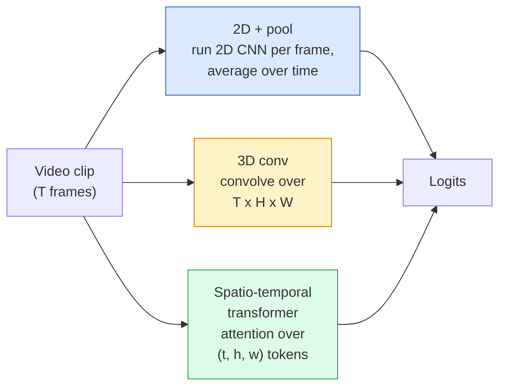

# La compréhension de la vidéo  Modélisation temporaire

> Une vidéo est une séquence d'images plus la physique qui les relie. Chaque modèle vidéo traite le temps soit comme un axe supplémentaire (3D conv), une séquence à suivre (transformateur), ou une fonctionnalité pour extraire une fois et pool (2D + pool).

**Type:** Learn + Build
**Languages:** Python
**Prerequisites:** Phase 4 Lesson 03 (CNNs), Phase 4 Lesson 04 (Image Classification)
**Time:** ~45 minutes

## Objectifs d'apprentissage

- Distinguer les trois principales approches de modélisation vidéo (2D+pool, 3D conv, transformateur spatio-temporal) et prédire leurs coûts et leurs compromis de précision
- Implementer le prélèvement de cadres, le regroupement temporel et un classificateur de base 2D+pool dans PyTorch
- Expliquez pourquoi les noyaux 3D " gonflés " d'I3D se transforment bien des poids d'ImageNet et ce qu'un convectorisé (2+1)D fait différemment
- Lire les ensembles de données et les mesures standard de reconnaissance d'action: Kinétique-400/600, UCF101, Something-Something V2; précision de haut niveau au niveau des clips et des vidéos

## Le problème

Une vidéo de 30 secondes à 30 fps est de 900 images. Naïvement, la classification vidéo est une classification d'image exécutée 900 fois suivie d'une sorte d'agrégation. Cela fonctionne lorsque l'action est visible dans presque tous les images (vidéos sportives, de cuisine, d'exercice) et échoue mal lorsque l'action est définie par le mouvement lui-même: " pousser quelque chose de gauche à droite " ressemble à deux objets fixes dans chaque image.

La question fondamentale pour chaque architecture vidéo est: quand la structure temporelle est-elle modélisée, et comment ? La réponse motive tout le reste  calcul du coût, stratégie de pré-entraînement, si vous pouvez réutiliser les poids d'ImageNet, sur quels ensembles de données le modèle s'entraîne.

Cette leçon est délibérément plus courte que les leçons d'image statique. La machine de base de l'image est déjà en place, et la compréhension vidéo concerne principalement l'histoire temporelle: le prélèvement d'échantillons, la modélisation et l'agrégation.

## Le concept

### Les trois familles architecturales



### 2D + piscine

Prenez une CNN 2D (ResNet, EfficientNet, ViT). Exécutez-la indépendamment sur chaque cadre échantillonné. Average (ou maximum-pool, ou attention-pool) les emblèmes par cadre.

Les avantages:
- ImageNet effectue des transferts de pré-entraînement directement.
- Le plus simple à mettre en œuvre.
- Cheap: T-frame * coût de l'inférence d'une seule image.

Les inconvénients:
- Je ne peux pas modéliser le mouvement.
- Le regroupement temporel est invariable selon l'ordre; "porte ouverte" et "porte fermée" sont identiques.

Quand utiliser: tâches lourdes en apparence, transfert d'apprentissage sur de petits ensembles de données vidéo, lignes de base initiales.

### Les convolutions 3D

Remplacez les noyaux 2D (H, W) par des noyaux 3D (T, H, W). Le réseau se convolte à la fois dans l'espace et le temps.

Trick I3D: prenez un modèle 2D ImageNet prétrainé, " gonflez " chaque noyau 2D en le copiant le long d'un nouvel axe temporel. Un convecteur 2D 3x3 devient un convecteur 3x3x3 3D. Cela donne au modèle 3D des poids prétraînés forts au lieu de l'entraînement à partir de zéro.

Les avantages:
- Il est directement modélisé.
- L'inflation I3D donne un apprentissage gratuit.

Les inconvénients:
- T/8 plus de FLOP que la contrepartie 2D (pour le noyau temporel de 3 empilés 3 fois).
- Les noyaux temporaires sont petits; le mouvement à longue portée nécessite une approche pyramidale ou à double courant.

Quand utiliser: reconnaissance d'action où le mouvement est le signal (Quelque chose-Quelque chose V2, Kinétique avec classes lourdes en mouvement).

### Transformateurs spatiaux-temporaux

Marquez la vidéo dans une grille de patchs spatiotemps et assistez à tous.

Les schémas d'attention qui comptent:
- **Joint** une grande attention sur (t, h, w).`T*H*W`- Ils sont chers.
- **Divided** deux attentions par bloc: une dans le temps, une dans l'espace.
- **Factorised** L'attention temporelle alternera avec l'attention spatiale à travers les blocs.

Les avantages:
- Accuracité SOTA sur chaque référence majeure.
- Transférations à partir de transformateurs d'image (ViT) par inflation des patches.
- Supporte la vidéo de long contexte via une attention rare.

Les inconvénients:
- Je suis affamé de calcul.
- Il faut choisir avec soin le modèle d'attention ou les ballons de course.

Quand utiliser: grands ensembles de données, compréhension vidéo de haute fidélité, tâches vidéo + texte multimodal.

### Prise d'échantillons de cadres

Un clip de 10 secondes à 30 images par seconde est de 300 images; alimenter les 300 à n'importe quel modèle est gaspilleur.

- **Uniform sampling** choisir les cadres T uniformément sur le clip.
- **Dense sampling** fenêtre de T-frame contiguë aléatoire. commun pour les convex 3D car le mouvement nécessite des cadres voisins.
- **Multi-clip** échantillonnage de plusieurs fenêtres de T-frame de la même vidéo, classer chacune, prédictions moyennes au moment du test.

T est généralement 8, 16, 32 ou 64. T plus élevé = plus de signal temporel à plus de calcul.

### Évaluation

Deux niveaux:
- **Clip-level accuracy**Le modèle voit un clip de T-frame, rapporte top-k.
- **Video-level accuracy** prédictions moyennes de niveau de clips sur plusieurs clips par vidéo; plus élevé et plus stable.

Un modèle qui marque 78% de clip / 82% de vidéo dépend fortement de la moyenne de temps de test; un modèle qui marque 80% / 81% est plus robuste par clip.

### Les ensembles de données que vous rencontrerez

- **Kinetics-400 / 600 / 700** l'ensemble de données d'action à usage général. 400 000 clips; URL YouTube (plusieurs sont maintenant morts).
- **Something-Something V2** actions définies par mouvement (" déplacement de X de gauche à droite ").
- **UCF-101**- Je suis là .**HMDB-51** plus âgés, plus petits, encore rapportés.
- **AVA** action *localisation* dans l'espace et le temps; plus difficile que la classification.

```figure
v4-video-temporal
```

## Faites-le

### Étape 1: Prélèvement de cadres

Des échantillonnages uniformes et denses qui fonctionnent sur une liste de cadres (ou un tensor vidéo).

```python
import numpy as np

def sample_uniform(num_frames_total, T):
    if num_frames_total <= T:
        return list(range(num_frames_total)) + [num_frames_total - 1] * (T - num_frames_total)
    step = num_frames_total / T
    return [int(i * step) for i in range(T)]


def sample_dense(num_frames_total, T, rng=None):
    rng = rng or np.random.default_rng()
    if num_frames_total <= T:
        return list(range(num_frames_total)) + [num_frames_total - 1] * (T - num_frames_total)
    start = int(rng.integers(0, num_frames_total - T + 1))
    return list(range(start, start + T))
```

Ils reviennent tous les deux .`T`indices que vous utilisez pour couper le tensor vidéo.

### Étape 2: Une ligne de base 2D+Pool

Exécutez un ResNet-18 2D sur chaque cadre, des fonctionnalités moyennes, classez.

```python
import torch
import torch.nn as nn
from torchvision.models import resnet18, ResNet18_Weights

class FramePool(nn.Module):
    def __init__(self, num_classes=400, pretrained=True):
        super().__init__()
        weights = ResNet18_Weights.IMAGENET1K_V1 if pretrained else None
        backbone = resnet18(weights=weights)
        self.features = nn.Sequential(*(list(backbone.children())[:-1]))  # global avg pool kept
        self.head = nn.Linear(512, num_classes)

    def forward(self, x):
        # x: (N, T, 3, H, W)
        N, T = x.shape[:2]
        x = x.view(N * T, *x.shape[2:])
        feats = self.features(x).view(N, T, -1)
        pooled = feats.mean(dim=1)
        return self.head(pooled)

model = FramePool(num_classes=10)
x = torch.randn(2, 8, 3, 224, 224)
print(f"output: {model(x).shape}")
print(f"params: {sum(p.numel() for p in model.parameters()):,}")
```

Onze millions de paramètres, pré-entraînés par ImageNet, fonctionnent par cadre, moyennes, classifie. Cette ligne de base est souvent à moins de 5 à 10 points des modèles 3D appropriés sur des tâches lourdes en apparence  parfois mieux, car elle réutilise une colonne vertébrale ImageNet plus forte.

### Étape 3: Un convecteur 3D gonflé à l'I3D

Transformer une seule convection 2D en une convection 3D en répétant des poids le long d'un nouvel axe temporel.

```python
def inflate_2d_to_3d(conv2d, time_kernel=3):
    out_c, in_c, kh, kw = conv2d.weight.shape
    weight_3d = conv2d.weight.data.unsqueeze(2)  # (out, in, 1, kh, kw)
    weight_3d = weight_3d.repeat(1, 1, time_kernel, 1, 1) / time_kernel
    conv3d = nn.Conv3d(in_c, out_c, kernel_size=(time_kernel, kh, kw),
                        padding=(time_kernel // 2, conv2d.padding[0], conv2d.padding[1]),
                        stride=(1, conv2d.stride[0], conv2d.stride[1]),
                        bias=False)
    conv3d.weight.data = weight_3d
    return conv3d

conv2d = nn.Conv2d(3, 64, kernel_size=3, padding=1, bias=False)
conv3d = inflate_2d_to_3d(conv2d, time_kernel=3)
print(f"2D weight shape:  {tuple(conv2d.weight.shape)}")
print(f"3D weight shape:  {tuple(conv3d.weight.shape)}")
x = torch.randn(1, 3, 8, 56, 56)
print(f"3D output shape:  {tuple(conv3d(x).shape)}")
```

La division par `time_kernel`Il est important de ne pas enfreindre les statistiques de la norme de lot lors du premier passage.

### Étape 4: Conférence de facteur (2+1)

Divisez une conve 3D en une conve 2D (espaciale) et une conve 1D (temporale). Le même champ réceptif, moins de paramètres, une meilleure précision sur certaines valeurs de référence.

```python
class Conv2Plus1D(nn.Module):
    def __init__(self, in_c, out_c, kernel_size=3):
        super().__init__()
        mid_c = (in_c * out_c * kernel_size * kernel_size * kernel_size) \
                // (in_c * kernel_size * kernel_size + out_c * kernel_size)
        self.spatial = nn.Conv3d(in_c, mid_c, kernel_size=(1, kernel_size, kernel_size),
                                 padding=(0, kernel_size // 2, kernel_size // 2), bias=False)
        self.bn = nn.BatchNorm3d(mid_c)
        self.act = nn.ReLU(inplace=True)
        self.temporal = nn.Conv3d(mid_c, out_c, kernel_size=(kernel_size, 1, 1),
                                  padding=(kernel_size // 2, 0, 0), bias=False)

    def forward(self, x):
        return self.temporal(self.act(self.bn(self.spatial(x))))

c = Conv2Plus1D(3, 64)
x = torch.randn(1, 3, 8, 56, 56)
print(f"(2+1)D output: {tuple(c(x).shape)}")
```

Un réseau complet R(2+1)D est le même qu'un réseau ResNet-18 avec chaque conve 3x3 remplacé par `Conv2Plus1D`- Je suis désolé .

## Utilisez-le

Deux bibliothèques couvrent les vidéos de production:

- `torchvision.models.video` R(2+1) D, MViT, Swin3D avec des poids de kinétique prétrainés.
- `pytorchvideo`(Meta)  modèle zoo, chargés de données pour Kinétique / SSv2 / AVA, transformations standard.

Pour les modèles vidéo en langage de vision (caption vidéo, QA vidéo), utilisez `transformers`(le secteur de l'énergie)`VideoMAE`- Je suis là .`VideoLLaMA`- Je suis là .`InternVideo`)

## La faire partir

Cette leçon donne:

- `outputs/prompt-video-architecture-picker.md` une requête qui choisit le transformateur 2D+pool / I3D / (2+1)D / en fonction de l'apparence contre le mouvement, de la taille du jeu de données et du budget de calcul.
- `outputs/skill-frame-sampler-auditor.md` une compétence qui inspecte le prélèvement d'un pipeline vidéo et détecte les bugs communs: indice non-par-un, prélèvement inégal lorsque `num_frames < T`, manque de culture conservante, etc.

## Exercices

1. **(Easy)**Computez les FLOP (approximatifs) pour FramePool avec T=8 contre un ResNet 3D de style I3D avec T=8.
2. **(Medium)**Générer un ensemble de données vidéo synthétiques: des boules aléatoires se déplaçant dans des directions aléatoires, étiquetées par la direction de mouvement (" gauche à droite ", " droite à gauche ", " diagonale vers le haut ").
3. **(Hard)**Construisez un R(2+1) D-18 en remplaçant chaque Conv2d dans un ResNet-18 par `Conv2Plus1D`- Inflez les poids des premiers convecteurs à partir d'un ResNet-18 prétrainé par ImageNet.

## Les termes clés

| Term | What people say | What it actually means |
|------|----------------|----------------------|
| 2D + pool | "Per-frame classifier" | Run a 2D CNN on every sampled frame, average-pool features across time, classify |
| 3D convolution | "Spatio-temporal kernel" | Kernel that convolves over (T, H, W); can model motion natively |
| Inflation | "Lift 2D weights to 3D" | Initialise 3D conv weights by repeating a 2D conv's weights along the new time axis, then divide by kernel_T to preserve activation scale |
| (2+1)D | "Factorised conv" | Split 3D into 2D spatial + 1D temporal; fewer parameters, extra non-linearity between |
| Divided attention | "Time then space" | Transformer block with two attentions per layer: one over tokens at the same frame, one over tokens at the same position |
| Clip | "T-frame window" | A sampled subsequence of T frames; the unit a video model consumes |
| Clip vs video accuracy | "Two eval settings" | Clip = one sample per video, video = average across multiple sampled clips |
| Kinetics | "The ImageNet of video" | 400-700 action classes, 300k+ YouTube clips, the standard video pretraining corpus |

## Pour en savoir plus

- [I3D: Quo Vadis, Action Recognition (Carreira & Zisserman, 2017)](https://arxiv.org/abs/1705.07750) introduit l'inflation et le jeu de données Kinétique
- [R(2+1)D: A Closer Look at Spatiotemporal Convolutions (Tran et al., 2018)](https://arxiv.org/abs/1711.11248) confactueuses, encore une base forte
- [TimeSformer: Is Space-Time Attention All You Need? (Bertasius et al., 2021)](https://arxiv.org/abs/2102.05095) le premier transformateur vidéo puissant
- [VideoMAE (Tong et al., 2022)](https://arxiv.org/abs/2203.12602) pré-entraînement automatique masqué pour la vidéo; recette actuelle dominante de pré-entraînement
