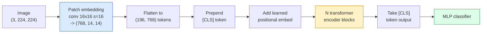

# Transformateurs de vision (ViT)

> Coupez l'image en patches, traitez chaque patch comme un mot, lancez un transformateur standard.

**Type:** Build
**Languages:** Python
**Prerequisites:** Phase 7 Lesson 02 (Self-Attention), Phase 4 Lesson 04 (Image Classification)
**Time:** ~45 minutes

## Objectifs d'apprentissage

- Implémenter l'intégration de patch, l'intégration positionnelle apprise, le jeton de classe et les blocs d'encodeur de transformateur à partir de zéro pour créer un ViT minimal
- Expliquez pourquoi on pensait que la TIV avait besoin de données massives avant l'entraînement jusqu'à ce que la TIV et la TIV aient prouvé le contraire.
- Comparer ViT, Swin et ConvNeXt sur leurs antécédents architecturaux (aucun, attention locale de fenêtre, colonne vertébrale de conve)
- Télégraphie d' un ViT prétrainé sur un petit ensemble de données en utilisant `timm`et la recette standard de sonde linéaire / réglage fin

## Le problème

Pendant une décennie, la convolutions était synonyme de vision par ordinateur. Les CNN avaient de forts biais inductifs  localité, équivariance de traduction  que personne ne pensait pouvoir remplacer. Puis Dosovitskiy et al. (2020) ont montré qu'un transformateur simple appliqué à des patchs d'image aplatisés, sans aucune machine convolutive, pouvait correspondre ou battre les meilleures CNN à l'échelle.

Le capture était "à grande échelle". ViT sur ImageNet-1k a perdu à ResNet. ViT a été entraîné sur ImageNet-21k ou JFT-300M puis ajusté sur ImageNet-1k. La conclusion était que les transformateurs manquaient de prédécesseurs utiles mais pouvaient les apprendre à partir de suffisamment de données. Des travaux ultérieurs (DeiT, MAE, DINO) ont montré qu'avec les bonnes recettes de formation  augmentation forte, pré-entraînement auto-supervisé, distillation  ViTs entraînent bien sur de petites données aussi.

En 2026, les CNN pures sont toujours compétitives sur les périphériques de bord (ConvNeXt est le plus fort), mais les transformateurs dominent tout le reste: segmentation (Mask2Former, SegFormer), détection (DETR, RT-DETR), multimodal (CLIP, SigLIP), vidéo (VideoMAE, VJEPA).

## Le concept

### Le pipeline



Sept étapes. Patches -> tokens -> attention -> classifiant. Chaque variante (DeiT, Swin, ConvNeXt, MAE prétraining) change un ou deux des sept et laisse le reste seul.

### Embedding de patch

Le premier conv est le secret. taille du noyau 16, étape 16, donc une image 224x224 devient une grille de 14x14 de patches 16x16, chacune projetée à un embed 768-dim. Ce seul conv patch et projet linear.

```
Input:  (3, 224, 224)
Conv (3 -> 768, k=16, s=16, no padding):
Output: (768, 14, 14)
Flatten spatial: (196, 768)
```

196 patches = 196 jetons. La dimension de fonctionnalité de chaque jeton est de 768 (ViT-B), 1024 (ViT-L) ou 1280 (ViT-H).

### Token de classe

Un seul vecteur appris prépendié à la séquence:

```
tokens = [CLS; patch_1; patch_2; ...; patch_196]   shape (197, 768)
```

Après N de blocs transformateurs, le `[CLS]`La tête de classification ne lit que ce vecteur.

### Embedding positionnel

Les transformateurs n'ont pas de notion de position spatiale intégrée.

```
tokens = tokens + learned_pos_embedding   (also shape (197, 768))
```

L'intégration est un paramètre du modèle; la formation basée sur le gradient l'adapte à la structure de l'image 2D.

### Bloc de codeur de transformateur

Attention à soi, MLP, connexions résiduelles, pré-LayerNorm.

```
x = x + MSA(LN(x))
x = x + MLP(LN(x))

MLP is two-layer with GELU: Linear(d -> 4d) -> GELU -> Linear(4d -> d)
```

ViT-B/16 empile 12 de ces blocs, chacun avec 12 têtes d'attention, totalisant 86M de paramètres.

### Pourquoi avant l'A.N.

Les transformateurs utilisés après la fin de la période de transition (`x = LN(x + sublayer(x))`Il a été difficile de se former après les 6 à 8 couches sans se réchauffer.`x = x + sublayer(LN(x))`Les systèmes de formation en ligne et de formation en ligne sont les plus efficaces pour les étudiants.

### Compromise de taille de patch

- 16 parches par 16 par 196 jetons, standard.
- 32x32 patches -> 49 jetons, plus rapide mais de résolution inférieure.
- 8x8 patches -> 784 jetons, plus fin mais O(n^2) l'attention coûte des échelles mal.

Les patches plus grandes = moins de jetons = plus rapide mais moins de détails spatiaux. SwinV2 utilise des patches 4x4 dans les fenêtres hiérarchiques.

### La recette de DeiT pour former ViT sur ImageNet-1k

Le ViT d'origine avait besoin de JFT-300M pour battre les CNN. DeiT (Touvron et coll., 2020) a entraîné ViT-B à 81,8% en tête de liste sur ImageNet-1k seulement avec quatre changements:

1. Augmentation intensive: augmentation aléatoire, mélange, coupage, effacement aléatoire.
2. Profondeur stochastique (déposer des blocs entiers au hasard pendant l'entraînement).
3. Augmentation répétée (même image échantillonnée 3 fois par lot).
4. Destilation par un enseignant de CNN (optionnelle, améliore encore la précision).

Chaque recette moderne de formation ViT est issue de DeiT.

### Swin contre ConvNeXt

- **Swin**(Liu et coll., 2021)  Attention basée sur la fenêtre. Chaque bloc participe à l'intérieur d'une fenêtre locale; blocs alternés déplacent la fenêtre pour mélanger des informations à travers les fenêtres. Retourne une localité similaire à CNN avant tout en conservant l'opérateur d'attention.
- **ConvNeXt**(Liu et coll., 2022)  redessiné CNN qui correspond aux choix d'architecture de Swin (conv en profondeur, LayerNorm, GELU, goulot d'étranglement inversé).

En 2026, ConvNeXt-V2 et Swin-V2 sont tous deux de qualité de production; le bon choix dépend de votre pile d'inférence (ConvNeXt compile mieux pour le bord) et du corpus de prétrainement.

### Pré-entraînement

Autoencoder masqué (He et al., 2022): masquer 75% des correctifs au hasard, entraîner le codeur à traiter seulement les 25% visibles, entraîner un petit décodeur à reconstruire les correctifs masqués à partir de la sortie du codeur. Après la pré-entraînement, jeter le décodeur et affiner le codeur.

MAE rend ViT entraînable sur ImageNet-1k seulement, frappe SOTA, et est la recette auto-supervisée par défaut actuelle.

```figure
batchnorm-inference
```

## Faites-le

### Étape 1: Embedding du patch

```python
import torch
import torch.nn as nn

class PatchEmbedding(nn.Module):
    def __init__(self, in_channels=3, patch_size=16, dim=192, image_size=64):
        super().__init__()
        assert image_size % patch_size == 0
        self.proj = nn.Conv2d(in_channels, dim, kernel_size=patch_size, stride=patch_size)
        num_patches = (image_size // patch_size) ** 2
        self.num_patches = num_patches

    def forward(self, x):
        x = self.proj(x)
        return x.flatten(2).transpose(1, 2)
```

Une conve, une plane, une transpose.

### Étape 2: blocage du transformateur

Pré-LN, auto-attention à plusieurs têtes, MLP avec GELU, connexions résiduelles.

```python
class Block(nn.Module):
    def __init__(self, dim, num_heads, mlp_ratio=4, dropout=0.0):
        super().__init__()
        self.ln1 = nn.LayerNorm(dim)
        self.attn = nn.MultiheadAttention(dim, num_heads, dropout=dropout, batch_first=True)
        self.ln2 = nn.LayerNorm(dim)
        self.mlp = nn.Sequential(
            nn.Linear(dim, dim * mlp_ratio),
            nn.GELU(),
            nn.Dropout(dropout),
            nn.Linear(dim * mlp_ratio, dim),
            nn.Dropout(dropout),
        )

    def forward(self, x):
        a, _ = self.attn(self.ln1(x), self.ln1(x), self.ln1(x), need_weights=False)
        x = x + a
        x = x + self.mlp(self.ln2(x))
        return x
```

`nn.MultiheadAttention`Il gère la division en têtes, le produit de point à l'échelle et la projection de sortie. `batch_first=True`les formes sont donc `(N, seq, dim)`- Je suis désolé .

### Étape 3: Le ViT

```python
class ViT(nn.Module):
    def __init__(self, image_size=64, patch_size=16, in_channels=3,
                 num_classes=10, dim=192, depth=6, num_heads=3, mlp_ratio=4):
        super().__init__()
        self.patch = PatchEmbedding(in_channels, patch_size, dim, image_size)
        num_patches = self.patch.num_patches
        self.cls_token = nn.Parameter(torch.zeros(1, 1, dim))
        self.pos_embed = nn.Parameter(torch.zeros(1, num_patches + 1, dim))
        self.blocks = nn.ModuleList([
            Block(dim, num_heads, mlp_ratio) for _ in range(depth)
        ])
        self.ln = nn.LayerNorm(dim)
        self.head = nn.Linear(dim, num_classes)
        nn.init.trunc_normal_(self.pos_embed, std=0.02)
        nn.init.trunc_normal_(self.cls_token, std=0.02)

    def forward(self, x):
        x = self.patch(x)
        cls = self.cls_token.expand(x.size(0), -1, -1)
        x = torch.cat([cls, x], dim=1)
        x = x + self.pos_embed
        for blk in self.blocks:
            x = blk(x)
        x = self.ln(x[:, 0])
        return self.head(x)

vit = ViT(image_size=64, patch_size=16, num_classes=10, dim=192, depth=6, num_heads=3)
x = torch.randn(2, 3, 64, 64)
print(f"output: {vit(x).shape}")
print(f"params: {sum(p.numel() for p in vit.parameters()):,}")
```

Environ 2,8 M de paramètres  un minuscule ViT traitable sur le processeur.`dim=768, depth=12, num_heads=12`- Je suis désolé .

### Étape 4: Vérifie la santé mentale  inférence d'image unique

```python
logits = vit(torch.randn(1, 3, 64, 64))
print(f"logits: {logits}")
print(f"probs:  {logits.softmax(-1)}")
```

Il devrait fonctionner sans erreur.

## Utilisez-le

`timm`Il envoie toutes les variantes de ViT avec des poids prétraînés ImageNet.

```python
import timm

model = timm.create_model("vit_base_patch16_224", pretrained=True, num_classes=10)
```

`timm`est la version par défaut de production pour les transformateurs de vision en 2026.

Pour les travaux multimodaux (image + texte), `transformers`Le codeur d'image de tous ces navires est une variante ViT.

## La faire partir

Cette leçon donne:

- `outputs/prompt-vit-vs-cnn-picker.md` une requête qui choisit entre un ViT, un ConvNeXt ou un Swin en fonction de la taille du jeu de données, du calcul et de la pile d'inférence.
- `outputs/skill-vit-patch-and-pos-embed-inspector.md` une compétence qui vérifie que les formes d'intégration de patch et de positionnement d'un ViT correspondent à la longueur de séquence attendue du modèle, capturant les bugs de port les plus courants.

## Exercices

1. **(Easy)**Imprimez les formes de chaque tensor intermédiaire pour passer en avant à travers le minuscule ViT ci-dessus.`(N, 3, 64, 64)`-> patchs `(N, 16, 192)`-> avec CLS `(N, 17, 192)`-> entrée du classifiateur `(N, 192)`-> sortie `(N, num_classes)`- Je suis désolé .
2. **(Medium)**- Je suis un pré-entraîné .`timm`ViT-S/16 sur le jeu de données CIFAR synthétique de la leçon 4. Comparer avec les ajustements résNet-18 sur les mêmes données.
3. **(Hard)**Mettre en œuvre la pré-entraînement MAE pour le minuscule ViT: masquer 75% des correctifs, entraîner le codeur + un petit décodeur pour reconstruire les correctifs masqués. Évaluer la précision de la sonde linéaire sur les données synthétiques avant et après la pré-entraînement.

## Les termes clés

| Term | What people say | What it actually means |
|------|----------------|----------------------|
| Patch embedding | "The first conv" | A conv with kernel size = stride = patch size; turns the image into a grid of token embeddings |
| Class token | "[CLS]" | A learned vector prepended to the token sequence; its final output is the global image representation |
| Positional embedding | "Learned pos" | A learned vector added to every token so the transformer knows where each patch came from |
| Pre-LN | "LayerNorm before sublayer" | The stable transformer variant: `x + sublayer(LN(x))` instead of `LN(x + sublayer(x))` |
| Multi-head attention | "Parallel attention" | Standard transformer attention split into num_heads independent subspaces, concatenated afterwards |
| ViT-B/16 | "Base, patch 16" | The canonical size: dim=768, depth=12, heads=12, patch_size=16, image=224; ~86M params |
| DeiT | "Data-efficient ViT" | ViT trained on ImageNet-1k alone with strong augmentation; proved large pretraining datasets are not strictly required |
| MAE | "Masked autoencoder" | Self-supervised pretraining: mask 75% of patches, reconstruct; the dominant ViT pretraining recipe |

## Pour en savoir plus

- [An Image is Worth 16x16 Words (Dosovitskiy et al., 2020)](https://arxiv.org/abs/2010.11929) le papier ViT
- [DeiT: Data-efficient Image Transformers (Touvron et al., 2020)](https://arxiv.org/abs/2012.12877) comment entraîner ViT sur ImageNet-1k seul
- [Masked Autoencoders are Scalable Vision Learners (He et al., 2022)](https://arxiv.org/abs/2111.06377) Pré-entraînement MAE
- [timm documentation](https://huggingface.co/docs/timm) la référence pour chaque transformateur de vision que vous utiliserez dans la production
