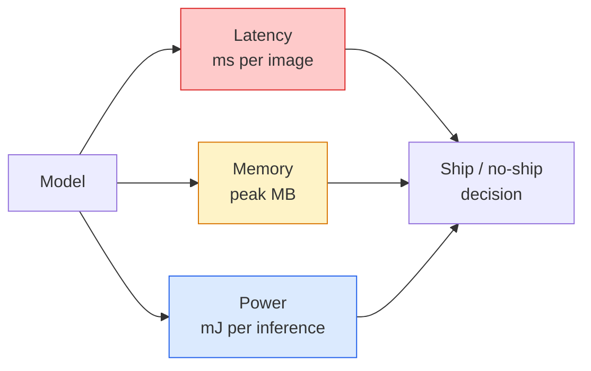

# Vue en temps réel  Déploiement de bord

> L'inférence de bord est la discipline consistant à faire fonctionner un modèle de 90 degrés de précision à 30 fps sur un appareil avec 2 Go de RAM.

**Type:** Learn + Build
**Languages:** Python
**Prerequisites:** Phase 4 Lesson 04 (Image Classification), Phase 10 Lesson 11 (Quantization)
**Time:** ~75 minutes

## Objectifs d'apprentissage

- Mesurer la latence d'inférence, la mémoire maximale et le débit pour tout modèle PyTorch, et lire les FLOPs / paramètres / compromis de latence
- Quantiser un modèle de vision à l'INT8 en utilisant la quantification post-entraînement de PyTorch et vérifier la perte de précision < 1%
- Exporter à ONNX et compiler avec ONNX Runtime ou TensorRT; nommer les trois défaillances d'exportation les plus courantes et leurs corrections
- Expliquer quand choisir MobileNetV3, EfficientNet-Lite, ConvNeXt-Tiny ou MobileViT pour une restriction de bord

## Le problème

Un modèle de vision en temps d'entraînement est un monstre à point flottant. 100M de paramètres, 10 GFLOPs par passe avant, 2 GB de VRAM. Aucun de ces éléments ne convient à un téléphone, à une unité d'info-entretenement d'une voiture, à une caméra industrielle ou à un drone.

Trois boutons font la plupart du travail: le choix du modèle (une architecture plus petite avec la même recette), la quantification (INT8 au lieu de FP32) et le temps d'exécution des inferences (ONNX Runtime, TensorRT, Core ML, TFLite).

Cette leçon met en place la discipline de mesure en premier lieu (on ne peut pas optimiser ce qu'on ne peut pas mesurer), puis marche sur les trois boutons.

## Le concept

### Les trois budgets



- **Latency**La moyenne de seulement p50 cache le comportement de la queue qui compte pour les systèmes en temps réel.
- **Peak memory**Le nombre de détecteurs de données est le maximum que le dispositif peut voir, pas la moyenne en état d'arrêt.
- **Power / energy**Le nombre de périphériques de traitement de la CPU/GPU est souvent calculé par temps d'utilisation.

Une table de (modèle, latence, mémoire, précision) est ce à partir duquel une décision de bord est prise.

### Discipline de mesure

Trois règles que chaque profil de bord doit suivre:

1. **Warm up**Le modèle avec 5 à 10 dépassages avant la mesure.
2. **Synchronise**Charges de travail de GPU avec `torch.cuda.synchronize()`Sans cela, vous mesurez le déploiement du noyau, pas l'exécution du noyau.
3. **Fix input sizes**La latence sur 224x224 n'est pas la latence sur 512x512.

### Les FLOPs en tant que délégué

Les FLOPs (opérations de points flottants par inférence) sont un proxy bon marché, indépendant des appareils pour la latence. Utilisé pour la comparaison d'architecture, trompeur comme une horloge murale absolue. Un modèle avec 10% de plus de FLOPs peut être 2 fois plus rapide en pratique car il utilise des options conviviales avec le matériel (des convs en profondeur compilent bien, les grands convs 7x7 ne le font pas).

Règle: utiliser les FLOP pour la recherche d'architecture, utiliser la latence sur l'appareil pour les décisions de déploiement.

### Quantification dans un paragraphe

Remplacez les poids et les activations de FP32 par INT8. La taille du modèle diminue de 4 fois, la bande passante de la mémoire diminue de 4 fois, le calcul diminue de 2 à 4 fois sur le matériel qui a des noyaux INT8 (tous les SoC mobiles modernes, tous les GPU NVIDIA avec des cores tensors).

Les types:

- **Dynamic** poids quantique à INT8, activations calculées en FP.
- **Static (post-training)** Poids quantique + activation de calibration sur un petit ensemble de calibration.
- **Quantisation-aware training (QAT)** simuler la quantification pendant la formation afin que le modèle apprenne autour de lui.

Pour la vision, la quantification statique post-entraînement donne 95% des avantages avec 5% de l'effort.

### Élagage et distillation

- **Pruning** supprimer des poids non importants (à partir de la taille) ou des canaux (structurés).
- **Distillation** former un petit élève à imiter les logites d'un grand professeur.

### Les délais de fonctionnement des déductions

- **PyTorch eager** lent, pas pour déploiement.
- **TorchScript** héritage. Supplémenté par `torch.compile`et l'exportation de ONNX.
- **ONNX Runtime**Le CPU, CUDA, CoreML, TensorRT, OpenVINO ont tous des fournisseurs ONNX.
- **TensorRT** Compileur de NVIDIA. La meilleure latence sur les GPU NVIDIA (station de travail et Jetson). Intégre avec ONNX Runtime ou standalone.
- **Core ML** Temps d'exécution d'Apple pour iOS/macOS.`.mlmodel`ou `.mlpackage`- Je suis désolé .
- **TFLite** Temps d'exécution de Google pour Android/ARM.`.tflite`- Je suis désolé .
- **OpenVINO** Temps d'exécution de l'Intel pour le processeur/VPU.`.xml`+ `.bin`- Je suis désolé .

Dans la pratique: export PyTorch -> ONNX -> choisir le temps de fonctionnement de la cible.

### Prise en charge de l'architecture de bord

| Budget | Model | Why |
|--------|-------|-----|
| < 3M params | MobileNetV3-Small | Compiles everywhere, good baseline |
| 3-10M | EfficientNet-Lite-B0 | Best accuracy per param on TFLite |
| 10-20M | ConvNeXt-Tiny | Best accuracy-per-param, CPU-friendly |
| 20-30M | MobileViT-S or EfficientViT | Transformer with ImageNet accuracy |
| 30-80M | Swin-V2-Tiny | If stack supports window attention |

Quantisez tous ces éléments à l'INT8 à moins d'avoir une raison spécifique de ne pas le faire.

```figure
cnn-param-count
```

## Faites-le

### Étape 1: Mesurer correctement la latence

```python
import time
import torch

def measure_latency(model, input_shape, device="cpu", warmup=10, iters=50):
    model = model.to(device).eval()
    x = torch.randn(input_shape, device=device)
    with torch.no_grad():
        for _ in range(warmup):
            model(x)
        if device == "cuda":
            torch.cuda.synchronize()
        times = []
        for _ in range(iters):
            if device == "cuda":
                torch.cuda.synchronize()
            t0 = time.perf_counter()
            model(x)
            if device == "cuda":
                torch.cuda.synchronize()
            times.append((time.perf_counter() - t0) * 1000)
    times.sort()
    return {
        "p50_ms": times[len(times) // 2],
        "p95_ms": times[int(len(times) * 0.95)],
        "p99_ms": times[int(len(times) * 0.99)],
        "mean_ms": sum(times) / len(times),
    }
```

Réchauffement, synchronisation, utilisation `time.perf_counter()`- Rapporte des percentiles, pas seulement des médiums.

### Étape 2: Counts de paramètres et de FLOP

```python
def parameter_count(model):
    return sum(p.numel() for p in model.parameters())

def flops_estimate(model, input_shape):
    """
    Rough FLOP count for a conv/linear-only model. For production use `fvcore` or `ptflops`.
    """
    total = 0
    def conv_hook(m, inp, out):
        nonlocal total
        c_out, c_in, kh, kw = m.weight.shape
        h, w = out.shape[-2:]
        total += 2 * c_in * c_out * kh * kw * h * w
    def linear_hook(m, inp, out):
        nonlocal total
        total += 2 * m.in_features * m.out_features
    hooks = []
    for m in model.modules():
        if isinstance(m, torch.nn.Conv2d):
            hooks.append(m.register_forward_hook(conv_hook))
        elif isinstance(m, torch.nn.Linear):
            hooks.append(m.register_forward_hook(linear_hook))
    model.eval()
    with torch.no_grad():
        model(torch.randn(input_shape))
    for h in hooks:
        h.remove()
    return total
```

Pour des projets réels `fvcore.nn.FlopCountAnalysis`ou `ptflops`; ils gèrent correctement chaque type de module.

### Étape 3: Quantification statique après l'entraînement

```python
def quantise_ptq(model, calibration_loader, backend="x86"):
    import torch.ao.quantization as tq
    model = model.eval().cpu()
    model.qconfig = tq.get_default_qconfig(backend)
    tq.prepare(model, inplace=True)
    with torch.no_grad():
        for x, _ in calibration_loader:
            model(x)
    tq.convert(model, inplace=True)
    return model
```

Trois étapes: configurer, préparer (insérer des observateurs), calibrer avec des données réelles, convertir (fuse + quantize).`Conv -> BN -> ReLU`- Je suis là.`ConvBnReLU`), qui `torch.ao.quantization.fuse_modules`Les poignées.

### Étape 4: Exporter à ONNX

```python
def export_onnx(model, sample_input, path="model.onnx"):
    model = model.eval()
    torch.onnx.export(
        model,
        sample_input,
        path,
        input_names=["input"],
        output_names=["output"],
        dynamic_axes={"input": {0: "batch"}, "output": {0: "batch"}},
        opset_version=17,
    )
    return path
```

`opset_version=17`est le défaut de sécurité en 2026. `dynamic_axes`vous permet d'exécuter le modèle ONNX avec une taille de lot arbitraire.

### Étape 5: Indiquer et comparer les régimes

```python
import torch.nn as nn
from torchvision.models import mobilenet_v3_small

def compare_regimes():
    model = mobilenet_v3_small(weights=None, num_classes=10)
    params = parameter_count(model)
    flops = flops_estimate(model, (1, 3, 224, 224))
    lat_fp32 = measure_latency(model, (1, 3, 224, 224), device="cpu")
    print(f"FP32 MobileNetV3-Small: {params:,} params  {flops/1e9:.2f} GFLOPs  "
          f"p50={lat_fp32['p50_ms']:.2f}ms  p95={lat_fp32['p95_ms']:.2f}ms")
```

Exécutez la même fonction pour `resnet50`- Je suis là .`efficientnet_v2_s`, et `convnext_tiny`et vous avez la table de comparaison dont vous avez besoin pour une décision de déploiement.

## Utilisez-le

Les piles de production convergent sur l'une des trois voies suivantes:

- **Web / serverless**PyTorch -> ONNX -> ONNX Runtime (fournisseur de CPU ou CUDA).
- **NVIDIA edge (Jetson, GPU server)**La plus grande latence, le plus grand effort d'ingénierie.
- **Mobile**: PyTorch -> ONNX -> Core ML (iOS) ou TFLite (Android).

Pour la mesure, `torch-tb-profiler`- Je suis là .`nvprof`- Je suis là .`nsys`, et les instruments sur macOS donnent des pannes couche par couche. `benchmark_app`(OpenVINO) et `trtexec`(TensorRT) donner des numéros CLI indépendants.

## La faire partir

Cette leçon donne:

- `outputs/prompt-edge-deployment-planner.md` une requête qui choisit la colonne vertébrale, la stratégie de quantification et le temps d'exécution donné à l'appareil cible et à la latence SLA.
- `outputs/skill-latency-profiler.md` une compétence qui écrit un script complet de marquage de latence avec réchauffement, synchronisation, percentiles et suivi de la mémoire.

## Exercices

1. **(Easy)**Mesurer la latence p50 pour `resnet18`- Je suis là .`mobilenet_v3_small`- Je suis là .`efficientnet_v2_s`, et `convnext_tiny`Rapportez la table et identifiez quelle architecture a la meilleure précision par ms.
2. **(Medium)**Appliquer une quantification statique post-entraînement à `mobilenet_v3_small`. Rapporte la perte de latence et de précision FP32 vs INT8 sur un sous-ensemble de CIFAR-10 ou similaire détenu.
3. **(Hard)**Export `convnext_tiny`À ONNX, passez-le par là.`onnxruntime`avec le `CPUExecutionProvider`, et comparer la latence à la ligne de base PyTorch enthousiaste. Identifier la première couche où ONNX Runtime est plus rapide et expliquer pourquoi.

## Les termes clés

| Term | What people say | What it actually means |
|------|----------------|----------------------|
| Latency | "How fast" | Time from input to output; p50/p95/p99 percentiles, not mean |
| FLOPs | "Model size" | Floating-point ops per forward pass; rough proxy for compute cost |
| INT8 quantisation | "8-bit" | Replace FP32 weights/activations with 8-bit integers; ~4x smaller, 2-4x faster |
| PTQ | "Post-training quantisation" | Quantise a trained model without retraining; easy, usually enough |
| QAT | "Quantisation-aware training" | Simulate quantisation during training; best accuracy, requires labelled data |
| ONNX | "The neutral format" | Model exchange format supported by every mainstream inference runtime |
| TensorRT | "NVIDIA compiler" | Compiles ONNX into an optimised engine for NVIDIA GPUs |
| Distillation | "Teacher -> student" | Train a small model to mimic a big model's logits; recovers most lost accuracy |

## Pour en savoir plus

- [EfficientNet (Tan & Le, 2019)](https://arxiv.org/abs/1905.11946) Écalement composé pour des architectures efficaces
- [MobileNetV3 (Howard et al., 2019)](https://arxiv.org/abs/1905.02244) architecture mobile-first avec h-swish et squeeze-excite
- [A Practical Guide to TensorRT Optimization (NVIDIA)](https://developer.nvidia.com/blog/accelerating-model-inference-with-tensorrt-tips-and-best-practices-for-pytorch-users/) comment obtenir réellement les chiffres de débit dans le papier
- [ONNX Runtime docs](https://onnxruntime.ai/docs/) quantification, optimisation des graphiques, sélection des fournisseurs
