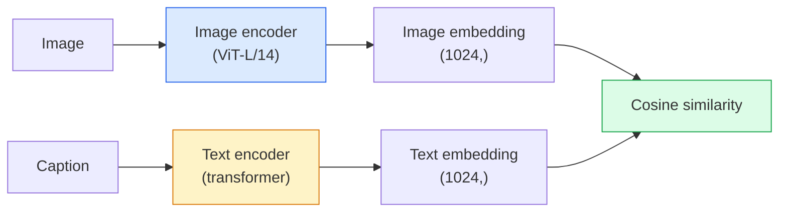

# Vision de vocabulaire ouvert  CLIP

> Traînez un encodeur d'image et un encodeur de texte ensemble pour que les paires correspondantes (image, sous-titre) arrivent au même endroit dans un espace partagé.

**Type:** Build + Use
**Languages:** Python
**Prerequisites:** Phase 4 Lesson 14 (ViT), Phase 4 Lesson 17 (Self-Supervised)
**Time:** ~45 minutes

## Objectifs d'apprentissage

- Expliquer l'architecture de deux tours du CLIP et l'objectif de formation en contraste
- Utiliser un CLIP (ou SigLIP) prétrainé pour la classification à tir zéro sans formation spécifique à la tâche
- Implémenter la classification à zéro tir à partir de zéro: les instructions de classe de codage, calculer la similitude cosine, prendre argmax
- Distinguer les modèles de vision CLIP, SigLIP, OpenCLIP et LLaVA/LLaMA  pour ce que chacun est destiné en 2026

## Le problème

Les classifiants traditionnels sont des vocabulaires fermés: un modèle ImageNet de 1000 classes ne peut prédire que 1000 étiquettes.

CLIP (Radford et coll., OpenAI 2021) a montré que la formation sur 400M (image, sous-titre) paires grattées du web produit un modèle qui peut se classer dans n'importe quel ensemble de catégories à l'inférence, décrit purement en langage naturel.

Cette capacité  transfert à tirage zéro  est la raison pour laquelle chaque système de vision moderne commence avec un point de contrôle de la famille CLIP. La détection (Grounding DINO, OWL-ViT), la segmentation (CLIPSeg, SAM), la récupération, la modération de contenu, les VLM et la génération de texte à image sont tous basés sur des emblèmes communs de style CLIP.

## Le concept

### Deux tours



Les deux encoders se terminent par une projection linéaire vers la même dimension d'embedding (512 pour CLIP-B/32, 1024 pour CLIP-L/14).

### L'objectif

En fonction d'un lot de paires N (image, sous-titre), construisez une matrice de similitude NxN. Traînez les deux encoders de sorte que la diagonale (paires correspondantes) a une grande similitude et les hors-diagonales (non correspondantes) ont une faible similitude.

```
sim_matrix = image_embeddings @ text_embeddings.T / tau

loss_i2t = cross_entropy(sim_matrix,       targets=arange(N))
loss_t2i = cross_entropy(sim_matrix.T,     targets=arange(N))
loss = (loss_i2t + loss_t2i) / 2
```

Symétrique car la récupération d'image à texte et de texte à image devraient fonctionner. `tau`(température) est généralement appris comme paramètre scalaire, initialisé à 0,07.

### Siglip: une meilleure perte

SigLIP (Zhai et coll., 2023) a remplacé le softmax par le sigmoïde par paire:

```
loss = mean over pairs of log(1 + exp(-y_ij * sim_ij))
y_ij = +1 if matching, -1 otherwise
```

La perte par paire supprime la normalisation au niveau des lots requise par CLIP. SigLIP entraîne mieux les petits lots et correspond ou dépasse CLIP aux données égales.

### Classification à tir zéro

En raison d'un CLIP formé:

1. Pour chaque classe, composez une demande: "une photo d'une classe".
2. Encodez toutes les requêtes de classe avec le codeur de texte -> `T`forme (C, d).
3. Encodez l'image de test -> `I`forme (1, d).
4. La similitude = `I @ T.T`forme (1, C).
5. Argmax -> classe prévue.

Des questions d'ingénierie rapides. OpenAI a publié 80 modèles de rapides pour ImageNet ("une photo d'un {}", "une photo floue d'un {}", "un croquis d'un {}", ...).

### Lorsque des modèles CLIP sont utilisés en 2026

- **Zero-shot classification** utilisation directe.
- **Image retrieval** encoder toutes les images une fois, intégrer la requête à l'inférence.
- **Text-conditioned detection** Le DINO, OWL-ViT, enveloppent une tour de texte CLIP autour d'un détecteur.
- **Text-conditioned segmentation** CLIPSeg; SAM utilise des entrées de texte-imprimé via CLIP.
- **VLMs** LLaVA, Qwen-VL, InternVL câblent un encodeur de vision de la famille CLIP dans un LLM.
- **Text-to-image gen** Diffusion stable, condition DALL-E 3 sur les intégrations de texte CLIP.

Une fois que vous avez un espace d'intégration partagé, chaque tâche de vision + langage devient un calcul de distance.

```figure
clip-contrastive
```

## Faites-le

### Étape 1: Un petit modèle à deux tours

Pour cette leçon, les tours sont de petits MLP sur les fonctionnalités pré-extraites afin que le signal d'entraînement soit visible sur le processeur.

```python
import torch
import torch.nn as nn
import torch.nn.functional as F


class TwoTower(nn.Module):
    def __init__(self, img_in=128, txt_in=64, emb=64):
        super().__init__()
        self.image_proj = nn.Sequential(nn.Linear(img_in, 128), nn.ReLU(), nn.Linear(128, emb))
        self.text_proj = nn.Sequential(nn.Linear(txt_in, 128), nn.ReLU(), nn.Linear(128, emb))
        self.logit_scale = nn.Parameter(torch.ones([]) * 2.6592)  # ln(1/0.07)

    def forward(self, img_feats, txt_feats):
        i = F.normalize(self.image_proj(img_feats), dim=-1)
        t = F.normalize(self.text_proj(txt_feats), dim=-1)
        return i, t, self.logit_scale.exp()
```

Deux projections, une sortie partagée, une température apprise, la même forme que la vraie API CLIP.

### Étape 2: Perte de contraste

```python
def clip_loss(image_emb, text_emb, logit_scale):
    N = image_emb.size(0)
    sim = logit_scale * image_emb @ text_emb.T
    targets = torch.arange(N, device=sim.device)
    l_i = F.cross_entropy(sim, targets)
    l_t = F.cross_entropy(sim.T, targets)
    return (l_i + l_t) / 2
```

Symétrique. plus haut logit_scale = plus fort softmax = plus confiant mais risque d'instabilité.

### Étape 3: Classificateur de tir zéro

```python
@torch.no_grad()
def zero_shot_classify(model, image_feats, class_text_feats, class_names):
    """
    image_feats:      (N, img_in)
    class_text_feats: (C, txt_in)   one averaged embedding per class
    """
    i = F.normalize(model.image_proj(image_feats), dim=-1)
    t = F.normalize(model.text_proj(class_text_feats), dim=-1)
    sim = i @ t.T
    pred = sim.argmax(dim=-1)
    return [class_names[p] for p in pred.tolist()]
```

C'est la procédure exacte utilisée avec un point de contrôle CLIP de production.

### Étape 4: Vérifiez votre état de santé mentale

```python
torch.manual_seed(0)
model = TwoTower()

img = torch.randn(8, 128)
txt = torch.randn(8, 64)
i, t, scale = model(img, txt)
loss = clip_loss(i, t, scale)
print(f"batch size: {i.size(0)}   loss: {loss.item():.3f}")
```

Les pertes devraient être proches de `log(N) = log(8) = 2.08`pour un modèle initialement aléatoire  la cible de l'entropie croisée symétrique lorsqu'aucune structure n'est encore apprise.

## Utilisez-le

OpenCLIP est la norme par défaut de la communauté en 2026:

```python
import open_clip
import torch
from PIL import Image

model, _, preprocess = open_clip.create_model_and_transforms("ViT-B-32", pretrained="laion2b_s34b_b79k")
tokenizer = open_clip.get_tokenizer("ViT-B-32")

image = preprocess(Image.open("dog.jpg")).unsqueeze(0)
text = tokenizer(["a photo of a dog", "a photo of a cat", "a photo of a car"])

with torch.no_grad():
    image_features = model.encode_image(image)
    text_features = model.encode_text(text)
    image_features = image_features / image_features.norm(dim=-1, keepdim=True)
    text_features = text_features / text_features.norm(dim=-1, keepdim=True)
    probs = (100.0 * image_features @ text_features.T).softmax(dim=-1)

print(probs)
```

SigLIP est plus récent, entraîne mieux à petite échelle et est préférable pour les nouveaux travaux: `google/siglip-base-patch16-224`- Ils s'embrassent tous les deux.

## La faire partir

Cette leçon donne:

- `outputs/prompt-zero-shot-class-picker.md` une requête qui conçoit des modèles de classe pour CLIP à tirage zéro donné une liste de classes et un domaine.
- `outputs/skill-image-text-retriever.md` une compétence qui crée un index d'intégration d'image avec n'importe quel point de contrôle CLIP, prend en charge la requête par texte et la requête par image.

## Exercices

1. **(Easy)**Utilisez un OpenCLIP ViT-B/32 prétrainé et effectuez une classification à tir zéro sur CIFAR-10 avec le jeu de prompts de modèle 80.
2. **(Medium)**Comparer un modèle unique ("une photo d'un {}") par rapport à 80 modèles en moyenne incrustations sur la même tâche CIFAR-10.
3. **(Hard)**Construisez un indice de récupération d'images à tirage nul: incruster 1000 images avec CLIP, construire un indice FAISS, requête avec une description en langage naturel. Rapportez récupération recall@5 pour 20 requêtes retenues que vous écrivez à la main.

## Les termes clés

| Term | What people say | What it actually means |
|------|----------------|----------------------|
| Two-tower | "Dual encoder" | Separate image and text encoders ending in a shared-dim projection head |
| Zero-shot | "No task-specific training" | Classify into classes described only by text at inference; no labels touched |
| Temperature / logit_scale | "tau" | Learned scalar that scales the similarity matrix before softmax |
| Prompt template | "A photo of a {}" | Natural-language wrapper around class names; averaging many templates boosts zero-shot accuracy |
| CLIP | "Image+text model" | The 2021 OpenAI model; vocabulary of the field in 2026 |
| SigLIP | "Sigmoid CLIP" | Swaps softmax for per-pair sigmoid; trains better at small batches |
| OpenCLIP | "Open reproduction" | Community-trained CLIP variants on LAION; production default for open-source pipelines |
| VLM | "Vision-language model" | A CLIP-family encoder plus an LLM, trained to answer questions about images |

## Pour en savoir plus

- [CLIP: Learning Transferable Visual Models from Natural Language Supervision (Radford et al., 2021)](https://arxiv.org/abs/2103.00020)
- [SigLIP: Sigmoid Loss for Language-Image Pre-Training (Zhai et al., 2023)](https://arxiv.org/abs/2303.15343)
- [OpenCLIP](https://github.com/mlfoundations/open_clip) la base de code communautaire
- [DINOv2 vs CLIP vs MAE: a features comparison](https://huggingface.co/blog/dinov2) Guide de la FH avec cas d'utilisation côte à côte
