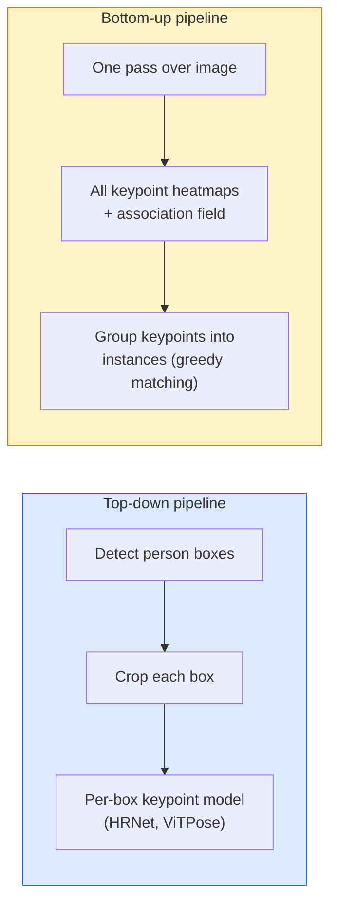

# Détection et estimation de la pose des points clés

> Une pose est un ensemble de points clés ordonnés, un détecteur de points clés est un régresseur de la carte thermique, tout le reste est la comptabilité.

**Type:** Build
**Languages:** Python
**Prerequisites:** Phase 4 Lesson 06 (Detection), Phase 4 Lesson 07 (U-Net)
**Time:** ~45 minutes

## Objectifs d'apprentissage

- Distinguer les estimations de la pose en bas vers le bas et en haut et indiquer le moment de chaque utilisation
- Carte de chaleur de régression pour les points clés K avec une cible Gaussian-per-point-clés et extraire les coordonnées des points clés à l'inférence
- Expliquer les champs d'affinité de partie (PAF) et comment les pipelines bas vers le haut associent les points clés en instances
- Utilisez MediaPipe Pose ou MMPose pour l'estimation des points clés de production et comprenez leur format de sortie

## Le problème

Les tâches clés se cachent sous de nombreux noms: pose humaine (17 articulations corporelles), repères faciaux (68 ou 478 points), main (21 points), pose animale, pose d'objet robotique, repères d'anatomie médicale. Chacune d'elles partage la même structure: détecter les points distincts K sur un objet et extraire leurs coordonnées (x, y).

L'estimation de la pose est la base de la capture de mouvement, des applications de fitness, de l'analyse sportive, du contrôle des gestes, de l'animation, de l'essai AR et de la prise en main robotique.

La question de l'ingénierie est l'échelle. Une pose d'une seule image, une seule personne est un problème de 20 ms. La pose de plusieurs personnes dans une foule à 30 fps est un problème différent avec différentes architectures.

## Le concept

### En bas vers le bas



- **Top-down** détecter d'abord les personnes, puis exécuter un modèle de point clé par personne sur chaque culture.
- **Bottom-up** un passage avant prédit tous les points clés plus un champ d'association; les regrouper.

Le haut vers le bas (HRNet, ViTPose) est le leader de la précision; le bas vers le haut (OpenPose, HigherHRNet) est le leader du débit pour les scènes bondées.

### Régression de la carte thermique

Au lieu de régresser `(x, y)`directement, prédire une`H x W`carte thermique par point clé avec une tache gaussienne centrée sur l'emplacement réel.

```
target[k, y, x] = exp(-((x - cx_k)^2 + (y - cy_k)^2) / (2 sigma^2))
```

À l'inférence, l'argmax de chaque carte thermique est l'emplacement prévisible du point clé.

Pourquoi les cartes thermiques fonctionnent mieux que la régression directe: la structure spatiale du réseau (carte de fonctionnalités conv) s'aligne naturellement avec la sortie spatiale.

### Localisation sous-pixel

Argmax donne des coordonnées entières. Pour une précision sous-pixel, affiner en fixant une parabole à l'argmax et à ses voisins, ou utiliser le bien connu offset `(dx, dy) = 0.25 * (heatmap[y, x+1] - heatmap[y, x-1], ...)`- Dans quelle direction ?

### Les champs d'affinité de partie (PAF)

Pour chaque paire de points clés connectés (par exemple, épaule gauche à coude gauche), prédire un champ à 2 canaux qui encode le vecteur unitaire pointant de l'un à l'autre. Pour associer une épaule à son coude, intégrer le PAF le long de la ligne reliant les paires candidates; la paire avec l'intégrale la plus élevée est correspondue.

```
For each connection (limb):
  PAF channels: 2 (unit vector x, y)
  Line integral: sum over sample points of (PAF . line_direction)
  Higher integral = stronger match
```

Elegante et à l'échelle de la foule arbitraire sans cultures par personne.

### Points clés COCO

L'ensemble de données standard de pose de corps: 17 points clés par personne, PCK (Procès de points clés corrects) et OKS (Similarité de point clés objet) comme mesures. OKS est l'analogue de point clé de IoU et est ce que COCO mAP@OKS rapporte.

### 2D contre 3D

- **2D pose** coordonnées d'image; résolues à la qualité de production (MediaPipe, HRNet, ViTPose).
- **3D pose** coordonnées monde/caméra; recherche toujours active.
  - Levez les prédictions 2D à 3D avec un petit MLP (VideoPose3D).
  - Regression directe 3D à partir d'image (PyMAF, MHFormer).
  - Configuration multi-vue (CMU Panoptic) pour la vérité au sol.

```figure
cv3-pose-heatmap
```

## Faites-le

### Étape 1: cible de la carte thermique gaussienne

```python
import numpy as np
import torch

def gaussian_heatmap(size, cx, cy, sigma=2.0):
    yy, xx = np.meshgrid(np.arange(size), np.arange(size), indexing="ij")
    return np.exp(-((xx - cx) ** 2 + (yy - cy) ** 2) / (2 * sigma ** 2)).astype(np.float32)

hm = gaussian_heatmap(64, 32, 32, sigma=2.0)
print(f"peak: {hm.max():.3f} at ({hm.argmax() % 64}, {hm.argmax() // 64})")
```

Les cartes thermiques par point clé empilées le long d'un axe de canal donnent le tensor cible complet.

### Étape 2: Petite tête de touche

Un modèle de style U-Net qui sort des canaux de carte thermique K.

```python
import torch.nn as nn
import torch.nn.functional as F

class TinyKeypointNet(nn.Module):
    def __init__(self, num_keypoints=4, base=16):
        super().__init__()
        self.down1 = nn.Sequential(nn.Conv2d(3, base, 3, 2, 1), nn.ReLU(inplace=True))
        self.down2 = nn.Sequential(nn.Conv2d(base, base * 2, 3, 2, 1), nn.ReLU(inplace=True))
        self.mid = nn.Sequential(nn.Conv2d(base * 2, base * 2, 3, 1, 1), nn.ReLU(inplace=True))
        self.up1 = nn.ConvTranspose2d(base * 2, base, 2, 2)
        self.up2 = nn.ConvTranspose2d(base, num_keypoints, 2, 2)

    def forward(self, x):
        h1 = self.down1(x)
        h2 = self.down2(h1)
        h3 = self.mid(h2)
        u1 = self.up1(h3)
        return self.up2(u1)
```

Enregistrement`(N, 3, H, W)`, la production `(N, K, H, W)`La perte est MSE par pixel contre les cibles Gaussiennes.

### Étape 3: Inference  extraire les coordonnées des points clés

```python
def heatmap_to_coords(heatmaps):
    """
    heatmaps: (N, K, H, W)
    returns:  (N, K, 2) float coordinates in image pixels
    """
    N, K, H, W = heatmaps.shape
    hm = heatmaps.reshape(N, K, -1)
    idx = hm.argmax(dim=-1)
    ys = (idx // W).float()
    xs = (idx % W).float()
    return torch.stack([xs, ys], dim=-1)

coords = heatmap_to_coords(torch.randn(2, 4, 32, 32))
print(f"coords: {coords.shape}")  # (2, 4, 2)
```

Pour le raffinement sous-pixel, interpliez autour de l'argmax.

### Étape 4: Ensemble de données synthétique de points clés

Simple: dessinez quatre points sur une toile blanche et apprenez à les prédire.

```python
def make_synthetic_sample(size=64):
    img = np.ones((3, size, size), dtype=np.float32)
    rng = np.random.default_rng()
    kps = rng.integers(8, size - 8, size=(4, 2))
    for cx, cy in kps:
        img[:, cy - 2:cy + 2, cx - 2:cx + 2] = 0.0
    hms = np.stack([gaussian_heatmap(size, cx, cy) for cx, cy in kps])
    return img, hms, kps
```

C'est assez facile pour un petit modèle à apprendre en une minute.

### Étape 5: Formation

```python
model = TinyKeypointNet(num_keypoints=4)
opt = torch.optim.Adam(model.parameters(), lr=3e-3)

for step in range(200):
    batch = [make_synthetic_sample() for _ in range(16)]
    imgs = torch.from_numpy(np.stack([b[0] for b in batch]))
    hms = torch.from_numpy(np.stack([b[1] for b in batch]))
    pred = model(imgs)
    # Upsample pred to full resolution
    pred = F.interpolate(pred, size=hms.shape[-2:], mode="bilinear", align_corners=False)
    loss = F.mse_loss(pred, hms)
    opt.zero_grad(); loss.backward(); opt.step()
```

## Utilisez-le

- **MediaPipe Pose** L'estimatrice de pose de production de Google; envoie des temps d'exécution mobiles WebGL + avec une latence inférieure à 10 ms.
- **MMPose**(OpenMMLab)  base de code de recherche complète; chaque architecture SOTA avec des poids prétraînés.
- **YOLOv8-pose** la pose multi-personne la plus rapide en temps réel avec un seul passe avant.
- **transformers HumanDPT / PoseAnything** des approches plus récentes du langage de vision pour la pose du vocabulaire ouvert (tout objet, tout ensemble de points clés).

## La faire partir

Cette leçon donne:

- `outputs/prompt-pose-stack-picker.md` une requête qui choisit MediaPipe / YOLOv8-pose / HRNet / ViTPose compte tenu de la latence, de la taille de la foule et du besoin 2D vs 3D.
- `outputs/skill-heatmap-to-coords.md` une compétence qui écrit la routine de la carte thermique de sous-pixel à la coordonnée utilisée par chaque modèle de pose de production.

## Exercices

1. **(Easy)**Exercez le modèle de point clé minuscule sur l'ensemble de données synthétique de 4 points.
2. **(Medium)**Ajouter un raffinement sous-pixel: étant donné la position argmax, ajoutez une parabole 1D le long des pixels voisins x et y. Rapportez le gain de précision par rapport à l'ensemble argmax.
3. **(Hard)**Construisez un ensemble de données synthétiques de 2 personnes où chaque image montre deux instances du modèle de 4 points clés. Traînez un pipeline de bas en haut avec des PAF qui prédisent quel point clé appartient à quelle instance, et évaluez OKS.

## Les termes clés

| Term | What people say | What it actually means |
|------|----------------|----------------------|
| Keypoint | "A landmark" | A specific ordered point on an object (joint, corner, feature) |
| Pose | "The skeleton" | An ordered set of keypoints belonging to one instance |
| Top-down | "Detect then pose" | Two-stage pipeline: person detector + per-crop keypoint model; highest accuracy |
| Bottom-up | "Pose first, group later" | Single-pass all-keypoint prediction + grouping; constant time in crowd size |
| Heatmap | "Gaussian target" | H x W tensor per keypoint with peak at the true location; the preferred regression target |
| PAF | "Part Affinity Field" | 2-channel unit vector field encoding limb directions; used to group keypoints into instances |
| OKS | "Keypoint IoU" | Object Keypoint Similarity; the COCO metric for pose |
| HRNet | "High-Resolution Net" | The dominant top-down keypoint architecture; preserves high-res features throughout |

## Pour en savoir plus

- [OpenPose (Cao et al., 2017)](https://arxiv.org/abs/1812.08008) bas vers le haut avec les PAF; toujours la meilleure rédaction de l'approche
- [HRNet (Sun et al., 2019)](https://arxiv.org/abs/1902.09212) l'architecture de référence de haut en bas
- [ViTPose (Xu et al., 2022)](https://arxiv.org/abs/2204.12484) ViT simple comme colonne vertébrale de pose; SOTA actuel sur de nombreux points de référence
- [MediaPipe Pose](https://developers.google.com/mediapipe/solutions/vision/pose_landmarker) pose de production en temps réel; la pile la plus rapide déployée en 2026
