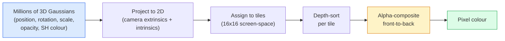

# 3D Gaussian Splatting à partir de zéro

> Une scène est un nuage de millions de Gaussiens 3D. Chacun a une position, une orientation, une échelle, une opacité et une couleur qui dépendent de la direction de vision.

**Type:** Build
**Languages:** Python
**Prerequisites:** Phase 4 Lesson 13 (3D Vision & NeRF), Phase 1 Lesson 12 (Tensor Operations), Phase 4 Lesson 10 (Diffusion basics optional)
**Time:** ~90 minutes

## Objectifs d'apprentissage

- Expliquez pourquoi le 3D Gaussian Splatting a remplacé le NeRF en tant que produit par défaut pour la reconstruction 3D photoréaliste en 2026
- Indiquez les six paramètres gaussiens (position, quaternion de rotation, échelle, opacité, couleur des harmoniques sphériques, caractéristique facultative) et le nombre de flottes contribuant chacune.
- Implémenter un rasterizer de splating Gaussian 2D à partir de zéro en utilisant `alpha`compositing, puis montrer comment le cas 3D projette à la même boucle
- Utilisation `nerfstudio`- Je suis là .`gsplat`ou `SuperSplat`pour reconstruire une scène à partir de 20 à 50 photos et exporter à la `KHR_gaussian_splatting`glTF ou l'OpenUSD 26.03 `UsdVolParticleField3DGaussianSplat`schéma

## Le problème

Un NeRF stocke une scène comme les poids d'une MLP. Chaque pixel rendu est des centaines de requêtes MLP le long d'un rayon.

Le 3D Gaussian Splatting (Kerbl, Kopanas, Leimkühler, Drettakis, SIGGRAPH 2023) a remplacé tout cela. Une scène est un ensemble explicite de Gaussiens 3D. Le rendu est une grattage de GPU à plus de 100 images par seconde. L'entraînement prend quelques minutes. L'édition est directe: traduire un sous-ensemble de Gaussiens et vous avez déplacé la chaise. En 2026, le groupe Khronos a ratifié une extension glTF pour les splats gaussiens, OpenUSD 26.03 envoie un schéma de splat gaussiens, Zillow et Apartments.com rendent l'immobilier avec eux, et la plupart des nouveaux documents de recherche sur la reconstruction 3D sont des variantes de l'idée de base 3DGS.

Le modèle mental est simple, la mathématique a suffisamment de parties mobiles que la plupart des introductions commencent par la rasterisation et sautent au-delà des projections et des harmoniques sphériques.

## Le concept

### Ce qu'un Gaussien porte

Un Gaussien 3D est une tache paramétrique dans l'espace avec ces attributs:

```
position         mu         (3,)    centre in world coordinates
rotation         q          (4,)    unit quaternion encoding orientation
scale            s          (3,)    log-scales per axis (exponentiated at render time)
opacity          alpha      (1,)    post-sigmoid opacity [0, 1]
SH coefficients  c_lm       (3 * (L+1)^2,)   view-dependent colour
```

La rotation + l'échelle construisent une covariance 3x3: `Sigma = R S S^T R^T`. C'est la forme du gaussien en 3D. Les harmoniques sphériques permettent de changer de couleur avec la direction de vision  les points forts speculaires, le brillant subtil, la lumière dépendante de la vue  sans stocker les textures par vue. Avec SH degré 3 vous obtenez 16 coefficients par canal de couleur, 48 flottes par gaussien pour la couleur seule.

Une scène a généralement 1-5 millions de Gaussiens. Chacun stocke environ 60 flottes (3 + 4 + 3 + 1 + 48 + misc). C'est 240 MB pour une scène Gaussienne de cinq millions de points  beaucoup plus petit que le nuage de point équivalent avec texture par point, et un ordre de magnitude plus petit que les poids MLP d'une NeRF ré-renderé à haute résolution.

### Rastérisation, non rayée



Cinq étapes, tout GPU-friendly, aucune requête MLP par pixel, un seul RTX 3080 Ti rend 6 millions de splats à 147 images par seconde.

### L'étape de projection

Le Gaussien 3D en position mondiale .`mu`avec une covariance 3D `Sigma`projet à un Gaussian 2D à la position de l'écran `mu'`avec une covariance 2D `Sigma'`- Le numéro de la liste:

```
mu' = project(mu)
Sigma' = J W Sigma W^T J^T          (2 x 2)

W = viewing transform (rotation + translation of camera)
J = Jacobian of the perspective projection at mu'
```

L'empreinte Gaussienne 2D est une ellipse dont les axes sont les propres vecteurs de `Sigma'`Chaque pixel à l'intérieur de cette ellipse reçoit la contribution de Gauss, pondérée par`exp(-0.5 * (p - mu')^T Sigma'^-1 (p - mu'))`- Je suis désolé .

### La règle de composition alpha

Pour un pixel, les gaussiens qui le couvrent sont triés face à face (ou équivalemment face à face avec la formule inversée).

```
C_pixel = sum_i alpha_i * T_i * c_i

T_i = prod_{j < i} (1 - alpha_j)       transmittance up to i
alpha_i = opacity_i * exp(-0.5 * d^T Sigma'^-1 d)   local contribution
c_i = eval_SH(SH_i, view_direction)    view-dependent colour
```

C' est ça .**the same equation as NeRF's volumetric render**C'est pourquoi les résultats de qualité rendus correspondent à NeRF  les deux intégrent la même équation de champ de rayonnement.

### Pourquoi est-ce différenciable

Chaque étape  projection, assignation de carreaux, composition alpha, évaluation SH  est différenciable par rapport aux paramètres gaussiens.`(mu, q, s, alpha, c_lm)`Plus de 30 000 itérations, les Gaussiens trouvent leur position, leur échelle et leurs couleurs.

### Densation et taille

Un ensemble fixe de Gaussiens ne peut pas couvrir une scène complexe.

- **Clone**Un Gaussien à sa position actuelle lorsque sa magnitude de gradient est élevée mais son échelle est petite  la reconstruction a besoin de plus de détails ici.
- **Split**un gaussien à grande échelle en deux plus petits lorsque son gradient est élevé  un gaussien grand est trop lisse pour s'adapter à la région.
- **Prune**Les gaussiens dont l'opacité tombe en dessous d'un seuil ne contribuent pas.

La densité est effectuée à chaque N d'itérations. Une scène passe généralement de 100 000 Gaussiens initiaux (semblés à partir de points SfM) à 1-5 M à la fin de la formation.

### Harmonie sphérique dans un paragraphe

La couleur dépendante de la vue est une fonction `c(direction)`Les harmoniques sphériques sont la base Fourier de la sphère.`L`et vous obtenez`(L+1)^2`Les valeurs de base sont les valeurs de base de la couleur de la couleur de la couleur de la couleur de la couleur de la couleur de la couleur de la couleur de la couleur de la couleur de la couleur de la couleur de la couleur de la couleur de la couleur de la couleur de la couleur de la couleur de la couleur de la couleur de la couleur de la couleur de la couleur de la couleur de la couleur de la couleur de la couleur de la couleur de la couleur de la couleur de la couleur de la couleur de la couleur de la couleur de la couleur de la couleur de la couleur de la couleur de la couleur de la couleur de la couleur de la couleur de la couleur de la couleur de la couleur de la couleur de la couleur de la couleur de la couleur de la couleur de la couleur de la couleur de la couleur de la couleur de la couleur de la couleur de la couleur de la couleur de la couleur de la couleur de la couleur de la couleur de la couleur de la couleur de la couleur de la couleur de la couleur de la couleur de la couleur de la couleur de la couleur de la couleur de la couleur de la couleur de la couleur de la couleur de la couleur de la couleur de la couleur de la couleur de la couleur de la couleur de la couleur de la couleur de la couleur de la couleur de la couleur de la couleur de la couleur de la couleur de la couleur de la couleur de la couleur de la couleur de la couleur de la couleur de la couleur de la couleur de la couleur de la couleur de la couleur de la couleur de la couleur de la couleur de la couleur de la couleur de la couleur de la couleur de la couleur de la couleur de la couleur de la couleur de la couleur de la couleur de la couleur de la couleur de la couleur de couleur de la couleur de la couleur de la couleur de couleur de la couleur de la couleur de la couleur de

### La pile de production de 2026

```
1. Capture         smartphone / DJI drone / handheld scanner
2. SfM / MVS       COLMAP or GLOMAP derives camera poses + sparse points
3. Train 3DGS      nerfstudio / gsplat / inria official / PostShot (~10-30 min on RTX 4090)
4. Edit            SuperSplat / SplatForge (clean floaters, segment)
5. Export          .ply -> glTF KHR_gaussian_splatting or .usd (OpenUSD 26.03)
6. View            Cesium / Unreal / Babylon.js / Three.js / Vision Pro
```

### Variantes 4D et génératives

- **4D Gaussian Splatting** Les gaussiens sont des fonctions du temps; utilisés pour la vidéo volumétrique (Superman 2026, "Helicopter" d'A$AP Rocky).
- **Generative splats** modèles texte à plat (Marble by World Labs) qui hallucinent des scènes entières.
- **3D Gaussian Unscented Transform** Variante de NVIDIA NuRec pour la simulation de conduite autonome.

```figure
cv3-gaussian-splat
```

## Faites-le

### Étape 1: Un gaussien 2D

On construit d'abord un rasteriser 2D, puis le cas 3D se réduit à lui après la projection.

```python
import torch
import torch.nn as nn
import torch.nn.functional as F


def eval_2d_gaussian(means, covs, points):
    """
    means:  (G, 2)      centres
    covs:   (G, 2, 2)   covariance matrices
    points: (H, W, 2)   pixel coordinates
    returns: (G, H, W)  density at every pixel for every Gaussian
    """
    G = means.size(0)
    H, W, _ = points.shape
    flat = points.view(-1, 2)
    inv = torch.linalg.inv(covs)
    diff = flat[None, :, :] - means[:, None, :]
    d = torch.einsum("gpi,gij,gpj->gp", diff, inv, diff)
    density = torch.exp(-0.5 * d)
    return density.view(G, H, W)
```

`einsum`fait la forme quadratique `diff^T Sigma^-1 diff`pour chaque paire (Gaussian, pixel).

### Étape 2: Rasteriser à éclaboussure en 2D

La profondeur en 2D est sans signification, donc nous utilisons un échelle par Gaussian pour l'ordre.

```python
def rasterise_2d(means, covs, colours, opacities, depths, image_size):
    """
    means:     (G, 2)
    covs:      (G, 2, 2)
    colours:   (G, 3)
    opacities: (G,)     in [0, 1]
    depths:    (G,)     per-Gaussian scalar used for ordering
    image_size: (H, W)
    returns:   (H, W, 3) rendered image
    """
    H, W = image_size
    yy, xx = torch.meshgrid(
        torch.arange(H, dtype=torch.float32, device=means.device),
        torch.arange(W, dtype=torch.float32, device=means.device),
        indexing="ij",
    )
    points = torch.stack([xx, yy], dim=-1)

    densities = eval_2d_gaussian(means, covs, points)
    alphas = opacities[:, None, None] * densities
    alphas = alphas.clamp(0.0, 0.99)

    order = torch.argsort(depths)
    alphas = alphas[order]
    colours_sorted = colours[order]

    T = torch.ones(H, W, device=means.device)
    out = torch.zeros(H, W, 3, device=means.device)
    for i in range(means.size(0)):
        a = alphas[i]
        out += (T * a)[..., None] * colours_sorted[i][None, None, :]
        T = T * (1.0 - a)
    return out
```

Pas rapide  une vraie mise en œuvre utilise des noyaux CUDA à base de carreaux  mais exactement le bon mathématiques et entièrement différenciable.

### Étape 3: Une scène de splat 2D entraînable

```python
class Splats2D(nn.Module):
    def __init__(self, num_splats=128, image_size=64, seed=0):
        super().__init__()
        g = torch.Generator().manual_seed(seed)
        H, W = image_size, image_size
        self.means = nn.Parameter(torch.rand(num_splats, 2, generator=g) * torch.tensor([W, H]))
        self.log_scale = nn.Parameter(torch.ones(num_splats, 2) * math.log(2.0))
        self.rot = nn.Parameter(torch.zeros(num_splats))  # single angle in 2D
        self.colour_logits = nn.Parameter(torch.randn(num_splats, 3, generator=g) * 0.5)
        self.opacity_logit = nn.Parameter(torch.zeros(num_splats))
        self.depth = nn.Parameter(torch.rand(num_splats, generator=g))

    def covs(self):
        s = torch.exp(self.log_scale)
        c, si = torch.cos(self.rot), torch.sin(self.rot)
        R = torch.stack([
            torch.stack([c, -si], dim=-1),
            torch.stack([si, c], dim=-1),
        ], dim=-2)
        S = torch.diag_embed(s ** 2)
        return R @ S @ R.transpose(-1, -2)

    def forward(self, image_size):
        covs = self.covs()
        colours = torch.sigmoid(self.colour_logits)
        opacities = torch.sigmoid(self.opacity_logit)
        return rasterise_2d(self.means, covs, colours, opacities, self.depth, image_size)
```

`log_scale`- Je suis là .`opacity_logit`, et `colour_logits`sont tous des paramètres sans contrainte cartographiés par la bonne activation au moment du rendu.

### Étape 4: Adaptez les Gaussiens 2D à une image cible

```python
import math
import numpy as np

def make_target(size=64):
    yy, xx = np.meshgrid(np.arange(size), np.arange(size), indexing="ij")
    img = np.zeros((size, size, 3), dtype=np.float32)
    # Red circle
    mask = (xx - 20) ** 2 + (yy - 20) ** 2 < 10 ** 2
    img[mask] = [1.0, 0.2, 0.2]
    # Blue square
    mask = (np.abs(xx - 45) < 8) & (np.abs(yy - 40) < 8)
    img[mask] = [0.2, 0.3, 1.0]
    return torch.from_numpy(img)


target = make_target(64)
model = Splats2D(num_splats=64, image_size=64)
opt = torch.optim.Adam(model.parameters(), lr=0.05)

for step in range(200):
    pred = model((64, 64))
    loss = F.mse_loss(pred, target)
    opt.zero_grad(); loss.backward(); opt.step()
    if step % 40 == 0:
        print(f"step {step:3d}  mse {loss.item():.4f}")
```

Plus de 200 étapes, les 64 Gaussiens s'installent dans les deux formes.

### Étape 5: De la 2D à la 3D

L'extension 3D conserve la même boucle.

1. La rotation par Gauss est un quaternion au lieu d'un angle unique.
2. La co-variance est `R S S^T R^T`avec `R`construit à partir du quaternion et `S = diag(exp(log_scale))`- Je suis désolé .
3. La projection `(mu, Sigma) -> (mu', Sigma')`utilise l'extérieur de la caméra et le jacobien de la projection de perspective à `mu`- Je suis désolé .
4. La couleur devient une expansion sphérique-harmonique; l'évaluer dans la direction de la vue.
5. Le tri de profondeur est de l'espace de la caméra z au lieu d'un scalaire appris.

Chaque mise en œuvre de la production (`gsplat`- Je suis là .`inria/gaussian-splatting`- Je suis là .`nerfstudio`) fait exactement cela sur la GPU avec des noyaux CUDA à base de carreaux.

### Étape 6: Évaluation des harmoniques sphériques

La base SH jusqu'au degré 3 a 16 termes par canal.

```python
def eval_sh_degree_3(sh_coeffs, dirs):
    """
    sh_coeffs: (..., 16, 3)   last dim is RGB channels
    dirs:      (..., 3)       unit vectors
    returns:   (..., 3)
    """
    C0 = 0.282094791773878
    C1 = 0.488602511902920
    C2 = [1.092548430592079, 1.092548430592079,
          0.315391565252520, 1.092548430592079,
          0.546274215296039]
    x, y, z = dirs[..., 0], dirs[..., 1], dirs[..., 2]
    x2, y2, z2 = x * x, y * y, z * z
    xy, yz, xz = x * y, y * z, x * z

    result = C0 * sh_coeffs[..., 0, :]
    result = result - C1 * y[..., None] * sh_coeffs[..., 1, :]
    result = result + C1 * z[..., None] * sh_coeffs[..., 2, :]
    result = result - C1 * x[..., None] * sh_coeffs[..., 3, :]

    result = result + C2[0] * xy[..., None] * sh_coeffs[..., 4, :]
    result = result + C2[1] * yz[..., None] * sh_coeffs[..., 5, :]
    result = result + C2[2] * (2.0 * z2 - x2 - y2)[..., None] * sh_coeffs[..., 6, :]
    result = result + C2[3] * xz[..., None] * sh_coeffs[..., 7, :]
    result = result + C2[4] * (x2 - y2)[..., None] * sh_coeffs[..., 8, :]

    # degree 3 terms omitted here for brevity; full 16-coefficient version in the code file
    return result
```

J' ai appris`sh_coeffs`En temps de rendu, vous évaluez contre la direction de vue actuelle et obtenez un RGB à 3 vecteurs.

## Utilisez-le

Pour un vrai travail 3DGS, utilisez `gsplat`(Meta) ou `nerfstudio`- Le numéro de la liste:

```bash
pip install nerfstudio gsplat
ns-download-data example
ns-train splatfacto --data path/to/data
```

`splatfacto`C'est le entraîneur 3DGS du studio nerveux.

Options d'exportation qui comptent en 2026:

- `.ply` nuage gaussien brut (portatif, plus grand fichier).
- `.splat` Format quantifié PlayCanvas / SuperSplat.
- glTF `KHR_gaussian_splatting` Standard de chronos, portable à travers les téléspectateurs (Feb 2026 RC).
- Ouvrez USD `UsdVolParticleField3DGaussianSplat` USD-native, pour les pipelines NVIDIA Omniverse et Vision Pro.

Pour les scènes 4D / dynamiques, `4DGS`et `Deformable-3DGS`élargir la même machine avec des moyens et des opacités variables dans le temps.

## La faire partir

Cette leçon donne:

- `outputs/prompt-3dgs-capture-planner.md` une demande qui planifie une séance de capture (nombre de photos, chemin de la caméra, éclairage) pour un type de scène donné.
- `outputs/skill-3dgs-export-router.md` une compétence qui choisit le bon format d'exportation (`.ply`- Je suis là .`.splat`/ glTF / USD) étant donné le spectateur ou le moteur en aval.

## Exercices

1. **(Easy)**Appliquez le splat trainer 2D ci-dessus sur une image synthétique différente.`num_splats`dans `[16, 64, 256]`et le graphique MSE vs étape pour chaque étape.
2. **(Medium)**Extension du rasteriser 2D pour prendre en charge les couleurs RGB par Gaussian qui dépendent d'un "angle de vue" scalaire à travers un harmonie de degré 2.
3. **(Hard)**Le clone`nerfstudio`et le train `splatfacto`sur une capture de 20 photos de toute scène que vous avez (tableau, plante, visage, pièce).`KHR_gaussian_splatting`et l' ouvrir dans un lecteur (Three.js `GaussianSplats3D`Rapporte le temps d'entraînement, le nombre de Gaussiens et les fps rendus.

## Les termes clés

| Term | What people say | What it actually means |
|------|----------------|----------------------|
| 3DGS | "Gaussian splats" | Explicit scene representation as millions of 3D Gaussians with per-Gaussian position, rotation, scale, opacity, SH colour |
| Covariance | "Shape of the Gaussian" | `Sigma = R S S^T R^T`; orientation and anisotropic scale of one Gaussian |
| Alpha compositing | "Back-to-front blend" | Same equation as NeRF's volumetric render, now over an explicit sparse set |
| Densification | "Clone and split" | Adaptive addition of new Gaussians where reconstruction is under-fit |
| Pruning | "Delete low-opacity" | Remove Gaussians that have collapsed to near-zero opacity during training |
| Spherical harmonics | "View-dependent colour" | Fourier basis on the sphere; stores colour as a function of viewing direction |
| Splatfacto | "nerfstudio's 3DGS" | The easiest path to training 3DGS in 2026 |
| `KHR_gaussian_splatting` | "glTF standard" | Khronos 2026 extension that makes 3DGS portable across viewers and engines |

## Pour en savoir plus

- [3D Gaussian Splatting for Real-Time Radiance Field Rendering (Kerbl et al., SIGGRAPH 2023)](https://repo-sam.inria.fr/fungraph/3d-gaussian-splatting/) le papier original
- [gsplat (Meta/nerfstudio)](https://github.com/nerfstudio-project/gsplat) rasteriseur CUDA de qualité de production
- [nerfstudio Splatfacto](https://docs.nerf.studio/nerfology/methods/splat.html) recette de formation de référence
- [Khronos KHR_gaussian_splatting extension](https://github.com/KhronosGroup/glTF/blob/main/extensions/2.0/Khronos/KHR_gaussian_splatting/README.md) le format portable 2026
- [OpenUSD 26.03 release notes](https://openusd.org/release/) `UsdVolParticleField3DGaussianSplat`schéma
- [THE FUTURE 3D State of Gaussian Splatting 2026](https://www.thefuture3d.com/blog-0/2026/4/4/state-of-gaussian-splatting-2026) vue d'ensemble de l'industrie
