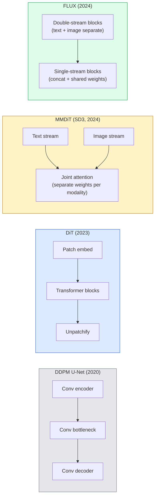

# Transformateurs de diffusion et flux rectifié

> Le réseau U-Net n'est pas le secret de la diffusion. Replacez-le par un transformateur, changez le calendrier du bruit pour un flux en ligne droite, et soudain vous avez SD3, FLUX, et chaque modèle de texte à image de 2026.

**Type:** Learn + Build
**Languages:** Python
**Prerequisites:** Phase 4 Lesson 10 (Diffusion DDPM), Phase 4 Lesson 14 (ViT), Phase 7 Lesson 02 (Self-Attention)
**Time:** ~75 minutes

## Objectifs d'apprentissage

- Suivre l'évolution de la DDPM U-Net (leçon 10) à la Transformateur de diffusion (DiT), à la MMDiT (SD3) et à la DiT à courant unique + double (FLUX)
- Expliquez le débit rectifié: pourquoi une trajectoire droite entre le bruit et les données permet aux modèles de prendre des échantillons en 20 étapes au lieu de 1000
- Mettre en œuvre un petit bloc de DiT et une boucle d'entraînement à débit rectifié, tous deux sous 100 lignes
- Distinguer les variantes de modèle (SD3, FLUX.1-dev, FLUX.1-schnell, Z-Image, Qwen-Image) par architecture, compte de paramètres et licence

## Le problème

Leçon 10 construit un DDPM avec un dénonciateur U-Net. Cette recette domine 2020-2023: U-Net + programme bêta + perte de prédiction du bruit.

Chaque modèle de 2026 de texte à image de pointe l'a dépassé. Stable Diffusion 3, FLUX, SD4, Z-Image, Qwen-Image, Hunyuan-Image  aucun n'utilise un U-Net. Ils utilisent des Transformateurs de Diffusion (DiT). SD3 et FLUX échangent également le calendrier de bruit DDPM pour un flux rectifié, ce qui redresse le chemin du bruit vers les données et permet une inférence en 1 à 4 étapes avec une cohérence ou des variantes distillées.

Le changement est important car c'est la raison pour laquelle la génération d'images basée sur la diffusion est devenue contrôlable, rapide et précise (renderage de texte résolu SD3/SD4) et rapide en production.

## Le concept

### De l'U-Net au transformateur



- **DiT**(Peebles & Xie, 2023)  remplacer le U-Net par un transformateur semblable à ViT sur des patchs latents. Conditionnement via norme de couche adaptative (AdaLN).
- **MMDiT**(SD3, Esser et coll., 2024)  deux flux avec des poids séparés pour les jetons de texte et d'image qui partagent une attention commune.
- **FLUX**(Black Forest Labs, 2024)  les premiers blocs N double flux comme SD3, les blocs ultérieurs concatenent et partagent des poids (single-stream) pour une efficacité à plus grande profondeur.
- **Z-Image**(2025)  une DiT efficace à flux unique à 6B qui met en cause "l'échelle à tout prix".

### Flux rectifié en un paragraphe

Le DDPM définit le processus à l' avance comme un SDE bruyant où `x_t`Le revers appris est une seconde SDE, résolue par 1000 petites étapes.

Le débit rectifié définit un **straight-line**interpolation entre les données propres et le bruit pur:

```
x_t = (1 - t) * x_0 + t * epsilon,     t in [0, 1]
```

Formez un réseau pour prédire la vitesse .`v_theta(x_t, t) = epsilon - x_0` la direction vers l'avant le long du chemin en ligne droite des données propres au bruit (`dx_t/dt`L'ODE résultant est beaucoup plus proche d'une ligne droite, de sorte que moins d'étapes d'intégration sont nécessaires pour échantillonner.

SD3 appelle ça .**Rectified Flow Matching**. FLUX, Z-Image et la plupart des modèles 2026 utilisent le même objectif.

### Conditionnement AdaLN

Condition de la classe/texte via **adaptive layer norm**: prévoir `scale`et `shift`Il est beaucoup plus propre que la modulation de style FiLM dans les U-Nets et le défaut dans tous les DiT modernes.

```
cond -> MLP -> (scale, shift, gate)
norm(x) * (1 + scale) + shift, then residual add * gate
```

### Encodeurs de texte dans SD3 et FLUX

- **SD3**utilise trois encoders de texte: deux modèles CLIP + T5-XXL. Les intégrations sont concatenées et alimentées dans le flux d'images en tant que conditionnement de texte.
- **FLUX**utilise une CLIP-L + T5-XXL.
- **Qwen-Image / Z-Image**Les variantes utilisent leurs propres encoders de texte internes alignés sur leurs MLL de base.

Le codeur de texte est une grande partie de la raison pour laquelle SD3/FLUX raisonne sur les demandes beaucoup mieux que SD1.5. T5-XXL seul est de 4,7B paramètres.

### Les directives sans classifiant sont toujours applicables

Le flux rectifié modifie l'échantillonneur, pas le conditionnement. La guidance sans classifiateur (texte de goutte avec 10% de probabilité pendant la formation, mélange des prédictions conditionnelles et inconditionnelles à l'inférence) fonctionne de manière identique avec le flux rectifié. La plupart des modèles 2026 utilisent une échelle de guidage de 3,5 à 5  inférieure à la 7.5 de SD1.5, car les modèles de flux rectifié suivent les instructions plus étroitement par défaut.

### La répartition des données est également possible.

Quatre noms pour la même idée: distiller un modèle lent à plusieurs étapes en un modèle rapide à quelques étapes.

- **LCM (Latent Consistency Model)** former un étudiant qui prédit la finale `x_0`de tout intermédiaire `x_t`En une seule étape.
- **SDXL Turbo / FLUX schnell** Modèles de 1 à 4 étapes formés par distillation à diffusion adverse.
- **SD Turbo** Modèles de cohérence de style OpenAI adaptés à la diffusion latente.

La production de tout nouveau modèle de navire a à la fois un point de contrôle "de qualité complète" et une variante "turbo / rapide". Schnell ("rapide" en allemand, convention des Black Forest Labs) se déroule en 1-4 étapes et s'adapte aux pipelines en temps réel.

### Paysage modèle en 2026

| Model | Size | Architecture | License |
|-------|------|--------------|---------|
| Stable Diffusion 3 Medium | 2B | MMDiT | SAI Community |
| Stable Diffusion 3.5 Large | 8B | MMDiT | SAI Community |
| FLUX.1-dev | 12B | Double + Single Stream DiT | non-commercial |
| FLUX.1-schnell | 12B | same, distilled | Apache 2.0 |
| FLUX.2 | — | iterated FLUX.1 | mixed |
| Z-Image | 6B | S3-DiT (Scalable Single-Stream) | permissive |
| Qwen-Image | ~20B | DiT + Qwen text tower | Apache 2.0 |
| Hunyuan-Image-3.0 | ~80B | DiT | research |
| SD4 Turbo | 3B | DiT + distillation | SAI Commercial |

FLUX.1-schnell est le code source ouvert par défaut de 2026. Z-Image est le leader de l'efficacité. FLUX.2 et SD4 sont les conseils de qualité actuels.

### Pourquoi ce changement de phase importe

DDPM + U-Net fonctionne.**better, faster, and scales more cleanly**. La transition parallèle à celle des RNN aux transformateurs en PNL: les deux architectures ont résolu le même problème, mais les transformateurs ont évolué et dominent maintenant. Chaque article de 2026 sur la génération d'images, de vidéos ou de 3D utilise un dénonciateur en forme de DiT et généralement un objectif de flux rectifié.

```figure
cv3-rectified-flow
```

## Faites-le

### Étape 1: Un bloc de DiT avec AdaLN

```python
import torch
import torch.nn as nn


class AdaLNZero(nn.Module):
    """
    Adaptive LayerNorm with a gate. Predicts (scale, shift, gate) from the conditioning.
    Init such that the whole block starts as identity ("zero init").
    """

    def __init__(self, dim, cond_dim):
        super().__init__()
        self.norm = nn.LayerNorm(dim, elementwise_affine=False)
        self.mlp = nn.Linear(cond_dim, dim * 3)
        nn.init.zeros_(self.mlp.weight)
        nn.init.zeros_(self.mlp.bias)

    def forward(self, x, cond):
        scale, shift, gate = self.mlp(cond).chunk(3, dim=-1)
        h = self.norm(x) * (1 + scale.unsqueeze(1)) + shift.unsqueeze(1)
        return h, gate.unsqueeze(1)


class DiTBlock(nn.Module):
    def __init__(self, dim=192, heads=3, mlp_ratio=4, cond_dim=192):
        super().__init__()
        self.adaln1 = AdaLNZero(dim, cond_dim)
        self.attn = nn.MultiheadAttention(dim, heads, batch_first=True)
        self.adaln2 = AdaLNZero(dim, cond_dim)
        self.mlp = nn.Sequential(
            nn.Linear(dim, dim * mlp_ratio),
            nn.GELU(),
            nn.Linear(dim * mlp_ratio, dim),
        )

    def forward(self, x, cond):
        h, gate1 = self.adaln1(x, cond)
        a, _ = self.attn(h, h, h, need_weights=False)
        x = x + gate1 * a
        h, gate2 = self.adaln2(x, cond)
        x = x + gate2 * self.mlp(h)
        return x
```

`AdaLNZero`La formation déplace le bloc de l'identité, ce qui stabilise de manière spectaculaire les modèles de diffusion des transformateurs profonds.

### Étape 2: Une petite diète

```python
def timestep_embedding(t, dim):
    import math
    half = dim // 2
    freqs = torch.exp(-math.log(10000) * torch.arange(half, device=t.device) / half)
    args = t[:, None].float() * freqs[None]
    return torch.cat([args.sin(), args.cos()], dim=-1)


class TinyDiT(nn.Module):
    def __init__(self, image_size=16, patch_size=2, in_channels=3, dim=96, depth=4, heads=3):
        super().__init__()
        self.patch_size = patch_size
        self.num_patches = (image_size // patch_size) ** 2
        self.patch = nn.Conv2d(in_channels, dim, kernel_size=patch_size, stride=patch_size)
        self.pos = nn.Parameter(torch.zeros(1, self.num_patches, dim))
        self.time_mlp = nn.Sequential(
            nn.Linear(dim, dim * 2),
            nn.SiLU(),
            nn.Linear(dim * 2, dim),
        )
        self.blocks = nn.ModuleList([DiTBlock(dim, heads, cond_dim=dim) for _ in range(depth)])
        self.norm_out = nn.LayerNorm(dim, elementwise_affine=False)
        self.head = nn.Linear(dim, patch_size * patch_size * in_channels)

    def forward(self, x, t):
        n = x.size(0)
        x = self.patch(x)
        x = x.flatten(2).transpose(1, 2) + self.pos
        t_emb = self.time_mlp(timestep_embedding(t, self.pos.size(-1)))
        for blk in self.blocks:
            x = blk(x, t_emb)
        x = self.norm_out(x)
        x = self.head(x)
        return self._unpatchify(x, n)

    def _unpatchify(self, x, n):
        p = self.patch_size
        h = w = int(self.num_patches ** 0.5)
        x = x.view(n, h, w, p, p, -1).permute(0, 5, 1, 3, 2, 4).reshape(n, -1, h * p, w * p)
        return x
```

### Étape 3: Formation en flux rectifiée

```python
import torch.nn.functional as F

def rectified_flow_train_step(model, x0, optimizer, device):
    model.train()
    x0 = x0.to(device)
    n = x0.size(0)
    t = torch.rand(n, device=device)
    epsilon = torch.randn_like(x0)
    x_t = (1 - t[:, None, None, None]) * x0 + t[:, None, None, None] * epsilon

    target_velocity = epsilon - x0
    pred_velocity = model(x_t, t)

    loss = F.mse_loss(pred_velocity, target_velocity)
    optimizer.zero_grad()
    loss.backward()
    optimizer.step()
    return loss.item()
```

Comparer avec la perte de prédiction du bruit du DDPM (leçon 10): la même structure, une cible différente.`epsilon`On prévoit le**velocity** `epsilon - x_0`, qui pointent des données au bruit le long de l'interpolation en ligne droite.

### Étape 4: échantillonneur Euler

Le flux rectifié est un ODE. La méthode d'Euler est la plus simple et, pour un modèle de flux rectifié bien formé, presque aussi précise que les résolveurs de plus haut ordre à plus de 20 étapes.

```python
@torch.no_grad()
def rectified_flow_sample(model, shape, steps=20, device="cpu"):
    model.eval()
    x = torch.randn(shape, device=device)
    dt = 1.0 / steps
    t = torch.ones(shape[0], device=device)
    for _ in range(steps):
        v = model(x, t)
        x = x - dt * v
        t = t - dt
    return x
```

20 étapes. sur un modèle formé, il produit des échantillons comparables à ceux du DDPM à 1000 étapes.

### Étape 5: Essai de fumée de bout en bout

```python
import numpy as np

def synthetic_blobs(num=200, size=16, seed=0):
    rng = np.random.default_rng(seed)
    out = np.zeros((num, 3, size, size), dtype=np.float32)
    yy, xx = np.meshgrid(np.arange(size), np.arange(size), indexing="ij")
    for i in range(num):
        cx, cy = rng.uniform(4, size - 4, size=2)
        r = rng.uniform(2, 4)
        mask = (xx - cx) ** 2 + (yy - cy) ** 2 < r ** 2
        colour = rng.uniform(-1, 1, size=3)
        for c in range(3):
            out[i, c][mask] = colour[c]
    return torch.from_numpy(out)
```

- Le train a`TinyDiT`Après 500 étapes, les résultats de l'échantillonnage doivent ressembler à des taches de couleur pâles.

## Utilisez-le

Pour la génération d'images réelles avec FLUX / SD3 / Z-Image, `diffusers`les navires disposant chacun d'une API unifiée:

```python
from diffusers import FluxPipeline, StableDiffusion3Pipeline
import torch

pipe = FluxPipeline.from_pretrained(
    "black-forest-labs/FLUX.1-schnell",
    torch_dtype=torch.bfloat16,
).to("cuda")

out = pipe(
    prompt="a golden retriever surfing a tsunami, hyperrealistic, studio lighting",
    guidance_scale=0.0,           # schnell was trained without CFG
    num_inference_steps=4,
    max_sequence_length=256,
).images[0]
out.save("surf.png")
```

Trois lignes.`FLUX.1-schnell`En quatre étapes, changez l'identifiant de modèle en `black-forest-labs/FLUX.1-dev`pour une qualité supérieure à 20 à 30 étapes avec CFG.

Pour SD3:

```python
pipe = StableDiffusion3Pipeline.from_pretrained(
    "stabilityai/stable-diffusion-3.5-large",
    torch_dtype=torch.bfloat16,
).to("cuda")
out = pipe(prompt, guidance_scale=3.5, num_inference_steps=28).images[0]
```

## La faire partir

Cette leçon donne:

- `outputs/prompt-dit-model-picker.md` Choisir entre SD3, FLUX.1-dev, FLUX.1-schnell, Z-Image, SD4 Turbo compte tenu des contraintes de qualité, de latence et de licence.
- `outputs/skill-rectified-flow-trainer.md` écrit une boucle d'entraînement complète pour le débit rectifié avec l'échantillonnage AdaLN DiT et Euler.

## Exercices

1. **(Easy)**Exercez le TinyDiT ci-dessus sur le jeu de données de blob synthétique pendant 500 étapes.
2. **(Medium)**Ajouter un conditionnement de texte en concatenant une intégration de classe apprise à la intégration de temps (10 taches "classes" par couleur).
3. **(Hard)**Calculer la distance Fréchet (FID proxy) entre les échantillons générés à partir de versions de flux rectifié et DDPM du même réseau de taille formé sur les mêmes données pour le même nombre d'étapes.

## Les termes clés

| Term | What people say | What it actually means |
|------|----------------|----------------------|
| DiT | "Diffusion transformer" | Transformer that replaces the U-Net as the diffusion denoiser; operates on patchified latents |
| AdaLN | "Adaptive layer norm" | Timestep/text conditioning via learned scale, shift, gate applied after LayerNorm; standard in every modern DiT |
| MMDiT | "Multi-modal DiT (SD3)" | Separate weight streams for text and image tokens that share a joint self-attention |
| Single-stream / double-stream | "FLUX trick" | First N blocks double-stream (separate weights per modality), later blocks single-stream (concat + shared weights) for efficiency |
| Rectified flow | "Straight-line noise-to-data" | Linear interpolation between data and noise; network predicts velocity; fewer ODE steps needed at inference |
| Velocity target | "epsilon - x_0" | The regression target in rectified flow; points from clean data to noise |
| CFG guidance | "classifier-free guidance" | Mix conditional and unconditional predictions; still used in rectified-flow models |
| Schnell / turbo / LCM | "1-4 step distillation" | Small-step variants distilled from full-quality models; production real-time |

## Pour en savoir plus

- [Scalable Diffusion Models with Transformers (Peebles & Xie, 2023)](https://arxiv.org/abs/2212.09748) le papier de la DiT
- [Scaling Rectified Flow Transformers (Esser et al., SD3 paper)](https://arxiv.org/abs/2403.03206) MMDiT et flux rectifié à l'échelle
- [FLUX.1 model card and technical report (Black Forest Labs)](https://huggingface.co/black-forest-labs/FLUX.1-dev) double + détails de flux unique
- [Z-Image: Efficient Image Generation Foundation Model (2025)](https://arxiv.org/html/2511.22699v1) DiT à courant unique à 6B
- [Elucidating the Design Space of Diffusion (Karras et al., 2022)](https://arxiv.org/abs/2206.00364) la référence pour chaque compromis de conception de diffusion
- [Latent Consistency Models (Luo et al., 2023)](https://arxiv.org/abs/2310.04378) comment LCM-LoRA vous donne une inférence en 4 étapes
