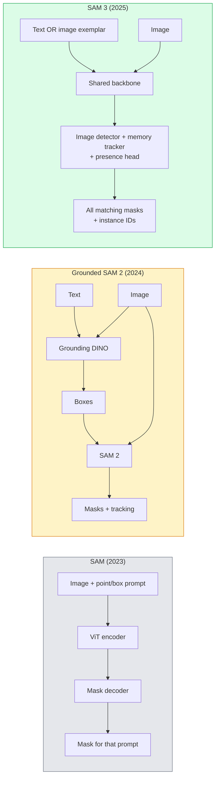

# SAM 3 et segmentation du vocabulaire ouvert

> Donnez un modèle un message texte et une image et obtenez des masques pour chaque objet correspondant.

**Type:** Use + Build
**Languages:** Python
**Prerequisites:** Phase 4 Lesson 07 (U-Net), Phase 4 Lesson 08 (Mask R-CNN), Phase 4 Lesson 18 (CLIP)
**Time:** ~60 minutes

## Objectifs d'apprentissage

- Distinguer entre SAM (seulement les instructions visuelles), SAM / SAM 2 (détecteur + SAM) et SAM 3 (indications de texte natif via la segmentation de concepts promptables)
- Expliquer l'architecture SAM 3: colonne vertébrale partagée + détecteur d'image + détecteur vidéo basé sur la mémoire + tête de présence + conception déconnectée de détecteur-detecteur
- Utilisez des câlins .`transformers`L'intégration SAM 3 pour la détection, la segmentation et le suivi vidéo par SMS
- Choisissez entre SAM 3, SAM à la terre 2, YOLO-World et SAM-MI en fonction de la latence, de la complexité du concept et de la cible de déploiement

## Le problème

Le SAM 2023 était un modèle visuel-immédiat: vous cliquez sur un point ou dessinez une boîte et il renvoie un masque. Pour "donnez-moi toutes les oranges de cette photo" vous aviez besoin d'un détecteur (Grounding DINO) pour produire des boîtes, puis SAM pour segmenter chacune. SAM fondé a transformé cela en un pipeline, mais c'était une cascade de deux modèles gelés avec une accumulation inévitable d'erreurs.

SAM 3 (Meta, novembre 2025, ICLR 2026) a effondré la cascade. Il accepte une phrase de nom court ou un exemplaire d'image comme prompt et renvoie tous les masques et les identifiants d'instance correspondants dans un seul passe avant.**Promptable Concept Segmentation (PCS)**Combiné à la mise à jour Object Multiplex de mars 2026 (SAM 3.1), il suit efficacement plusieurs instances du même concept à travers la vidéo.

Cette leçon concerne le changement structurel que cela représente. Seg 2D, la détection et la mise à terre des images textuelles ont fusionné en un seul modèle. La question de production n'est plus "quel pipeline je chaîne ensemble" mais "quel modèle promptable gère mon cas d'utilisation de bout en bout".

## Le concept

### Les trois générations



### Segmentation rapide des concepts

Une "concept prompt" est une phrase de nom courte (`"yellow school bus"`- Je suis là .`"striped red umbrella"`- Je suis là .`"hand holding a mug"`Le modèle renvoie des masques de segmentation pour chaque instance de l'image qui correspond au concept, plus un identifiant unique d'instance par match.

Cela diffère du SAM visuel classique de trois façons:

1. Aucune demande par instance n'est requise  une demande de texte renvoie toutes les correspondances.
2. Le concept de vocabulaire ouvert peut être tout ce qui est décrivable dans le langage naturel.
3. Retourne plusieurs instances à la fois plutôt qu'un masque par prompt.

### Des pièces architecturales clés

- **Shared backbone** un seul ViT traite l'image.
- **Presence head** prédit si le concept est présent dans l'image du tout. Découpe "est-ce ici?" de "où est-il?". Réduit les faux positifs sur les concepts absents.
- **Decoupled detector-tracker** La détection au niveau de l'image et le suivi au niveau de la vidéo ont des têtes séparées afin de ne pas interférer.
- **Memory bank** stocke des fonctionnalités par instance sur des cadres pour le suivi vidéo (même mécanisme SAM 2 utilisé).

### Formation à l'échelle

SAM 3 a été formé à .**4 million unique concepts**Il s'agit d'un système de données généré par un moteur de données qui annotent et corrige à plusieurs reprises en utilisant l'IA + l'examen humain.**SA-CO benchmark**Il contient 270 000 concepts uniques, 50 fois plus grands que les benchmarks précédents. SAM 3 atteint 75 à 80% des performances humaines sur SA-CO et double les systèmes existants sur image + vidéo PCS.

### SAM 3.1 Objet multiplex

Mise à jour en mars 2026: **Object Multiplex**Le système de suivi de plusieurs instances du même concept est un système de mémoire partagée qui permet de suivre simultanément plusieurs instances du même concept.

### Où le SAM au sol compte encore en 2026

- Lorsque vous avez besoin d'un détecteur de vocabulaire ouvert spécifique remplacé (DINO-X, Florence-2).
- Quand la licence SAM 3 (sur HF) est un bloqueur.
- Quand vous avez besoin de plus de contrôle sur le seuil du détecteur que SAM 3 expose.
- Pour les travaux de recherche/ablation sur le composant du détecteur.

Pour la plupart des travaux de production, SAM 3 est la réponse la plus simple.

### YOLO-World contre SAM 3

- **YOLO-World** Détecteur de vocabulaire ouvert seulement (pas de masques). En temps réel.
- **SAM 3** Segmentation complète + suivi.

Partage de production: YOLO-World pour les pipelines de détection rapide (navigation robotique, tableaux de bord rapides), SAM 3 pour tout ce qui a besoin de masques ou de suivi.

### Efficience SAM-MI

SAM-MI (2025-2026) aborde le gouffre du décodeur SAM.

- **Sparse point prompting** utilise quelques points bien choisis au lieu de commandes denses; réduit les appels au décodeur de 96%.
- **Shallow mask aggregation** fusionne les prédictions de masques en un masque plus net.
- **Decoupled mask injection** Le décodeur reçoit des fonctionnalités de masque précomputées au lieu de la réinitialisation.

Résultat: ~1,6x accélération par rapport à Grounded-SAM sur les critères de référence du vocabulaire ouvert.

### Format de sortie pour les trois modèles

Toutes renvoient la même structure générale (boîtes + étiquettes + scores + masques + identifiants), ce qui est utile  votre pipeline en aval n'a pas à brancher sur le modèle exécuté.

```figure
cv3-open-vocab
```

## Faites-le

### Étape 1: Construction rapide

Construire un assistant qui transforme une phrase utilisateur en une liste de SAM 3 concepts de demande. C'est la limite où "ce que l'utilisateur a tapé" rencontre "ce que le modèle consomme".

```python
def split_concepts(sentence):
    """
    Heuristic splitter for multi-concept prompts.
    Returns list of short noun phrases.
    """
    for sep in [",", ";", "and", "or", "&"]:
        if sep in sentence:
            parts = [p.strip() for p in sentence.replace("and ", ",").split(",")]
            return [p for p in parts if p]
    return [sentence.strip()]

print(split_concepts("cats, dogs and balloons"))
```

SAM 3 accepte un concept par passe à l'avant; pour les requêtes multiconceptives, les faire boucle ou en lots.

### Étape 2: Aideurs post-traitement

Transformez les résultats de SAM 3 en une liste de détections qui correspondent à notre contrat de pipeline de phase 4.

```python
from dataclasses import dataclass
from typing import List

@dataclass
class ConceptDetection:
    concept: str
    instance_id: int
    box: tuple          # (x1, y1, x2, y2)
    score: float
    mask_rle: str       # run-length encoded


def rle_encode(binary_mask):
    flat = binary_mask.flatten().astype("uint8")
    runs = []
    prev, count = flat[0], 0
    for v in flat:
        if v == prev:
            count += 1
        else:
            runs.append((int(prev), count))
            prev, count = v, 1
    runs.append((int(prev), count))
    return ";".join(f"{v}x{c}" for v, c in runs)
```

RLE maintient les charges utiles de réponse petites même pour de nombreux masques haute résolution.

### Étape 3: Interface de segmentation ouverte unifiée

Enveloppez le backend que vous avez (SAM 3, SAM à la base 2, YOLO-World + SAM 2) derrière une seule méthode. Votre code en aval ne change pas lorsque le backend le fait.

```python
from abc import ABC, abstractmethod
import numpy as np

class OpenVocabSeg(ABC):
    @abstractmethod
    def detect(self, image: np.ndarray, concept: str) -> List[ConceptDetection]:
        ...


class StubOpenVocabSeg(OpenVocabSeg):
    """
    Deterministic stub used for pipeline testing when real models are not loaded.
    """
    def detect(self, image, concept):
        h, w = image.shape[:2]
        return [
            ConceptDetection(
                concept=concept,
                instance_id=0,
                box=(w * 0.2, h * 0.3, w * 0.5, h * 0.8),
                score=0.89,
                mask_rle="0x100;1x50;0x200",
            ),
            ConceptDetection(
                concept=concept,
                instance_id=1,
                box=(w * 0.55, h * 0.25, w * 0.85, h * 0.75),
                score=0.74,
                mask_rle="0x80;1x40;0x220",
            ),
        ]
```

La vraie .`SAM3OpenVocabSeg`sous-classe serait enveloppé `transformers.Sam3Model`et `Sam3Processor`- Je suis désolé .

### Étape 4: Embracer le visage utilisation SAM 3 (référence)

Pour le modèle réel, le `transformers`intégration:

```python
from transformers import Sam3Processor, Sam3Model
import torch

processor = Sam3Processor.from_pretrained("facebook/sam3")
model = Sam3Model.from_pretrained("facebook/sam3").eval()

inputs = processor(images=pil_image, return_tensors="pt")
inputs = processor.set_text_prompt(inputs, "yellow school bus")

with torch.no_grad():
    outputs = model(**inputs)

masks = processor.post_process_masks(
    outputs.masks, inputs.original_sizes, inputs.reshaped_input_sizes
)
boxes = outputs.boxes
scores = outputs.scores
```

Une seule demande, tous les matchs sont retournés en un seul appel.

### Étape 5: Mesurer ce que le SAM 2 vous a donné gratuitement

Un point de référence honnête: que se passe-t-il quand vous remplacez le SAM 2 par le SAM 3 dans un pipeline réel ?

- La latence: SAM 3 permet d'économiser un passage vers l'avant (pas de détecteur séparé), mais le modèle lui-même est plus lourd; généralement net-neutre ou une légère accélération.
- Accuracité: SAM 3 est nettement meilleur sur les concepts rares ou compositionnels (" parapluie rouge rayé ").
- Flexibilité: SAM 2 à base de sol vous permet d'échanger des détecteurs (DINO-X, Florence-2, DINO 1.5); SAM 3 est monolithique.

Conclusion: SAM 3 est la version par défaut pour la seg de 2026 à vocabulaire ouvert. SAM 2 fondé est toujours la bonne réponse lorsque vous avez besoin de flexibilité de détecteur ou de différentes conditions de licence.

## Utilisez-le

Modèles de déploiement de la production:

- **Real-time annotation** SAM 3 + fonctionnalité d'étiquette-comme-texte-prompte de CVAT. Les annotateurs sélectionnent un nom d'étiquette; SAM 3 préétiquette chaque instance correspondante. Révisez et corrigez.
- **Video analytics** SAM 3.1 Object Multiplex pour le suivi multi-objets; cadres d'alimentation du tracker basé sur la mémoire.
- **Robotics** SAM 3 pour la manipulation en libre-vocable (" pick up the red cup "); fonctionne comme un programme de planification primitif.
- **Medical imaging** SAM 3 est ajusté sur les concepts médicaux; nécessite une demande d'accès sur HF.

Ultralytics enveloppe SAM 3 dans son paquet Python:

```python
from ultralytics import SAM

model = SAM("sam3.pt")
results = model(image_path, prompts="yellow school bus")
```

La même interface que YOLO et SAM 2.

## La faire partir

Cette leçon donne:

- `outputs/prompt-open-vocab-stack-picker.md` une requête qui choisit SAM 3 / SAM 2 / YOLO-World / SAM-MI en fonction de la latence, de la complexité du concept et de la licence.
- `outputs/skill-concept-prompt-designer.md` une compétence qui transforme les déclarations des utilisateurs en des instructions de concept SAM 3 bien formées (division, désambiguation, revers).

## Exercices

1. **(Easy)**Exécutez SAM 3 sur 10 images avec les instructions de conception que vous choisissez. Comparer avec SAM 2 + Grounding DINO 1.5 sur les mêmes images. Rapporte les concepts manqués par chaque modèle.
2. **(Medium)**Construisez une interface utilisateur "cliquer pour inclure / cliquer pour exclure" en haut de SAM 3: une requête de texte renvoie les instances candidates; les clics de l'utilisateur conservent celles qui comptent comme positives.
3. **(Hard)**Télégraphie SAM 3 sur un ensemble de concepts personnalisé (par exemple 5 types de composants électroniques) avec 20 images étiquetées chacune.

## Les termes clés

| Term | What people say | What it actually means |
|------|----------------|----------------------|
| Open-vocabulary segmentation | "Segment by text" | Produce masks for objects described in natural language, not a fixed label set |
| PCS | "Promptable Concept Segmentation" | SAM 3's core task — given a noun-phrase or image exemplar, segment all matching instances |
| Concept prompt | "The text input" | Short noun phrase or image exemplar; not a full sentence |
| Presence head | "Is it here?" | SAM 3 module that decides whether the concept exists in the image before localisation |
| SA-CO | "SAM 3 benchmark" | 270K-concept open-vocabulary segmentation benchmark; 50x larger than prior open-vocab benchmarks |
| Object Multiplex | "SAM 3.1 update" | Shared-memory multi-object tracking; fast joint tracking of many instances |
| Grounded SAM 2 | "Modular pipeline" | Detector + SAM 2 cascade; still relevant when detector swap matters |
| SAM-MI | "Efficient SAM variant" | Mask Injection for 1.6x speedup over Grounded-SAM |

## Pour en savoir plus

- [SAM 3: Segment Anything with Concepts (arXiv 2511.16719)](https://arxiv.org/abs/2511.16719)
- [SAM 3.1 Object Multiplex (Meta AI, March 2026)](https://ai.meta.com/blog/segment-anything-model-3/)
- [SAM 3 model page on Hugging Face](https://huggingface.co/facebook/sam3)
- [Grounded SAM 2 tutorial (PyImageSearch)](https://pyimagesearch.com/2026/01/19/grounded-sam-2-from-open-set-detection-to-segmentation-and-tracking/)
- [Ultralytics SAM 3 docs](https://docs.ultralytics.com/models/sam-3/)
- [SAM3-I: Instruction-aware SAM (arXiv 2512.04585)](https://arxiv.org/abs/2512.04585)
