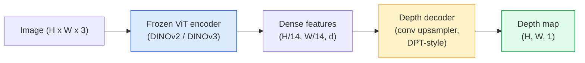

# Profondeur monoculaire et estimation géométrique

> Une carte de profondeur est une image à canal unique où chaque pixel est une distance de la caméra. La prédiction à partir d'un cadre RGB était impossible sans stéréo ou LiDAR. En 2026, un encodeur ViT gelé plus une tête légère atteint quelques pour cent de la vérité au sol.

**Type:** Build + Use
**Languages:** Python
**Prerequisites:** Phase 4 Lesson 14 (ViT), Phase 4 Lesson 17 (Self-Supervised Vision), Phase 4 Lesson 07 (U-Net)
**Time:** ~60 minutes

## Objectifs d'apprentissage

- Distinguer la profondeur relative et la profondeur métrique et l'état que chaque modèle de production (MiDaS, Marigold, Depth Anything V3, ZoeDepth) résolve
- Utilisez la profondeur Anything V3 (DINOv2 spine dorsale) pour prédire la profondeur pour des images individuelles arbitraires sans étalonnage
- Expliquer pourquoi la profondeur monoculaire fonctionne à partir d'une seule image (indices de perspective, gradients de texture, antécédents appris) et ce qu'elle ne peut pas récupérer (échelle absolue, géométrie occluse)
- Levez les détections 2D vers les points 3D en utilisant une carte de profondeur et les éléments intrinsèques de la caméra à pinhole

## Le problème

La profondeur est l'axe manquant dans la vision informatique 2D. Compte tenu de la RGB, vous savez où les choses apparaissent dans le plan d'image; vous ne savez pas à quelle distance elles sont. Les capteurs de profondeur (récepteurs stéréo, LiDAR, temps de vol) résolvent cela directement mais sont coûteux, fragiles et limités en portée.

Estimation de profondeur monoculaire  prédiction de la profondeur à partir d'un seul cadre RGB  utilisé pour produire une sortie floue et peu fiable. En 2026, de grands encoders prétrainés ont changé cela: Depth Anything V3 utilise une colonne vertébrale DINOv2 gelée et produit des cartes de profondeur qui se généralisent sur les domaines intérieurs, extérieurs, médicaux et satellites. Marigold réframe la profondeur comme un problème de diffusion conditionnelle. ZoeDepth régresse les distances métriques vraies.

La profondeur est aussi le pont entre la détection 2D et la compréhension 3D: multipliez les pixels d'une boîte détectée par la profondeur et vous soulevez l'objet 2D dans un nuage de point 3D. C'est le noyau de chaque système d'occlusion AR, de chaque pipeline d'évitement des obstacles et de chaque robot " pick up the cup ".

## Le concept

### Profondeur relative par rapport à la métrique

- **Relative depth**- Je vous en prie .`z`"Le pixel A est plus proche que le pixel B, mais le rapport des distances n'est pas ancré aux mètres".
- **Metric depth** distance absolue en mètres de la caméra.

Le MiDaS et la profondeur de tout V3 produisent une profondeur relative. Marigold produit une profondeur relative. ZoeDepth, UniDepth et Metric3D produisent une profondeur métrique.

### Le modèle de décodeur-encodeur



Le codeur fournit de riches fonctionnalités; le décodeur les interpelle jusqu'à la résolution de l'image et régresse la profondeur.

### Pourquoi une seule image produit- elle une profondeur ?

Une image 2D contient de nombreux indices monoculaires qui se corrélent avec la profondeur:

- **Perspective** Les lignes parallèles en 3D convergent en 2D.
- **Texture gradient** les surfaces éloignées ont une texture plus petite et plus dense.
- **Occlusion order** Les objets les plus proches occultent les plus éloignés.
- **Size constancy** les objets connus (autos, humains) donnent une échelle approximative.
- **Atmospheric perspective** Les objets éloignés apparaissent plus brumeux et plus bleus dans les scènes extérieures.

Avec suffisamment de données et une forte mémoire, la profondeur monoculaire atteint une précision raisonnable sans surveillance 3D explicite.

### Ce que la profondeur monoculaire ne peut pas faire

- **Absolute metric scale**Le réseau peut prédire "la coupe est deux fois plus loin que la cuillère" sans savoir si la coupe est à 1 m ou 10 m de distance.
- **Occluded geometry** le dos d'une chaise est invisible et ne peut être déduit de manière fiable.
- **Truly untextured / reflective surfaces**Le réseau rapporte une profondeur plausible mais erronée.

### La profondeur de quoi que ce soit V3 en 2026

- Vanille DINOv2 ViT-L/14 comme encodeur (congelé).
- Décoder DPT.
- Formation sur des paires d'images posées provenant de sources diverses (pas de supervision explicite de la profondeur nécessaire au-delà de la cohérence photométrique).
- Prédit une géométrie spatialement cohérente à partir de **an arbitrary number of visual inputs, with or without known camera poses**- Je suis désolé .
- SOTA à travers la profondeur monoculaire, la géométrie de toute vue, le rendu visuel, l'estimation de la pose de la caméra.

C'est le modèle à déposer pour avoir besoin de profondeur en 2026.

### Diffusion de la profondeur

Marigold (Ke et al., CVPR 2024) réframe l'estimation de profondeur en tant que diffusion image-à-image conditionnelle. Conditionnement: RGB. Cible: carte de profondeur. Utilise un U-Net Stable Diffusion 2 prétrainé comme colonne vertébrale. Les cartes de profondeur de sortie sont exceptionnellement nettes aux limites des objets. Commercialisation: inférence plus lente que les modèles de flux (10-50 étapes dénonciatrices).

### Les éléments de base et la caméra à pinhole

Pour soulever un pixel `(u, v)`avec profondeur `d`à un point 3D `(X, Y, Z)`en coordonnées de caméra:

```
fx, fy, cx, cy = camera intrinsics
X = (u - cx) * d / fx
Y = (v - cy) * d / fy
Z = d
```

L'intrinsèque provient des métadonnées EXIF, d'un schéma d'étalonnage ou d'un estimateur intrinsèque monoculaire (Perspective Fields, UniDepth). Sans intrinsèque, vous pouvez toujours rendre un nuage de point en supposant un principe de 60 à 70 ° FOV et de résolution modérée  utilisable pour la visualisation, pas pour la mesure.

### Évaluation

Deux mesures standard:

- **AbsRel**(erreur relative absolue): `mean(|d_pred - d_gt| / d_gt)`- Plus bas c'est mieux. 0,05-0,1 pour les modèles de production.
- **delta < 1.25**(precaution du seuil): fraction des pixels où `max(d_pred/d_gt, d_gt/d_pred) < 1.25`Plus haut c'est mieux. 0,9+ pour le SOTA.

Pour la profondeur relative (Depth Anything V3, MiDaS), l'évaluation utilise des versions invariantes d'échelle et de changement des deux mesures.

```figure
depth-sweep
```

## Faites-le

### Étape 1: Mesures de profondeur

```python
import torch

def abs_rel_error(pred, target, mask=None):
    if mask is not None:
        pred = pred[mask]
        target = target[mask]
    return (torch.abs(pred - target) / target.clamp(min=1e-6)).mean().item()


def delta_accuracy(pred, target, threshold=1.25, mask=None):
    if mask is not None:
        pred = pred[mask]
        target = target[mask]
    ratio = torch.maximum(pred / target.clamp(min=1e-6), target / pred.clamp(min=1e-6))
    return (ratio < threshold).float().mean().item()
```

Toujours masquer les pixels de profondeur invalide (zéro, NaN, saturés) avant l'évaluation.

### Étape 2: alignement de l'échelle et du changement

Pour les modèles de profondeur relative, alignez la prédiction sur la vérité fondamentale avant de calculer les métriques.`a * pred + b = target`- Le numéro de la liste:

```python
def align_scale_shift(pred, target, mask=None):
    if mask is not None:
        p = pred[mask]
        t = target[mask]
    else:
        p = pred.flatten()
        t = target.flatten()
    A = torch.stack([p, torch.ones_like(p)], dim=1)
    coeffs, *_ = torch.linalg.lstsq(A, t.unsqueeze(-1))
    a, b = coeffs[:2, 0]
    return a * pred + b
```

On court .`align_scale_shift`avant `abs_rel_error`lors de l'évaluation de la miDAS/ profondeur de tout.

### Étape 3: Élever la profondeur à un nuage de point

```python
import numpy as np

def depth_to_point_cloud(depth, intrinsics):
    H, W = depth.shape
    fx, fy, cx, cy = intrinsics
    v, u = np.meshgrid(np.arange(H), np.arange(W), indexing="ij")
    z = depth
    x = (u - cx) * z / fx
    y = (v - cy) * z / fy
    return np.stack([x, y, z], axis=-1)


depth = np.random.uniform(0.5, 4.0, (240, 320))
intr = (320.0, 320.0, 160.0, 120.0)
pc = depth_to_point_cloud(depth, intr)
print(f"point cloud shape: {pc.shape}  (H, W, 3)")
```

Une fonction, chaque application 3D-liftée.`.ply`et ouverte dans MeshLab ou CloudCompare.

### Étape 4: Essai de fumée avec une scène de profondeur synthétique

```python
def synthetic_depth(size=96):
    yy, xx = np.meshgrid(np.arange(size), np.arange(size), indexing="ij")
    # Floor: linear gradient from near (top) to far (bottom)
    depth = 1.0 + (yy / size) * 4.0
    # Box in the middle: closer
    mask = (np.abs(xx - size / 2) < size / 6) & (np.abs(yy - size * 0.6) < size / 6)
    depth[mask] = 2.0
    return depth.astype(np.float32)


gt = torch.from_numpy(synthetic_depth(96))
pred = gt + 0.3 * torch.randn_like(gt)  # simulated prediction
aligned = align_scale_shift(pred, gt)
print(f"before align  absRel = {abs_rel_error(pred, gt):.3f}")
print(f"after align   absRel = {abs_rel_error(aligned, gt):.3f}")
```

### Étape 5: profondeur Quelque chose utilisation V3 (référence)

```python
import torch
from transformers import pipeline
from PIL import Image

pipe = pipeline(task="depth-estimation", model="LiheYoung/depth-anything-v2-large")

image = Image.open("street.jpg").convert("RGB")
out = pipe(image)
depth_np = np.array(out["depth"])
```

Trois lignes.`out["depth"]`est une échelle de gris PIL; convertis en numpy pour les mathématiques. Pour Depth Anything V3 spécifiquement, échanger l'id du modèle une fois publié; l'API est inchangée.

## Utilisez-le

- **Depth Anything V3**(Meta AI / ByteDance, 2024-2026)  le modèle par défaut pour la profondeur relative.
- **Marigold**(ETH, 2024)  la plus haute qualité visuelle, l'inférence lente.
- **UniDepth**(ETH, 2024)  profondeur métrique avec estimation de l'intrinsèque de la caméra.
- **ZoeDepth**(Intel, 2023)  profondeur métrique; plus ancienne, toujours fiable.
- **MiDaS v3.1** héritage mais stable; bonne base de comparaison.

Modèle d'intégration typique:

1. Le cadre RGB arrive.
2. Le modèle de profondeur produit une carte de profondeur.
3. Le détecteur produit des boîtes.
4. Levez les boîtes centroides à travers la profondeur à 3D; fusionnez avec le nuage de point si disponible.
5. En aval: occlusion de la réalité augmentée, planification de la voie, estimation de la taille de l'objet, remplacement stéréo.

Pour une utilisation en temps réel, la profondeur de tout V2 Small (INT8 quantifié) atteint ~ 30 fps sur une GPU de consommation à 518x518.

## La faire partir

Cette leçon donne:

- `outputs/prompt-depth-model-picker.md` Choix entre Depth Anything V3, Marigold, UniDepth, MiDaS étant donné la latence, la mesure par rapport aux besoins et le type de scène.
- `outputs/skill-depth-to-pointcloud.md` une compétence qui construit des nuages de points à partir de cartes de profondeur avec une manipulation intrinsèque correcte et l'exportation vers `.ply`- Je suis désolé .

## Exercices

1. **(Easy)**Exécutez Depth Anything V2 sur 10 images de votre bureau. Conservez la profondeur en PNG à l'échelle grise et inspectez. Identifiez un objet dont la profondeur prévue semble erronée et expliquez pourquoi les signaux monoculaires ont échoué.
2. **(Medium)**Compte tenu de la RGB + profondeur de la profondeur tout V2, soulevez à un nuage de point et rendrez avec `open3d`. Comparer deux scènes (à l'intérieur / à l'extérieur) et noter qui semble plus crédible.
3. **(Hard)**Prenez cinq paires d'images qui diffèrent uniquement par la position d'un objet connu (par exemple, la bouteille déplacée de 30 cm plus près). Utilisez UniDepth pour prédire la profondeur métrique sur les deux. Rapportez la distance prédite delta par rapport à la vraie 30 cm.

## Les termes clés

| Term | What people say | What it actually means |
|------|----------------|----------------------|
| Monocular depth | "Single-image depth" | Depth estimation from one RGB frame, no stereo or LiDAR |
| Relative depth | "Ordered depth" | Ordered z-values without real-world units |
| Metric depth | "Absolute distance" | Depth in metres; requires calibration or a model trained with metric supervision |
| AbsRel | "Absolute relative error" | Mean of |d_pred - d_gt| / d_gt; standard depth metric |
| Delta accuracy | "delta < 1.25" | Fraction of pixels with prediction within 25% of ground truth |
| Pinhole camera | "fx, fy, cx, cy" | The camera model used to lift (u, v, d) to (X, Y, Z) |
| DPT | "Dense Prediction Transformer" | The conv-based decoder used on top of frozen ViT encoders for depth |
| DINOv2 backbone | "The reason it works" | Self-supervised features that generalise across domains without depth labels |

## Pour en savoir plus

- [Depth Anything V3 paper page](https://depth-anything.github.io/) Profondeur monoculaire SOTA avec encodeur DINOv2
- [Marigold (Ke et al., CVPR 2024)](https://marigoldmonodepth.github.io/) Estimation de profondeur basée sur la diffusion
- [UniDepth (Piccinelli et al., 2024)](https://arxiv.org/abs/2403.18913) profondeur métrique avec intrinsèques
- [MiDaS v3.1 (Intel ISL)](https://github.com/isl-org/MiDaS) la ligne de base canonique relative à la profondeur
- [DINOv3 blog post (Meta)](https://ai.meta.com/blog/dinov3-self-supervised-vision-model/) la famille des encoders qui améliore la précision de profondeur
