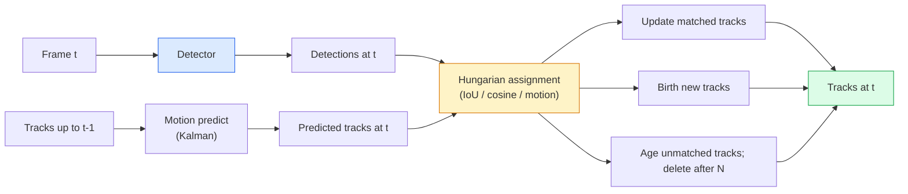

# Suivi de plusieurs objets et mémoire vidéo

> Le suivi est la détection plus l'association, détectez chaque cadre, et comparez les détections de ce cadre aux dernières traces par ID.

**Type:** Build
**Languages:** Python
**Prerequisites:** Phase 4 Lesson 06 (YOLO Detection), Phase 4 Lesson 08 (Mask R-CNN), Phase 4 Lesson 24 (SAM 3)
**Time:** ~60 minutes

## Objectifs d'apprentissage

- Distinguer le suivi par détection du suivi basé sur la requête et nommer les familles d'algorithmes (SORT, DeepSORT, ByteTrack, BoT-SORT, SAM 2 mémoire tracker, SAM 3.1 Object Multiplex)
- Implementer l'UIO + l'affectation hongroise à partir de zéro pour le suivi par détection classique
- Expliquez la mémoire de SAM 2 et pourquoi elle gère mieux l'occlusion que l'association basée sur l'IoU.
- Lisez les trois indicateurs de suivi (MOTA, IDF1, HOTA) et choisissez lequel d'entre eux est important pour un cas d'utilisation donné

## Le problème

Un détecteur vous indique où se trouvent les objets dans un seul cadre.`t`est le même objet que la détection dans le cadre `t-1`Sans cela, vous ne pouvez pas compter les objets qui franchissent une ligne, suivre une balle à travers une occlusion, ou savoir "la voiture n°4 est dans la voie depuis 8 secondes".

Le suivi est essentiel pour tous les produits axés sur la vidéo: analyse sportive, surveillance, conduite autonome, analyse vidéo médicale, surveillance de la faune, compte de mots. Les éléments de base sont partagés: un détecteur par cadre, un modèle de mouvement (filtre Kalman ou quelque chose de plus riche), une étape d'association (algorithme hongrois sur IoU / cosine / caractéristiques apprises) et un cycle de vie de la piste (naissance, mise à jour, mort).

En 2026, deux nouveaux modèles ont été introduits: **SAM 2 memory-based tracking**(référence à la mémoire des caractéristiques au lieu d'association à la modélisation du mouvement) et **SAM 3.1 Object Multiplex**Cette leçon suit d'abord la pile classique, puis l'approche basée sur la mémoire.

## Le concept

### Tracking par détection



Chaque tracker que vous rencontrerez en 2026 est une variation de cette boucle.

- **SORT**(2016): Filtre Kalman + IoU hongrois. Modèle simple, rapide, sans apparence.
- **DeepSORT**(2017): SORT + une fonctionnalité d'apparence basée sur CNN par piste (embedding ReID).
- **ByteTrack**(2021): associent les détections de faible confiance à une deuxième étape; aucune caractéristique d'apparence n'est nécessaire mais le meilleur acteur sur MOT17.
- **BoT-SORT**(2022): Byte + compensation du mouvement de la caméra + ReID.
- **StrongSORT / OC-SORT** Des descendants de ByteTrack avec un meilleur mouvement et une meilleure apparence.

### Filtre Kalman dans un paragraphe

Un filtre Kalman maintient un état par piste .`(x, y, w, h, dx, dy, dw, dh)`avec une covariance.**predict**l'état utilisant un modèle à vitesse constante, puis **update**La mise à jour fait plus confiance à la détection lorsque l'incertitude de prédiction est élevée. Cela donne des trajectoires lisses et la possibilité de poursuivre une piste à travers une occlusion courte (1-5 images).

Chaque traqueur classique utilise un filtre Kalman dans l'étape de prédiction du mouvement.

### L'algorithme hongrois

En raison d' une`M x N`La méthode de calcul des coûts (tracks x detections) est de trouver une assignation individuelle qui réduit au minimum le coût total.`1 - IoU(track_bbox, detection_bbox)`ou de similitude cosine négative des caractéristiques d'apparence. Le temps d'exécution est O(((M+N) ^3); pour M, N jusqu'à ~1000 il est assez rapide en Python via `scipy.optimize.linear_sum_assignment`- Je suis désolé .

### L'idée clé de ByteTrack

Les traceurs standard détectent des détections de faible fiabilité (< 0,5).**second-stage candidates**: après avoir associé les pistes à des détections de haute fiabilité, les pistes inégalées tentent de correspondre aux détections de faible fiabilité avec un seuil de l'UIO légèrement plus lourd.

### SAM 2 suivi basé sur la mémoire

SAM 2 gère la vidéo en conservant une**memory bank**En cas de commande de l'instance, le décodeur produit un masque pour la même instance dans le nouveau cadre.

Aucun filtre Kalman, aucune tâche hongroise, l'association est implicite dans l'opération mémoire-attention.

Les avantages:
- Robuste à des occlusions de grande taille (la mémoire porte l'identité de l'instance sur de nombreux cadres).
- Vocabulary ouvert lorsqu'il est combiné avec les instructions de texte de SAM 3.
- Il fonctionne sans modèle de mouvement séparé.

Les inconvénients:
- Plus lent que ByteTrack pour le suivi de nombreux objets.
- La mémoire augmente, elle limite la fenêtre de contexte.

### SAM 3.1 Objet multiplex

Le suivi SAM 2 / SAM 3 précédent conserve une banque de mémoire séparée par instance. Pour 50 objets, 50 banques de mémoire. Object Multiplex (mars 2026) les effondre en une seule mémoire partagée avec **per-instance query tokens**- Les échelles de coûts sublinéaires dans un certain nombre de cas.

Le multiplex est la nouvelle norme par défaut pour le suivi de la foule en 2026: les foules de concert, les travailleurs de l'entrepôt, les intersections de la circulation.

### Trois mesures à connaître

- **MOTA (Multi-Object Tracking Accuracy)** 1 - (interrupteurs FN + FP + ID) / GT. Pise par type d'erreur; une seule métrique qui confond les défaillances de détection et d'association.
- **IDF1 (ID F1)** moyen harmonieux de précision et de rappel d'identification. Se concentre spécifiquement sur la façon dont chaque piste de vérité au sol maintient son identité au fil du temps.
- **HOTA (Higher Order Tracking Accuracy)** se décompose en précision de détection (DetA) et précision d'association (AssA).

Pour la surveillance (qui est qui): IDF1 est ce que vous rapportez. Pour l'analyse sportive (passes de comptage): HOTA. Pour la comparaison universitaire générale: HOTA.

```figure
cv3-track-assoc
```

## Faites-le

### Étape 1: Matrice de coûts basée sur l'IoU

```python
import numpy as np


def bbox_iou(a, b):
    """
    a, b: (N, 4) arrays of [x1, y1, x2, y2].
    Returns (N_a, N_b) IoU matrix.
    """
    ax1, ay1, ax2, ay2 = a[:, 0], a[:, 1], a[:, 2], a[:, 3]
    bx1, by1, bx2, by2 = b[:, 0], b[:, 1], b[:, 2], b[:, 3]
    inter_x1 = np.maximum(ax1[:, None], bx1[None, :])
    inter_y1 = np.maximum(ay1[:, None], by1[None, :])
    inter_x2 = np.minimum(ax2[:, None], bx2[None, :])
    inter_y2 = np.minimum(ay2[:, None], by2[None, :])
    inter = np.clip(inter_x2 - inter_x1, 0, None) * np.clip(inter_y2 - inter_y1, 0, None)
    area_a = (ax2 - ax1) * (ay2 - ay1)
    area_b = (bx2 - bx1) * (by2 - by1)
    union = area_a[:, None] + area_b[None, :] - inter
    return inter / np.clip(union, 1e-8, None)
```

### Étape 2: Traqueur de style SORT minimal

La prédiction de Kalman est essentielle dans la production.`sort`Le paquet Python fournit la version complète.

```python
from scipy.optimize import linear_sum_assignment


class Track:
    def __init__(self, tid, bbox, frame):
        self.id = tid
        self.bbox = bbox
        self.last_frame = frame
        self.hits = 1

    def update(self, bbox, frame):
        self.bbox = bbox
        self.last_frame = frame
        self.hits += 1


class SimpleTracker:
    def __init__(self, iou_threshold=0.3, max_age=5):
        self.tracks = []
        self.next_id = 1
        self.iou_threshold = iou_threshold
        self.max_age = max_age

    def step(self, detections, frame):
        if not self.tracks:
            for d in detections:
                self.tracks.append(Track(self.next_id, d, frame))
                self.next_id += 1
            return [(t.id, t.bbox) for t in self.tracks]

        track_boxes = np.array([t.bbox for t in self.tracks])
        det_boxes = np.array(detections) if len(detections) else np.empty((0, 4))

        iou = bbox_iou(track_boxes, det_boxes) if len(det_boxes) else np.zeros((len(track_boxes), 0))
        cost = 1 - iou
        cost[iou < self.iou_threshold] = 1e6

        matched_track = set()
        matched_det = set()
        if cost.size > 0:
            row, col = linear_sum_assignment(cost)
            for r, c in zip(row, col):
                if cost[r, c] < 1.0:
                    self.tracks[r].update(det_boxes[c], frame)
                    matched_track.add(r); matched_det.add(c)

        for i, d in enumerate(det_boxes):
            if i not in matched_det:
                self.tracks.append(Track(self.next_id, d, frame))
                self.next_id += 1

        self.tracks = [t for t in self.tracks if frame - t.last_frame <= self.max_age]
        return [(t.id, t.bbox) for t in self.tracks]
```

60 lignes. Prend des détections par cadre, renvoie des identifiants de piste par cadre.

### Étape 3: Essai de trajectoire synthétique

```python
def synthetic_frames(num_frames=20, num_objects=3, H=240, W=320, seed=0):
    rng = np.random.default_rng(seed)
    starts = rng.uniform(20, 200, size=(num_objects, 2))
    velocities = rng.uniform(-5, 5, size=(num_objects, 2))
    frames = []
    for f in range(num_frames):
        dets = []
        for i in range(num_objects):
            cx, cy = starts[i] + f * velocities[i]
            dets.append([cx - 10, cy - 10, cx + 10, cy + 10])
        frames.append(dets)
    return frames


tracker = SimpleTracker()
for f, dets in enumerate(synthetic_frames()):
    tracks = tracker.step(dets, f)
```

Trois objets se déplaçant en lignes droites devraient garder leurs identifiants sur les 20 cadres.

### Étape 4: métrique de commutateur d'identification

```python
def count_id_switches(tracks_per_frame, gt_per_frame):
    """
    tracks_per_frame:  list of list of (track_id, bbox)
    gt_per_frame:      list of list of (gt_id, bbox)
    Returns number of ID switches.
    """
    prev_assignment = {}
    switches = 0
    for tracks, gts in zip(tracks_per_frame, gt_per_frame):
        if not tracks or not gts:
            continue
        t_boxes = np.array([b for _, b in tracks])
        g_boxes = np.array([b for _, b in gts])
        iou = bbox_iou(g_boxes, t_boxes)
        for g_idx, (gt_id, _) in enumerate(gts):
            j = iou[g_idx].argmax()
            if iou[g_idx, j] > 0.5:
                t_id = tracks[j][0]
                if gt_id in prev_assignment and prev_assignment[gt_id] != t_id:
                    switches += 1
                prev_assignment[gt_id] = t_id
    return switches
```

Il s'agit d'une métrique adjacente simplifiée IDF1: compter combien de fois un objet de vérité au sol modifie son ID de piste prédite attribué.`py-motmetrics`et `TrackEval`- Je suis désolé .

## Utilisez-le

Traceurs de production en 2026:

- `ultralytics` YOLOv8 + ByteTrack / BoT-SORT intégré. `results = model.track(source, tracker="bytetrack.yaml")`- Le défaut.
- `supervision`(Roboflow)  Enveloppes ByteTrack plus les outils d'annotation.
- SAM 2 / SAM 3.1  suivi par mémoire via `processor.track()`- Je suis désolé .
- Stack personnalisé: détecteur (YOLOv8 / RT-DETR) + `sort-tracker`- Je suis là .`OC-SORT`- Je suis là .`StrongSORT`- Je suis désolé .

Le choix:

- Piétons / voitures / boîtes à plus de 30 fps: **ByteTrack with ultralytics**- Je suis désolé .
- Beaucoup d' instances d' une classe dans une foule:**SAM 3.1 Object Multiplex**- Je suis désolé .
- Occlusions lourdes avec une apparence identifiable: **DeepSORT / StrongSORT**(Faches de réidentification).
- Sports / interactions complexes: **BoT-SORT**ou des traqueurs apprentis (MOTRv3).

## La faire partir

Cette leçon donne:

- `outputs/prompt-tracker-picker.md` choisit SORT / ByteTrack / BoT-SORT / SAM 2 / SAM 3.1 pour le type de scène, les modèles d'occlusion et le budget de latence.
- `outputs/skill-mot-evaluator.md` écrit un harnais d'évaluation complet pour MOTA / IDF1 / HOTA contre les pistes de vérité au sol.

## Exercices

1. **(Easy)**Exécutez le tracker synthétique ci-dessus avec 3, 10 et 30 objets. Rapporte le nombre de commutateurs d'identification dans chaque cas. Identifiez où l'association simple avec uniquement l'UIO commence à échouer.
2. **(Medium)**Ajouter une vitesse constante Kalman prédiction étape avant l'association. Montrez que les occlusions courtes (2-3 cadres) ne causent plus les interrupteurs d'identification.
3. **(Hard)**Intégrez le tracker basé sur la mémoire de SAM 2 (via `transformers`Exécutez à la fois SimpleTracker et SAM 2 sur un clip de 30 secondes d'une foule et comparez le nombre de commutateurs d'identification, étiquetant manuellement les identifiants de vérité de base pour 5 personnes importantes.

## Les termes clés

| Term | What people say | What it actually means |
|------|----------------|----------------------|
| Tracking-by-detection | "Detect then associate" | Per-frame detector + Hungarian assignment on IoU / appearance |
| Kalman filter | "Motion predict" | Linear dynamics + covariance for smooth track predictions and occlusion handling |
| Hungarian algorithm | "Optimal assignment" | Solves the minimum-cost bipartite matching problem; `scipy.optimize.linear_sum_assignment` |
| ByteTrack | "Low-confidence second pass" | Re-match unmatched tracks to low-confidence detections to recover short occlusions |
| DeepSORT | "SORT + appearance" | Adds a ReID feature for cross-frame matching; better for ID preservation |
| Memory bank | "SAM 2 trick" | Per-instance spatio-temporal features stored across frames; cross-attention replaces explicit association |
| Object Multiplex | "SAM 3.1 shared memory" | Single shared memory with per-instance queries for fast many-object tracking |
| HOTA | "Modern tracking metric" | Decomposes into detection and association accuracy; community standard |

## Pour en savoir plus

- [SORT (Bewley et al., 2016)](https://arxiv.org/abs/1602.00763) le papier de suivi par détection minimal
- [DeepSORT (Wojke et al., 2017)](https://arxiv.org/abs/1703.07402) ajoute une fonction d'apparence
- [ByteTrack (Zhang et al., 2022)](https://arxiv.org/abs/2110.06864) faible confiance dans le second passage
- [BoT-SORT (Aharon et al., 2022)](https://arxiv.org/abs/2206.14651) compensation du mouvement de la caméra
- [HOTA (Luiten et al., 2020)](https://arxiv.org/abs/2009.07736) métrique de suivi décomposée
- [SAM 2 video segmentation (Meta, 2024)](https://ai.meta.com/sam2/) Tracker basé sur la mémoire
- [SAM 3.1 Object Multiplex (Meta, March 2026)](https://ai.meta.com/blog/segment-anything-model-3/)
