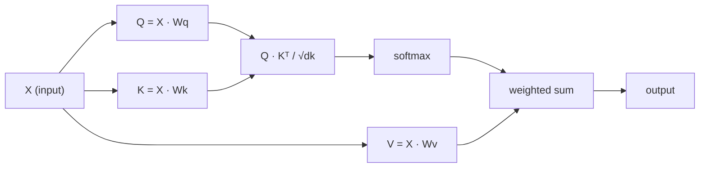

# Une attention personnelle à partir de zéro

> L'attention est une table de recherche où chaque mot demande "qui m'importe?" - et apprend la réponse.

**Type:** Build
**Languages:** Python
**Prerequisites:** Phase 3 (Deep Learning Core), Phase 5 Lesson 10 (Sequence-to-Sequence)
**Time:** ~90 minutes

## Objectifs d'apprentissage

- Implementer l'auto-attention du produit doté à l'échelle de la base en utilisant uniquement NumPy, y compris les projections de requête/clés/valeurs et la somme pondérée par softmax
- Construisez une couche d'attention multi-têtes qui divise les têtes, calculer l'attention parallèle et concatenates les résultats
- Suivez comment la matrice d'attention capture les relations de jetons et expliquez pourquoi l'échelle par sqrt(d_k) empêche la saturation de softmax
- Appliquer un masque causal pour convertir l'attention bidirectionnelle en une attention autorégressive (à la manière du décodeur)

## Le problème

Les RNN traitent les séquences d'un jeton à la fois. Au moment où vous atteignez le jeton 50, les informations du jeton 1 ont été compressées à travers 50 étapes de compression. Les dépendances à longue portée sont écrasées dans un état caché de taille fixe - un goulet d'étranglement que aucune quantité de mise en service LSTM ne résout complètement.

Le document de 2014 Bahdanau a montré la solution: laisser le décodeur regarder en arrière à chaque position d'encodeur et décider laquelle d'entre elles compte pour l'étape actuelle. Mais il était toujours coincé sur un RNN. Le document de 2017 "Attention est tout ce dont vous avez besoin" a posé une question plus pointue: et si l'attention est le *seul* mécanisme ? Pas de récurrence. Pas de convolutions.

L'auto-attention permet à chaque position d'une séquence de prendre soin de chaque autre position en une seule étape parallèle.

## Le concept

### L'analogie de recherche de base de données

Pensez à l'attention comme à une recherche de base de données douce:

```
Traditional database:
  Query: "capital of France"  -->  exact match  -->  "Paris"

Attention:
  Query: "capital of France"  -->  similarity to ALL keys  -->  weighted blend of ALL values
```

Chaque jeton génère trois vecteurs:
- **Query (Q)**"Que suis-je à la recherche ?"
- **Key (K)**"Que contiens-je ?"
- **Value (V)**: "Quelles informations dois-je fournir si elles sont sélectionnées?"

Le produit de point entre une requête et toutes les touches produit des scores d'attention.

### Q, K, V Computation

Chaque embedding de jeton est projeté à travers trois matrices de poids apprises:

```
Input embeddings (sequence of n tokens, each d-dimensional):

  X = [x1, x2, x3, ..., xn]       shape: (n, d)

Three weight matrices:

  Wq  shape: (d, dk)
  Wk  shape: (d, dk)
  Wv  shape: (d, dv)

Projections:

  Q = X @ Wq    shape: (n, dk)      each token's query
  K = X @ Wk    shape: (n, dk)      each token's key
  V = X @ Wv    shape: (n, dv)      each token's value
```

Visuellement, pour une seule preuve:

```
             Wq
  x_i ------[*]------> q_i    "What am I looking for?"
       |
       |     Wk
       +----[*]------> k_i    "What do I contain?"
       |
       |     Wv
       +----[*]------> v_i    "What do I offer?"
```

### La matrice de l'attention

Une fois que vous avez Q, K, V pour tous les jetons, les scores d'attention forment une matrice:

```
Scores = Q @ K^T    shape: (n, n)

              k1    k2    k3    k4    k5
        +-----+-----+-----+-----+-----+
   q1   | 2.1 | 0.3 | 0.1 | 0.8 | 0.2 |   <- how much q1 attends to each key
        +-----+-----+-----+-----+-----+
   q2   | 0.4 | 1.9 | 0.7 | 0.1 | 0.3 |
        +-----+-----+-----+-----+-----+
   q3   | 0.2 | 0.6 | 2.3 | 0.5 | 0.1 |
        +-----+-----+-----+-----+-----+
   q4   | 0.9 | 0.1 | 0.4 | 1.7 | 0.6 |
        +-----+-----+-----+-----+-----+
   q5   | 0.1 | 0.3 | 0.2 | 0.5 | 2.0 |
        +-----+-----+-----+-----+-----+

Each row: one token's attention over the entire sequence
```

Regardez une requête à la fois balayer les touches: chaque rangée marque chaque jeton, softmax transforme les scores en poids, et le vecteur de contexte est le mélange pondéré de valeurs.

```figure
attention-matrix
```

### Pourquoi l'échelle ?

Les produits de point augmentent avec la dimension dk. Si dk = 64, les produits de point peuvent être dans la plage des dizaines, poussant le softmax dans les régions où les gradients disparaissent.

```
Scaled scores = (Q @ K^T) / sqrt(dk)
```

Cela maintient les valeurs dans une plage où softmax produit des gradients utiles.

### Softmax transforme les scores en poids

Softmax convertit les scores bruts en une distribution de probabilité sur chaque rangée:

```
Raw scores for q1:   [2.1, 0.3, 0.1, 0.8, 0.2]
                            |
                         softmax
                            |
Attention weights:   [0.52, 0.09, 0.07, 0.14, 0.08]   (sums to ~1.0)
```

Chaque symbole a un ensemble de poids indiquant combien de temps il faut pour chaque autre symbole.

### Summe pondérée des valeurs

La sortie finale de chaque jeton est une somme pondérée de tous les vecteurs de valeur:

```
output_i = sum( attention_weight[i][j] * v_j  for all j )

For token 1:
  output_1 = 0.52 * v1 + 0.09 * v2 + 0.07 * v3 + 0.14 * v4 + 0.08 * v5
```

### L'ensemble du pipeline



Formule en une seule ligne:

```
Attention(Q, K, V) = softmax( Q @ K^T / sqrt(dk) ) @ V
```

```figure
softmax-attention-scaling
```

## Faites-le

### Étape 1: Softmax à partir de zéro

Softmax convertit les logits bruts en probabilités.

```python
import numpy as np

def softmax(x):
    shifted = x - np.max(x, axis=-1, keepdims=True)
    exp_x = np.exp(shifted)
    return exp_x / np.sum(exp_x, axis=-1, keepdims=True)

logits = np.array([2.0, 1.0, 0.1])
print(f"logits:  {logits}")
print(f"softmax: {softmax(logits)}")
print(f"sum:     {softmax(logits).sum():.4f}")
```

### Étape 2: Attention à l'échelle du produit

La fonction de base prend les matrices Q, K, V et renvoie la sortie d'attention plus la matrice de poids.

```python
def scaled_dot_product_attention(Q, K, V):
    dk = Q.shape[-1]
    scores = Q @ K.T / np.sqrt(dk)
    weights = softmax(scores)
    output = weights @ V
    return output, weights
```

### Étape 3: Classement d'auto-attention avec des projections apprises

Un module complet d'auto-attention avec des matrices de poids Wq, Wk, Wv initialisées avec une mise à l'échelle Xavier.

```python
class SelfAttention:
    def __init__(self, d_model, dk, dv, seed=42):
        rng = np.random.default_rng(seed)
        scale = np.sqrt(2.0 / (d_model + dk))
        self.Wq = rng.normal(0, scale, (d_model, dk))
        self.Wk = rng.normal(0, scale, (d_model, dk))
        scale_v = np.sqrt(2.0 / (d_model + dv))
        self.Wv = rng.normal(0, scale_v, (d_model, dv))
        self.dk = dk

    def forward(self, X):
        Q = X @ self.Wq
        K = X @ self.Wk
        V = X @ self.Wv
        output, weights = scaled_dot_product_attention(Q, K, V)
        return output, weights
```

### Étape 4: Exécutez-le sur une phrase

Créez de faux emblèmes pour une phrase et regardez les poids de l'attention.

```python
sentence = ["The", "cat", "sat", "on", "the", "mat"]
n_tokens = len(sentence)
d_model = 8
dk = 4
dv = 4

rng = np.random.default_rng(42)
X = rng.normal(0, 1, (n_tokens, d_model))

attn = SelfAttention(d_model, dk, dv, seed=42)
output, weights = attn.forward(X)

print("Attention weights (each row: where that token looks):\n")
print(f"{'':>6}", end="")
for token in sentence:
    print(f"{token:>6}", end="")
print()

for i, token in enumerate(sentence):
    print(f"{token:>6}", end="")
    for j in range(n_tokens):
        w = weights[i][j]
        print(f"{w:6.3f}", end="")
    print()
```

### Étape 5: Visualiser l'attention avec une carte de chaleur ASCII

Mettez les poids d'attention sur les personnages pour une vue rapide.

```python
def ascii_heatmap(weights, tokens, chars=" ░▒▓█"):
    n = len(tokens)
    print(f"\n{'':>6}", end="")
    for t in tokens:
        print(f"{t:>6}", end="")
    print()

    for i in range(n):
        print(f"{tokens[i]:>6}", end="")
        for j in range(n):
            level = int(weights[i][j] * (len(chars) - 1) / weights.max())
            level = min(level, len(chars) - 1)
            print(f"{'  ' + chars[level] + '   '}", end="")
        print()

ascii_heatmap(weights, sentence)
```

## Utilisez-le

Le PyTorch's `nn.MultiheadAttention`fait exactement ce que nous avons construit, plus la division multi-tête et la projection de sortie:

```python
import torch
import torch.nn as nn

d_model = 8
n_heads = 2
seq_len = 6

mha = nn.MultiheadAttention(embed_dim=d_model, num_heads=n_heads, batch_first=True)

X_torch = torch.randn(1, seq_len, d_model)

output, attn_weights = mha(X_torch, X_torch, X_torch)

print(f"Input shape:            {X_torch.shape}")
print(f"Output shape:           {output.shape}")
print(f"Attention weight shape: {attn_weights.shape}")
print(f"\nAttn weights (averaged over heads):")
print(attn_weights[0].detach().numpy().round(3))
```

La différence clé: l'attention multi-tête exécute plusieurs fonctions d'attention en parallèle, chacune avec ses propres projections Q, K, V de taille dk = d_modèle / n_têtes, puis concaténage les résultats. Cela permet au modèle d'attendre simultanément différents types de relation.

## La faire partir

Cette leçon donne:
- `outputs/prompt-attention-explainer.md`- une invitation à expliquer l'attention par l'intermédiaire d'une analogie de recherche de base de données

## Exercices

1. Modifier `scaled_dot_product_attention`pour accepter une matrice de masque facultative qui fixe certaines positions à l'infini négatif avant softmax (c'est ainsi que fonctionne le masquage causal/décodage)
2. Implémenter l'attention multi-têtes à partir de zéro: diviser Q, K, V en `n_heads`les morceaux, faire attention à chacun, concatener, et projeter à travers une matrice de poids final Wo
3. Prenez deux phrases différentes de la même longueur, les nourrissez à travers la même instance de l'Atention à soi, et comparez leurs modèles d'attention. Quels changements? Qu'est-ce qui reste le même?

## Les termes clés

| Term | What people say | What it actually means |
|------|----------------|----------------------|
| Query (Q) | "The question vector" | A learned projection of the input that represents what information this token is looking for |
| Key (K) | "The label vector" | A learned projection that represents what information this token contains, matched against queries |
| Value (V) | "The content vector" | A learned projection carrying the actual information that gets aggregated based on attention scores |
| Scaled dot-product attention | "The attention formula" | softmax(QK^T / sqrt(dk)) @ V - scaling prevents softmax saturation in high dimensions |
| Self-attention | "The token looks at itself and others" | Attention where Q, K, V all come from the same sequence, letting every position attend to every other position |
| Attention weights | "How much focus" | A probability distribution over positions, produced by softmax over scaled dot products |
| Multi-head attention | "Parallel attention" | Running multiple attention functions with different projections, then concatenating results for richer representations |

## Pour en savoir plus

- [Attention Is All You Need (Vaswani et al., 2017)](https://arxiv.org/abs/1706.03762)- le papier transformateur original
- [The Illustrated Transformer (Jay Alammar)](https://jalammar.github.io/illustrated-transformer/)- la meilleure visite visuelle de l'architecture complète
- [The Annotated Transformer (Harvard NLP)](https://nlp.seas.harvard.edu/annotated-transformer/)- mise en œuvre de PyTorch ligne par ligne avec explications
