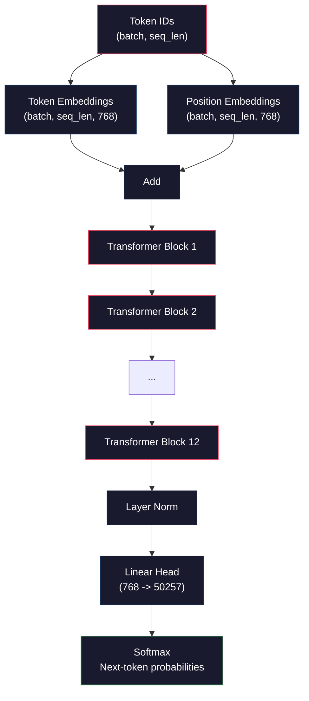
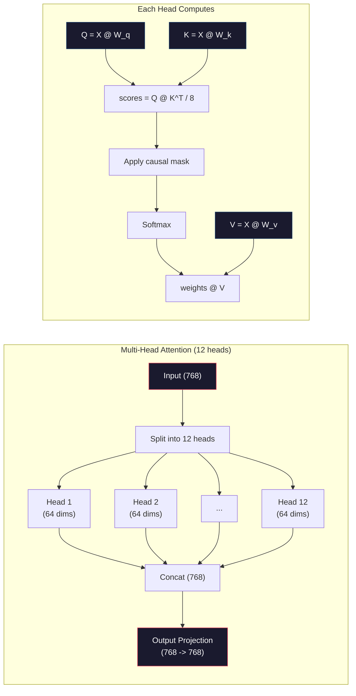
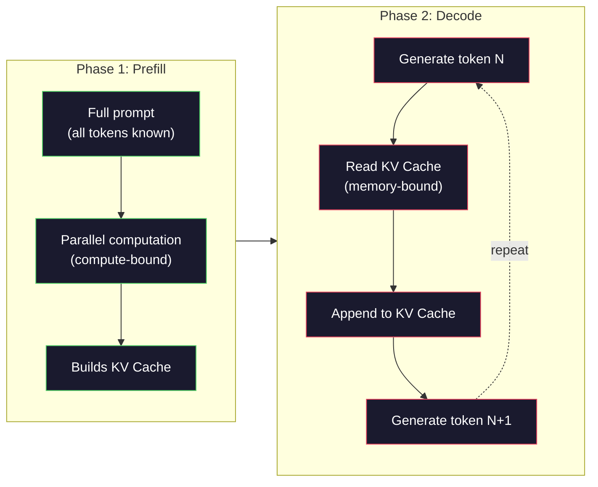

# Pré-entraînement d'un mini-GPT (124 M Parametres)

> GPT-2 Small a 124 millions de paramètres. C'est 12 couches de transformateur, 12 têtes d'attention et 768 emblèmes dimensionnels. Vous pouvez l'entraîner à partir de zéro sur un seul GPU en quelques heures. La plupart des gens ne font jamais cela. Ils utilisent des points de contrôle prétraînés. Mais si vous ne l'entraînez pas vous-même, vous ne comprenez pas vraiment ce qui se passe à l'intérieur du modèle sur lequel vous construisez des produits.

**Type:** Build
**Languages:** Python (with numpy)
**Prerequisites:** Phase 10, Lessons 01-03 (Tokenizers, Building a Tokenizer, Data Pipelines)
**Time:** ~120 minutes

## Objectifs d'apprentissage

- Implémenter l'architecture GPT-2 complète (124 M paramètres) à partir de zéro: embeddings de jetons, embeddings positionnels, blocs de transformateurs et tête de modèle de langage
- Exercer un modèle GPT sur un corpus de texte en utilisant la prédiction du prochain jeton avec perte d'entropie croisée
- Implementer la génération de texte autorégressive avec échantillonnage de température et filtration top-k/top-p
- Surveiller les courbes de perte de formation et valider que le modèle apprend des schémas linguistiques cohérents

## Le problème

Vous savez ce qu'est un transformateur, vous avez lu les diagrammes, vous pouvez réciter "l'attention est tout ce dont vous avez besoin" et dessiner des boîtes sur un tableau blanc.

Rien de tout cela ne signifie que vous comprenez ce qui se passe quand un modèle génère du texte.

Il y a 124.438.272 paramètres dans GPT-2 Small (avec liaison de poids). Chacun d'eux a été réglé en exécutant une boucle d'entraînement: passe avant, perte de calcul, passe arrière, poids de mise à jour. Douze blocs de transformateurs. Douze têtes d'attention par bloc. Un espace intégré de 768 dimensions. Un vocabulaire de 50 257 jetons. Chaque fois que le modèle génère un jeton, les 124 millions de paramètres participent à une chaîne de multiplication de matrice unique qui prend une séquence d'ID de jeton et produit une distribution de probabilité sur le jeton suivant.

Si vous n'avez jamais construit cela vous travaillez avec une boîte noire. Vous pouvez utiliser l'API. Vous pouvez affiner. Mais quand quelque chose ne va pas - quand le modèle hallucine, quand il se répète, quand il refuse de suivre les instructions - vous n'avez pas de modèle mental pour * pourquoi*.

Cette leçon construit GPT-2 Small à partir de zéro. pas en PyTorch. en numpy. chaque multiplication de matrice est visible. chaque gradient est calculé par votre code. Vous verrez exactement comment 124 millions de nombres conspirent pour prédire le prochain mot.

## Le concept

### L'architecture du GPT

GPT est un modèle de langage autorégressif. " Autorégressif " signifie qu'il génère un jeton à la fois, chacun conditionné sur tous les jetons précédents.

Voici le graphique complet des calculs des identifiants de jetons aux probabilités des jetons suivants:

1. Les identifiants de jetons sont entrés.
2. Chaque identifiant est cartographié à un vecteur 768 dimensions.
3. Chaque position (0, 1, 2, ...) est représentée par un vecteur 768 dimensions.
4. Ajouter des embeddings de jetons + des embeddings de position.
5. Passez à travers 12 blocs de transformateurs.
6. La normalisation de la couche finale.
7. La projection linéaire à la taille du vocabulaire.
8. Softmax pour obtenir des probabilités.

Il n'y a pas de convulsions, pas de récurrence, juste des emblèmes, de l'attention, des réseaux de flux et des normes de couches empilées 12 fois.



### Le bloc de transformateur

Chacun des 12 blocs suit le même schéma.

1. LayerNorm
2. Une attention personnelle à plusieurs têtes
3. Connexion résiduelle (ajouter l'entrée en arrière)
4. LayerNorm
5. Réseau de transmission de données (RMS)
6. Connexion résiduelle (ajouter l'entrée en arrière)

Les connexions résiduelles sont essentielles. Sans elles, les gradients disparaissent au moment où ils atteignent le bloc 1 lors de la rétrécissement. Avec eux, les gradients peuvent couler directement de la perte à n'importe quelle couche à travers le chemin "salter". C'est pourquoi vous pouvez empiler 12, 32 ou même 96 blocs (GPT-4 est censé utiliser 120).

### Attention: Le mécanisme principal

L'auto-attention permet à chaque jeton de regarder chaque jeton précédent et de décider combien d'attention à chaque jeton.

Pour chaque position de jeton, calculer trois vecteurs à partir de l'entrée:
- **Query (Q)**"Que suis-je à la recherche ?"
- **Key (K)**"Que contiens-je ?"
- **Value (V)**"Quelles informations ai-je à porter?"

```
Q = input @ W_q    (768 -> 768)
K = input @ W_k    (768 -> 768)
V = input @ W_v    (768 -> 768)

attention_scores = Q @ K^T / sqrt(d_k)
attention_scores = mask(attention_scores)   # causal mask: -inf for future positions
attention_weights = softmax(attention_scores)
output = attention_weights @ V
```

Le masque causal est ce qui rend le GPT autorégressif. La position 5 peut prendre en charge les positions 0-5 mais pas 6, 7, 8, etc. Cela empêche le modèle de " tricher " en regardant les futurs jetons pendant l'entraînement.

**Multi-head attention**L'un des deux capteurs peut suivre les relations syntaxiques (accord sujet-verbe). Un autre peut suivre la similitude sémantique (synonymes). Un autre peut suivre la proximité positionnelle (mot proche). Les sorties des 12 capteurs sont concatenées et projetées vers 768 dimensions.



La division par sqrt(d_k) -- sqrt(64) = 8 -- est en train de s'élargir. Sans elle, les produits de point deviennent plus grands pour les vecteurs haute dimension, poussant le softmax dans des régions où les gradients sont presque zéro. C'était l'une des idées clés dans le papier original "Attention is All You Need".

### KV Cache: Pourquoi l'inférence est rapide

Pendant la formation, vous traitez toute la séquence à la fois. Pendant l'inférence, vous générez un jeton à la fois. Sans optimisation, générer un jeton N nécessite de recomputer l'attention pour tous les jetons précédents N-1.

KV Cache résout ça. Après avoir calculé K et V pour chaque jeton, stockez-les. Lorsque vous générez des jetons N + 1, vous devez seulement calculer Q pour le nouveau jeton et rechercher les K et V en cache de tous les jetons précédents. Cela réduit le coût par jeton de O(N) à O(1) pour le calcul K et V. Le calcul du score d'attention est toujours O(N) parce que vous prenez toutes les positions précédentes, mais vous évitez les multiplications de matrice redondantes sur l'entrée.

Pour GPT-2 avec 12 couches et 12 têtes, le cache KV stocke 2 (K + V) x 12 couches x 12 têtes x 64 dims = 18 432 valeurs par jeton. Pour une séquence de 1024 jetons, c'est environ 75 MB en FP32. Pour Llama 3 405B avec 128 couches, le cache KV pour une seule séquence peut dépasser 10 GB. C'est pourquoi l'inférence de long contexte est liée à la mémoire.

### Préfill vs Décode: deux phases d'inférence

Quand vous envoyez une demande à un LLM, l'inférence se fait en deux phases distinctes.

**Prefill**Le processeur de processeur de la carte graphique traite l'ensemble de votre prompt en parallèle. Tous les tokens sont connus, de sorte que le modèle peut calculer l'attention pour toutes les positions simultanément. Cette phase est liée au calcul - le GPU effectue des multiplications de matrice à plein débit. Pour un prompt de 1000 tokens sur un A100, le pré-remplissage prend environ 20 à 50 ms.

**Decode**génère des jetons un à la fois. Chaque nouveau jeton dépend de tous les jetons précédents. Cette phase est liée à la mémoire -- le goulot d'étranglement est la lecture des poids du modèle et du cache KV de la mémoire GPU, pas la mathématique de la matrice elle-même. Les cœurs de calcul du GPU sont en grande partie inactifs en attendant les lectures de mémoire. Pour GPT-2, chaque étape de décode prend environ le même temps, quel que soit le nombre de FLOPs requis par les matmuls, car la bande passante de la mémoire est la contrainte.

Cette distinction est importante pour les systèmes de production. Remplissez les échelles de débit avec le calcul GPU (plus de FLOPS = pré-remplissement plus rapide). Décodez les échelles de débit avec la bande passante mémoire (mémoire plus rapide = décode plus rapide). C'est pourquoi le H100 de NVIDIA s'est concentré sur les améliorations de la bande passante mémoire par rapport à l'A100 - il accélère directement la génération de jetons.



### Le cycle de formation

La formation d'un LLM est la prédiction du prochain jeton.

Une étape de formation:

1. **Forward pass**: Exécuter le lot à travers les 12 blocs. Obtenir des logits (scores pré-softmax) pour chaque position.
2. **Compute loss**: Entropie croisée entre logits et jetons cibles (l'entrée déplacée par une position).
3. **Backward pass**: Comptez les gradients pour tous les paramètres 124M en utilisant la propagation à l'arrière.
4. **Optimizer step**GPT-2 utilise Adam pour réchauffer le taux d'apprentissage et déclin cosyinal.

Le programme de taux d'apprentissage compte plus que ce à quoi vous vous attendez. GPT-2 se réchauffe de 0 au taux d'apprentissage maximal au cours des deux premières étapes, puis se décompose suivant une courbe cosine.

### GPT-2 Petit: les chiffres

| Component | Shape | Parameters |
|-----------|-------|------------|
| Token embeddings | (50257, 768) | 38,597,376 |
| Position embeddings | (1024, 768) | 786,432 |
| Per-block attention (W_q, W_k, W_v, W_out) | 4 x (768, 768) | 2,359,296 |
| Per-block FFN (up + down) | (768, 3072) + (3072, 768) | 4,718,592 |
| Per-block LayerNorms (2x) | 2 x 768 x 2 | 3,072 |
| Final LayerNorm | 768 x 2 | 1,536 |
| **Total per block** | | **7,080,960** |
| **Total (12 blocks)** | | **85,054,464 + 39,383,808 = 124,438,272** |

La projection de sortie (tête de logits) partage des poids avec la matrice d'intégration de jeton. Cela s'appelle liage de poids - il réduit le nombre de paramètres de 38M et améliore les performances car il oblige le modèle à utiliser le même espace de représentation pour l'entrée et la sortie.

## Faites-le

### Étape 1: Intégrer une couche

Les emplacements de jetons cartographient chacun des 50 257 jetons possibles à un vecteur 768 dimensions.

```python
import numpy as np

class Embedding:
    def __init__(self, vocab_size, embed_dim, max_seq_len):
        self.token_embed = np.random.randn(vocab_size, embed_dim) * 0.02
        self.pos_embed = np.random.randn(max_seq_len, embed_dim) * 0.02

    def forward(self, token_ids):
        seq_len = token_ids.shape[-1]
        tok_emb = self.token_embed[token_ids]
        pos_emb = self.pos_embed[:seq_len]
        return tok_emb + pos_emb
```

La déviation standard de 0,02 pour l'initialisation provient du papier GPT-2. trop grand et les passes avant initiales produisent des valeurs extrêmes qui déstabilisent la formation. trop petit et les sorties initiales sont presque identiques pour toutes les entrées, rendant inutiles les signaux de gradient précoces.

### Étape 2: Attention à soi avec masque de causalité

Le masque de causalité fixe les positions futures à l'infini négatif avant le softmax, en veillant à ce que chaque position ne puisse s'occuper que de lui-même et des positions antérieures.

```python
def attention(Q, K, V, mask=None):
    d_k = Q.shape[-1]
    scores = Q @ K.transpose(0, -1, -2 if Q.ndim == 4 else 1) / np.sqrt(d_k)
    if mask is not None:
        scores = scores + mask
    weights = np.exp(scores - scores.max(axis=-1, keepdims=True))
    weights = weights / weights.sum(axis=-1, keepdims=True)
    return weights @ V
```

La mise en œuvre de softmax soustrait le maximum avant d'exponentier. Sans cela, exp(large_number) dépasse à l'infini. Il s'agit d'un truc de stabilité numérique qui ne change pas la sortie car softmax(x - c) = softmax(x) pour n'importe quelle constante c.

### Étape 3: Attention à plusieurs têtes

Divisez l'entrée 768-dimensionnelle en 12 têtes de 64 dimensions chacune. Chaque tête calcule l'attention de manière indépendante. Concaténez les résultats et projeter à nouveau à 768 dimensions.

```python
class MultiHeadAttention:
    def __init__(self, embed_dim, num_heads):
        self.num_heads = num_heads
        self.head_dim = embed_dim // num_heads
        self.W_q = np.random.randn(embed_dim, embed_dim) * 0.02
        self.W_k = np.random.randn(embed_dim, embed_dim) * 0.02
        self.W_v = np.random.randn(embed_dim, embed_dim) * 0.02
        self.W_out = np.random.randn(embed_dim, embed_dim) * 0.02

    def forward(self, x, mask=None):
        batch, seq_len, d = x.shape
        Q = (x @ self.W_q).reshape(batch, seq_len, self.num_heads, self.head_dim).transpose(0, 2, 1, 3)
        K = (x @ self.W_k).reshape(batch, seq_len, self.num_heads, self.head_dim).transpose(0, 2, 1, 3)
        V = (x @ self.W_v).reshape(batch, seq_len, self.num_heads, self.head_dim).transpose(0, 2, 1, 3)

        scores = Q @ K.transpose(0, 1, 3, 2) / np.sqrt(self.head_dim)
        if mask is not None:
            scores = scores + mask
        weights = np.exp(scores - scores.max(axis=-1, keepdims=True))
        weights = weights / weights.sum(axis=-1, keepdims=True)
        attn_out = weights @ V

        attn_out = attn_out.transpose(0, 2, 1, 3).reshape(batch, seq_len, d)
        return attn_out @ self.W_out
```

La danse de remodelage-transposition-remodelage est la partie la plus déroutante de l'attention multi-têtes. Voici ce qui se passe: le (batch, seq_len, 768) tensor devient (batch, seq_len, 12, 64), puis (batch, 12, seq_len, 64). Maintenant, chacune des 12 têtes a sa propre matrice (seq_len, 64) pour faire tourner l'attention. Après l'attention, nous inversons le processus: (batch, 12, seq_len, 64) devient (batch, seq_len, 12, 64) devient (batch, seq_len, 768).

### Étape 4: Bloc de transformateur

Un bloc transformateur complet: LayerNorm, attention multi-tête avec résiduel, LayerNorm, feedforward avec résiduel.

```python
class LayerNorm:
    def __init__(self, dim, eps=1e-5):
        self.gamma = np.ones(dim)
        self.beta = np.zeros(dim)
        self.eps = eps

    def forward(self, x):
        mean = x.mean(axis=-1, keepdims=True)
        var = x.var(axis=-1, keepdims=True)
        return self.gamma * (x - mean) / np.sqrt(var + self.eps) + self.beta


class FeedForward:
    def __init__(self, embed_dim, ff_dim):
        self.W1 = np.random.randn(embed_dim, ff_dim) * 0.02
        self.b1 = np.zeros(ff_dim)
        self.W2 = np.random.randn(ff_dim, embed_dim) * 0.02
        self.b2 = np.zeros(embed_dim)

    def forward(self, x):
        h = x @ self.W1 + self.b1
        h = np.maximum(0, h)  # GELU approximation: ReLU for simplicity
        return h @ self.W2 + self.b2


class TransformerBlock:
    def __init__(self, embed_dim, num_heads, ff_dim):
        self.ln1 = LayerNorm(embed_dim)
        self.attn = MultiHeadAttention(embed_dim, num_heads)
        self.ln2 = LayerNorm(embed_dim)
        self.ffn = FeedForward(embed_dim, ff_dim)

    def forward(self, x, mask=None):
        x = x + self.attn.forward(self.ln1.forward(x), mask)
        x = x + self.ffn.forward(self.ln2.forward(x))
        return x
```

Le réseau feedforward étend l'entrée 768-dimensionnelle à 3 072 dimensions (4x), applique une non-linéarité, puis projette de nouveau à 768. Ce modèle d'expansion-contrition donne au modèle une représentation interne " plus large " pour travailler à chaque position. GPT-2 utilise l'activation GELU, mais nous utilisons ReLU ici pour la simplicité - la différence est mineure pour comprendre l'architecture.

### Étape 5: Modèle GPT complet

En pile 12 blocs de transformateurs, ajoutez la couche d'emballage à l'avant et la projection de sortie à l'arrière.

```python
class MiniGPT:
    def __init__(self, vocab_size=50257, embed_dim=768, num_heads=12,
                 num_layers=12, max_seq_len=1024, ff_dim=3072):
        self.embedding = Embedding(vocab_size, embed_dim, max_seq_len)
        self.blocks = [
            TransformerBlock(embed_dim, num_heads, ff_dim)
            for _ in range(num_layers)
        ]
        self.ln_f = LayerNorm(embed_dim)
        self.vocab_size = vocab_size
        self.embed_dim = embed_dim

    def forward(self, token_ids):
        seq_len = token_ids.shape[-1]
        mask = np.triu(np.full((seq_len, seq_len), -1e9), k=1)

        x = self.embedding.forward(token_ids)
        for block in self.blocks:
            x = block.forward(x, mask)
        x = self.ln_f.forward(x)

        logits = x @ self.embedding.token_embed.T
        return logits

    def count_parameters(self):
        total = 0
        total += self.embedding.token_embed.size
        total += self.embedding.pos_embed.size
        for block in self.blocks:
            total += block.attn.W_q.size + block.attn.W_k.size
            total += block.attn.W_v.size + block.attn.W_out.size
            total += block.ffn.W1.size + block.ffn.b1.size
            total += block.ffn.W2.size + block.ffn.b2.size
            total += block.ln1.gamma.size + block.ln1.beta.size
            total += block.ln2.gamma.size + block.ln2.beta.size
        total += self.ln_f.gamma.size + self.ln_f.beta.size
        return total
```

Notez la liaison de poids: `logits = x @ self.embedding.token_embed.T`. La projection de sortie réutilise la matrice d'embedding des jetons (transposée). Il ne s'agit pas seulement d'un truc de sauvegarde de paramètres.

### Étape 6: cycle d'entraînement

Pour une véritable course d'entraînement sur 124M paramètres, vous auriez besoin d'un GPU et PyTorch. Cette boucle d'entraînement démontre la mécanique sur un petit modèle qui fonctionne en pure numpy. Nous utilisons un petit modèle (4 couches, 4 têtes, 128 dims) pour le rendre traitable.

```python
def cross_entropy_loss(logits, targets):
    batch, seq_len, vocab_size = logits.shape
    logits_flat = logits.reshape(-1, vocab_size)
    targets_flat = targets.reshape(-1)

    max_logits = logits_flat.max(axis=-1, keepdims=True)
    log_softmax = logits_flat - max_logits - np.log(
        np.exp(logits_flat - max_logits).sum(axis=-1, keepdims=True)
    )

    loss = -log_softmax[np.arange(len(targets_flat)), targets_flat].mean()
    return loss


def train_mini_gpt(text, vocab_size=256, embed_dim=128, num_heads=4,
                   num_layers=4, seq_len=64, num_steps=200, lr=3e-4):
    tokens = np.array(list(text.encode("utf-8")[:2048]))
    model = MiniGPT(
        vocab_size=vocab_size, embed_dim=embed_dim, num_heads=num_heads,
        num_layers=num_layers, max_seq_len=seq_len, ff_dim=embed_dim * 4
    )

    print(f"Model parameters: {model.count_parameters():,}")
    print(f"Training tokens: {len(tokens):,}")
    print(f"Config: {num_layers} layers, {num_heads} heads, {embed_dim} dims")
    print()

    for step in range(num_steps):
        start_idx = np.random.randint(0, max(1, len(tokens) - seq_len - 1))
        batch_tokens = tokens[start_idx:start_idx + seq_len + 1]

        input_ids = batch_tokens[:-1].reshape(1, -1)
        target_ids = batch_tokens[1:].reshape(1, -1)

        logits = model.forward(input_ids)
        loss = cross_entropy_loss(logits, target_ids)

        if step % 20 == 0:
            print(f"Step {step:4d} | Loss: {loss:.4f}")

    return model
```

La perte commence près de ln(vocab_size) - pour un vocabulaire de niveau octet de 256 jetons, c'est ln(256) = 5.55. Un modèle aléatoire attribue une probabilité égale à chaque jeton.

Dans la production, vous utiliserez l'optimisateur Adam avec accumulation de gradients, réchauffement du taux d'apprentissage et coupage de gradients.

### Étape 7: génération de texte

La génération utilise le modèle formé pour prédire un jeton à la fois.

```python
def generate(model, prompt_tokens, max_new_tokens=100, temperature=0.8):
    tokens = list(prompt_tokens)
    seq_len = model.embedding.pos_embed.shape[0]

    for _ in range(max_new_tokens):
        context = np.array(tokens[-seq_len:]).reshape(1, -1)
        logits = model.forward(context)
        next_logits = logits[0, -1, :]

        next_logits = next_logits / temperature
        probs = np.exp(next_logits - next_logits.max())
        probs = probs / probs.sum()

        next_token = np.random.choice(len(probs), p=probs)
        tokens.append(next_token)

    return tokens
```

La température contrôle la randomisation. La température 1.0 utilise la distribution brute. La température 0.5 l'aiguise (plus déterministe - le modèle choisit ses meilleurs choix plus souvent). La température 1.5 l'applique (plus aléatoire - les jetons à faible probabilité ont une plus grande chance). La température 0.0 est un décoding avide (choisissez toujours le jeton à plus grande probabilité).

Le `tokens[-seq_len:]`La fenêtre est nécessaire parce que le modèle a une longueur de contexte maximale (1024 pour GPT-2). Une fois que vous l'avez dépassée, vous devez laisser tomber les jetons les plus anciens.

```figure
sampling-decoder
```

## Utilisez-le

### Formation complète et démonstration de génération

```python
corpus = """The transformer architecture has revolutionized natural language processing.
Attention mechanisms allow the model to focus on relevant parts of the input.
Self-attention computes relationships between all pairs of positions in a sequence.
Multi-head attention splits the representation into multiple subspaces.
Each attention head can learn different types of relationships.
The feedforward network provides nonlinear transformations at each position.
Residual connections enable gradient flow through deep networks.
Layer normalization stabilizes training by normalizing activations.
Position embeddings give the model information about token ordering.
The causal mask ensures autoregressive generation during training.
Pre-training on large text corpora teaches the model general language understanding.
Fine-tuning adapts the pre-trained model to specific downstream tasks."""

model = train_mini_gpt(corpus, num_steps=200)

prompt = list("The transformer".encode("utf-8"))
output_tokens = generate(model, prompt, max_new_tokens=100, temperature=0.8)
generated_text = bytes(output_tokens).decode("utf-8", errors="replace")
print(f"\nGenerated: {generated_text}")
```

Sur un petit corpus avec un petit modèle, le texte généré sera semi-cohérent au mieux. Il apprendra certains modèles de niveau octet du texte de formation mais ne peut pas généraliser la façon dont GPT-2 fait avec 40 Go de données de formation et l'architecture complète de paramètres 124M. Le problème n'est pas la qualité de la sortie. Le point est que vous pouvez suivre chaque étape: intégrer la recherche, calcul de l'attention, transformation de l'alimentation, projection logite, softmax et prélèvement d'échantillons. Chaque opération est visible.

## La faire partir

Cette leçon produit `outputs/prompt-gpt-architecture-analyzer.md`-- une requête qui analyse les choix d'architecture dans n'importe quel modèle de style GPT. Il lui donne une carte modèle ou un rapport technique et il décompose l'allocation des paramètres, la conception de l'attention et les décisions d'échelle.

## Exercices

1. Modifiez le modèle pour utiliser 24 couches et 16 têtes au lieu de 12/12.

2. Implémenter la fonction d'activation GELU (GELU(x) = x * 0.5 * (1 + erf(x / sqrt(2)))) et remplacer la ReLU dans le réseau de flux.

3. Ajoutez un cache KV à la fonction de génération. Conservez les tensors K et V pour chaque couche après le premier passage vers l'avant, et réutilisez-les pour les jetons ultérieurs. Mesurez la vitesse: générez 200 jetons avec et sans le cache et comparez le temps de l'horloge murale.

4. Prenez l'échantillonnage top-k (considérez uniquement les jetons de la plus grande probabilité k) et le top-p (échantillonnage nucléaire: considérez le plus petit ensemble de jetons dont la probabilité cumulée dépasse p).

5. Construisez un plotter de courbe de perte d'entraînement. Prenez le modèle pour 1000 étapes et la perte de graphie par rapport à l'étape. Identifiez les trois phases: descente initiale rapide (apprentissage des octets communs), phase moyenne plus lente (apprentissage des octets), et plateau (surmontation sur le petit corpus).

## Les termes clés

| Term | What people say | What it actually means |
|------|----------------|----------------------|
| Autoregressive | "It generates one word at a time" | Each output token is conditioned on all previous tokens -- the model predicts P(token_n \| token_0, ..., token_{n-1}) |
| Causal mask | "It can't see the future" | An upper-triangular matrix of -infinity values that prevents attention to future positions during training |
| Multi-head attention | "Multiple attention patterns" | Splitting Q, K, V into parallel heads (e.g., 12 heads of 64 dims each for GPT-2) so each head can learn different relationship types |
| KV Cache | "Caching for speed" | Storing computed Key and Value tensors from previous tokens to avoid redundant computation during autoregressive generation |
| Prefill | "Processing the prompt" | The first inference phase where all prompt tokens are processed in parallel -- compute-bound on GPU FLOPS |
| Decode | "Generating tokens" | The second inference phase where tokens are generated one at a time -- memory-bound on GPU bandwidth |
| Weight tying | "Sharing embeddings" | Using the same matrix for input token embeddings and the output projection head -- saves 38M params in GPT-2 |
| Residual connection | "Skip connection" | Adding the input directly to the output of a sublayer (x + sublayer(x)) -- enables gradient flow in deep networks |
| Layer normalization | "Normalizing activations" | Normalizing across the feature dimension to mean 0 and variance 1, with learnable scale and bias parameters |
| Cross-entropy loss | "How wrong the predictions are" | -log(probability assigned to the correct next token), averaged over all positions -- the standard LLM training objective |

## Pour en savoir plus

- [Radford et al., 2019 -- "Language Models are Unsupervised Multitask Learners" (GPT-2)](https://cdn.openai.com/better-language-models/language_models_are_unsupervised_multitask_learners.pdf)-- le papier GPT-2 qui a introduit la famille de paramètres 124M à 1.5B
- [Vaswani et al., 2017 -- "Attention Is All You Need"](https://arxiv.org/abs/1706.03762)-- le papier transformateur original avec une attention de produit à pointillés et une attention de tête multiples
- [Llama 3 Technical Report](https://arxiv.org/abs/2407.21783)-- comment Meta a étalé l'architecture GPT à 405B paramètres avec des GPU 16K
- [Pope et al., 2022 -- "Efficiently Scaling Transformer Inference"](https://arxiv.org/abs/2211.05102)-- le document qui a formalisé le pré-remplissage versus décode et KV cache analyse
