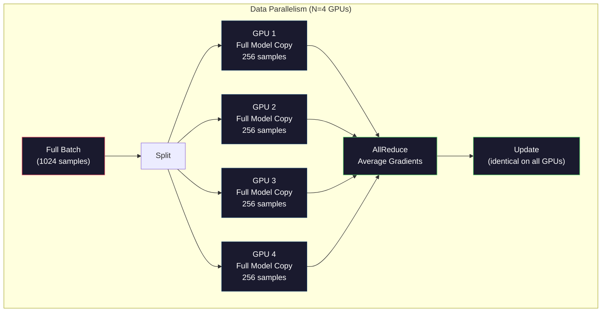
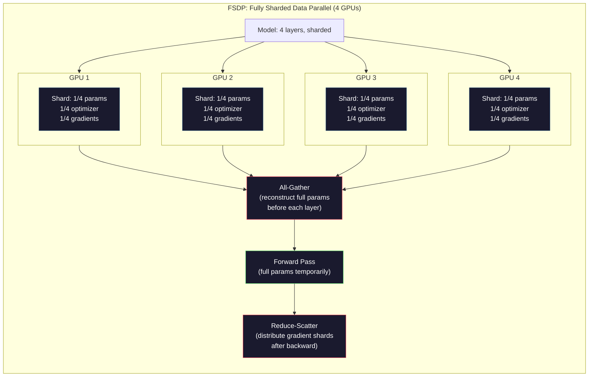
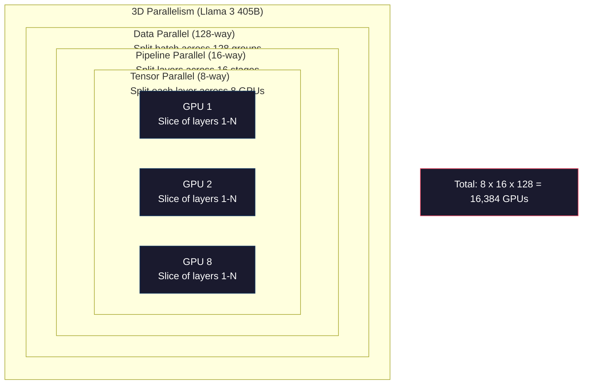

# Équivalent à la taille de l'équipement: formation distribuée, FSDP, DeepSpeed

> Votre modèle 124M a été formé sur un GPU. Maintenant essayez 7 milliards de paramètres. Le modèle ne s'adapte pas à la mémoire. Les données prennent des semaines sur une seule machine.

**Type:** Build
**Languages:** Python
**Prerequisites:** Phase 10, Lesson 04 (Pre-Training a Mini GPT)
**Time:** ~120 minutes

## Objectifs d'apprentissage

- Expliquer les trois types de parallélisme (données, tensor, pipeline) et quand chacun est nécessaire en fonction du modèle et de la taille du cluster
- Implémenter une formation parallèle des données à l'aide de PyTorch DDP avec synchronisation des gradients sur plusieurs GPU
- Calculer le budget de mémoire pour une taille de modèle donnée (poids + états d'optimisation + gradients + activations) pour déterminer le minimum de matériel
- Configurer les étapes FSDP ou DeepSpeed ZeRO pour fragmenter les états du modèle sur les GPU et les modèles de compatibilité qui dépassent la mémoire GPU unique

## Le problème

Un modèle de paramètre 7B dans FP16 a besoin de 14 Go juste pour les poids. Adam optimisateur stocke deux copies supplémentaires de chaque paramètre (estimation du premier et du deuxième moment). C'est un autre 28 Go. Gradients pendant la propagation arrière ajouter 14 Go de plus. Vous êtes à 56 Go avant qu'une seule activation est stockée.

Une NVIDIA A100 a 80 Go de mémoire.

56 Go sur 80 Go consommé. Cela laisse 24 Go pour les activations - les valeurs intermédiaires calculées pendant le passage vers l'avant qui doivent être maintenues en vie pour la propagation vers l'arrière. Pour une séquence de 2048 jetons avec un modèle 4096 dimensions, les activations d'une seule couche utilisent environ 64 Go. Avec 32 couches, vous avez besoin de 2 Go par échantillon. Une taille de lot de 8 nécessite 16 Go. Vous avez 24 Go. Une taille de lot de 12 explose.

Maintenant essayez les paramètres 70B. Poids seuls: 140 Go en FP16. Ne pas monter sur un GPU. Vous avez besoin d'au moins 2 A100 (2 x 80 Go = 160 Go) juste pour tenir les poids. Ajoutez des états d'optimisation et des gradients et vous avez besoin de beaucoup plus: 3+ GPU minimum, et réaliste 8-16 selon la stratégie de fragmentation.

Llama 3 405B a été entraîné sur 16 384 GPU NVIDIA H100.$100 million in compute. DeepSeek V3 trained a comparable model for roughly $5,6 millions en étant intelligents sur l'architecture (Mixure d'experts signifie seulement une fraction des paramètres activés par jeton) et l'efficacité de la formation.

Cette leçon couvre les quatre stratégies qui permettent de former à grande échelle: le parallélisme des données, le parallélisme tensor, le parallélisme des pipelines et le parallélisme des données complètement fragmentées. Vous simulerez chacune d'elles en Python pur pour comprendre la mécanique avant de toucher un cadre de formation distribué.

## Le concept

### Pourquoi la distribution est nécessaire

Voici les mathématiques de la mémoire pour les modèles réels.

| Model | Params | Weights (FP16) | Adam States | Gradients (FP16) | Total (no activations) |
|-------|--------|----------------|-------------|------------------|----------------------|
| GPT-2 Small | 124M | 248 MB | 992 MB | 248 MB | 1.5 GB |
| Llama 3 8B | 8B | 16 GB | 64 GB | 16 GB | 96 GB |
| Llama 3 70B | 70B | 140 GB | 560 GB | 140 GB | 840 GB |
| Llama 3 405B | 405B | 810 GB | 3,240 GB | 810 GB | 4,860 GB |

La colonne "Adam States" est le tueur. Adam stocke une moyenne en cours d'exécution (m) et une variance en cours d'exécution (v) pour chaque paramètre, à la fois dans FP32. Pour un modèle 70B, c'est 70B x 4 octets x 2 = 560 Go. L'optimisateur seul a besoin de sept A100.

Un seul H100 a 80 Go. Llama 3 405B a besoin d'au moins 61 H100 pour maintenir les poids, l'optimisateur et les gradients. Ajoutez des activations et le nombre augmente encore. Meta a utilisé 16 384 GPU non parce qu'ils voulaient - parce qu'ils devaient.

### Parallélisme des données

La stratégie distribuée la plus simple. Copiez l'ensemble du modèle en N GPU. Divisez chaque lot d'entraînement en N parties égales. Chaque GPU effectue un passage vers l'avant et vers l'arrière sur son fragment de données. Après le passage vers l'arrière, faites la moyenne des gradients sur tous les GPU. Chaque GPU met à jour sa copie des poids avec les mêmes gradients moyens, en gardant toutes les copies en synchronisation.

**The good:**L'échelle de débit linéaire. N GPUs traiter N fois plus de données par étape. La communication est limitée à la moyenne de gradient, qui se chevauchent avec le calcul.

**The bad:**Chaque GPU contient une copie complète du modèle, des états d'optimisation et des gradients. Pour un modèle 70B, chaque GPU a besoin de 840 Go. Le parallélisme des données ne réduit rien à la mémoire par GPU.

**The math:**La taille de lot efficace = par_gpu_batch_size x N. Pour N=64 GPU avec par-GPU lot de 16, le lot efficace est de 1.024. Llama 3 a utilisé une taille de lot efficace de 16 millions de jetons par étape.



### Parallélisme des tensors

Divisez les couches individuelles entre les GPU. Une seule multiplication de matrice est divisée entre les GPU, chaque partie de calcul du résultat.

Considérez une matrice de poids de forme (8192, 8192) dans une couche de flux. Avec un parallélisme tensor à quatre voies, chaque GPU contient une tranche (8192, 2048). Chaque GPU multiplie l'entrée par sa tranche, produisant un résultat partiel. Les résultats partiels sont combinés (via all-reduce ou all-gather) pour produire la sortie complète.

**The good:**Réduit la mémoire par GPU pour les poids du modèle. Un modèle 70B divisé en 8 GPU signifie que chaque GPU contient des poids d'environ 8,75B.

**The bad:**Il nécessite une communication inter-GPU rapide après chaque couche. Le tout-réduire après chaque matmul ajoute une latence. Cela fonctionne bien avec NVLink (900 GB / s entre les GPU sur le même nœud) mais mal entre les nœuds connectés par InfiniBand (400 Gb / s, environ 50 GB / s).

**Real usage:**Megatron-LM a été le pionnier du parallélisme tensoriel. Llama 3 405B utilise un parallélisme tensoriel à 8 voies dans chaque nœud.

### Parallélisme du pipeline

Le GPU 1 exécute les couches 1-8. Le GPU 2 exécute les couches 9-16. Le GPU 3 exécute les couches 17-24. Le GPU 4 exécute les couches 25-32. Les données circulent dans le pipeline: le GPU 1 calcule ses couches et envoie des activations au GPU 2, qui calcule ses couches et envoie au GPU 3, et ainsi de suite.

**The good:**La communication minimale entre les GPU -- juste les activations aux limites de couches, qui sont petites par rapport aux gradients ou aux poids. Fonctionne sur les nœuds parce que les exigences en bande passante sont faibles.

**The bad:**Les GPU 4 sont inactifs (ils ont déjà redirigé leur partie). Pendant le passage arrière, le schéma s'inverse. Avec une pipeline naïve, l'utilisation de la GPU est seulement 1/N pour les étapes de pipeline N.

**GPipe and PipeDream**Résoudre le problème de la bulle en divisant le lot en micro-parties. GPU 1 démarre sur micro-partie 2 dès qu'il termine de transmettre micro-partie 1. Ce comptage se chevauchera sur les étapes du pipeline. Avec M micro-parties et N étapes, la fraction de bulle tombe à (N-1) / M. Utilisez M = 16 micro-parties avec N = 4 étapes et la bulle est 3/16 = 18,75% temps de temps d'arrêt.

### FSDP: données parallèles entièrement fragmentées

FSDP combine l'évolutivité du parallélisme des données avec l'efficacité de la mémoire du sharding. Au lieu de chaque GPU contenant une copie complète du modèle, chaque GPU ne contient que 1/N des paramètres, des gradients et des états d'optimisation.

Avant le passage vers l'avant d'une couche, le FSDP exécute un **all-gather**Pour collecter les paramètres complets de tous les GPU dans la mémoire de chaque GPU. Après le passage vers l'avant, chaque GPU rejette les paramètres non locaux. Pendant le retrait, le tout-ensemble se déroule à nouveau pour reconstruire les paramètres pour le calcul des gradients. Après le passage vers l'arrière, un **reduce-scatter**distribue des fragments de gradients de sorte que chaque GPU ne stocke que 1/N des gradients.

**The math for a 70B model on 8 GPUs:**

| Component | Without FSDP | With FSDP |
|-----------|-------------|-----------|
| Weights (FP16) | 140 GB per GPU | 17.5 GB per GPU |
| Adam States (FP32) | 560 GB per GPU | 70 GB per GPU |
| Gradients (FP16) | 140 GB per GPU | 17.5 GB per GPU |
| **Total** | **840 GB per GPU** | **105 GB per GPU** |

Sans FSDP, vous ne pouvez pas installer un modèle 70B sur un seul GPU de 80 Go. Avec FSDP sur 8 GPU, chaque GPU utilise 105 Go - attendez, cela ne convient toujours pas. Vous avez besoin d'au moins 16 GPU pour atteindre 80 Go par GPU, ou vous combinez FSDP avec le contrôle d'activation (recomptez les activations en arrière au lieu de les stocker).

Le coût de la communication est plus élevé que le parallélisme des données vanille en raison de la collecte avant chaque couche.



### ZERO à haute vitesse

Le ZeRO (Zero Redundancy Optimizer) de DeepSpeed est conceptuellement identique à FSDP mais a été développé indépendamment par Microsoft.

| Stage | Shards | Memory Savings | Communication |
|-------|--------|---------------|---------------|
| ZeRO-1 | Optimizer states only | ~4x reduction | Same as data parallel |
| ZeRO-2 | + Gradients | ~8x reduction | Slightly more |
| ZeRO-3 | + Parameters | ~Nx reduction (N GPUs) | All-gather per layer |

ZeRO-3 est équivalent à FSDP. Le nom est différent, le mécanisme est le même. PyTorch a ajouté FSDP comme une mise en œuvre native après que DeepSpeed ait prouvé le concept.

DeepSpeed a également introduit ZeRO-Offload (états de décharge optimisateur à la RAM du processeur, qui est moins cher et plus grand) et ZeRO-Infinity (décharge à des SSD NVMe). Ces vitesses de calcul de la capacité de mémoire - les opérations déchargées sont plus lentes mais libèrent la mémoire de la GPU.

### Formation à la précision mixte

La formation moderne utilise simultanément plusieurs formats de points flottants:

- **Forward pass**Les matrices fonctionnent deux fois plus vite sur les cœurs tensoriels.
- **Master weights**: FP32 (32 bits). Maintenu par l'optimisateur pour une précision numérique lors des mises à jour de poids.
- **Loss scaling**: Multipliez la perte par une constante importante avant le passage en arrière pour empêcher les gradients FP16 de descendre à zéro. Divisez par la même constante avant l'étape d'optimisation.

Le BF16 (Brain Float 16) a la même gamme d'exponents que le FP32 (8 bits d'exponents) mais une précision réduite (7 bits de mantissa contre 23 de FP32). Il a rarement besoin d'une mise à l'échelle des pertes car il peut représenter la même gamme de valeurs.

Les TPU de Google utilisent BF16 natively. A100 et H100 de NVIDIA supportent à la fois FP16 et BF16.

**Memory comparison for a 7B model:**

| Precision | Weights | Optimizer | Gradients | Total |
|-----------|---------|-----------|-----------|-------|
| FP32 everywhere | 28 GB | 56 GB | 28 GB | 112 GB |
| Mixed (BF16 + FP32 master) | 14 GB | 56 GB | 14 GB | 84 GB |

La précision mixte économise 28 Go sur ce modèle. L'optimisateur reste en FP32 indépendamment - c'est là que la plupart de la mémoire va.

### Megatron-LM et parallélisme 3D

Une véritable formation à grande échelle combine les trois parallèles:

- **Data parallelism**sur les groupes de nœuds (dimension de lot à l'échelle)
- **Tensor parallelism**dans un nœud (couches divisées sur 8 GPU)
- **Pipeline parallelism**à travers les nœuds (groupes de couches divisées entre les machines)

Llama 3 405B sur 16 384 H100:
- Parallélisme de tensor à 8 voies dans chaque nœud (8 GPU par nœud)
- Parallélisme de pipeline à 16 voies entre les nœuds (16 étapes de pipeline)
- Parallélisme des données de 128 voies sur la dimension restante (16.384 / 8 / 16 = 128)

Cette décomposition 3D (8 x 16 x 128 = 16,384) est la façon dont vous étalonnez à des milliers de GPU. Chaque GPU voit une tranche de données différente (parallèle de données), tient une tranche de chaque couche (parallèle de tenseur) et calcule un ensemble différent de couches (parallèle de pipeline).

DeepSeek V3 a pris une approche différente. leur architecture Mixture of Experts active seulement 37B sur 671B par paramètre par jeton. Cela signifie que chaque GPU ne doit calculer (et stocker des activations) que pour les paramètres actifs. Ils ont été formés sur 2.048 GPU H800 - moins d'un/8 du nombre de GPU de Meta - pour$5.6M vs Meta's estimated $100 millions.



```figure
paged-kv-cache
```

## Faites-le

### Étape 1: Simuler le parallélisme des données

Partagez un lot entre des GPU simulées. Chaque GPU calcule un passage vers l'avant sur son fragment.

```python
import numpy as np

def simulate_data_parallelism(data, num_gpus, model_fn):
    batch_size = len(data)
    shard_size = batch_size // num_gpus
    remainder = batch_size % num_gpus

    gpu_losses = []
    gpu_gradients = []

    offset = 0
    for gpu_id in range(num_gpus):
        extra = 1 if gpu_id < remainder else 0
        shard = data[offset:offset + shard_size + extra]
        offset += shard_size + extra

        loss, grad = model_fn(shard)
        gpu_losses.append(loss)
        gpu_gradients.append(grad)

    avg_loss = np.mean(gpu_losses)
    avg_gradient = np.mean(gpu_gradients, axis=0)

    return avg_loss, avg_gradient
```

L'opération tout-réduire (gradients moyens) est la seule communication dans le parallélisme des données. En pratique, cela utilise la bibliothèque NCCL sur les GPU NVIDIA, qui implemente le ring all-reduce: chaque GPU envoie 1/N de ses gradients à son voisin, reçoit 1/N de l'autre voisin, et après N-1 étapes chaque GPU a la moyenne complète. Volume total de communication: 2 x gradient_size x (N-1)/N, approchant 2x la taille du gradient pour le grand N.

### Étape 2: Simuler le parallélisme de la tension

Partagez une matrice de poids entre les GPU. Chaque GPU calcule une multiplication partielle de matrice. Combinez les résultats.

```python
def simulate_tensor_parallelism(input_data, weight_matrix, num_gpus):
    d_in, d_out = weight_matrix.shape
    assert d_out % num_gpus == 0, f"d_out {d_out} not divisible by num_gpus {num_gpus}"
    shard_size = d_out // num_gpus

    partial_results = []
    for gpu_id in range(num_gpus):
        start = gpu_id * shard_size
        end = start + shard_size
        weight_shard = weight_matrix[:, start:end]

        partial = input_data @ weight_shard
        partial_results.append(partial)

    full_output = np.concatenate(partial_results, axis=-1)

    direct_output = input_data @ weight_matrix
    error = np.abs(full_output - direct_output).max()

    return full_output, error
```

L'erreur devrait être exactement zéro (ou epsilon machine). Le parallélisme de tension est mathématiquement exact - il produit le même résultat que le calcul de la matmul complète sur un GPU. La fraction est le long de la dimension de sortie, donc chaque GPU produit une pièce différente de colonnes, et la concaténation reconstruit le résultat complet.

Pour les couches linéaires parallèles de colonne (diviser la dimension de sortie), vous concateniez. Pour les couches linéaires parallèles de ligne (diviser la dimension d'entrée), vous sumez. Dans un transformateur FFN, la première ligne (expansion) utilise le parallèle de colonne et la deuxième ligne (contrat) utilise le parallèle de ligne. Cela évite une réduction totale entre les deux couches.

### Étape 3: Simuler le parallélisme du pipeline

Divisez les couches d'un modèle sur des GPU virtuelles. Montrez le problème de la bulle où les premières étapes restent inactives tandis que les étapes ultérieures calculent.

```python
def simulate_pipeline_parallelism(num_layers, num_stages, num_microbatches):
    layers_per_stage = num_layers // num_stages

    timeline = {}
    clock = 0

    for mb in range(num_microbatches):
        for stage in range(num_stages):
            start_time = max(
                timeline.get((stage, mb - 1, "fwd"), (0, 0))[1] if mb > 0 else 0,
                timeline.get((stage - 1, mb, "fwd"), (0, 0))[1] if stage > 0 else 0,
            )
            end_time = start_time + layers_per_stage
            timeline[(stage, mb, "fwd")] = (start_time, end_time)

    last_fwd_end = max(v[1] for v in timeline.values())

    for mb in range(num_microbatches - 1, -1, -1):
        for stage in range(num_stages - 1, -1, -1):
            deps = [last_fwd_end]
            if mb < num_microbatches - 1 and (stage, mb + 1, "bwd") in timeline:
                deps.append(timeline[(stage, mb + 1, "bwd")][1])
            if stage < num_stages - 1 and (stage + 1, mb, "bwd") in timeline:
                deps.append(timeline[(stage + 1, mb, "bwd")][1])
            start_time = max(deps)
            end_time = start_time + layers_per_stage
            timeline[(stage, mb, "bwd")] = (start_time, end_time)

    total_time = max(v[1] for v in timeline.values())
    compute_time = num_microbatches * num_stages * layers_per_stage * 2
    bubble_fraction = 1.0 - compute_time / (total_time * num_stages)

    return timeline, total_time, bubble_fraction
```

Avec 4 étapes et 1 micro-batch, la fraction de la bulle est de 75% - trois GPU sur quatre sont inactifs à tout moment. Avec 16 micro-batches, elle diminue à environ 19%. Le coût d'éliminer les bulles est la mémoire: vous devez stocker les activations pour tous les micro-batches en vol simultanément.

### Étape 4: Calculateur mémoire

Calculer les besoins de mémoire exacts pour l'entraînement de n'importe quelle taille de modèle.

```python
def memory_calculator(
    params_billions,
    precision_bytes=2,
    optimizer="adam",
    num_gpus=1,
    sharding="none",
    sequence_length=2048,
    batch_size_per_gpu=1,
    hidden_dim=None,
    num_layers=None,
):
    params = params_billions * 1e9

    weight_memory = params * precision_bytes

    if optimizer == "adam":
        optimizer_memory = params * 4 * 2
    elif optimizer == "sgd":
        optimizer_memory = params * 4
    else:
        optimizer_memory = 0

    gradient_memory = params * precision_bytes

    total_no_activation = weight_memory + optimizer_memory + gradient_memory

    if hidden_dim and num_layers:
        activation_per_layer = (
            sequence_length * batch_size_per_gpu * hidden_dim * precision_bytes * 4
        )
        activation_memory = activation_per_layer * num_layers
    else:
        activation_memory = params * precision_bytes * 0.5

    if sharding == "fsdp" or sharding == "zero3":
        weight_memory /= num_gpus
        optimizer_memory /= num_gpus
        gradient_memory /= num_gpus
    elif sharding == "zero2":
        optimizer_memory /= num_gpus
        gradient_memory /= num_gpus
    elif sharding == "zero1":
        optimizer_memory /= num_gpus

    per_gpu_total = weight_memory + optimizer_memory + gradient_memory + activation_memory

    return {
        "params_billions": params_billions,
        "weights_gb": weight_memory / 1e9,
        "optimizer_gb": optimizer_memory / 1e9,
        "gradients_gb": gradient_memory / 1e9,
        "activations_gb": activation_memory / 1e9,
        "per_gpu_total_gb": per_gpu_total / 1e9,
        "total_across_gpus_gb": per_gpu_total * num_gpus / 1e9,
        "fits_on_80gb": per_gpu_total / 1e9 <= 80,
        "num_gpus": num_gpus,
        "sharding": sharding,
    }
```

Cette calculatrice répond à la question que chaque ingénieur ML pose: " Combien de GPU ai-je besoin ? " Donnez-lui la taille du modèle et voyez s'il convient. Ajustez la stratégie de fragmentation jusqu'à ce que le total par GPU tombe en dessous de 80 Go.

### Étape 5: Simulation de précision mixte

Comparer l'utilisation de la mémoire entre FP32, FP16 et l'entraînement de précision mixte.

```python
def mixed_precision_comparison(params_billions):
    params = params_billions * 1e9

    fp32_weights = params * 4
    fp32_optimizer = params * 4 * 2
    fp32_gradients = params * 4
    fp32_total = fp32_weights + fp32_optimizer + fp32_gradients

    fp16_weights = params * 2
    fp16_master = params * 4
    fp16_optimizer = params * 4 * 2
    fp16_gradients = params * 2
    fp16_total = fp16_weights + fp16_master + fp16_optimizer + fp16_gradients

    mixed_weights = params * 2
    mixed_optimizer = params * 4 * 2
    mixed_gradients = params * 2
    mixed_total = mixed_weights + mixed_optimizer + mixed_gradients

    return {
        "fp32_total_gb": fp32_total / 1e9,
        "fp16_with_master_gb": fp16_total / 1e9,
        "mixed_bf16_gb": mixed_total / 1e9,
        "savings_vs_fp32": 1 - mixed_total / fp32_total,
    }
```

La plus grande surprise pour la plupart des gens: la précision mixte ne réduit pas la mémoire de moitié. Les états de l'optimisateur (m et v d'Adam) restent en FP32 indépendamment de la précision. Pour un modèle 7B, la formation FP32 utilise 112 GB. La précision mixte utilise 84 GB. Cela représente une réduction de 25% et non 50%.

## Utilisez-le

### Exécutez toutes les simulations

```python
def run_all_demos():
    print("=" * 70)
    print("DATA PARALLELISM SIMULATION")
    print("=" * 70)

    np.random.seed(42)
    data = np.random.randn(64, 32)
    weight = np.random.randn(32, 16)

    def model_fn(batch):
        output = batch @ weight
        loss = np.mean(output ** 2)
        grad = 2 * batch.T @ (batch @ weight) / len(batch)
        return loss, grad

    for n_gpus in [1, 2, 4, 8]:
        loss, grad = simulate_data_parallelism(data, n_gpus, model_fn)
        print(f"  {n_gpus} GPUs: loss={loss:.4f}, grad_norm={np.linalg.norm(grad):.4f}")

    print()
    print("=" * 70)
    print("TENSOR PARALLELISM SIMULATION")
    print("=" * 70)

    x = np.random.randn(4, 8192)
    W = np.random.randn(8192, 8192)

    for n_gpus in [1, 2, 4, 8]:
        output, error = simulate_tensor_parallelism(x, W, n_gpus)
        print(f"  {n_gpus} GPUs: output_shape={output.shape}, max_error={error:.2e}")

    print()
    print("=" * 70)
    print("PIPELINE PARALLELISM SIMULATION")
    print("=" * 70)

    for n_mb in [1, 4, 8, 16, 32]:
        _, total_t, bubble = simulate_pipeline_parallelism(32, 4, n_mb)
        print(f"  {n_mb:2d} micro-batches: total_time={total_t:4d}, bubble={bubble:.1%}")

    print()
    print("=" * 70)
    print("MEMORY CALCULATOR")
    print("=" * 70)

    configs = [
        (7, "none", 1),
        (7, "fsdp", 8),
        (70, "none", 1),
        (70, "fsdp", 8),
        (70, "fsdp", 16),
        (405, "fsdp", 64),
        (405, "fsdp", 128),
    ]

    print(f"  {'Model':>8} {'Sharding':>8} {'GPUs':>5} {'Per-GPU':>10} {'Fits 80GB':>10}")
    print("  " + "-" * 50)
    for params, shard, gpus in configs:
        result = memory_calculator(params, num_gpus=gpus, sharding=shard)
        fits = "Yes" if result["fits_on_80gb"] else "No"
        print(f"  {params:>6}B {shard:>8} {gpus:>5} {result['per_gpu_total_gb']:>8.1f}GB {fits:>10}")

    print()
    print("=" * 70)
    print("MIXED PRECISION COMPARISON")
    print("=" * 70)

    for params_b in [7, 13, 70, 405]:
        result = mixed_precision_comparison(params_b)
        print(f"  {params_b}B: FP32={result['fp32_total_gb']:.0f}GB, "
              f"Mixed BF16={result['mixed_bf16_gb']:.0f}GB, "
              f"Savings={result['savings_vs_fp32']:.0%}")
```

## La faire partir

Cette leçon produit `outputs/prompt-distributed-training-planner.md`-- une requête qui prend une taille de modèle et du matériel disponible, puis produit un plan de formation distribué complet: stratégie de parallélisme, budget de mémoire, frais de communication et débit attendu.

## Exercices

1. Modifiez la calculatrice de mémoire pour inclure le contrôle de l'activation. Avec le contrôle, stockez uniquement les activations à chaque K-th couche (typique K = 1, ce qui signifie recomputer tout). Montrez l'offre mémoire-compute: combien de mémoire le contrôle économise, et combien ralentit-il l'entraînement (environ 33% de plus de calcul pour le contrôle complet)?

2. Élargir la simulation de parallélisme du pipeline pour mettre en œuvre le calendrier 1F1B (un vers l'avant, un vers l'arrière) utilisé par PipeDream. Comparer la fraction de la bulle avec le calendrier naïf pour 4 étapes et 8 micro-parties. Le calendrier 1F1B devrait avoir une mémoire de pic plus petite parce qu'il démarre vers l'arrière passe plus tôt.

3. Implémenter un simulateur d'accumulation de gradients. Au lieu de réduire tous les gradients après chaque micro-batch, accumuler localement les gradients pour les étapes K, puis réduire tous. Montrez comment cela réduit la communication par K fois mais produit les mêmes gradients finaux (et donc l'entraînement identique).

4. Élaborer un estimateur de coûts.$2/hr, H100 at $L'évaluation des coûts de formation en dollars est réalisée en fonction des coûts connus:$100M, DeepSeek V3 cost ~$5,6M.

5. Ajouter ZeRO-Offload à la calculatrice de mémoire. Supposons que la RAM de la CPU soit de 512 Go par nœud et que NVMe soit de 2 To. Montrez comment le déchargement de l'optimisateur sur le CPU permet à un modèle 70B de s'entraîner sur 4 GPU au lieu de 16, au coût de 30 à 50% de pas d'optimisateur plus lents.

## Les termes clés

| Term | What people say | What it actually means |
|------|----------------|----------------------|
| Data parallelism | "Copy the model to every GPU" | Each GPU processes a different data shard; gradients are averaged via all-reduce after each step |
| Tensor parallelism | "Split a layer across GPUs" | Partition weight matrices so each GPU computes part of the matmul; requires fast NVLink interconnect |
| Pipeline parallelism | "Split layers across GPUs" | Each GPU runs a different group of layers; data flows through the pipeline with micro-batches to reduce bubbles |
| FSDP | "Shard everything" | Fully Sharded Data Parallel -- each GPU holds 1/N of weights, gradients, and optimizer states; all-gather before compute |
| ZeRO | "DeepSpeed's version of FSDP" | Zero Redundancy Optimizer with 3 stages: shard optimizer (Stage 1), + gradients (Stage 2), + parameters (Stage 3) |
| All-reduce | "Average across GPUs" | Collective operation where every GPU ends with the sum (or average) of all GPUs' inputs -- typically implemented as ring all-reduce |
| All-gather | "Collect from all GPUs" | Collective operation where every GPU ends with the concatenation of all GPUs' data -- used in FSDP to reconstruct full parameters |
| Reduce-scatter | "Sum and distribute" | Collective operation that reduces (sums) data and scatters different chunks to different GPUs -- used in FSDP for gradient sharding |
| Mixed precision | "Train in half precision" | Use FP16/BF16 for forward/backward and FP32 for optimizer states -- saves ~25% memory, not 50%, because the optimizer dominates |
| Pipeline bubble | "Idle time in the pipeline" | Fraction of time GPUs sit idle waiting for data from the previous stage -- reduced by using more micro-batches |

## Pour en savoir plus

- [Rajbhandari et al., 2020 -- "ZeRO: Memory Optimizations Toward Training Trillion Parameter Models"](https://arxiv.org/abs/1910.02054)-- le papier ZeRO DeepSpeed qui définit les trois étapes de déchiquetage
- [Shoeybi et al., 2020 -- "Megatron-LM: Training Multi-Billion Parameter Language Models Using Model Parallelism"](https://arxiv.org/abs/1909.08053)-- Le parallélisme tensoriel de NVIDIA pour les transformateurs
- [Narayanan et al., 2021 -- "Efficient Large-Scale Language Model Training on GPU Clusters Using Megatron-LM"](https://arxiv.org/abs/2104.04473)-- Parallélisme 3D combinant données, tensor et pipeline
- [Zhao et al., 2023 -- "PyTorch FSDP: Experiences on Scaling Fully Sharded Data Parallel"](https://arxiv.org/abs/2304.11277)-- La mise en œuvre FSDP native de PyTorch
- [Llama 3 Technical Report](https://arxiv.org/abs/2407.21783)-- 16.384 GPU entraînement avec des détails de parallélisme 3D
- [DeepSeek-V3 Technical Report](https://arxiv.org/abs/2412.19437)-- comment l'architecture du MoE réduit le coût de la formation d'un ordre de grandeur
