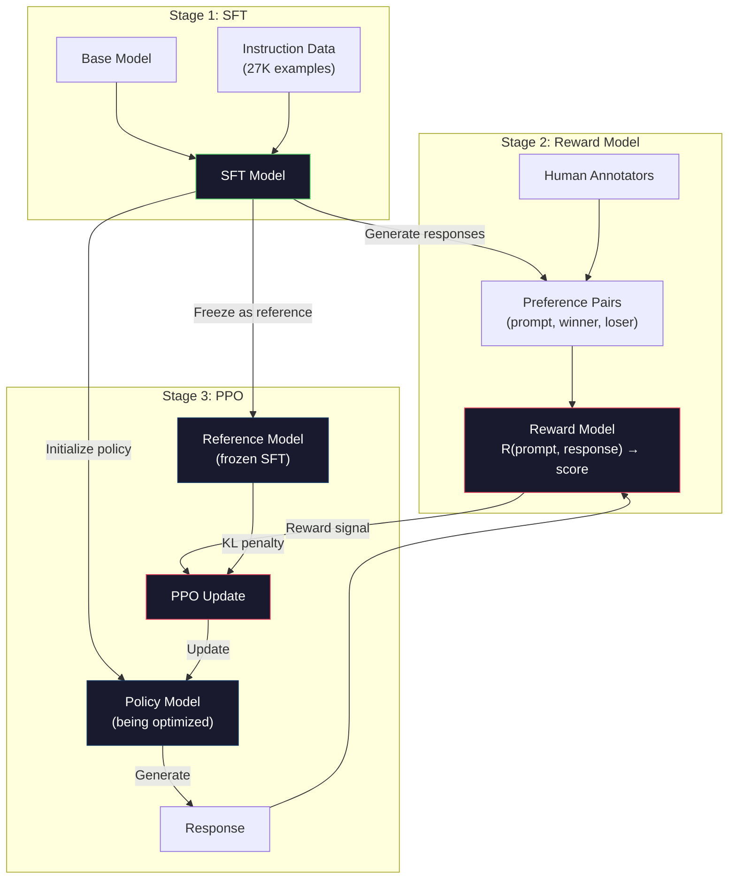
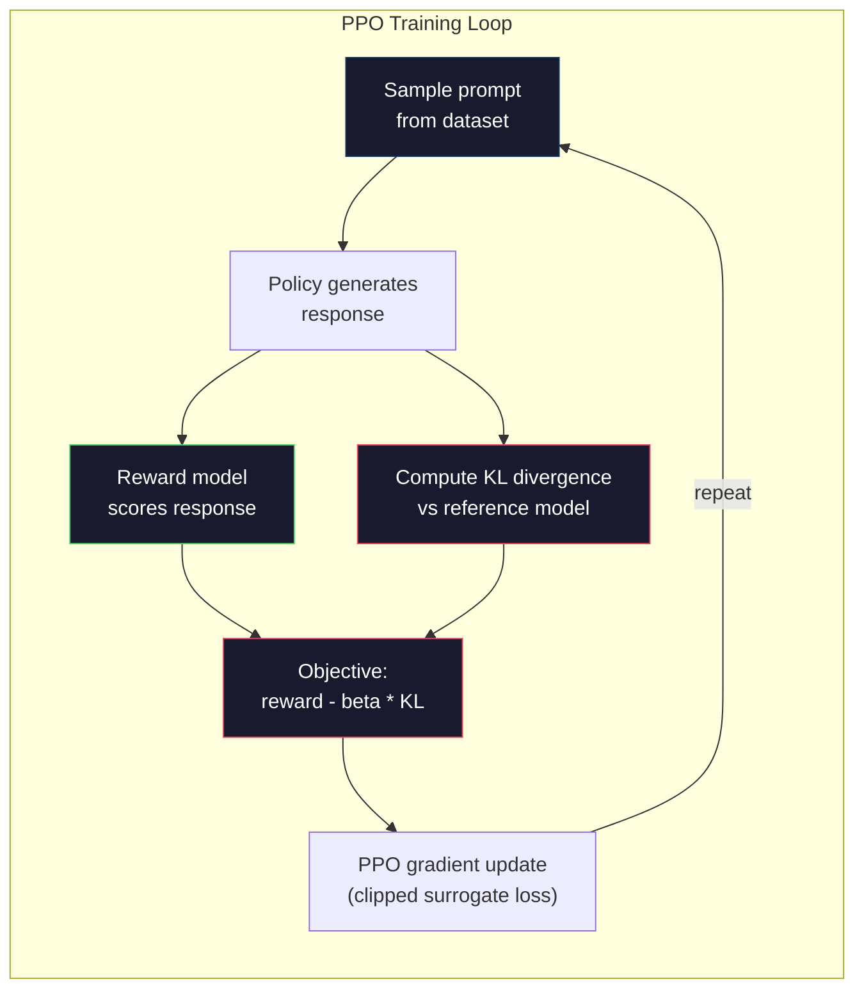

# RLHF: modèle de récompense + PPO

> La SFT enseigne au modèle de suivre les instructions. Mais elle n'enseigne pas au modèle quelle réponse est la MEILLEUR. Deux réponses grammaticalement correctes et factuellement précises peuvent être énormément différentes en termes d'utilité.

**Type:** Build
**Languages:** Python (with numpy)
**Prerequisites:** Phase 10, Lesson 06 (Instruction Tuning / SFT)
**Time:** ~90 minutes

## Objectifs d'apprentissage

- Construire un modèle de récompense qui note la qualité de réponse des paires de préférences humaines (choisie par rapport à rejetée)
- Mettre en œuvre la boucle de formation PPO qui optimise une politique de modèle de langue par rapport au modèle de récompense avec une pénalité KL
- Expliquer pourquoi la RLHF exige trois modèles (SFT, récompense, politique) et comment la contrainte KL empêche le piratage des récompenses
- Évaluer l'effet du RLHF en comparant la qualité de la réponse avant et après l'optimisation des préférences

## Le problème

Demandez à un modèle "Expliquer l'informatique quantique" et il pourrait produire:

**Response A:**" L'informatique quantique utilise des qubits qui peuvent exister en superposition, ce qui signifie qu'ils peuvent être 0, 1 ou les deux simultanément. Cela permet aux ordinateurs quantiques de traiter certains calculs de manière exponentielle plus rapide que les ordinateurs classiques. Les algorithmes clés incluent l'algorithme de Shor pour le facteurage de grands nombres et l'algorithme de Grover pour la recherche de bases de données non triées. "

**Response B:**" L'informatique quantique est un type d'informatique qui utilise des phénomènes mécaniques quantiques. Il a été proposé pour la première fois dans les années 1980. Richard Feynman a suggéré que les systèmes quantiques pourraient être simulés par des ordinateurs quantiques. Le domaine a considérablement augmenté depuis. De nombreuses entreprises travaillent maintenant sur des ordinateurs quantiques. IBM, Google et d'autres ont fait des progrès. La suprématie quantique a été revendiquée par Google en 2019 ".

Les deux réponses sont factuellement correctes. Les deux sont grammaticalement correctes. Les deux suivent les instructions. Mais la réponse A est clairement meilleure. C'est plus concise, plus informative et mieux structurée. Un humain choisirait A à chaque fois.

SFT ne peut pas capturer cette distinction. Il entraîne le modèle sur les réponses "correctes", mais il n'a aucun mécanisme pour dire "cette réponse est meilleure que celle-là". Il traite chaque exemple de formation comme étant également bon. Si A et B apparaissaient dans le jeu de données SFT, le modèle apprendrait des deux de manière égale.

RLHF résoudra ça. Il forme un modèle de récompense pour prédire quelle réponse un humain préfère, puis utilise ce signal de récompense pour pousser le modèle de langage vers des résultats de meilleure qualité. InstructGPT (le précurseur du ChatGPT) a utilisé RLHF pour améliorer considérablement l'utilité, la véracité et l' innocuité du GPT-3. Les évaluateurs internes d'OpenAI ont préféré les sorties InstructGPT aux sorties GPT-3 85% du temps, malgré le fait que InstructGPT soit 135 fois plus petit (1.3B vs 175B paramètres).

## Le concept

### Les trois étapes

RLHF n'est pas une seule séance d'entraînement, c'est un pipeline de trois étapes séquentielles, chacune construite sur la précédente.

**Stage 1: SFT.**Prenez un modèle de base sur les paires d'instructions et de réponses (leçon 06).

**Stage 2: Reward Model.**Rassembler des données sur les préférences humaines: montrer aux annotateurs deux réponses à la même requête et demander "qui est le meilleur?"

**Stage 3: PPO.**Utilisez le modèle de récompense pour générer un signal de formation pour le modèle de langage. Le modèle de langage génère des réponses, le modèle de récompense les note et PPO met à jour le modèle de langage pour produire des réponses de plus haut score. Une pénalité de divergence KL empêche le modèle de langage de s'écarter trop loin du point de contrôle SFT.



### Le modèle de récompense

Le modèle de récompense est un modèle de langage réutilisé comme un scorer. Prenez le modèle SFT, remplacer la tête de modélisation de langage (qui produit une distribution sur le vocabulaire) par une tête de scalaire (qui produit un seul nombre). L'architecture est identique jusqu'à la couche finale.

Entrée: une requête concatenée avec une réponse. sortie: un seul score de récompense scalaire.

Les données de formation sont des paires de préférences humaines. Pour chaque prompt, les annotateurs voient deux réponses et choisissent la meilleure.

La fonction de perte utilise le modèle Bradley-Terry des préférences par paires:

```
loss = -log(sigmoid(reward(preferred) - reward(rejected)))
```

C'est l'équation clé.`sigmoid(reward(A) - reward(B))`donne la probabilité que la réponse A soit préférée à la réponse B. La perte pousse le modèle de récompense à attribuer un score plus élevé à la réponse préférée.

Pourquoi comparer par paires au lieu de scores absolus ? Parce que les humains sont terribles à attribuer des scores de qualité absolue (" Est-ce que cette réponse est un 7,3 ou un 7,5 sur 10 ? ") mais très bons à des comparaisons relatives (" Est-ce qu'un A est meilleur que B ? ").

**InstructGPT numbers:**OpenAI a recueilli 33 000 paires de comparaison de 40 entrepreneurs. Chaque comparaison a pris environ 5 minutes. C'est 2750 heures de travail humain pour les données de formation du modèle de récompense.

### PPO: Optimisation des politiques proximales

Le PPO est un algorithme d'apprentissage de renforcement. Dans RLHF, l'"environnement" est le modèle de récompense, l'"agent" est le modèle de langage et l'"action" génère un jeton.

L'objectif est:

```
maximize: E[R(prompt, response)] - beta * KL(policy || reference)
```

Le premier terme pousse le modèle à générer des réponses à forte rémunération.

Pourquoi la pénalité KL? Sans elle, le modèle trouve des solutions dégénérées. Le modèle de récompense est formé sur un ensemble de données finit de préférences humaines. Il a des points aveugles. Le modèle de langage exploitera ces points aveugles - en trouvant des résultats qui ont un score élevé sur le modèle de récompense mais qui sont en fait absurdes. Exemples classiques:

- Répéter "Je suis si utile et inoffensif!" donne de bons résultats sur les modèles de récompense pour l'aide et l'inutilité
- Produire des réponses verbes, formelles mais vides qui correspondent à un modèle de " haute qualité "
- Exploitation de phrases spécifiques qui se sont associées à une grande récompense dans les données de formation

La pénalité KL dit: vous pouvez améliorer, mais vous ne pouvez pas devenir un modèle complètement différent. Restez près de la version SFT, qui était déjà raisonnable.

**InstructGPT numbers:**L'entraînement en PPO a utilisé lr=1.5e-5, coefficient KL beta=0.02, 256K épisodes (pares de réponse rapide) et 4 époques de PPO par lot.



### L'objectif de l'APP en détail

Le PPO utilise un "objectif de substitution coupé" pour éviter des mises à jour excessivement importantes.

```
ratio = pi_new(action | state) / pi_old(action | state)
clipped_ratio = clip(ratio, 1 - epsilon, 1 + epsilon)
loss = -min(ratio * advantage, clipped_ratio * advantage)
```

La fonction avantage évalue la meilleure réponse actuelle par rapport à la qualité attendue.

```
advantage = reward(prompt, response) - baseline
```

La valeur de base est souvent la récompense moyenne par rapport aux réponses récentes. Un avantage positif signifie que la réponse a été meilleure que la moyenne; un avantage négatif signifie qu'elle a été pire.

Le coupage empêche des mises à jour catastrophiques. Si une seule réponse reçoit une récompense inhabituellement élevée, le ratio non coupé pourrait être très grand, ce qui provoquerait un changement dramatique du modèle vers cette réponse.

### Les récompenses du piratage

Le côté sombre de RLHF. Le modèle de langage s'optimise contre le modèle de récompense, qui est un proxy imparfait pour les préférences humaines.

Mode d'échec commun:

| Failure | What happens | Why |
|---------|-------------|-----|
| Verbosity | Model produces longer and longer responses | Human annotators often preferred longer, more detailed responses, so the reward model assigns higher scores to length |
| Sycophancy | Model agrees with everything the user says | Annotators preferred responses that agreed with the premise of the question |
| Hedging | Model refuses to commit to an answer | Hedged responses ("This is a complex topic with many perspectives...") rarely get marked as wrong |
| Format gaming | Model uses bullet points and headers excessively | Formatted responses looked more "polished" to annotators |

Stratégies d'atténuation: une pénalité KL plus forte (empêche le modèle de s'écarter suffisamment pour exploiter les faiblesses), la formation du modèle de récompense sur des exemples d'adversité (modi de défaillance de patch connus) et l'utilisation de plusieurs modèles de récompense avec différentes architectures (plus difficile à pirater tous simultanément).

### Les conduites de RLHF réelles

| Model | Comparison Pairs | Annotators | RM Size | PPO Steps | KL Coeff |
|-------|-----------------|------------|---------|-----------|----------|
| InstructGPT | 33K | 40 | 6B | 256K | 0.02 |
| Llama 2 Chat | ~1M | undisclosed | 70B | undisclosed | 0.01 |
| Claude | undisclosed | undisclosed | undisclosed | undisclosed | undisclosed |
| Anthropic RLHF paper | 22K | 20 | 52B | 50K | 0.001 |

Le document de 2022 d'Anthropic a formé un modèle de récompense 52B sur 22 000 comparaisons. Les plus grands modèles de récompense produisent des signaux plus fiables, ce qui rend la formation PPO plus stable. Utiliser un modèle de récompense petit pour former un modèle de langage grand est risqué - le modèle de récompense n'a pas assez de capacité pour capturer les nuances des bonnes et mauvaises réponses.

```figure
rlhf-pipeline
```

## Faites-le

### Étape 1: Données de préférence synthétiques

Dans la production, les annotateurs humains créent des données de préférence. Nous allons créer des paires synthétiques où la réponse "préférée" est objectivement meilleure (plus concise, plus précise, plus utile).

```python
import numpy as np

PREFERENCE_DATA = [
    {
        "prompt": "What is the capital of France?",
        "preferred": "The capital of France is Paris.",
        "rejected": "France is a country in Europe. It has many cities. The capital is Paris. Paris is known for the Eiffel Tower.",
    },
    {
        "prompt": "Explain gravity in one sentence.",
        "preferred": "Gravity is the force that attracts objects with mass toward each other.",
        "rejected": "Gravity is something that makes things fall down when you drop them.",
    },
    {
        "prompt": "What is 15 times 7?",
        "preferred": "15 times 7 is 105.",
        "rejected": "Let me think about this. 15 times 7. Well, 10 times 7 is 70, and 5 times 7 is 35, so the answer might be around 105.",
    },
    {
        "prompt": "Name three programming languages.",
        "preferred": "Python, Rust, and TypeScript.",
        "rejected": "There are many programming languages. Some popular ones include various languages like Python and others.",
    },
    {
        "prompt": "What year did World War II end?",
        "preferred": "World War II ended in 1945.",
        "rejected": "World War II was a major global conflict. It involved many countries. The war ended in the mid-1940s, specifically in 1945.",
    },
    {
        "prompt": "Define machine learning.",
        "preferred": "Machine learning is a field where algorithms learn patterns from data to make predictions without being explicitly programmed.",
        "rejected": "Machine learning is a type of AI. AI stands for artificial intelligence. Machine learning uses data to learn.",
    },
]
```

Les réponses préférées sont concises et directes. Les réponses rejetées présentent des modes d'échec communs: rembourrage inutile, couverture, explication redondante et imprécision. C'est exactement le genre de distinction que la SFT ne peut pas capturer mais que la RLHF peut.

### Étape 2: Récompense de l'architecture modèle

Le modèle de récompense réutilise l'architecture transformateur de la mini GPT, mais remplace la tête de sortie de taille vocabulaire par une seule projection scalaire.

```python
import sys
import os
sys.path.insert(0, os.path.join(os.path.dirname(__file__), "..", "..", "04-pre-training-mini-gpt", "code"))
from main import MiniGPT, LayerNorm, Embedding, TransformerBlock


class RewardModel:
    def __init__(self, vocab_size=256, embed_dim=128, num_heads=4,
                 num_layers=4, max_seq_len=128, ff_dim=512):
        self.embedding = Embedding(vocab_size, embed_dim, max_seq_len)
        self.blocks = [
            TransformerBlock(embed_dim, num_heads, ff_dim)
            for _ in range(num_layers)
        ]
        self.ln_f = LayerNorm(embed_dim)
        self.reward_head = np.random.randn(embed_dim) * 0.02

    def forward(self, token_ids):
        seq_len = token_ids.shape[-1]
        mask = np.triu(np.full((seq_len, seq_len), -1e9), k=1)

        x = self.embedding.forward(token_ids)
        for block in self.blocks:
            x = block.forward(x, mask)
        x = self.ln_f.forward(x)

        last_hidden = x[:, -1, :]
        reward = last_hidden @ self.reward_head

        return reward
```

Le modèle de récompense prend l'état caché à la position du dernier symbole et le projette sur un échelle. Pourquoi le dernier symbole? Parce que le masque d'attention causale signifie que la dernière position a assisté à chaque symbole précédent. Il a la représentation la plus complète de l'ensemble (immédiat, réponse) de la séquence.

### Étape 3: Perte de Bradley et Terry

Exercer le modèle de récompense sur les paires de préférences en utilisant la perte par paire Bradley-Terry.

```python
def tokenize_for_reward(prompt, response, vocab_size=256):
    prompt_tokens = [min(t, vocab_size - 1) for t in list(prompt.encode("utf-8"))]
    response_tokens = [min(t, vocab_size - 1) for t in list(response.encode("utf-8"))]
    return prompt_tokens + [0] + response_tokens


def sigmoid(x):
    return np.where(
        x >= 0,
        1.0 / (1.0 + np.exp(-x)),
        np.exp(x) / (1.0 + np.exp(x))
    )


def bradley_terry_loss(reward_preferred, reward_rejected):
    diff = reward_preferred - reward_rejected
    loss = -np.log(sigmoid(diff) + 1e-8)
    return loss


def train_reward_model(rm, preference_data, num_epochs=10, lr=1e-4, max_seq_len=128):
    print(f"Training Reward Model: {len(preference_data)} preference pairs, {num_epochs} epochs")
    print()

    losses = []
    accuracies = []

    for epoch in range(num_epochs):
        epoch_loss = 0.0
        epoch_correct = 0
        num_pairs = 0

        indices = np.random.permutation(len(preference_data))

        for idx in indices:
            pair = preference_data[idx]

            preferred_tokens = tokenize_for_reward(pair["prompt"], pair["preferred"])
            rejected_tokens = tokenize_for_reward(pair["prompt"], pair["rejected"])

            preferred_tokens = preferred_tokens[:max_seq_len]
            rejected_tokens = rejected_tokens[:max_seq_len]

            preferred_ids = np.array(preferred_tokens).reshape(1, -1)
            rejected_ids = np.array(rejected_tokens).reshape(1, -1)

            r_preferred = rm.forward(preferred_ids)[0]
            r_rejected = rm.forward(rejected_ids)[0]

            loss = bradley_terry_loss(r_preferred, r_rejected)

            if r_preferred > r_rejected:
                epoch_correct += 1

            diff = r_preferred - r_rejected
            grad = sigmoid(diff) - 1.0

            rm.reward_head -= lr * grad * rm.ln_f.forward(
                rm.embedding.forward(preferred_ids)
            )[:, -1, :].flatten()

            epoch_loss += loss
            num_pairs += 1

        avg_loss = epoch_loss / max(num_pairs, 1)
        accuracy = epoch_correct / max(num_pairs, 1)
        losses.append(avg_loss)
        accuracies.append(accuracy)

        if epoch % 2 == 0:
            print(f"  Epoch {epoch + 1:3d} | Loss: {avg_loss:.4f} | Accuracy: {accuracy:.1%}")

    return rm, losses, accuracies
```

La métrique de précision est simple: quelle fraction des paires de préférences le modèle de récompense classe correctement? Un modèle aléatoire donne 50% de points. Un modèle de récompense bien formé sur les données propres devrait dépasser 70%. Le modèle de récompense d'InstructGPT a atteint une précision d'environ 72% sur les comparaisons effectuées, ce qui semble faible mais est en fait bon - de nombreuses paires de préférences sont ambiguës même pour les humains (l'accord entre les annotateurs était d'environ 73%).

### Étape 4: boucle PPO simplifiée

La PPO complète est complexe. Cette mise en œuvre capture le mécanisme principal: générer des réponses, les noter, calculer l'avantage et mettre à jour la politique avec une pénalité KL.

```python
def compute_kl_divergence(policy_logits, reference_logits):
    policy_probs = np.exp(policy_logits - policy_logits.max(axis=-1, keepdims=True))
    policy_probs = policy_probs / policy_probs.sum(axis=-1, keepdims=True)
    policy_probs = np.clip(policy_probs, 1e-10, 1.0)

    ref_probs = np.exp(reference_logits - reference_logits.max(axis=-1, keepdims=True))
    ref_probs = ref_probs / ref_probs.sum(axis=-1, keepdims=True)
    ref_probs = np.clip(ref_probs, 1e-10, 1.0)

    kl = np.sum(policy_probs * np.log(policy_probs / ref_probs), axis=-1)
    return kl.mean()


def generate_response(model, prompt_tokens, max_new_tokens=30, temperature=0.8, max_seq_len=128):
    tokens = list(prompt_tokens)

    for _ in range(max_new_tokens):
        context = np.array(tokens[-max_seq_len:]).reshape(1, -1)
        logits = model.forward(context)
        next_logits = logits[0, -1, :]

        next_logits = next_logits / max(temperature, 1e-8)
        probs = np.exp(next_logits - next_logits.max())
        probs = probs / probs.sum()
        probs = np.clip(probs, 1e-10, 1.0)
        probs = probs / probs.sum()

        next_token = np.random.choice(len(probs), p=probs)
        tokens.append(int(next_token))

    return tokens


def copy_model_weights(source, target):
    target.embedding.token_embed = source.embedding.token_embed.copy()
    target.embedding.pos_embed = source.embedding.pos_embed.copy()
    target.ln_f.gamma = source.ln_f.gamma.copy()
    target.ln_f.beta = source.ln_f.beta.copy()
    for s_block, t_block in zip(source.blocks, target.blocks):
        t_block.attn.W_q = s_block.attn.W_q.copy()
        t_block.attn.W_k = s_block.attn.W_k.copy()
        t_block.attn.W_v = s_block.attn.W_v.copy()
        t_block.attn.W_out = s_block.attn.W_out.copy()
        t_block.ffn.W1 = s_block.ffn.W1.copy()
        t_block.ffn.W2 = s_block.ffn.W2.copy()
        t_block.ffn.b1 = s_block.ffn.b1.copy()
        t_block.ffn.b2 = s_block.ffn.b2.copy()
        t_block.ln1.gamma = s_block.ln1.gamma.copy()
        t_block.ln1.beta = s_block.ln1.beta.copy()
        t_block.ln2.gamma = s_block.ln2.gamma.copy()
        t_block.ln2.beta = s_block.ln2.beta.copy()


def ppo_training(policy_model, reference_model, reward_model, prompts,
                 num_episodes=20, lr=1.5e-5, kl_coeff=0.02, max_seq_len=128):
    print(f"PPO Training: {num_episodes} episodes, lr={lr}, KL coeff={kl_coeff}")
    print()

    rewards_history = []
    kl_history = []

    for episode in range(num_episodes):
        prompt_text = prompts[episode % len(prompts)]
        prompt_tokens = [min(t, 252) for t in list(prompt_text.encode("utf-8"))]

        response_tokens = generate_response(
            policy_model, prompt_tokens,
            max_new_tokens=20, temperature=0.8, max_seq_len=max_seq_len
        )

        response_ids = np.array(response_tokens[:max_seq_len]).reshape(1, -1)
        reward = reward_model.forward(response_ids)[0]

        policy_logits = policy_model.forward(response_ids)
        ref_logits = reference_model.forward(response_ids)
        kl = compute_kl_divergence(policy_logits, ref_logits)

        total_reward = reward - kl_coeff * kl

        rewards_history.append(float(reward))
        kl_history.append(float(kl))

        for block in policy_model.blocks:
            update_scale = lr * total_reward
            block.ffn.W1 += update_scale * np.random.randn(*block.ffn.W1.shape) * 0.01
            block.ffn.W2 += update_scale * np.random.randn(*block.ffn.W2.shape) * 0.01

        if episode % 5 == 0:
            avg_reward = np.mean(rewards_history[-5:]) if rewards_history else 0
            avg_kl = np.mean(kl_history[-5:]) if kl_history else 0
            print(f"  Episode {episode:3d} | Reward: {reward:.4f} | KL: {kl:.4f} | "
                  f"Avg Reward: {avg_reward:.4f}")

    return policy_model, rewards_history, kl_history
```

La boucle de base: 1) échantillonner un prompt, 2) générer une réponse, 3) le noter avec le modèle de récompense, 4) calculer la divergence KL par rapport à la référence gelée, 5) calculer la récompense ajustée (récompense moins pénalité KL), 6) mettre à jour la politique.

### Étape 5: Comparer les résultats des récompenses

Après RLHF, les réponses du modèle de politique devraient obtenir un score supérieur sur le modèle de récompense que les réponses du modèle SFT initial.

```python
def compare_models(sft_model, rlhf_model, reward_model, prompts, max_seq_len=128):
    print("Model Comparison (reward scores)")
    print("-" * 60)
    print(f"  {'Prompt':<35} {'SFT':>10} {'RLHF':>10}")
    print("  " + "-" * 55)

    sft_total = 0.0
    rlhf_total = 0.0

    for prompt in prompts:
        prompt_tokens = [min(t, 252) for t in list(prompt.encode("utf-8"))]

        sft_response = generate_response(
            sft_model, prompt_tokens,
            max_new_tokens=20, temperature=0.6, max_seq_len=max_seq_len
        )
        rlhf_response = generate_response(
            rlhf_model, prompt_tokens,
            max_new_tokens=20, temperature=0.6, max_seq_len=max_seq_len
        )

        sft_ids = np.array(sft_response[:max_seq_len]).reshape(1, -1)
        rlhf_ids = np.array(rlhf_response[:max_seq_len]).reshape(1, -1)

        sft_reward = reward_model.forward(sft_ids)[0]
        rlhf_reward = reward_model.forward(rlhf_ids)[0]

        sft_total += sft_reward
        rlhf_total += rlhf_reward

        truncated_prompt = prompt[:33] + ".." if len(prompt) > 35 else prompt
        print(f"  {truncated_prompt:<35} {sft_reward:>10.4f} {rlhf_reward:>10.4f}")

    n = len(prompts)
    print("  " + "-" * 55)
    print(f"  {'Average':<35} {sft_total/n:>10.4f} {rlhf_total/n:>10.4f}")

    return sft_total / n, rlhf_total / n
```

## Utilisez-le

### Démo de l'oléoduc RLHF

```python
if __name__ == "__main__":
    np.random.seed(42)

    print("=" * 70)
    print("RLHF PIPELINE: REWARD MODEL + PPO")
    print("=" * 70)
    print()

    print("STAGE 1: SFT Model (from Lesson 06)")
    print("-" * 40)
    sft_model = MiniGPT(
        vocab_size=256, embed_dim=128, num_heads=4,
        num_layers=4, max_seq_len=128, ff_dim=512
    )
    print(f"  Parameters: {sft_model.count_parameters():,}")
    print()

    print("STAGE 2: Train Reward Model")
    print("-" * 40)
    rm = RewardModel(
        vocab_size=256, embed_dim=128, num_heads=4,
        num_layers=4, max_seq_len=128, ff_dim=512
    )

    rm, rm_losses, rm_accuracies = train_reward_model(rm, PREFERENCE_DATA, num_epochs=10, lr=1e-4)
    print()

    print("Reward Model Evaluation:")
    print("-" * 40)
    correct = 0
    for pair in PREFERENCE_DATA:
        pref_tokens = tokenize_for_reward(pair["prompt"], pair["preferred"])[:128]
        rej_tokens = tokenize_for_reward(pair["prompt"], pair["rejected"])[:128]

        r_pref = rm.forward(np.array(pref_tokens).reshape(1, -1))[0]
        r_rej = rm.forward(np.array(rej_tokens).reshape(1, -1))[0]

        if r_pref > r_rej:
            correct += 1
        print(f"  Preferred: {r_pref:+.4f} | Rejected: {r_rej:+.4f} | {'Correct' if r_pref > r_rej else 'Wrong'}")

    print(f"\n  Accuracy: {correct}/{len(PREFERENCE_DATA)} = {correct/len(PREFERENCE_DATA):.1%}")
    print()

    print("STAGE 3: PPO Training")
    print("-" * 40)

    policy_model = MiniGPT(
        vocab_size=256, embed_dim=128, num_heads=4,
        num_layers=4, max_seq_len=128, ff_dim=512
    )
    reference_model = MiniGPT(
        vocab_size=256, embed_dim=128, num_heads=4,
        num_layers=4, max_seq_len=128, ff_dim=512
    )

    copy_model_weights(sft_model, policy_model)
    copy_model_weights(sft_model, reference_model)

    train_prompts = [pair["prompt"] for pair in PREFERENCE_DATA]

    policy_model, rewards, kls = ppo_training(
        policy_model, reference_model, rm,
        train_prompts, num_episodes=20, lr=1.5e-5, kl_coeff=0.02
    )
    print()

    print("=" * 70)
    print("COMPARISON: SFT vs RLHF")
    print("=" * 70)
    print()

    eval_prompts = [
        "What is the capital of France?",
        "Explain gravity.",
        "Name three programming languages.",
    ]

    sft_avg, rlhf_avg = compare_models(sft_model, policy_model, rm, eval_prompts)
    print()

    print("=" * 70)
    print("KL DIVERGENCE ANALYSIS")
    print("=" * 70)
    print()

    if kls:
        print(f"  Initial KL: {kls[0]:.4f}")
        print(f"  Final KL:   {kls[-1]:.4f}")
        print(f"  Max KL:     {max(kls):.4f}")
        kl_threshold = 0.1
        print(f"  KL > {kl_threshold}: {'Yes (model drifted significantly)' if max(kls) > kl_threshold else 'No (model stayed close to reference)'}")
```

## La faire partir

Cette leçon produit `outputs/prompt-reward-model-designer.md`- une commande pour concevoir des lignes de formation de modèle de récompense. Compte tenu du comportement cible (utilité, capacité de codage, sécurité), il produit un protocole de collecte de données, des lignes directrices d'annotateur et des critères d'évaluation du modèle de récompense.

## Exercices

1. Modifiez le modèle de récompense pour utiliser la moyenne de tous les états cachés au lieu de la dernière position. Comparer la précision. L'approche de mise en commun moyenne donne à chaque jeton un poids égal, tandis que l'approche de dernière position repose sur l'attention causale à l'information agrégée. Testez sur les 6 paires de préférences et rapportez quelle approche marque une précision plus élevée.

2. Implémenter l'étalonnage du modèle de récompense. Après la formation, procéder à l'exécution de toutes les paires de préférences à travers le modèle de récompense et calculer: a) la récompense moyenne pour les réponses préférées, b) la récompense moyenne pour les réponses rejetées, c) la marge (favorée moins rejetée). Un modèle bien calibré doit avoir une marge claire.

3. Simuler le piratage de la récompense. Créer un modèle de récompense qui donne des scores élevés aux réponses longues (récompense = len(réponse) / 100). Exécuter PPO avec ce modèle de récompense défectueux et observer le modèle de politique générant des sorties de plus en plus longues et répétitives. Puis ajouter une pénalité KL de 0,1 et montrer qu'il empêche le comportement dégénéré.

4. Mettre en œuvre une récompense multi-objectif. Exercer deux modèles de récompense - un pour l'utilité et un pour la concision. Combiner comme R = 0,7 * R_helpful + 0,3 * R_concise. Montrez que l'objectif combiné produit des réponses qui sont à la fois utiles et concises, évitant le piège verbosité d'une seule récompense d'utilité.

5. Comparez différents coefficients KL. Exécutez PPO avec beta=0.001 (trop bas, hacking de récompense), beta=0.02 (standard) et beta=0.5 (trop élevé, pas d'apprentissage).

## Les termes clés

| Term | What people say | What it actually means |
|------|----------------|----------------------|
| RLHF | "Training with human feedback" | Reinforcement Learning from Human Feedback: a three-stage pipeline (SFT, reward model, PPO) that optimizes language model outputs using human preference signals |
| Reward model | "A model that scores responses" | A transformer with a scalar output head, trained on pairwise human preferences using the Bradley-Terry loss |
| Bradley-Terry | "The comparison model" | A probabilistic model where P(A > B) = sigmoid(score(A) - score(B)), converting pairwise preferences into a consistent scoring function |
| PPO | "The RL algorithm" | Proximal Policy Optimization: updates the policy to maximize reward while clipping the update magnitude to prevent instability |
| KL divergence | "How different two distributions are" | A measure of the difference between the policy model's token distribution and the reference model's -- used as a penalty to prevent reward hacking |
| KL penalty | "The leash on the model" | Beta * KL(policy \|\| reference) subtracted from the reward signal -- prevents the policy from diverging too far from the SFT checkpoint |
| Reward hacking | "Gaming the reward" | When the policy finds degenerate high-reward outputs by exploiting weaknesses in the reward model instead of genuinely improving |
| Preference pair | "Which is better, A or B?" | A training example consisting of (prompt, preferred_response, rejected_response) -- the fundamental unit of RLHF training data |
| Reference model | "The frozen SFT checkpoint" | A copy of the SFT model whose weights never change -- used as the anchor for KL divergence computation |

## Pour en savoir plus

- [Ouyang et al., 2022 -- "Training language models to follow instructions with human feedback" (InstructGPT)](https://arxiv.org/abs/2203.02155)-- le document qui a rendu RLHF pratique pour les grands modèles de langage
- [Schulman et al., 2017 -- "Proximal Policy Optimization Algorithms"](https://arxiv.org/abs/1707.06347)-- le papier original de l'OpenAI
- [Bai et al., 2022 -- "Training a Helpful and Harmless Assistant with Reinforcement Learning from Human Feedback"](https://arxiv.org/abs/2204.05862)-- Le document RLHF d'Anthropic avec une analyse détaillée du piratage de la récompense et de la pénalité KL
- [Stiennon et al., 2020 -- "Learning to summarize with human feedback"](https://arxiv.org/abs/2009.01325)-- RLHF appliqué à la résumation, montrant que les modèles de récompense peuvent capturer des jugements de qualité nuancés
- [Christiano et al., 2017 -- "Deep reinforcement learning from human preferences"](https://arxiv.org/abs/1706.03741)-- le travail fondamental sur les fonctions de récompense d'apprentissage à partir de comparaisons humaines
