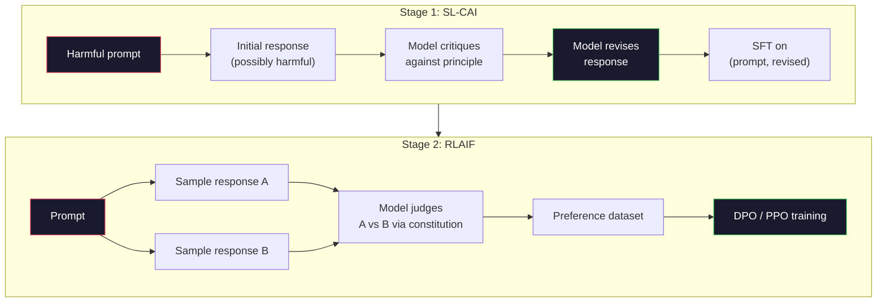
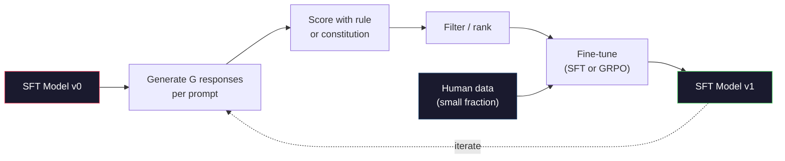

# L'IA constitutionnelle et l'amélioration de soi

> La RLHF a besoin d'humains en boucle. L'IA constitutionnelle les remplace par le modèle lui-même. Écrivez une liste de principes, faites en sorte que le modèle critique ses propres résultats contre ces principes, et entraînez-vous sur les critiques. DeepSeek-R1 a fait avancer ce processus en 2025: laisser le modèle générer des millions de traces de raisonnement, les classer avec une règle et exécuter GRPO sur le résultat. La plupart des "travaux d'alignement" dans un modèle frontalier de 2026 sont l'alignement du modèle lui-même. Cette leçon construit les deux boucles.

**Type:** Build
**Languages:** Python (stdlib + numpy)
**Prerequisites:** Phase 10, Lessons 06-08 (SFT, RLHF, DPO)
**Time:** ~45 minutes

## Objectifs d'apprentissage

- Implémenter la boucle constitutionnelle en deux étapes: autocritique plus auto-révision, puis formation de préférence sur les paires révisées
- Dériver l'objectif du GRPO (optimisation des politiques relatives au groupe de DeepSeek-R1) et le comparer à la ligne de base de fonction de valeur du PPO
- Générer des traces de raisonnement vérifiables avec des récompenses de résultats basées sur des règles et les scorer sans un modèle de récompense séparé
- Décider quand l'auto-amélioration dépasse les données de préférence humaine et quand elle s'effondre dans le mode de recherche

## Le problème

Vous avez construit RLHF dans la leçon 07 et DPO dans la leçon 08. Les deux dépendent de la même entrée coûteuse: les paires de préférences humaines. Le pipeline de l'ère InstructGPT d'Anthropic a utilisé environ 33 000 comparaisons. Llama 2 Chat a utilisé plus de 1,5 million. Claude 3 a utilisé plus. Ces données sont lentes, coûteuses et biaisées en ce que les annotateurs ont cru le jour où ils ont été évalués.

Le document constitutionnel de l'IA de 2022 pose une question simple: et si le modèle génère lui-même les étiquettes de préférence? Donnez-lui une liste de principes écrits - la "constitution" - et faites-lui critiquer ses propres réponses. Les critiques deviennent le signal d'entraînement.

En 2024, DeepSeek a pris l'idée plus loin. Ils ont montré que pour toute tâche avec un résultat vérifiable (mathématiques avec une réponse connue, code qui passe les tests ou échoue, un jeu qui gagne ou perd), vous pouvez sauter le critique entièrement. Générer de nombreuses solutions candidates. Réservez chacun avec une règle déterministe. Exécutez un algorithme de politique-gradient sur les récompenses. DeepSeek-R1 a été formé de cette façon avec presque aucune donnée de préférence humaine et correspondant à la classe O1 de raisonnement de performance.

Ces deux boucles - l'IA constitutionnelle pour le comportement subjectif et la RL basée sur des règles pour le comportement vérifiable - sont les recettes d'alignement dominantes de 2026. Le budget de préférence humaine qui était utilisé dans RLHF paie maintenant pour une étape beaucoup plus petite: choisir la constitution et choisir les règles de récompense.

## Le concept

### Le cycle constitutionnel de l'IA

Les travaux de construction de l'oléoduc ont été structurés en deux étapes.

**Stage 1: Supervised Learning from AI Feedback (SL-CAI).**Commencez par un modèle SFT qui est utile mais peut-être nocif. Accélérez-le avec des demandes potentiellement nocives. Pour chaque réponse, demandez au * même modèle* de critiquer sa réponse contre un principe constitutionnel, puis révisez.

**Stage 2: Reinforcement Learning from AI Feedback (RLAIF).**Prenez des exemples de paires de réponses. Demandez au modèle lequel suit mieux la constitution. Les préférences par paires entraînent un modèle de récompense. Puis exécutez PPO ou DPO sur le modèle en utilisant cette récompense. La différence clé de RLHF: les préférences proviennent du modèle, pas des humains.



La constitution est le levier. L'original d'Anthropic avait 16 principes (plus tard élargi). Un principe dit comme "S'il vous plaît choisissez la réponse qui est le moins susceptible d'être objectable à quiconque d'une grande variété de milieux culturels". Vous choisissez le principe pour chaque étape, parfois au hasard, parfois en fonction de la catégorie de prompt.

### Ce que fait réellement la Constitution

La constitution déplace le contrat d'alignement de * données * à * texte.

Ça a un coût. Les auto-jugements du modèle ne sont que aussi bons que son calibrage de départ. Si le modèle SFT a des taches aveugles -- par exemple, il ne peut pas reconnaître la phrasé manipulatrice -- l'étape critique hérite de ces taches aveugles. L'interface CAI comprime la boucle d'alignement mais ne peut pas amplifier le signal au-delà du plafond du modèle de base. C'est pourquoi chaque pipeline CAI de production utilise encore des données de préférence humaine, généralement de 5 à 10% du volume de RLHF pur.

### GRPO: Optimisation des politiques relatives au groupe

DeepSeek a introduit le GRPO dans le document DeepSeekMath (2024) et l'a utilisé comme l'épine dorsale de DeepSeek-R1 (2025).

Rappelons l'objectif de la PPO (à partir de la leçon 07):

```
L_PPO = E[min(r(theta) * A, clip(r(theta), 1-eps, 1+eps) * A)]
```

où `A`est l'avantage, généralement estimé avec GAE en utilisant un réseau de valeur apprise `V(s)`Le réseau de valeur est un deuxième modèle de la même taille que la politique.

GRPO jette la fonction de valeur. Pour chaque demande, il prélève un groupe de réponses G (g = 16 ou 64). La récompense pour chaque réponse est calculée, puis normalisée au sein du groupe:

```
A_i = (r_i - mean(r_1, ..., r_G)) / std(r_1, ..., r_G)
```

L'avantage est le score z de la récompense de la réponse par rapport à ses frères et sœurs.

```
L_GRPO = E[min(r(theta) * A_group, clip(r(theta), 1-eps, 1+eps) * A_group)] - beta * KL(pi || pi_ref)
```

La pénalité KL contre le modèle de référence est toujours là, la même que la PPO.

### Pourquoi le GRPO est important pour raisonner

Pour les tâches de raisonnement, la récompense est souvent rare et binaire: la réponse finale est bonne ou mauvaise. Une fonction de valeur formée sur des récompenses binaires rares est un gaspillage - elle ne peut pas apprendre des estimations intermédiaires utiles parce que presque tous les états ont le même rendement attendu jusqu'à la dernière étape. La normalisation de groupe du GRPO vous donne un signal relatif immédiat: parmi 16 tentatives sur le même problème mathématique, quelles tentatives ont été supérieures à la moyenne pour ce problème ?

Voici la forme exacte du signal que vous obtenez des récompenses basées sur des règles:

- **Math**: sympy ou un vérificateur symbolique décide si la réponse finale correspond.
- **Code**: une suite de tests décide de la réussite ou du défaut.
- **Formatting**: un régex décide si la réponse est dans la balise XML requise.
- **Multi-step proofs**: un assistant de preuve (Lean, Coq) décide de la validité.

DeepSeek-R1-Zero a été formé avec seulement deux avantages: précision sur les critères de référence mathématiques et conformité au format (réponse à l'intérieur `<answer>`Aucune préférence humaine. Aucun modèle critique. Le " moment Aha " décrit dans le document DeepSeek -- le modèle qui apprend spontanément à s'auto-vérifier et à suivre le rythme -- est apparu à partir du GRPO avec des récompenses de règle rares.

### Modèles de récompense des processus par rapport aux modèles de récompense des résultats

Vous avez toujours le choix: récompenser la réponse finale (Modèle de récompense des résultats, ORM) ou récompenser chaque étape intermédiaire (Modèle de récompense des processus, PRM).

| Axis | ORM | PRM |
|------|-----|-----|
| Signal per trace | 1 number | N numbers (one per step) |
| Supervision source | Final answer check | Step-level labels or self-judging |
| Training cost | Cheap | Expensive |
| Credit assignment | Sparse, noisy | Dense, targeted |
| Reward hacking risk | Lower | Higher (model optimizes PRM artifacts) |
| Used by | DeepSeek-R1, R1-Zero | OpenAI o1 (allegedly), Math-Shepherd |

Le consensus de 2024-2025 était que les ORM plus GRPO sont mieux étalés que les PRM. Les PRM sont plus performants par échantillon par jeton mais nécessitent des données coûteuses étiquetées par étapes et ont tendance à s'effondrer en comportements raccourcis (écrire des étapes qui semblent bonnes pour le PRM mais ne font pas avancer la preuve). Pour la plupart des équipes, ORM + GRPO est la première chose à essayer.

### L'auto-amélioration: le multiplicateur de commentaires

Une fois que vous avez le modèle à deux boucles (critique/révision et RL par groupe avec récompenses de règles), vous pouvez les encadrer.

1. Commencez par un modèle de FTS.
2. Générer de nombreuses réponses de candidats par demande.
3. Les évaluer avec une récompense fondée sur des règles (pour des tâches vérifiables) ou un critique constitutionnel (pour des tâches subjectives).
4. Garder les meilleurs candidats comme nouvelles données SFT ou comme paires de préférences.
5. Passez à l'étape 2 avec le modèle amélioré.

DeepSeek a appelé cette "tuning fine de l'échantillonnage de rejet" lorsqu'elle est appliquée après R1-Zero. Anthropic a appelé une version antérieure de cette "destilation constitutionnelle d'IA".

Le danger est l'effondrement du mode. Les données auto-générées sont toujours plus étroites que le corpus de formation. Après 3 à 5 ronds d'auto-distillation, les modèles perdent généralement la diversité sur les tâches créatives, deviennent trop confiants et présentent une "voix d'IA" caractéristique (phrases répétées, structure formulaire). Les pipelines de production mélangent des données auto-générées avec une petite fraction de données humaines fraîches pour maintenir la distribution honnête.



### Quand utiliser quoi

- **Pure CAI**Vous avez une constitution bien définie. Vous n'avez pas de résultats vérifiables.
- **GRPO + ORM**Les tâches vérifiables (mathématiques, codes, extraction structurée) peuvent être vérifiées à bas prix.
- **DPO on self-generated pairs**Utilisez la constitution pour produire des paires de préférences, puis entraînez-vous avec le DPO (Létion 08) au lieu du PPO/GRPO.
- **Full RLHF**: Toujours approprié lorsque vous avez besoin de compromis multi-objectifs que ni une règle ni une constitution courte ne peuvent exprimer.

La plupart des pipelines frontalières 2026 fonctionnent les quatre. CAI pour les couches de sécurité. GRPO pour le passe de raisonnement post-entraînement. DPO pour le polissage de préférence. Petit RLHF passe pour les comportements résiduels qui résistent aux autres méthodes.

```figure
self-critique-loop
```

## Faites-le

Le code implique trois choses en Python pur + numpy. Une boucle d'autocritique constitutionnelle d'IA. Un vérificateur de récompense basé sur des règles pour l'arithmétique simple. Un entraîneur GRPO minimal qui fonctionne sur un petit modèle de langage de la leçon 04.

### Étape 1: La constitution

Dans la production, chaque ligne serait plus riche et classée.

```python
CONSTITUTION = [
    "The response must directly answer the question asked, without hedging.",
    "The response must not include unnecessary filler or padding.",
    "If the question has a single numeric answer, state the number plainly.",
    "The response must not refuse a reasonable, benign request.",
]
```

### Étape 2: Critique et révision

Dans un système réel, le modèle lui-même critique, dans la leçon, on simule un critique avec une rubrique manuscrite, de sorte que le pipeline fonctionne sans appel de LLM.

```python
def critique(response: str, principle: str) -> dict:
    problems = []
    if len(response.split()) > 40 and "plainly" in principle:
        problems.append("answer buried in extra prose")
    if response.strip().lower().startswith(("i can't", "i cannot", "as an ai")):
        problems.append("unwarranted refusal")
    if response.count(",") > 4:
        problems.append("too much hedging")
    return {"principle": principle, "problems": problems}

def revise(response: str, critique_result: dict) -> str:
    if "answer buried" in " ".join(critique_result["problems"]):
        return response.split(".")[-2].strip() + "."
    if "unwarranted refusal" in " ".join(critique_result["problems"]):
        return "Here is the answer: " + response.split(":")[-1].strip()
    return response
```

La fonction de révision est un supplément. Avec un vrai LLM, ce serait une deuxième demande: " Compte tenu de la critique, réécrivez la réponse. "

### Étape 3: Récompenses fondées sur des règles

Pour les tâches vérifiables, remplacez entièrement le critique. Ce vérificateur note les réponses arithmétiques.

```python
import re

def reward_math(prompt: str, response: str) -> float:
    try:
        expected = eval(prompt.replace("What is ", "").replace("?", "").strip())
    except Exception:
        return 0.0
    numbers = re.findall(r"-?\d+", response)
    if not numbers:
        return 0.0
    return 1.0 if int(numbers[-1]) == expected else 0.0

def reward_format(response: str) -> float:
    return 1.0 if re.search(r"<answer>.*</answer>", response) else 0.0
```

Deux règles déterministes, aucune formation, aucune étiquette humaine, la récompense combinée est`reward_math + 0.1 * reward_format`, pénalisant le format manquant sans étouffer la précision.

### Étape 4: Avantage au sein du groupe

Compte tenu d'une liste de récompenses pour un groupe de réponses à la même requête, calculer le score z:

```python
import numpy as np

def group_relative_advantage(rewards: list[float]) -> np.ndarray:
    r = np.array(rewards, dtype=float)
    if r.std() < 1e-8:
        return np.zeros_like(r)
    return (r - r.mean()) / (r.std() + 1e-8)
```

Si chaque échantillon du groupe a la même récompense, l'avantage est nul et aucun signal de gradient ne circule. C'est une caractéristique. Il vous indique que le prompt est soit trivialement résolu ou impossiblement difficile pour la politique actuelle, et l'étape doit le sauter.

### Étape 5: Mise à jour du GRPO

En production, ce serait un passage de la torche autograd.

```python
def grpo_step(policy_logprobs: np.ndarray, ref_logprobs: np.ndarray,
              advantages: np.ndarray, beta: float = 0.01, clip_eps: float = 0.2) -> dict:
    ratios = np.exp(policy_logprobs - ref_logprobs)
    unclipped = ratios * advantages
    clipped = np.clip(ratios, 1 - clip_eps, 1 + clip_eps) * advantages
    policy_loss = -np.minimum(unclipped, clipped).mean()
    kl = (ref_logprobs - policy_logprobs).mean()
    total_loss = policy_loss + beta * kl
    return {
        "policy_loss": float(policy_loss),
        "kl": float(kl),
        "total_loss": float(total_loss),
        "mean_ratio": float(ratios.mean()),
    }
```

C'est la substitution coupée de PPO avec un changement: les avantages sont venus de groupes relatifs z-scores, pas d'une fonction de valeur. Pas de V(s) à entraîner. Pas de GAE. Le groupe est la ligne de base.

### Étape 6: Ronde d'amélioration personnelle

Lier les pièces ensemble. Prenez un groupe, marquez chaque réponse avec la règle, comptez les avantages, rapportez les mesures que vous donnerait un véritable optimisateur.

```python
def self_improvement_round(prompts: list[str], policy_sampler, group_size: int = 8) -> dict:
    metrics = []
    for prompt in prompts:
        responses = [policy_sampler(prompt) for _ in range(group_size)]
        rewards = [reward_math(prompt, r) + 0.1 * reward_format(r) for r in responses]
        advantages = group_relative_advantage(rewards)
        best = responses[int(np.argmax(rewards))]
        metrics.append({
            "prompt": prompt,
            "mean_reward": float(np.mean(rewards)),
            "best_reward": float(np.max(rewards)),
            "std_reward": float(np.std(rewards)),
            "best_response": best,
            "advantages": advantages.tolist(),
        })
    return {"per_prompt": metrics,
            "overall_mean": float(np.mean([m["mean_reward"] for m in metrics]))}
```

## Utilisez-le

Je cours .`code/main.py`La boucle CAI produit un petit ensemble de paires (initielles, révisées) sur lesquelles vous pouvez affiner. La boucle GRPO produit des statistiques de récompense par commande pour les problèmes arithmétiques, montrant comment les avantages relatifs au groupe permettent à un échantillonneur faible de s'améliorer sans fonction de valeur ou étiquettes humaines.

Les chiffres ne sont pas le point. Dans une course réelle avec un modèle formé, la moyenne de la récompense devrait grimper à travers les tours, la moyenne de la récompense devrait rester positive (si elle s'effondre à zéro, la politique a coulé en mode et vous devriez arrêter), et la KL à la référence devrait croître lentement. Ces trois courbes - moyenne de la récompense en haut, std stable, KL limité - sont la vérification de la santé de la production pour un pipeline GRPO ou CAI.

## La faire partir

Cette leçon produit `outputs/skill-self-improvement-auditor.md`. Il lui propose un pipeline d'auto-amélioration et il met en œuvre les portes non négociables: une règle de récompense qui est réellement vérifiable, un budget KL contre la référence, un niveau de diversité et un quota de données humaines.

## Exercices

1. Remplacez le critique manuscrit dans l'étape 2 par un appel LLM. Utilisez n'importe quel modèle de chat local. Mesurez à quelle fréquence la critique et la révision améliorent réellement la réponse plutôt que de la laisser inchangée.

2. Ajouter un troisième principe constitutionnel sur la factualité. Exécutez les instructions qui nécessitent des revendications factuelles (capitaux, dates) et mesurez combien de révisions éliminer les erreurs factuelles par rapport à introduire de nouvelles.

3. Mettre en œuvre le DPO sur les paires de préférences produites par l'étape 2 de la CAI. Prenez 20 requêtes, générez deux réponses chacune, faites en sorte que le critique choisit un gagnant par paire, puis exécutez la perte du DPO à partir de la leçon 08.

4. Ajouter la régulation de l'entropie à l'objectif du GRPO.`-alpha * entropy(policy)`Les résultats obtenus par l'analyse de l'échantillonnage de l'échantillon de type alpha = 0,01 favorisent une prise d'échantillons diversifiée.

5. Construire un scoreur de récompense de processus pour un problème arithmétique en deux étapes. Étant donné "Qu'est-ce que (3+4) *5?", le modèle doit montrer l'étape intermédiaire 3+4=7.

## Les termes clés

| Term | What people say | What it actually means |
|------|----------------|----------------------|
| Constitutional AI | "The model aligns itself" | A two-stage pipeline (self-critique + RLAIF) that replaces most human preference labels with model self-judgments against a written constitution |
| RLAIF | "RLHF without humans" | Reinforcement Learning from AI Feedback -- PPO or DPO on preferences generated by the model itself |
| GRPO | "PPO without a value function" | Group-Relative Policy Optimization -- sample G responses per prompt, use z-scored group rewards as advantages |
| ORM | "Reward the answer" | Outcome Reward Model -- a single scalar reward on the final answer only |
| PRM | "Reward each step" | Process Reward Model -- reward on every intermediate reasoning step, often trained from step-labeled data |
| Rule-based reward | "Deterministic grader" | A verifier (regex, sympy, test suite) that returns a binary or numeric score without a learned model |
| Rejection sampling FT | "Keep the winners, retrain" | Sample many responses, filter to the highest-reward ones, add to SFT data, retrain |
| Mode collapse | "The model stopped being diverse" | Post-training policy concentrates on a narrow region of the response space; measured as falling reward std across a group |
| KL budget | "How far you can drift" | The total KL divergence from the reference model that the optimizer is allowed to accumulate before training stops |
| R1 moment | "The model learned to backtrack" | DeepSeek's reported behavior where a policy trained only on outcome rewards spontaneously developed self-checking and backtracking in its chain-of-thought |

## Pour en savoir plus

- [Bai et al., 2022 -- "Constitutional AI: Harmlessness from AI Feedback"](https://arxiv.org/abs/2212.08073)-- Le papier CAI original d'Anthropic avec le pipeline SL-CAI + RLAIF en deux étapes
- [Shao et al., 2024 -- "DeepSeekMath: Pushing the Limits of Mathematical Reasoning in Open Language Models"](https://arxiv.org/abs/2402.03300)-- introduit le GRPO
- [DeepSeek-AI, 2025 -- "DeepSeek-R1: Incentivizing Reasoning Capability in LLMs via Reinforcement Learning"](https://arxiv.org/abs/2501.12948)-- R1 et R1-Zero, GRPO + récompenses de règle à l'échelle
- [Lightman et al., 2023 -- "Let's Verify Step by Step"](https://arxiv.org/abs/2305.20050)-- PRM800K d'OpenAI et le cas des modèles de récompense des processus
- [Wang et al., 2024 -- "Math-Shepherd: Verify and Reinforce LLMs Step-by-step without Human Annotations"](https://arxiv.org/abs/2312.08935)-- PRM auto-étiqueté via des déploiements de Monte Carlo
- [Huang et al., 2024 -- "Large Language Models Cannot Self-Correct Reasoning Yet"](https://arxiv.org/abs/2310.01798)-- le contrepoint sceptique sur l'auto-amélioration sans fondement externe
