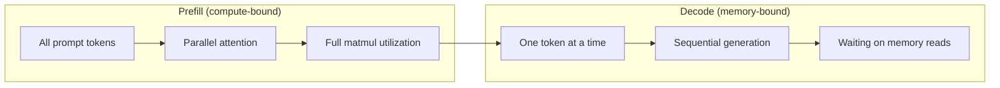
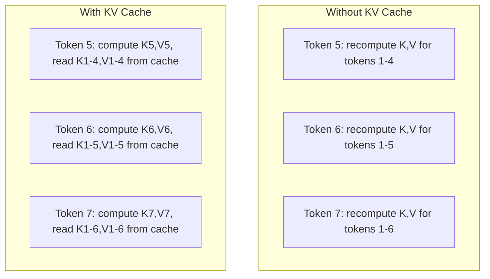
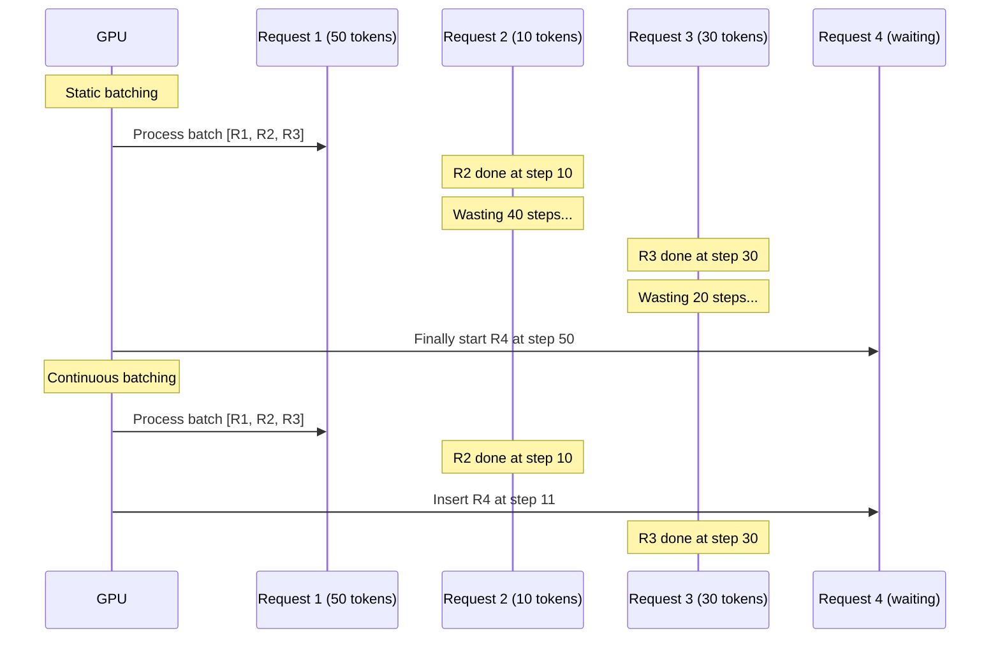
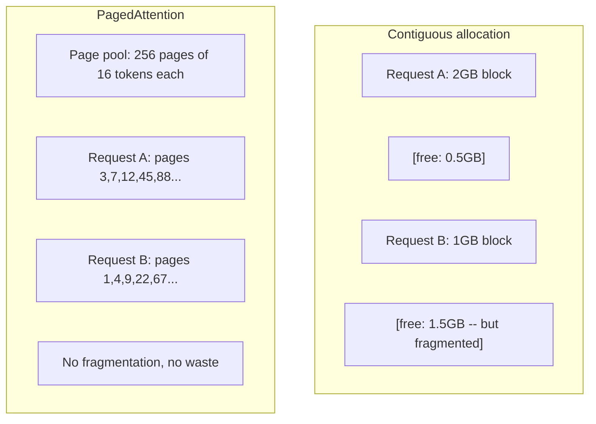
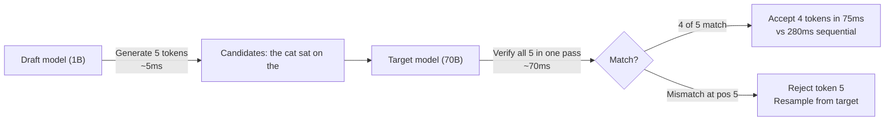

# Optimisation de l'inférence

> Deux phases définissent l'inférence LLM. Précharger traite votre prompt en parallèle - en fonction de l'informatique. Décoder génère des jetons un à la fois - en fonction de la mémoire. Chaque optimisation cible un ou les deux.

**Type:** Build
**Languages:** Python
**Prerequisites:** Phase 10, Lessons 01-08 (Transformer architecture, attention)
**Time:** ~120 minutes

## Objectifs d'apprentissage

- Implémenter KV-cache pour éliminer les calculs redondants lors de la génération de jetons autorégressifs
- Expliquer les phases de pré-remplissage et de décode de l'inférence LLM et expliquer pourquoi chacun a des goulots d'étranglement différents (computé et mémoire)
- Implémenter des concepts de batchage continu et PagedAttention pour maximiser l'utilisation de la GPU en cas de requêtes simultanées
- Comparer les techniques d'optimisation des déductions (cache KV, décoding spéculatif, attention flash) et leurs compensations de débit/latence

## Le problème

Vous déployez Llama 3 70B sur des GPU 4xA100. Un seul utilisateur obtient environ 50 jetons par seconde. C'est rapide. 100 utilisateurs atteignent le point final simultanément. Le débit diminue à 3 jetons/seconde/utilisateur. Votre facture de GPU de 25 000 $/mois est de servir des réponses plus lentement qu'un type humain.

Le modèle lui-même ne change pas entre 1 utilisateur et 100 utilisateurs. Le même poids, la même architecture, les mêmes mathématiques. Ce qui change, c'est la façon dont vous planifiez le travail. Une inférence naïve gaspille plus de 90% du calcul de la GPU disponible. Un utilisateur qui attend le token 47 garde un espace de lot entier ouvert tandis que le bus de mémoire de la GPU reste inactif entre les matmuls. Pendant ce temps, la requête de 2000 jetons d'un nouvel utilisateur pourrait remplir ce temps mort avec un calcul utile.

Ce n'est pas un problème d'échelle. C'est un problème de planification. Les techniques de cette leçon - KV caching, continu batching, PagedAttention, décoding spéculatif, préfixe caching - sont ce qui sépare un$25k/month inference bill from a $5k/mois, un pour le même trafic.

VLLM desservant Llama 3 70B sur 4xA100-80GB atteint ~ 50 jetons / seconde / utilisateur à faible concurrence, et maintient 15-25 TPS / utilisateur à 100 demandes concurrentes grâce au batchage continu et à PagedAttention. Sans ces optimisations, le même matériel dessert 5 TPS / utilisateur à cette concurrence.

## Le concept

### Préchargement par rapport au décodeur

Chaque demande d'inférence LLM a deux phases distinctes.

**Prefill**Il est possible de calculer l'attention parallèlement sur la séquence complète. Il s'agit d'une grande multiplication de matrice - les cœurs de GPU restent occupés. Le problème est de calculer combien de FLOPS votre matériel peut fournir par seconde. Un A100 fait 312 TFLOPS (BF16).

**Decode**génère des jetons de sortie un à la fois. Chaque nouveau jeton répond à tous les jetons précédents, mais un seul jeton est produit par passe à terme. Les matrices de poids sont de la même taille que lors du préremplissage, mais vous les multipliez par un seul vecteur au lieu d'une matrice. Les cœurs de la GPU se terminent en microsecondes, puis attendent que le prochain lot de poids arrive de la mémoire. Le problème est la bande passante de la mémoire: à quelle vitesse vous pouvez transmettre les poids des modèles de HBM aux unités de calcul. Un A100 a une bande passante de 2 TB/s. Un modèle 70B en FP16 est de 140 Go. La lecture du modèle complet une fois prend 70ms -- c'est votre étape pour une seule étape de décode.



Le **ops:byte ratio**(également appelé intensité arithmétique) capture cette compensation. Il mesure le nombre d'opérations que vous effectuez par octet chargé de la mémoire.

```
ops:byte ratio = FLOPs per token / bytes read from memory
```

Lors du prélèvement avec un lot de 4.096 jetons, vous effectuez ~ 4.096 opérations de multiplication accumulée par poids chargé. Le ratio est élevé - vous êtes lié à l'informatique. Pendant le décode avec la taille du lot 1, vous effectuez ~ 1 opération par poids chargé. Le ratio est faible - vous êtes lié à la mémoire.

L'idée fondamentale: *le décode est lié à la mémoire parce que vous lisez l'ensemble du modèle pour produire un seul jeton*. Chaque optimisation ci-dessous réduit soit ce que vous lisez, augmente le lot de jetons traités par lecture, ou évite de lire entièrement.

### Cache KV

Pendant l'attention, la requête de chaque jeton répond aux vecteurs de clé et de valeur de chaque jeton précédent. Sans mise en cache, générer un jeton N nécessite de recomputer la clé et les projections de valeur pour tous les jetons précédents N-1.

Le cache KV stocke les projections de clé et de valeur de tous les jetons précédents. Lors de la génération de jeton N, vous ne comptez que la clé et la valeur pour le jeton N, puis les concateniez avec le K / V en cache des jetons 1 à N-1.



**Memory formula for KV cache:**

```
KV cache size = 2 * num_layers * num_kv_heads * head_dim * seq_len * bytes_per_param
```

Pour Llama 3 70B (80 couches, 8 têtes KV avec GQA, tête_dim=128, BF16):

```
per token: 2 * 80 * 8 * 128 * 2 bytes = 327,680 bytes = 320 KB
at 4,096 tokens: 320 KB * 4,096 = 1.28 GB
at 128K tokens: 320 KB * 131,072 = 40 GB
```

Une seule conversation de contexte 128K pour Llama 3 70B consomme 40 Go de cache KV - la moitié de la mémoire d'A100. Avec 100 utilisateurs simultanément à des jetons 4K chacun, le cache KV seul nécessite 128 Go. C'est pourquoi la gestion du cache KV est le défi central de l'optimisation des inférences.

### Les lots continuels

La collecte statique attend l'arrivée d'un lot de N requêtes, les traite ensemble et attend que *all* finisse avant d'accepter de nouvelles requêtes. Si une requête a besoin de 500 jetons et une autre de 10, la requête courte reste inactive pendant 490 étapes de décode après sa fin.

Le batch continu (également appelé batch à niveau d'itération) insère de nouvelles demandes dans le lot dès que toute demande est complétée. Le lot est réévalué à chaque étape de décode. Une demande qui se termine après 10 jetons est immédiatement remplacée par une demande d'attente.



L'amélioration du débit dépend de la variation des longueurs de sortie. Avec des longueurs uniformes, le batchage continu correspond au batchage statique. Avec des longueurs variables (le cas commun), le batchage continu peut fournir un débit 2 à 5 fois plus élevé car les fentes de GPU ne sont jamais vides.

### PageAtention

La cache KV de chaque demande est un bloc de mémoire contigu. Lorsque les demandes arrivent et partent, des fragments de mémoire - exactement comme la fragmentation de la RAM dans les systèmes d'exploitation. Une demande de jeton 4K a besoin de 1,28 Go contigu. Même si vous avez 2 Go de total libre, vous ne pouvez pas avoir 1,28 Go *contiguous*. Vous gaspillez soit la mémoire ou rejetez la demande.

PagedAttention (de vLLM) applique la mémoire virtuelle de style OS au cache KV. Au lieu d'allouer un bloc contigu à chaque demande, il alloue des "pages" de taille fixe (généralement 16 jetons chacun). Les pages peuvent être n'importe où dans la mémoire GPU physique.



PagedAttention permet également **copy-on-write**Si 50 requêtes partagent le même prompt système, les pages de cache KV de ce prompt système sont stockées une fois et référencées par les 50 requêtes.

VLLM rapporte des déchets de mémoire presque zéro (~4% contre ~60-80% en allocation naïve) via PagedAttention.

### Décodage spéculatif

Le décodeur est lent parce qu'il est séquentiel - vous générez un jeton, vous le retournez, vous générez le suivant. Mais que se passe-t-il si vous pouvez deviner les 5 prochains jetons à bas prix, puis les vérifier tous en même temps?

Le décodeur spéculatif utilise un petit, rapide.**draft model**pour générer des jetons candidats K. Le grand **target model**Ensuite, vous traitez tous les candidats K dans un seul passe avant (qui ressemble à un pré-remplissage - parallèle, calculé, efficace). Si le modèle cible est d'accord avec les prédictions du modèle de projet, vous acceptez tous les jetons K au moment d'un passe avant cible. Si il est en désaccord à la position j, vous acceptez les jetons 1 à j-1 et jetez le reste.



Le rappel dépend de la**acceptance rate**- la fréquence à laquelle les prédictions du modèle de projet correspondent à la cible. pour un Llama 3 8B rédaction pour Llama 3 70B, les taux d'acceptation de 70-85% sont typiques sur le langage naturel. Cela se traduit par 2-3x décode accélération.

Trois approches du décoding spéculatif:

| Method | Draft source | Acceptance rate | Overhead |
|--------|-------------|-----------------|----------|
| Draft-target (Leviathan et al.) | Separate small model | 70-85% | Draft model memory |
| EAGLE (Li et al.) | Lightweight head on target | 75-90% | ~1% extra parameters |
| N-gram lookup | Token n-gram table | 40-60% | Negligible |

**EAGLE**entraîne une petite tête autorégressive au-dessus des états cachés du modèle cible. Il prédit l'intégration du prochain jeton en utilisant les fonctionnalités de la deuxième à dernière couche du modèle cible. Parce qu'il fonctionne sur les représentations propres du modèle cible (et non sur un modèle séparé), il atteint des taux d'acceptation plus élevés avec une mémoire supplémentaire minimale. EAGLE-2 ajoute un arbre de projet dynamique qui ajuste le nombre de candidats en fonction du contexte.

**N-gram speculative decoding**Il est également possible de modifier le code de la communication en fonction de la fonction de la communication de l'information, en fonction de la fonction de la communication, de la fonction de la communication et de la fonction de la communication.

Le décoding spéculatif est * mathématiquement exact* - la distribution de sortie est identique à la distribution du modèle cible. Ce n'est pas une approximation.

### Préfixe de mise en cache

Beaucoup de requêtes partagent le même préfixe. Un chatbot système de prompt. Un bloc de contexte RAG. Un ensemble d'exemples de quelques coups. Sans préfixe de mise en cache, chaque requête recomptue le cache KV pour ces jetons partagés à partir de zéro.

Le préfixe de mise en cache stocke le cache KV pour les préfixes communs et le réutilise à travers les demandes. Lorsqu'une nouvelle demande arrive avec un préfixe connu, le système copie (ou renvoie) les entrées KV en cache et ne compute le KV que pour le suffixe unique.

Pour un prompt système de 2000 jetons partagé sur toutes les requêtes, la mise en cache de préfixes élimine environ 400 ms de pré-remplissage par requête. À 100 requêtes/seconde, cela permet d'économiser 40 secondes de calcul GPU par seconde - plus d'une GPU de travail.

RadixAttention de SGLang implémente la mise en cache des préfixes avec un arbre radix (trie) qui indique les préfixes par leur contenu de jeton. Toute demande correspondant à un préfixe stocké obtient son cache KV gratuitement. L'arbre permet des correspondances partielles de préfixes - si vous partagez 1500 des 2000 jetons préfixes avec une entrée en cache, vous réutilisez ces 1500 et ne recommencez que 500.

### Moteurs à inférence

Trois moteurs dominent la production de LLM:

| Engine | Key innovation | Best for |
|--------|---------------|----------|
| vLLM | PagedAttention, continuous batching | General-purpose serving, highest compatibility |
| SGLang | RadixAttention (prefix caching), structured generation | Multi-turn chatbots, constrained decoding |
| TensorRT-LLM | NVIDIA kernel fusion, FP8 quantization | Maximum single-GPU throughput on NVIDIA hardware |

**vLLM**est le point de départ par défaut. Il prend en charge la plus large gamme de modèles, fonctionne sur n'importe quel fournisseur de GPU (NVIDIA, AMD, Intel) et obtient un débit fort grâce à PagedAttention + batching continu. L'API OpenAI compatible signifie que vous pouvez la déposer comme un remplacement pour n'importe quel appel API OpenAI.

**SGLang**s'appuie sur les mêmes bases que vLLM mais ajoute RadixAttention pour le caching de préfixes et un langage spécifique à un domaine pour les programmes LLM structurés. Si votre charge de travail implique des conversations multi-tours, l'utilisation d'outils ou le décoding restreint (sortie JSON, génération guidée par regex), SGLang dépasse souvent vLLM de 2 à 5 fois par la réutilisation de préfixes.

**TensorRT-LLM**Il fusionne les opérations (attention + linéaire + activation dans un seul noyau), utilise FP8 sur des GPU H100 et s'intègre avec NVIDIA Triton Inference Server pour le déploiement de production. Il atteint le débit de GPU unique le plus élevé sur le matériel NVIDIA mais nécessite plus de configuration et ne fonctionne que sur les GPU NVIDIA.

Numéros du monde réel pour Llama 3 70B (4xA100-80GB, BF16):

| Metric | vLLM | SGLang | TensorRT-LLM |
|--------|------|--------|---------------|
| Throughput (1 user) | ~50 TPS | ~55 TPS | ~65 TPS |
| Throughput (100 users) | ~2,500 total TPS | ~3,200 total TPS | ~3,000 total TPS |
| Time to first token | ~400ms | ~300ms (prefix hit) | ~350ms |
| Max context | 128K | 128K | 128K |

### Le cadre d'opérations:

Vous ne pouvez pas optimiser ce que vous ne mesurez pas. Le ratio ops:byte vous indique si vous êtes lié à l'informatique ou à la mémoire, ce qui détermine quelles optimisations comptent.

```
Compute roof: peak FLOPS of the GPU
Memory roof:  peak bandwidth * ops:byte ratio
```

Lorsque ops:byte est faible (décodage, petits lots), vous touchez le toit de la bande passante de la mémoire. Ajouter plus de calcul (horloge plus élevée, plus de cœurs) n'aide pas. Vous devez réduire les lectures de mémoire (quantification, compression de cache KV) ou augmenter la taille du lot pour amorter les lectures sur des travaux plus utiles.

Lorsque ops:byte est élevé (préchargement, grands lots), vous touchez le toit de calcul. L'optimisation de la bande passante de la mémoire n'aide pas. Vous avez besoin de GPU plus rapides, de fusion du noyau ou de précision réduite pour compresser plus de FLOPS.

| Scenario | ops:byte | Bound | Optimize with |
|----------|----------|-------|---------------|
| Prefill, batch=1 | ~4,096 | Compute | Kernel fusion, FP8 |
| Decode, batch=1 | ~1 | Memory | Quantization, KV compression |
| Decode, batch=32 | ~32 | Memory | Larger batch, continuous batching |
| Decode, batch=256 | ~256 | Transitioning | Both matter |
| Decode, batch=1024 | ~1,024 | Compute | Kernel fusion, tensor parallelism |

Le point de croisement sur A100 est autour d'ops:byte = 156 (312 TFLOPS / 2 TB/s). En dessous de 156, vous êtes lié à la mémoire. Au-dessus de 156, vous êtes lié à l'informatique.

```figure
context-window-slide
```

## Faites-le

### Étape 1: Cache KV à partir de zéro

Nous construisons un cache KV multi-tête qui stocke les projections de clé et de valeur par couche, par tête, et démontre le modèle de croissance de la mémoire.

```python
import numpy as np

class KVCache:
    def __init__(self, num_layers, num_heads, head_dim, max_seq_len, dtype=np.float16):
        self.num_layers = num_layers
        self.num_heads = num_heads
        self.head_dim = head_dim
        self.max_seq_len = max_seq_len
        self.dtype = dtype

        self.k_cache = np.zeros(
            (num_layers, num_heads, max_seq_len, head_dim), dtype=dtype
        )
        self.v_cache = np.zeros(
            (num_layers, num_heads, max_seq_len, head_dim), dtype=dtype
        )
        self.seq_len = 0

    def update(self, layer_idx, new_keys, new_values):
        num_new = new_keys.shape[1]
        end = self.seq_len + num_new
        self.k_cache[layer_idx, :, self.seq_len:end, :] = new_keys
        self.v_cache[layer_idx, :, self.seq_len:end, :] = new_values
        return (
            self.k_cache[layer_idx, :, :end, :],
            self.v_cache[layer_idx, :, :end, :]
        )

    def advance(self, num_tokens):
        self.seq_len += num_tokens

    def memory_bytes(self):
        return self.k_cache.nbytes + self.v_cache.nbytes

    def used_bytes(self):
        per_token = 2 * self.num_layers * self.num_heads * self.head_dim * np.dtype(self.dtype).itemsize
        return per_token * self.seq_len
```

### Étape 2: Attention avec KV Cache

Une attention simplifiée à plusieurs têtes qui utilise le cache KV pour décoder les étapes.

```python
def scaled_dot_product_attention(query, keys, values):
    head_dim = query.shape[-1]
    scores = np.matmul(query, keys.transpose(0, 1, 3, 2)) / np.sqrt(head_dim)
    seq_len_q = scores.shape[-2]
    seq_len_k = scores.shape[-1]
    if seq_len_q > 1:
        mask = np.triu(np.ones((seq_len_q, seq_len_k), dtype=np.float32), k=seq_len_k - seq_len_q + 1)
        scores = scores + mask * (-1e9)
    max_scores = np.max(scores, axis=-1, keepdims=True)
    exp_scores = np.exp(scores - max_scores)
    attn_weights = exp_scores / np.sum(exp_scores, axis=-1, keepdims=True)
    return np.matmul(attn_weights, values)


class MultiHeadAttention:
    def __init__(self, d_model, num_heads):
        self.num_heads = num_heads
        self.head_dim = d_model // num_heads
        scale = np.sqrt(2.0 / d_model)
        self.W_q = np.random.randn(d_model, d_model).astype(np.float32) * scale
        self.W_k = np.random.randn(d_model, d_model).astype(np.float32) * scale
        self.W_v = np.random.randn(d_model, d_model).astype(np.float32) * scale
        self.W_o = np.random.randn(d_model, d_model).astype(np.float32) * scale

    def forward(self, x, kv_cache=None, layer_idx=0):
        batch, seq_len, d_model = x.shape
        Q = np.matmul(x, self.W_q).reshape(batch, seq_len, self.num_heads, self.head_dim).transpose(0, 2, 1, 3)
        K = np.matmul(x, self.W_k).reshape(batch, seq_len, self.num_heads, self.head_dim).transpose(0, 2, 1, 3)
        V = np.matmul(x, self.W_v).reshape(batch, seq_len, self.num_heads, self.head_dim).transpose(0, 2, 1, 3)

        if kv_cache is not None:
            K_full, V_full = kv_cache.update(layer_idx, K[0], V[0])
            K = K_full[np.newaxis, :, :, :]
            V = V_full[np.newaxis, :, :, :]
            if seq_len == 1:
                kv_cache.advance(1)

        attn_out = scaled_dot_product_attention(Q, K, V)
        attn_out = attn_out.transpose(0, 2, 1, 3).reshape(batch, -1, d_model)
        return np.matmul(attn_out, self.W_o)
```

### Étape 3: Simulateur de batchage continu

Cela simule la différence de planification entre les lots statiques et les lots continus.

```python
import heapq

class Request:
    def __init__(self, request_id, prompt_tokens, output_tokens, arrival_step):
        self.request_id = request_id
        self.prompt_tokens = prompt_tokens
        self.output_tokens = output_tokens
        self.arrival_step = arrival_step
        self.tokens_generated = 0
        self.start_step = None
        self.end_step = None

    def is_done(self):
        return self.tokens_generated >= self.output_tokens


def simulate_static_batching(requests, batch_size):
    step = 0
    completed = []
    queue = list(requests)
    queue.sort(key=lambda r: r.arrival_step)

    while queue:
        batch = []
        while queue and len(batch) < batch_size:
            r = queue.pop(0)
            r.start_step = max(step, r.arrival_step)
            batch.append(r)

        if batch:
            step = max(step, max(r.start_step for r in batch))
            max_output = max(r.output_tokens for r in batch)
            for r in batch:
                r.tokens_generated = r.output_tokens
                r.end_step = step + max_output
            step += max_output
            completed.extend(batch)

    return completed


def simulate_continuous_batching(requests, batch_size):
    step = 0
    completed = []
    queue = sorted(requests, key=lambda r: r.arrival_step)
    queue_idx = 0
    active = []
    waiting = []

    while queue_idx < len(queue) or active or waiting:
        while queue_idx < len(queue) and queue[queue_idx].arrival_step <= step:
            waiting.append(queue[queue_idx])
            queue_idx += 1

        while waiting and len(active) < batch_size:
            r = waiting.pop(0)
            r.start_step = step
            active.append(r)

        if not active:
            if waiting:
                step += 1
                continue
            elif queue_idx < len(queue):
                step = queue[queue_idx].arrival_step
                continue
            else:
                break

        for r in active:
            r.tokens_generated += 1

        done = [r for r in active if r.is_done()]
        for r in done:
            r.end_step = step + 1
            completed.append(r)
        active = [r for r in active if not r.is_done()]

        step += 1

    return completed


def batching_stats(completed):
    latencies = [r.end_step - r.arrival_step for r in completed]
    total_time = max(r.end_step for r in completed) - min(r.arrival_step for r in completed)
    total_tokens = sum(r.output_tokens for r in completed)
    return {
        "avg_latency": np.mean(latencies),
        "p50_latency": np.median(latencies),
        "p99_latency": np.percentile(latencies, 99),
        "total_time": total_time,
        "throughput": total_tokens / total_time if total_time > 0 else 0,
    }
```

### Étape 4: préfixe en cache

Un cache de préfixes basé sur un tri qui stocke les entrées KV pour les préfixes partagés.

```python
class TrieNode:
    def __init__(self):
        self.children = {}
        self.kv_data = None
        self.hit_count = 0


class PrefixCache:
    def __init__(self, max_entries=1000):
        self.root = TrieNode()
        self.max_entries = max_entries
        self.total_entries = 0
        self.hits = 0
        self.misses = 0

    def _walk(self, token_ids):
        node = self.root
        depth = 0
        for tid in token_ids:
            if tid not in node.children:
                break
            node = node.children[tid]
            depth += 1
        return node, depth

    def lookup(self, token_ids):
        node, depth = self._walk(token_ids)
        if depth > 0:
            self.hits += 1
            current = self.root
            for tid in token_ids[:depth]:
                current = current.children[tid]
                current.hit_count += 1
            kv_entries = []
            current = self.root
            for tid in token_ids[:depth]:
                current = current.children[tid]
                if current.kv_data is not None:
                    kv_entries.append(current.kv_data)
            return depth, kv_entries
        self.misses += 1
        return 0, []

    def insert(self, token_ids, kv_per_token):
        node = self.root
        for i, tid in enumerate(token_ids):
            if tid not in node.children:
                if self.total_entries >= self.max_entries:
                    return i
                node.children[tid] = TrieNode()
                self.total_entries += 1
            node = node.children[tid]
            if i < len(kv_per_token):
                node.kv_data = kv_per_token[i]
        return len(token_ids)

    def hit_rate(self):
        total = self.hits + self.misses
        return self.hits / total if total > 0 else 0.0
```

### Étape 5: Simulateur de décoding spéculatif

Nous simulons le décodage spéculatif du projet-objectif avec des taux d'acceptation configurables.

```python
class DraftModel:
    def __init__(self, vocab_size, acceptance_rate=0.8):
        self.vocab_size = vocab_size
        self.acceptance_rate = acceptance_rate

    def generate(self, context, num_tokens):
        tokens = np.random.randint(0, self.vocab_size, size=num_tokens)
        return tokens

    def get_probs(self, context, token):
        probs = np.random.dirichlet(np.ones(self.vocab_size))
        return probs


class TargetModel:
    def __init__(self, vocab_size):
        self.vocab_size = vocab_size

    def get_probs(self, context, tokens=None):
        if tokens is not None:
            return [np.random.dirichlet(np.ones(self.vocab_size)) for _ in tokens]
        return np.random.dirichlet(np.ones(self.vocab_size))


def speculative_decode(draft_model, target_model, context, num_speculative=5,
                       draft_cost=1.0, target_cost=10.0, verify_cost=12.0):
    total_tokens = 0
    total_cost = 0.0
    accepted_counts = []
    context = list(context)

    max_tokens = 100

    while total_tokens < max_tokens:
        draft_tokens = draft_model.generate(context, num_speculative)
        total_cost += draft_cost * num_speculative

        target_probs = target_model.get_probs(context, draft_tokens)
        total_cost += verify_cost

        accepted = 0
        for i, token in enumerate(draft_tokens):
            draft_p = draft_model.get_probs(context + list(draft_tokens[:i]), token)
            target_p = target_probs[i]

            r = np.random.random()
            acceptance_prob = min(1.0, target_p[token] / (draft_p[token] + 1e-10))

            if r < draft_model.acceptance_rate:
                accepted += 1
                context.append(token)
                total_tokens += 1
            else:
                new_token = np.random.choice(draft_model.vocab_size, p=target_p)
                context.append(new_token)
                total_tokens += 1
                break

        accepted_counts.append(accepted)

        if accepted == num_speculative:
            bonus_probs = target_model.get_probs(context)
            bonus_token = np.random.choice(draft_model.vocab_size, p=bonus_probs)
            context.append(bonus_token)
            total_tokens += 1

    sequential_cost = total_tokens * target_cost
    return {
        "total_tokens": total_tokens,
        "speculative_cost": total_cost,
        "sequential_cost": sequential_cost,
        "speedup": sequential_cost / total_cost if total_cost > 0 else 1.0,
        "avg_accepted": np.mean(accepted_counts),
        "acceptance_rate": np.mean(accepted_counts) / num_speculative,
    }


def compare_speculation_strategies(vocab_size=1000, num_trials=20):
    results = {}

    for name, acceptance_rate, spec_tokens in [
        ("Draft-target (8B->70B)", 0.78, 5),
        ("EAGLE", 0.85, 6),
        ("N-gram", 0.50, 4),
        ("No speculation", 0.0, 0),
    ]:
        if spec_tokens == 0:
            results[name] = {
                "speedup": 1.0,
                "acceptance_rate": 0.0,
                "avg_accepted": 0.0,
            }
            continue

        trial_results = []
        for _ in range(num_trials):
            draft = DraftModel(vocab_size, acceptance_rate=acceptance_rate)
            target = TargetModel(vocab_size)
            context = list(np.random.randint(0, vocab_size, size=10))
            result = speculative_decode(draft, target, context, num_speculative=spec_tokens)
            trial_results.append(result)

        results[name] = {
            "speedup": np.mean([r["speedup"] for r in trial_results]),
            "acceptance_rate": np.mean([r["acceptance_rate"] for r in trial_results]),
            "avg_accepted": np.mean([r["avg_accepted"] for r in trial_results]),
        }

    return results
```

### Étape 6: Profiler de mémoire de cache KV

Compute les besoins en mémoire cache KV pour les configurations réelles du modèle.

```python
MODEL_CONFIGS = {
    "Llama-3-8B": {
        "num_layers": 32, "num_kv_heads": 8, "head_dim": 128,
        "model_params_b": 8, "gqa": True,
    },
    "Llama-3-70B": {
        "num_layers": 80, "num_kv_heads": 8, "head_dim": 128,
        "model_params_b": 70, "gqa": True,
    },
    "Llama-3-405B": {
        "num_layers": 126, "num_kv_heads": 8, "head_dim": 128,
        "model_params_b": 405, "gqa": True,
    },
    "Mistral-7B": {
        "num_layers": 32, "num_kv_heads": 8, "head_dim": 128,
        "model_params_b": 7, "gqa": True,
    },
    "GPT-4-est": {
        "num_layers": 120, "num_kv_heads": 96, "head_dim": 128,
        "model_params_b": 1800, "gqa": False,
    },
}


def kv_cache_memory(config, seq_len, dtype_bytes=2):
    per_token = 2 * config["num_layers"] * config["num_kv_heads"] * config["head_dim"] * dtype_bytes
    total = per_token * seq_len
    return {
        "per_token_bytes": per_token,
        "per_token_kb": per_token / 1024,
        "total_bytes": total,
        "total_mb": total / (1024 ** 2),
        "total_gb": total / (1024 ** 3),
    }


def memory_budget(config, gpu_memory_gb, model_dtype_bytes=2, kv_dtype_bytes=2):
    model_memory_gb = config["model_params_b"] * 1e9 * model_dtype_bytes / (1024 ** 3)
    overhead_gb = gpu_memory_gb * 0.1
    available_for_kv = gpu_memory_gb - model_memory_gb - overhead_gb

    if available_for_kv <= 0:
        return {"error": "Model does not fit in GPU memory", "model_memory_gb": model_memory_gb}

    per_token = 2 * config["num_layers"] * config["num_kv_heads"] * config["head_dim"] * kv_dtype_bytes
    max_tokens = int(available_for_kv * (1024 ** 3) / per_token)

    return {
        "gpu_memory_gb": gpu_memory_gb,
        "model_memory_gb": round(model_memory_gb, 1),
        "overhead_gb": round(overhead_gb, 1),
        "available_for_kv_gb": round(available_for_kv, 1),
        "max_total_tokens": max_tokens,
        "max_users_at_2k": max_tokens // 2048,
        "max_users_at_4k": max_tokens // 4096,
        "max_users_at_32k": max_tokens // 32768,
    }
```

## Utilisez-le

Avec vLLM:

```python
from vllm import LLM, SamplingParams

llm = LLM(
    model="meta-llama/Llama-3-70B-Instruct",
    tensor_parallel_size=4,
    enable_prefix_caching=True,
    max_model_len=8192,
    gpu_memory_utilization=0.9,
)

params = SamplingParams(temperature=0.7, max_tokens=256)
outputs = llm.generate(["Explain inference optimization in one paragraph."], params)
```

Avec SGLang pour le caching préfixe + sortie structurée:

```python
import sglang as sgl

@sgl.function
def classify(s, text):
    s += sgl.system("You are a classifier. Output JSON only.")
    s += sgl.user(f"Classify this text: {text}")
    s += sgl.assistant(sgl.gen("result", regex=r'\{"label": "(positive|negative|neutral)"\}'))

runtime = sgl.Runtime(model_path="meta-llama/Llama-3-70B-Instruct", tp_size=4)
sgl.set_default_backend(runtime)

results = classify.run_batch([
    {"text": "This product is amazing!"},
    {"text": "Terrible experience."},
    {"text": "It was okay I guess."},
])
```

Avec TensorRT-LLM:

```python
import tensorrt_llm
from tensorrt_llm.runtime import ModelRunner

runner = ModelRunner.from_dir("./llama-70b-trt-engine/", rank=0)

outputs = runner.generate(
    batch_input_ids=[tokenizer.encode("Explain KV caching.")],
    max_new_tokens=256,
    temperature=0.7,
)
```

## La faire partir

Cette leçon donne:
- `outputs/skill-inference-optimization.md`- une compétence pour diagnostiquer et optimiser les inférences de la maîtrise en droit

## Exercices

1. Modifiez le profil de cache KV pour comparer la quantification de cache KV FP16 vs FP8 vs INT4 pour Llama 3 70B dans un contexte 4K, calculer le maximum d'utilisateurs concurrents pour chacun sur 4xA100-80GB. La quantification KV à INT4 devrait être environ 4 fois la capacité de l'utilisateur.

2. Extension du simulateur de batchage continu pour suivre l'utilisation de la GPU (fraction des fentes de batch remplies par étape).

3. Implémenter une version de la cache KV de l'attention à requête groupée (GQA) où `num_kv_heads < num_query_heads`Llama 3 70B utilise 64 têtes de requête mais seulement 8 têtes de KV. Compute l'économie de mémoire par rapport à l'attention multi-tête complète (8 fois la réduction de la taille du cache KV).

4. Construisez un cache préfixe qui utilise l'expulsion LRU. Définissez 500 entrées maximales et générez 1 000 requêtes où 60% partagent l'un des 5 préfixes communs. Mesurez le taux de succès et comparez-le à un cache illimité. Avec un bon évacuation, le taux de succès devrait rester au-dessus de 55%.

5. Élargir le simulateur de décoding spéculatif pour mettre en œuvre une spéculation basée sur des arbres (style EAGLE-2). Au lieu d'une chaîne unique de jetons de projet K, générer un arbre de candidats (par exemple, 2 branches à chacun des 3 niveaux = 8 candidats à feuilles). Comparer le total des jetons acceptés par tour de vérification par rapport à la spéculation linéaire.

## Les termes clés

| Term | What people say | What it actually means |
|------|----------------|----------------------|
| Prefill | "Processing the prompt" | Computing attention over all input tokens in parallel -- compute-bound because the full matrix multiplication keeps GPU cores busy |
| Decode | "Generating tokens" | Producing one token per forward pass, reading the full model weights each time -- memory-bound because compute finishes before the next weights arrive |
| KV cache | "Caching attention states" | Storing the key and value projections for all previous tokens so they are not recomputed at each decode step -- trades memory for compute |
| Continuous batching | "Dynamic batching" | Inserting new requests into the running batch as soon as any request finishes, evaluated at every decode iteration rather than waiting for the whole batch |
| PagedAttention | "Virtual memory for KV cache" | Allocating KV cache in fixed-size pages instead of contiguous blocks, eliminating memory fragmentation and enabling copy-on-write for shared prefixes |
| Speculative decoding | "Draft and verify" | Using a fast draft model to propose multiple tokens, then verifying them all in one target model forward pass -- mathematically exact, 2-3x speedup |
| EAGLE | "Self-speculative decoding" | A speculative decoding variant that trains a lightweight head on the target model's own hidden states, achieving higher acceptance rates than a separate draft model |
| Prefix caching | "Reusing system prompt KV" | Storing computed KV cache entries for common prefixes (system prompts, few-shot examples) and reusing them across requests to skip redundant prefill |
| Ops:byte ratio | "Arithmetic intensity" | The ratio of compute operations to memory bytes read -- determines whether a workload is compute-bound (high ratio) or memory-bound (low ratio) |
| Time to first token | "TTFT" | Latency from receiving a request to producing the first output token -- dominated by prefill time for long prompts |

## Pour en savoir plus

- Kwon et coll., "Gestion efficace de la mémoire pour le modèle de langage grand Servant avec PagedAttention" (2023) -- le document vLLM qui a introduit la gestion de cache KV en page, maintenant la norme de l'industrie pour le service d'inférence
- Leviathan et coll., "Inference rapide des transformateurs via décoding spéculatif" (2023) -- le document fondamental prouvant que la spéculation de vérification de projet produit des distributions exactes de modèles cibles tout en atteignant une vitesse de 2-3 fois
- Li et coll., "EAGLE: L'échantillonnage spéculatif nécessite une révision des incertitudes des caractéristiques" (2024) -- obtient des taux d'acceptation plus élevés en formant un responsable sur les caractéristiques propres du modèle cible au lieu d'utiliser un modèle de projet séparé
- Zheng et coll., "SGLang: Exécution efficace des programmes de modèle de langage structuré" (2024) -- introduit RadixAttention pour le caching de préfixes et un modèle de programmation pour les programmes de LLM multi-appels
- Williams et coll., "Roofline: un modèle de performance visuelle perspicace pour les architectures multicorées" (2009) -- le papier de toit original qui formalizait le cadre ops:byte pour le raisonnement sur les goulots d'étranglement de calcul par rapport à la mémoire
