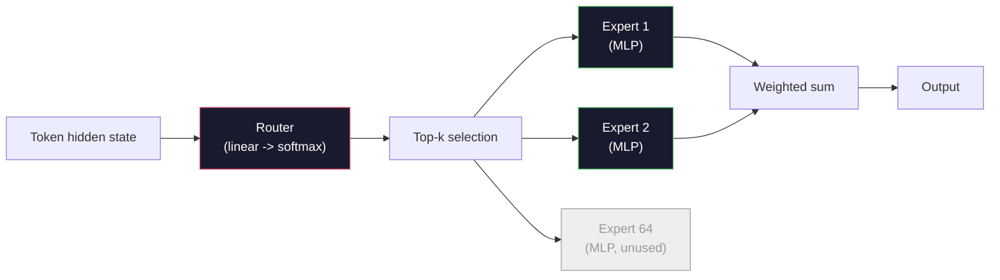

# Modèles ouverts: parcours en architecture

> Vous avez construit un GPT-2 petit à partir de zéro dans la leçon 04. Les modèles frontaliers ouverts en 2026 sont la même famille avec cinq ou six changements concrets. RMSNorm au lieu de LayerNorm. SwiGLU au lieu de GELU. REPE au lieu de positions apprises. GQA ou MLA au lieu de MHA complet. Un mélange d'experts à grande échelle. Les mathématiques que vous connaissez couvrent 95% d'entre eux. Cette leçon lit Llama 3, DeepSeek-V3, Mixtral, Qwen et Gemma côte à côte et nomme la ligne exacte où chaque architecture diverge.

**Type:** Learn
**Languages:** Python (stdlib)
**Prerequisites:** Phase 10, Lessons 04, 05, 12 (Pre-training, Scaling, Inference)
**Time:** ~45 minutes

## Objectifs d'apprentissage

- Lisez le config.json de Llama 3, Mistral, Mixtral, Gemma 2, Qwen 2.5, et DeepSeek-V3 et expliquez chaque champ
- Nommez le changement architectural spécifique réalisé par chaque modèle par rapport à GPT-2 Small et justifiez-le à partir des premiers principes
- Compte des paramètres de calcul, taille de cache KV et mémoire d'activation pour tout modèle ouvert à partir de sa seule configuration
- Choisissez le bon modèle ouvert pour une cible de déploiement compte tenu des contraintes de latence, de mémoire et de capacité

## Le problème

Dans la leçon 04 tu as écrit 350 lignes de numpy et tu avais un modèle en forme de GPT-2. Llama 3 405B a un rapport technique de 200 pages. Votre instinct est que ce sont des bêtes différentes. Ils ne le sont pas. Les 200 pages décrivent le même objet avec cinq ou six modifications bien motivées, plus mille détails d'implémentation sur l'échelle. Le squelette -- intégration, blocs transformateurs, attention, MLP, norme, tête -- est inchangé.

Cette leçon est différente. Pour chaque grande famille de modèles ouverts, nous énumérons exactement ce qui a changé de GPT-2, pourquoi, et ce qu'il a coûté.

Le résultat pratique est que lorsque Meta libère Llama 5 ou DeepSeek libère V4, vous n'aurez pas besoin d'un nouveau modèle mental. Vous regarderez la configuration, vous verrez quels des boutons bien connus sont déplacés et saurez quelles sont les implications en aval.

## Le concept

### Le noyau invariable

Tous les modèles ouverts autorégressifs partagent:

- Matrice d'intégration de jetons (taille vocab_size x hidden_dim).
- Stack de blocs de décodeur N: norme, attention à soi, résiduel, norme, MLP, résiduel.
- Norme finale et tête linéaire projetant à la taille vocab_size (souvent liée par poids avec des emboîtrements).
- Masque de causalité, la perte de l'entropie croisée du prochain jeton.

C'est la forme, le reste est des boutons.

### Les six nœuds qui se déplacent réellement

Dans chaque modèle ouvert de 2024 à 2026, les six mêmes choix de conception sont choisis encore et encore:

1. **Normalization.**LayerNorm -> RMSNorm.
2. **Positional encoding.**Apprendre à être absolument -> RoPE (plus des variantes: YaRN, NTK).
3. **Activation.**GELU -> SwiGLU (ou GeGLU).
4. **Attention head sharing.**MHA -> GQA -> MQA -> MLA.
5. **Dense vs sparse MLP.**Densé -> Mixture d'experts.
6. **Pre-norm placement.**La pré-norme reste, la post-norme est partie.

Tout le reste (horaire de taux d'apprentissage, mix de données, taille de lot, longueur de contexte) se trouve dans la configuration de formation, pas dans l'architecture.

### Nœud 1: RMSNorm

LayerNorm soustrait la moyenne, divisée par std, échelle et changements.

```
RMSNorm(x) = x / sqrt(mean(x^2) + eps) * gamma
```

Aucune soustraction moyenne. Aucun biais. Un matmul moins par jeton. Zhang et Sennrich (2019) ont soutenu qu'il correspondait à LayerNorm sur la traduction automatique tout en étant 10% plus rapide.

Le coût: nul. L'avantage: petit gain de débit, code plus simple.

### Nœud 2: RoPE

Les embellissements de position apprises étaient une table de recherche de 1024 fentes dans GPT-2. Le contexte 1025 est hors de la fin de la table.

Embedding rotatif en position (RoPE, Su et al. 2021) injecte la position en tournant chaque vecteur Q et K en paires avant le produit du point d'attention. L'angle de rotation est une fonction déterministe de position, donc il n'y a rien à apprendre et rien à manquer. Avec des astuces d'échelle (interpolation consciente du NTK, YaRN), un modèle formé sur le contexte 8k peut s'étendre à 128k à l'inférence avec une perte modeste de précision.

```
q_rotated = rotate(q, angle(pos))
k_rotated = rotate(k, angle(pos))
score = q_rotated . k_rotated
```

Chaque Llama, Mistral, Qwen, DeepSeek et Gemma utilise un RoPE. Gemma 2 utilise un hybride (RoPE sur la plupart des couches, attention locale des fenêtres coulissantes sur d'autres).

### Nœud 3: SwiGLU

Le PMA du GPT-2 est `x -> gelu(xW1 + b1) -> (...)W2 + b2`. SwiGLU (Shazeer 2020) remplace l'activation par un produit fermé:

```
SwiGLU(x) = (xW1) * sigmoid(xW1) * xV
```

Deux projections en parallèle au lieu d'une, fermées par l'activation Swish. Empirieusement plus forte sur la perplexité par paramètre. Llama 2 l'a adopté, tout le monde l'a suivi. La taille cachée du MLP est généralement réglée de sorte que le nombre total de paramètres correspond à l'original dense MLP: si GPT-2 a été utilisé `ff_dim = 4 * hidden`, SwiGLU utilise `ff_dim = (2/3) * 4 * hidden = 8/3 * hidden`- Je suis désolé .

### Nœud 4: Partage de la tête d'attention

GPT-2 utilisé **Multi-Head Attention (MHA)**: chaque tête a sa propre projection Q, K, V.

**Multi-Query Attention (MQA, Shazeer 2019)**Il coupe le cache KV par num_heads, ce qui est une réduction de 12 à 32 fois sur un modèle typique.

**Grouped-Query Attention (GQA, Ainslie et al. 2023)**est le point intermédiaire: les groupes G de têtes Q partagent un K et un V. Llama 3 8B utilise GQA avec 32 têtes Q et 8 têtes KV (G=8), de sorte que le cache KV se rétrécit 4x par rapport à la MHA complète.

**Multi-Head Latent Attention (MLA, DeepSeek 2024)**Il est également possible de supprimer les données de K et V dans un latente partagé de bas rang, les projetant vers le haut par tête.

| Scheme | KV Heads | KV Cache | Accuracy |
|--------|----------|----------|----------|
| MHA    | num_heads | full | best |
| GQA    | num_groups (G < num_heads) | num_heads / G reduction | near-MHA |
| MQA    | 1 | num_heads reduction | small hit |
| MLA    | latent, per-head decompression | smaller than MQA | near-MHA |

Pour tout modèle au-dessus des paramètres ~13B, GQA ou MLA est effectivement obligatoire.

### Nœud 5: mélange d'experts

Un MLP dense active tous ses paramètres pour chaque jeton. Un MLP MoE a des experts K par bloc et un routeur qui choisit les experts top-k par jeton (généralement top-2). Seuls les poids de ces experts voient un passe avant pour ce jeton.

```
router_logits = xW_r
indices, weights = top_k(router_logits, k=2)
output = sum_i weights[i] * expert[indices[i]](x)
```

L'attrait: vous pouvez avoir 64 experts de taille 7B chacun (donc le nombre total de paramètres est énorme) tout en exécutant seulement 2 d'entre eux par jeton (donc le calcul par jeton correspond à un modèle 7B dense). Mixtral 8x7B a 47B paramètres totaux mais active seulement 13B par jeton. DeepSeek-V3 a 671B paramètres totaux mais active seulement 37B par jeton.



Avantages: le même calcul, plus de paramètres, meilleure capacité. inconvénients: la mémoire d'expert doit toujours vivre quelque part (donc le serveur a besoin de plus de VRAM qu'un équivalent dense), l'équilibrage de la charge du routeur est difficile, et l'ajustement de la mise en réseau du routeur pendant l'alignement est son propre domaine de recherche.

### Nœud 6: Reste pré-normaire

La norme de couche de transformateur d'origine est appliquée après chaque sous-couche. chaque modèle ouvert depuis GPT-2 la met *avant* chaque sous-couche.

### Différence modèle par modèle

Voici la table qui fait tout ce béton.

| Model | Year | Total Params | Active Params | Norm | Activation | Position | Attention | MoE | Context |
|-------|------|-------------|---------------|------|-----------|----------|-----------|-----|---------|
| GPT-2 Small | 2019 | 124M | 124M | LayerNorm | GELU | Learned | MHA (12 heads) | no | 1k |
| Llama 3 8B | 2024 | 8B | 8B | RMSNorm | SwiGLU | RoPE | GQA (32/8) | no | 128k |
| Llama 3 70B | 2024 | 70B | 70B | RMSNorm | SwiGLU | RoPE | GQA (64/8) | no | 128k |
| Llama 3 405B | 2024 | 405B | 405B | RMSNorm | SwiGLU | RoPE | GQA (128/16) | no | 128k |
| Mistral 7B | 2023 | 7.2B | 7.2B | RMSNorm | SwiGLU | RoPE | GQA | no | 32k |
| Mixtral 8x7B | 2023 | 47B | 13B | RMSNorm | SwiGLU | RoPE | GQA | yes (8 experts, top-2) | 32k |
| Gemma 2 9B | 2024 | 9B | 9B | RMSNorm (pre+post) | GeGLU | RoPE + sliding | GQA | no | 8k |
| Qwen 2.5 72B | 2024 | 72B | 72B | RMSNorm | SwiGLU | RoPE (YaRN) | GQA (64/8) | no | 128k |
| DeepSeek V2 236B | 2024 | 236B | 21B | RMSNorm | SwiGLU | RoPE | MLA | yes (160 experts, top-6) | 128k |
| DeepSeek V3 | 2024 | 671B | 37B | RMSNorm | SwiGLU | RoPE | MLA | yes (256 experts, top-8) | 128k |

Le RMSNorm est universel. SwiGLU ou son cousin GeGLU est universel. RoPE est universel. GQA est universel au-dessus de 7B sauf lorsqu'il est remplacé par MLA. MoE est le différenciateur à l'extrémité supérieure.

### Je lis une config.json

Llama 3 8B configuration:

```
{
  "hidden_size": 4096,
  "intermediate_size": 14336,
  "num_hidden_layers": 32,
  "num_attention_heads": 32,
  "num_key_value_heads": 8,
  "max_position_embeddings": 131072,
  "rope_theta": 500000.0,
  "rms_norm_eps": 1e-5,
  "vocab_size": 128256
}
```

Chaque champ correspond à quelque chose que vous avez déjà mis en œuvre.

- `hidden_size`: dimension d'intégration.
- `intermediate_size`: taille cachée de MLP (3.5x cachée -- math SwiGLU).
- `num_hidden_layers`: profondeur de pile.
- `num_attention_heads`Les têtes de Q.
- `num_key_value_heads`: têtes de véhicule électrique (GQA).
- `max_position_embeddings`: longueur du contexte de formation.
- `rope_theta`La méta a porté le décalage de 10k à 500k pour l'extrapolation de long contexte.
- `rms_norm_eps`: stabilité numérique.
- `vocab_size`: des jetons.

À partir de ces seules, vous comptez les paramètres totaux, KV cache, et la mémoire de pointe d'activation. Voir `code/main.py`pour les formules exactes.

### Budget de mémoire d'activation

Les activations dominent la mémoire d'entraînement au-dessus de quelques milliards de paramètres.

```
activation_mem ~ batch_size * seq_len * hidden_size * num_layers * bytes_per_element
```

Pour Llama 3 8B au lot 1, seq 8192, BF16, 32 couches, cachées 4096: environ 8 Go seulement pour les activations avec checkpointing, 40 Go sans. C'est pourquoi l'attention flash et l'attention ring-matter -- ils réécrivent le calcul de l'attention pour que les activations correspondent.

### Budget de KV Cache

Pour l'inférence au maximum:

```
kv_cache = 2 * num_layers * num_kv_heads * head_dim * max_seq_len * bytes_per_element
```

Llama 3 8B dans le contexte 128k, BF16, tête_dim = cachée / num_heads = 128:
`2 * 32 * 8 * 128 * 131072 * 2 = 17.2 GB`par séquence.

Les poids 8B sont de 16 Go en BF16. Le cache KV pour une seule séquence 128k est plus grand que les poids.

### Quand chaque modèle gagne

- **Single 80GB GPU, no MoE**Llama 3 8B, Mistral 7B, Gemma 2 9B. Facile à servir, outillage large.
- **Single node (8x80GB), big capacity**Llama 3 70B, Qwen 2.5 72B. Capacité d'ouverture densément élevée.
- **Biggest open capability, accept MoE complexity**: DeepSeek V3, Mixtral 8x22B. La meilleure capacité par FLOP actif.
- **Long-context needs**: Llama 3 (128k avec RoPE), DeepSeek (avantage MLA).
- **Low-latency serving**: Gemma 2 9B (facile à couler réduit le calcul de longs contextes).

```figure
rmsnorm-vs-layernorm
```

## Faites-le

Le code de la leçon est une calculatrice. étant donné que n'importe quelle configuration.json, il imprime le nombre de paramètres par composant, le cache KV au contexte max, le ratio SwiGLU MLP et un court verdict sur l'architecture (dense / GQA / MLA / MoE).

```python
config = {
    "hidden_size": 4096, "intermediate_size": 14336,
    "num_hidden_layers": 32, "num_attention_heads": 32,
    "num_key_value_heads": 8, "vocab_size": 128256,
    "max_position_embeddings": 131072,
}
```

Le script passe le champ d'architecture par champ, calcule les paramètres pour l'intégration, l'attention (avec réduction GQA), MLP (avec expansion SwiGLU), les normes de couches et la tête. Il calcule ensuite le cache KV à la longueur de contexte indiquée et imprime un résumé.

Regardez !`code/main.py`pour la mise en œuvre.

## Utilisez-le

Exécutez la calculatrice sur les configurations Llama 3 8B, Mistral 7B, Mixtral 8x7B et DeepSeek V3 regroupées dans le script. Comparer les pannes de paramètres. Notez que les modèles MoE ont un nombre total de paramètres qui égale les modèles denses mais un nombre de paramètres actifs qui est souvent plus petit. Notez que le cache KV de DeepSeek V3 est plus petit que celui de Llama 3 405B malgré avoir plus de paramètres totaux - c'est MLA en action.

Puis connectez un configuration pour n'importe quel modèle que vous avez localement, lisez le résumé, et décidez si il correspond à votre GPU.

## La faire partir

Cette leçon produit `outputs/skill-open-model-picker.md`. Compte tenu d'un objectif de déploiement (type GPU, VRAM, longueur de contexte, budget de latence) et d'un profil de tâche (chat, code, raisonnement, long-context), il recommande un modèle ouvert, un schéma de quantification de la leçon 11, et une pile d'inférence de la leçon 12, avec un raisonnement explicite sur les six boutons architecturaux.

## Exercices

1. Lisez la configuration Qwen 2.5 72B de HuggingFace. Comptez les paramètres totaux à partir de zéro. Comparer à la valeur HF déclarée et identifier d'où provient tout delta (arrondissement de tête, facteur de partage de KV, etc.).

2. DeepSeek V3 utilise 256 experts avec un routage top-8. Comptez le ratio d'experts actifs à des experts totaux et comparez-le avec le top-2 de Mixtral 8x7B de 8.

3. Computez le cache KV pour Llama 3 405B dans un contexte de 128k en FP8 et BF16. À FP8 c'est la moitié du nombre BF16. Combien de séquences parallèles pouvez-vous servir sur un seul nœud 8xH100 (80 Go chacun = 640 Go total, moins poids mémoire)?

4. Gemma 2 alternera les couches de pleine attention et de fenêtre coulissante-attention. Écrivez les mathématiques pour le cache KV lorsque la moitié des couches utilisent une fenêtre coulissante de 4096 jetons au lieu du contexte complet.

5. Trouvez un modèle ouvert de frontière récent qui a été publié après la rédaction de cette leçon. Identifiez lequel des six boutons qu'il a choisi et si il a introduit un septième bouton. Le programme sera obsolète dès qu'une nouvelle architecture sera lancée - l'objectif est de mettre à jour votre table sans reconstruire votre modèle mental.

## Les termes clés

| Term | What people say | What it actually means |
|------|----------------|----------------------|
| RMSNorm | "LayerNorm without the mean" | Normalize by root mean square only, with a learned scale — cheaper and comparable to LayerNorm |
| RoPE | "Rotary positions" | Rotate each Q and K vector in 2D pairs by an angle that depends on position — extrapolates beyond training length with scaling tricks |
| SwiGLU | "The new MLP activation" | Gated linear unit with Swish: `(xW1) * sigmoid(xW1) * xV` — standard in every 2024+ open model |
| GQA | "Middle ground attention" | Grouped-Query Attention: G groups of Q heads share one K and one V head — shrinks KV cache without MQA's accuracy hit |
| MLA | "DeepSeek's attention" | Multi-Head Latent Attention: compress K/V into a shared low-rank latent, decompress per head — smallest KV cache for large models |
| MoE | "Sparse experts" | Mixture of Experts: N MLPs per block, router picks top-k per token — huge total params, small active params |
| Top-k routing | "Pick k experts per token" | The router computes a score per expert and activates the k highest — typical k is 2 (Mixtral) to 8 (DeepSeek) |
| YaRN | "Stretch RoPE" | Yet another RoPE extension — interpolates rotary angles to extend context from 8k to 128k+ at inference time |
| Sliding-window attention | "Don't attend to everything" | Each token attends only to the last W tokens — caps attention cost at O(W) per token, used in Gemma 2 and early Mistral |
| Active params | "What runs per token" | For MoE models, the parameter count that sees a forward pass per token (much smaller than total params) — governs per-token FLOPs |

## Pour en savoir plus

- [Dubey et al., 2024 -- "The Llama 3 Herd of Models"](https://arxiv.org/abs/2407.21783)-- la référence architecturale et de formation pour la famille dense Llama 3
- [DeepSeek-AI, 2024 -- "DeepSeek-V3 Technical Report"](https://arxiv.org/abs/2412.19437)-- MLA plus équilibrage de charge sans perte auxiliaire plus 671B MoE
- [Jiang et al., 2024 -- "Mixtral of Experts"](https://arxiv.org/abs/2401.04088)-- le modèle de modèle canonique du MoE ouvert
- [Su et al., 2021 -- "RoFormer: Enhanced Transformer with Rotary Position Embedding"](https://arxiv.org/abs/2104.09864)- le papier RoPE
- [Shazeer, 2020 -- "GLU Variants Improve Transformer"](https://arxiv.org/abs/2002.05202)- SwiGLU, GeGLU, et les amis
- [Ainslie et al., 2023 -- "GQA: Training Generalized Multi-Query Transformer Models"](https://arxiv.org/abs/2305.13245)- le papier GQA
- [Gemma 2 Team, 2024 -- "Gemma 2: Improving Open Language Models at a Practical Size"](https://arxiv.org/abs/2408.00118)-- hybride de l'attention pleine+slip, pré+post-norme
- [Qwen Team, 2024 -- "Qwen 2.5 Technical Report"](https://arxiv.org/abs/2412.15115)-- Extension de contexte de la RNY et recettes de formation à long terme
