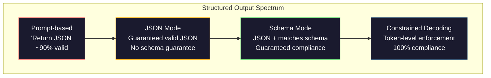
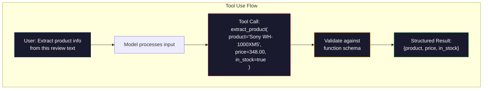

# Les résultats structurés: JSON, validation du schéma, décoding restreint

> Votre LLM renvoie une chaîne. Votre application a besoin de JSON. Ce vide a écrasé plus de systèmes de production que toute hallucination de modèle. La sortie structurée est le pont entre le langage naturel et les données typées. Faites-le bien et votre LLM devient une API fiable. Faites-le mal et vous partagez le texte libre avec Regex à 3h du matin.

**Type:** Build
**Languages:** Python
**Prerequisites:** Phase 10, Lessons 01-05 (LLMs from Scratch)
**Time:** ~90 minutes
**Related:**La phase 5 · 20 (Outputs structurés et décoding restreint) couvre la théorie au niveau du décodeur (processeurs de logit FSM/CFG, contours, XGrammar).`response_format`, Utilisation des outils anthropologiques, instructeur)  lire d'abord la phase 5 · 20 si vous voulez comprendre ce qui se passe sous l'API.

## Objectifs d'apprentissage

- Implémenter des sorties en mode JSON et en schéma restreints en utilisant les paramètres OpenAI et API Anthropic
- Construire une couche de validation Pydantic qui rejette les sorties et les retentissements malformés du LLM avec des retours d'erreur
- Expliquez comment le décoding restreint force à valider JSON au niveau des jetons sans traitement post-processage
- Conception de commandes d'extraction robustes qui convertissent de manière fiable le texte non structuré en structures de données typées

## Le problème

Vous demandez à un LLM: "Extraitez le nom du produit, le prix et la disponibilité de ce texte". Il répond:

```
The product is the Sony WH-1000XM5 headphones, which cost $348.00 and are currently in stock.
```

C'est une réponse parfaitement correcte.`{"product": "Sony WH-1000XM5", "price": 348.00, "in_stock": true}`Vous avez besoin d'un objet JSON avec des clés spécifiques, des types spécifiques et des contraintes de valeur spécifiques. Vous n'avez pas besoin d'une phrase.

La solution naïve: ajoutez "Répondre en JSON" à votre demande. Ça marche 90% du temps. Les 10% restants du modèle enveloppent le JSON dans des clôtures de code de démarrage, ou ajoutent un préambule comme "Voici le JSON:", ou produisent un JSON syntaxiquement non valide parce qu'il a fermé un parenthèsis tôt. Votre analyseur JSON s'écrase. Votre pipeline est cassée. Vous ajoutez essayer/excuter et une boucle de réessayer. La réessayage produit parfois des données différentes. Vous avez un problème de cohérence en plus d'un problème de partage.

Ce n'est pas un problème d'ingénierie rapide. C'est un problème de décoding. Le modèle génère des jetons de gauche à droite. À chaque position, il choisit le plus probable prochain jeton d'un vocabulaire de 100K + options. La plupart de ces options produiraient JSON invalide à n'importe quelle position donnée. Si le modèle vient d'émettre `{"price":`, le symbole suivant doit être un chiffre, une citation (pour la chaîne), `null`- Je suis là .`true`- Je suis là .`false`Le modèle peut choisir un mot anglais parfaitement raisonnable qui est catastrophiquement faux de syntaxe.

## Le concept

### Le spectre structuré des sorties

Il existe quatre niveaux de contrôle de sortie structurés, chacun plus fiable que le dernier.



**Prompt-based**("Répondre en JSON valide"): aucune mise en œuvre. Le modèle est généralement conforme mais parfois non. Fiabilité: ~ 90%. Mode d'échec: clôtures de marquage, texte de préambule, sortie tronquée, structure erronée.

**JSON mode**: l'API garantit que la sortie est valide JSON.`response_format: { type: "json_object" }`La sortie analysera sans erreur. Mais elle peut ne pas correspondre à votre schéma attendu - clés supplémentaires, types erronés, champs manquants.

**Schema mode**L'API prend un schéma JSON et garantit que la sortie correspond à celui-ci.`response_format: { type: "json_schema", json_schema: {...} }`(également appelé `tool_choice="required"`), l'utilisation des outils par Anthropic avec `input_schema`, et les Gémeaux `response_schema`+ `response_mime_type: "application/json"`La sortie contient les clés, les types et les contraintes exactes que vous avez spécifiées.

**Constrained decoding**Le décodeur masque tous les jetons qui produiraient une sortie invalide. Si le schéma nécessite un numéro et que le modèle est sur le point d'émettre une lettre, ce jeton est réglé sur probabilité zéro. Le modèle ne peut produire que des jetons qui conduisent à une sortie valide. C'est ce que le mode de sortie structuré d'OpenAI et les bibliothèques comme Outlines et Guidance mettent en œuvre sous le capot.

### JSON Schema: le langage du contrat

JSON Schema est la façon dont vous dites au modèle (ou à la couche de validation) quelle forme doit avoir la sortie.

```json
{
  "type": "object",
  "properties": {
    "product": { "type": "string" },
    "price": { "type": "number", "minimum": 0 },
    "in_stock": { "type": "boolean" },
    "categories": {
      "type": "array",
      "items": { "type": "string" }
    }
  },
  "required": ["product", "price", "in_stock"]
}
```

Ce schéma dit: la sortie doit être un objet avec une chaîne `product`, un nombre non négatif `price`, une booléenne `in_stock`, et une série optionnelle de chaînes `categories`Tout produit qui ne correspond pas est rejeté.

Les schémas traitent les cas difficiles: objets en nid, matrices avec éléments taillés, enums (confiner une chaîne à des valeurs spécifiques), correspondance de motifs (régex sur les chaînes) et combinateurs (oneOf, anyOf, allOf pour les sorties polymorphes).

### Le modèle pydantique

En Python, vous n'écrivez pas JSON Schema à la main. Vous définissez un modèle Pydantic et il génère le schéma pour vous.

```python
from pydantic import BaseModel

class Product(BaseModel):
    product: str
    price: float
    in_stock: bool
    categories: list[str] = []
```

Le système de calcul de la base de données de l'instructeur (et le SDK d'OpenAI) accepte directement les modèles Pydantic: passez la classe de modèle, récupérez une instance validée.

### Appel à fonction / utilisation d' outils

Une interface alternative pour le même problème. Au lieu de demander au modèle de produire directement JSON, vous définissez des "outils" (fonctions) avec des paramètres typés. Le modèle produit un appel de fonction avec des arguments structurés. OpenAI appelle cela "appel de fonction". Anthropic l'appelle "utilisation d'outils". Le résultat est le même: données structurées.



L'utilisation d'outils est préférée lorsque le modèle doit choisir quelle fonction appeler, et non seulement remplir des paramètres. Si vous avez 10 schémas d'extraction différents et que le modèle doit choisir le bon en fonction de l'entrée, l'utilisation d'outils vous donne à la fois la sélection du schéma et la sortie structurée.

### Des défaillances courantes

Même avec l'application du schéma, les sorties structurées peuvent échouer de manière subtile.

**Hallucinated values**Le modèle produit des données inventées.`{"price": 299.99}`La validation du schéma ne peut pas saisir ceci -- le type est correct, la valeur est erronée.

**Enum confusion**: vous restreignez un champ à `["in_stock", "out_of_stock", "preorder"]`- Les résultats du modèle`"available"`- correct sémantiquement, mais pas dans l'ensemble autorisé.

**Nested object depth**Les systèmes de mise en place de systèmes de mise en place de systèmes de mise en place de systèmes de mise en place de systèmes de mise en place de systèmes de mise en place de systèmes de mise en place de systèmes de mise en place de systèmes de mise en place de systèmes de mise en place de systèmes de mise en place de systèmes de mise en place de systèmes de mise en place de systèmes de mise en place de systèmes de mise en place de systèmes de mise en place de systèmes de mise en place de systèmes de mise en place de systèmes de mise en place de systèmes de mise en place de systèmes de mise en place de systèmes de mise en place de systèmes de mise en place de systèmes de mise en place de systèmes de mise en place de systèmes de mise en place de systèmes de mise en place de systèmes de mise en place de systèmes de mise en place de systèmes de mise en place de systèmes de mise en place de systèmes de mise en place de systèmes de mise en place de systèmes de mise en place de systèmes de mise en place de systèmes de mise en place de systèmes de mise en place de systèmes de mise en place de systèmes de mise en place de systèmes de mise en place de systèmes de mise en place de systèmes de mise en place de systèmes de mise en place de systèmes de mise en place de mise en place de systèmes de mise en place de systèmes de mise en place de mise en place de systèmes de mise en place de systèmes de mise en place de systèmes de mise en place de mise en place de systèmes de mise en place de mise en place de systèmes de mise en place de données de données de mise en place de données de base de données de base de base de données sont plus.

**Array length**: le modèle peut produire trop ou trop peu d'articles dans un tableau.`minItems`et `maxItems`mais tous les fournisseurs ne les appliquent pas au niveau du décoding.

**Optional field omission**: le modèle omet des champs qui sont techniquement facultatifs mais sémantiquement importants pour votre cas d'utilisation.`null`explicitement.

```figure
mx-schema-funnel
```

## Faites-le

### Étape 1: Validateur de schéma JSON

Construisez un validateur à partir de zéro qui vérifie si un objet Python correspond à un schéma JSON. C'est ce qui fonctionne sur le côté de sortie pour vérifier la conformité.

```python
import json

def validate_schema(data, schema):
    errors = []
    _validate(data, schema, "", errors)
    return errors

def _validate(data, schema, path, errors):
    schema_type = schema.get("type")

    if schema_type == "object":
        if not isinstance(data, dict):
            errors.append(f"{path}: expected object, got {type(data).__name__}")
            return
        for key in schema.get("required", []):
            if key not in data:
                errors.append(f"{path}.{key}: required field missing")
        properties = schema.get("properties", {})
        for key, value in data.items():
            if key in properties:
                _validate(value, properties[key], f"{path}.{key}", errors)

    elif schema_type == "array":
        if not isinstance(data, list):
            errors.append(f"{path}: expected array, got {type(data).__name__}")
            return
        min_items = schema.get("minItems", 0)
        max_items = schema.get("maxItems", float("inf"))
        if len(data) < min_items:
            errors.append(f"{path}: array has {len(data)} items, minimum is {min_items}")
        if len(data) > max_items:
            errors.append(f"{path}: array has {len(data)} items, maximum is {max_items}")
        items_schema = schema.get("items", {})
        for i, item in enumerate(data):
            _validate(item, items_schema, f"{path}[{i}]", errors)

    elif schema_type == "string":
        if not isinstance(data, str):
            errors.append(f"{path}: expected string, got {type(data).__name__}")
            return
        enum_values = schema.get("enum")
        if enum_values and data not in enum_values:
            errors.append(f"{path}: '{data}' not in allowed values {enum_values}")

    elif schema_type == "number":
        if not isinstance(data, (int, float)):
            errors.append(f"{path}: expected number, got {type(data).__name__}")
            return
        minimum = schema.get("minimum")
        maximum = schema.get("maximum")
        if minimum is not None and data < minimum:
            errors.append(f"{path}: {data} is less than minimum {minimum}")
        if maximum is not None and data > maximum:
            errors.append(f"{path}: {data} is greater than maximum {maximum}")

    elif schema_type == "boolean":
        if not isinstance(data, bool):
            errors.append(f"{path}: expected boolean, got {type(data).__name__}")

    elif schema_type == "integer":
        if not isinstance(data, int) or isinstance(data, bool):
            errors.append(f"{path}: expected integer, got {type(data).__name__}")
```

### Étape 2: Modèle de style pydantique à schéma

Construisez un convertisseur de classe à schéma minimal. Définissez une classe Python et générez son schéma JSON automatiquement.

```python
class SchemaField:
    def __init__(self, field_type, required=True, default=None, enum=None, minimum=None, maximum=None):
        self.field_type = field_type
        self.required = required
        self.default = default
        self.enum = enum
        self.minimum = minimum
        self.maximum = maximum

def python_type_to_schema(field):
    type_map = {
        str: "string",
        int: "integer",
        float: "number",
        bool: "boolean",
    }

    schema = {}

    if field.field_type in type_map:
        schema["type"] = type_map[field.field_type]
    elif field.field_type == list:
        schema["type"] = "array"
        schema["items"] = {"type": "string"}
    elif isinstance(field.field_type, dict):
        schema = field.field_type

    if field.enum:
        schema["enum"] = field.enum
    if field.minimum is not None:
        schema["minimum"] = field.minimum
    if field.maximum is not None:
        schema["maximum"] = field.maximum

    return schema

def model_to_schema(name, fields):
    properties = {}
    required = []

    for field_name, field in fields.items():
        properties[field_name] = python_type_to_schema(field)
        if field.required:
            required.append(field_name)

    return {
        "type": "object",
        "properties": properties,
        "required": required,
    }
```

### Étape 3: Filtre des jetons avec des restrictions

Simuler le décoding restreint. Compte tenu d'une chaîne JSON partielle et d'un schéma, déterminer quelles catégories de jetons sont valables à la position actuelle.

```python
def next_valid_tokens(partial_json, schema):
    stripped = partial_json.strip()

    if not stripped:
        return ["{"]

    try:
        json.loads(stripped)
        return ["<EOS>"]
    except json.JSONDecodeError:
        pass

    last_char = stripped[-1] if stripped else ""

    if last_char == "{":
        return ['"', "}"]
    elif last_char == '"':
        if stripped.endswith('":'):
            return ['"', "0-9", "true", "false", "null", "[", "{"]
        return ["a-z", '"']
    elif last_char == ":":
        return [" ", '"', "0-9", "true", "false", "null", "[", "{"]
    elif last_char == ",":
        return [" ", '"', "{", "["]
    elif last_char in "0123456789":
        return ["0-9", ".", ",", "}", "]"]
    elif last_char == "}":
        return [",", "}", "]", "<EOS>"]
    elif last_char == "]":
        return [",", "}", "<EOS>"]
    elif last_char == "[":
        return ['"', "0-9", "true", "false", "null", "{", "[", "]"]
    else:
        return ["any"]

def demonstrate_constrained_decoding():
    partial_states = [
        '',
        '{',
        '{"product"',
        '{"product":',
        '{"product": "Sony"',
        '{"product": "Sony",',
        '{"product": "Sony", "price":',
        '{"product": "Sony", "price": 348',
        '{"product": "Sony", "price": 348}',
    ]

    print(f"{'Partial JSON':<45} {'Valid Next Tokens'}")
    print("-" * 80)
    for state in partial_states:
        valid = next_valid_tokens(state, {})
        display = state if state else "(empty)"
        print(f"{display:<45} {valid}")
```

### Étape 4: Pipeline d'extraction

Combinez tout dans un pipeline d'extraction: définissez un schéma, simuliez un LLM produisant une sortie structurée, validez la sortie et gérez les retries.

```python
def simulate_llm_extraction(text, schema, attempt=0):
    if "headphones" in text.lower() or "sony" in text.lower():
        if attempt == 0:
            return '{"product": "Sony WH-1000XM5", "price": 348.00, "in_stock": true, "categories": ["audio", "headphones"]}'
        return '{"product": "Sony WH-1000XM5", "price": 348.00, "in_stock": true}'

    if "laptop" in text.lower():
        return '{"product": "MacBook Pro 16", "price": 2499.00, "in_stock": false, "categories": ["computers"]}'

    return '{"product": "Unknown", "price": 0, "in_stock": false}'

def extract_with_retry(text, schema, max_retries=3):
    for attempt in range(max_retries):
        raw = simulate_llm_extraction(text, schema, attempt)

        try:
            data = json.loads(raw)
        except json.JSONDecodeError as e:
            print(f"  Attempt {attempt + 1}: JSON parse error -- {e}")
            continue

        errors = validate_schema(data, schema)
        if not errors:
            return data

        print(f"  Attempt {attempt + 1}: Schema validation errors -- {errors}")

    return None

product_schema = {
    "type": "object",
    "properties": {
        "product": {"type": "string"},
        "price": {"type": "number", "minimum": 0},
        "in_stock": {"type": "boolean"},
        "categories": {"type": "array", "items": {"type": "string"}},
    },
    "required": ["product", "price", "in_stock"],
}
```

### Étape 5: Remplissez le pipeline

```python
def run_demo():
    print("=" * 60)
    print("  Structured Output Pipeline Demo")
    print("=" * 60)

    print("\n--- Schema Definition ---")
    product_fields = {
        "product": SchemaField(str),
        "price": SchemaField(float, minimum=0),
        "in_stock": SchemaField(bool),
        "categories": SchemaField(list, required=False),
    }
    generated_schema = model_to_schema("Product", product_fields)
    print(json.dumps(generated_schema, indent=2))

    print("\n--- Schema Validation ---")
    test_cases = [
        ({"product": "Test", "price": 10.0, "in_stock": True}, "Valid object"),
        ({"product": "Test", "price": -5.0, "in_stock": True}, "Negative price"),
        ({"product": "Test", "in_stock": True}, "Missing price"),
        ({"product": "Test", "price": "ten", "in_stock": True}, "String as price"),
        ("not an object", "String instead of object"),
    ]

    for data, label in test_cases:
        errors = validate_schema(data, product_schema)
        status = "PASS" if not errors else f"FAIL: {errors}"
        print(f"  {label}: {status}")

    print("\n--- Constrained Decoding Simulation ---")
    demonstrate_constrained_decoding()

    print("\n--- Extraction Pipeline ---")
    texts = [
        "The Sony WH-1000XM5 headphones are priced at $348 and currently available.",
        "The new MacBook Pro 16-inch laptop costs $2499 but is sold out.",
        "This is a random sentence with no product info.",
    ]

    for text in texts:
        print(f"\n  Input: {text[:60]}...")
        result = extract_with_retry(text, product_schema)
        if result:
            print(f"  Output: {json.dumps(result)}")
        else:
            print(f"  Output: FAILED after retries")
```

## Utilisez-le

### Outputs structurés d'OpenAI

```python
# from openai import OpenAI
# from pydantic import BaseModel
#
# client = OpenAI()
#
# class Product(BaseModel):
#     product: str
#     price: float
#     in_stock: bool
#
# response = client.beta.chat.completions.parse(
#     model="gpt-5-mini",
#     messages=[
#         {"role": "system", "content": "Extract product information."},
#         {"role": "user", "content": "Sony WH-1000XM5, $348, in stock"},
#     ],
#     response_format=Product,
# )
#
# product = response.choices[0].message.parsed
# print(product.product, product.price, product.in_stock)
```

Le mode de sortie structuré d'OpenAI utilise un décoding interné restreint. Chaque jeton généré par le modèle est garanti pour produire une sortie correspondant au schéma Pydantic. Aucune réessayage n'est nécessaire. Aucune validation n'est nécessaire. La contrainte est cuite dans le processus de décoding.

### Utilisation d'outils anthropologiques

```python
# import anthropic
#
# client = anthropic.Anthropic()
#
# response = client.messages.create(
#     model="claude-opus-4-7",
#     max_tokens=1024,
#     tools=[{
#         "name": "extract_product",
#         "description": "Extract product information from text",
#         "input_schema": {
#             "type": "object",
#             "properties": {
#                 "product": {"type": "string"},
#                 "price": {"type": "number"},
#                 "in_stock": {"type": "boolean"},
#             },
#             "required": ["product", "price", "in_stock"],
#         },
#     }],
#     messages=[{"role": "user", "content": "Extract: Sony WH-1000XM5, $348, in stock"}],
# )
```

Anthropic obtient une sortie structurée grâce à l'utilisation d'outils. Le modèle émet un appel à outil avec des arguments structurés qui correspondent au schéma d'entrée.

### Bibliothèque des instructeurs

```python
# pip install instructor
# import instructor
# from openai import OpenAI
# from pydantic import BaseModel
#
# client = instructor.from_openai(OpenAI())
#
# class Product(BaseModel):
#     product: str
#     price: float
#     in_stock: bool
#
# product = client.chat.completions.create(
#     model="gpt-5-mini",
#     response_model=Product,
#     messages=[{"role": "user", "content": "Sony WH-1000XM5, $348, in stock"}],
# )
```

L'instructeur enveloppe tout client LLM et ajoute des répétitions automatiques avec validation. Si la première tentative de validation échoue, il renvoie les erreurs au modèle en tant que contexte et lui demande de corriger la sortie. Cela fonctionne avec n'importe quel fournisseur, pas seulement OpenAI.

## La faire partir

Cette leçon produit `outputs/prompt-structured-extractor.md`-- un modèle de prompt réutilisable qui extrait des données structurées de n'importe quel texte donné une définition de schéma.

Il produit aussi `outputs/skill-structured-outputs.md`-- un cadre de décision pour choisir la bonne stratégie de sortie structurée basée sur votre fournisseur, les exigences de fiabilité et la complexité du schéma.

## Exercices

1. Élargir le validateur de schéma pour soutenir `oneOf`(les données doivent correspondre exactement à l'un des plusieurs schémas).`Product`ou une `Service`objet de différentes formes.

2. Construisez un outil " schéma diff " qui compare deux schèmes et identifie les changements de rupture ( champs requis supprimés, types modifiés) par rapport aux changements non-rupture ( champs optionnels ajoutés, contraintes relaxées).

3. Mettez en œuvre un simulateur de décoding restreint plus réaliste. Étant donné un schéma JSON et un vocabulaire de 100 jetons (lettres, chiffres, ponctuation, mots-clés), parcourez la génération étape par étape, masquant des jetons invalides à chaque position. Mesurez quel pourcentage du vocabulaire est valide à chaque étape.

4. Construisez une suite d'évaluation d'extraction. Créez 50 descriptions de produits avec des sorties JSON étiquetées à la main. Exécutez votre pipeline d'extraction sur les 50 et mesurez la correspondance exacte, la précision au niveau du champ et la conformité au type. Identifiez les champs les plus difficiles à extraire correctement.

5. Ajoutez des "scores de confiance" à votre pipeline d'extraction. Pour chaque champ extrait, estimez à quel point le modèle est sûr (en fonction des probabilités de jetons, ou en exécutant l'extraction 3 fois et en mesurant la cohérence).

## Les termes clés

| Term | What people say | What it actually means |
|------|----------------|----------------------|
| JSON mode | "Returns JSON" | API flag that guarantees syntactically valid JSON output, but does not enforce any particular schema |
| Structured output | "Typed JSON" | Output that matches a specific JSON Schema with correct keys, types, and constraints |
| Constrained decoding | "Guided generation" | At each token position, mask out tokens that would produce invalid output -- guarantees 100% schema compliance |
| JSON Schema | "A JSON template" | A declarative language for describing the structure, types, and constraints of JSON data (used by OpenAPI, JSON Forms, etc.) |
| Pydantic | "Python dataclasses+" | Python library that defines data models with type validation, used by FastAPI and Instructor to generate JSON Schemas |
| Function calling | "Tool use" | LLM outputs a structured function invocation (name + typed arguments) instead of free text -- OpenAI and Anthropic both support this |
| Instructor | "Pydantic for LLMs" | Python library that wraps LLM clients to return validated Pydantic instances, with automatic retry on validation failure |
| Token masking | "Filtering the vocabulary" | Setting specific token probabilities to zero during generation so the model cannot produce them |
| Schema compliance | "Matches the shape" | The output has every required field, correct types, values within constraints, and no extra disallowed fields |
| Retry loop | "Try again until it works" | Send validation errors back to the model and ask it to fix the output -- Instructor does this automatically, up to a configurable max |

## Pour en savoir plus

- [OpenAI Structured Outputs Guide](https://platform.openai.com/docs/guides/structured-outputs)-- documentation officielle pour le décoding restreint basé sur le schéma JSON dans l' API OpenAI
- [Willard & Louf, 2023 -- "Efficient Guided Generation for Large Language Models"](https://arxiv.org/abs/2307.09702)-- le document Outlines, décrivant comment compiler des schémas JSON dans des machines d'état fini pour les contraintes au niveau des jetons
- [Instructor documentation](https://python.useinstructor.com/)-- la bibliothèque standard pour obtenir des résultats structurés de tout LLM avec validation et retries Pydantic
- [Anthropic Tool Use Guide](https://docs.anthropic.com/en/docs/tool-use)-- comment Claude implémentera la sortie structurée via l'utilisation d'outils avec JSON Schema input_schema
- [JSON Schema specification](https://json-schema.org/)-- la spécification complète du langage schéma utilisé par chaque système de sortie structuré majeur
- [Outlines library](https://github.com/outlines-dev/outlines)-- génération limitée open source à l'aide de regex et JSON Schema compilés à machines d' état fini
- [Dong et al., "XGrammar: Flexible and Efficient Structured Generation Engine for Large Language Models" (MLSys 2025)](https://arxiv.org/abs/2411.15100)-- le moteur de grammaire de pointe actuel; compilation automatique à poussée basse qui masque les jetons à ~ 100 ns / jeton.
- [Beurer-Kellner et al., "Prompting Is Programming: A Query Language for Large Language Models" (LMQL)](https://arxiv.org/abs/2212.06094)-- le cadre de papier LMQL restreint le décoding en tant que langage de requête avec des contraintes de type et de valeur.
- [Microsoft Guidance (framework docs)](https://github.com/guidance-ai/guidance)-- génération limitée basée sur des modèles; complément agnostique du fournisseur à Outlines et XGrammar.
