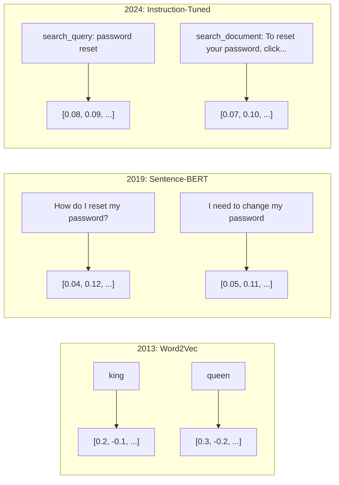
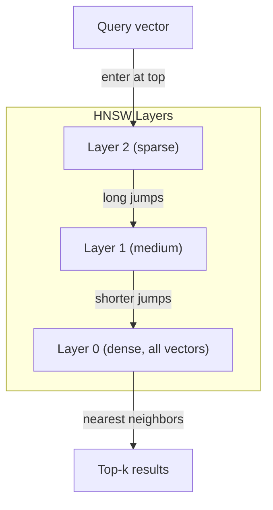

# Embeddings et représentations vectorielles

> Le texte est discrète. Les mathématiques sont continues. Chaque fois que vous demandez à un LLM de trouver des documents "semblables", de comparer des significations ou de chercher au-delà des mots clés, vous vous appuyez sur un pont entre ces deux mondes. Ce pont est un embed. Si vous ne comprenez pas les embed, vous ne comprenez pas l'IA moderne. Vous l'utilisez simplement.

**Type:** Build
**Languages:** Python
**Prerequisites:** Phase 11, Lesson 01 (Prompt Engineering)
**Time:** ~75 minutes
**Related:**La phase 5 · 22 (Dep Dive Embedding Models) couvre la densité vs. la rareté vs. le multi-vecteur, la troncalisation de Matryoshka et la sélection de modèle par axe.

## Objectifs d'apprentissage

- Générer des emblèmes de texte à l'aide de fournisseurs d'API et de modèles open source, et calculer la similitude cosine entre eux
- Expliquez pourquoi les emblèmes résolvent le problème de l'incohérence du vocabulaire que la recherche de mots clés ne peut pas gérer.
- Construire un index de recherche sémantique qui récupère les documents par signification plutôt que par correspondance exacte des mots clés
- Évaluer la qualité de l'intégration à l'aide de critères de récupération (precision@k, rappeler) et choisir le bon modèle d'intégration pour votre tâche

## Le problème

Vous avez 10 000 billets de support. Un client écrit " mon paiement n'a pas été effectué. " Vous devez trouver des billets similaires dans le passé. La recherche de mots clés trouve des billets contenant " paiement " et " n'a pas été effectué. " Il manque " transaction échouée, " " charge a été refusée, " et " erreur de facturation. " Ces billets décrivent exactement le même problème avec des mots complètement différents.

C'est le problème du déséquilibre vocabulaire. Le langage humain a des dizaines de façons de dire la même chose. La recherche de mots clés traite chaque mot comme un symbole indépendant sans signification. Il ne peut pas savoir que "récluse" et "ne pas passé" se réfèrent au même concept.

Vous avez besoin d'une représentation du texte où la signification, et non l'orthographe, détermine la similitude. Vous avez besoin d'un moyen de placer "mon paiement n'a pas été effectué" et "la transaction a été refusée" proches ensemble dans un espace mathématique, tout en repoussant "mon paiement est arrivé à temps" loin malgré le partage du mot "paiement".

Cette représentation est une incubation.

## Le concept

### Qu'est- ce qu'une implantation?

Une intégration est un vecteur dense de nombres à points flottants qui représente la signification du texte. Le mot "dense" compte - chaque dimension porte des informations, contrairement aux représentations rares (sacs de mots, TF-IDF) où la plupart des dimensions sont zéro.

"Le chat s'est assis sur le tapis" devient quelque chose comme`[0.023, -0.041, 0.087, ..., 0.012]`- une liste de 768 à 3072 numéros selon le modèle. Ces numéros codent la signification. Vous ne les inspectez jamais directement. Vous les comparez.

### La percée de Word2Vec

En 2013, Tomas Mikolov et ses collègues de Google ont publié Word2Vec. L'idée principale: entraîner un réseau neural à prédire un mot de ses voisins (ou des voisins d'un mot), et les poids de couches cachées deviennent des représentations vectorielles significatives.

Le résultat célèbre:

```
king - man + woman = queen
```

L'arithmétique vectorielle sur les emblèmes de mots capture les relations sémantiques. La direction de "homme" à "femme" est à peu près la même que la direction de "roi" à "reine".

Word2Vec a produit des vecteurs 300 dimensions. Chaque mot a obtenu un vecteur indépendamment du contexte. "Banque" dans "banque de la rivière" et "compte bancaire" avaient la même intégration. Cette limitation a conduit à la prochaine décennie de recherche.

### De la parole à la phrase

Les emblèmes de mots représentent des jetons uniques. Les systèmes de production doivent intégrer des phrases entières, des paragraphes ou des documents.

**Averaging**Prenez la moyenne de tous les vecteurs de mots dans la phrase. Cheap, perçu, étonnamment décent pour le texte court. Perde entièrement l'ordre des mots -- " chien mord l'homme " et " homme mord le chien " obtiennent les mêmes emblèmes.

**CLS token**: les modèles transformateurs (BERT, 2018) produisent un emballement de jeton [CLS] spécial qui représente l'ensemble de l'entrée.

**Contrastive learning**Le modèle de réinitialisation de la carte de réinitialisation est un modèle de réinitialisation de la carte de réinitialisation de la carte de réinitialisation de la carte de réinitialisation de réinitialisation de réinitialisation de réinitialisation de réinitialisation de réinitialisation de réinitialisation de réinitialisation de réinitialisation de réinitialisation de réinitialisation de réinitialisation de réinitialisation de réinitialisation de réinitialisation de réinitialisation de réinitialisation de réinitialisation de réinitialisation de réinitialisation de réinitialisation de réinitialisation de réinitialisation de réinitialisation de réinitialisation de réinitialisation de réinitialisation de réinitialisation de réinitialisation de réinitialisation de réinitialisation de réinitialisation de réinitialisation de réinitialisation de réinitialisation de réinitialisation de réinitialisation de réinitialisation de réinitialisation de réinitialisation de réinitialisation de réinitialisation de réinitialisation de réinitialisation de réinitialisation de réinitialisation de réinitialisation de réinitialisation de réinitialisation de réinitialisation de réinitialisation de réinitialisation de réinitialisation de réinitialisation de réinitialisation de réinitialisation de réinitialisation de réinitialisation de réinitialisation de réinitialisation de réinitialisation de réinitialisation de réinitialisation de réinitialisation de réinitialisation de réinitialisation de réinitialisation de réinitialisation de réinitialisation de réinitialisation de réinitialisation de réinitialisation de réinitialisation de réinitialisation de réinitialisation de réinitialisation de réinitialisation de réinitialisation de réinitialisation de réinitialisation de réinitialisation de réinitialisation de réinitialisation de réinitialisation de réinitialisation de réinitialisation de réinitialisation de réinitialisation de réinitialisation.

**Instruction-tuned embeddings**: la dernière approche. Les modèles comme E5 et GTE acceptent un préfixe de tâche ("search_query:", "search_document:") qui indique au modèle quel type d'intégration à produire.



### Modèles modernes d'intégration

Le marché s'est établi sur une poignée d'options de production (notes MTEB au début de 2026, MTEB v2):

| Model | Provider | Dimensions | MTEB | Context | Cost / 1M tokens |
|-------|----------|-----------|------|---------|------------------|
| Gemini Embedding 2 | Google | 3072 (Matryoshka) | 67.7 (retrieval) | 8192 | $0.15 |
| embed-v4 | Cohere | 1024 (Matryoshka) | 65.2 | 128K | $0.12 |
| voyage-4 | Voyage AI | 1024/2048 (Matryoshka) | 66.8 | 32K | $0.12 |
| text-embedding-3-large | OpenAI | 3072 (Matryoshka) | 64.6 | 8192 | $0.13 |
| text-embedding-3-small | OpenAI | 1536 (Matryoshka) | 62.3 | 8192 | $0.02 |
| BGE-M3 | BAAI | 1024 (dense+sparse+ColBERT) | 63.0 multilingual | 8192 | Open-weight |
| Qwen3-Embedding | Alibaba | 4096 (Matryoshka) | 66.9 | 32K | Open-weight |
| Nomic-embed-v2 | Nomic | 768 (Matryoshka) | 63.1 | 8192 | Open-weight |

MTEB (Massive Text Embedding Benchmark) v2 couvre plus de 100 tâches sur la récupération, la classification, le regroupement, le ré-rangement et la résumé. Plus haut c'est mieux. D'ici 2026, les modèles à poids ouvert (Qwen3-Embedding, BGE-M3) correspondent ou battent les modèles à hébergement fermé sur la plupart des axes. Gemini Embedding 2 est le premier à être récupéré; Voyage/Cohere est le premier à être récupéré dans des domaines spécifiques (finance, droit, code). Toujours évaluer vos propres questions avant de s'engager.

### Mesures de similitude

Compte tenu de deux vecteurs intégrés, trois façons de mesurer leur similitude:

**Cosine similarity**Le cossin est l'angle entre deux vecteurs. Il va de -1 (opposé) à 1 (direction identique). Ignore la magnitude - une phrase de 10 mots et un document de 500 mots peuvent obtenir 1,0 si ils pointent dans la même direction. C'est la valeur par défaut pour 90% des cas d'utilisation.

```
cosine_sim(a, b) = dot(a, b) / (||a|| * ||b||)
```

**Dot product**Le produit intérieur brut de deux vecteurs. Identique à la similitude cosine lorsque les vecteurs sont normalisés (longueur d'unité). Plus rapide à calculer.

```
dot(a, b) = sum(a_i * b_i)
```

**Euclidean (L2) distance**: distance en ligne droite dans l'espace vectoriel. Plus petit = plus similaire. sensible aux différences de magnitude. Utilisez lorsque la position absolue dans l'espace est importante, pas seulement la direction.

```
L2(a, b) = sqrt(sum((a_i - b_i)^2))
```

Quand utiliser lequel:

| Metric | Use when | Avoid when |
|--------|----------|------------|
| Cosine similarity | Comparing texts of different lengths; most retrieval tasks | Magnitude carries information |
| Dot product | Embeddings are already normalized; maximum speed | Vectors have varying magnitudes |
| Euclidean distance | Clustering; spatial nearest-neighbor problems | Comparing documents of wildly different lengths |

### Les bases de données vectorielles et HNSW

Une recherche de similitude brute-force compare la requête à chaque vecteur stocké. À 1 million de vecteurs avec 1536 dimensions, c'est 1,5 milliard d'opérations de multiplication-ajout par requête. Trop lent.

Les bases de données vectorielles résolvent cela avec des algorithmes Approximate Nearest Neighbor (ANN). L'algorithme dominant est HNSW (Hiérarchique Navigable Small World):

1. Construire un graphique multi-couches de vecteurs
2. Les couches supérieures sont rares - des connexions à longue distance entre des amas éloignés
3. Les couches inférieures sont denses - des connexions fines entre vecteurs proches
4. La recherche commence à la couche supérieure, en descendant avidement pour affiner
5. Retourne des résultats approximatifs de top-k en temps O(log n) au lieu d'O(n)

HNSW négocie une petite perte de précision (généralement 95-99% de rappel) pour des gains de vitesse massifs.



Options de production:

| Database | Type | Best for | Max scale |
|----------|------|----------|-----------|
| Pinecone | Managed SaaS | Zero-ops production | Billions |
| Weaviate | Open source | Self-hosted, hybrid search | 100M+ |
| Qdrant | Open source | High performance, filtering | 100M+ |
| ChromaDB | Embedded | Prototyping, local dev | 1M |
| pgvector | Postgres extension | Already using Postgres | 10M |
| FAISS | Library | In-process, research | 1B+ |

### Des stratégies de déchiquetage

Les documents sont trop longs pour être intégrés en vecteurs simples. Un PDF de 50 pages couvre des dizaines de sujets - son intégration devient une moyenne de tout, semblable à rien de spécifique. Vous divisez les documents en morceaux et vous intégrez chacun.

**Fixed-size chunking**: partager tous les tokens N avec des tokens M-sont superposés. Simple et prévisible. Fonctionne bien lorsque les documents n'ont pas de structure claire. Un morceau de 512 tokens avec 50 tokens se superposent: le morceau 1 est des tokens 0-511, le morceau 2 est des tokens 462-973.

**Sentence-based chunking**Chaque morceau est au moins une phrase complète. Mieux que la taille fixe parce que vous ne coupez jamais une pensée en deux.

**Recursive chunking**Si vous êtes encore trop grand, essayez les limites du paragraphe. Ensuite les limites de la phrase. Ensuite les limites des caractères. C'est la limite de LangChain `RecursiveCharacterTextSplitter`et ça marche bien pour les corps de format mixte.

**Semantic chunking**: incruster chaque phrase, puis regrouper des phrases consécutives dont les incrustations sont similaires. Lorsque la similarité d'incrustation tombe en dessous d'un seuil, démarrez une nouvelle pièce.

| Strategy | Complexity | Quality | Best for |
|----------|-----------|---------|----------|
| Fixed-size | Low | Decent | Unstructured text, logs |
| Sentence-based | Low | Good | Articles, emails |
| Recursive | Medium | Good | Markdown, HTML, mixed docs |
| Semantic | High | Best | Critical retrieval quality |

Le point de départ pour la plupart des systèmes: 256-512 pièces de jetons avec 50 jetons se chevauchant.

### Les bi-encoders et les cross-encoders

Un bi-encodeur intègre la requête et les documents de manière indépendante, puis compare les vecteurs. Rapide - vous intègrez la requête une fois et comparez avec les intégrations de documents précomputées. C'est ce que vous utilisez pour la récupération.

Un cross-encoder prend la requête et un document comme une seule entrée et donne un score de pertinence. Lentement - il traite chaque paire requête-document à travers le modèle complet. Mais beaucoup plus précis car il peut participer à travers la requête et les jetons de document simultanément.

Le modèle de production: le bi-encoder récupère les 100 candidats les plus performants, le cross-encoder les réordonne aux 10 premiers.


Modèles de réévaluation: Rencontre cohérente 3.5 ($2 par 1000 requêtes), BGE-rencontre-v2 (libre, source ouverte), Jina Reranker v2 (libre, source ouverte).

### Les embellissements de matrioshka

Les embellissements traditionnels sont tout ou rien. Un vecteur de 1536 dimensions utilise 1536 flottes. Vous ne pouvez pas truncer à 256 dimensions sans reentraînement.

L'apprentissage de la représentation de Matryoshka (Kusupati et coll., 2022) corrige cela. Le modèle est formé de sorte que les premières dimensions N capturent les informations les plus importantes, comme une poupée de nidification russe.

L'intégration de texte de OpenAI à 3 petits et à 3 grands supporte la tronçage de Matryoshka via le `dimensions`Paramètre: la demande de 256 dimensions au lieu de 1536 réduit le stockage de 6 fois avec une perte d'exactitude d'environ 3-5% sur les benchmarks MTEB.

### Quantification binaire

Une intégration 1536 dimensions stockée sous forme de float32 utilise 6 144 octets. Multipliez par 10 millions de documents: 61 Go seulement pour les vecteurs.

La quantification binaire convertit chaque flot en un seul bit: les valeurs positives deviennent 1, les valeurs négatives deviennent 0. Le stockage diminue de 6 144 octets à 192 octets - une réduction de 32 fois.

Le taux de précision est d'environ 5 à 10% lors du rappel de récupération. Le modèle commun: quantification binaire pour la recherche de premier passage sur des millions de vecteurs, puis réévaluer le top-1000 avec des vecteurs de précision complète. Cela vous donne 95% de précision complète à 32 fois moins de mémoire.

```figure
cosine-similarity
```

## Faites-le

Nous avons construit un moteur de recherche sémantique à partir de zéro, pas de base de données vectorielle, pas d'API d'intégration externe, Python pur avec numpy pour les mathématiques.

### Étape 1: Décomposer le texte

```python
def chunk_text(text, chunk_size=200, overlap=50):
    words = text.split()
    chunks = []
    start = 0
    while start < len(words):
        end = start + chunk_size
        chunk = " ".join(words[start:end])
        chunks.append(chunk)
        start += chunk_size - overlap
    return chunks


def chunk_by_sentences(text, max_chunk_tokens=200):
    sentences = text.replace("\n", " ").split(".")
    sentences = [s.strip() + "." for s in sentences if s.strip()]
    chunks = []
    current_chunk = []
    current_length = 0
    for sentence in sentences:
        sentence_length = len(sentence.split())
        if current_length + sentence_length > max_chunk_tokens and current_chunk:
            chunks.append(" ".join(current_chunk))
            current_chunk = []
            current_length = 0
        current_chunk.append(sentence)
        current_length += sentence_length
    if current_chunk:
        chunks.append(" ".join(current_chunk))
    return chunks
```

### Étape 2: Construire des embellissements à partir de zéro

Nous mettons en œuvre une simple intégration dense en utilisant TF-IDF avec normalisation L2. Ce n'est pas une intégration neurale, mais elle suit le même contrat: texte dans, vecteur de taille fixe vers l'extérieur, des textes similaires produisent des vecteurs similaires.

```python
import math
import numpy as np
from collections import Counter

class SimpleEmbedder:
    def __init__(self):
        self.vocab = []
        self.idf = []
        self.word_to_idx = {}

    def fit(self, documents):
        vocab_set = set()
        for doc in documents:
            vocab_set.update(doc.lower().split())
        self.vocab = sorted(vocab_set)
        self.word_to_idx = {w: i for i, w in enumerate(self.vocab)}
        n = len(documents)
        self.idf = np.zeros(len(self.vocab))
        for i, word in enumerate(self.vocab):
            doc_count = sum(1 for doc in documents if word in doc.lower().split())
            self.idf[i] = math.log((n + 1) / (doc_count + 1)) + 1

    def embed(self, text):
        words = text.lower().split()
        count = Counter(words)
        total = len(words) if words else 1
        vec = np.zeros(len(self.vocab))
        for word, freq in count.items():
            if word in self.word_to_idx:
                tf = freq / total
                vec[self.word_to_idx[word]] = tf * self.idf[self.word_to_idx[word]]
        norm = np.linalg.norm(vec)
        if norm > 0:
            vec = vec / norm
        return vec
```

### Étape 3: Fonctions de similitude

```python
def cosine_similarity(a, b):
    dot = np.dot(a, b)
    norm_a = np.linalg.norm(a)
    norm_b = np.linalg.norm(b)
    if norm_a == 0 or norm_b == 0:
        return 0.0
    return float(dot / (norm_a * norm_b))


def dot_product(a, b):
    return float(np.dot(a, b))


def euclidean_distance(a, b):
    return float(np.linalg.norm(a - b))
```

### Étape 4: Index vectoriel avec recherche brute-force

```python
class VectorIndex:
    def __init__(self):
        self.vectors = []
        self.texts = []
        self.metadata = []

    def add(self, vector, text, meta=None):
        self.vectors.append(vector)
        self.texts.append(text)
        self.metadata.append(meta or {})

    def search(self, query_vector, top_k=5, metric="cosine"):
        scores = []
        for i, vec in enumerate(self.vectors):
            if metric == "cosine":
                score = cosine_similarity(query_vector, vec)
            elif metric == "dot":
                score = dot_product(query_vector, vec)
            elif metric == "euclidean":
                score = -euclidean_distance(query_vector, vec)
            else:
                raise ValueError(f"Unknown metric: {metric}")
            scores.append((i, score))
        scores.sort(key=lambda x: x[1], reverse=True)
        results = []
        for idx, score in scores[:top_k]:
            results.append({
                "text": self.texts[idx],
                "score": score,
                "metadata": self.metadata[idx],
                "index": idx
            })
        return results

    def size(self):
        return len(self.vectors)
```

### Étape 5: Le moteur de recherche sémantique

```python
class SemanticSearchEngine:
    def __init__(self, chunk_size=200, overlap=50):
        self.embedder = SimpleEmbedder()
        self.index = VectorIndex()
        self.chunk_size = chunk_size
        self.overlap = overlap

    def index_documents(self, documents, source_names=None):
        all_chunks = []
        all_sources = []
        for i, doc in enumerate(documents):
            chunks = chunk_text(doc, self.chunk_size, self.overlap)
            all_chunks.extend(chunks)
            name = source_names[i] if source_names else f"doc_{i}"
            all_sources.extend([name] * len(chunks))
        self.embedder.fit(all_chunks)
        for chunk, source in zip(all_chunks, all_sources):
            vec = self.embedder.embed(chunk)
            self.index.add(vec, chunk, {"source": source})
        return len(all_chunks)

    def search(self, query, top_k=5, metric="cosine"):
        query_vec = self.embedder.embed(query)
        return self.index.search(query_vec, top_k, metric)

    def search_with_scores(self, query, top_k=5):
        results = self.search(query, top_k)
        return [
            {
                "text": r["text"][:200],
                "source": r["metadata"].get("source", "unknown"),
                "score": round(r["score"], 4)
            }
            for r in results
        ]
```

### Étape 6: Comparer les mesures de similitude

```python
def compare_metrics(engine, query, top_k=3):
    results = {}
    for metric in ["cosine", "dot", "euclidean"]:
        hits = engine.search(query, top_k=top_k, metric=metric)
        results[metric] = [
            {"score": round(h["score"], 4), "preview": h["text"][:80]}
            for h in hits
        ]
    return results
```

## Utilisez-le

Avec une API intégrée en production, l'architecture reste identique. Seul l'embedding change:

```python
from openai import OpenAI

client = OpenAI()

def openai_embed(texts, model="text-embedding-3-small", dimensions=None):
    kwargs = {"model": model, "input": texts}
    if dimensions:
        kwargs["dimensions"] = dimensions
    response = client.embeddings.create(**kwargs)
    return [item.embedding for item in response.data]
```

Truncation de matrioshka avec OpenAI - même modèle, moins de dimensions, moins de stockage:

```python
full = openai_embed(["semantic search query"], dimensions=1536)
compact = openai_embed(["semantic search query"], dimensions=256)
```

Le vecteur 256-d utilise 6 fois moins de stockage. Pour 10 millions de documents, c'est 10 Go contre 61 Go. La perte de précision est d'environ 3-5% sur les critères de référence standard.

Pour le renouvellement de rang avec Cohere:

```python
import cohere

co = cohere.ClientV2()

results = co.rerank(
    model="rerank-v3.5",
    query="What is the refund policy?",
    documents=["Full refund within 30 days...", "No refunds after 90 days..."],
    top_n=3
)
```

Pour les emblèmes locaux sans dépendance à l'API:

```python
from sentence_transformers import SentenceTransformer

model = SentenceTransformer("BAAI/bge-small-en-v1.5")
embeddings = model.encode(["semantic search query", "another document"])
```

La classe VectorIndex de notre construction fonctionne avec l'une de ces fonctionnalités.

## La faire partir

Cette leçon donne:
- `outputs/prompt-embedding-advisor.md`-- une demande de choix de modèles et de stratégies d'intégration pour des cas d'utilisation spécifiques
- `outputs/skill-embedding-patterns.md`-- une compétence qui enseigne aux agents comment utiliser efficacement les embeddings dans la production

## Exercices

1. **Metric comparison**Les résultats obtenus par l'analyse de l'échantillon sont les mêmes:: effectuer les mêmes 5 requêtes sur les documents de l'échantillon en utilisant la similitude cosine, le produit des points et la distance euclidienne.

2. **Chunk size experiment**: indiquez les documents d'échantillon avec des tailles de pièces de 50, 100, 200 et 500 mots. Pour chacun, effectuez 5 requêtes et enregistrez le score de similitude top-1.

3. **Matryoshka simulation**Une nouvelle méthode de calcul est la méthode de calcul de la taille de l'image de l'image de l'image de l'image de l'image de l'image de l'image de l'image de l'image de l'image de l'image de l'image de l'image de l'image de l'image de l'image de l'image de l'image de l'image de l'image de l'image de l'image de l'image de l'image de l'image de l'image de l'image de l'image de l'image de l'image de l'image de l'image de l'image de l'image de l'image de l'image de l'image de l'image de l'image de l'image de l'image de l'image de l'image de l'image de l'image de l'image de l'image de l'image de l'image de l'image de l'image de l'image de l'image de l'image de l'image de l'image de l'image de l'image de la image de l'image de l'image de l'image.

4. **Binary quantization**: prendre les emblèmes du moteur de recherche, les convertir en binaires (1 si positif, 0 si négatif), et mettre en œuvre la recherche à distance Hamming. Comparer les 10 premiers résultats par rapport à une similitude cosine de pleine précision. Mesurer le pourcentage de chevauchement.

5. **Sentence-based chunking**: remplacer le déchiquetage en taille fixe par `chunk_by_sentences`- Rendre les mêmes requêtes et comparer les résultats de recherche.

## Les termes clés

| Term | What people say | What it actually means |
|------|----------------|----------------------|
| Embedding | "Text to numbers" | A dense vector where geometric proximity encodes semantic similarity |
| Word2Vec | "The OG embedding" | 2013 model that learned word vectors by predicting context words; proved vector arithmetic encodes meaning |
| Cosine similarity | "How similar are two vectors" | Cosine of the angle between vectors; 1 = identical direction, 0 = orthogonal, -1 = opposite |
| HNSW | "Fast vector search" | Hierarchical Navigable Small World graph -- multi-layer structure enabling O(log n) approximate nearest neighbor search |
| Bi-encoder | "Embed separately, compare fast" | Encodes query and document independently into vectors; enables pre-computation and fast retrieval |
| Cross-encoder | "Slow but accurate reranker" | Processes query-document pair jointly through the full model; higher accuracy, no pre-computation |
| Matryoshka embeddings | "Truncatable vectors" | Embeddings trained so the first N dimensions capture the most important information, enabling variable-size storage |
| Binary quantization | "1-bit embeddings" | Converting float vectors to binary (sign bit only) for 32x storage reduction with Hamming distance search |
| Chunking | "Split docs for embedding" | Breaking documents into 256-512 token segments so each can be independently embedded and retrieved |
| Vector database | "Search engine for embeddings" | Data store optimized for storing vectors and performing approximate nearest neighbor search at scale |
| Contrastive learning | "Train by comparison" | Training approach that pushes similar pair embeddings together and dissimilar pair embeddings apart |
| MTEB | "The embedding benchmark" | Massive Text Embedding Benchmark -- 56 datasets across 8 tasks; standard for comparing embedding models |

## Pour en savoir plus

- Mikolov et coll., "Evaluation efficace des représentations de mots dans l'espace vectoriel" (2013) -- le document Word2Vec qui a commencé la révolution de l'intégration avec l'analogie roi-reine
- Reimers & Gurevych, "Sentence-BERT: Embeddings de phrases utilisant les réseaux siames BERT" (2019) -- comment former les bi-encoders pour une similitude au niveau de la phrase, fondement des modèles modernes d'embedding
- Kusupati et coll., "Matryoshka Representation Learning" (2022) -- la technique derrière les embrasements de dimensions variables que OpenAI a adoptées pour l'embedding de texte-3
- Malkov et Yashunin, "Effifique et robuste approximation proche voisin en utilisant des graphiques hiérarchiques naviguables du petit monde" (2018) -- le papier HNSW, l'algorithme derrière la plupart des recherches vectorielles de production
- Guide d'intégration d'OpenAI (platform.openai.com/docs/guides/embeddings) -- référence pratique pour les modèles de texte intégré à l'intérieur de l'application 3, y compris la réduction des dimensions Matryoshka
- Tableau de référence MTEB (huggingface.co/spaces/mteb/leaderboard) - référence en direct comparant tous les modèles d'intégration entre les tâches et les langues
- [Muennighoff et al., "MTEB: Massive Text Embedding Benchmark" (EACL 2023)](https://arxiv.org/abs/2210.07316)-- le critère de référence définissant 8 catégories de tâches (classification, clustering, classification des paires, réévaluation, récupération, STS, résumé, extraction de bittext) que le tableau de classement rapporte; lire avant de faire confiance à un seul score MTEB.
- [Sentence Transformers documentation](https://www.sbert.net/)-- référence canonique pour le bi-encodeur vs. le cross-encodeur, les stratégies de pooling, et le pipeline RAG ingest-split-embed-store que cette leçon implique.
