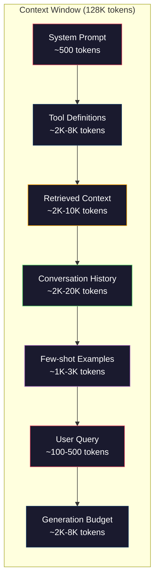
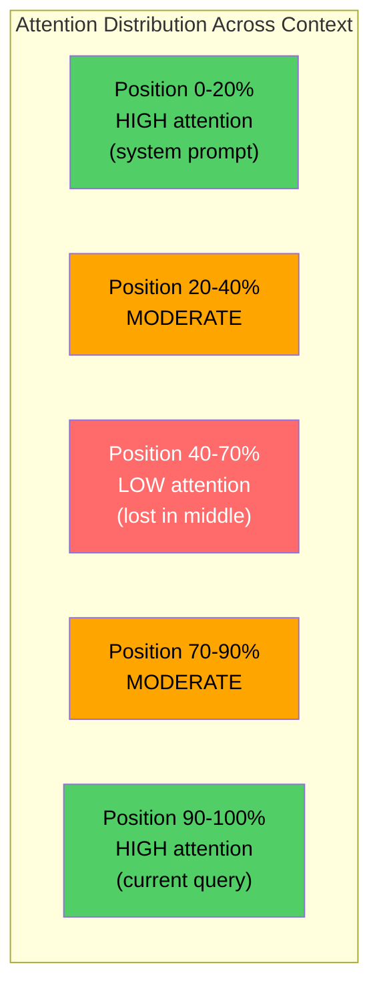
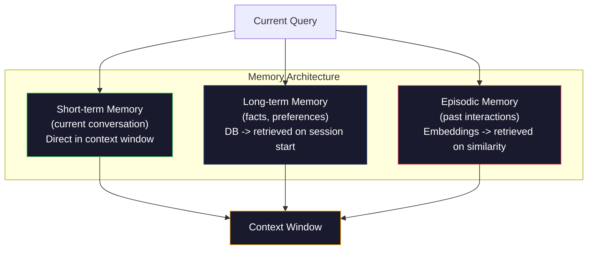

# Ingénierie du contexte: Windows, budgets, mémoire et récupération

> L'ingénierie de la demande est un sous-ensemble. L'ingénierie de contexte est l'ensemble du jeu. Une demande est une chaîne que vous tapez. Le contexte est tout ce qui entre dans la fenêtre du modèle: instructions système, documents récupérés, définitions d'outils, historique de conversation, quelques exemples de prises de vue et la demande elle-même. Les meilleurs ingénieurs en IA en 2026 sont les ingénieurs de contexte. Ils décident de ce qui entre, de ce qui reste et dans quel ordre.

**Type:** Build
**Languages:** Python
**Prerequisites:** Phase 10 (LLMs from Scratch), Phase 11 Lesson 01-02
**Time:** ~90 minutes
**Related:**La phase 11 · 15 (Cachage rapide)  la mise en cache conviviale est une extension de l'ingénierie contextuelle. la phase 5 · 28 (Évaluation à long contexte) pour mesurer la perte au milieu avec NIAH/RULER.

## Objectifs d'apprentissage

- Calculer les budgets de jetons sur tous les composants de fenêtres contextuelles (interface système, outils, historique, documents récupérés, espace génération)
- Implémenter des stratégies de gestion de fenêtre de contexte: troncage, résumé et fenêtre coulissante pour l'historique de conversation
- Prioritiser et ordonner les composants contextuels pour maximiser l'attention du modèle sur les informations les plus pertinentes
- Construire un assembleur de contexte qui alloue dynamiquement des jetons en fonction du type de requête et de l'espace de fenêtre disponible

## Le problème

Claude Opus 4.7 a une fenêtre de jetons de 200K (1M en version bêta). GPT-5 a 400K. Gemini 3 Pro a 2M. Llama 4 prétend 10M. Ces chiffres semblent énormes jusqu'à ce que vous les remplissez.

Voici une réelle ventilation pour un assistant de codage. Prompte système: 500 jetons. Définitions d'outils pour 50 outils: 8.000 jetons. Documentation récupérée: 4.000 jetons. Historique de conversation (10 tours): 6.000 jetons. Recherche d'utilisateur actuelle: 200 jetons. Budget de génération (sortie maximale): 4.000 jetons. Total: 22.700 jetons. Ce n'est que 18% d'une fenêtre 128K.

Mais l'attention ne s'échelle pas linéairement avec la longueur du contexte. Un modèle avec 128K de jetons de contexte paie un coût d'attention quadratique (O(n^2) dans les transformateurs de vanille, bien que la plupart des modèles de production utilisent des variantes d'attention efficaces). Plus important encore, la précision de récupération se dégrade. Le test "Aiguille dans un tas de foin" montre que les modèles ont du mal à trouver des informations placées au milieu de longs contextes. La recherche de Liu et collègues (2023) a montré que les LLM récupèrent des informations au début et à la fin de longs contextes avec une précision presque parfaite, mais que leur précision diminue de 10 à 20% pour les informations placées au milieu (position 40 à 70% du contexte). Cet effet " perdu au milieu " varie selon le modèle mais affecte toutes les architectures actuelles.

La leçon pratique: avoir 200K de jetons disponibles ne signifie pas utiliser 200K de jetons est efficace. Un contexte de jetons 10K soigneusement sélectionné surpasse souvent un contexte de jetons 100K déposé.

Chaque jeton que vous mettez dans la fenêtre remplace un jeton qui pourrait contenir des informations plus pertinentes. Chaque définition d'outil irrélevant, chaque tournage de conversation obsolète, chaque morceau de texte récupéré qui ne répond pas à la question - chacun rend le modèle légèrement pire dans la tâche.

## Le concept

### La fenêtre de contexte est une ressource rare

Pensez à la fenêtre contextuelle comme à la RAM, pas au disque. Elle est rapide et directement accessible, mais limitée. Vous ne pouvez pas tout monter. Vous devez choisir.



Chaque composant est en compétition pour l'espace. Ajouter plus de définitions d'outils signifie moins de place pour l'historique de conversation. Ajouter plus de contexte récupéré signifie moins de place pour quelques exemples.

### Perdu au milieu

Les modèles répondent mieux aux informations au début et à la fin du contexte. Les informations au milieu obtiennent des scores d'attention plus faibles et sont plus susceptibles d'être ignorées.

Liu et coll. (2023) ont testé cette méthode de manière systématique. Ils ont placé un document pertinent parmi 20 documents irrélevants à différentes positions et mesuré la précision de la réponse.

Cela a des implications techniques directes:

- Mettre en premier les informations les plus importantes (instructions critiques du système)
- Mettre la requête actuelle et le contexte le plus pertinent en dernier (bias récent aide)
- Traiter le milieu du contexte comme la zone de priorité la plus basse
- Si vous devez inclure des informations au milieu, doublez le point clé à la fin



### Components de contexte

**System prompt**Claude Code utilise environ 6000 jetons pour son prompt système, y compris les définitions d'outils et les instructions comportementales. Gardez-le serré. Chaque mot dans le prompt système est répété sur chaque appel API.

**Tool definitions**Chaque outil ajoute 50 à 200 jetons (nom, description, schéma de paramètre). 50 outils à 150 jetons chacun est de 7 500 jetons avant toute conversation.

**Retrieved context**Les résultats de recherche, le contenu des fichiers. La qualité de la récupération détermine directement la qualité de la réponse. Une mauvaise récupération est pire que aucune récupération - elle remplit la fenêtre de bruit et induit activement en erreur le modèle.

**Conversation history**Une conversation de 50 tours à 200 jetons par tour représente 10 000 jetons d'histoire. La plupart d'entre eux sont sans rapport avec la requête actuelle.

**Few-shot examples**Les deux ou trois exemples bien choisis améliorent souvent la qualité de la sortie de plus de milliers de jetons d'instructions.

**Generation budget**Si vous remplissez la fenêtre à la capacité, le modèle n'a pas de place pour répondre.

### Stratégies de compression du contexte

**History summarization**: au lieu de garder tous les tours précédents verbains, résumez périodiquement la conversation. "Nous avons discuté X, décidé Y, et l'utilisateur veut Z" dans 100 jetons remplace 10 tours qui ont pris 2000 jetons.

**Relevance filtering**Si vous avez récupéré 10 pièces mais que seules 3 sont pertinentes, jetez les autres 7. Il vaut mieux avoir 3 pièces très pertinentes que 10 pièces médiocres.

**Tool pruning**Une question de code ne nécessite pas d'outils de calendrier. Une question de planification ne nécessite pas d'outils de système de fichiers. Cela peut réduire les définitions d'outils de 8000 jetons à 1000.

**Recursive summarization**Pour les documents très longs, résumons en étapes. Tout d'abord, résumons chaque section, puis résumons les résumés.

### Systèmes de mémoire

L'ingénierie du contexte couvre trois horizons temporels.

**Short-term memory**Le contenu de la conversation est enregistré directement dans la fenêtre contextuelle.

**Long-term memory**: faits et préférences qui persistent au cours des conversations. "L'utilisateur préfère TypeScript. " "Le projet utilise PostgreSQL. " Stocké dans une base de données, récupéré au début de la session. Claude Code le stocke dans les fichiers CLAUDE.md. ChatGPT le stocke dans sa fonctionnalité de mémoire.

**Episodic memory**: interactions antérieures spécifiques qui pourraient être pertinentes. "Le mardi dernier, nous avons débogagé un problème similaire dans le module auth".



### Assemblage de contexte dynamique

Les informations clés: différentes requêtes ont besoin de contextes différents. Un système statique prompt + outils statiques + historique statique est gaspilleur. Les meilleurs systèmes assemblent dynamiquement le contexte par requête.

1. Classer l'intention de la requête
2. Sélectionner les outils pertinents (pas tous les outils)
3. Récupérer les documents pertinents (pas un ensemble fixe)
4. Incluez les tours d'histoire pertinents (pas tous les tours d'histoire)
5. Ajouter quelques exemples de tirages qui correspondent au type de tâche
6. Ordonnez tout par importance: critique d'abord, importante dernière, facultative au milieu

C'est ce qui sépare une bonne application d'IA d'une excellente. Le modèle est le même. Le contexte est le différenciateur.

```figure
lost-in-the-middle
```

## Faites-le

### Étape 1: Counter des jetons

Vous ne pouvez pas budgétiser ce que vous ne pouvez pas mesurer. Construisez un simple compteur de jetons (approximation en utilisant la fraction d'espace blanc, car le nombre exact dépend du jeton).

```python
import json
import numpy as np
from collections import OrderedDict

def count_tokens(text):
    if not text:
        return 0
    return int(len(text.split()) * 1.3)

def count_tokens_json(obj):
    return count_tokens(json.dumps(obj))
```

### Étape 2: Gestionnaire de budget de contexte

Un gestionnaire de budget suit le nombre de jetons utilisés par chaque composant et impose des limites.

```python
class ContextBudget:
    def __init__(self, max_tokens=128000, generation_reserve=4000):
        self.max_tokens = max_tokens
        self.generation_reserve = generation_reserve
        self.available = max_tokens - generation_reserve
        self.allocations = OrderedDict()

    def allocate(self, component, content, max_tokens=None):
        tokens = count_tokens(content)
        if max_tokens and tokens > max_tokens:
            words = content.split()
            target_words = int(max_tokens / 1.3)
            content = " ".join(words[:target_words])
            tokens = count_tokens(content)

        used = sum(self.allocations.values())
        if used + tokens > self.available:
            allowed = self.available - used
            if allowed <= 0:
                return None, 0
            words = content.split()
            target_words = int(allowed / 1.3)
            content = " ".join(words[:target_words])
            tokens = count_tokens(content)

        self.allocations[component] = tokens
        return content, tokens

    def remaining(self):
        used = sum(self.allocations.values())
        return self.available - used

    def utilization(self):
        used = sum(self.allocations.values())
        return used / self.max_tokens

    def report(self):
        total_used = sum(self.allocations.values())
        lines = []
        lines.append(f"Context Budget Report ({self.max_tokens:,} token window)")
        lines.append("-" * 50)
        for component, tokens in self.allocations.items():
            pct = tokens / self.max_tokens * 100
            bar = "#" * int(pct / 2)
            lines.append(f"  {component:<25} {tokens:>6} tokens ({pct:>5.1f}%) {bar}")
        lines.append("-" * 50)
        lines.append(f"  {'Used':<25} {total_used:>6} tokens ({total_used/self.max_tokens*100:.1f}%)")
        lines.append(f"  {'Generation reserve':<25} {self.generation_reserve:>6} tokens")
        lines.append(f"  {'Remaining':<25} {self.remaining():>6} tokens")
        return "\n".join(lines)
```

### Étape 3: Réorganisation perdue

Mettre en œuvre la stratégie de réorganisation: les éléments les plus importants se classent en premier et en dernier, les moins importants se classent au milieu.

```python
def reorder_lost_in_middle(items, scores):
    paired = sorted(zip(scores, items), reverse=True)
    sorted_items = [item for _, item in paired]

    if len(sorted_items) <= 2:
        return sorted_items

    first_half = sorted_items[::2]
    second_half = sorted_items[1::2]
    second_half.reverse()

    return first_half + second_half

def score_relevance(query, documents):
    query_words = set(query.lower().split())
    scores = []
    for doc in documents:
        doc_words = set(doc.lower().split())
        if not query_words:
            scores.append(0.0)
            continue
        overlap = len(query_words & doc_words) / len(query_words)
        scores.append(round(overlap, 3))
    return scores
```

### Étape 4: Compresseur d'historique de la conversation

Résumer une conversation vieille tourne pour récupérer le budget de jeton.

```python
class ConversationManager:
    def __init__(self, max_history_tokens=5000):
        self.turns = []
        self.summaries = []
        self.max_history_tokens = max_history_tokens

    def add_turn(self, role, content):
        self.turns.append({"role": role, "content": content})
        self._compress_if_needed()

    def _compress_if_needed(self):
        total = sum(count_tokens(t["content"]) for t in self.turns)
        if total <= self.max_history_tokens:
            return

        while total > self.max_history_tokens and len(self.turns) > 4:
            old_turns = self.turns[:2]
            summary = self._summarize_turns(old_turns)
            self.summaries.append(summary)
            self.turns = self.turns[2:]
            total = sum(count_tokens(t["content"]) for t in self.turns)

    def _summarize_turns(self, turns):
        parts = []
        for t in turns:
            content = t["content"]
            if len(content) > 100:
                content = content[:100] + "..."
            parts.append(f"{t['role']}: {content}")
        return "Previous: " + " | ".join(parts)

    def get_context(self):
        parts = []
        if self.summaries:
            parts.append("[Conversation Summary]")
            for s in self.summaries:
                parts.append(s)
        parts.append("[Recent Conversation]")
        for t in self.turns:
            parts.append(f"{t['role']}: {t['content']}")
        return "\n".join(parts)

    def token_count(self):
        return count_tokens(self.get_context())
```

### Étape 5: Sélecteur d'outils dynamiques

Ne inclure que des outils pertinents à la requête actuelle.

```python
TOOL_REGISTRY = {
    "read_file": {
        "description": "Read contents of a file",
        "tokens": 120,
        "categories": ["code", "files"],
    },
    "write_file": {
        "description": "Write content to a file",
        "tokens": 150,
        "categories": ["code", "files"],
    },
    "search_code": {
        "description": "Search for patterns in codebase",
        "tokens": 130,
        "categories": ["code"],
    },
    "run_command": {
        "description": "Execute a shell command",
        "tokens": 140,
        "categories": ["code", "system"],
    },
    "create_calendar_event": {
        "description": "Create a new calendar event",
        "tokens": 180,
        "categories": ["calendar"],
    },
    "list_emails": {
        "description": "List recent emails",
        "tokens": 160,
        "categories": ["email"],
    },
    "send_email": {
        "description": "Send an email message",
        "tokens": 200,
        "categories": ["email"],
    },
    "web_search": {
        "description": "Search the web for information",
        "tokens": 140,
        "categories": ["research"],
    },
    "query_database": {
        "description": "Run a SQL query on the database",
        "tokens": 170,
        "categories": ["code", "data"],
    },
    "generate_chart": {
        "description": "Generate a chart from data",
        "tokens": 190,
        "categories": ["data", "visualization"],
    },
}

def classify_intent(query):
    query_lower = query.lower()

    intent_keywords = {
        "code": ["code", "function", "bug", "error", "file", "implement", "refactor", "debug", "test"],
        "calendar": ["meeting", "schedule", "calendar", "appointment", "event"],
        "email": ["email", "mail", "send", "inbox", "message"],
        "research": ["search", "find", "what is", "how does", "explain", "look up"],
        "data": ["data", "query", "database", "chart", "graph", "analytics", "sql"],
    }

    scores = {}
    for intent, keywords in intent_keywords.items():
        score = sum(1 for kw in keywords if kw in query_lower)
        if score > 0:
            scores[intent] = score

    if not scores:
        return ["code"]

    max_score = max(scores.values())
    return [intent for intent, score in scores.items() if score >= max_score * 0.5]

def select_tools(query, token_budget=2000):
    intents = classify_intent(query)
    relevant = {}
    total_tokens = 0

    for name, tool in TOOL_REGISTRY.items():
        if any(cat in intents for cat in tool["categories"]):
            if total_tokens + tool["tokens"] <= token_budget:
                relevant[name] = tool
                total_tokens += tool["tokens"]

    return relevant, total_tokens
```

### Étape 6: L'ensemble complet de l'assemblage en contexte

En fonction de la requête, assemblez dynamiquement le contexte optimal.

```python
class ContextEngine:
    def __init__(self, max_tokens=128000, generation_reserve=4000):
        self.budget = ContextBudget(max_tokens, generation_reserve)
        self.conversation = ConversationManager(max_history_tokens=5000)
        self.system_prompt = (
            "You are a helpful AI assistant. You have access to tools for "
            "code editing, file management, web search, and data analysis. "
            "Use the appropriate tools for each task. Be concise and accurate."
        )
        self.knowledge_base = [
            "Python 3.12 introduced type parameter syntax for generic classes using bracket notation.",
            "The project uses PostgreSQL 16 with pgvector for embedding storage.",
            "Authentication is handled by Supabase Auth with JWT tokens.",
            "The frontend is built with Next.js 15 using the App Router.",
            "API rate limits are set to 100 requests per minute per user.",
            "The deployment pipeline uses GitHub Actions with Docker multi-stage builds.",
            "Test coverage must be above 80% for all new modules.",
            "The codebase follows the repository pattern for data access.",
        ]

    def assemble(self, query):
        self.budget = ContextBudget(self.budget.max_tokens, self.budget.generation_reserve)

        system_content, _ = self.budget.allocate("system_prompt", self.system_prompt, max_tokens=1000)

        tools, tool_tokens = select_tools(query, token_budget=2000)
        tool_text = json.dumps(list(tools.keys()))
        tool_content, _ = self.budget.allocate("tools", tool_text, max_tokens=2000)

        relevance = score_relevance(query, self.knowledge_base)
        threshold = 0.1
        relevant_docs = [
            doc for doc, score in zip(self.knowledge_base, relevance)
            if score >= threshold
        ]

        if relevant_docs:
            doc_scores = [s for s in relevance if s >= threshold]
            reordered = reorder_lost_in_middle(relevant_docs, doc_scores)
            doc_text = "\n".join(reordered)
            doc_content, _ = self.budget.allocate("retrieved_context", doc_text, max_tokens=3000)

        history_text = self.conversation.get_context()
        if history_text.strip():
            history_content, _ = self.budget.allocate("conversation_history", history_text, max_tokens=5000)

        query_content, _ = self.budget.allocate("user_query", query, max_tokens=500)

        return self.budget

    def chat(self, query):
        self.conversation.add_turn("user", query)
        budget = self.assemble(query)
        response = f"[Response to: {query[:50]}...]"
        self.conversation.add_turn("assistant", response)
        return budget


def run_demo():
    print("=" * 60)
    print("  Context Engineering Pipeline Demo")
    print("=" * 60)

    engine = ContextEngine(max_tokens=128000, generation_reserve=4000)

    print("\n--- Query 1: Code task ---")
    budget = engine.chat("Fix the bug in the authentication module where JWT tokens expire too early")
    print(budget.report())

    print("\n--- Query 2: Research task ---")
    budget = engine.chat("What is the best approach for implementing vector search in PostgreSQL?")
    print(budget.report())

    print("\n--- Query 3: After conversation history builds up ---")
    for i in range(8):
        engine.conversation.add_turn("user", f"Follow-up question number {i+1} about the implementation details of the system")
        engine.conversation.add_turn("assistant", f"Here is the response to follow-up {i+1} with technical details about the architecture")

    budget = engine.chat("Now implement the changes we discussed")
    print(budget.report())

    print("\n--- Tool Selection Examples ---")
    test_queries = [
        "Fix the bug in auth.py",
        "Schedule a meeting with the team for Tuesday",
        "Show me the database query performance stats",
        "Search for best practices on error handling",
    ]

    for q in test_queries:
        tools, tokens = select_tools(q)
        intents = classify_intent(q)
        print(f"\n  Query: {q}")
        print(f"  Intents: {intents}")
        print(f"  Tools: {list(tools.keys())} ({tokens} tokens)")

    print("\n--- Lost-in-the-Middle Reordering ---")
    docs = ["Doc A (most relevant)", "Doc B (somewhat relevant)", "Doc C (least relevant)",
            "Doc D (relevant)", "Doc E (moderately relevant)"]
    scores = [0.95, 0.60, 0.20, 0.80, 0.50]
    reordered = reorder_lost_in_middle(docs, scores)
    print(f"  Original order: {docs}")
    print(f"  Scores:         {scores}")
    print(f"  Reordered:      {reordered}")
    print(f"  (Most relevant at start and end, least relevant in middle)")
```

## Utilisez-le

### Contextes à utiliser

Claude Code gère le contexte avec une approche en couches. Le prompt système comprend des règles de comportement et des définitions d'outils (~ 6K de jetons). Lorsque vous ouvrez un fichier, son contenu est injecté en tant que contexte. Lorsque vous recherchez, les résultats sont ajoutés. Les anciens tours de conversation sont résumés. CLAUDE.md fournit une mémoire à long terme qui persiste au cours des sessions.

La décision d'ingénierie clé: Claude Code ne dépose pas toute votre base de code dans le contexte. Il récupère les fichiers pertinents sur demande.

### Chargement dynamique du contexte

Cursor indique toute votre base de code dans des emblèmes. Lorsque vous tapez une requête, elle récupère les fichiers et blocs de code les plus pertinents en utilisant la similitude vectorielle. Seuls ces éléments entrent dans la fenêtre de contexte. Une base de code de 500K de lignes est comprimée dans les 5 à 10 blocs de code les plus pertinents.

Voici le modèle: intégrer tout, récupérer à la demande, inclure seulement ce qui compte.

### Assistant à la mémoire à long terme

ChatGPT stocke les préférences et les faits des utilisateurs en mémoire à long terme. À chaque démarrage de conversation, les souvenirs pertinents sont récupérés et inclus dans la demande du système. "L'utilisateur préfère Python" coûte 5 jetons mais enregistre des centaines de jetons d'instructions répétées sur les conversations.

### RAG en tant qu'ingénierie contextuelle

La génération augmentée par récupération est l'ingénierie contextuelle formalisée. Au lieu de remplir les connaissances dans les poids du modèle (entraînement) ou le système prompt (context statique), vous récupérez les documents pertinents au moment de la requête et les injectez dans la fenêtre contextuelle. L'ensemble du pipeline RAG -- déchiquetage, intégration, récupération, réaffichage -- existe pour résoudre un problème: mettre les bonnes informations dans la fenêtre contextuelle.

## La faire partir

Cette leçon produit `outputs/prompt-context-optimizer.md`-- une requête réutilisable qui vérifie une stratégie d'assemblage de contexte et recommande des optimisations.

Il produit aussi `outputs/skill-context-engineering.md`-- un cadre de décision pour concevoir des lignes de montage de contexte en fonction du type de tâche, de la taille de la fenêtre de contexte et du budget de latence.

## Exercices

1. Ajouter un "détecteur de déchets de jetons" à la classe ContextBudget. Il devrait marquer les composants utilisant plus de 30% du budget et suggérer des stratégies de compression spécifiques à chaque type de composant (récapitulatif de l'historique, outils de taille, réaffectation des documents).

2. Implémenter la déduplication sémantique pour le contexte récupéré. Si deux documents récupérés sont plus de 80% similaires (par chevauchement de mots ou par similitude cosine de leurs emblèmes), ne conservez que celui avec un score plus élevé. Mesurer combien de budget de jeton ce récupère.

3. Construisez un outil de "réplique de contexte". Donnez une transcription de conversation, reproduisez-la via le ContextEngine et visualisez comment l'allocation budgétaire change tour à tour. Plot usage de jetons par composant au fil du temps. Identifiez le tour où le contexte commence à être comprimé.

4. Implémenter un sélecteur d'outils basé sur les priorités. Au lieu d'inclure/exclure binaire, attribuer à chaque outil un score de pertinence à la requête en cours. Inclure les outils dans l'ordre de pertinence en déclin jusqu'à ce que le budget de l'outil soit épuisé. Comparer la performance des tâches avec les outils 5, 10, 20 et 50 inclus.

5. Construire un compresseur contextuel multi-stratégie. Mettre en œuvre trois stratégies de compression (truncation, résumé, extraction de phrases clés) et les comparer sur un ensemble de 20 documents. Mesurer le compromis entre le ratio de compression et la rétention d'informations (la version compressée contient-elle toujours la réponse à la requête?).

## Les termes clés

| Term | What people say | What it actually means |
|------|----------------|----------------------|
| Context window | "How much the model can read" | The maximum number of tokens (input + output) the model processes in a single forward pass -- 400K for GPT-5, 200K (1M beta) for Claude Opus 4.7, 2M for Gemini 3 Pro |
| Context engineering | "Advanced prompt engineering" | The discipline of deciding what goes into the context window, in what order, and at what priority -- encompasses retrieval, compression, tool selection, and memory management |
| Lost-in-the-middle | "Models forget stuff in the middle" | Empirical finding that LLMs attend better to the beginning and end of context, with 10-20% accuracy drop for information placed in the middle |
| Token budget | "How many tokens you have left" | An explicit allocation of context window capacity across components (system prompt, tools, history, retrieval, generation) with per-component limits |
| Dynamic context | "Loading stuff on the fly" | Assembling the context window differently for each query based on intent classification, relevant tool selection, and retrieval results |
| History summarization | "Compressing the conversation" | Replacing verbatim old conversation turns with a concise summary, reducing token cost while preserving key information |
| Tool pruning | "Only including relevant tools" | Classifying query intent and only including tool definitions that match, reducing tool token cost by 60-80% |
| Long-term memory | "Remembering across sessions" | Facts and preferences stored in a database and retrieved at session start -- CLAUDE.md, ChatGPT Memory, and similar systems |
| Episodic memory | "Remembering specific past events" | Past interactions stored as embeddings and retrieved when the current query is similar to a past conversation |
| Generation budget | "Room for the answer" | Tokens reserved for the model's output -- if the context fills the window completely, the model has no room to respond |

## Pour en savoir plus

- [Liu et al., 2023 -- "Lost in the Middle: How Language Models Use Long Contexts"](https://arxiv.org/abs/2307.03172)-- l'étude définitive sur l'attention dépendante de la position, montrant que les modèles luttent avec l'information au milieu de longs contextes
- [Anthropic's Contextual Retrieval blog post](https://www.anthropic.com/news/contextual-retrieval)-- comment Anthropic aborde la récupération de pièces consciente du contexte, réduisant l'échec de récupération de 49%
- [Simon Willison's "Context Engineering"](https://simonwillison.net/2025/Jun/27/context-engineering/)-- le blog qui a nommé la discipline et la distingue de l'ingénierie rapide
- [LangChain documentation on RAG](https://python.langchain.com/docs/tutorials/rag/)-- mise en œuvre pratique de la génération augmentée par récupération en tant que modèle d'ingénierie contextuelle
- [Greg Kamradt's Needle in a Haystack test](https://github.com/gkamradt/LLMTest_NeedleInAHaystack)-- l'indice de référence qui a révélé des défaillances de récupération dépendantes de la position dans tous les principaux modèles
- [Pope et al., "Efficiently Scaling Transformer Inference" (2022)](https://arxiv.org/abs/2211.05102)-- pourquoi la longueur du contexte entraîne la mémoire et la latence, et comment le cache KV, MQA et GQA modifient le calcul du budget.
- [Agrawal et al., "SARATHI: Efficient LLM Inference by Piggybacking Decodes with Chunked Prefills" (2023)](https://arxiv.org/abs/2308.16369)-- les deux phases d'inférence qui font que les longues instructions coûtent cher dans le TTFT mais pas cher dans le TPOT; la vérité fondamentale derrière les compromis de package contextuel.
- [Ainslie et al., "GQA: Training Generalized Multi-Query Transformer Models from Multi-Head Checkpoints" (EMNLP 2023)](https://arxiv.org/abs/2305.13245)-- le papier de recherche de l'attention groupé qui coupe la mémoire KV 8x dans les décodeurs de production sans perte de qualité.
