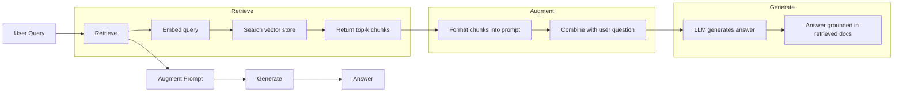
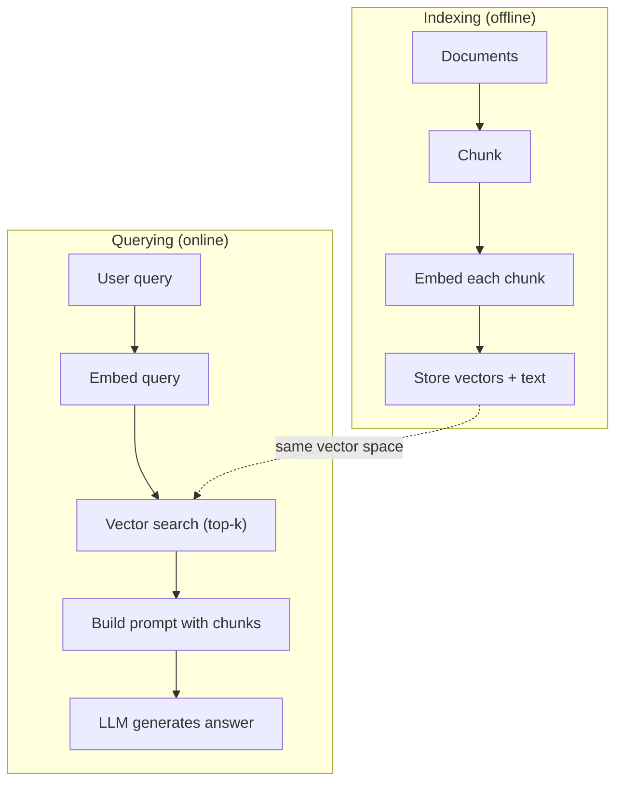

# RAG (Génération augmentée par récupération)

> Votre LLM connaît tout jusqu'à sa formation. Il ne sait rien des documents de votre entreprise, de votre base de code ou des notes de réunion de la semaine dernière. RAG résout cela en récupérant des documents pertinents et en les remplissant dans le prompt. C'est le modèle le plus déployé dans l'IA de production. Si vous construisez une chose à partir de ce cours, construisez un pipeline RAG.

**Type:** Build
**Languages:** Python
**Prerequisites:** Phase 10 (LLMs from Scratch), Phase 11 Lessons 01-05
**Time:** ~90 minutes
**Related:**Phase 5 · 23 (Stratégies de déchiquetage pour RAG) pour les six algorithmes de déchiquetage et quand chacun gagne. Phase 5 · 22 (Dipping Models Embedding) pour choisir l'embedding. Phase 11 · 07 (RAG Avancé) pour la recherche hybride, le ré-ranking et la transformation de requête.

## Objectifs d'apprentissage

- Construire un pipeline RAG complet: chargement de documents, déchiquetage, intégration, stockage vectoriel, récupération et génération
- Implémenter une recherche sémantique à l'aide d'une base de données vectorielle (ChromaDB, FAISS ou Pinecone) avec une indexation appropriée
- Expliquer pourquoi RAG est préférable à l'ajustement fin pour les applications fondées sur la connaissance (coût, fraîcheur, attribution)
- Évaluer la qualité des RAG à l'aide de mesures de récupération (precision, rappel) et de mesures de génération (fidélité, pertinence)

## Le problème

Vous construisez un chatbot pour votre entreprise. Un client demande "Quelle est la politique de remboursement pour les plans d'entreprise?" Le LLM répond avec une réponse générique sur les politiques de remboursement typiques de SaaS. La politique réelle, enterrée dans un wiki interne de 200 pages, dit que les clients d'entreprise obtiennent une fenêtre de 60 jours avec des remboursements à taux pro. Le LLM n'a jamais vu ce document. Il ne peut pas savoir sur quoi il n'a pas été formé.

Le modèle est un peu dépassé au moment où un document change. Vous n'avez aucun moyen de savoir de quelle source le modèle a été tiré. Et si l'entreprise achète une autre gamme de produits le mois prochain, vous le faites à nouveau.

RAG est l'autre solution. Laissez le modèle intact. Lorsque vous avez une question, recherchez dans votre archive de documents des passages pertinents, collez-les dans le prompt avant la question et laissez le modèle répondre en utilisant ces passages comme contexte. Le magasin de documents peut être mis à jour en quelques minutes. Vous pouvez voir exactement quels documents ont été récupérés. Le modèle lui-même ne change jamais. C'est pourquoi RAG est le modèle dominant dans la production: il est moins cher, plus frais, plus auditable, et fonctionne avec n'importe quel LLM.

## Le concept

### Le modèle RAG

L'ensemble du schéma s'inscrit en quatre étapes:



Recherche -> Retrieve -> Augment prompt -> Générer. Chaque système RAG suit ce modèle. Les différences entre les systèmes RAG de production sont dans les détails de chaque étape: comment vous décomposez, comment vous embladez, comment vous recherchez et comment vous construisez le prompt.

### Pourquoi le RAG est meilleur que le réglage

| Concern | Fine-tuning | RAG |
|---------|------------|-----|
| Cost | $1,000-$100,000+ per training run | $0.01-$0.10 per query (embedding + LLM) |
| Freshness | Stale until retrained | Updated in minutes by re-indexing docs |
| Auditability | Cannot trace answer to source | Can show exact retrieved passages |
| Hallucination | Still hallucinates freely | Grounded in retrieved documents |
| Data privacy | Training data baked into weights | Documents stay in your vector store |

Le réglage fin modifie les poids du modèle de façon permanente. RAG modifie temporairement le contexte du modèle. Pour la plupart des applications, le contexte temporaire est ce que vous voulez.

Le seul cas où l'ajustement fin gagne: lorsque vous avez besoin du modèle pour adopter un style, un ton ou un motif de raisonnement spécifique qui ne peuvent être atteints par la seule incitation.

### Intégrer des modèles

Un modèle d'intégration convertit le texte en vecteur dense. Des textes similaires produisent des vecteurs qui sont proches l'un de l'autre dans cet espace haute dimension. "Comment réinitialiser mon mot de passe?" et "Je dois changer mon mot de passe" produisent des vecteurs presque identiques malgré le partage de quelques mots. "Le chat s'est assis sur le tapis" produit un vecteur très différent.

Modèles d'intégration communs (ligne de 2026  voir la phase 5 · 22 pour une analyse complète):

| Model | Dimensions | Provider | Notes |
|-------|-----------|----------|-------|
| text-embedding-3-small | 1536 (Matryoshka) | OpenAI | Best price/performance for most use cases |
| text-embedding-3-large | 3072 (Matryoshka) | OpenAI | Higher accuracy, truncatable to 256/512/1024 |
| Gemini Embedding 2 | 3072 (Matryoshka) | Google | Top MTEB retrieval; 8K context |
| voyage-4 | 1024/2048 (Matryoshka) | Voyage AI | Domain variants (code, finance, law) |
| Cohere embed-v4 | 1024 (Matryoshka) | Cohere | Strong multilingual, 128K context |
| BGE-M3 | 1024 (dense + sparse + ColBERT) | BAAI (open-weight) | Three views from one model |
| Qwen3-Embedding | 4096 (Matryoshka) | Alibaba (open-weight) | Top open-weight retrieval score |
| all-MiniLM-L6-v2 | 384 | Open-weight (Sentence Transformers) | Prototyping baseline |

Pour cette leçon, nous construisons notre propre intégration simple en utilisant TF-IDF. Non pas parce que TF-IDF est ce que les systèmes de production utilisent, mais parce qu'il rend le concept concret: un texte entre, un vecteur sort, des textes similaires produisent des vecteurs similaires.

### Similation vectorielle

Compte tenu de deux vecteurs, comment mesurer la similitude?

**Cosine similarity**Le cossin est l'angle entre deux vecteurs. varie de -1 (opposé) à 1 (identique).

```
cosine_sim(a, b) = dot(a, b) / (||a|| * ||b||)
```

**Dot product**Les vecteurs plus grands obtiennent des scores plus élevés.

```
dot(a, b) = sum(a_i * b_i)
```

**L2 (Euclidean) distance**La distance est plus longue que la distance de la distance vectorielle.

```
L2(a, b) = sqrt(sum((a_i - b_i)^2))
```

La similitude cosine est la norme. Elle traite avec gracie des documents de différentes longueurs parce qu'elle se normalise par magnitude. Quand quelqu'un dit " recherche vectorielle ", ils veulent presque toujours dire similitude cosine.

### Des stratégies de déchiquetage

Les documents sont trop longs pour être intégrés en vecteurs simples. Un PDF de 50 pages peut produire une incubation terrible parce qu'il contient des dizaines de sujets. Au lieu de cela, vous divisez les documents en morceaux et vous incrusterez chaque morceau séparément.

**Fixed-size chunking**Une partie de 512-tokens avec 50-tokens se chevauchent signifie que la partie 1 est des jetons 0-511, la partie 2 est des jetons 462-973, etc. La chevauchement garantit que vous ne partagez pas une phrase à une limite malheureuse.

**Semantic chunking**Les paragraphes, sections ou titres de détail. Chaque morceau est une unité de signification cohérente.

**Recursive chunking**Si une section est encore trop grande, divisez-la aux limites des paragraphes. Si un paragraphe est encore trop grand, divisez-le aux limites des phrases. C'est l'approche LangChain RecursiveCharacterTextSplitter et elle fonctionne bien dans la pratique.

La taille des morceaux compte plus que ce que les gens pensent:

- Trop petit (64-128 tokens): chaque pièce manque de contexte. "Il a augmenté de 15% au dernier trimestre" ne signifie rien sans savoir ce que "il" fait référence.
- Trop gros (2048+ tokens): chaque pièce couvre plusieurs sujets, diluant la pertinence. Lorsque vous recherchez des données de revenus, vous obtenez une pièce qui est 10% sur les revenus et 90% sur le personnel.
- Point de référence (256-512 jetons): suffisamment de contexte pour être autonome, suffisamment concentré pour être pertinent.

La plupart des systèmes RAG de production utilisent 256 à 512 pièces de jetons avec 50 jetons se chevauchant.

### Base de données vectorielles

Une fois que vous avez des intégrations, vous avez besoin d'un endroit où les stocker et les rechercher.

| Database | Type | Best for |
|----------|------|----------|
| FAISS | Library (in-process) | Prototyping, small to medium datasets |
| Chroma | Lightweight DB | Local development, small deployments |
| Pinecone | Managed service | Production without ops overhead |
| Weaviate | Open source DB | Self-hosted production |
| pgvector | Postgres extension | Already using Postgres |
| Qdrant | Open source DB | High-performance self-hosted |

Pour cette leçon, nous avons construit un simple magasin de vecteurs en mémoire. Il stocke des vecteurs dans une liste et effectue une recherche de similitude cosine brute-force. Cela équivaut à FAISS avec un indice plat. Il évolue à peut-être 100 000 vecteurs avant de ralentir. Les systèmes de production utilisent des algorithmes proches voisins (ANN) approximatifs comme HNSW pour rechercher des millions de vecteurs en millisecondes.

### Le pipeline complet



La phase d'indexation se déroule une fois par document (ou lorsque les documents sont mis à jour). La phase de requête se déroule sur chaque demande d'utilisateur.

### Numéros réels

La plupart des systèmes RAG de production utilisent ces paramètres:

- **k = 5 to 10**les fragments récupérés par requête
- **Chunk size = 256 to 512 tokens**avec une superposition de 50 jetons
- **Context budget**: 2500 à 5000 jetons de contenu récupéré par requête
- **Total prompt**: ~ 8000-16,000 jetons (interrogatoire système + fragments récupérés + historique de conversation + requête utilisateur)
- **Embedding dimension**: 384-3072 selon le modèle
- **Indexing throughput**: 100 à 1000 documents par seconde avec intégrations API
- **Query latency**: 50-200 ms pour la récupération, 500-3000 ms pour la génération

```figure
rag-chunking
```

## Faites-le

### Étape 1: Chunking du document

```python
def chunk_text(text, chunk_size=200, overlap=50):
    words = text.split()
    chunks = []
    start = 0
    while start < len(words):
        end = start + chunk_size
        chunk = " ".join(words[start:end])
        chunks.append(chunk)
        start += chunk_size - overlap
    return chunks
```

### Étape 2: Embedding TF-IDF

Nous construisons une fonction d'intégration simple. TF-IDF (Term Frequency-Inverse Document Frequency) n'est pas un intégration neurale, mais elle convertit le texte en vecteurs d'une manière qui capture l'importance des mots. Les mots fréquents dans un document gagnent plus de TF. Les mots rares dans le corpus gagnent plus de IDF. Le produit donne un vecteur où les mots importants et distinctifs ont des valeurs élevées.

```python
import math
from collections import Counter

def build_vocabulary(documents):
    vocab = set()
    for doc in documents:
        vocab.update(doc.lower().split())
    return sorted(vocab)

def compute_tf(text, vocab):
    words = text.lower().split()
    count = Counter(words)
    total = len(words)
    return [count.get(word, 0) / total for word in vocab]

def compute_idf(documents, vocab):
    n = len(documents)
    idf = []
    for word in vocab:
        doc_count = sum(1 for doc in documents if word in doc.lower().split())
        idf.append(math.log((n + 1) / (doc_count + 1)) + 1)
    return idf

def tfidf_embed(text, vocab, idf):
    tf = compute_tf(text, vocab)
    return [t * i for t, i in zip(tf, idf)]
```

### Étape 3: recherche de similitude cosine

```python
def cosine_similarity(a, b):
    dot = sum(x * y for x, y in zip(a, b))
    norm_a = math.sqrt(sum(x * x for x in a))
    norm_b = math.sqrt(sum(x * x for x in b))
    if norm_a == 0 or norm_b == 0:
        return 0.0
    return dot / (norm_a * norm_b)

def search(query_embedding, stored_embeddings, top_k=5):
    scores = []
    for i, emb in enumerate(stored_embeddings):
        sim = cosine_similarity(query_embedding, emb)
        scores.append((i, sim))
    scores.sort(key=lambda x: x[1], reverse=True)
    return scores[:top_k]
```

### Étape 4: Construire rapidement

C'est là que se produit le "augmenté" dans RAG. Prenez les morceaux récupérés, formatez-les en un prompt et demandez au LLM de répondre en fonction du contexte fourni.

```python
def build_rag_prompt(query, retrieved_chunks):
    context = "\n\n---\n\n".join(
        f"[Source {i+1}]\n{chunk}"
        for i, chunk in enumerate(retrieved_chunks)
    )
    return f"""Answer the question based ONLY on the following context.
If the context doesn't contain enough information, say "I don't have enough information to answer that."

Context:
{context}

Question: {query}

Answer:"""
```

### Étape 5: L'oléoduc RAG complet

```python
class RAGPipeline:
    def __init__(self):
        self.chunks = []
        self.embeddings = []
        self.vocab = []
        self.idf = []

    def index(self, documents):
        all_chunks = []
        for doc in documents:
            all_chunks.extend(chunk_text(doc))
        self.chunks = all_chunks
        self.vocab = build_vocabulary(all_chunks)
        self.idf = compute_idf(all_chunks, self.vocab)
        self.embeddings = [
            tfidf_embed(chunk, self.vocab, self.idf)
            for chunk in all_chunks
        ]

    def query(self, question, top_k=5):
        query_emb = tfidf_embed(question, self.vocab, self.idf)
        results = search(query_emb, self.embeddings, top_k)
        retrieved = [(self.chunks[i], score) for i, score in results]
        prompt = build_rag_prompt(
            question, [chunk for chunk, _ in retrieved]
        )
        return prompt, retrieved
```

### Étape 6: génération (simulée)

Dans la production, c'est là que vous appelez l'API LLM. Pour cette leçon, nous simulons la génération en extraisant la phrase la plus pertinente du contexte récupéré.

```python
def simple_generate(prompt, retrieved_chunks):
    query_words = set(prompt.lower().split("question:")[-1].split())
    best_sentence = ""
    best_score = 0
    for chunk in retrieved_chunks:
        for sentence in chunk.split("."):
            sentence = sentence.strip()
            if not sentence:
                continue
            words = set(sentence.lower().split())
            overlap = len(query_words & words)
            if overlap > best_score:
                best_score = overlap
                best_sentence = sentence
    return best_sentence if best_sentence else "I don't have enough information."
```

## Utilisez-le

Avec un modèle d'intégration et un LLM, le code change à peine:

```python
from openai import OpenAI

client = OpenAI()

def embed(text):
    response = client.embeddings.create(
        model="text-embedding-3-small",
        input=text
    )
    return response.data[0].embedding

def generate(prompt):
    response = client.chat.completions.create(
        model="gpt-4o-mini",
        messages=[{"role": "user", "content": prompt}],
        temperature=0
    )
    return response.choices[0].message.content
```

Ou avec Anthropic:

```python
import anthropic

client = anthropic.Anthropic()

def generate(prompt):
    response = client.messages.create(
        model="claude-sonnet-5",
        max_tokens=1024,
        messages=[{"role": "user", "content": prompt}]
    )
    return response.content[0].text
```

Le pipeline est le même. Changer la fonction d'intégration. Changer la fonction de génération. La logique de récupération, le déchiquetage, la construction rapide - tout identique quel que soit le modèle que vous utilisez.

Pour le stockage vectoriel à l'échelle, remplacer la recherche brute-force par une base de données vectorielle appropriée:

```python
import chromadb

client = chromadb.Client()
collection = client.create_collection("my_docs")

collection.add(
    documents=chunks,
    ids=[f"chunk_{i}" for i in range(len(chunks))]
)

results = collection.query(
    query_texts=["What is the refund policy?"],
    n_results=5
)
```

Chroma gère l'intégration en interne (il utilise tout-MiniLM-L6-v2 par défaut) et stocke les vecteurs dans une base de données locale.

## La faire partir

Cette leçon donne:
- `outputs/prompt-rag-architect.md`-- une demande de conception de systèmes RAG pour des cas d'utilisation spécifiques
- `outputs/skill-rag-pipeline.md`-- une compétence qui apprend aux agents comment construire et débogager des pipelines RAG

## Exercices

1. Remplacez les intégrations TF-IDF par une approche simple de sacs de mots (binary: 1 si le mot est présent, 0 si ce n'est pas le cas). Comparer la qualité de récupération sur les documents d'échantillon. TF-IDF devrait surpasser les résultats car il pèse plus haut les mots rares.

2. Experimentez avec les tailles de pièces: essayez 50, 100, 200 et 500 mots sur le même ensemble de documents. Pour chaque taille, effectuez les mêmes 5 requêtes et comptez combien de requêtes renvoient une pièce pertinente dans le haut-3. Trouvez le point doux où la qualité de récupération atteint son apogée.

3. Ajouter des métadonnées à chaque pièce (nom du document source, position de la pièce). Modifier le modèle de demande pour inclure l'attribution de source afin que le LLM cite ses sources.

4. Exécuter une simple évaluation: en donnant 10 paires de questions-réponses, faire passer chaque question par le pipeline RAG et mesurer le pourcentage de fragments récupérés contenant la réponse.

5. Construisez un pipeline RAG conscient de la conversation: gardez un historique des 3 derniers échanges et les inclure dans l'interrogatoire à côté des fragments récupérés.

## Les termes clés

| Term | What people say | What it actually means |
|------|----------------|----------------------|
| RAG | "AI that reads your docs" | Retrieve relevant documents, paste them into the prompt, and generate an answer grounded in those documents |
| Embedding | "Convert text to numbers" | A dense vector representation of text where similar meanings produce similar vectors |
| Vector database | "Search engine for AI" | A data store optimized for storing vectors and finding the nearest neighbors by similarity |
| Chunking | "Split docs into pieces" | Breaking documents into smaller segments (typically 256-512 tokens) so each can be embedded and retrieved independently |
| Cosine similarity | "How similar are two vectors" | The cosine of the angle between two vectors; 1 = identical direction, 0 = orthogonal, -1 = opposite |
| Top-k retrieval | "Get the k best matches" | Return the k most similar chunks to the query from the vector store |
| Context window | "How much text the LLM can see" | The maximum number of tokens the LLM can process in a single request; retrieved chunks must fit within this |
| Augmented generation | "Answer using given context" | Generating a response using retrieved documents as context rather than relying solely on trained knowledge |
| TF-IDF | "Word importance scoring" | Term Frequency times Inverse Document Frequency; weights words by how distinctive they are within a corpus |
| Indexing | "Preparing docs for search" | The offline process of chunking, embedding, and storing documents so they can be searched at query time |

## Pour en savoir plus

- Lewis et coll., "Retrieval-Augmented Generation for Knowledge-Intensive NLP Tasks" (2020) -- le document RAG original de Facebook AI Research qui a formalisé le modèle de récupération puis génération
- Documentation RAG d'Anthropic (docs.anthropic.com) - lignes directrices pratiques pour les tailles de pièces, la construction rapide et l'évaluation
- Le centre d'apprentissage Pinecone, "Qu'est-ce que le RAG?" -- explications visuelles claires du pipeline RAG avec des considérations de production
- Sentence-BERT: Reimers & Gurevych (2019) -- le document derrière les modèles intégrés MiniLM, montrant comment former les bi-encoders pour une similitude sémantique
- [Karpukhin et al., "Dense Passage Retrieval for Open-Domain Question Answering" (EMNLP 2020)](https://arxiv.org/abs/2004.04906)-- le papier DPR qui a prouvé une récupération de bi-encodeur dense surpasse BM25 sur l'AQ open-domain et a établi le modèle pour les récupérateurs RAG modernes.
- [LlamaIndex High-Level Concepts](https://docs.llamaindex.ai/en/stable/getting_started/concepts.html)-- les concepts principaux à connaître lors de la construction de lignes de RAG: chargements de données, partageurs de nœuds, indices, récupérateurs, synthétiseurs de réponse.
- [LangChain RAG tutorial](https://python.langchain.com/docs/tutorials/rag/)-- l'orchestrateur à goût opposé; la vue de la chaîne des rouleaux du même modèle de récupération puis génération.
