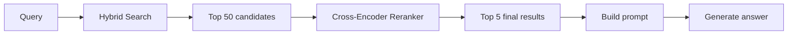
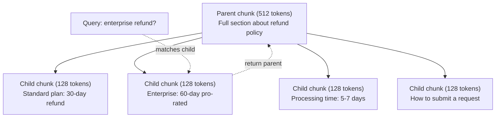
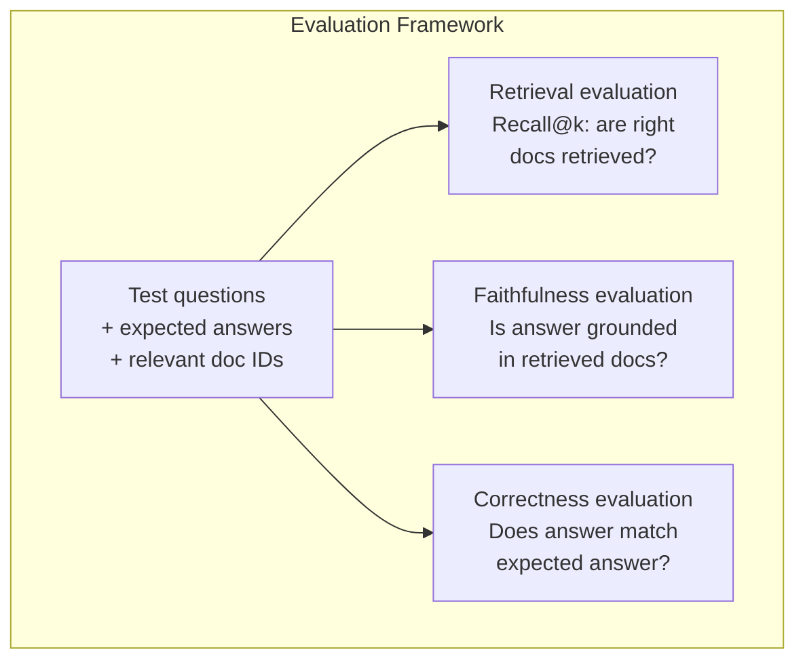

# RAG avancé (déchets, réaffectation, recherche hybride)

> RAG de base récupère les plus similaires de la partie supérieure. Cela fonctionne pour les questions simples. Il se décompose pour le raisonnement multi-hop, les requêtes ambiguës et les grandes corporations. RAG avancé est la différence entre une démo qui fonctionne sur 10 documents et un système qui fonctionne sur 10 millions.

**Type:** Build
**Languages:** Python
**Prerequisites:** Phase 11, Lesson 06 (RAG)
**Time:** ~90 minutes
**Related:**La phase 5 · 23 (Strategie de déchiquetage pour RAG) couvre les six algorithmes de déchiquetage  récursif, sémantique, phrase, parent-document, déchiquetage tardif, récupération contextuelle  avec des repères Vectara/Anthropic. Cette leçon s'appuie sur le dessus: recherche hybride, réévaluation, transformation de requête.

## Objectifs d'apprentissage

- Mettre en œuvre des stratégies de déchiquetage avancées (sémantique, récursive, parent-enfant) qui préservent la structure et le contexte du document
- Construire un pipeline de recherche hybride combinant le partage de mots clés BM25 avec la recherche vectorielle sémantique et un réencodeur croisé
- Appliquer des techniques de transformation des requêtes (HyDE, multi requêtes, step-back) pour améliorer la récupération sur des questions ambiguës ou complexes
- Diagnostication et réparation des défaillances courantes du RAG: mauvais morceau récupéré, réponse non contextuelle, décomposition du raisonnement multi-hop

## Le problème

Vous avez construit un pipeline RAG de base dans la leçon 06. Il fonctionne pour des questions simples sur un petit corpus.

**Ambiguous query**"Quel était le chiffre d'affaires au dernier trimestre?" La recherche sémantique renvoie des morceaux sur la stratégie de revenus, les projections de revenus et les pensées du directeur financier sur la croissance des revenus. Tout cela est semanticement similaire au mot "revenus". Aucun ne contient le nombre réel.$47.2M in Q3 2025" but uses the word "earnings" instead of "revenue." The embedding model thinks "revenue strategy" is closer to the query than "Q3 earnings were $47,2 M. "

**Multi-hop question**Le rapport de satisfaction de chaque équipe exige de trouver les scores de satisfaction de chaque équipe, de les comparer et d'identifier le maximum.

**Large corpus problem**Vous avez 2 millions de blocs. La réponse correcte est dans la partie #1,847,293. Votre recherche de top-5 tire les blocs #14, #89,201, #1,200,000, #44, et #901,333. Fermé dans l'espace d'intégration, mais aucun ne contient la réponse. À cette échelle, la recherche de voisin le plus proche approximatif introduit suffisamment d'erreur pour que les résultats pertinents soient repoussés hors de la partie supérieure.

Le RAG de base échoue parce que la similitude vectorielle n'est pas la même que la pertinence. Une pièce peut être semantiquement similaire à une requête sans être utile pour la répondre. Le RAG avancé aborde ce problème avec quatre techniques: recherche hybride (ajout de correspondance de mots clés), réévaluation (téléchargement des candidats plus attentivement), transformation de requête (corrigation de la requête avant de la recherche) et meilleure fragmentation (obtention de la bonne granularité).

## Le concept

### Recherche hybride: sémantique + mot clé

La recherche sémantique (semblance vectorielle) est bonne pour comprendre la signification. " Comment annuler mon abonnement ? " correspond à " Pas pour mettre fin à votre plan " même s'ils ne partagent pas de mots. Mais il manque de correspondances exactes. " Code d'erreur E-4021 " peut ne pas correspondre à une pièce contenant " E-4021 " si le modèle d'intégration le traite comme du bruit.

La recherche de mots clés (BM25) est l'inverse. Elle excelle à des correspondances exactes. "E-4021" correspond parfaitement. Mais "annuler mon abonnement" renvoie zéro résultats si le document dit "terminer votre plan".

La recherche hybride fait les deux, puis fusionne les résultats.

**BM25**(Best Matching 25) est l'algorithme de recherche par mot-clé standard. Il est la colonne vertébrale des moteurs de recherche depuis les années 1990.

```
BM25(q, d) = sum over terms t in q:
    IDF(t) * (tf(t,d) * (k1 + 1)) / (tf(t,d) + k1 * (1 - b + b * |d| / avgdl))
```

Là où tf(t,d) est la fréquence terminale de t dans le document d, IDF(t) est la fréquence inverse du document, \ \ \ \ \ \ \ \ \ \ \ \ \ \ \ \ \ \ \ \ \ \ \ \ \ \ \ \ \ \ \ \ \ \ \ \ \ \ \ \ \ \ \ \ \ \ \ \ \ \ \ \ \ \ \ \ \ \ \ \ \ \ \ \ \ \ \ \ \ \ \ \ \ \ \ \ \ \ \ \ \ \ \ \ \ \ \ \ \ \ \ \ \ \ \ \ \ \ \ \ \ \ \ \ \ \ \ \ \ \ \ \ \ \ \ \ \ \ \ \ \ \ \ \ \ \ \ \ \ \ \ \ \ \ \ \ \ \ \ \ \ \ \ \ \ \ \ \ \ \ \ \ \ \ \ \ \ \ \ \ \ \ \ \ \ \ \ \ \ \ \ \ \ \ \ \ \ \ \ \ \ \ \ \ \ \ \ \ \ \ \ \ \ \ \ \ \ \ \ \ \ \ \ \ \ \ \ \ \ \ \ \ \ \ \ \ \ \ \ \ \ \ \ \ \ \ \ \ \ \ \ \ \ \ \ \ \ \ \ \ \ \ \ \ \ \ \ \ \ \ \ \ \ \ \ \ \ \ \ \ \ \ \ \ \ \ \ \ \ \ \ \ \ \ \ \ \ \ \ \ \ \ \ \ \ \ \ \ \ \ \ \ \ \ \ \ \ \ \ \ \ \ \ \ \ \ \ \ \ \ \ \ \ \ \ \ \ \ \ \ \ \ \ \ \ \ \ \ \ \ \ \ \ \ \ \ \ \ \ \ \ \ \ \ \ \ \ \ \ \ \ \ \ \ \ \ \ \ \ \ \ \ \ \ \ \ \ \ \ \ \ \ \ \ \ \ \ \ \ \ \ \ \ \ \ \ \ \ \ \ \ \ \ \ \ \ \ \ \ \ \ \ \ \ \ \ \ \ \ \ \ \ \ \ \ \ \ \ \ \ \ \ \ \ \ \ \ \ \ \ \ \ \ \ \ \ \ \ \ \ \ \ \ \ \ \ \ \ \ \ \ \ \ \ \ \ \ \ \ \ \ \ \ \ \ \ \ \ \ \ \ \ \ \ \

En termes simples: BM25 donne des notes plus élevées aux documents lorsqu'ils contiennent des termes de requête (surtout ceux rares), mais avec des rendements moindres pour les termes répétés.

### Fusion de rang réciproque (RRF)

Vous avez deux listes classées: une de recherche vectorielle, une de BM25. Comment les combiner?

```
RRF_score(d) = sum over rankings R:
    1 / (k + rank_R(d))
```

Où k est une constante (typiquement 60) qui empêche le résultat le plus haut de dominer.

Un document classé 1er dans la recherche vectorielle et 5e dans BM25 obtient: 1/(60+1) + 1/(60+5) = 0.0164 + 0.0154 = 0.0318

Un document classé #3 dans la recherche vectorielle et #2 dans BM25 obtient: 1/(60+3) + 1/(60+2) = 0.0159 + 0.0161 = 0.0320

RRF équilibre naturellement les deux signaux. Un document qui se classe bien dans les deux listes obtient le meilleur score. Un document qui se classe #1 dans une liste mais est absent de l'autre obtient un score modéré. Ceci est robuste car il utilise des rangs, pas des scores bruts, de sorte que les différences dans la répartition des scores entre les deux systèmes n'ont pas d'importance.

### Rencontre

La récupération (qu'elle soit vectorielle, mot clé ou hybride) est rapide mais imprécise. Elle utilise des bi-encoders: la requête et chaque document sont intégrés indépendamment, puis comparés. Les intégrations sont calculées une fois et mises en cache. Cela équivaut à des millions de documents.

Le référencement utilise des encoders croisés: la requête et un document candidat sont alimentés ensemble dans un modèle qui produit un score de pertinence. Le modèle voit les deux textes simultanément et peut capturer des interactions fine-graines entre eux. Un encodateur croisé peut comprendre que "Quels étaient les bénéfices du Q3?" est très pertinent pour une pièce contenant "47.2 millions de dollars au Q3" même si un bi-encodeur a raté la connexion.

Le compromis: les encoders croisés sont 100 à 1000 fois plus lents que les bi-encoders parce qu'ils traitent le paire requête-document conjointement. Vous ne pouvez pas calculer les scores de codeurs croisés pour un million de documents. La solution: récupérer un ensemble de candidats plus grand (top-50 de recherche hybride), puis réafficher avec un encodeur croisé pour obtenir le top-5 final.



Modèles communs de réévaluation (2026 ligne):
- Rencontre de cohérence 3.5: API gérée, multilingue, meilleur gain de rappel sur les corps mixtes
- Rencontre de Voyage-2.5: API gérée, latence la plus faible des options hébergées
- Jina-Reranker-v2 Multilingue: poids ouvert, plus de 100 langues
- bge-renanker-v2-m3: poids ouvert, ligne de départ forte
- cross-encoder/ms-marco-MiniLM-L-6-v2: poids ouvert, fonctionne sur CPU pour la prototypage
- ColBERTv2 / Jina-ColBERT-v2: ré-rangers multi-vectoriels d'interaction tardive  O(tokens) pas O(docs) au moment du score

### Transformation de requête

Parfois, le problème n'est pas la récupération mais la requête elle-même. "Qu'était ce truc sur le nouveau changement de politique?" est une requête de recherche terrible. Il ne contient pas de termes spécifiques. L'intégration est vague. Aucun système de récupération ne peut trouver les bons documents à partir de cela.

**Query rewriting**Le programme de recherche peut être réalisé par un programme de recherche spécialisé dans les domaines de l'enseignement supérieur et de la recherche.

```
User: "What was that thing about the new policy change?"
Rewritten: "Recent policy changes and updates"
```

**HyDE (Hypothetical Document Embeddings)**: au lieu de rechercher avec la requête, générer une réponse hypothétique, intégrer cela, et de rechercher des documents réels similaires.

```
Query: "What is the refund policy for enterprise?"
Hypothetical answer: "Enterprise customers are eligible for a full refund
within 60 days of purchase. Refunds are pro-rated based on the remaining
subscription period and processed within 5-7 business days."
```

Encrer la réponse hypothétique et la recherche de documents réels similaires à celui-ci. L'intuition: la réponse hypothétique vit plus près de l'espace d'intégration de la réponse réelle que la question originale. Les questions et les réponses ont des structures linguistiques différentes. En générant une réponse hypothétique, vous comblez l'écart entre "espace de question" et "espace de réponse" dans l'intégration.

HyDE ajoute un appel LLM avant la récupération. Cela augmente la latence de 500-2000ms. Cela vaut la peine lorsque la qualité de récupération est mauvaise sur les requêtes brutes.

### Les parents et les enfants se déchirent

Le déchiquetage standard force un compromis: petits morceaux pour une récupération précise, grands morceaux pour un contexte suffisant.

Indiquez les petits morceaux (128 jetons) pour récupération. Lorsqu'un petit morceau est récupéré, retournez son morceau parent (512 jetons) pour la requête.



La requête "Remboursement d'entreprise?" correspond exactement à la partie enfant C2. Mais la requête reçoit la partie mère P complète, qui comprend le contexte environnant sur le temps de traitement et le processus de soumission.

### Filtrage des métadonnées

Avant d'exécuter une recherche vectorielle, filtrez le corpus par métadonnées: date, source, catégorie, auteur, langue. Cela réduit l'espace de recherche et empêche les résultats irrélevants.

"Qu'est-ce qui a changé dans la politique de sécurité le mois dernier?" ne devrait rechercher que des documents des 30 derniers jours dans la catégorie de sécurité. Sans filtrer les métadonnées, vous fouillez l'ensemble du corpus et vous pouvez récupérer un document de sécurité vieux de 2 ans qui se trouve semantiquement similaire.

Les systèmes RAG de production stockent des métadonnées à côté de chaque pièce: document source, date de création, catégorie, auteur, version.

### Évaluation

Vous avez construit un système RAG, comment savez-vous qu'il fonctionne ?

**Retrieval relevance (Recall@k)**Si la réponse à une question est dans la partie #47, la partie #47 figure-t-elle dans la partie 5?

**Faithfulness**Si les pièces récupérées disent "fenêtre de remboursement de 60 jours" et que le modèle dit "fenêtre de remboursement de 90 jours", c'est un défaut de fidélité.

**Answer correctness**La méthode de mesure est la méthode de mesure de bout en bout qui combine la qualité de récupération et la qualité de génération.

Une simple vérification de fidélité: prendre chaque affirmation dans la réponse générée et vérifier qu'elle apparaît (en substance) dans les morceaux récupérés.



```figure
agentic-rag-loop
```

## Faites-le

### Étape 1: mise en œuvre de la BM25

```python
import math
from collections import Counter

class BM25:
    def __init__(self, k1=1.2, b=0.75):
        self.k1 = k1
        self.b = b
        self.docs = []
        self.doc_lengths = []
        self.avg_dl = 0
        self.doc_freqs = {}
        self.n_docs = 0

    def index(self, documents):
        self.docs = documents
        self.n_docs = len(documents)
        self.doc_lengths = []
        self.doc_freqs = {}

        for doc in documents:
            words = doc.lower().split()
            self.doc_lengths.append(len(words))
            unique_words = set(words)
            for word in unique_words:
                self.doc_freqs[word] = self.doc_freqs.get(word, 0) + 1

        self.avg_dl = sum(self.doc_lengths) / self.n_docs if self.n_docs else 1

    def score(self, query, doc_idx):
        query_words = query.lower().split()
        doc_words = self.docs[doc_idx].lower().split()
        doc_len = self.doc_lengths[doc_idx]
        word_counts = Counter(doc_words)
        score = 0.0

        for term in query_words:
            if term not in word_counts:
                continue
            tf = word_counts[term]
            df = self.doc_freqs.get(term, 0)
            idf = math.log((self.n_docs - df + 0.5) / (df + 0.5) + 1)
            numerator = tf * (self.k1 + 1)
            denominator = tf + self.k1 * (1 - self.b + self.b * doc_len / self.avg_dl)
            score += idf * numerator / denominator

        return score

    def search(self, query, top_k=10):
        scores = [(i, self.score(query, i)) for i in range(self.n_docs)]
        scores.sort(key=lambda x: x[1], reverse=True)
        return scores[:top_k]
```

### Étape 2: fusion de rang réciproque

```python
def reciprocal_rank_fusion(ranked_lists, k=60):
    scores = {}
    for ranked_list in ranked_lists:
        for rank, (doc_id, _) in enumerate(ranked_list):
            if doc_id not in scores:
                scores[doc_id] = 0.0
            scores[doc_id] += 1.0 / (k + rank + 1)
    fused = sorted(scores.items(), key=lambda x: x[1], reverse=True)
    return fused
```

### Étape 3: Pipeline de recherche hybride

```python
def hybrid_search(query, chunks, vector_embeddings, vocab, idf, bm25_index, top_k=5, fusion_k=60):
    query_emb = tfidf_embed(query, vocab, idf)
    vector_results = search(query_emb, vector_embeddings, top_k=top_k * 3)
    bm25_results = bm25_index.search(query, top_k=top_k * 3)
    fused = reciprocal_rank_fusion([vector_results, bm25_results], k=fusion_k)
    return fused[:top_k]
```

### Étape 4: Rencontre simple

Dans la production, vous utiliserez un modèle de cross-encoder. Ici, nous construisons un réranqueur qui note la pertinence du document de requête en utilisant la chevauchement des mots, l'importance des termes et la correspondance des phrases.

```python
def rerank(query, candidates, chunks):
    query_words = set(query.lower().split())
    stop_words = {"the", "a", "an", "is", "are", "was", "were", "what", "how",
                  "why", "when", "where", "do", "does", "for", "of", "in", "to",
                  "and", "or", "on", "at", "by", "it", "its", "this", "that",
                  "with", "from", "be", "has", "have", "had", "not", "but"}
    query_terms = query_words - stop_words

    scored = []
    for doc_id, initial_score in candidates:
        chunk = chunks[doc_id].lower()
        chunk_words = set(chunk.split())

        term_overlap = len(query_terms & chunk_words)

        query_bigrams = set()
        q_list = [w for w in query.lower().split() if w not in stop_words]
        for i in range(len(q_list) - 1):
            query_bigrams.add(q_list[i] + " " + q_list[i + 1])
        bigram_matches = sum(1 for bg in query_bigrams if bg in chunk)

        position_boost = 0
        for term in query_terms:
            pos = chunk.find(term)
            if pos != -1 and pos < len(chunk) // 3:
                position_boost += 0.5

        rerank_score = (
            term_overlap * 1.0
            + bigram_matches * 2.0
            + position_boost
            + initial_score * 5.0
        )
        scored.append((doc_id, rerank_score))

    scored.sort(key=lambda x: x[1], reverse=True)
    return scored
```

### Étape 5: HyDE (embedding hypothétique du document)

```python
def hyde_generate_hypothesis(query):
    templates = {
        "what": "The answer to '{query}' is as follows: Based on our documentation, {topic} involves specific policies and procedures that define how the process works.",
        "how": "To address '{query}': The process involves several steps. First, you need to initiate the request. Then, the system processes it according to the defined rules.",
        "default": "Regarding '{query}': Our records indicate specific details and policies related to this topic that provide a comprehensive answer."
    }
    query_lower = query.lower()
    if query_lower.startswith("what"):
        template = templates["what"]
    elif query_lower.startswith("how"):
        template = templates["how"]
    else:
        template = templates["default"]

    topic_words = [w for w in query.lower().split()
                   if w not in {"what", "is", "the", "how", "do", "does", "a", "an",
                                "for", "of", "to", "in", "on", "at", "by", "and", "or"}]
    topic = " ".join(topic_words) if topic_words else "this topic"

    return template.format(query=query, topic=topic)


def hyde_search(query, chunks, vector_embeddings, vocab, idf, top_k=5):
    hypothesis = hyde_generate_hypothesis(query)
    hypothesis_emb = tfidf_embed(hypothesis, vocab, idf)
    results = search(hypothesis_emb, vector_embeddings, top_k)
    return results, hypothesis
```

### Étape 6: Parent-enfant

```python
def create_parent_child_chunks(text, parent_size=200, child_size=50):
    words = text.split()
    parents = []
    children = []
    child_to_parent = {}

    parent_idx = 0
    start = 0
    while start < len(words):
        parent_end = min(start + parent_size, len(words))
        parent_text = " ".join(words[start:parent_end])
        parents.append(parent_text)

        child_start = start
        while child_start < parent_end:
            child_end = min(child_start + child_size, parent_end)
            child_text = " ".join(words[child_start:child_end])
            child_idx = len(children)
            children.append(child_text)
            child_to_parent[child_idx] = parent_idx
            child_start += child_size

        parent_idx += 1
        start += parent_size

    return parents, children, child_to_parent
```

### Étape 7: Évaluer la fidélité

```python
def evaluate_faithfulness(answer, retrieved_chunks):
    answer_sentences = [s.strip() for s in answer.split(".") if len(s.strip()) > 10]
    if not answer_sentences:
        return 1.0, []

    grounded = 0
    ungrounded = []
    context = " ".join(retrieved_chunks).lower()

    for sentence in answer_sentences:
        words = set(sentence.lower().split())
        stop_words = {"the", "a", "an", "is", "are", "was", "were", "and", "or",
                      "to", "of", "in", "for", "on", "at", "by", "it", "this", "that"}
        content_words = words - stop_words
        if not content_words:
            grounded += 1
            continue

        matched = sum(1 for w in content_words if w in context)
        ratio = matched / len(content_words) if content_words else 0

        if ratio >= 0.5:
            grounded += 1
        else:
            ungrounded.append(sentence)

    score = grounded / len(answer_sentences) if answer_sentences else 1.0
    return score, ungrounded


def evaluate_retrieval_recall(queries_with_relevant, retrieval_fn, k=5):
    total_recall = 0.0
    results = []

    for query, relevant_indices in queries_with_relevant:
        retrieved = retrieval_fn(query, k)
        retrieved_indices = set(idx for idx, _ in retrieved)
        relevant_set = set(relevant_indices)
        hits = len(retrieved_indices & relevant_set)
        recall = hits / len(relevant_set) if relevant_set else 1.0
        total_recall += recall
        results.append({
            "query": query,
            "recall": recall,
            "hits": hits,
            "total_relevant": len(relevant_set)
        })

    avg_recall = total_recall / len(queries_with_relevant) if queries_with_relevant else 0
    return avg_recall, results
```

## Utilisez-le

Avec un vrai cross-encoder pour le ré-rangement:

```python
from sentence_transformers import CrossEncoder

reranker = CrossEncoder("cross-encoder/ms-marco-MiniLM-L-6-v2")

def rerank_with_cross_encoder(query, candidates, chunks, top_k=5):
    pairs = [(query, chunks[doc_id]) for doc_id, _ in candidates]
    scores = reranker.predict(pairs)
    scored = list(zip([doc_id for doc_id, _ in candidates], scores))
    scored.sort(key=lambda x: x[1], reverse=True)
    return scored[:top_k]
```

Avec le ré-ranger géré par Cohere:

```python
import cohere

co = cohere.Client()

def rerank_with_cohere(query, candidates, chunks, top_k=5):
    docs = [chunks[doc_id] for doc_id, _ in candidates]
    response = co.rerank(
        model="rerank-english-v3.0",
        query=query,
        documents=docs,
        top_n=top_k
    )
    return [(candidates[r.index][0], r.relevance_score) for r in response.results]
```

Pour HyDE avec un vrai LLM:

```python
import anthropic

client = anthropic.Anthropic()

def hyde_with_llm(query):
    response = client.messages.create(
        model="claude-sonnet-5",
        max_tokens=256,
        messages=[{
            "role": "user",
            "content": f"Write a short paragraph that would be a good answer to this question. Do not say you don't know. Just write what the answer would look like.\n\nQuestion: {query}"
        }]
    )
    return response.content[0].text
```

Pour la recherche hybride de production avec Weaviate:

```python
import weaviate

client = weaviate.connect_to_local()

collection = client.collections.get("Documents")
response = collection.query.hybrid(
    query="enterprise refund policy",
    alpha=0.5,
    limit=10
)
```

Le paramètre alpha contrôle l'équilibre: 0,0 = mot clé pur (BM25), 1,0 = vecteur pur, 0,5 = poids égal. La plupart des systèmes de production utilisent alpha entre 0,3 et 0,7.

## La faire partir

Cette leçon donne:
- `outputs/prompt-advanced-rag-debugger.md`-- une demande de diagnostic et de résolution des problèmes de qualité des RAG
- `outputs/skill-advanced-rag.md`-- une compétence pour construire des RAG de qualité de production avec recherche hybride et réévaluation

## Exercices

1. Comparez BM25 vs recherche vectorielle vs recherche hybride sur les documents d'échantillon. Pour chacune des 5 requêtes de test, enregistrer quelle approche renvoie la pièce la plus pertinente à la position #1.

2. Implémenter un filtre de métadonnées. Ajoutez un champ "catégorie" à chaque document (sécurité, facturation, api, produit). Avant d'exécuter une recherche vectorielle, filtrez les morceaux à la seule catégorie pertinente. Testez avec "Quel chiffrement est utilisé?" et vérifiez que cela ne recherche que les morceaux de catégorie de sécurité.

3. Construisez un pipeline complet d'HyDE en utilisant la fonction générer simple de la leçon 06. Comparer la qualité de récupération (la pertinence du top 3) entre la recherche directe de requête et la recherche HyDE sur les 5 requêtes de test. HyDE devrait améliorer les résultats pour les requêtes vagues.

4. Appliquez la stratégie de décomposition parent-enfant sur les documents d'échantillon. Utilisez child_size=30 et parent_size=100. Recherchez avec des morceaux d'enfants mais retournez les morceaux de parents dans le prompt. Comparer les réponses générées à la décomposition standard avec chunk_size=50.

5. Créer un ensemble de données d'évaluation: 10 questions avec des éléments de réponse connus. Mesurer Recall@3, Recall@5, et Recall@10 pour (a) la recherche vectorielle uniquement, (b) BM25 uniquement, (c) la recherche hybride, (d) la recherche hybride + réévaluation.

## Les termes clés

| Term | What people say | What it actually means |
|------|----------------|----------------------|
| BM25 | "Keyword search" | A probabilistic ranking algorithm that scores documents by term frequency, inverse document frequency, and document length normalization |
| Hybrid search | "Best of both worlds" | Running semantic (vector) and keyword (BM25) search in parallel, then merging results with rank fusion |
| Reciprocal Rank Fusion | "Merge ranked lists" | Combining multiple ranked lists by summing 1/(k + rank) for each document across all lists |
| Reranking | "Second pass scoring" | Using a more expensive cross-encoder model to re-score a candidate set from initial retrieval |
| Cross-encoder | "Joint query-document model" | A model that takes a query and document as a single input, producing a relevance score; more accurate than bi-encoders but too slow for full corpus search |
| Bi-encoder | "Independent embedding model" | A model that embeds queries and documents independently; fast because embeddings are precomputed, but less accurate than cross-encoders |
| HyDE | "Search with a fake answer" | Generate a hypothetical answer to the query, embed it, and search for real documents similar to it |
| Parent-child chunking | "Small search, big context" | Index small chunks for precise retrieval but return the larger parent chunk to provide sufficient context |
| Metadata filtering | "Narrow before searching" | Filtering documents by attributes (date, source, category) before running vector search to reduce the search space |
| Faithfulness | "Did it stay grounded" | Whether the generated answer is supported by the retrieved documents, as opposed to hallucinated from the model's training data |

## Pour en savoir plus

- Robertson & Zaragoza, "Le cadre de pertinence probabiliste: BM25 et au-delà" (2009) - la référence définitive pour BM25, expliquant les fondements probabiliste derrière la formule
- Cormack et coll., " La fusion de rang réciproque surpasse les méthodes d'apprentissage du condorcet et du rang individuel " (2009) -- le document original RRF montrant qu'elle bat les méthodes de fusion plus complexes
- Gao et coll., "Récupération précise de la densité de tir zéro sans étiquettes de pertinence" (2022) -- le document HyDE démontrant que les emplacements hypothétiques de documents améliorent la récupération sans aucune formation
- Nogueira & Cho, " Passage Re-ranking with BERT " (2019) -- a montré que le ré-ranking des encoders croisés en haut de BM25 améliore considérablement la qualité de récupération
- [Khattab et al., "DSPy: Compiling Declarative Language Model Calls into Self-Improving Pipelines" (2023)](https://arxiv.org/abs/2310.03714)-- traite la construction rapide et la sélection du poids comme un problème d'optimisation sur les pipelines de récupération; lisez ceci pour " LLM programme " au lieu de " LLM rapide ".
- [Edge et al., "From Local to Global: A Graph RAG Approach to Query-Focused Summarization" (Microsoft Research 2024)](https://arxiv.org/abs/2404.16130)-- GraphRAG paper: extraction de relation entité + détection de communauté de Leiden pour résumé axé sur la requête; la distinction entre la récupération globale et locale.
- [Asai et al., "Self-RAG: Learning to Retrieve, Generate, and Critique through Self-Reflection" (ICLR 2024)](https://arxiv.org/abs/2310.11511)-- auto-évaluation RAG avec des jetons de réflexion; la frontière agentique passé récupération statique-alors générer.
- [LangChain Query Construction blog](https://blog.langchain.dev/query-construction/)-- comment traduire les requêtes en langage naturel en requêtes de base de données structurées (Text-to-SQL, Cypher) comme étape de pré-récupération.
