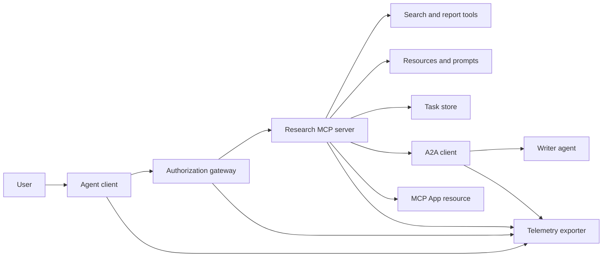
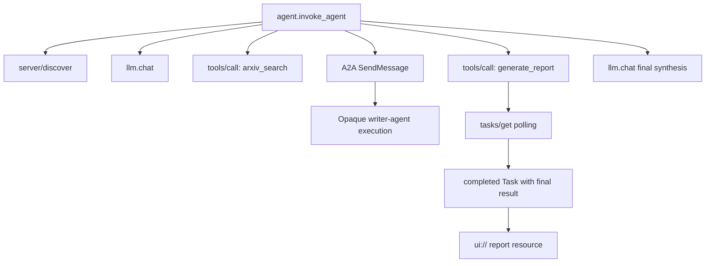
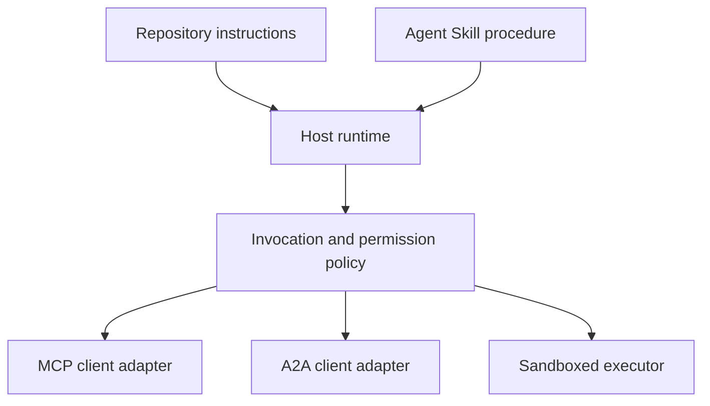

# Capstone: Écosystème d'outils sans État

> Un système d'agent de production est un ensemble de limites, pas une pile de caractéristiques. Cette pierre angulaire sépare une simulation lisible en cours de processus des clients de protocole, serveur d'autorisation, sandbox et exportateur de télémétrie dont un déploiement réel a encore besoin.

**Type:** Build
**Languages:** Python (stdlib, in-process simulation)
**Prerequisites:** Phase 13 · 01 through 22, using MCP revision `2026-07-28`
**Time:** ~120 minutes

## Objectifs d'apprentissage

- Composer des appels à l'outil, des résultats en forme de tâche, des travaux délégués, des ressources UI, des politiques d'autorisation et des enregistrements de suivi en un seul flux.
- Portez la version du protocole, l'identité du client et les capacités sur chaque demande de MCP au lieu de compter sur une session de connexion.
- Découvrez un serveur avant utilisation et effectuez des travaux longs à travers l'extension officielle Tasks.
- Distinguer une simulation en forme de protocole d'une mise en œuvre MCP, A2A, OAuth ou OpenTelemetry.
- Mettez chaque limite simulée sur la composante de production qui doit la remplacer.
- Je le garde .`AGENTS.md`, une compétence d'agent, des adaptateurs de temps d'exécution, des outils et des politiques de sécurité dans leurs rôles corrects.
- Expliquez quelles revendications peuvent être vérifiées à partir de la production locale et quelles nécessitent des tests d'intégration en direct.

## Le problème

Conception d'un système de recherche et de rapport. Un utilisateur demande des documents sur les protocoles d'agent. Le système recherche un catalogue papier, délègue la résumé, génère un rapport, renvoie une ressource UI et enregistre le chemin à travers le système.

Cette phrase cache plusieurs contrats indépendants:

- un schéma d'outil axé sur le modèle;
- une enveloppe de demande sans statut et un contrat de découverte du serveur;
- une décision de passerelle pour l'acteur, la portée et l'identité de l'outil;
- un contrat d'exploitation à long terme;
- un protocole de délégation;
- un pont entre l'hôte et l'application;
- la propagation et l'exportation de traces;
- une procédure opérationnelle réutilisable.

`code/main.py`Il ne permet pas d'ouvrir un transport, de contacter arXiv, d'effectuer OAuth, d'appeler un serveur A2A, de rendre une application MCP ou d'exporter la télémétrie. Cela facilite l'inspection du flux de contrôle sans présenter une simulation comme un service conforme.

## Le concept

### Architcture cible



L'architecture est une composition conceptuelle de modèles de protocoles publics.

### Trace de la cible



Dans une mise en œuvre réelle, chaque saut propage un contexte de traces. Les noms et attributs de la bande doivent suivre les conventions sémantiques OpenTelemetry prises en charge par la version d'instrumentation choisie.

### Surfaces de protocole courantes

Utilisez les noms de méthode définis par le protocole actuel, et non les noms retenus dans un projet plus ancien:

| Boundary | Current surface | What the capstone simulates |
|---|---|---|
| MCP discovery | Mandatory `server/discover` | A direct function returning versions, capabilities, and server identity |
| MCP request context | Version, capabilities, and client identity in every `params._meta` | Fresh request metadata passed to every simulated call |
| MCP tool call | `tools/call` | Direct Python function dispatch |
| MCP task polling | `io.modelcontextprotocol/tasks` with `tasks/get` | A working handle followed by a completed task carrying its final result |
| A2A delegation | `SendMessage` in gRPC and JSON-RPC; `POST /message:send` in HTTP+JSON | One nested span with no remote call or artificial delay |
| MCP App calling a server tool | `app.callServerTool({ name, arguments })` | An HTML string with no live bridge |
| OAuth authorization | Authorization server, protected-resource metadata, audience and scope validation | Static token lookup and scope membership |
| OpenTelemetry | SDK, propagator, exporter, and collector or backend | In-memory span dictionaries |

Les noms de protocoles ne sont que la première couche. Les tests de production doivent exécuter la sérialisation, les échecs d'authentification, l'annulation, les délais, les retries et la compatibilité des versions sur le fil réel.

### Le PCM apatrid change la limite d'intégration

Révision `2026-07-28`supprime les sessions de protocole et les`initialize`- Je suis là .`notifications/initialized`Il enlève aussi.`Mcp-Session-Id`Chaque demande porte ces espaces de noms .`_meta`champs:

```json
{
  "io.modelcontextprotocol/protocolVersion": "2026-07-28",
  "io.modelcontextprotocol/clientCapabilities": {
    "extensions": {
      "io.modelcontextprotocol/tasks": {}
    }
  },
  "io.modelcontextprotocol/clientInfo": {
    "name": "capstone-client",
    "version": "1.0.0"
  }
}
```

Le serveur doit mettre en œuvre `server/discover`. Utilisation des résultats ordinaires `resultType: "complete"`; utilise une manette de tâche `resultType: "task"`. Chaque résultat doit identifier le serveur dans `_meta.io.modelcontextprotocol/serverInfo`- Je suis désolé .

L' extension de tâche a`tasks/get`- Je suis là .`tasks/update`, et `tasks/cancel`Un outil peut revenir en premier .`resultType: "task"`- le président .`tasks/get`elle-même revient `resultType: "complete"`, et le complet `Task`Le résultat final est le résultat final.`tasks/result`et `tasks/list`Les méthodes ne font pas partie de l'extension actuelle.`io.modelcontextprotocol/tasks`Dans le même cas, le serveur retourne `-32021`avec `requiredCapabilities`en forme d'objet manquant de capacité de client, y compris `extensions.io.modelcontextprotocol/tasks`- Je suis désolé .

### Position de sécurité

Le déploiement prévu utilise la défense en profondeur:

- Autorisation d'autorisation d'autorisation avec PKCE lorsque le type de client l'exige;
- la liaison des ressources et du public pour les jetons d'accès émis;
- la passerelle RBAC qui vérifie l'outil et la portée demandés;
- les informations d'identification en amont détenues en dehors du contexte visible du modèle;
- un manifeste de description des outils fixé ou examiné;
- une révision de la règle de deux pour les entrées non fiables, les données sensibles et les actions qui en découlent;
- une boîte à sable d'exécution dont le système de fichiers, le processus, le réseau, les autorisations et les limites de ressources sont appliquées en dehors de la compétence.

La démo implémentera uniquement des jetons statiques, des contrôles de portée et des hashs de description.

### Les compétences sont des procédures, pas des transports

Un agent de compétences peut dire à l'exécution du flux de travail de recherche, quels outils contracter à attendre, quelles preuves enregistrer, et quand arrêter. Il ne peut pas faire un serveur MCP existent, établir la compatibilité A2A, accorder des champs de travail, ou créer une boîte à sable.



Envoyez le répertoire complet des compétences lorsque la procédure fait référence aux fichiers de compagnon. L'artefact plat dans cette ancienne pierre angulaire est un plan de cours, pas une preuve qu'un hôte conserve un paquet portable. Les leçons 24 à 27 construisent et testent le cycle de vie complet du paquet.

### Les métadonnées des objets de cours sont un adaptateur local

Le catalogue et l'installateur du cours reconnaissent les fichiers plats nommés `skill-*.md`Leur analyseur de frontmatter minimal ne lit que les clés de premier niveau. Cette leçon maintient donc les champs d'identité portables et les champs de catalogue de cours au même niveau:

```yaml
---
name: ecosystem-blueprint
description: Produce a full Phase 13 ecosystem architecture for a product need.
version: "1.0.0"
phase: "13"
lesson: "23"
tags: [mcp, capstone, ecosystem, architecture, a2a, otel]
---
```

`name`et `description`sont les champs d'identité portables. `version`- Je suis là .`phase`- Je suis là .`lesson`, et `tags`Les cours de l'analyseur nécessitent des extensions de catalogue spécifiques à la formation.`tags`comme une liste en ligne donc `--tag capstone`Je peux le faire.

Une compétence de répertoire portable peut utiliser l' option `metadata`carte pour les données d'extension à valeur de chaîne.`metadata`Si ce fichier plat n'est pas disponible, il est possible de le remplacer par un schéma de catalogue de ce référentiel.`version`ou `tags`ci-dessous `metadata`Le parseur minimal saute ces touches en tirage, le catalogue enregistre une version vide et le filtrage des balises ne peut pas trouver l'artefact.

### Simulation par rapport à la production

| Layer | `code/main.py` | Production replacement | Required evidence |
|---|---|---|---|
| Discovery | `server_discover()` plus static `TOOLS` | `server/discover` followed by cache-aware `tools/list` | Wire transcript, deterministic order, and schema validation |
| Authentication | Token-keyed dictionary | OAuth authorization and resource server validation | Issuer, audience, scope, expiry, and failure tests |
| Authorization | Scope membership | Gateway policy bound to actor, tool, target, and tenant | Allow and deny audit cases |
| Search | Static paper fixtures | Search API or MCP server | Source provenance, ranking, and error tests |
| Tasks | Local handle plus immediate `tasks/get` | Durable `io.modelcontextprotocol/tasks` store with `tasks/get`, `tasks/update`, `tasks/cancel`, and TTL | State-transition, input, cancellation, and recovery tests |
| Delegation | Sleep plus nested span | A2A client and remote Agent Card | Contract, timeout, retry, and opacity tests |
| App | HTML string and URI | MCP Apps resource and `App` bridge | CSP, permissions, tool-call, and browser tests |
| Telemetry | In-memory list | OTel SDK and exporter | Collector receipt and trace-parent assertions |
| Sandbox | None | Host-enforced isolated executor | Escape, egress, secret, and resource-limit tests |

Cette table est la limite de transmission.

### Carte de la phase 13

| Lessons | Contribution |
|---|---|
| 01-05 | Tool interfaces, calls, schemas, structured results, and deterministic validation |
| 06-14 | Stateless MCP request envelopes, discovery, transports, resources, prompts, extensions, and Apps |
| 15-18 | Poisoning defenses, OAuth, gateways, registries, and production authentication |
| 19 | A2A message and task delegation |
| 20 | OpenTelemetry GenAI trace design |
| 21 | Model-provider routing |
| 22 | Portable skill contract and runtime boundary |

```figure
t3-capstone-chain
```

## Faites-le

Remplissez le harnais en cours de traitement:

```bash
cd phases/13-tools-and-protocols/23-capstone-tool-ecosystem
python3 code/main.py
```

Il faut examiner cinq choses:

1. `server/discover`annonce révision `2026-07-28`et l'extension des tâches.
2. Alice peut lire et générer un rapport, tandis que l'appel écrit de Bob est refusé.
3. Chaque intervalle local dans une course d'orchestre partage un identifiant de trace et enregistre les identifiants de parent span.
4. Le rapport commence par une tâche. `tasks/get`renvoie une tâche accomplie dont le résultat final contient du texte et une `ui://`de référence.
5. L'écrivain délégué reste opaque parce que l'orchestre enregistre seulement la portée limite.
6. Aucune sortie ne prévoit une connexion réseau, un échange d'AOuth, une exportation de collecteur, un rendu du navigateur ou une exécution de sandbox.

Le script est exécuté deux fois, ce qui produit deux traces racinaires.

## Utilisez-le

Promouvoir une couche à la fois:

1. Remplacez`server_discover()`et la liste d' outils statiques avec réel `server/discover`et `tools/list`Envoyez la version, l'identité et les capacités dans chaque demande.
2. Remplacez les jetons statiques par un serveur d'autorisation et une validation de ressource protégée.
3. La mise en œuvre de la`io.modelcontextprotocol/tasks`extension et test `tasks/get`- Je suis là .`tasks/update`- Je suis là .`tasks/cancel`, une pause, un TTL et un redémarrage de la récupération.`tasks/result`ou `tasks/list`- Je suis désolé .
4. Remplacez le bloc de délégation par un client A2A qui résout une carte d'agent et envoie un message.
5. Construisez l' App avec le SDK officiel et appelez les outils serveur via `app.callServerTool`- Je suis désolé .
6. Exporter des échantillons à un collecteur d'essai et affirmer la parentalité au destinataire.
7. Exécutez l'outil et l'exécution du script à l'intérieur du contrat de la boîte à sable de la leçon 26.
8. Emballez la procédure en tant que paquet complet d'annuaires et passez la passerelle de sortie de la leçon 27.

Chaque promotion a besoin d'un test d'intégration qui franchit la nouvelle frontière.

## La faire partir

Cette leçon produit `outputs/skill-ecosystem-blueprint.md`Il demande une architecture d'une page couvrant les primitifs, la sécurité, la délégation, la télémétrie, l'emballage et les risques opérationnels les plus difficiles.

Parce qu'il ne s'agit pas d'un paquet de répertoires, il ne peut pas contenir de références, de scripts, d'actifs ou de fixations d'évaluation.

## Exercices

1. On court .`code/main.py`- Facts séparés prouvés par la production des revendications de production qui ont encore besoin de preuves d'intégration.
2. Ajoutez un second backend statique et définissez la règle de collision pour deux outils portant le même nom.`tools/list`Il appelle.
3. Remplacez le texte de l'écrivain par un serveur de test A2A. Enregistrez la carte de l'agent, la demande de message, le chemin de temps d'arrêt et l'artefact retourné.
4. Ajouter un stock de tâches qui survit à une redémarrage du processus. Prouver qu'un client peut reprendre avec `tasks/get`, le respect .`pollIntervalMs`, et lire le résultat final de la tâche accomplie sans `tasks/result`- Je suis désolé .
5. Construisez une application MCP minimale et vérifiez `app.callServerTool`dans un navigateur avec un CSP restrictif et des autorisations explicites.
6. Exporter les délais simulés à travers un SDK OTel vers un collecteur local. Afficher le reçu, les identifiants de traces, la parentalité et l'état d'erreur.
7. Écrivez`AGENTS.md`pour les règles de maintenance de l'ensemble du référentiel et un ensemble de compétences distinct pour la procédure de recherche réutilisable.

## Les termes clés

| Term | What people say | What it actually means |
|---|---|---|
| Capstone | "Everything wired together" | A staged integration whose simulated and live boundaries remain explicit |
| Protocol-shaped simulation | "It is basically MCP" | Local data and calls that resemble a protocol without implementing its wire contract |
| Tasks extension | "Long tool call" | An optional `io.modelcontextprotocol/tasks` lifecycle with durable identity, polling, client input, final result, and cancellation semantics |
| Opacity boundary | "The other agent handles it" | The caller sees the declared interface and artifacts, not private reasoning or internal state |
| Runtime adapter | "Skill integration" | Host code that maps portable procedure to discovery, invocation, tools, policy, and context |
| Integration evidence | "It passed" | A transcript, artifact, or receiver-side observation proving the real boundary was crossed |

## Pour en savoir plus

- [MCP specification 2026-07-28](https://modelcontextprotocol.io/specification/2026-07-28)pour les demandes, la découverte, les outils, l'autorisation et le comportement de transport.
- [MCP 2026-07-28 key changes](https://modelcontextprotocol.io/specification/2026-07-28/changelog)pour la suppression de session, les métadonnées par demande, le MRTR, les extensions et les dépréciations.
- [MCP Tasks extension](https://tasks.extensions.modelcontextprotocol.io/specification/draft/tasks)pour `tasks/get`- Je suis là .`tasks/update`- Je suis là .`tasks/cancel`, et les résultats finaux des tâches finales.
- [MCP Apps SDK](https://github.com/modelcontextprotocol/ext-apps/blob/main/docs/overview.md)pour `App`et `app.callServerTool`- Je suis désolé .
- [A2A protocol](https://a2a-protocol.org/latest/)pour les cartes d'agent, la livraison de messages, les tâches, les objets et les liaisons de transport.
- [OpenTelemetry GenAI semantic conventions](https://opentelemetry.io/docs/specs/semconv/gen-ai/)pour les conventions sur les traces et les attributs.
- [Agent Skills specification](https://agentskills.io/specification)pour le contrat de colis portable utilisé par la couche procédurale.
