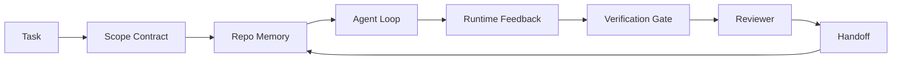

# Ingénierie de bureau d'agent: pourquoi les modèles capables échouent toujours

> Un modèle capable ne suffit pas. Les agents fiables ont besoin d'un tableau de travail: instructions, état, portée, rétroaction, vérification, examen et remise en main.

**Type:** Learn + Build
**Languages:** Python (stdlib)
**Prerequisites:** Phase 14 · 01 (Agent Loop), Phase 14 · 26 (Failure Modes)
**Time:** ~45 minutes

## Objectifs d'apprentissage

- Capacité de modèle séparée de la fiabilité de l'exécution.
- Nommez les sept surfaces de bureau qui décident si un agent expédie.
- Comparez une course en temps réel à une course guidée par un bureau de travail sur une petite tâche de repo.
- Produire un rapport de mode d'échec qui trace chaque surface manquée au symptôme qu'elle a causé.

## Le problème

Vous laissez tomber un modèle frontalier dans un référentiel réel et demandez-lui d'ajouter une validation d'entrée. Il ouvre quatre fichiers, écrit un code plausible, déclare le succès et s'arrête. Vous exécutez les tests. Deux échouent. Un troisième fichier est touché qui n'a rien à voir avec la validation. Il n'y a pas de dossier de ce que l'agent a supposé, ce qu'il a essayé en premier, ou ce qu'il reste à faire.

Le modèle n'avait pas tort à propos de Python, il avait tort à propos du travail, il n'avait aucune idée de ce qui comptait comme fait, où il était autorisé à écrire, quels tests étaient autorisés, ou comment la prochaine session devait se dérouler.

Ce n'est pas un modèle, c'est un bureau, la surface autour de l'agent manque des pièces qui transforment une génération à un seul coup en ingénierie fiable et réutilisable.

## Le concept

Un bureau de travail est l'environnement de fonctionnement qui enveloppe le modèle pendant une tâche.

| Surface | What it carries | Failure when missing |
|---------|-----------------|----------------------|
| Instructions | Startup rules, forbidden actions, definition of done | Agent guesses what shipping means |
| State | Current task, touched files, blockers, next action | Each session restarts from zero |
| Scope | Allowed files, forbidden files, acceptance criteria | Edits leak into unrelated code |
| Feedback | Real command output captured into the loop | Agent declares success on a 400 |
| Verification | Tests, lint, smoke run, scope check | "Looks good" reaches main |
| Review | A second pass with a different role | Builder marks own homework |
| Handoff | What changed, why, what is left | Next session re-discovers everything |

Le tableau de travail est indépendant du modèle. Vous pouvez échanger le modèle et garder les surfaces. Vous ne pouvez pas échanger les surfaces et garder la fiabilité.



La boucle se ferme sur le fichier d'état, pas sur l'historique du chat. Le chat est volatil.

### Tableau de travail contre l'ingénierie rapide

Le prompte indique au modèle ce que vous voulez à ce tour. Un bureau de travail indique au modèle comment faire le travail à travers les tours et à travers les sessions. La plupart des cas d'échec des agents sont des défaillances du bureau portant des vêtements de prompte-ingénierie.

### Tableau de travail par rapport au cadre

Un framework vous donne un temps d'exécution (LangGraph, AutoGen, Agents SDK). Un bureau de travail donne à l'agent un endroit pour travailler à l'intérieur de ce temps d'exécution. Vous avez besoin des deux. Cette mini-track est à peu près la seconde.

### Réflexion à partir de primitifs, pas de taxonomies de fournisseurs

Il y a beaucoup à écrire sur "l'ingénierie des harnais" en ce moment. Addy Osmani, OpenAI, Anthropic, LangChain, Martin Fowler, MongoDB, HumanLayer, Code d'augmentation, Thoughtworks, la liste des laboratoires de marche incroyable, et un rythme constant de la batterie de médium et Hacker News pièces sont tous en train de le porter. Ils ne sont pas d'accord sur la limite de ce qu'est un harnais, de ce qu'il est dans la portée et du vocabulaire à utiliser. Nous n'avons pas besoin de choisir un parti. Les sept surfaces sont une couche UX; sous chaque bureau de travail se trouve le même ensemble de systèmes distribués primitifs qui tiennent un backend fiable.

Une course à l'agent est un calcul qui traverse le temps, les processus et les machines. Pour rendre cela fiable, vous avez besoin des mêmes primitives que tout système de production.

| Primitive | What it is | What it carries for an agent |
|-----------|------------|------------------------------|
| Function | Typed handler. Pure where possible. Owns its inputs and outputs. | A tool call, a rule check, a verification step, a model invocation |
| Worker | Long-lived process that owns one or more functions and a lifecycle | The builder, the reviewer, the verifier, an MCP server |
| Trigger | Event source that invokes a function | Agent loop tick, HTTP request, queue message, cron, file change, hook |
| Runtime | The boundary that decides what runs where, with what timeouts and resources | Claude Code's process, LangGraph's runtime, a worker container |
| HTTP / RPC | The wire between caller and worker | Tool-call protocol, MCP request, model API |
| Queue | Durable buffer between trigger and worker; back-pressure, retry, idempotency | The task board, the feedback log, the review inbox |
| Session persistence | State that survives crashes, restarts, model swaps | `agent_state.json`, checkpoints, KV stores, the repo itself |
| Authorization policy | Who can call what function with which scope | Allowed/forbidden files, approval boundaries, MCP capability lists |

Maintenant, cartographier les sept surfaces de bureau sur ces primitifs.

- **Instructions** les métadonnées de politique + fonction.`AGENTS.md`) est une politique attachée au démarrage de la période d'exécution.
- **State** Persistance de session. Un stockage à clé lit le temps d'exécution à chaque étape. Fichier, KV ou DB; la sémantique de persistance importe, le backend de stockage ne le fait pas.
- **Scope** politique d'autorisation par tâche. Les globes autorisés/interdits sont un ACL. Les approbations requises sont un réseau d'autorisation.
- **Feedback**Chaque appel est un enregistrement, durable, jouable.
- **Verification** une fonction. déterministe sur les entrées. déclenchée lors de la clôture de la tâche. Échec fermé.
- **Review** un travailleur séparé ayant autorité de lecture uniquement sur les objets de construction et autorité de rédaction uniquement sur les rapports d'examen.
- **Handoff** un enregistrement durable émis par un déclencheur de fin de session.

La boucle d'agent elle-même est un travailleur qui consomme des événements (message utilisateur, résultat outil, timing), appelle des fonctions (le modèle, puis les outils que le modèle choisit), écrit des enregistrements (état, rétroaction) et émet des déclencheurs (vérification, révision, remise en main).

### Des motifs en circulation, traduits en primitifs

Chaque modèle de harnais populaire se réduit à huit primitifs.

| Vendor or community pattern | What it actually is |
|------------------------------|--------------------|
| Ralph Loop (Claude Code, Codex, agentic_harness book) — re-inject original intent into a fresh context window when the agent tries to stop early | A trigger that re-enqueues a task with a clean context; session persistence carries the goal forward |
| Plan / Execute / Verify (PEV) | Three workers, one per role, communicating via state and a queue between phases |
| Harness-compute separation (OpenAI Agents SDK, April 2026) — split control plane from execution plane | Restating control-plane / data-plane. Predates the agent label by decades |
| Open Agent Passport (OAP, March 2026) — sign and audit every tool call against a declarative policy before execution | An authorization policy enforced by a pre-action worker, with a signed audit queue |
| Guides and Sensors (Birgitta Böckeler / Thoughtworks) — feedforward rules + feedback observability | Authorization policy + verification functions + observability traces |
| Progressive compaction, 5-stage (Claude Code reverse engineering, April 2026) | A state-management worker that runs cron-like over session persistence to keep it within a budget |
| Hooks / middleware (LangChain, Claude Code) — intercept model and tool calls | Triggers + functions wrapped around the runtime's invocation path |
| Skills as Markdown with progressive disclosure (Anthropic, Flue) | A function registry where the function metadata is loaded into context just-in-time |
| Sandbox agents (Codex, Sandcastle, Vercel Sandbox) | The compute plane: a runtime with isolated filesystem, network, and lifecycle |
| MCP servers | Workers exposing functions over a stable RPC, with capability lists as authorization |

Chaque entrée dans ce tableau est la communauté d'agents qui arrive à un primitif qui avait déjà un nom dans les systèmes distribués et lui donne un nouveau. Étiquettes utiles pour le marketing; pas utile comme vocabulaire d'ingénierie.

### Ce que disent les reçus

La revendication de l'utilisation de ce modèle est maintenant très répandue, car c'est le seul argument honnête contre "attendre un modèle plus intelligent".

- Terminal Bench 2.0  même modèle, changement de harnais a déplacé un agent de codage de l'extérieur des 30 premiers à la cinquième place (LangChain, * Anatomy of an Agent Harness*).
- Vercel  a supprimé 80% des outils de son agent; le taux de réussite est passé de 80% à 100% (MongoDB).
- Harvey  les agents juridiques ont plus que doublé la précision grâce à l'optimisation de l'harnais seul (MongoDB).
- 88% des projets d'agents d'IA d'entreprise ne parviennent pas à la production. Les défaillances se regroupent autour du temps d'exécution, et non du raisonnement (preprints.org, *Harness Engineering for Language Agents*, mars 2026).
- Une étude de référence de 2025 sur trois cadres open source populaires a rapporté ~50% de fin de tâche; WebAgent de long contexte s'est effondré de 40 à 50% à moins de 10% dans les conditions de long contexte, principalement à partir de boucles infinies et de perte de but (couvert largement au début des rédactions de 2026).

Le résultat n'est pas " le harnais gagne pour toujours. " Les modèles absorbent les astuces du harnais au fil du temps. Le résultat est que aujourd'hui, l'ingénierie porteuse est autour du modèle, pas à l'intérieur, et les primitifs qui transportent cette charge sont ceux dont chaque système de production a toujours eu besoin.

### Où les écrivains de fournisseurs s'arrêtent à court terme

C'est là que tu n'as pas besoin d'être poli.

- LangChain * Anatomy of an Agent Harness* énumère onze composants  des instructions, des outils, des crochets, des boîtes à sable, de l'orchestration, de la mémoire, des compétences, des sous-composants et une " boucle stupide " de temps d'exécution.
- L'ingénierie de l'agent de harnais d'Addy Osmani a fait tomber le cadre.`Agent = Model + Harness`et le modèle de la ciseau, mais ne dit pas de quoi est construit un harnais.
- Anthropic et OpenAI vont plus profondément sur les surfaces mais restent à l'intérieur de leurs propres temps d'exécution. L'annonce de "séparation de harnais-computation" dans le SDK d'Avril 2026 Agents est la première pièce de fournisseur qui approuve explicitement la séparation contrôle-plan / données-plan. C'est une idée primitive, pas une nouvelle.
- Le livre agent_harness traite le harnais comme un objet de configuration (Jaymin West's *Agentic Engineering*, chapitre 6) et la ligne la plus forte est "le harnais est la principale limite de sécurité dans un système agent".
- Les fils de Hacker News continuent d'arriver au même endroit. Le fil d'avril 2026 *Le harnais d'agent appartient à l'extérieur de la boîte à sable* soutient que le harnais devrait être "plus comme un hyperviseur qui se trouve à l'extérieur de tout et autorise l'accès en fonction du contexte et de l'utilisateur".

Vous n'avez pas besoin de ne pas être d'accord avec l'une de ces pièces pour remarquer le vide. Ils écrivent des descriptions UX d'un système qui existe déjà. Nous écrivons le système. Lorsque le système est construit correctement, les sept surfaces tombent des primitives. Quand il est construit mal, aucune quantité de`AGENTS.md`polish répare la file d'attente manquante.

Donc quand vous entendez "ingénierie de harnais" ailleurs, traduisez à des primitifs. Les instructions et les règles sont des politiques et des fonctions. Le plancher est le temps de course. Les barreaux sont l'autorisation + la vérification. Les crochets sont des déclencheurs. La mémoire est la persistance des séances. Le Ralph Loop est en attente. Les subagents sont des ouvriers. Les boîtes à sable sont des avions de calcul. Le vocabulaire change, mais pas l'ingénierie. Le tableau de travail est l'UX face à l'agent; le harnais, dans le sens qui survit au prochain reframe fournisseur, est des fonctions, des travailleurs, des déclencheurs, des temps d'exécution, des files d'attente, de la persistance et des politiques câblées correctement.

```figure
wb-seven-surfaces
```

## Faites-le

`code/main.py`Le script compte les surfaces manquantes lors de l'exécution ratée et imprime un rapport de mode de défaillance.

La tâche de repo est petite à propos: ajouter la validation de l'entrée à un gestionnaire de format FastAPI à un fichier et écrire un test de réussite.

- Je vais le faire.

```
python3 code/main.py
```

Résultats: un journal côte à côte des deux courses, un `failure_modes.json`résumant la course rapide et un verdict à une seule ligne pour la course de travail.

L'agent est un petit bâton basé sur des règles; le point est les surfaces, pas le modèle.

## Utilisez-le

Trois surfaces de bureau de travail existent déjà dans la nature, même si personne ne les appelle comme ça:

- **Claude Code, Codex, Cursor.** `AGENTS.md`et `CLAUDE.md`Les commandes de la ligne de démarrage sont la surface des instructions, les commandes de la ligne de démarrage sont la portée, les crochets sont la vérification.
- **LangGraph, OpenAI Agents SDK.**Les points de contrôle et les magasins de séances sont la surface de l'État.
- **CI on a real repo.**Les tests, les liens et la vérification du type sont la vérification. Le modèle de relations publiques est remis.

L'ingénierie de workbench est la discipline de rendre ces surfaces explicites et réutilisables, au lieu de laisser chaque équipe les redécouvrir.

## La faire partir

`outputs/skill-workbench-audit.md`est une compétence portable qui vérifie un référentiel existant pour les sept surfaces de bureau et les rapports qui manquent, qui sont partiels, et qui sont sains.

## Exercices

1. Choisissez un repo où vous avez déjà un agent. Marquez les sept surfaces de 0 (disparu) à 2 (saine). Quelle est votre surface la plus faible?
2. Extension `main.py`Donc la course rapide produit aussi une fausse affirmation de "succès".
3. Ajoutez une huitième surface à votre produit, justifiez pourquoi il ne s'effondre pas dans l'une des sept.
4. Refaire le script avec un autre agent qui hallucine une écriture de fichier supplémentaire.
5. Mettez les cinq modes de défaillance récurrents de l'industrie de la phase 14 · 26 sur les sept surfaces.

## Les termes clés

| Term | What people say | What it actually means |
|------|----------------|------------------------|
| Workbench | "The setup" | Engineered surfaces around the model that make work reliable |
| Surface | "A doc" or "a script" | A named, machine-readable input the agent reads or writes every turn |
| System of record | "The notes" | The file the agent treats as truth when chat history is gone |
| Definition of done | "Acceptance" | An objective, file-backed checklist the agent cannot fake |
| Workbench audit | "Repo readiness check" | A pass over the seven surfaces that flags missing pieces before work begins |

## Pour en savoir plus

Les concepts sont tous des éléments de la taxonomie partielle, et doivent être traduits en un concept primitif (fonction, travailleur, déclencheur, temps d'exécution, HTTP/RPC, file d'attente, persistance, politique) avant de décider de l'adopter.

Les cadres du fournisseur:

- [Addy Osmani, Agent Harness Engineering](https://addyosmani.com/blog/agent-harness-engineering/) `Agent = Model + Harness`et le motif de la cage; mince sur l'infrastructure
- [LangChain, The Anatomy of an Agent Harness](https://blog.langchain.com/the-anatomy-of-an-agent-harness/) onze composants: les instructions, les outils, les crochets, l'orchestration, les sablettes, la mémoire, les compétences, les sous-gents, le temps d'exécution; omet les files d'attente, le déploiement, l'authz
- [OpenAI, Harness engineering: leveraging Codex in an agent-first world](https://openai.com/index/harness-engineering/) La vue de l'équipe Codex sur les surfaces autour de leur temps d'exécution
- [OpenAI, Unrolling the Codex agent loop](https://openai.com/index/unrolling-the-codex-agent-loop/) la boucle d'agent réduite à un `while`sur les appels à fonction
- [Anthropic, Effective harnesses for long-running agents](https://www.anthropic.com/engineering/effective-harnesses-for-long-running-agents) surfaces à long horizon dans un temps de fonctionnement spécifique
- [Anthropic, Harness design for long-running application development](https://www.anthropic.com/engineering/harness-design-long-running-apps) notes de conception appliquées
- [LangChain Deep Agents harness capabilities](https://docs.langchain.com/oss/python/deepagents/harness) Surface de configuration de l'heure d'exécution

Pièces de praticiens avec détails utilisables:

- [Martin Fowler / Birgitta Böckeler, Harness engineering for coding agent users](https://martinfowler.com/articles/harness-engineering.html) guides (feedforward) + capteurs (feedback); le cadre de la théorie de contrôle le plus propre
- [HumanLayer, Skill Issue: Harness Engineering for Coding Agents](https://www.humanlayer.dev/blog/skill-issue-harness-engineering-for-coding-agents) "ce n'est pas un problème de modèle, c'est un problème de configuration"
- [MongoDB, The Agent Harness: Why the LLM Is the Smallest Part of Your Agent System](https://www.mongodb.com/company/blog/technical/agent-harness-why-llm-is-smallest-part-of-your-agent-system) reçus: Vercel 80% à 100%, Harvey 2x précision, Terminal Bench Top 30 à Top 5
- [Augment Code, Harness Engineering for AI Coding Agents](https://www.augmentcode.com/guides/harness-engineering-ai-coding-agents) La première traversée de la contrainte
- [Sequoia podcast, Harrison Chase on Context Engineering Long-Horizon Agents](https://sequoiacap.com/podcast/context-engineering-our-way-to-long-horizon-agents-langchains-harrison-chase/) préoccupations concernant le temps de fonctionnement par rapport aux préoccupations relatives au modèle

Livres, documents et mises en œuvre de référence:

- [Jaymin West, Agentic Engineering — Chapter 6: Harnesses](https://www.jayminwest.com/agentic-engineering-book/6-harnesses) traitement de la longueur du livre, traite l'arsenal comme la limite de sécurité principale
- [preprints.org, Harness Engineering for Language Agents (March 2026)](https://www.preprints.org/manuscript/202603.1756) Cadrage académique en tant que contrôle / agence / temps de fonctionnement
- [walkinglabs/awesome-harness-engineering](https://github.com/walkinglabs/awesome-harness-engineering) Liste de lecture organisée en fonction du contexte, de l'évaluation, de l'observabilité, de l'orchestration
- [ai-boost/awesome-harness-engineering](https://github.com/ai-boost/awesome-harness-engineering) liste de sélection alternative (outils, évaluations, mémoire, MCP, autorisations)
- [andrewgarst/agentic_harness](https://github.com/andrewgarst/agentic_harness) Implémentation de référence prête à la production avec la mémoire et la suite d'évaluation prises en charge par Redis
- [HKUDS/OpenHarness](https://github.com/HKUDS/OpenHarness) harnais d'agent ouvert avec agent personnel intégré

Les thèmes de Hacker News valent la peine d'être lus pour les désaccords, pas pour le consensus:

- [HN: Effective harnesses for long-running agents](https://news.ycombinator.com/item?id=46081704)
- [HN: Improving 15 LLMs at Coding in One Afternoon. Only the Harness Changed](https://news.ycombinator.com/item?id=46988596)
- [HN: The agent harness belongs outside the sandbox](https://news.ycombinator.com/item?id=47990675) plaide pour l'autorisation en tant qu'avion séparé

Les références croisées dans ce programme:

- Phase 14 · 23  Conventions OpenTelemetry GenAI: la couche d'observabilité que la littérature des capteurs pointe vers
- Phase 14 · 26  Catalogue des modes d'échec les sept surfaces sont conçues pour absorber
- Phase 14 · 27  Défense à injection rapide qui se situe à la base de la politique d'autorisation
- Phase 14 · 29  Temps d'exécution de la production (file, événement, cron): où les primitifs de cette leçon vivent en déploiement
