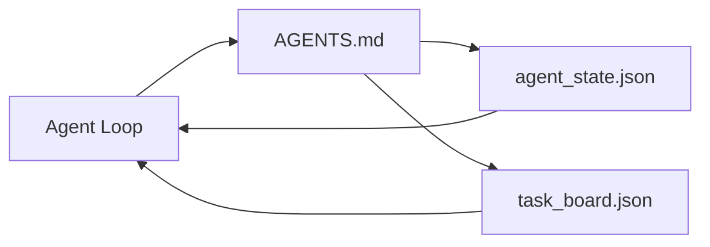

# Le bureau de travail de l'agent minimal

> Le plus petit tableau de travail utile est composé de trois fichiers: un routeur d'instructions racine, un fichier d'état et un tableau de tâches. Tout le reste est en couches en haut. Si un repo ne peut pas transporter ces trois, aucun modèle ne le sauvegarde.

**Type:** Build
**Languages:** Python (stdlib)
**Prerequisites:** Phase 14 · 31 (Why Capable Models Still Fail)
**Time:** ~45 minutes

## Objectifs d'apprentissage

- Définir les trois fichiers qui constituent le tableau de travail minimum viable.
- Expliquez pourquoi un routeur à racine courte bat un long monolithique `AGENTS.md`- Je suis désolé .
- Construisez un dossier d'état que l'agent peut lire à chaque tour et écrire à la fin.
- Construisez un tableau de tâches qui survit au travail en plusieurs sessions sans historique de chat.

## Le problème

La plupart des équipes atteignent un bureau en écrivant une ligne de 3000`AGENTS.md`Le modèle le charge, ignore les parties qu'il ne peut résumer, et échoue toujours sur les mêmes surfaces sur lesquelles il a toujours échoué.

Vous avez besoin de l'inverse. Un petit fichier racine qui enroule l'agent dans des fichiers plus profonds seulement lorsque cela est pertinent. L'état durable l'agent lit avant d'agir et écrit après. Un tableau de travail qui dit ce qui est en vol, ce qui est bloqué, et ce qui est en haut.

Trois fichiers, chacun avec un travail, assez lisible pour évoluer en un système réel plus tard.

## Le concept



### AGENTS.md est un routeur, pas un manuel

Une bonne .`AGENTS.md`Il indique l'agent à:

- Le dossier de l'État (où vous êtes).
- Le tableau de tâches (ce qui reste).
- Les règles plus approfondies (en)`docs/agent-rules.md`)
- La commande de vérification (comment savoir si elle fonctionne).

Tout ce qui est plus long est dans des documents plus profonds, chargé seulement quand il est nécessaire, les manuels longs sont ignorés, les routeurs courts sont suivis.

### agent_state.json est le système de dossiers

L'agent le lit à chaque tour, la session suivante le lit au lieu de reproduire le chat.

L'État vit dans un dossier parce que l'historique de chat est peu fiable, les sessions meurent, les conversations sont coupées, le dossier ne le fait pas.

### task_board.json est la file d'attente

Le comité de tâches effectue chaque tâche avec statut `todo | in_progress | done | blocked`C'est la queue que l'agent tire quand l'état est vide, et la que vous lisez quand vous voulez savoir si l'agent est sur la bonne voie.

Une tâche sur le tableau a un identifiant, un objectif, un propriétaire (`builder`- Je suis là .`reviewer`ou `human`La carte est délibérément petite: lorsqu'elle dépasse un écran, vous avez un problème de planification, pas un problème de carte.

### Trois dossiers est le sol, pas le plafond

Les leçons ultérieures ajoutent des contrats de portée, des coureurs de rétroaction, des portes de vérification, des listes de contrôle des réviseurs et des paquets de remise.

```figure
wb-three-files
```

## Faites-le

`code/main.py`écrit le tableau de bord minimal dans un repo vide et démontre qu'un seul agent tourne:

1. Il est en train de lire .`agent_state.json`- Je suis désolé .
2. Il tire la prochaine tâche de `task_board.json`Si l'état est vide.
3. Touche un seul fichier à l'intérieur du champ de vision.
4. Il écrit à l'état actualisé.

- Je vais le faire.

```
python3 code/main.py
```

Le scénario crée`workdir/`Il met les trois fichiers à côté de lui, fait un tour et imprime le diff.

## Utilisez-le

Dans les produits des agents de production, les mêmes trois fichiers apparaissent sous des noms différents:

- **Claude Code:** `AGENTS.md`ou `CLAUDE.md`pour le routeur, `.claude/state.json`- des magasins de style pour l'État, des crochets pour le conseil.
- **Codex / Cursor:**règles de l'espace de travail pour le routeur, mémoire de session pour l'état, tâches en file d'attente dans la barre latérale de chat pour le tableau.
- **Custom Python agent:**Les mêmes dossiers que vous venez d'écrire.

Les noms changent, mais pas la forme.

## Modèles de production dans la nature

Le tableau de travail minimum survit au contact avec des monorepos réels lorsque trois modèles sont couchés dessus.

**Nested `AGENTS.md` with nearest-wins precedence.**Les navires OpenAI 88 `AGENTS.md`Les fichiers de référencement sont tous en cours de marche depuis le fichier de travail vers la racine du référencement et se concatenent chaque fois.`AGENTS.md`Les fichiers de sous-répertoire étendent le fichier racine.`AGENTS.override.md`Le mécanisme d'annulation est spécifique au codex et l'éviter pour les travaux croisés.`AGENTS.md`Les fichiers donnent un saut de qualité équivalent à la mise à niveau de Haiku à Opus; les pires font que la sortie est pire que aucun fichier.

**Anti-patterns to refuse, even when they look like coverage.**Les instructions contradictoires font passer le médicament du mode interactif au mode avide (ICLR 2026 AMBIG-SWE: taux de résolution de 48,8% → 28%); numérotation des priorités au lieu de les empiler. Règles de style non vérifiables (" suivez le guide de style de Python de Google ") sans commande d'exécution permettent à l'agent d'inventer la conformité; associer chaque règle de style avec la commande de lint exacte. Le leadership avec style au lieu de commandes enterre le chemin de vérification; commandes d'abord, style dernier. Écrire pour les humains au lieu d'agents gaspille le budget contextuel; la concision est une caractéristique.

**Cross-tool symlinks.**Un seul fichier racine avec des liens symboliques (`ln -s AGENTS.md CLAUDE.md`- Je suis là .`ln -s AGENTS.md .github/copilot-instructions.md`- Je suis là .`ln -s AGENTS.md .cursorrules`Il garde tous les agents de codage sur la même source de vérité.`nx ai-setup`automatique à travers Claude Code, Cursor, Copilot, Gemini, Codex et OpenCode à partir d'une seule configuration.

## La faire partir

`outputs/skill-minimal-workbench.md`génère le tableau de travail de trois fichiers pour tout nouveau repo: un `AGENTS.md`Le routeur est adapté au projet, un`agent_state.json`avec les bonnes clés, et un `task_board.json`Les résultats de l'enquête ont été obtenus en raison de la situation actuelle.

## Exercices

1. Ajouter un `last_run`Temps de la date de l' ouverture`agent_state.json`- Refuser d'exécuter si le fichier est supérieur à 24 heures, à moins que l'opérateur ne le confirme.
2. Ajouter un `priority`champ à la table de tâches et changer le tirage pour toujours choisir la priorité la plus élevée `todo`- Je suis désolé .
3. Migrés `task_board.json`à JSON Lines afin que chaque tâche soit une ligne et les différences sont propres dans le contrôle de version.
4. Écrivez une`lint_workbench.py`qui échoue si `AGENTS.md`est supérieur à 80 lignes ou renvoie à un fichier qui n'existe pas.
5. Décidez lequel des trois dossiers fera le plus de mal à perdre.

## Les termes clés

| Term | What people say | What it actually means |
|------|----------------|------------------------|
| Router | `AGENTS.md` | Short root file that points the agent at deeper docs and files |
| State file | "The notes" | Machine-readable record of where the agent is, written every turn |
| Task board | "The backlog" | JSON queue of work with status, owner, acceptance |
| System of record | "Source of truth" | The file the workbench treats as authoritative when chat is gone |

## Pour en savoir plus

- [agents.md — the open spec](https://agents.md/) adopté par Cursor, Codex, Code Claude, Copilot, Gemini, OpenCode
- [Augment Code, A good AGENTS.md is a model upgrade. A bad one is worse than no docs at all](https://www.augmentcode.com/blog/how-to-write-good-agents-dot-md-files) sauts de qualité mesurés
- [Blake Crosley, AGENTS.md Patterns: What Actually Changes Agent Behavior](https://blakecrosley.com/blog/agents-md-patterns) ce qui fonctionne empiriquement, ce qui ne fonctionne pas
- [Datadog Frontend, Steering AI Agents in Monorepos with AGENTS.md](https://dev.to/datadog-frontend-dev/steering-ai-agents-in-monorepos-with-agentsmd-13g0) priorité en pratique
- [Nx Blog, Teach Your AI Agent How to Work in a Monorepo](https://nx.dev/blog/nx-ai-agent-skills) génération à source unique sur six outils
- [The Prompt Shelf, AGENTS.md Best Practices: Structure, Scope, and Real Examples](https://thepromptshelf.dev/blog/agents-md-best-practices/) section ordonnant qui survit à l'examen
- [Anthropic, Claude Code subagents](https://code.claude.com/docs/en/sub-agents)
- Phase 14 · 31  les modes de défaillance que ce minimum absorbe
- Phase 14 · 34  le schéma d' état durable cette leçon prévisualise
