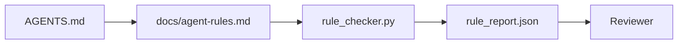

# Les instructions des agents comme contraintes exécutables

> Les instructions écrites en prose sont des souhaits. Les instructions écrites en contraintes sont des tests. Le tableau de travail transforme chaque règle en quelque chose qu'un agent peut vérifier à l'heure de l'exécution et un examinateur peut vérifier après le fait.

**Type:** Build
**Languages:** Python (stdlib)
**Prerequisites:** Phase 14 · 32 (Minimal Workbench)
**Time:** ~50 minutes

## Objectifs d'apprentissage

- Séparer la prose de routage des règles opérationnelles.
- Exprimez les règles de démarrage, les actions interdites, la définition de la finition, la gestion des incertitudes et les limites d'approbation comme contraintes vérifiables par la machine.
- Implémenter un contrôleur de règles qui marque une course contre le jeu de règles.
- Faites que la règle soit différente pour que l'examen puisse voir ce qui a changé.

## Le problème

Un type typique .`AGENTS.md`Il dit à l'agent de " faire attention " et " tester à fond " et " demander si vous n'êtes pas sûr. " Trois jours plus tard, l'agent envoie un changement sans tests, écrit à un répertoire interdit, et ne demande jamais parce qu'il ne savait jamais où était la ligne.

Les instructions sont puissantes lorsqu'elles sont opérationnelles et faibles lorsqu'elles sont aspiratives.

## Le concept

Les règles sont à l' égard de `docs/agent-rules.md`Chaque règle a un nom, une catégorie et un chèque.



### Cinq catégories couvrant la plupart des règles

| Category | Question the rule answers | Example |
|----------|---------------------------|---------|
| Startup | What must be true before work begins? | "state file exists and is fresh" |
| Forbidden | What must never happen? | "do not edit `scripts/release.sh`" |
| Definition of done | What proves the task is complete? | "pytest exits 0 and acceptance line passes" |
| Uncertainty | What does the agent do when unsure? | "open a question note instead of guessing" |
| Approval | What requires human approval? | "any new dependency, any prod write" |

Une règle qui ne correspond pas à l'une de ces cinq règles doit généralement être deux règles.

### Les règles sont lisibles par machine

Chaque règle a une balle, une catégorie, une description en une ligne et une `check`champ qui nomme une fonction dans `rule_checker.py`- Ajouter une règle signifie ajouter un chèque; le chèque grandit avec le bureau de travail.

### Les règles sont différentes

Les règles sont en direct une par titre dans un seul fichier de démarcation. Les renommes sont visibles dans les différences. Les nouvelles règles sont en haut de leur catégorie. Les règles anciennes sont supprimées, pas commentées, parce que le bureau de travail est la source de vérité, pas le journal de chat de la façon dont l'équipe s'est senti au dernier trimestre.

### Règles par rapport aux barreaux de cadre

Les barreaux de cadre (OpenAI Agents SDK barreaux, LangGraph interrompt) appliquent les règles au niveau du temps d'exécution. La règle établie dans cette leçon est le contrat lisible par l'homme, révisable que ces barreaux mettent en œuvre. Vous avez besoin des deux: le temps d'exécution capture les violations pendant un tour, la règle établie prouve que le temps d'exécution fait la bonne chose.

### Révélation progressive: une carte, pas une encyclopédie

La raison `AGENTS.md`Un an plus tard, le fichier est de deux mille lignes, et l'agent lit le premier écran, manque de budget d'attention, et agit sur une fraction de ce qui lui a été dit. Un fichier d'instructions géant échoue pour la même raison qu'un document d'intégration de quarante pages échoue: le lecteur le déchiffre une fois et ne revient jamais à la partie qui comptait.

Le fichier de correction n'est pas un fichier plus court. Il est un fichier en couches. Le routeur racine reste assez petit pour lire chaque session et ne contient que des pointeurs. La profondeur vit dans les fichiers de thème que l'agent charge uniquement lorsque la tâche les touche. Donnez à l'agent une carte, pas toute l'encyclopédie, et laissez-le marcher vers la page dont il a besoin.

```
AGENTS.md                  # router, < 50 lines: what this repo is, where to look, the 5 hard rules
docs/
  agent-rules.md           # the full rule set (this lesson)
  architecture.md          # loaded when the task touches module boundaries
  testing.md               # loaded when the task writes or runs tests
  deploy.md                # loaded only for release work, gated behind an approval rule
feature_list.json          # the backlog (Phase 14 · 36)
```

| Tier | Lives in | Read when | Size budget |
|------|----------|-----------|-------------|
| Router | `AGENTS.md` | Every session, always | Under ~50 lines |
| Rules | `docs/agent-rules.md` | Every session, on startup | One screen per category |
| Topic docs | `docs/<topic>.md` | Only when the task touches that topic | As deep as needed |

Deux tests permettent de garder la couche honnête. Le test de facilité d'accès: un agent doit atteindre une règle en deux sauts au plus du routeur, de sorte que le routeur doit relier chaque document de sujet par chemin, pas le décrire en prose. Le test de fraîcheur: le routeur est assez court pour qu'un critique le lise à nouveau sur chaque publicité, ce qui est la seule chose qui l'empêche de revenir silencieusement à l'encyclopédie qu'il a remplacée. Un pointeur qui ne se résout plus est un défaut pire qu'une règle manquante, donc un lien cassé dans le routeur est lui-même une violation de la vérification de démarrage.

```figure
wb-rule-checkoff
```

## Faites-le

`code/main.py`les navires:

- `agent-rules.md`parser qui charge les règles dans une classe de données.
- `rule_checker.py`fonction de vérificateur de style, un par `check`de référence.
- Un agent de démonstration qui enfreint deux règles et un chèque qui les attrape.

- Je vais le faire.

```
python3 code/main.py
```

Résultats: réglementation paralysée, trace d'exécution, pass/fail par règle, et un `rule_report.json`enregistré à côté du script.

## Modèles de production dans la nature

Trois modèles séparent un ensemble de règles qui dure un quart d'heure d'un ensemble qui se décompose en une semaine.

**Severity tagging at write time.**Chaque règle est conforme .`severity`Le numéro de la liste:`block`- Je suis là .`warn`ou `info`Le contrôleur rapporte les trois; le temps d' exécution ne refuse que de l' accélérer .`block`La plupart des équipes exagèrent la gravité précoce puis l'affaiblissent discrètement sous pression de délai; l'étiquetage à l'heure d'écriture force l'étalonnage à l'avant.`block`réglementation en une `overrides.jsonl`journal de vérification.

**Rule expiry as a forcing function.**Chaque règle est une règle .`expires_at`date (par défaut 90 jours après l'écriture). Le vérificateur émet un avertissement lorsqu'une règle inexpirée a été violée à zéro pour 60 jours consécutifs; le prochain examen trimestriel justifie soit de la conserver, soit de l'affaiblir à `info`Les données de production de Cloudflare AI Code Review (avril 2026, 131.246 critiques se déroulent sur 5.169 repos en 30 jours) ont montré que les ensembles de règles avec expiration explicite sont restés sous 30 règles par repos; les ensembles sans ont augmenté à 80 + avec la plupart jamais tiré.

**Markdown-as-source, JSON-as-cache.** `agent-rules.md`est le dossier de l'auteur; `agent-rules.lock.json`Le blocage est régénéré par un crochet pré-commit. les différences de marquage sont révisibles; le partage JSON reste à l'écart de chaque virage. La même forme que`package.json`- Je suis là .`package-lock.json`et `Cargo.toml`- Je suis là .`Cargo.lock`- Je suis désolé .

## Utilisez-le

En production:

- Claude Code, Codex, Cursor lisent les règles au début de la session et les citent lorsqu'ils refusent les actions.
- Les barreaux SDK OpenAI Agents enregistrent les mêmes contrôles que les barreaux d'entrée et de sortie.
- LangGraph interrompt le feu lorsqu'un nœud en vol viole une règle.

L'ensemble de règles est portable sur les trois parce qu'il est juste marquage plus les noms de fonctions.

## La faire partir

`outputs/skill-rule-set-builder.md`Il entrevoit un propriétaire de projet, classifie ses instructions en prose existantes en cinq catégories et émet une version `agent-rules.md`Plus un bouton de vérification.

## Exercices

1. Ajoutez une sixième catégorie si votre produit en a vraiment besoin.
2. Extension du contrôle de sorte qu'une règle puisse porter une gravité (`block`- Je suis là .`warn`- Je suis là .`info`) et le rapport est agrégé en conséquence.
3. Télécharger le contrôleur dans CI: échouer la construction si une règle de sévérité de bloc échoue lors de la dernière mise en œuvre de l'agent.
4. Ajouter un champ "expiration" par règle. Après 90 jours sans défaillance de vérification, la règle est à réviser.
5. Trouvez une vraie .`AGENTS.md`Combien de lignes étaient opérationnelles, combien étaient aspiratives?

## Les termes clés

| Term | What people say | What it actually means |
|------|----------------|------------------------|
| Operational rule | "A real instruction" | A rule the workbench can check at runtime |
| Aspirational rule | "Be careful" | A rule with no check; either delete or upgrade |
| Definition of done | "Acceptance" | An objective, file-backed proof the task is complete |
| Block severity | "Hard rule" | Violation halts the run; cannot be silenced without an operator |
| Rule expiry | "Stale rule sweep" | A rule with no fails in N days is up for retirement |

## Pour en savoir plus

- [OpenAI Agents SDK guardrails](https://openai.github.io/openai-agents-python/guardrails/)
- [LangGraph interrupts](https://langchain-ai.github.io/langgraph/how-tos/human_in_the_loop/breakpoints/)
- [Anthropic, Building Effective Agents](https://www.anthropic.com/research/building-effective-agents)
- [Rick Hightower, Agent RuleZ: A Deterministic Policy Engine](https://medium.com/@richardhightower/agent-rulez-a-deterministic-policy-engine-for-ai-coding-agents-9489e0561edf) sévérité du blocage/avertissement/information en production
- [Cloudflare, Orchestrating AI Code Review at Scale](https://blog.cloudflare.com/ai-code-review/) 131 000 examens, cours de composition des règles
- [microservices.io, GenAI development platform — part 1: guardrails](https://microservices.io/post/architecture/2026/03/09/genai-development-platform-part-1-development-guardrails.html) défense en profondeur entre les règles et les informations
- [Type-Checked Compliance: Deterministic Guardrails (arXiv 2604.01483)](https://arxiv.org/pdf/2604.01483) Leur inclinaison 4 est la limite supérieure de la règle de contrôle
- [logi-cmd/agent-guardrails](https://github.com/logi-cmd/agent-guardrails) mise en œuvre de la porte de fusion: champ d'application, test de mutation, budgets de violation
- La phase 14 · 32  le tableau de travail minimal de cet ensemble de règles tombe en
- Phase 14 · 38  la passerelle de vérification qui consomme le rapport de règle
- Phase 14 · 39  l'agent d'examen qui note la conformité aux règles
