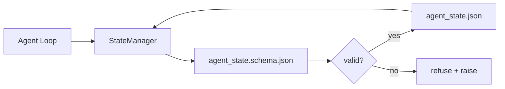

# La mémoire répo et l'état durable

> L'historique du chat est volatil, le repo est durable, l'agent du bureau de travail stocks l'état dans les fichiers versionnés, de sorte que la prochaine session, l'agent suivant et le réviseur suivant sont tous lus à partir de la même source de vérité.

**Type:** Build
**Languages:** Python (stdlib + `jsonschema` optional)
**Prerequisites:** Phase 14 · 32 (Minimal Workbench)
**Time:** ~60 minutes

## Objectifs d'apprentissage

- Définir ce qui appartient à la mémoire repo et ce qui appartient à l'historique du chat.
- Auteur JSON Schemes pour `agent_state.json`et `task_board.json`- Je suis désolé .
- Construire un gestionnaire d'État qui charge, valide, muté et persiste l'état de manière atomique.
- Utilisez le schéma pour refuser les mauvais écrits avant qu'ils corrompent le bureau.

## Le problème

L'agent termine une session. Le chat se ferme. La session suivante s'ouvre et demande où commencer. Le modèle dit " laissez-moi vérifier les fichiers ", lit des notes obsolètes et réalise le travail qui était déjà terminé. Ou pire, il réécrit un fichier fini parce que personne ne lui a dit que le fichier était terminé.

La résolution de la table de travail est la mémoire repo: l'état vit dans les fichiers JSON dans le repo, écrit sous un schéma, persiste atomiquement, différent dans l'examen du code.

## Le concept



### Ce qui appartient à la mémoire repo

| Belongs | Does not belong |
|---------|-----------------|
| Active task id | Raw chat transcripts |
| Touched files this session | Token-level reasoning traces |
| Assumptions the agent made | "The user seemed frustrated" |
| Open blockers | Sampled completions |
| Next action | Vendor-specific model ids |

Le test est la durabilité: cela serait-il utile dans trois mois dans une répétition de l'IC?

### État du premier schéma

JSON Schema est le contrat. Sans lui, chaque agent invente de nouveaux champs, chaque critique apprend une nouvelle forme, et chaque script CI doit faire des cas spéciaux dans les versions précédentes.

Le schéma couvre:

- Des clés nécessaires.
- Il est permis`status`Les valeurs.
- Vérités interdites (p. ex. `null`pour les matrices).
- Réservations de modèle (identifiants de tâches correspondant `T-\d{3,}`)
- champ de version pour les migrations.

### Atomic écrit

Les écrits de l'État doivent survivre à des échecs partiels: écrire à un fichier temporaire, fsync, renommer la cible.

### Migrations

Lorsque le schéma change, envoyez un script de migration à côté du bouton schéma.`schema_version`champ; le gestionnaire refuse de charger un fichier à partir d'une version qu'il ne peut pas migrer.

```figure
wb-state-persist
```

## Faites-le

`code/main.py`les implémentations:

- `agent_state.schema.json`et `task_board.schema.json`- Je suis désolé .
- Un validateur stdlib uniquement (sous-ensemble du schéma JSON: requis, type, enum, motif, éléments).
- `StateManager.load`- Je suis là .`StateManager.update`- Je suis là .`StateManager.commit`avec des réécrits de temp et de renom atomic.
- Une démo qui mutera l'état, persiste, se chargera et prouvera le retour.

- Je vais le faire.

```
python3 code/main.py
```

Le scénario écrit:`workdir/agent_state.json`et `workdir/task_board.json`, les mutent à deux tours, et imprime l'état validé à chaque étape.

## Modèles de production dans la nature

Quatre modèles transforment le minimum de la leçon en quelque chose qu'un monorepo multi-agent peut survivre.

**Atomic temp-and-rename is not optional.**Un rapport de bug du projet Hive de mars 2026 documente le mode défaillance de manière claire: `state.json`a été écrit via `write_text()`Les séances partielles de gauche reprennent contre l'état corrompu sans signal.`tempfile.mkstemp`dans le même répertoire que la cible, écrire: `fsync`- Je suis là .`os.replace`(renommé atomic sur POSIX et Windows).`atomic_write`C'est exactement ce qu'il fait.

**Idempotency keys on every non-idempotent tool call.**Si un agent s'écrase après avoir appelé un outil mais avant de vérifier le résultat, la récupération tente à nouveau l'appel à l'outil.`pending_calls.jsonl`. Lors de la réessaye, vérifiez l'identification; si elle est présente, sautez l'appel et utilisez le résultat caché. Anthropic et LangChain l'appellent tous deux dans la direction de 2026; le pointeur de LangGraph persiste en attente de rédactions pour la même raison.

**Separate large artifacts from state.**Ne stockez pas de CSV, de longues transcriptions ou de fichiers générés dans `agent_state.json`.Répartez l'artefact comme un fichier séparé (ou téléchargez-le dans le stockage d'objets) et gardez uniquement le chemin en état.

**Event sourcing for audit, snapshots for resume.**Appliquer à un journal d'événements (`state.events.jsonl`) sur chaque mutation;`state.json`. Resume lit l'instantané, puis reproduit tous les événements après le timestamp de l'instantané. Cela coûte plus de disque mais vous permet de reproduire les décisions de l'agent littéralement  essentielles lors du débogage des exécutions à long horizon. La même forme que Postgres utilise en interne pour WAL.

**Schema migrations or refuse to load.**Le `schema_version`Le gestionnaire charge un fichier à une version inconnue, il refuse de lire. Envoyez un script de migration à côté de l'écho de schéma; `tools/migrate_state.py`fonctionne idempotemment sur chaque démarrage.

## Utilisez-le

En production:

- **LangGraph checkpointers.**La même idée, un stockage différent. Le point de contrôle persiste dans l'état du graphique à SQLite, Postgres, ou un backend personnalisé. Le schéma que cette leçon enseigne est ce que vous atteignez lorsque le point de contrôle meurt et vous devez lire l'état à la main.
- **Letta memory blocks.**Blocs persistants avec des schémas structurés (phase 14 · 08).
- **OpenAI Agents SDK session store.**Les dossiers de l'état dans cette leçon sont les dossiers locaux.

## La faire partir

`outputs/skill-state-schema.md`génère une paire de schéma JSON spécifique au projet (état + tableau), un Python `StateManager`avec un échafaudage de migration pour que le prochain coup de schéma ne casse pas le bureau.

## Exercices

1. Ajouter un `last_human_touch`Refuser toute écriture d'agent dans les cinq secondes d'une modification humaine.
2. Élargir le validateur à l' appui `oneOf`une tâche peut donc être soit une tâche de construction soit une tâche de révision avec différents champs requis.
3. Ajouter un `schema_version`champ et écrire la migration de v1 à v2 (renommé `blockers`à `risks`)
4. déplacer le backend de stockage d'un fichier local à SQLite.`StateManager`L'API est identique.
5. Deux agents contre le même dossier d'état avec une course de 50 ms.

## Les termes clés

| Term | What people say | What it actually means |
|------|----------------|------------------------|
| Repo memory | "Notes file" | State stored in tracked files in the repo, under schema |
| Schema-first | "Validate inputs" | Define the contract before the writer, refuse drift |
| Atomic write | "Just rename" | Write to temp, fsync, rename, so partial failures cannot corrupt |
| Migration | "Schema bump" | A script that turns vN state into v(N+1) state |
| System of record | "Source of truth" | The artifact the workbench treats as authoritative |

## Pour en savoir plus

- [JSON Schema specification](https://json-schema.org/specification.html)
- [LangGraph checkpointers](https://langchain-ai.github.io/langgraph/concepts/persistence/)
- [Letta memory blocks](https://docs.letta.com/concepts/memory)
- [Fast.io, AI Agent State Checkpointing: A Practical Guide](https://fast.io/resources/ai-agent-state-checkpointing/) Checkpointing schéma-première avec idempotence
- [Fast.io, AI Agent Workflow State Persistence: Best Practices 2026](https://fast.io/resources/ai-agent-workflow-state-persistence/) contrôle de la simultanée, TTL, source d'événements
- [Hive Issue #6263 — non-atomic state.json writes silently ignored](https://github.com/aden-hive/hive/issues/6263) le mode d'échec dans un projet réel
- [eunomia, Checkpoint/Restore Systems: Evolution, Techniques, Applications](https://eunomia.dev/blog/2025/05/11/checkpointrestore-systems-evolution-techniques-and-applications-in-ai-agents/) Primatrices CR de l'histoire du système d'exploitation appliquées aux agents
- [Indium, 7 State Persistence Strategies for Long-Running AI Agents in 2026](https://www.indium.tech/blog/7-state-persistence-strategies-ai-agents-2026/)
- [Microsoft Agent Framework, Compaction](https://learn.microsoft.com/en-us/agent-framework/agents/conversations/compaction) directeur du point de contrôle du fournisseur
- Phase 14 · 08  Blocs de mémoire et calcul du temps de sommeil
- Phase 14 · 32  le minimum de trois fichiers que cette leçon schématique
- Phase 14 · 40  paquets de remise en main lus à partir du même schéma
