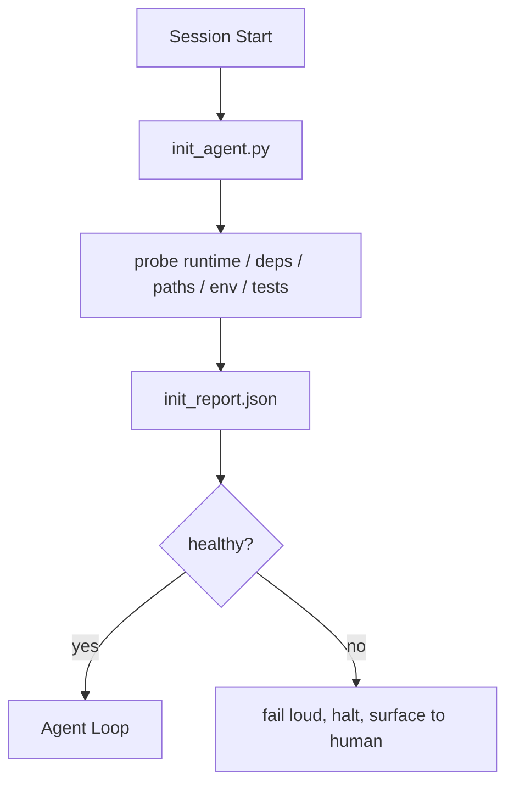

# Les scripts d'initialisation pour les agents

> Chaque session qui commence à froid paie une taxe, l'agent lit les mêmes fichiers, réessaye les mêmes sondes et redécouvre les mêmes chemins, un script init paie la taxe une fois et écrit les réponses dans l'état.

**Type:** Build
**Languages:** Python (stdlib)
**Prerequisites:** Phase 14 · 32 (Minimal Workbench), Phase 14 · 34 (Repo Memory)
**Time:** ~45 minutes

## Objectifs d'apprentissage

- Identifier le travail qu'un agent ne devrait jamais devoir faire par séance.
- Construisez un script init déterministe qui sonde le temps d'exécution, les dépendances et la santé de repo.
- Persistez sur le résultat de la sonde pour que l'agent le lise au lieu de refaire des vérifications.
- Faites-le fort, rapidement et avec un seul endroit où regarder lorsque l'initialisation échoue.

## Le problème

L'agent devine la version Python. Devine la commande de test. Liste la racine repo cinq fois pour trouver le point d'entrée. tente d'importer un paquet qui n'est pas installé. demande à l'utilisateur où réside le fichier de configuration. Au moment où il effectue une véritable modification, dix mille jetons ont été mis en place qui aurait dû être un seul script.

La correction est un script d' initialisation qui s' exécute avant que l' agent ne fasse autre chose et écrit un`init_report.json`L'agent lit à la démarrage.

## Le concept



### Ce que le script init sonde

| Probe | Why it matters |
|-------|----------------|
| Runtime versions | Wrong Python or Node version means silent wrong-version bugs |
| Dependency availability | A missing package later costs ten times the cost of catching it now |
| Test command | The agent must know how to verify; if the command is missing the workbench is broken |
| Repo paths | Hard-coded paths drift; resolve them once and pin |
| Environment variables | Missing `OPENAI_API_KEY` is a failure surface, not a runtime mystery |
| State + board freshness | Stale state from a crashed session is a footgun |
| Last-known-good commit | Anchor for the handoff diff at the end of the session |

### Faites-vous échouer fort, faites-vous échouer vite, faites-vous échouer en un seul endroit

Une panne de sonde signifie arrêter et surfer à l'homme. "Non, l'agent ne saurait le comprendre".

### Idempotent

La deuxième fois, il ne devrait pas y avoir de temps, sauf pour un nouveau timestamp.

### Règles init versus démarrage

Les règles (phase 14 · 33) décrivent ce qui doit être vrai pour agir. Init est le script qui établit que ces règles peuvent être vérifiées.

```figure
wb-init-probes
```

## Faites-le

`code/main.py`les implémentations `init_agent.py`- Le numéro de la liste:

- Cinq sondes: version Python, dépendances répertoriées via `importlib.util.find_spec`, la résolubilité des commandes d'essai, l'environnement requis, la fraîcheur des dossiers de l'état.
- Chaque sonde revient .`(name, status, detail)`- Je suis désolé .
- Le scénario écrit:`init_report.json`avec la sonde complète réglée et sortant non zéro si une sonde de gravité de bloc échoue.

- Je vais le faire.

```
python3 code/main.py
```

Le script imprime la table des sondes, écrit `init_report.json`, et sort de zéro sur le chemin heureux ou non zéro avec une liste de sondes ratées.

## Modèles de production dans la nature

Trois modèles séparent un script init utile d'une cérémonie.

**Last-known-good commit anchoring.**Prouver le dépôt courant contre un `LKG`Si le diff dépasse un budget (fichiers par défaut 50), refusez de commencer et demandez à un humain de ratifier la nouvelle ligne de base. C'est ce que l'AI Code Review de Cloudflare utilise pour étendre les agents de révision: chaque session de révision s'ancrera contre le même dernier bien connu et ne dérive jamais de composés entre les sessions.

**Lock files with TTL.**Écrivez une`prereqs.lock`Après le premier passage de la sonde avec succès. Les exécutions suivantes font confiance au verrou pendant N heures (24h par défaut) et sautent les sondes coûteuses. Le script init lit le verrou d'abord; si il est frais et que le manifeste de dépendance correspond au hash, il court-circuite. C'est le même schéma que Docker utilise pour les caches de couches: sonde idempotent + contenu hash = sauter.

**No network, no LLM, no surprises in the hot path.**Les sondes init sont des plomberie déterministe. Une sonde qui appelle un LLM pour classer une défaillance ou qui frappe un service externe pour vérifier une licence n'est pas une sonde; c'est un flux de travail. Si une sonde prend plus de trois secondes dans une course sèche, traitez-la comme une odeur de banc de travail et ou de le déplacer de init ou de cacher son résultat.

## Utilisez-le

En production:

- **Claude Code hooks.** `pre-task`Hook appelle le script init et refuse de lancer l'agent si cela échoue.
- **GitHub Actions.**Une .`setup-agent`le travail exécute le script init; le travail de l'agent en dépend.
- **Docker entrypoint.**Le conteneur d'agent exécute le script init avant d'exécuter le temps d'exécution de l'agent; les journaux apparaissent en cas de défaillance.

Le script init est portable car il ne fait pas d'appels à un cadre spécifique.

## La faire partir

`outputs/skill-init-script.md`Il entrevoit le projet, classifie ses travaux de mise en place en sondes et émet un rapport spécifique au projet `init_agent.py`Plus un flux de travail d'informations qui l'exécute avant toute étape de l'agent.

## Exercices

1. Ajoutez une sonde qui différencie le commette actuel par rapport au dernier commette connu et refuse de démarrer si plus de 50 fichiers sont modifiés.
2. Faites le script pour écrire un `prereqs.lock`- le dossier et le refus de démarrer si la serrure est plus ancienne que sept jours.
3. Ajouter un `--fix`flag qui installe automatiquement les dépendances de développement manquantes mais ne modifie jamais les dépendances de l'exécution sans approbation.
4. Mettez les sondes de fonctions codées à un registre YAML.
5. Une sonde qui dure plus de trois secondes est une odeur de bureau.

## Les termes clés

| Term | What people say | What it actually means |
|------|----------------|------------------------|
| Probe | "A check" | A deterministic function returning `(name, status, detail)` |
| Init report | "Setup output" | JSON written next to state with the probe results |
| Idempotent | "Safe to re-run" | Two runs in a row produce identical reports modulo timestamp |
| Fail loud | "Don't swallow" | Halt and surface to the human; no silent fallback |
| Setup tax | "Bootstrap cost" | The tokens the agent spends per session rediscovering the obvious |

## Pour en savoir plus

- [Anthropic, Effective harnesses for long-running agents](https://www.anthropic.com/engineering/effective-harnesses-for-long-running-agents)
- [GitHub Actions, composite actions for setup](https://docs.github.com/en/actions/sharing-automations/creating-actions/creating-a-composite-action)
- [microservices.io, GenAI dev platform: guardrails](https://microservices.io/post/architecture/2026/03/09/genai-development-platform-part-1-development-guardrails.html) vérifications préalables + vérifications d'IC comme init
- [Augment Code, How to Build Your AGENTS.md (2026)](https://www.augmentcode.com/guides/how-to-build-agents-md) attentes init
- [Codex Blog, Codex CLI Context Compaction](https://codex.danielvaughan.com/2026/03/31/codex-cli-context-compaction-architecture/) démarrage de la session comme initiateur conscient de la compactaison
- Phase 14 · 33  la règle définie dans ce script permet
- Phase 14 · 34  le fichier de l' état ce script semences
- Phase 14 · 38  la passerelle de vérification le script init est alimenté
- Phase 14 · 40  la transmission qui consomme le dernier bien connu du rapport init
