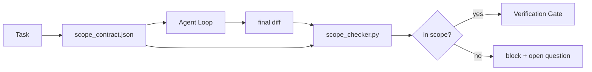

# Contrats de portée et limites de tâches

> Le modèle ne sait pas où se termine le travail. Un contrat de portée est un fichier par tâche qui indique où le travail commence, où il se termine et comment se dérouler si il se déversement. Le contrat passe d'un souhait à un chèque.

**Type:** Build
**Languages:** Python (stdlib)
**Prerequisites:** Phase 14 · 32 (Minimal Workbench), Phase 14 · 33 (Rules as Constraints)
**Time:** ~50 minutes

## Objectifs d'apprentissage

- Écrivez un contrat de portée que l'agent lit au début de la tâche et que le vérificateur lit à la fin de la tâche.
- Indiquez les fichiers autorisés, les fichiers interdits, les critères d'acceptation, le plan de rétroaction et les limites d'approbation.
- Mettre en œuvre un contrôleur de portée qui compare une différence par rapport au contrat et détecte les violations.
- Faites en sorte que la portée soit visible, automatique et révisable.

## Le problème

Les agents se glissent. La tâche est de " réparer le bug de connexion. " La différence touche le chemin de connexion, l'assistant de messagerie électronique, le pilote de base de données, le README et le script de sortie. Chaque touche avait une raison plausible à l'époque. Ensemble, ils sont un changement différent de celui qui a été examiné.

Le scope creep est le mode d'échec le plus sous-monitoré dans le travail des agents parce que l'agent raconte chaque étape de bonne foi.

## Le concept



### Ce qui est inclus dans un contrat de portée

| Field | Purpose |
|-------|---------|
| `task_id` | Links to the task on the board |
| `goal` | One sentence the reviewer can verify |
| `allowed_files` | Globs the agent may write |
| `forbidden_files` | Globs the agent must not touch even by accident |
| `acceptance_criteria` | Test commands or assertion lines that prove done |
| `rollback_plan` | One paragraph the operator can execute if a halt is required |
| `approvals_required` | Actions outside scope that need explicit human sign-off |

Un contrat sans`forbidden_files`L'espace négatif est la moitié du contrat.

### Boules, pas chemins bruts

Les fichiers de repos réels sont déplacés.`app/**/*.py`- Je suis là .`tests/test_signup*.py`) de sorte qu'un réfacteur entre les séances n'annule pas le contrat.

### Le retour en arrière fait partie de la portée

Une liste de la façon de renverser oblige l'auteur du contrat à réfléchir à ce qui pourrait mal tourner.

### La vérification de la portée est une vérification des différences

L'agent écrit un diff. Le vérificateur lit le diff, les globes autorisés, les globes interdits, et une liste de toutes les commandes d'acceptation qui ont été exécutées.

### Deux altitudes de portée: la liste des caractéristiques et le contrat de tâches

Le contrat de portée limite une tâche. Il ne lie pas le projet. Un agent peut rester parfaitement à l'intérieur d'un contrat pour la fixation de connexion et encore, à la prochaine étape, décider que le projet a également besoin d'une page de paramètres, d'un mode sombre et d'une réécriture du routeur. Le contrat n'a jamais été demandé quel travail était dans le champ du projet, seulement quels fichiers étaient dans le champ de la tâche.

Cette seconde altitude a besoin de son propre primitif:`feature_list.json`L'agent lit à l'ouverture de la session. C'est le backlog du projet en tant que fichier machine lisible, commandé. L'agent choisit exactement une fonction dont `status`est `todo`, écrit son `id`" Une fonctionnalité à la fois " cesse d'être une ligne dans le prompt que l'agent peut rationaliser passé et devient une valeur qu'il lit sur le disque et un contrôle que le gate impose.

```json
{
  "project": "knowledge-base",
  "active": "import-pdf",
  "features": [
    { "id": "import-pdf",   "status": "in_progress", "goal": "import a PDF into the library",        "done_when": "pytest tests/test_import.py && a sample PDF appears in the library view" },
    { "id": "full-text-search", "status": "todo",     "goal": "search document text and rank hits",   "done_when": "query returns ranked results with snippets" },
    { "id": "cite-answers", "status": "todo",         "goal": "answers carry source citations",        "done_when": "every answer renders at least one clickable citation" }
  ]
}
```

| Field | Purpose |
|-------|---------|
| `active` | The single feature the current session may touch; empty means pick one and set it |
| `features[].id` | Stable slug the scope contract's `task_id` points at |
| `features[].status` | `todo`, `in_progress`, `done`, `blocked`; only one `in_progress` at a time |
| `features[].goal` | One sentence the reviewer can verify |
| `features[].done_when` | The acceptance line that flips `in_progress` to `done` |

Deux règles font que la liste porte une charge au lieu de décorative.`in_progress`" est elle-même un démarrage de vérification (phase 14 · 33): si la liste affiche deux, la session refuse de commencer jusqu'à ce qu'un humain la résolve. Deuxièmement, la liste de fonctionnalités est un fichier, pas un message de chat, car le chat se déplace hors contexte et le fichier persiste à travers les sessions et les agents.`done`Donc la prochaine session s'ouvre à une table exacte au lieu de dériver ce qui reste.

Le contrat et la liste sont composés par le moins de privilèges, la même fusion décrite ci-dessous: le contrat de tâche `allowed_files`doit rester à l'intérieur de ce que touche la fonction active, jamais à l'extérieur.

```figure
wb-scope-bounce
```

## Faites-le

`code/main.py`les implémentations:

- `scope_contract.json`schema (sous-ensemble de JSON Schema, matrices globes).
- Un parseur différent qui transforme une liste de fichiers touchés plus une liste de commandes d' exécution en un `RunSummary`- Je suis désolé .
- Une .`scope_check`qui revient `(violations, in_scope, off_scope)`contre le contrat.
- Deux démos: une qui reste dans la portée, une qui se fait craquer.

- Je vais le faire.

```
python3 code/main.py
```

Le contrat, les deux courses, les verdicts par course et un épargneur.`scope_report.json`- Je suis désolé .

## Modèles de production dans la nature

Un praticien qui effectue "specsmaxxing" (contrats de portée dans YAML avant d'invoquer l'agent) rapporte que le taux de trou du lapin est tombé de 52% à 21% en trois semaines sans changer l'agent.

**Violation budgets, not binary failures.** `agent-guardrails`(la porte de fusion OSS utilisée par Claude Code, Cursor, Windsurf, Codex via MCP)`violationBudget`par tâche: des annonces de portée mineures dans le budget apparaissent comme des avertissements; seulement lorsque le budget est dépassé, la porte de fusion refuse.`violationSeverity: "error" | "warning"`Le budget est la différence entre une porte qui envoie et une porte qui est désactivée par l'équipe qui la déteste.

**Severity asymmetry by path family.**Off-scope écrit à `docs/**`sont généralement `warn`; hors de portée écrit à `scripts/**`- Je suis là .`migrations/**`- Je suis là .`config/prod/**`sont toujours`block`Cette asymétrie doit être intégrée au contrat et non au temps de réalisation, car elle est spécifique au projet et change par tâche.

**Time and network budgets next to file budgets.**Une .`time_budget_minutes`Le champ limite l'horloge murale; le temps d'exécution refuse de continuer à le traverser sans réapprobation.`network_egress`Allowlist sur les noms d'hôte empêche l'agent de toucher silencieusement une API externe qui n'était pas partie de la tâche.

**Multi-contract merge semantics (least privilege).**Lorsque deux contrats de portée sont applicables (par exemple, un contrat pour l'ensemble du projet plus un contrat spécifique à une tâche), la fusion est: **intersect** `allowed_files`(les deux contrats doivent permettre la voie),**union** `forbidden_files`(ou peut interdire), `time_budget_minutes`est le plus restrictif (min), `approvals_required`Il y a des accumulations.`network_egress`est `None`pour l'absence d'exécution, `[]`pour le mensonge,`[...]`en tant qu'allowliste; en fusion, `None`Les deux listes se croisent et nier tout reste nier tout.

## Utilisez-le

Modèles de production:

- **Claude Code slash commands.**Une .`/scope`Le commandement écrit le contrat et le pinne comme contexte de session.
- **GitHub PRs.**Poussez le contrat en tant que fichier JSON dans le corps de relations publiques ou en tant qu'artefact enregistré. CI exécute le vérificateur de portée contre la différence de fusion.
- **LangGraph interrupts.**Une violation de la portée déclenche une interruption; le gestionnaire demande à l'humain si le contrat doit croître ou si l'agent doit se retirer.

Le contrat se déroule avec la tâche.`outputs/scope/closed/`- Je suis désolé .

## La faire partir

`outputs/skill-scope-contract.md`génère un contrat de champ d'application pour une description de tâche et un vérificateur global qui fonctionne en IC sur chaque agent différent.

## Exercices

1. Ajouter un `network_egress`Listes de champs autorisés hôtes externes. refuser des exécutions qui touchent d'autres hôtes.
2. Étendre le contrôleur pour que l' échec soit doux `docs/**`et dur sur `scripts/**`- Justifier l'asymétrie.
3. Faire dériver le contrat `allowed_files`à partir d' une`goal`Il y a un champ qui utilise un ensemble de règles statiques (pas de LLM).
4. Ajouter un `time_budget_minutes`et refuser de continuer une fois que l'horloge du mur l'a dépassé.
5. Exécuter deux contrats contre la même différence. Quelle est la bonne sémantique de fusion quand les deux s'appliquent?

## Les termes clés

| Term | What people say | What it actually means |
|------|----------------|------------------------|
| Scope contract | "The task brief" | Per-task JSON listing allowed/forbidden files, acceptance, rollback |
| Scope creep | "It also touched..." | Files outside the contract changed in the same task |
| Rollback plan | "We can revert" | The one-paragraph operator runbook for halting |
| Approval boundary | "Needs sign-off" | An action listed in the contract as requiring explicit human approval |
| Diff check | "Path audit" | Comparing touched files against the contract globs |

## Pour en savoir plus

- [LangGraph human-in-the-loop interrupts](https://langchain-ai.github.io/langgraph/concepts/human_in_the_loop/)
- [OpenAI Agents SDK tool approval policies](https://platform.openai.com/docs/guides/agents-sdk)
- [logi-cmd/agent-guardrails — merge gates and scope validation](https://github.com/logi-cmd/agent-guardrails) budgets de violation, niveaux de gravité
- [Dev|Journal, Preventing AI Agent Configuration Drift with Agent Contract Testing](https://earezki.com/ai-news/2026-05-05-i-built-a-tiny-ci-tool-to-keep-ai-agent-configs-from-drifting-in-my-repo/) `--strict`mode sans dépôts externes
- [Agentic Coding Is Not a Trap (production logs)](https://dev.to/jtorchia/agentic-coding-is-not-a-trap-i-answered-the-viral-hn-post-with-my-own-production-logs-33d9) Résultats de la vérification des spécifications: 52% → 21%
- [OpenCode permission globs](https://opencode.ai/docs/agents/) champ d'application de la licence de grains fins
- [Knostic, AI Coding Agent Security: Threat Models and Protection Strategies](https://www.knostic.ai/blog/ai-coding-agent-security) la portée dans le cadre du privilège minimum
- [Augment Code, AI Spec Template](https://www.augmentcode.com/guides/ai-spec-template) Système de frontières à trois niveaux (obligatoire/impératif/ne jamais)
- Phase 14 · 27  Défense à injection rapide qui s'accouple avec des verrous de portée
- Phase 14 · 33  la règle établie dans le présent contrat est spécialisée par tâche
- Phase 14 · 38  la passerelle de vérification le vérificateur rapporte dans
