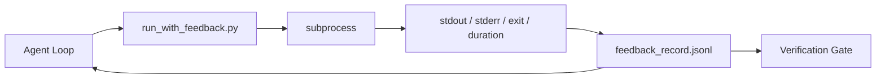

# Les boucles de rétroaction en temps d'exécution

> Les agents qui ne voient pas de commande réelle de sortie deviner. Un coureur de rétroaction capture stdout, stderr, code de sortie et le timing dans un enregistrement structuré le tour suivant peut lire.

**Type:** Build
**Languages:** Python (stdlib)
**Prerequisites:** Phase 14 · 32 (Minimal Workbench), Phase 14 · 35 (Init Script)
**Time:** ~50 minutes

## Objectifs d'apprentissage

- Distinguer les rétroactions en temps d'exécution de la télémétrie d'observabilité.
- Construisez un coureur de rétroaction qui enveloppe les commandes de shell et persiste les enregistrements structurés.
- Tricoter les grandes sorties déterministiquement afin que la boucle reste dans le budget des jetons.
- Ne pas avancer dans la boucle quand il manque de rétroaction.

## Le problème

L'agent dit "exécuter des tests maintenant". Le message suivant dit "tous les tests passent". La réalité est qu'aucun test n'a été exécuté.

Un coureur de rétroaction supprime cette lacune. Chaque commande passe par le coureur. Chaque enregistrement contient la commande, le stdout et stderr capturés, le code de sortie, la durée du mur-horloge et une note d'agent en une ligne. L'agent lit le enregistrement au tour suivant. La passerelle de vérification lit les enregistrements à la fin de la tâche.

## Le concept



### Ce qui est écrit dans un dossier de rétroaction

| Field | Why it matters |
|-------|----------------|
| `command` | Exact argv, no shell expansion surprises |
| `stdout_tail` | Last N lines, deterministic truncation |
| `stderr_tail` | Last N lines, separate from stdout |
| `exit_code` | The unambiguous success signal |
| `duration_ms` | Surfaces slow probes and runaway processes |
| `started_at` | Timestamp for replay |
| `agent_note` | One line the agent writes about what it expected |

### La tronçage est déterministe

Un journal de 50 MB détruit la boucle.`...truncated N lines...`Les éléments que l'agent doit voir (erreur finale, résumé final) sont en direct à la queue.

### Réponse par rapport à la télémétrie

La télémétrie (phase 14 · 23, OTel GenAI conventions) est pour les opérateurs humains qui examinent les circuits dans le temps.

### Refuser de faire avancer sans retour de réponse

Si le coureur s' égarent avant de capturer la sortie, le record contient `exit_code: null`et `error: <reason>`La boucle d' agents doit refuser de revendiquer le succès sur une`null`Pas de sortie, pas de progrès.

```figure
wb-feedback-loop
```

## Faites-le

`code/main.py`les implémentations:

- `run_with_feedback(command, agent_note)`Ça se ramasse .`subprocess.run`, capture le décalage/l'arrêt/la sortie/la durée, tronque déterministiquement, ajoute à `feedback_record.jsonl`- Je suis désolé .
- Un petit chargement qui transmet le JSONL dans une liste Python.
- Une démo qui exécute trois commandes (succès, échec, lente) et imprime le dernier enregistrement par commande.

- Je vais le faire.

```
python3 code/main.py
```

Résultats: trois enregistrements de rétroaction sont ajoutés `feedback_record.jsonl`La file est en train de se répéter pour voir la boucle s'accumuler.

## Modèles de production dans la nature

Trois modèles durcissaient le coureur assez pour le faire partir.

**Redact at write, not at read.**Tout enregistrement qui touche stdout ou stderr peut fuir des secrets. Le coureur envoie un passe de rédaction avant l'annexe JSONL: strips correspondant`^Bearer `- Je suis là .`password=`- Je suis là .`api[_-]?key=`- Je suis là .`AKIA[0-9A-Z]{16}`(AWS), `xox[baprs]-`La rédaction au moment de la lecture est une arme à feu; le fichier sur le disque est ce qu'un attaquant atteint.

**Rotation policy, not a single file.**Cap .`feedback_record.jsonl`à 1 MB par fichier; à l' écrasement, tourner à `.1`- Je suis là .`.2`, déposez`.5`Le fichier de l'agent ne lit que le fichier courant, donc le coût de l'exécution est limité.

**Parent-command id for retry chains.**Chaque disque est`command_id`; retrait de la charge`parent_command_id`La liste des "tentatives ratées" de l'examen (phase 14 · 40) et l'audit de la passerelle de vérification suivent toutes les deux la chaîne.

## Utilisez-le

Modèles de production:

- **Claude Code Bash tool.**L'outil capture déjà stdout, stderr, exit et duration. Le coureur dans cette leçon est l'équivalent framework-agnostique pour tout produit agent.
- **LangGraph nodes.**Enveloppez n'importe quel nœud de coquille dans le coureur afin que le disque persiste en dehors de l'état du graphique.
- **CI logs.**Envoyez le JSONL dans votre magasin d'artefacts CI; les examinateurs peuvent reproduire n'importe quelle commande sans réinitialiser la session.

Le coureur est un épais enveloppeur qui survit à chaque migration de cadre parce qu'il possède la forme du disque.

## La faire partir

`outputs/skill-feedback-runner.md`génère une spécification de projet `run_with_feedback.py`avec le bon budget de troncage, un rédacteur JSONL câblé au bureau de travail, et un chargeur que l'agent lit à chaque tour.

## Exercices

1. Ajouter un `cwd`le même commandement exécuté dans différents répertoires est distinguable.
2. Ajouter un `redaction`étape qui délimite les lignes correspondantes `^Bearer `ou `password=`- Test sur un enregistrement de fixation.
3. Cap total `feedback_record.jsonl`taille à 1 MB en tournant à `.1`- Je suis là .`.2`défendre la politique de rotation.
4. Ajouter un `parent_command_id`Alors les chaînes de retest sont visibles: quelle commande a produit l'entrée que la commande suivante a consommée.
5. En cas de problème de sécurité, il est nécessaire de mettre en évidence les caractéristiques principales de l'UTI.

## Les termes clés

| Term | What people say | What it actually means |
|------|----------------|------------------------|
| Feedback record | "Run log" | Structured JSONL entry with command, output, exit, duration |
| Tail truncation | "Trim the log" | Deterministic head+tail capture so records fit in token budget |
| Refuse-on-null | "Block on missing data" | The loop must not advance when `exit_code` is null |
| Agent note | "Expectation tag" | The one-line prediction the agent writes before reading the result |
| Telemetry split | "Two log files" | Feedback for the next turn, telemetry for the operator |

## Pour en savoir plus

- [OpenTelemetry GenAI semantic conventions](https://opentelemetry.io/docs/specs/semconv/gen-ai/)
- [Anthropic, Effective harnesses for long-running agents](https://www.anthropic.com/engineering/effective-harnesses-for-long-running-agents)
- [Guardrails AI x MLflow — deterministic safety, PII, quality validators](https://guardrailsai.com/blog/guardrails-mlflow) modèles de rédaction en tant que tests de régression
- [Aport.io, Best AI Agent Guardrails 2026: Pre-Action Authorization Compared](https://aport.io/blog/best-ai-agent-guardrails-2026-pre-action-authorization-compared/) Capture pré/après outil
- [Andrii Furmanets, AI Agents in 2026: Practical Architecture for Tools, Memory, Evals, Guardrails](https://andriifurmanets.com/blogs/ai-agents-2026-practical-architecture-tools-memory-evals-guardrails) surfaces observables
- Phase 14 · 23  Conventions OTel GenAI pour le secteur de la télémétrie
- Phase 14 · 24  Plateformes d'observabilité des agents (Langfuse, Phoenix, Opik)
- Phase 14 · 33  la règle qui exige des commentaires avant de déclarer terminé
- Phase 14 · 38  la passerelle de vérification qui lit le JSONL
