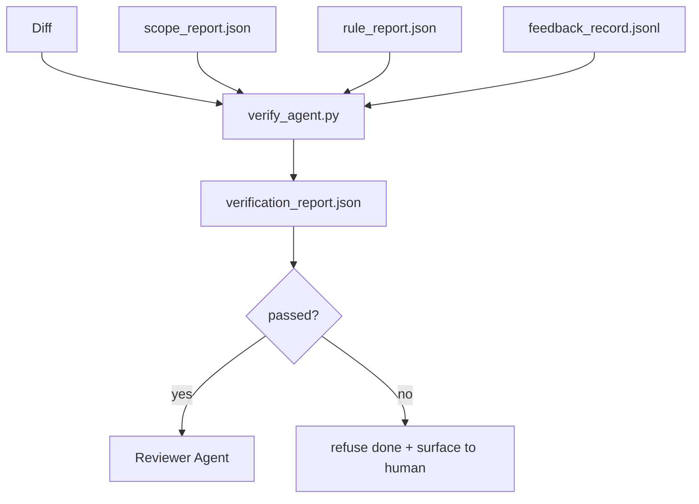

# Ports de vérification

> L'agent ne peut pas marquer son propre travail comme fait. Une passerelle de vérification lit le contrat de portée, le journal de rétroaction, le rapport de règles et le diff, et répond à une seule question: cette tâche est-elle réellement terminée?

**Type:** Build
**Languages:** Python (stdlib)
**Prerequisites:** Phase 14 · 33 (Rules), Phase 14 · 36 (Scope), Phase 14 · 37 (Feedback)
**Time:** ~55 minutes

## Objectifs d'apprentissage

- Définir une passerelle de vérification comme une fonction déterministe sur les artefacts de bureau.
- Combinez le rapport de règles, le rapport de portée, les dossiers de rétroaction et la différence en un seul verdict.
- Émettez un `verification_report.json`L'agent de l'examen et l'informateur peuvent lire.
- Refuser de faire avancer une tâche sur toute défaillance de gravité de bloc, sans exception.

## Le problème

Les agents déclarent trop facilement le succès.

- " Ça a l'air bien. " Le modèle a lu sa propre différence et a décidé qu'elle était correcte.
- "Les tests ont passé". Il a dit en toute confiance.
- "Acceptation satisfaite". Les critères d'acceptation sont interprétés assez lourdement pour signifier "tout ce qui ressemble à ce qui a été fait".

La solution de la table de travail est une seule passerelle de vérification qui lit les objets que l'agent a déjà produits et fait l'appel. La passerelle est déterministe. La passerelle est en contrôle de version. La passerelle est câblée dans CI. L'agent ne peut pas la corrompre.

## Le concept



### Ce que vérifie la porte

| Check | Source artifact | Severity |
|-------|-----------------|----------|
| All acceptance commands ran | `feedback_record.jsonl` | block |
| All acceptance commands exited zero | `feedback_record.jsonl` | block |
| Scope check has no forbidden writes | `scope_report.json` | block |
| Scope check has no off-scope writes | `scope_report.json` | block or warn |
| All block-severity rules pass | `rule_report.json` | block |
| No `null` exit codes in feedback | `feedback_record.jsonl` | block |
| Touched files match `scope.allowed_files` | both | warn |

Une .`warn`la conclusion annotera le verdict; a `block`trouver des obstacles `passed: true`- Je suis désolé .

### Déterministique, non probabiliste

La porte doit produire le même verdict pour le même artefact mis à jour à chaque fois. Aucun juge LLM. Les juges LLM appartiennent au côté de l'examen (phase 14 · 39) où l'objectif est une évaluation qualitative, pas le statut.

### Un rapport, un chemin

La porte en émet une .`verification_report.json`par tâche, écrit sous `outputs/verification/<task_id>.json`La CI consomme le même chemin, plusieurs portes avec des chemins différents forge la source de la vérité.

### Renier sans exception

Les résultats de la gravité des blocs ne peuvent être annulés par l'agent.`override_reason`et une `overridden_by`L'annulation est un changement signé, pas une décision de l'agent.

```figure
wb-gate-sequence
```

## Faites-le

`code/main.py`les implémentations:

- Un chargement pour chaque produit, tous enduits localement pour que la leçon soit autonome.
- Une .`verify(task_id, artifacts) -> VerdictReport`fonction pure.
- Une imprimante qui affiche les résultats par vérification et le résultat final.
- Une démo avec trois scénarios de tâches: passer clair, creep scope, absence d'acceptation.

- Je vais le faire.

```
python3 code/main.py
```

Résultat: trois rapports de verdict, chacun enregistré à côté du script.

## Modèles de production dans la nature

Quatre modèles élèvent la porte d'un "autre travail de laine" à "le bord décisif".

**Defense-in-depth, not single gate.**Chaque couche est déterministe, de sorte qu'une défaillance dans une couche est prise par la suivante. Le manuel de jeu de mars 2026 de microservices.io est explicite: le crochet pré-commit est non-passageable parce que, contrairement à une compétence côté modèle, il ne dépend pas de l'agent suivant les instructions.

**Defense by deterministic check, model-judge only for nuance.**L'appariement de la norme hybride 2026 d'Anthropic: récompenses vérifiables (tests d'unités, vérifications de schéma, codes de sortie) répondent " le code a-t-il résolu le problème ? "  Les rubriques du LLM répondent " le code est-il lisible, sécurisé, en style ? " La passerelle exécute la première classe; le réviseur (phase 14 · 39) exécute la seconde. Le mélange des deux effondre le signal.

**Signed override log, not Slack threads.**Chaque dépassement émet une ligne dans `outputs/verification/overrides.jsonl`avec: timestamp, code de recherche, raison, utilisateur signé, engagement HEAD actuel. Le temps d'exécution refuse toute annulation qui manque de signature; la piste d'audit est git-tracked. C'est la ligne entre une politique d'annulation et un théâtre d'annulation.

**Coverage floor as a first-class check.**Une .`coverage_report.json`Il est alimenté par un`coverage_floor`(par défaut 80%) vérification. La passerelle échoue si la couverture mesurée tombe en dessous du sol ou en dessous du sol de la fusion précédente de plus de 1 point de pourcentage.

**`--strict` mode promotes warns to blocks.**Pour les branches de libération, les relations publiques de blocage des navires ou le tri après incident, `--strict`Le drapeau est opt-in par branche, pas le défaut mondial, parce que strict-on-tout corrodant le flux quotidien.

## Utilisez-le

Modèles de production:

- **CI step.**Une .`verify_agent`Le travail de l'agent s'enfuit contre les objets finaux.`passed: true`- Je suis désolé .
- **Pre-handoff hook.**L'agent appelle la porte avant de générer le document.
- **Manual triage.**Les opérateurs lisent le rapport quand un agent prétend réussir et un humain le soupçonne.

La porte est le bord décisif du flux de la table de travail.

## La faire partir

`outputs/skill-verification-gate.md`les câbles de la passerelle dans un projet spécifique: quelles commandes d'acceptation le nourrissent, quelles règles sont sévères, quelles écritures hors champ sont tolérées, comment le journal d'audit de suppression est stocké.

## Exercices

1. Ajouter un `coverage_floor`vérification: la commande d'essai doit produire un rapport de couverture d'au moins 80%. Détermine quel artefact porte le sol.
2. Soutenir un`--strict`mode qui favorise chaque `warn`à `block`- documenter les cas où le mode strict est le bon par défaut.
3. Faites en sorte que la passerelle produise un résumé Markdown en plus de JSON. Défendre quels champs appartiennent au résumé.
4. Ajouter un `time_since_last_human_touch`vérification: tout fichier modifié dans les 60 secondes suivant une pression de touche humaine est exempté de drapeaux hors champ d'application.
5. Il faut utiliser un agent réel différent de votre produit.

## Les termes clés

| Term | What people say | What it actually means |
|------|----------------|------------------------|
| Verification gate | "The check that stops things" | Deterministic function over workbench artifacts producing a pass/fail verdict |
| Block severity | "Hard fail" | A finding that prevents `passed: true` and requires a signed override |
| Override log | "Why we let it through" | Signed entries with reason and user id, audited by review |
| Acceptance command | "The proof" | A shell command whose zero exit is what `done` means |
| One report path | "Source of truth" | `outputs/verification/<task_id>.json`, consumed by CI and humans alike |

## Pour en savoir plus

- [Anthropic, Harness design for long-running application development](https://www.anthropic.com/engineering/harness-design-long-running-apps)
- [OpenAI Agents SDK guardrails](https://openai.github.io/openai-agents-python/guardrails/)
- [microservices.io, GenAI dev platform: guardrails](https://microservices.io/post/architecture/2026/03/09/genai-development-platform-part-1-development-guardrails.html) défense en profondeur entre pré-engagement et CI
- [ICMD, The 2026 Playbook for Agentic AI Ops](https://icmd.app/article/the-2026-playbook-for-agentic-ai-ops-guardrails-costs-and-reliability-at-scale-1776661990431) échelle de porte d'approbation (projet → approbation → auto en dessous des seuils)
- [Type-Checked Compliance: Deterministic Guardrails (arXiv 2604.01483)](https://arxiv.org/pdf/2604.01483) Lean 4 comme limite supérieure de la délimitation déterministe
- [logi-cmd/agent-guardrails — merge gate spec](https://github.com/logi-cmd/agent-guardrails) portée + portes de test de mutation
- [Guardrails AI x MLflow](https://guardrailsai.com/blog/guardrails-mlflow) validateurs déterministes en tant que scoreurs d'IC
- [Akira, Real-Time Guardrails for Agentic Systems](https://www.akira.ai/blog/real-time-guardrails-agentic-systems) Ports de pré/post-outil
- Phase 14 · 27  Défense à injection rapide (parue de la porte)
- Phase 14 · 36  le contrat de portée que cette porte impose
- Phase 14 · 37  le journal de rétroaction ce portail marque
- La phase 14 · 39  l'agent d'examen le portail se déplace à
