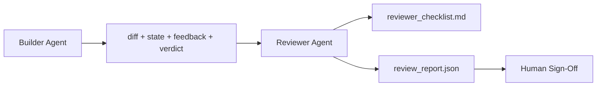

# Agent de révision: constructeur séparé de marqueur

> L'agent qui a écrit le code ne peut pas le classer. Un réviseur est une deuxième boucle avec un prompt système différent, un objectif différent et un accès à la lecture uniquement à tout ce que le constructeur a produit. L'écart entre le constructeur et le réviseur est où la plus grande fiabilité vit.

**Type:** Build
**Languages:** Python (stdlib)
**Prerequisites:** Phase 14 · 38 (Verification Gate)
**Time:** ~55 minutes

## Objectifs d'apprentissage

- Expliquez pourquoi le même agent ne peut pas examiner de manière fiable son propre travail.
- Construire une boucle d'agent de révision qui consomme des artefacts de constructeurs et émet un rapport de révision structuré.
- Rédacteur d'une rubrique qui note des dimensions spécifiques, pas des vibrations.
- Faites entrer le réviseur dans le bureau de travail pour que l'étape de révision humaine commence à partir d'un véritable artefact.

## Le problème

Vous demandez à l'agent de corriger un bug. Il modifie quatre fichiers, exécute les tests et rapports effectués. La passerelle de vérification (phase 14 · 38) confirme l'acceptation et la portée conservée.`passed: true`Deux jours plus tard, vous découvrez que la solution a résolu la mauvaise moitié du bug.

L'acceptation est nécessaire, pas suffisante. L'examen pose les questions que l'acceptation ne peut pas poser: cela a-t-il résolu le problème correctement? a-t-il étendu son champ de travail sans le signaler? a-t-il documenté des hypothèses qui auraient dû être remises en question? a-t-il laissé le tableau de travail dans un état que la prochaine session peut reprendre?

## Le concept



### Rubrique de réviseur

Cinq dimensions, chacun avec un score de 0 à 2.

| Dimension | Question |
|-----------|----------|
| Problem fit | Did the change solve the task as stated, not a nearby task? |
| Scope discipline | Were edits confined to the contract or was the contract grown deliberately? |
| Assumptions | Are all hidden assumptions written down somewhere reviewable? |
| Verification quality | Does the acceptance command actually prove the goal, or did it prove a weaker version? |
| Handoff readiness | Could the next session pick up cleanly from the current state? |

Un échec inférieur à 7 est un échec doux; un échec inférieur à 5 est un échec dur.

### Le réviseur est un rôle distinct, pas un modèle distinct

Vous pouvez exécuter le réviseur avec le même modèle que le constructeur. La discipline est la séparation de rôles: une demande de système différente, des entrées différentes, aucun accès à l'écriture différente. Le changement de posture est le changement de signal.

### Le réviseur ne peut pas modifier la différence

Le réviseur lit le diff, l'état, le retour, le verdict. Il écrit un rapport. Il ne patche pas le diff. Si le rapport dit " réparer cela ", le prochain tour de constructeur fait le correctif; le réviseur revient à la révision. Le mélange de rôles vainc le vide.

### Rubrique de réviseur par rapport à la passerelle de vérification

La porte (phase 14 · 38) vérifie les faits déterministes: l'acceptation a-t-elle été effectuée, les règles ont-elles été adoptées, la portée a-t-elle été maintenue.

```figure
wb-builder-marker
```

## Faites-le

`code/main.py`les implémentations:

- Une .`ReviewerInputs`classe de données regroupant les objets que l'examenateur lit.
- Une rubrique de scorer avec une fonction par dimension. Chaque fonction est déterministe et stub-grade pour la leçon; les applications réelles appelleraient un LLM.
- Une .`review_report.json`l'écrivain avec les cinq points, le total et un verdict (`pass`- Je suis là .`soft_fail`- Je suis là .`hard_fail`)
- Deux cas de démonstration: un changement propre et un changement "les bons tests, le mauvais problème".

- Je vais le faire.

```
python3 code/main.py
```

Résultats: deux rapports d'examen écrits sur disque et une table de la console de scores dimensionnels.

## Modèles de production dans la nature

Les reçus: Le système d'examen du code d'IA de Cloudflare d'avril 2026 a effectué 131.246 visites d'examen sur 48.095 demandes de fusion dans 5.169 repos en 30 jours. L'examen médian a été terminé en 3 minutes et 39 secondes. Jusqu'à sept examinateurs spécialisés (sécurité, performance, qualité du code, documents, gestion des libérations, conformité, codex d'ingénierie) ont travaillé en parallèle sous un coordonnateur d'examen qui a dédoublement les résultats et jugé la gravité. Modèle de premier niveau réservé exclusivement au coordinateur; les spécialistes ont travaillé sur des niveaux moins chers.

Quatre modèles permettent de faire fonctionner à l'échelle.

**Specialist pool, not one big reviewer.**Un réviseur avec une rubrique 5 dimensions fonctionne pour les repos en solo. Une fois que la base de code a des surfaces critiques en matière de sécurité, de performance et de documents, divisez-vous en spécialistes avec des instructions plus petites. Le coordonnateur fait la déduplication; les spécialistes ne gèrent jamais la rubrique complète.

**Bias mitigation as design requirement, not optimization.**Les juges de la LLM montrent quatre biais fiables (Adnan Masood, avril 2026): le biais de position (GPT-4 ~40% incohérent sur (A,B) vs (B,A) l'ordre), le biais de verbosité (~15% de score d'inflation vers des résultats plus longs), la préférence personnelle (les juges préfèrent les résultats de la même famille de modèles), l'autorité (juges des références de taux excessifs à des auteurs connus). Atténuations: évaluer les deux ordres et ne compter que les gains cohérents; utiliser des échelles de 1 à 4 qui récompensent explicitement la concision; faire tourner les juges entre les familles de modèles; débarrasser les noms des auteurs avant de marquer.

**Calibration set, not vibes.**Un ensemble historique de 10 à 20 tâches avec des verdicts corrects connus. Exécuter le réviseur sur elle à chaque changement rapide. Si l'accord avec le dossier historique tombe sous 80%, la rubrique doit être révisée avant que le réviseur ne le fasse. C'est ce que chaque équipe finit par redécouvrir; mieux vaut commencer avec elle.

**Hybrid norm with the gate.**La passerelle de vérification (phase 14 · 38) gère les contrôles déterministes (la réception a-t-elle été effectuée, les tests ont-ils été passés, la portée a-t-elle été maintenue). Le réviseur gère les contrôles sémantiques (si c'est le bon travail, les hypothèses sont documentées, est-ce que la remise est utilisable).

## Utilisez-le

Modèles de production:

- **Claude Code subagents.**Un sous-reviseur se lance après que le constructeur a fermé une tâche. Il publie un commentaire sur les relations publiques avec les scores des rubriques.
- **OpenAI Agents SDK handoffs.**Le constructeur remet à l'examinateur une tâche achevée, et le réviseur peut lui remettre une liste de résultats ou un humain.
- **Two-model pairing.**Le constructeur utilise un modèle plus rapide et moins cher, le critique utilise un modèle plus fort et plus petit, axé sur le jugement.

Le critique est le deuxième couple d'yeux que le bureau de travail développe lorsque les humains ne peuvent pas faire chaque examen eux-mêmes.

## La faire partir

`outputs/skill-reviewer-agent.md`génère une rubrique de réviseur spécifique au projet, un boîtier d'agent de réviseur câblé aux objets du constructeur et une intégration avec la passerelle de vérification afin que l'examen humain commence par un rapport écrit au lieu d'une page vide.

## Exercices

1. Ajouter une sixième dimension spécifique à votre domaine de produit. Défendre pourquoi il n'est pas absorbé par les cinq existants.
2. Exécutez le réviseur avec deux instructions système différentes (terse, verbeuse).
3. Ajouter un `confidence`refuser d'envoyer le rapport lorsque la confiance dans la dimension la plus basse est inférieure à 0,6.
4. Construisez un ensemble d'étalonnage: 10 tâches historiques de clôture avec des verdicts connus corrects.
5. Ajouter une offre de " demandez plus de preuves ": l'examen peut demander au constructeur un test spécifique avant de marquer.

## Les termes clés

| Term | What people say | What it actually means |
|------|----------------|------------------------|
| Reviewer rubric | "Checklist" | Five-dimension 0-2 scoring with a written question per dimension |
| Soft fail | "Needs revisions" | Total below 7; builder gets findings to address |
| Hard fail | "Reject" | Total below 5 or any dimension at 0; halt and surface to human |
| Role separation | "Different prompt" | Same model can be both roles; the discipline is inputs and posture |
| Confidence floor | "Don't ship low-signal reports" | Refuse to emit a verdict when the rubric is uncertain |

## Pour en savoir plus

- [OpenAI Agents SDK handoffs](https://openai.github.io/openai-agents-python/handoffs/)
- [Anthropic Claude Code subagents](https://code.claude.com/docs/en/sub-agents)
- [Cloudflare, Orchestrating AI Code Review at Scale](https://blog.cloudflare.com/ai-code-review/) 7 spécialistes + architecture de coordination, 131 000 courses / 30 jours
- [Agent-as-a-Judge: Evaluating Agents with Agents (OpenReview / ICLR)](https://openreview.net/forum?id=DeVm3YUnpj) Indice de référence DevAI, 366 exigences de solution hiérarchique
- [Adnan Masood, Rubric-Based Evaluations and LLM-as-a-Judge: Methodologies, Biases, Empirical Validation](https://medium.com/@adnanmasood/rubric-based-evals-llm-as-a-judge-methodologies-and-empirical-validation-in-domain-context-71936b989e80) les 4 préjugés et atténuations
- [MLflow, LLM-as-a-Judge Evaluation](https://mlflow.org/llm-as-a-judge) outils de production pour constructeur/évaluateur séparé
- [LangChain, How to Calibrate LLM-as-a-Judge with Human Corrections](https://www.langchain.com/articles/llm-as-a-judge) flux de travail de calibration
- [Evidently AI, LLM-as-a-judge: a complete guide](https://www.evidentlyai.com/llm-guide/llm-as-a-judge)
- [Arize, LLM as a Judge — Primer and Pre-Built Evaluators](https://arize.com/llm-as-a-judge/)
- Phase 14 · 05  Autorefinition et CRITIC (baseline d'auto-révision à l'aide d'un seul agent)
- Phase 14 · 30  Développement d'un agent à propulsion Eval (générateur de réglage de calibration)
- Phase 14 · 38  la passerelle de vérification que l'examenateur lit
- Phase 14 · 40  le paquet de remise que le rapport de l'examen fournit
