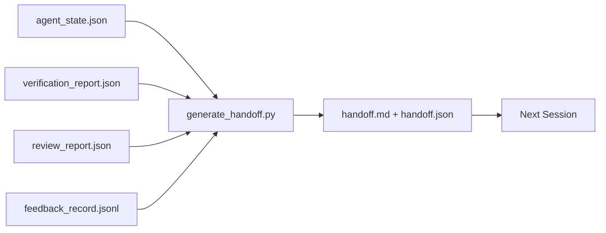

# Transmission en plusieurs sessions

> La séance va se terminer. Le travail ne l'est pas. Le paquet de remise est l'artefact qui transforme "l'agent a travaillé pendant une heure" en "la prochaine séance est productive dans la première minute".

**Type:** Build
**Languages:** Python (stdlib)
**Prerequisites:** Phase 14 · 34 (Repo Memory), Phase 14 · 38 (Verification), Phase 14 · 39 (Reviewer)
**Time:** ~50 minutes

## Objectifs d'apprentissage

- Identifiez les sept champs dont chaque paquet de remise a besoin.
- Générer une transmission des objets du bureau sans prose manuscrite.
- Tire les grands journaux de rétroaction dans un résumé de taille de livraison.
- Faites de la première action de la prochaine session déterministe.

## Le problème

La session se termine. L'agent dit " excellent, nous avons progressé. " La session suivante ouvre. L'agent suivant demande " où nous avons arrêté ? " La réponse du premier agent est partie. L'agent suivant redécouvre, réutilise les mêmes commandes, pose à nouveau les mêmes questions à l'humain, et brûle trente minutes récupérant les trente dernières secondes de la session précédente.

Le coût d'une mauvaise remise est payé à chaque session pour la durée de vie de la tâche. La correction est un paquet généré automatiquement à la fin de la session: ce qui a changé, pourquoi, ce qui a été essayé, ce qui a échoué, ce qui reste, ce qui doit être fait en premier la prochaine fois.

## Le concept



### Sept champs à chaque remise

| Field | Question it answers |
|-------|---------------------|
| `summary` | One paragraph of what was done |
| `changed_files` | The diff at a glance |
| `commands_run` | What was actually executed |
| `failed_attempts` | What was tried and why it did not work |
| `open_risks` | What could bite next session, with severity |
| `next_action` | The first concrete step next session takes |
| `verdict_pointer` | Path to the verification + review reports |

Le `next_action`Le champ est celui qui porte la charge.`next_action`C'est un rapport de situation, pas une remise.

### Les remises sont générées, pas écrites

Un dépôt écrit à la main est un dépôt qui est omis en une journée difficile. Le générateur lit les objets de la table de travail et émet le paquet. Le travail de l'agent est de laisser la table de travail dans un état que le générateur peut résumer, pas d'écrire le résumé.

### Deux formes: lisibles par l'homme et lisibles par la machine

`handoff.md`C'est ce que l'homme lit.`handoff.json`Les deux proviennent des mêmes objets de source.

### Réglage du journal des retours

Le plein`feedback_record.jsonl`La transmission ne contient que le dernier K plus chaque entrée avec une sortie non nulle. La session suivante charge le journal complet si nécessaire, mais le paquet reste petit.

### Laissez un état propre

Une remise décrit le travail. Un état propre rend le travail réalisable. Ils ne sont pas la même chose.`handoff.md`Il est inutile si la prochaine session s'ouvre à une différence à moitié appliquée, un fichier temporaire oublié par l'agent, une branche errante, et teste cette erreur avant même qu'ils ne s'exécutent.

La séance ne se termine pas quand la fonction fonction fonctionne. Elle se termine quand le bureau de travail est dans un état que le générateur peut résumer et que la prochaine session peut faire confiance. Le nettoyage est sa propre phase, il est exécuté avant la remise, et c'est un contrôle, pas une habitude, parce qu'une habitude est la chose qui est saute sur une journée difficile.

| Check | Clean means | Dirty blocks because |
|-------|-------------|----------------------|
| Working tree | Every change committed or explicitly stashed with a note | A half-applied diff looks like intentional work to the next agent |
| Temp artifacts | No `*.tmp`, scratch dirs, debug prints, or commented-out blocks left behind | Stray files pollute the diff and the next agent's mental model |
| Tests | Green, or red with the failure named in `open_risks` | A silent red test is a trap the next session steps in |
| Feature board | `feature_list.json` status reflects reality (Phase 14 · 36) | A stale board sends the next session to work that is already done |
| Branch | On the expected branch, no detached HEAD, no orphan branches | Wrong branch means the next session's first commit lands in the wrong place |

La phase de nettoyage émet un `clean_state.json`Une liste vide est la condition préalable que le générateur de remise affirme avant d'écrire un paquet. Une remise construite sur un arbre sale n'est pas une remise, c'est un désordre redirigé. Les deux objets se couplent: le nettoyage prouve que le bureau est sûr de partir, la remise prouve que la prochaine session sait où commencer.

```figure
wb-handoff-packet
```

## Faites-le

`code/main.py`les implémentations:

- Un chargement qui rassemble l'état, le verdict, l'examen et les commentaires en un seul `WorkbenchSnapshot`- Je suis désolé .
- Une .`generate_handoff(snapshot) -> (markdown, payload)`fonction.
- Un filtre qui choisit les dernières entrées de K plus toutes les sorties non zéro.
- Une démo qui écrit`handoff.md`et `handoff.json`à côté du scénario.

- Je vais le faire.

```
python3 code/main.py
```

Sortie: un corps imprimé, plus les deux fichiers sur le disque.

## Modèles de production dans la nature

Le Codex CLI, le Claude Code et OpenCode ont chacun une histoire de compactage différente; le paquet de remise structurée se trouve au-dessus des trois.

**Compaction strategies vary; the packet schema does not.**Le POST /v1/responses/compact du Codex CLI est une tache AES opaque du côté du serveur (route rapide pour les modèles OpenAI); le retrait est un "résumé de l'offre" local joint comme un `_summary`Claude Code utilise une compression progressive en cinq étapes à 95% du contexte. OpenCode utilise un message caché basé sur un timestamp plus un résumé de LLM en 5 titres.

**Fresh-session handoff is not compaction.**La compaction prolonge une séance; la remise de main ferme une séance et commence la suivante. Le cadrage du numéro 20372 d'Hermes (avril 2026) est correct: lorsque la compression en place commence à dégrader, l'agent doit écrire une remise compacte, mettre fin à la session et reprendre dans un nouveau contexte. C'est le paquet qui rend cette transition bon marché. L'erreur est de continuer à compresser jusqu'à ce que la qualité s'effondre; la solution est de budgétiser une livraison précoce et propre.

**One active handoff per branch and topic.**La coordination multi-agent se détériore davantage sur les remises obsolètes que sur les mauvaises sorties de modèles.`branch`- Je suis là .`last_known_good_commit`, et une `status`de `active | superseded | archived`Les remises stables sont archivées; seule la session active conduit à la session suivante.

**Wrap up before 50-75% context, not at the wall.**Le manuel de lecture de modèle écrit à la main (CLAUDE.md + HANDOVER.md) rapporte les meilleurs résultats lorsque la session se termine à un budget de contexte de 50 à 75% au lieu de 95%. Le générateur de paquets fonctionne correctement avant que les artefacts de compression ne polluent l'état source.

## Utilisez-le

Modèles de production:

- **Session-end hook.**Le temps d'exécution allume le générateur lorsque l'utilisateur ferme le chat.`outputs/handoff/<session_id>/`- Je suis désolé .
- **PR template.**Le générateur est aussi un organisme de relations publiques, les critiques l'ont lu sans ouvrir cinq autres fichiers.
- **Cross-agent handoff.**Construire avec un produit (Code Claude), continuer avec un autre (Codex).

Le paquet est petit, régulier et bon marché à produire.

## La faire partir

`outputs/skill-handoff-generator.md`produit un générateur adapté aux chemins d'un projet, un crochet de fin de session qui le gère, et un `handoff.json`Le schéma suivant est lu à la mise en marche.

## Exercices

1. Ajouter un`assumptions_to_validate`champ qui apparaît dans chaque hypothèse enregistrée par le constructeur mais que le réviseur n'a pas obtenu de score supérieur à 1.
2. Coupez le résumé des retours différemment pour les courses défaillantes par rapport aux courses passantes.
3. Quelle est la limite pour une question de se référer au message de discussion?
4. Faites le générateur idempotent: en l'exécutant deux fois, vous produisez le même paquet.
5. Ajouter une section " Préalations de la prochaine session " qui énumère exactement les objets que la prochaine session doit charger avant d'agir.

## Les termes clés

| Term | What people say | What it actually means |
|------|----------------|------------------------|
| Handoff packet | "Session summary" | Generated artifact carrying the seven fields, both markdown and JSON |
| Next action | "What to do first" | The one concrete step that starts the next session |
| Feedback trim | "Log summary" | Last K records plus every non-zero exit |
| Status report | "What we did" | A document missing `next_action`; useful, but not a handoff |
| Verdict pointer | "Receipt" | Path to the verification + review reports for traceability |

## Pour en savoir plus

- [Anthropic, Effective harnesses for long-running agents](https://www.anthropic.com/engineering/effective-harnesses-for-long-running-agents)
- [OpenAI Agents SDK handoffs](https://openai.github.io/openai-agents-python/handoffs/)
- [Codex Blog, Codex CLI Context Compaction: Architecture, Configuration, Managing Long Sessions](https://codex.danielvaughan.com/2026/03/31/codex-cli-context-compaction-architecture/) POST /v1/réponse/compact et réaction locale
- [Justin3go, Shedding Heavy Memories: Context Compaction in Codex, Claude Code, OpenCode](https://justin3go.com/en/posts/2026/04/09-context-compaction-in-codex-claude-code-and-opencode) Comparaison de la compactisation entre trois fournisseurs
- [JD Hodges, Claude Handoff Prompt: How to Keep Context Across Sessions (2026)](https://www.jdhodges.com/blog/ai-session-handoffs-keep-context-across-conversations/) CLAUDE.md + HANDOVER.md, 50 à 75% du budget de l'année
- [Mervin Praison, Managing Handoffs in Multi-Agent Coding Sessions: Fresh Context Without Losing Continuity](https://mer.vin/2026/04/managing-handoffs-in-multi-agent-coding-sessions-fresh-context-without-losing-continuity/) Cadrage des systèmes distribués
- [Hermes Issue #20372 — automatic fresh-session handoff when compression becomes risky](https://github.com/NousResearch/hermes-agent/issues/20372)
- [Hermes Issue #499 — Context Compaction Quality Overhaul](https://github.com/NousResearch/hermes-agent/issues/499) Les instructions orientées vers la remise en main dans le Codex CLI
- [Microsoft Agent Framework, Compaction](https://learn.microsoft.com/en-us/agent-framework/agents/conversations/compaction)
- [OpenCode, Context Management and Compaction](https://deepwiki.com/sst/opencode/2.4-context-management-and-compaction)
- [LangChain, Context Engineering for Agents](https://www.langchain.com/blog/context-engineering-for-agents)
- Phase 14 · 34  le fichier d' état que le générateur lit
- La phase 14 · 38  le verdict de vérification les points de paquets à
- Phase 14 · 39  le rapport de l'examen intégré au paquet
