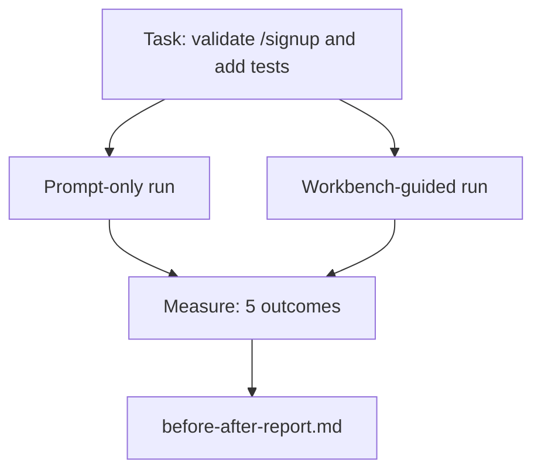

# Le bureau d'un réel référentiel

> Onze leçons de surfaces ne valent rien si elles ne survivent pas au contact avec une base de code réelle. Cette leçon remplit la même tâche deux fois sur une petite application d'échantillonnage: seulement en instantané versus sur un banc de travail.

**Type:** Build
**Languages:** Python (stdlib)
**Prerequisites:** Phases 14 · 32 to 14 · 40
**Time:** ~60 minutes

## Objectifs d'apprentissage

- Rassemblez les sept surfaces de bureau sur une petite application.
- Exécutez la même tâche deux fois (souvent en mode instantané et en mode tableau de bord) et mesurez cinq résultats.
- Lisez le rapport avant/après et décidez quelles surfaces ont donné le plus d'effet de levier.
- Défendre le bureau de travail contre un "mais mon modèle est assez bon" repoussement.

## Le problème

Une démo sur une tâche de jouet ne convainc personne. Le cas du banc de travail est fait quand une tâche réelle sur une répo réelle se produit avec moins d'échecs, moins de retours et un paquet que la prochaine session peut utiliser.

Cette leçon envoie ce référencement réel et exécute la même tâche à travers les deux pipelines.

## Le concept



### L'application d'échantillon

Un gestionnaire de style FastAPI minimal dans `sample_app/`- Le numéro de la liste:

- `app.py`avec `/signup`(pas encore validé).
- `test_app.py`avec un test de chemin de joie.
- `README.md`et `scripts/release.sh`comme appât dans la zone interdite.

### La tâche

> Ajouter une validation de l' entrée à `/signup`: rejeter les mots de passe de moins de 8 caractères, retourner 422 avec une enveloppe d'erreur typée. Ajouter un test qui prouve le nouveau comportement.

### Les deux pipelines

Pour le moment seulement:

1. Lisez le README.
2. Lire `app.py`- Je suis désolé .
3. Modifiez les fichiers.
4. La réclamation est terminée.

Guidé par un bureau de travail:

1. Exécutez le script init (leçon 35).
2. Lire le contrat de portée (leçon 36).
3. Lire l'état (leçon 34).
4. Éditer des fichiers autorisés seulement.
5. Exécutez la commande d'acceptation via le coureur de rétroaction (leçon 37).
6. Exécutez la passerelle de vérification (leçon 38).
7. Réviseur de course (leçon 39).
8. Générer des échanges (leçon 40).

### Les cinq résultats mesurés

| Outcome | Why it matters |
|---------|----------------|
| `tests_actually_run` | Most "tests passed" claims are unverifiable |
| `acceptance_met` | The test that proves the goal must be the test that ran |
| `files_outside_scope` | Scope creep is the dominant silent failure |
| `handoff_quality` | The next session pays for or benefits from this |
| `reviewer_total` | Qualitative judgment on top of the gate |

```figure
wb-ab-runs
```

## Faites-le

`code/main.py`Les deux pipelines sont scriptées (pas de LLM dans la boucle) de sorte que la mesure est reproduisable.`before-after-report.md`et `comparison.json`- Je suis désolé .

- Je vais le faire.

```
python3 code/main.py
```

Sortie: une table de console de résultats par pipeline, le rapport de détail enregistré à côté du script, et le JSON pour celui qui veut le cartographier.

## Modèles de production dans la nature

La question du sceptique est: "Combien aide réellement le bureau de travail?" Les chiffres 2026 disent beaucoup plus que l'explication.

**Terminal Bench Top-30 to Top-5 on the same model.**LangChain * Anatomie d'un harnais d'agent* (avril 2026): un agent de codage a sauté de l'extérieur des 30 premiers pour se classer au cinquième rang sur le banc de terminaux 2.0 en changeant seulement le harnais. Le même modèle. Surfaces différentes. Vingt-cinq delta de rang.

**Vercel 80% to 100% by deleting tools.**Vercel a rapporté avoir supprimé 80% des outils de son agent, déplaçant le taux de réussite de 80% à 100%.

**Harvey 2x accuracy via harness alone.**Les agents juridiques ont plus que doublé leur précision grâce à l'optimisation des harnais, aucun changement de modèle.

**88% of enterprise AI agent projects fail to reach production.**Le papier preprints.org *Harness Engineering for Language Agents* (mars 2026) trace les échecs à la durée de fonctionnement, pas au raisonnement: état obsolète, tentatives fragiles, contexte dépassé, mauvaise récupération des erreurs intermédiaires.

**Long-context collapse.**Le succès WebAgent de base de 40 à 50% tombe à moins de 10% dans les conditions de long contexte, principalement à partir de boucles infinies et la perte de but.

**False negatives still exist.**Les tâches factuelles en un seul pas, les lints en une seule ligne, les formats de mise en forme, tout ce que le modèle a mémorisé littéralement  ces tâches fonctionnent plus rapidement en temps réel seulement.

Le résultat n'est pas "le harnais gagne pour toujours". Les modèles absorbent les astuces du harnais au fil du temps.

## Utilisez-le

Cette leçon est le dossier que vous citez quand:

- Quelqu' un demande pourquoi chaque publicité porte un`agent-rules.md`et un contrat de portée.
- Une équipe veut abandonner la passerelle de vérification "pour ce sprint".
- Un nouveau produit agent est lancé et vous avez besoin d'un point de référence portable pour savoir si cela économise vraiment du temps.

Les chiffres vont plus loin que l'explication.

## La faire partir

`outputs/skill-workbench-benchmark.md`est un harnais d'évaluation portable qui utilise un produit agent à travers les deux pipelines contre l'application d'échantillon d'un projet et rapporte les cinq résultats.

## Exercices

1. Ajoutez un sixième résultat: édition significative du temps au premier. Comment le mesurer de manière propre?
2. Faites la comparaison sur une tâche de deuxième jour dans votre base de codes.
3. Ajouter un "faux négatif" passe: tâches où le prompt-only aurait été plus rapide et le coût de la table de travail est le coût réel.
4. Remplacez l'agent avec un vrai LLM.
5. Un résumé d'une page destiné à un non-ingénieur.

## Les termes clés

| Term | What people say | What it actually means |
|------|----------------|------------------------|
| Sample app | "Toy repo" | Small but realistic enough to exercise all seven surfaces |
| Pipeline | "Workflow" | Ordered sequence of surface reads/writes the agent follows |
| Before/after report | "The receipts" | The artifact you hand to a skeptic |
| False negative | "Workbench overkill" | Tasks where prompt-only is faster; useful to enumerate honestly |
| Workbench benchmark | "Reliability score" | Portable harness that runs the comparison on your codebase |

## Pour en savoir plus

- [LangChain, The Anatomy of an Agent Harness](https://blog.langchain.com/the-anatomy-of-an-agent-harness/) Résumé du banc de terminal Top-30 à Top-5
- [MongoDB, The Agent Harness: Why the LLM Is the Smallest Part of Your Agent System](https://www.mongodb.com/company/blog/technical/agent-harness-why-llm-is-smallest-part-of-your-agent-system) Numéros Vercel + Harvey
- [preprints.org, Harness Engineering for Language Agents](https://www.preprints.org/manuscript/202603.1756) 88% de taux d'échec des entreprises, causes profondes de l'exécution
- [HN: Improving 15 LLMs at Coding in One Afternoon. Only the Harness Changed](https://news.ycombinator.com/item?id=46988596) répliqué sur 15 modèles
- [Cloudflare, Orchestrating AI Code Review at Scale](https://blog.cloudflare.com/ai-code-review/) 131 000 épreuves de révision / 30 jours de production
- [Anthropic, Building Effective Agents](https://www.anthropic.com/research/building-effective-agents)
- Les phases 14 · 32 à 14 · 40  les surfaces de cette leçon
- Phase 14 · 19  SWE-bench, GAIA, AgentBench comme les critères de référence macro cette leçon complète
- Phase 14 · 30  développement d'un agent axé sur l'évaluation des mêmes prises de harnais dans
