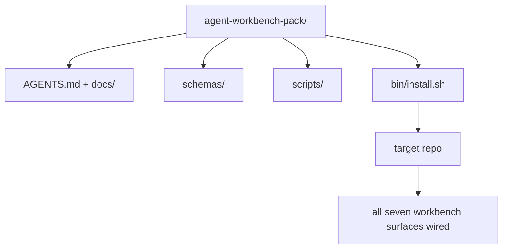

# Capstone: expédier un pack de travail d'agent réutilisable

> La mini-track se termine par un paquet que vous laissez dans n'importe quel repo.`cp -r`Le capstone est l'artefact sur lequel ce programme est basé.

**Type:** Build
**Languages:** Python (stdlib)
**Prerequisites:** Phases 14 · 31 to 14 · 41
**Time:** ~75 minutes

## Objectifs d'apprentissage

- Emballez les sept surfaces de bureau dans un répertoire.
- Pin les schémas, scripts et modèles afin qu'un nouveau repo ait une base connue.
- Ajoutez un script d'installation unique qui dépose le pack idempotemment.
- Décidez ce qui reste dans le sac et ce qui reste dehors, en défendant la coupe pour chacun.

## Le problème

Un tableau de travail qui vit dans un Google Doc, un historique de chat et trois scripts à moitié mémorisés est un tableau de travail qui est reconstruit tous les trimestres. Le remède est un pack de versions: un répo ou un répertoire avec les surfaces, les schémas, les scripts et un installateur d'une seule commande.

Vous terminerez cette leçon avec `outputs/agent-workbench-pack/`livré sur disque et un `bin/install.sh`qui le met dans n'importe quel repo cible.

## Le concept



### L'état de l'emballage

```
outputs/agent-workbench-pack/
├── AGENTS.md
├── docs/
│   ├── agent-rules.md
│   ├── reliability-policy.md
│   ├── handoff-protocol.md
│   └── reviewer-rubric.md
├── schemas/
│   ├── agent_state.schema.json
│   ├── task_board.schema.json
│   └── scope_contract.schema.json
├── scripts/
│   ├── init_agent.py
│   ├── run_with_feedback.py
│   ├── verify_agent.py
│   └── generate_handoff.py
├── bin/
│   └── install.sh
└── README.md
```

### Ce qui reste, ce qui reste

Dans:

- Des schémas de surface, c'est le contrat.
- Les quatre scénarios ci-dessus, c'est le temps de course.
- Les quatre documents, ce sont les règles et la rubrique.

À l' extérieur:

- Les tâches sont sur le tableau de référencement cible, pas dans le paquet.
- Le fournisseur appelle le SDK.
- Le groupe vit à côté de l'équipe, pas à l'intérieur.

### L'installateur

Un court`bin/install.sh`(ou `bin/install.py`):

1. Refuse d' installer sur un emballage existant sans `--force`- Je suis désolé .
2. Il copie le paquet dans le référentiel cible.
3. - Le câble s' est allumé`.github/workflows/`Il existe.
4. Imprime les étapes suivantes: remplissez le tableau, définissez les commandes d'acceptation, exécutez le script init.

### Rédaction de versions

Le paquet est équipé d' un`VERSION`Les modifications de schéma et de script nécessitant des migrations font des modifications majeures.`agent_state.json`enregistrement de la version du pack à laquelle il a été initialisé.

```figure
wb-pack-install
```

## Faites-le

`code/main.py`assemble l' emballage en `outputs/agent-workbench-pack/`à côté de la leçon, avec les schémas et scénarios des leçons précédentes dans cette mini-track et les documents que vous avez déjà écrits.

- Je vais le faire.

```
python3 code/main.py
```

Le script copie et pinne les surfaces, écrit le README, imprime l'arbre de pack et sort de zéro.

## Modèles de production dans la nature

Un paquet n'est précieux que s'il survit à des fourches, à des mises à jour et à une situation hostile en amont.

**`VERSION` is the contract, not the marketing.**Les gros bosses nécessitent une migration d'état. Les petits bosses nécessitent une vérification récurrente. Les bosses de patch sont uniquement documentaires.`.workbench-version`dans le repo cible à chaque installation; `lint_pack.py`refuse d'expédition si la serrure de la cible ne correspond pas à celle du colis `VERSION`C' est comme ça .`npm`- Je suis là .`Cargo`, et `pyproject.toml`Survivre à 10 ans de churn, rien sur les agents ne change les règles.

**Single source for cross-tool distribution.**Nx vaisseaux un `nx ai-setup`qui détermine`AGENTS.md`- Je suis là .`CLAUDE.md`- Je suis là .`.cursor/rules/`- Je suis là .`.github/copilot-instructions.md`Le pack doit faire la même chose; l'installateur émet les liens symboliques (`ln -s AGENTS.md CLAUDE.md`Il est donc impossible de faire une seule source de vérité pour chaque agent de codage.

**`uninstall.sh` that refuses on non-trivial state.**La désinstallation du pack ne doit pas supprimer les données de l'utilisateur `agent_state.json`- Je suis là .`task_board.json`ou `outputs/`Le désinstalleur supprime les schémas, scripts, documents, et `AGENTS.md`(avec `--keep-agents-md`L'État appartient à l'utilisateur; le paquet ne le possède pas.

**Skill-as-publishable. SkillKit-style distribution.**Les paquets sont des compétences de SkillKit: `skillkit install agent-workbench-pack`Le pack repo est la source de vérité; SkillKit est le canal de distribution. Le verrouillage du fournisseur s'effondre; les sept surfaces restent les mêmes.

## Utilisez-le

Trois places où les paquets vont:

- **As a directory you drop into a repo.** `cp -r outputs/agent-workbench-pack /path/to/repo`- Je suis désolé .
- **As a public template repo.**Forge et personnalisation, avec `VERSION`- Je contrôle la dérive.
- **As a SkillKit skill.**Cable dans votre produit agent pour qu'une seule commande le dépose.

Le paquet est la recette, chaque installation est une portion.

## La faire partir

`outputs/skill-workbench-pack.md`génère un ensemble de projets: règles affinées en fonction de l'historique de l'équipe, globes de portée correspondant au repo, dimensions de rubrique étendues avec une entrée spécifique au domaine.

## Exercices

1. Décidez quel cinquième document doit être promu au sein du groupe canonique.
2. Réécrire l'installateur en Python avec un `--dry-run`Comparez l'ergonomie avec la bash.
3. Ajouter un `bin/uninstall.sh`Il est important de savoir si les dossiers de l'État ont des antécédents non triviaux.
4. Ajouter un `lint_pack.py`qui échoue lorsque le colis dérive de `VERSION`- Envoyez-le à l'IC pour le repos du groupe.
5. L'auteur du manuel de migration d'un bureau roulé à la main à ce paquet.

## Les termes clés

| Term | What people say | What it actually means |
|------|----------------|------------------------|
| Workbench pack | "The starter kit" | A versioned directory carrying all seven surfaces |
| Installer | "Setup script" | `bin/install.sh` that lays the pack down idempotently |
| Pack version | "VERSION" | Major bumps for schema/script changes, patch for doc-only |
| Drop-in pack | "cp -r and go" | Pack works without per-repo customization on day one |
| Forkable template | "GitHub template" | Public repo that GitHub's "Use this template" can clone from |

## Pour en savoir plus

- Les phases 14 · 31 à 14 · 41  chaque surface que cette boîte regroupe
- [SkillKit](https://github.com/rohitg00/skillkit) installer cette compétence sur 32 agents d'IA
- [Nx Blog, Teach Your AI Agent How to Work in a Monorepo](https://nx.dev/blog/nx-ai-agent-skills) Générateur à source unique sur six outils
- [agents.md — the open spec](https://agents.md/) ce que doit mettre en œuvre le routeur de votre paquet
- [HKUDS/OpenHarness](https://github.com/HKUDS/OpenHarness) mise en œuvre de référence d'un équivalent de conditionnement
- [andrewgarst/agentic_harness](https://github.com/andrewgarst/agentic_harness) Références réutilisées avec suite eval
- [Augment Code, A good AGENTS.md is a model upgrade](https://www.augmentcode.com/blog/how-to-write-good-agents-dot-md-files) les documents de package
- [Anthropic, Effective harnesses for long-running agents](https://www.anthropic.com/engineering/effective-harnesses-for-long-running-agents)
- [Anthropic, Harness design for long-running application development](https://www.anthropic.com/engineering/harness-design-long-running-apps)
- Phase 14 · 30  Développement d'un agent axé sur l'évaluation qui consomme la passerelle de vérification du paquet
- La phase 14 · 41  le rapport avant/après ce pack s'améliore sur
