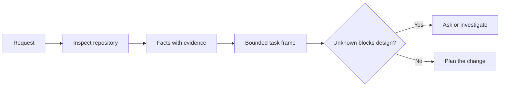

# Réglez la tâche avant que l'agent n'écrive le code

> Un codeur peut mettre en œuvre une tâche claire rapidement. Il peut aussi mettre en œuvre une tâche non claire rapidement. La vitesse est la même. Le coût n'est pas.

**Type:** Learn + Build
**Languages:** Python (stdlib)
**Prerequisites:** Phase 14 lessons 31 and 36
**Time:** ~60 minutes

## Objectifs d'apprentissage

- Transformer une demande en un cadre de tâches limité avant de la modifier.
- Séparer les faits du référentiel des hypothèses et des questions ouvertes.
- Définir les chemins autorisés, les chemins interdits et les preuves d'acceptation.
- Décidez quand la reconnaissance est suffisante pour commencer à travailler.

## L'échec coûteux

 Ajouter une protection par courrier électronique dupliquée semble spécifique. Ce n'est pas le cas. L'unicité appartient-elle à l'API, au service de domaine ou à la base de données? Est-ce que la comparaison est sensible aux cas? Quelle forme d'erreur est déjà publique? Est-ce qu'une migration est autorisée? Quel test prouve le comportement?

Un agent compétent comblera ces lacunes avec des choix plausibles.

La première unité de travail de codeur n'est donc pas une modification, mais un cadre de tâches soutenu par des données de référentiel.

## Le cadre des tâches

Un cadre utile comporte six champs:

| Field | Question |
|---|---|
| Goal | What observable behavior must change? |
| Repository facts | What did you verify in code, tests, config, or history? |
| Allowed paths | Where may the change land? |
| Forbidden paths | What must remain untouched? |
| Acceptance evidence | Which commands or observations prove the goal? |
| Unknowns | Which decisions still need evidence or human judgment? |

Les faits ont besoin de reçus. L'API utilise 409 pour les duplicates n'est pas un fait tant que vous ne pouvez pas indiquer le test ou le gestionnaire existant. Un chemin de fichier et une ligne suffisent. Un résultat de commande est meilleur lorsque le comportement compte.



## La reconnaissance est une recherche de contraintes

Ne lisez pas l'ensemble du référentiel.

1. Le comportement actuel et son appelant.
2. Le test le plus proche.
3. Le contrat public ou la forme sérialisée.
4. Les instructions du projet qui régissent le chemin.
5. Les commandes de construction et de vérification.
6. Des modifications similaires qui révèlent des schémas locaux.

Arrêtez quand chaque décision prévue est soit appuyée par des preuves, explicitement déléguée, ou répertoriée comme inconnue.

## Les inconnus ne sont pas des échecs

Une hypothèse est une réponse incontrôlée à cette lacune.

Classifier chaque inconnu:

- **Discoverable:**le référentiel ou le système d'exploitation peut répondre.
- **Decidable:**le contrat de tâche confère au mandataire le pouvoir de choisir.
- **Human:**le choix modifie le comportement du produit, le coût, le risque ou la compatibilité avec le public.
- **Deferred:**Le choix est en dehors de cette tranche et appartient à des non-objectifs.

L'agent doit continuer à parcourir les inconnus découvertables et délégués, il doit s'arrêter sur les inconnus humains avant que le choix ne soit enterré dans le code.

## Acceptation avant mise en œuvre

Écrivez la preuve avant le patch.

- une commande d'essai d'unité ou d'intégration centrée;
- un parcours de navigateur avec un point de vue nommé et l'état attendu;
- une demande par voie électronique et un contrat de réponse exacte;
- une mesure de performance avec un seuil;
- une vérification de la portée qui confirme qu'aucun fichier non lié n'a été modifié.

Le test de réussite  n'est pas un plan de preuve.

## Faites-le

Le laboratoire crée une`TaskFrame`, valide ses limites et ses preuves, et écrit `outputs/task-frame.md`- Je suis désolé .

Retournez dans ce répertoire de leçons:

```bash
python3 code/main.py
python3 -m unittest discover code/tests -v
```

Décomposez l'exemple de quatre façons: supprimez l'objectif, supprimez un reçu de facteur, chevauchez un chemin autorisé et interdit, et supprimez la commande d'acceptation.

## Utilisez- le dans un réel entrepôt

Avant de demander à un agent de modifier:

1. Écrivez l'objectif comme un comportement, pas un changement de fichier.
2. Enregistrez deux ou trois faits avec des preuves exactes.
3. Nommez le plus petit ensemble de chemins autorisé.
4. Nommez explicitement l'espace négatif.
5. Écrivez la commande ou l'observation qui clôture la tâche.
6. Faites une liste des décisions que vous n'avez pas encore prises.

Le cadre doit s'adapter à un écran. Si ce n'est pas le cas, la tâche peut contenir plusieurs modifications vérifiables indépendamment.

## Exercices

1. Encadrez un vrai bug dans un de vos référentiels sans proposer une solution.
2. Trouvez une affirmation dans le cadre qui est en fait une hypothèse.
3. Ajoutez un humain inconnu dont la réponse changerait le contrat public.
4. Partagez un large chemin permis dans le plus petit ensemble de sécurité.
5. Ajouter un reçu de champ à la preuve d'acceptation.

## Pour en savoir plus

- [Nuseibeh and Easterbrook, Requirements Engineering: A Roadmap](https://www.cs.toronto.edu/~sme/papers/2000/ICSE2000.pdf), pour ancrer la mise en œuvre aux objectifs du monde réel et aux contraintes en évolution.
- [Yang et al., SWE-agent: Agent-Computer Interfaces Enable Automated Software Engineering](https://arxiv.org/abs/2405.15793), pour prouver que l'interface autour d'un agent de codage modifie son efficacité.

## Ce que vous gardez

Je le garde .`outputs/task-frame.md`Il est l'entrée de la prochaine leçon, où le cadre devient un plan d'exécution fondé sur des preuves.
